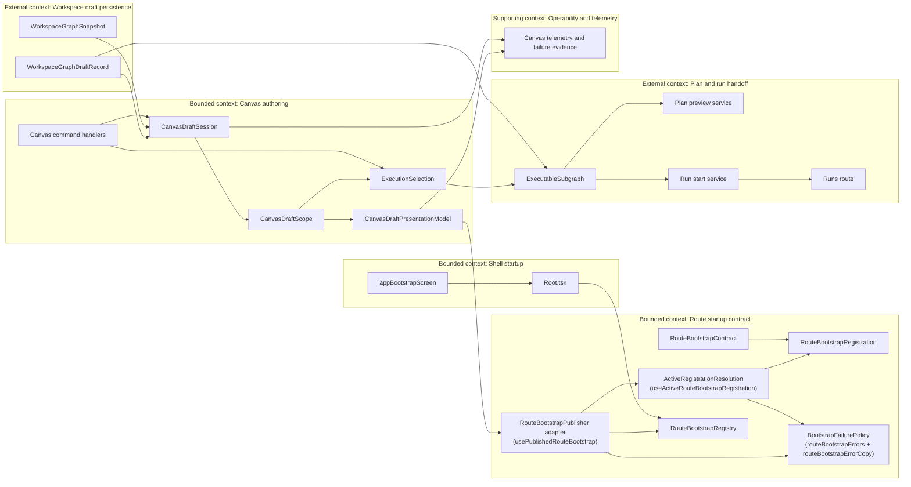
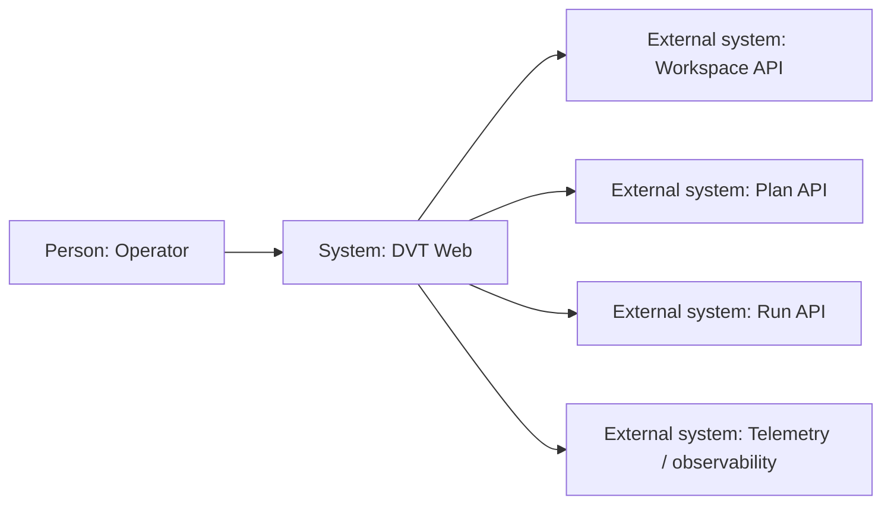
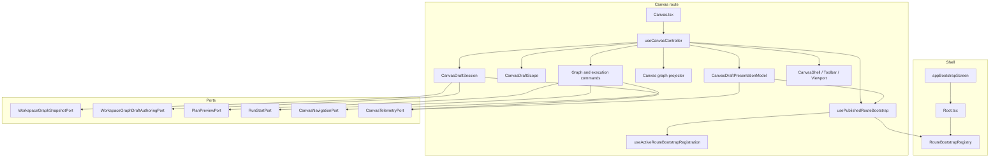
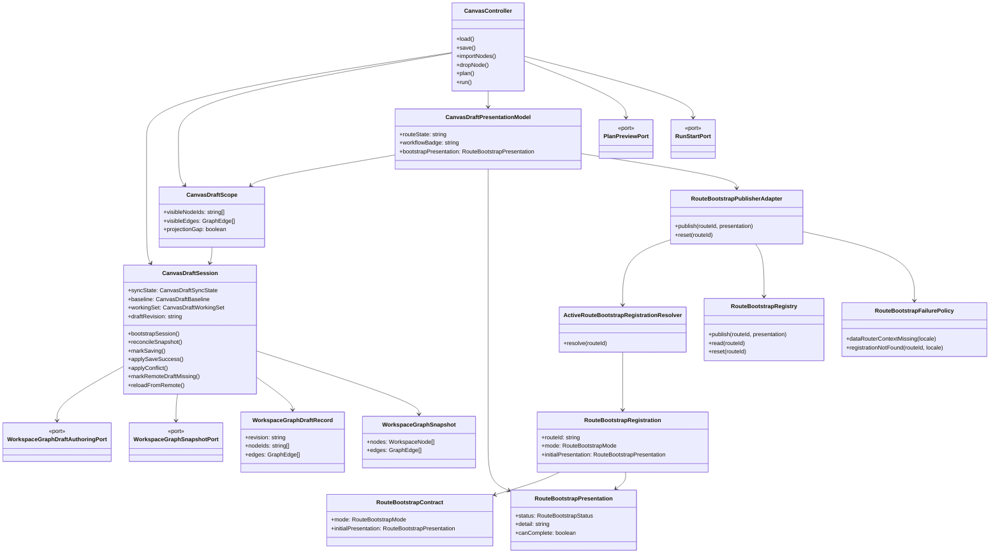
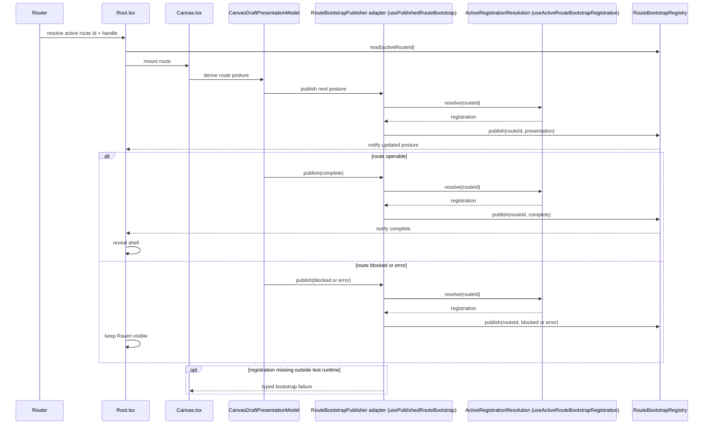
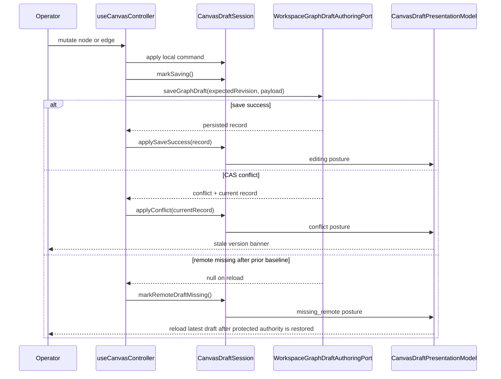
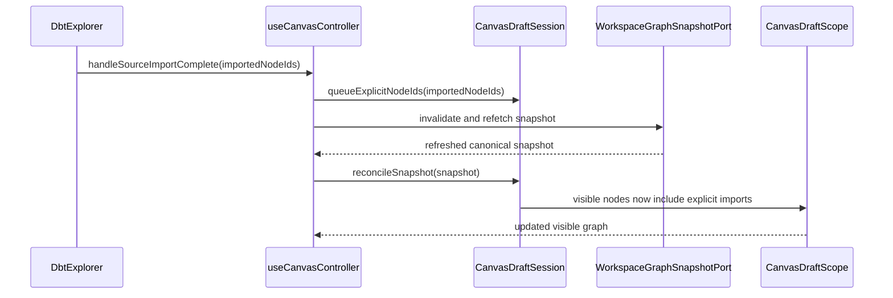
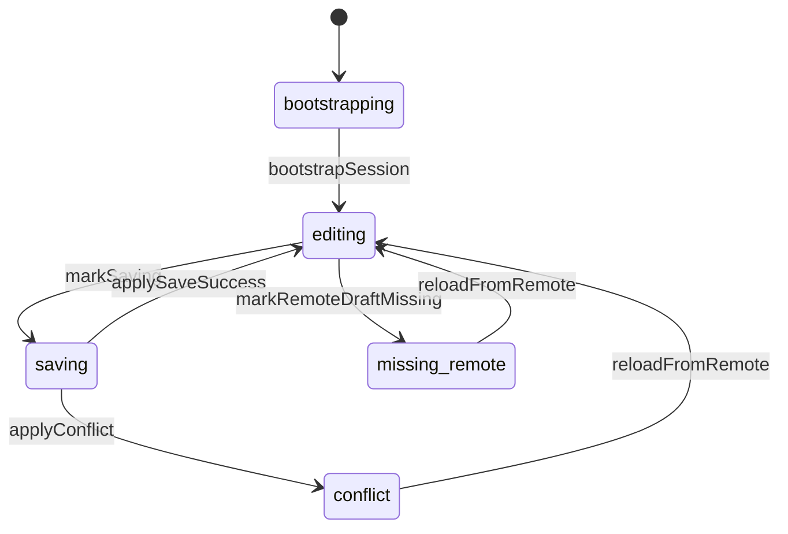
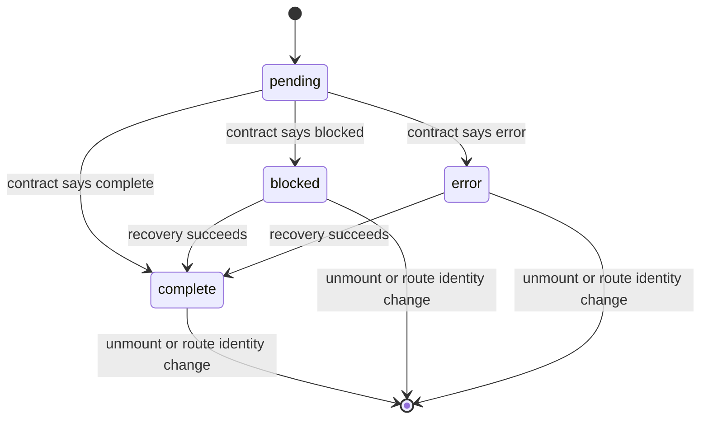

# TF-E2 Canvas Target Architecture Execution Plan 2026-04-17

## Summary

This proposal turns the current TF-E2 architecture pack and the 2026-04-17
deep architectural review into one executable implementation plan.

It does not replace the current TF-E2 scope definition. It complements it.
The purpose is to stop re-opening the same design questions while the Canvas
slice is still being productized.

The working assumption is explicit: do not rewrite the current runtime in one
pass. The target architecture must be reached by seam extraction, ownership
clarification, small reviewable slices, and one hard cut on the active
authoring path once the typed port is ready.

## 2026-05-14 Parent Closure

`TF-E2` is closed as a parent architecture execution plan. Its child slices
landed the seam-first hard cut, protected draft-authoring port adoption,
route-owned Inspector lifecycle, selected-closure proof, first-authoring live
proof, startup readiness, denied-posture handling, and architecture guardrails
that keep the active Canvas path off the legacy projected DTO.

This document remains the historical target architecture and traceability map.
New work must not reopen `TF-E2` implicitly; persisted-version compatibility,
additional live-runtime matrices, or broader Canvas UX follow-ups require their
own planning DB task and governing evidence.

## Governing sources

- `AGENTS.md`
- `docs/planning/status/governance-document-rule-inventory.md`
- `docs/guides/ai-work-protocol.md`
- `docs/planning/state/planning-control-tower.md`
- `docs/planning/state/agent-lane-e.yaml`
- `docs/architecture/reference-architecture.md`
- `docs/concepts/domain-language.md`
- `docs/adr/ADR-0003-execution-model.md`
- `docs/adr/ADR-0034-bounded-context-boundaries-and-communication-rules.md`
- `docs/planning/proposals/mandatory/frontend-and-ux/tf-e2-production-node-authoring-and-persistence-plan-20260416.md`
- `docs/planning/reviews/20260417-dvt-plus-deep-architectural-review.md`
- `docs/planning/reviews/architecture-and-governance/20260422-canvas-runtime-truth-hardcut-review.md`
- `docs/architecture/components/web/frontend-data-boundary-architecture.md`
- `docs/architecture/components/web/graph/graph-frontend-architecture.md`
- `docs/architecture/components/web/graph/graph-route-bootstrap-architecture.md`
- `docs/architecture/components/web/graph/canvas-controller-current-to-target-architecture.md`
- `docs/architecture/components/web/graph/canvas-component-map-and-modernization-review.md`

## Relationship To Current Canon

- The existing TF-E2 plan remains the parent proposal for scope, dependency
  chain, and high-level functional closure.
- The graph architecture pack remains the technical target description.
- `graph-route-bootstrap-architecture.md` is the canonical source for bootstrap
  invariants, route classification, and acceptance posture.
- The deep review remains the rationale and risk intake.
- This document is the execution companion that converts those sources into
  phased work, user stories, bounded contexts, ports, and acceptance slices.

## Current Branch Baseline After 2026-04-20 Sync

- `origin/main` already includes the execution-actions test split landed by
  `test(web): Split canvas execution action tests by responsibility (#984)`.
  Test-file sharding is baseline, not remaining TF-E2 work.
- `origin/main` already includes the Lane E backlog alignment landed by
  `docs(docs): Align lane E remediation backlog (#985)`.
- The current branch now exposes `IWorkspaceGraphDraftAuthoringPort` through
  the composition root in `AppServices`.
- The active Canvas authoring read and write path now routes through
  `canvasDraftRepository` over `IWorkspaceGraphDraftAuthoringPort`, while
  `IWorkspacePort` remains the snapshot and artifact-read boundary.
- Save attempts still build governed `DesignGraphDraft` payloads before hitting
  the protected draft-authoring boundary, so the active edit model remains
  compile-shaped and cannot yet represent graph-first incomplete authoring
  states such as "first node on an empty Canvas".
- Preview and run handoff must now route through explicit
  `ExecutionSelection` and an `ExecutableSubgraph` projection. A loose node
  outside the selected dependency closure must not block a selected runnable
  SQL node.
- The projected `WorkspaceGraphDraft` DTO still survives as a route-local
  projection and test read model, but it is no longer the active-authoring
  authority on the Canvas read/write path.
- The 2026-04-22 runtime-truth review freezes the next no-legacy decision:
  active Canvas authoring must fail closed on protected-runtime absence and
  must not preserve snapshot-backed or mock-backed startup semantics.
- The test strategy is now explicit as well:
  API integration tests are producer truth for the protected runtime contract,
  web Vitest suites are route and consumer truth, and browser-level back/front
  proof belongs to one live-runtime Cypress lane without `cy.intercept` on the
  authoring contract.
- Therefore the follow-up closure work was not another compatibility layer
  around the projected DTO. It is the authoring-draft contract reset across
  `TF-A2`, `TF-C4`, and `TF-E2-A`, followed by graph-first empty-state entry,
  route-owned Inspector editing, and execution handoff proof.

## Problem Statement

The repository now has enough architecture and review material to describe the
direction of the Canvas slice, but not yet one canonical artifact that makes
the remaining work directly executable.

Without that companion plan, the team can still land locally correct fixes that
do not converge on the same target:

1. route bootstrap can improve without clarifying long-term publisher
   ownership or SRP boundaries
2. Canvas draft hardening can continue without a closed definition of the
   aggregate root, upstream authority, and downstream projection seams
3. Inspector, plan, run, and operability work can move in parallel without one
   agreed backlog order or one set of architectural exit criteria

The problem is no longer "what is the architecture". The problem is "how to
arrive there without another round of implicit local decisions".

## Decision

Adopt a seam-first, hard-cut migration plan for the remaining TF-E2 work.

Rules for execution:

- no big-bang rewrite of the Canvas route
- no new frontend-local persistence contract
- no reintroduction of React Flow or `localStorage` as semantic authority
- no dual active authoring path once the typed draft-authoring port is ready
- no new startup or operability path that bypasses the route bootstrap
  contract
- the active Canvas authoring path must cut over to
  `IWorkspaceGraphDraftAuthoringPort`
- the legacy projected `WorkspaceGraphDraft` DTO is not an accepted authority
  for active Canvas authoring after `TF-E2-A`
- future slices must map to the bounded contexts, ports, aggregates, and
  sequences frozen in this document

## Bootstrap Ownership Decision

- Explicit registration ownership is a current implementation requirement for
  every `published` route.
- `usePublishedRouteBootstrap` must publish through one explicit registration
  resolved by `useActiveRouteBootstrapRegistration`; publication by shared
  active-match fallback is not an accepted implementation shape.
- Future work may strengthen enforcement through more contract tests or review
  gates, but it must not relax route-id-bound publication semantics.

## Execution Principles

### 1. One source of truth per concern

- workspace snapshot is authoritative for canonical graph members
- remote draft record is authoritative for persisted draft baseline
- `CanvasDraftSession` is authoritative for in-flight authoring truth in the
  route
- the startup contract stack is authoritative for route startup posture:
  `routeBootstrapContract` + `routeBootstrapRegistration` +
  `routeBootstrapRegistry`

### 2. Projection is not authority

React Flow, toolbar badges, and route-local view state are projections over
read models and aggregates. They are not semantic owners.

### 3. Mount is not settled

A route that mounts is not automatically operable. Operability is published
through a route startup contract.

### 4. Keep the protected backend contract stable while replacing the active frontend seam

The protected backend surface remains stable during this plan, but the active
Canvas authoring path in `apps/web` does not. `IWorkspacePort.getGraphDraft`
and `saveGraphDraft` are a legacy projected seam for the active route. The
target seam for active authoring is `IWorkspaceGraphDraftAuthoringPort`.

### 5. Prefer seam extraction before deletion, but do not preserve dual active paths

Introduce read models, registries, and publishers beside existing code. Move
callers. Remove the old active path as soon as the new typed seam already
carries validation. Do not keep dual active authoring paths alive for comfort.

## Ubiquitous Language

| Term                     | Meaning in this plan                                                                                     |
| ------------------------ | -------------------------------------------------------------------------------------------------------- |
| `canonical snapshot`     | The current graph members returned by the workspace boundary.                                            |
| `draft baseline`         | The last authoritative persisted draft revision known by the route.                                      |
| `working set`            | The node and edge subset currently being authored in Canvas.                                             |
| `projection gap`         | The draft references members that the current canonical snapshot cannot yet project.                     |
| `route startup contract` | The shell-facing publication of route startup posture keyed by `route.id`.                               |
| `published route`        | A route that derives and publishes `pending`, `blocked`, `error`, or `complete` from its own read model. |
| `static route`           | A route whose first useful surface is already correct at mount time.                                     |
| `composition root`       | The component or module that wires adapters and route/application seams without owning domain rules.     |

## DDD Context Map

The target architecture for TF-E2 spans five bounded contexts and two adjacent
external contexts.

### Context responsibilities

| Context                       | Owns                                                                            | Must not own                                           |
| ----------------------------- | ------------------------------------------------------------------------------- | ------------------------------------------------------ |
| `Shell startup`               | Raven reveal, step progress, active-route consumption                           | Canvas domain logic, draft reconciliation              |
| `Route startup contract`      | `route.id`, startup mode, published posture lifecycle, typed bootstrap failures | graph truth, toolbar UX, route query logic             |
| `Canvas authoring`            | draft aggregate, scope projection, command validation, recovery posture         | backend persistence semantics beyond the governed port |
| `Workspace draft persistence` | authoritative snapshot and persisted draft record                               | route-local view state                                 |
| `Plan and run handoff`        | plan preview and run start contracts                                            | graph authoring rules                                  |
| `Operability and telemetry`   | failure evidence, correlation, diagnosis support                                | route truth or command semantics                       |

## Composition Roots

This target architecture uses explicit composition roots.

| Composition root      | Scope                  | Responsibility                                                                       |
| --------------------- | ---------------------- | ------------------------------------------------------------------------------------ |
| `AppServicesProvider` | app-wide               | Wire backend-facing adapters behind ports                                            |
| `Root.tsx`            | shell-wide             | Consume the active-route bootstrap contract and reveal the shell                     |
| `Canvas.tsx`          | route-wide             | Bind route presentation, React Flow provider, modals, and workbench shell            |
| `useCanvasController` | route application seam | Assemble query, aggregate, projection, navigation, and action seams into route props |

## Aggregate Roots And Domain Ownership

This plan intentionally keeps the number of frontend aggregate roots small.

### Owned aggregate root: `CanvasDraftSession`

`CanvasDraftSession` is the aggregate root for route-local authoring truth.

Owned state:

- `syncState`
- `baseline`
- `draftRevision`
- `workingSet.visibleNodeIds`
- `workingSet.visibleEdges`
- `workingSet.pendingExplicitNodeIds`

Owned invariants:

- new canonical members never auto-enter the working set without an explicit
  route action or authoritative remote reload
- save transitions are CAS-aware and fail closed on stale writes
- `missing_remote` blocks mutation until authoritative remote reload
- members missing from the canonical snapshot are either pruned or represented
  as a projection-gap posture, never silently invented

### Owned startup contract model: `RouteBootstrapRegistration`

`RouteBootstrapRegistration` is the typed startup-contract model for the active
route. It is not treated as a frontend aggregate root in the SRP-split
bootstrap implementation.

Owned state:

- `routeId`
- `mode`
- `initialPresentation`

Owned invariants:

- registration binds one explicit `routeId` and startup mode from route handle
  metadata
- registration does not own mutable publication lifecycle state
- publication lifecycle is owned by `RouteBootstrapRegistry` through publisher
  adapters and is monotonic while the same route instance remains mounted
- reset occurs only on unmount or route identity change
- a route without an explicit contract fails closed

### External upstream aggregates

These are important to the plan but are not frontend-owned aggregate roots:

| Aggregate                   | Owner                      | Frontend posture                                       |
| --------------------------- | -------------------------- | ------------------------------------------------------ |
| `WorkspaceGraphDraftRecord` | workspace backend boundary | consumed as authoritative persisted baseline           |
| `WorkspaceGraphSnapshot`    | workspace backend boundary | consumed as authoritative canonical member set         |
| `ExecutionPlan`             | planner / backend boundary | consumed as output of plan-preview and run-start flows |

## Port Inventory

The target architecture keeps backend ports stable and clarifies internal ports:

### Current SRP anchors for route startup contract

- contract factory and types: `apps/web/src/app/bootstrap/routeBootstrapContract.ts`
- typed registration extraction: `apps/web/src/app/bootstrap/routeBootstrapRegistration.ts`
- publication store: `apps/web/src/app/bootstrap/routeBootstrapRegistry.ts`
- active registration resolution:
  `apps/web/src/app/bootstrap/useActiveRouteBootstrapRegistration.ts`
- published-route adapter:
  `apps/web/src/app/bootstrap/usePublishedRouteBootstrap.ts`
- typed failure policy:
  `apps/web/src/app/bootstrap/routeBootstrapErrors.ts` +
  `apps/web/src/app/bootstrap/routeBootstrapErrorCopy.ts`

- `WorkspaceGraphSnapshotPort` (external)
  current anchor: `IWorkspacePort.getGraph`
  target role: read canonical graph members.
- `WorkspaceGraphDraftAuthoringPort` (external)
  current anchor:
  `apps/web/src/app/ports/workspaceGraphDraftAuthoring.ts` +
  `apps/web/src/app/services/workspace/workspaceGraphDraftAuthoring.api.ts`
  target role: read/write the protected typed draft contract with CAS,
  capability, schema, and audit semantics.
- `WorkspaceGraphDraftLegacyProjectionPort` (external, transitional only)
  current anchor: `IWorkspacePort.getGraphDraft` and `saveGraphDraft`
  target role: legacy projected DTO surface scheduled for removal from the
  active Canvas authoring path.
- `PlanPreviewPort` (external)
  current anchor: `plansService`
  target role: preview the current authoring scope.
- `RunStartPort` (external)
  current anchor: `runsService`
  target role: start an execution from canonical authoring truth.
- `RouteBootstrapRegistryPort` (internal)
  current anchor: `routeBootstrapRegistry.ts`
  target role: shell-facing startup registry keyed by `route.id`.
- `RouteBootstrapPublisherPort` (internal)
  current anchor: `usePublishedRouteBootstrap.ts`
  target role: publish posture for one explicit `route.id` registration.
- `ActiveRouteBootstrapRegistrationPort` (internal support seam)
  current anchor: `useActiveRouteBootstrapRegistration.ts`
  target role: resolve one typed registration for the active `route.id`.
- `CanvasNavigationPort` (internal)
  current anchor: `useNavigate` in route code
  target role: isolate route-only handoff side effects.
- `CanvasTelemetryPort` (internal)
  current anchor: currently mixed across route code and logs
  target role: capture correlation-aware failure evidence and degraded posture.

### Port rules

- backend ports remain the only path to canonical snapshot and persisted draft
  authority
- internal ports must not smuggle domain truth through generic hooks or
  pathname heuristics
- the publisher port is an adapter seam, not a domain model

### Publisher binding to current implementation

In this plan, `RouteBootstrapPublisher` is an architectural role name, not a
new class to introduce by default.

Current concrete binding:

- publication adapter: `usePublishedRouteBootstrap.ts`
- active registration resolution: `useActiveRouteBootstrapRegistration.ts`
- publication store: `routeBootstrapRegistry.ts`
- registration contract source: `routeBootstrapRegistration.ts` and
  `routeBootstrapContract.ts`
- failure taxonomy and copy:
  `routeBootstrapErrors.ts` and `routeBootstrapErrorCopy.ts`

## C4 Component View

### Level 2: Frontend system in its immediate environment

### Level 3: Canvas route component view

## Class Relationship Diagram

## Canonical Sequences

### Sequence 1: Published route startup and shell reveal

### Sequence 2: Draft save with CAS conflict and recovery

### Sequence 3: Import and explicit node admission

## State Machines

### `CanvasDraftSession`

### Published route startup lifecycle

Rule: a mounted published route does not bounce back to its initial
presentation during normal updates.

## User Stories

### Authoring and persistence

1. As a write-authorized operator, I can add, connect, move, and edit nodes so
   the persisted draft survives reload without relying on browser-local state.
2. As a write-authorized operator, I can import new graph members and see only
   the members I explicitly admitted into the draft working set.
3. As a write-authorized operator, I can recover safely from a stale save
   conflict without silent overwrite.

### Recovery and governance

1. As a read-only operator, I can inspect the graph and draft posture without
   being shown fake edit affordances.
2. As an operator, if the remote draft disappears after I had a baseline, the
   route blocks mutation and asks me to reload the authoritative remote draft;
   it does not reopen editing from projected local state.
3. As a shell user, I do not see the route as ready until the active route
   explicitly publishes that it is operable.

### Plan, run, and diagnosis

1. As an operator, plan preview and run start consume the same canonical
   authoring truth that the Canvas route shows.
2. As an operator under failure, I see conflict, missing-remote, projection
   gap, and backend-blocked states as explicit product postures.
3. As a maintainer, I can reason about route startup and draft recovery through
   stable diagrams, ports, and aggregates instead of tracing hidden hook logic.

## Epic Story Map

| Epic         | Goal                                              | Stories                               |
| ------------ | ------------------------------------------------- | ------------------------------------- |
| `EPIC-E2-01` | Freeze startup and authoring ownership boundaries | `US-E2-001`, `US-E2-002`              |
| `EPIC-E2-02` | Close canonical draft persistence behavior        | `US-E2-003`, `US-E2-004`, `US-E2-005` |
| `EPIC-E2-03` | Productize graph mutations and inspector edits    | `US-E2-006`, `US-E2-007`, `US-E2-008` |
| `EPIC-E2-04` | Close operability, diagnosis, and proof matrix    | `US-E2-009`, `US-E2-010`              |

### Executable user stories

| Story ID    | Story                                                                                                   | Bounded context                          | Acceptance contract                                                                                |
| ----------- | ------------------------------------------------------------------------------------------------------- | ---------------------------------------- | -------------------------------------------------------------------------------------------------- |
| `US-E2-001` | As a shell user, route reveal depends on explicit route startup publication keyed by `route.id`.        | shell startup + route startup contract   | No implicit fallback startup for published routes; non-published routes must be explicit `static`. |
| `US-E2-002` | As a maintainer, route startup publication is monotonic for one mounted route instance.                 | route startup contract                   | No reset during same route instance; reset only on unmount or route identity change.               |
| `US-E2-003` | As a write-authorized operator, draft saves are CAS-aware and fail closed on stale revision.            | Canvas authoring                         | Conflict posture is explicit and blocks silent overwrite.                                          |
| `US-E2-004` | As a write-authorized operator, missing remote draft after baseline produces explicit recovery posture. | Canvas authoring                         | `missing_remote` state blocks mutation until authoritative remote reload succeeds.                 |
| `US-E2-005` | As a read-only operator, I can inspect graph truth while mutation controls remain explicitly gated.     | Canvas authoring + workspace persistence | Read-only posture is explicit; no fake save affordance.                                            |
| `US-E2-006` | As a write-authorized operator, node and edge lifecycle operations persist and survive hard reload.     | Canvas authoring + workspace persistence | create/delete/move/reconnect round-trip through canonical draft boundary.                          |
| `US-E2-007` | As a write-authorized operator, Inspector edits use the same aggregate and ports as graph commands.     | Canvas authoring                         | property edits, validation, save/cancel, and reload share one draft authority.                     |
| `US-E2-008` | As an operator, plan preview and run start consume the same route scope shown in Canvas.                | Canvas authoring + plan/run handoff      | no plan or run path reads visual-only or stale scope.                                              |
| `US-E2-009` | As an operator under failure, I can correlate route failure posture with backend evidence.              | operability and telemetry                | explicit failure taxonomy + correlation-aware evidence path.                                       |
| `US-E2-010` | As a delivery owner, I can release TF-E2 only with unit, integration, and Cypress negative-path proof.  | operability and telemetry                | proof matrix includes conflict, missing-remote, invalid edge, read-only, and startup blocking.     |

## Target Backlog

The backlog below is executable, but it is not a promise of calendar dates.
It is the canonical order and acceptance posture.

| Backlog ID   | Maps to lane task | Slice                              | Output                                                                                                           |
| ------------ | ----------------- | ---------------------------------- | ---------------------------------------------------------------------------------------------------------------- |
| `E2-ARCH-01` | `TF-E2-A`         | Route bootstrap registry hardening | split contract, registration, registry, and publisher ownership with explicit `route.id` publication             |
| `E2-ARCH-02` | `TF-E2-A`         | Typed authoring port adoption      | move active Canvas draft reads and writes to `IWorkspaceGraphDraftAuthoringPort`; remove projected DTO authority |
| `E2-ARCH-03` | `TF-E2-B`         | Draft aggregate completion         | finish `CanvasDraftSession` ownership over baseline, working set, conflict, and missing-remote posture           |
| `E2-ARCH-04` | `TF-E2-B`         | Graph projector seam               | make graph rendering a projection over visible scope and persisted positions only                                |
| `E2-ARCH-05` | `TF-E2-C`         | Command model closure              | close node and edge command handling under the draft aggregate                                                   |
| `E2-ARCH-06` | `TF-E2-D`         | Inspector application seam         | bind property editing, validation, cancel, and save to the same aggregate and ports                              |
| `E2-ARCH-07` | `TF-E2-D`         | Plan/run handoff alignment         | ensure preview and run consume authoritative route scope and recovery posture                                    |
| `E2-ARCH-08` | `TF-E2-E`         | Operability and telemetry          | define route failure taxonomy, correlation data, and diagnosis support                                           |
| `E2-ARCH-09` | `TF-E2-E`         | Proof matrix                       | complete unit, integration, and Cypress evidence for authoring, recovery, and startup                            |

### Backlog delivery cards

| Backlog ID   | Entry criteria                                                  | Exit criteria                                                                                             | Evidence minimum                                                  |
| ------------ | --------------------------------------------------------------- | --------------------------------------------------------------------------------------------------------- | ----------------------------------------------------------------- |
| `E2-ARCH-01` | route metadata and startup modes are explicit in route contract | static vs published is deterministic and fail-closed in active route set                                  | route-bootstrap tests + root route startup tests                  |
| `E2-ARCH-02` | typed draft-authoring seam is available in composition          | active Canvas authoring uses `IWorkspaceGraphDraftAuthoringPort`; projected DTO path is non-authoritative | composition-root + repository seam + controller integration tests |
| `E2-ARCH-03` | aggregate transition model is explicit                          | conflict and missing-remote transitions are aggregate-owned and deterministic                             | pure-model aggregate tests + recovery integration tests           |
| `E2-ARCH-04` | graph projection seam is isolated                               | rendered graph is projection-only over visible scope and persisted positions                              | projector tests + route integration tests                         |
| `E2-ARCH-05` | command handlers are mapped by command type                     | node and edge commands share one mutation path and invariants                                             | command tests + invalid mutation negative tests                   |
| `E2-ARCH-06` | inspector contract and form rules are typed                     | inspector save/cancel/validation round-trip through same aggregate and ports                              | inspector integration tests + reload assertions                   |
| `E2-ARCH-07` | preview/run consume route scope through explicit seams          | preview/run fail closed on blocked authoring posture and stale scope                                      | execution handoff tests + route action tests                      |
| `E2-ARCH-08` | failure taxonomy and telemetry envelope are defined             | route exposes diagnosable failure postures with correlation-aware evidence                                | telemetry mapping tests + docs/runbook links                      |
| `E2-ARCH-09` | all previous backlog items are in review                        | proof matrix closes happy + negative paths across all lifecycle slices                                    | unit + integration + Cypress matrix in CI                         |

## Roadmap

### Phase 0. Canonical target freeze

Status: completed by documentation, not by runtime.

Output:

- architecture pack describes the target
- review captures the rationale and drifts
- this document defines the executable plan

### Phase 1. Startup contract and ownership hardening

Primary backlog:

- `E2-ARCH-01`

Exit criteria:

- `Root.tsx` depends only on the active-route startup contract
- publisher lifecycle is monotonic per route instance
- route classification is explicit and fail-closed

### Phase 2. Draft aggregate and repository hardening

Primary backlog:

- `E2-ARCH-02`
- `E2-ARCH-03`

Exit criteria:

- one aggregate root owns draft session transitions
- canonical snapshot and persisted draft remain upstream authorities
- active Canvas authoring no longer depends on the projected
  `WorkspaceGraphDraft` DTO
- CAS conflict and missing-remote are explicit states, not incidental code

### Phase 3. Graph projection and command closure

Primary backlog:

- `E2-ARCH-04`
- `E2-ARCH-05`

Exit criteria:

- React Flow is projection only
- node and edge mutation paths flow through one command model
- import and explicit node admission are deterministic

### Phase 4. Inspector and execution handoff alignment

Primary backlog:

- `E2-ARCH-06`
- `E2-ARCH-07`

Exit criteria:

- Inspector edits round-trip through the same aggregate and ports
- the route-owned Inspector is the writable property-editing surface for this
  slice while plugin panels remain read-only
- plan preview and run start use the same authoritative scope
- read-only and blocked recovery posture are respected by all actions

### Phase 5. Operability and proof closure

Primary backlog:

- `E2-ARCH-08`
- `E2-ARCH-09`

Exit criteria:

- route failure taxonomy is product-visible and diagnosable
- automated coverage proves authoring, recovery, startup, and negative paths
- TF-E2 can move from implementation to review based on evidence, not on
  hopeful convergence

## 2026-04-22 slice order after the runtime-truth hard cut

The hard-cut review narrowed the order, and the 2026-04-23 authoring-draft
correction now inserts one explicit precondition. Future TF-E2 work should
proceed in this sequence unless another governed review changes it first:

1. Shared authoring-draft boundary reset.
   - Owners: `TF-A2`, `TF-C4`, `TF-E2-A`
   - Goal: separate editable workspace authoring draft from compile-ready
     `DesignGraphDraft` so Canvas can persist incomplete graph states through
     the protected boundary.
   - Primary files:
     - `packages/@dvt/contracts/src/contracts/planner/WorkspaceGraphDraft.v1.ts`
     - `apps/api/src/entrypoints/http/workspaceGraphDraftRoutes.ts`
     - `apps/web/src/app/views/canvas/canvasDraftAuthoring.ts`
2. Selected-subgraph execution handoff reset.
   - Owners: `TF-A2-C`, `TF-E2-A`
   - Goal: make preview/run consume explicit `ExecutionSelection` plus a
     derived `ExecutableSubgraph`, not the whole editable draft.
   - Primary files:
     - `packages/@dvt/contracts/src/contracts/planner/WorkspaceGraphDraft.v1.ts`
     - `apps/web/src/app/views/canvas/useCanvasExecutionActions.ts`
     - `apps/web/src/app/views/canvas/canvasExecutionActions.ts`
3. Route startup hard cut.
   - Owner: `TF-E2-A`
   - Goal: make `blocked` versus `empty` truthful and remove route startup
     dependence on mock-backed operability.
   - Primary files:
     - `apps/web/src/app/views/Canvas.tsx`
     - `apps/web/src/app/views/canvas/canvasRouteViewState.ts`
     - `apps/web/src/app/services/config/dataSource.ts`
4. Semantic protected-draft projection cut.
   - Owners: `TF-E2-A`, `TF-E2-B`, `TF-E2-C`
   - Goal: replace the still-lossy draft projection so the graph model can be
     derived from protected draft truth without a legacy snapshot authoring
     fallback.
   - Primary files:
     - `apps/web/src/app/services/workspace/workspaceGraphDraftProjection.ts`
     - `apps/web/src/app/views/canvas/canvasDraftReadModel.ts`
     - `apps/web/src/app/views/canvas/canvasAuthoringGraphProjection.ts`
     - `apps/web/src/app/views/canvas/useCanvasAuthoringProjection.ts`
     - `apps/web/src/app/views/canvas/useCanvasViewportGraphModel.ts`
5. Graph-first empty authoring entrypoint.
   - Owner: `TF-E2-A`
   - Goal: add the route-owned `Add first node` command once the protected
     authoring boundary can represent incomplete graph states.
   - Primary files:
     - `apps/web/src/app/views/canvas/CanvasCenterSurface.tsx`
     - `apps/web/src/app/views/canvas/CanvasStateViews.tsx`
     - `apps/web/src/app/views/Canvas.tsx`
     - `apps/web/src/app/views/canvas/canvasRouteViewState.ts`
6. Legacy path deletion and dev-stack alignment.
   - Owners: `TF-E2-A`, `TF-E2-B`, `TF-E2-C`
   - Goal: delete active-authoring use of snapshot-backed hydration and align
     local startup so Canvas either talks to the protected runtime or reports a
     governed blocked posture.
   - Primary files:
     - `apps/web/src/app/services/workspace/workspaceService.api.ts`
     - `apps/web/src/app/views/canvas/useCanvasControllerEnvironment.ts`
     - `scripts/run-dev-stack.cjs`
7. Proof-matrix closure.
   - Owner: `TF-E2-E`
   - Goal: centralize Canvas test support, finish route and application-service
     negative-path evidence, and add the live-runtime Cypress lane that proves
     the hard cut end to end.

## Proof taxonomy fixed by the hard-cut review

The repository now has three distinct proof lanes for TF-E2. They are
complementary, not interchangeable.

| Lane                         | Owner                        | Canonical files                                                                                                                                                                                                                                                      | What it proves                                                                                                 | What it must not claim                                     |
| ---------------------------- | ---------------------------- | -------------------------------------------------------------------------------------------------------------------------------------------------------------------------------------------------------------------------------------------------------------------- | -------------------------------------------------------------------------------------------------------------- | ---------------------------------------------------------- |
| `API producer truth`         | `apps/api` integration tests | `apps/api/test/integration/protectedRuntime.integration.test.ts`, `apps/api/test/integration/protectedRuntime.integration.workspaceDraft.scenarios.ts`                                                                                                               | the protected runtime and workspace-draft contract actually exists and behaves as documented                   | Canvas route behavior or browser UX                        |
| `Web consumer truth`         | `apps/web` Vitest suites     | `apps/web/src/app/views/Canvas.routeStates.test.tsx`, `apps/web/src/app/views/canvas/canvasDraftRepository.readWrite.test.ts`, `apps/web/src/app/views/canvas/canvasDraftRepository.conflict.test.ts`, `apps/web/src/app/views/canvas/useCanvasController*.test.tsx` | route posture, controller transitions, negative authoring paths, and fail-closed reaction to boundary outcomes | real back/front transport integration                      |
| `Browser live-runtime truth` | `TF-E2-E`                    | one dedicated Canvas Cypress lane against the running protected runtime                                                                                                                                                                                              | the route works end to end against the real backend with no legacy startup fallback                            | deterministic UI-only behavior when the backend is stubbed |

Explicit classification rule:

- Cypress specs that use `cy.intercept` remain useful as consumer-contract or
  presentation checks.
- Those intercepted specs do not close the no-legacy hard-cut claim and do not
  count as the canonical back/front integration proof for TF-E2 release.

## Story-To-Architecture Traceability Matrix

| Story       | Backlog                    | Aggregate / model                                    | Ports                                                       | Diagrams and sequences                              | Proof anchor                               |
| ----------- | -------------------------- | ---------------------------------------------------- | ----------------------------------------------------------- | --------------------------------------------------- | ------------------------------------------ |
| `US-E2-001` | `E2-ARCH-01`               | route startup contract model                         | `RouteBootstrapRegistryPort`, `RouteBootstrapPublisherPort` | DDD context map, C4 L3, Sequence 1                  | route bootstrap + root startup tests       |
| `US-E2-002` | `E2-ARCH-01`               | route startup contract model                         | `RouteBootstrapPublisherPort`                               | Sequence 1, published route lifecycle state machine | publisher lifecycle tests                  |
| `US-E2-003` | `E2-ARCH-03`               | `CanvasDraftSession`                                 | `WorkspaceGraphDraftAuthoringPort`                          | Sequence 2, `CanvasDraftSession` state machine      | aggregate conflict tests                   |
| `US-E2-004` | `E2-ARCH-03`               | `CanvasDraftSession`                                 | typed draft-authoring + snapshot ports                      | Sequence 2, `CanvasDraftSession` state machine      | missing-remote recovery tests              |
| `US-E2-005` | `E2-ARCH-03`               | `CanvasDraftPresentationModel`                       | `WorkspaceGraphDraftAuthoringPort`                          | C4 L3, class diagram                                | read-only posture tests                    |
| `US-E2-006` | `E2-ARCH-04`, `E2-ARCH-05` | `CanvasDraftSession`, `CanvasDraftScope`             | typed draft-authoring + snapshot ports                      | Sequence 3, class diagram                           | node/edge lifecycle tests + Cypress reload |
| `US-E2-007` | `E2-ARCH-06`               | `CanvasDraftSession`, `CanvasDraftPresentationModel` | `WorkspaceGraphDraftAuthoringPort`                          | C4 L3, class diagram                                | inspector integration tests                |
| `US-E2-008` | `E2-ARCH-07`               | `CanvasDraftScope`                                   | `PlanPreviewPort`, `RunStartPort`, `CanvasNavigationPort`   | DDD context map, C4 L3                              | preview/run handoff tests                  |
| `US-E2-009` | `E2-ARCH-08`               | telemetry read models                                | `CanvasTelemetryPort`                                       | DDD context map, phase roadmap                      | telemetry and failure posture tests        |
| `US-E2-010` | `E2-ARCH-09`               | all above                                            | all above                                                   | all above                                           | unit + integration + Cypress matrix        |

## Definition Of Done For Future TF-E2 Slices

A future TF-E2 implementation slice is not complete unless it proves all of the
following for its bounded scope:

- the slice maps to one backlog item in this plan
- the slice states which bounded context it changes
- the slice preserves public port stability unless a governing proposal changes
  that contract first
- the slice updates architecture docs if component responsibilities change
- the slice adds or updates the sequence or state machine if lifecycle changes
- the slice runs focused validation plus `pnpm verify:prepush`
- the slice closes with a planning closeout linked back to `TF-E2`

## Validation And Evidence Expectations

This document itself is documentation-only, but it changes planning posture.

Required validation when this plan is updated:

- `pnpm exec markdownlint-cli2` on touched planning and architecture docs
- `pnpm docs:sync` when docs files are added or renamed
- `pnpm docs:workboard:generate` when lane YAML changes
- `pnpm verify:prepush`

Expected evidence for future implementation slices:

- API producer proof:
  - `pnpm --filter dvt-api test:integration`
- web route and controller proof:
  - `pnpm --filter @dvt/web test`
- browser live-runtime proof:
  - `pnpm --filter @dvt/web test:e2e:native`
- route-level tests for startup posture
- pure-model tests for draft aggregate and projection models
- controller integration tests for authoring and recovery
- end-to-end coverage for import, edit, conflict, missing-remote, and run
  handoff

## Why This Is The Right Shape

In Fowler terms, this plan separates application service, aggregate, read
model, and registry concerns instead of letting one mega-hook keep all of
them, and it also removes the accidental dual-authority path where a projected
DTO can drift away from the protected draft-authoring contract.

In DDD terms, the plan keeps bounded contexts small and explicit:

- shell startup
- route startup contract
- Canvas authoring
- workspace persistence
- plan and run handoff

In hexagonal terms, the route consumes ports and publishes through internal
adapter seams instead of owning infrastructure heuristics directly.

In SOLID terms, the main benefit is SRP and dependency-direction clarity:
domain rules stop living inside generic lifecycle helpers, and route startup
publication stops being coupled to route discovery heuristics.

## Related Documents

- [TF-E2 Production Node Authoring And Persistence Plan 2026-04-16](./tf-e2-production-node-authoring-and-persistence-plan-20260416.md)
- [DVT+ Deep Architectural Review](../../reviews/20260417-dvt-plus-deep-architectural-review.md)
- [Graph Frontend Architecture](../../../../architecture/components/web/graph/graph-frontend-architecture.md)
- [Canvas Controller Current To Target Architecture](../../../../architecture/components/web/graph/canvas-controller-current-to-target-architecture.md)
- [Canvas Component Map And Modernization Review](../../../../architecture/components/web/graph/canvas-component-map-and-modernization-review.md)
