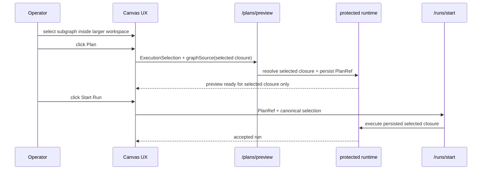
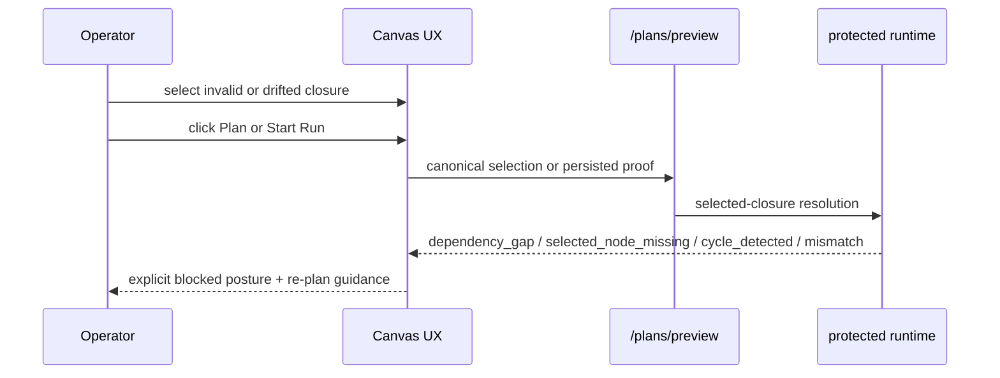

# TF-E2-E selected-closure UX proof stories

## Summary

`TF-A2-C1` through `TF-A2-C5` already froze the execution-selection boundary
through contracts, planner derivation, API adoption, web seam adoption, and
one vertical proof slice across docs, web Vitest, and protected-runtime
integration.

The remaining gap is specifically browser-level proof and user-facing failure
posture:

- the current Cypress spec still proves a fixed persisted preview/run path with
  intercepted backend calls;
- it does not prove partial node selection inside a larger canvas;
- it does not prove loose-node exclusion in the browser path;
- it does not prove fail-closed UX for `dependency_gap`,
  `selected_node_missing`, `cycle_detected`, or
  `graph_source_selection_mismatch`;
- it does not yet prove the selected-closure route against the live protected
  runtime without `cy.intercept` on the authoring contract.

This proposal turns those gaps into one explicit user-story set under
`TF-E2-E`, so the remaining UX and Cypress work can be executed without
inventing a second planning line.

## Governing sources

- `AGENTS.md`
- `docs/planning/status/governance-document-rule-inventory.md`
- `docs/guides/ai-work-protocol.md`
- `docs/planning/state/planning-control-tower.md`
- `docs/planning/state/how-to-add-tasks.md`
- `docs/planning/state/agent-lane-e.yaml`
- `docs/planning/state/agent-lane-a.yaml`
- `docs/architecture/reference-architecture.md`
- `docs/planning/proposals/mandatory/frontend-and-ux/tf-e2-canvas-target-architecture-execution-plan-20260417.md`
- `docs/planning/proposals/mandatory/runtime-and-contracts/tf-a2-c-execution-selection-and-executable-subgraph-plan-20260423.md`
- `docs/architecture/components/planner/workspace-authoring-draft-aggregate.md`
- `apps/api/docs/executable-subgraph-resolution-component.md`
- `docs/architecture/components/web/graph/canvas-execution-selection-component.md`

## Current coverage vs missing proof

| Surface                            | Already covered                                                          | Missing now                                                                                 |
| ---------------------------------- | ------------------------------------------------------------------------ | ------------------------------------------------------------------------------------------- |
| `@dvt/planner` unit                | selected closure, dependency gap, selected node missing, cycle, no-widen | browser-visible posture                                                                     |
| `apps/api` application/integration | selected-closure resolution, mismatch rejection, planner-backed proof    | live DB-backed integration in local default env                                             |
| `apps/web` Vitest                  | canonical selection seam, preview/run reuse of persisted proof           | browser-level UX orchestration proof                                                        |
| Cypress consumer-contract          | persisted preview/run hash alignment with intercepts                     | partial selection, loose-node exclusion, execution diagnostics, live protected runtime lane |

## Why this matters

Without these stories, the repository can still claim the boundary is frozen
while leaving the operator-visible path under-proven:

1. the browser can regress to whole-canvas behavior without a failing Cypress
   signal;
2. planner diagnostics can remain technically correct but never surface through
   governed UX states;
3. the only browser proof can stay intercept-driven and never prove the live
   protected runtime route.

## Story map

| Story ID    | Story                                                                                                                                                                                           | Acceptance contract                                                                                               |
| ----------- | ----------------------------------------------------------------------------------------------------------------------------------------------------------------------------------------------- | ----------------------------------------------------------------------------------------------------------------- |
| `US-E2-011` | As an operator, I can preview and run only the selected closure inside a larger canvas while unrelated loose nodes remain editable but excluded from execution.                                 | Browser proof shows selected-node payload, selected closure only, and no widening to unrelated nodes.             |
| `US-E2-012` | As an operator, I get explicit fail-closed Canvas posture when the selected closure is not executable because of `dependency_gap`, `selected_node_missing`, or `cycle_detected`.                | Plan and run stay blocked, the rejection is explicit, and re-plan guidance is visible.                            |
| `US-E2-013` | As an operator, run start is blocked when persisted preview proof no longer matches authoritative selected-closure truth, including `graph_source_selection_mismatch` or stale persisted proof. | Browser shows re-plan posture and does not dispatch a run against stale or drifted scope.                         |
| `US-E2-014` | As a delivery owner, the selected-closure route is proven in Cypress against the live protected runtime without `cy.intercept` on the authoring contract.                                       | One browser lane proves `Canvas -> preview -> persisted PlanRef -> start run` against the real protected backend. |
| `US-E2-015` | As a maintainer, selected-closure UX proofs share one governed Cypress/test-support kit so browser assertions stay aligned with canonical contracts and failure taxonomy.                       | Proof helpers centralize fixtures, selectors, backend bootstrap, and assertion vocabulary.                        |

## Proof sequence targets

### Positive selected-closure UX

### Negative selected-closure UX

## Executable user stories

### `US-E2-011` selected subset inside a larger canvas

- Story:
  As an operator, I can preview and run only the selected closure inside a
  larger canvas while unrelated loose nodes remain editable but excluded from
  execution.
- Needed proof:
  - Cypress consumer-contract spec that selects a partial subgraph
  - Browser assertion that the `selection.nodeIds` payload matches the selected
    nodes only
  - Browser assertion that loose nodes do not appear in preview summary or run
    scope
- Gap closed:
  no current Cypress proof for partial selection or loose-node exclusion

### `US-E2-012` fail-closed executability diagnostics

- Story:
  As an operator, I get explicit fail-closed Canvas posture when the selected
  closure is not executable because of `dependency_gap`,
  `selected_node_missing`, or `cycle_detected`.
- Needed proof:
  - Browser-visible message/state for each governed rejection family
  - Run affordance remains blocked after rejection
  - Re-plan or selection-adjustment posture remains explicit
- Gap closed:
  planner and API already know these diagnostics, but UX and Cypress do not yet
  prove the browser response

### `US-E2-013` stale proof and selected-scope drift rejection

- Story:
  As an operator, run start is blocked when persisted preview proof no longer
  matches authoritative selected-closure truth, including
  `graph_source_selection_mismatch` or stale persisted proof.
- Needed proof:
  - Browser lane proves the stale-proof banner or equivalent blocked state
  - Browser lane proves no `runs/start` dispatch when proof is stale
  - Drifted graph truth requires re-plan before run
- Gap closed:
  existing Cypress only proves hash mismatch, not canonical selected-closure
  drift against live protected truth

### `US-E2-014` live-runtime browser proof

- Story:
  As a delivery owner, the selected-closure route is proven in Cypress against
  the live protected runtime without `cy.intercept` on the authoring contract.
- Needed proof:
  - bootstrapped protected runtime with auth and draft persistence
  - Canvas selects a real subset, previews it, persists the plan, and starts
    the run through the live route
  - browser lane becomes the accepted end-to-end proof instead of only an
    intercepted consumer-contract spec
- Gap closed:
  the current browser proof is not yet the live-runtime lane required by
  `TF-E2-E`

### `US-E2-015` governed Cypress/test-support seam

- Story:
  As a maintainer, selected-closure UX proofs share one governed Cypress and
  browser-test support kit so browser assertions stay aligned with canonical
  contracts and failure taxonomy.
- Needed proof:
  - one named helper seam for selected-closure fixtures and commands
  - shared selectors and assertion vocabulary for preview-ready, blocked, and
    re-plan states
  - no duplicate ad hoc setup across specs
- Gap closed:
  test-support ownership is still spread and the selected-closure lane would
  otherwise fork fixture semantics

## Task mapping to `TF-E2-E`

| Slice       | Maps to story            | Outcome                                                                           |
| ----------- | ------------------------ | --------------------------------------------------------------------------------- |
| `TF-E2-E-A` | `US-E2-011`              | intercepted Cypress proof for partial selection and loose-node exclusion          |
| `TF-E2-E-B` | `US-E2-012`              | browser fail-closed UX proof for dependency gap, missing node, and selected cycle |
| `TF-E2-E-C` | `US-E2-013`              | stale-proof and selected-scope drift rejection proof                              |
| `TF-E2-E-D` | `US-E2-014`, `US-E2-015` | live-runtime Cypress lane plus governed selected-closure test kit                 |

## Acceptance posture for the whole proof set

The selected-closure UX route is only closed when all of the following are
true:

- unit and integration truth still anchor the canonical contracts;
- intercepted Cypress specs prove browser payload and visible posture for
  selection-scoped behavior;
- one live-runtime Cypress lane proves the route against the protected backend;
- no browser proof widens selected execution to the full canvas;
- no browser proof hides planner rejection behind generic failure noise.
