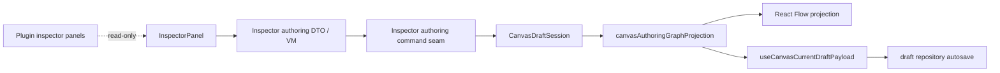
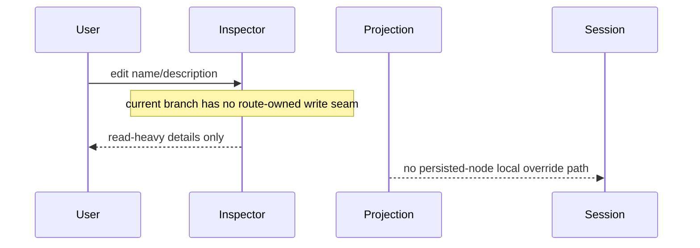
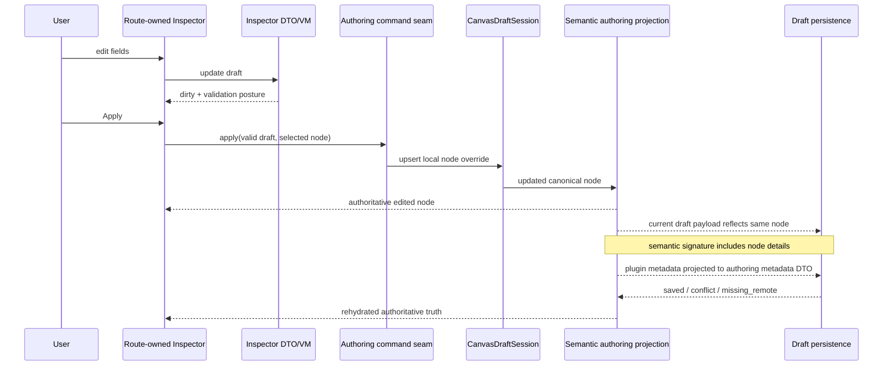
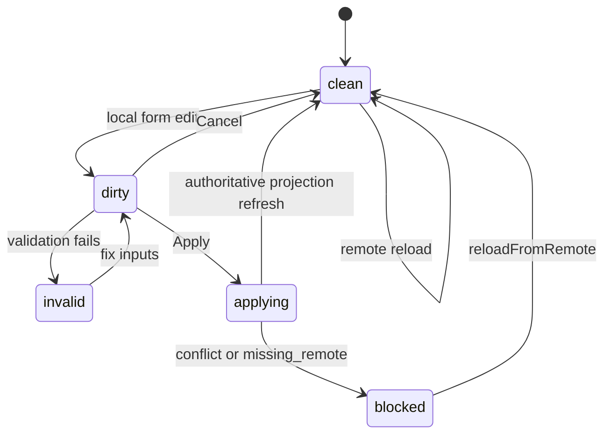

# TF-E2 Inspector Authoring And Lifecycle Closure Plan 2026-04-25

## Summary

This proposal closes the remaining Canvas productization route after the host
and selected-closure proof slices:

- `TF-E2-D`: route-owned Inspector property editing
- residual `TF-E2-B`: duplicate, move, and reload-proof node lifecycle
- residual `TF-E2-C`: reconnect and reload-proof edge lifecycle

The hard architectural fact behind this route is simple: the current Canvas
runtime can only inject route-local canonical nodes when they do not already
exist in protected draft semantics. That is sufficient for "new explicit local
node" flows, but it is not sufficient for editing a node that already exists in
the protected draft. Without changing that rule, an editable Inspector would be
UI theater.

## Governing Sources

- `AGENTS.md`
- `docs/planning/status/governance-document-rule-inventory.md`
- `docs/guides/ai-work-protocol.md`
- `docs/planning/state/planning-control-tower.md`
- `docs/planning/state/agent-lane-e.yaml`
- `docs/planning/proposals/mandatory/frontend-and-ux/tf-e2-production-node-authoring-and-persistence-plan-20260416.md`
- `docs/planning/proposals/mandatory/frontend-and-ux/tf-e2-canvas-target-architecture-execution-plan-20260417.md`
- `docs/architecture/components/web/graph/graph-canvas-runtime-model.md`
- `docs/architecture/components/web/graph/canvas-controller-current-to-target-architecture.md`
- `docs/architecture/components/web/graph/canvas-component-map-and-modernization-review.md`

## Problem Statement

The current Canvas branch already improved the architecture materially:

- protected draft truth is authoritative
- React Flow remains projection-only
- the route has a real host cycle and selected-closure proof
- graph mutations already flow through a named `canvasGraphLifecycle`
  component

But the remaining route is still incomplete in product terms.

### Current gaps

1. The Inspector is still mostly read-only and plugin-panel-driven.
2. `localNodeCatalog` behaves as an admission supplement for explicit local
   nodes, not as a local override catalog for persisted nodes.
3. Duplicate, reconnect, and hard-reload lifecycle closure still lack a final
   proof-oriented convergence pass.
4. Selection and inspect semantics remain adapter-local, which is acceptable
   only while they stay simple fallout rather than route-owned command policy.

## Fowler Analysis

<!-- markdownlint-disable MD060 -->

| Concern                   | Current owner                       | Fowler reading              | Current risk                                                               |
| ------------------------- | ----------------------------------- | --------------------------- | -------------------------------------------------------------------------- |
| Draft truth               | `canvasDraftSession.*`              | real aggregate              | good                                                                       |
| Graph mutation semantics  | `canvasGraphLifecycle.*`            | domain component            | good but incomplete for duplicate/reconnect closure                        |
| Inspector surface         | `InspectorPanel.tsx`                | passive view only           | no application-service seam for writable editing                           |
| Route application facade  | `useCanvasController.ts`            | facade                      | acceptable if new write semantics do not leak back into it                 |
| Semantic authoring merge  | `canvasAuthoringGraphProjection.ts` | projection component        | cannot yet overlay local edits onto protected nodes                        |
| Plugin inspector panels   | plugin registry                     | extension-point side panels | must stay read-only in this slice                                          |
| Selection / inspect input | `useCanvasSelectionHandlers.ts`     | inbound adapter fallout     | becomes drift if shared route-level policy expands without a semantic seam |

<!-- markdownlint-enable MD060 -->

### Comparison with mature systems

This is a pattern-level comparison, not a feature audit.

- Mature graph workbenches such as Apache NiFi treat inspector-style
  configuration as a first-class authoring surface, not as a secondary
  read-only detail panel.
- Mature DAG authoring tools such as dbt-oriented workbenches keep the edit
  surface tied to authoritative graph truth and recover deterministically on
  reload; they do not keep one transport truth for preview and a second local
  truth for editing.
- Mature workbench shells keep extension panels subordinate to the host
  contract; plugin panels do not silently become the write authority for core
  route semantics.

Canvas is architecturally closer to those systems now than it was, but it is
still missing the "authoritative Inspector" step.

## Architectural Decision

Introduce one route-owned Inspector authoring component for governed node
properties and complete the remaining lifecycle proofs around the same
aggregate.

### Decision rules

1. The writable surface is the route-owned Inspector only.
2. Plugin-owned panels remain read-only in this slice.
3. Local node overrides must apply to both:
   - explicit local nodes, and
   - nodes that already exist in protected draft semantics.
4. Applying Inspector edits must mutate the same route-local aggregate used by
   preview and run handoff.
5. Cancel must discard local form state only; it must not invent a second
   persistence model.
6. Reload must rehydrate from authoritative route truth and reset Inspector form
   state accordingly.

## Proposed Component Model

### Owned seams

| Seam                               | Owns                                                                 | Must not own                                      |
| ---------------------------------- | -------------------------------------------------------------------- | ------------------------------------------------- |
| Inspector authoring DTO / VM       | editable fields, validation, dirty state, apply/cancel posture       | persistence transport or plugin panel composition |
| Inspector authoring command seam   | mapping validated edits into aggregate mutation                      | route composition or autosave timing              |
| Draft session local node overrides | local canonical node overrides for both admitted and persisted nodes | React Flow projection or plugin UI state          |
| Semantic authoring projection      | overlay authoritative draft truth with local overrides               | view-level dirty state                            |
| Authoring dirty signature          | persisted node and edge semantics for autosave change detection      | layout-only position churn or edge-order churn    |
| Remote baseline signature          | bootstrap and reload saved-signature policy                          | duplicated hook-local signature rules             |
| Authoring metadata DTO             | JSON-compatible metadata crossing authoring and duplicate boundaries | plugin-specific behavior or shallow clone policy  |
| Canvas graph strategy contract     | plugin-neutral graph projection and drop parsing contract            | concrete DBT adapter implementation details       |

## User Stories

### US-E2-016: edit governed node details in the route-owned Inspector

As a write-authorized operator, I can edit the selected node name and
description in the Inspector, apply the change, and see the same value in the
graph and persisted draft.

Acceptance:

- Inspector shows `Apply` and `Cancel` only when the form is dirty
- blank or whitespace-only node name is rejected
- applying edits updates the same canonical authoring truth consumed by preview
  and run
- applying edits changes the semantic authoring dirty signature and triggers
  draft persistence even when node ids, edges, and canvas title are unchanged
- authoring metadata is sanitized through one JSON-compatible DTO boundary so
  circular or non-serializable plugin values cannot crash render-time signatures
- plugin panels remain visible but read-only

### US-E2-017: read-only and blocked postures stay honest in the Inspector

As a non-writable operator, I can inspect node details but I am not shown fake
save affordances.

Acceptance:

- read-only posture disables editable fields or shows them as non-editable
- blocked or degraded recovery posture prevents apply
- no local "successful edit" is implied when mutation is not allowed

### US-E2-018: hard reload rehydrates edited node details from authoritative truth

As an operator reopening the route after a persisted edit, I see the edited
node details reloaded from canonical draft truth and not from browser-local
state.

Acceptance:

- hard reload returns the persisted value
- conflict, missing-remote, and projection-gap posture reset the Inspector form
  to authoritative truth
- cancel resets the form to current authoritative route truth

### US-E2-019: residual node and edge lifecycle closures remain proof-backed

As the route owner, I need duplicate, move, reconnect, and reload-proof
behavior to remain tied to the same aggregate and proof lanes as Inspector
editing.

Acceptance:

- duplicate node flow preserves semantic node metadata and survives reload
- duplicate node flow resolves graph mutation as a pure transaction before the
  React handler applies selection, Inspector, draft-session, and toast fallout
- duplicate and drop command code depends on a plugin-neutral graph strategy
  contract, not on the DBT adapter type
- reconnect remains fail-closed under invalid or partial edge states
- reload proof covers node details, duplicate nodes, and reconnected edges

## Sequence Diagrams

### Current gap

### Target authoring cycle

### Reload recovery rule

## TDD and QA Route

1. Red: projection test proving local overrides do not currently replace a
   protected-draft node.
2. Green: allow route-local overrides to replace protected semantic nodes by
   `nodeId`.
3. Red: Inspector authoring model tests for dirty state, validation, and cancel.
4. Green: route-owned Inspector authoring seam plus integration with the
   aggregate.
5. Red: controller or component integration tests proving apply updates graph
   and resets on reload.
6. Green: UI integration plus route proof.
7. Close residual `TF-E2-B/C` gaps with focused red/green tests for duplicate,
   reconnect, and reload proof.

## QA Matrix

| Lane                      | Proof focus                                                                   |
| ------------------------- | ----------------------------------------------------------------------------- |
| unit                      | override merge, validation, dirty-state, duplicate metadata, reconnect guards |
| controller integration    | Inspector apply/cancel, read-only posture, reload reset, conflict fail-closed |
| browser / route           | create/edit/reload cycle and honest blocked posture                           |
| governance / architecture | component doc, semantic fitness function, planning traceability               |

## Scope Boundaries

In scope now:

- route-owned editing of governed node details
- local override semantics for persisted nodes
- duplicate and reconnect closure necessary to keep the same authoring truth
  coherent

Out of scope now:

- plugin-owned write panels
- arbitrary per-plugin config editors
- a second manual save model beside the governed draft persistence flow
- moving selection or inspect semantics out of adapter fallout unless the new
  implementation actually needs shared route policy

## Exit Criteria

This route is complete only when all of the following are true:

- Inspector edits round-trip through authoritative route truth
- persisted-node overrides work without inventing a second projection path
- duplicate and reconnect residuals are proof-backed
- docs, diagrams, tests, and route behavior all describe the same component
  seams

## Validation Expectations

When this proposal lands:

- `pnpm docs:sync`
- `pnpm docs:workboard:generate`
- `pnpm verify:prepush`
