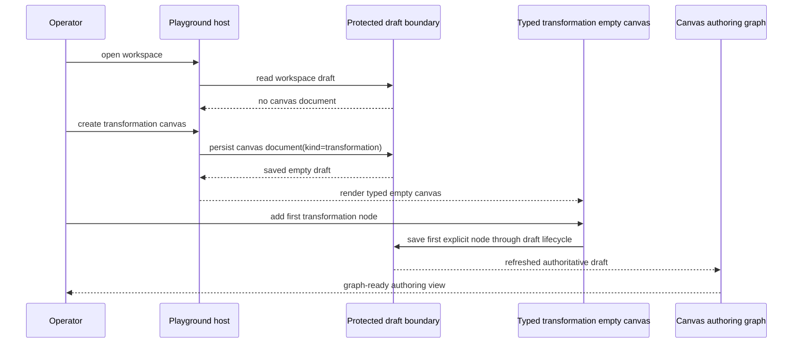
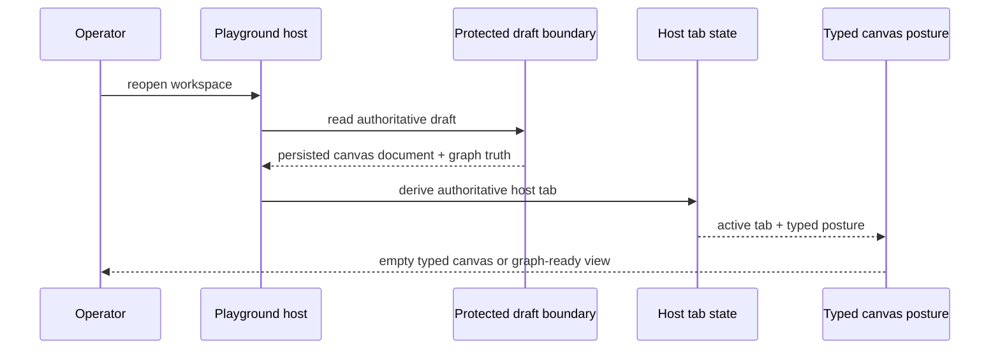
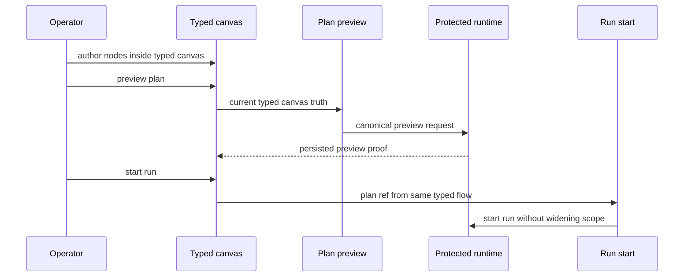
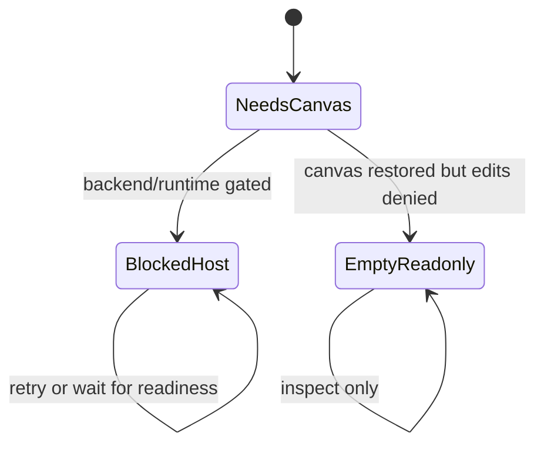
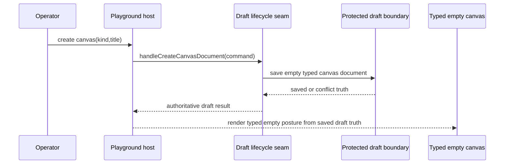
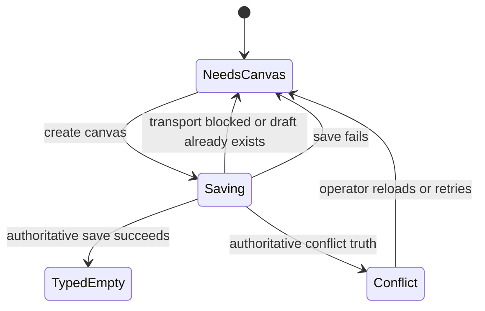

# TF-E2-K playground complete-cycle stories 2026-04-24

## Summary

`TF-E2-K-A`, `TF-E2-K-B`, and `TF-E2-K-C` already froze three foundations:

- a real host-owned `needs_canvas` posture
- one authoritative draft-backed canvas tab
- typed empty-canvas copy and node catalog for `dbt` and `transformation`

What is still missing is one story set that describes the operator-complete
cycles above those seams.

Today the repo proves parts of that route in isolation:

- create-canvas command dispatch
- typed empty-canvas copy and catalog
- first-node command dispatch
- selected-closure proof in later execution seams

But it does not yet describe or prove the full operator cycles from
`playground -> typed canvas -> first node -> restore -> preview/run` in one
canonical story set.

Without that, test setup keeps drifting toward transport-shaped scenarios
instead of story-shaped view models.

There is also a second-order gap under the host route:

- the first-canvas creation command is still easiest to reason about through
  the controller stack, but it does not yet have one dedicated proof seam for
  authoritative save, conflict, and fail-closed behavior
- the route test stack still carries host-cycle scenario helpers in a broad
  controller-defaults file instead of one dedicated scenario module

That makes the operator cycle harder to maintain even when the user-visible
behavior is already mostly present.

## Governing sources

- `AGENTS.md`
- `docs/planning/status/governance-document-rule-inventory.md`
- `docs/guides/ai-work-protocol.md`
- `docs/planning/state/planning-control-tower.md`
- `docs/planning/state/agent-lane-e.yaml`
- `docs/architecture/reference-architecture.md`
- `docs/planning/proposals/mandatory/frontend-and-ux/tf-e2-canvas-target-architecture-execution-plan-20260417.md`
- `docs/planning/proposals/mandatory/frontend-and-ux/tf-e2-project-playground-and-multi-canvas-host-plan-20260423.md`
- `docs/planning/proposals/mandatory/frontend-and-ux/tf-e2-canvas-empty-authoring-entrypoint-design-20260422.md`
- `docs/planning/proposals/mandatory/frontend-and-ux/tf-e2-e-selected-closure-ux-proof-stories-20260423.md`
- `docs/architecture/components/web/graph/canvas-playground-host-component.md`
- `docs/architecture/components/web/graph/canvas-empty-authoring-entrypoint-component.md`

## Think-first analysis

### Problem summary

The playground host now exists, but the missing unit of work is no longer a
single state or single component. It is the operator-complete cycle.

The route can already show:

- host create-canvas posture
- typed empty-canvas posture
- first-node catalog

What it still lacks is one canonical story set that makes these cycles explicit
and testable from one stable vocabulary.

### Root cause

The root cause is that the host has been modeled as seams, but not yet as
complete user journeys.

That leaves two problems:

1. planning remains slice-oriented but not cycle-oriented
2. tests keep assembling broad route/controller transport scenarios instead of
   one story-owned DTO or view-model for host cycles

### Constraints and invariants

- `Workspace` remains the persisted host boundary
- Canvas remains a document/tab, not route authority
- plugin-owned kinds own typed empty-state copy and node catalog
- host-owned shell owns create-canvas, tab restoration, and blocked/read-only
  posture
- no fake multi-canvas persistence may be implied
- no local-only semantic success may bypass the protected draft boundary
- preview/run stories must start from the real host cycle, not from an already
  prepared graph

### Options considered

#### Option A: keep adding isolated tests per seam

Benefits:

- smallest immediate diff

Rejected because:

- it preserves transport-shaped scenario setup
- it does not describe the product in operator-complete terms

#### Option B: wait for Cypress and describe the cycles only in browser specs

Benefits:

- visible end-to-end proof

Rejected because:

- it leaves the internal route/test vocabulary ungoverned
- it forces browser proof to carry the whole semantic burden

#### Option C: publish complete-cycle stories first, then introduce one host-cycle DTO/view-model and execute the first cycle by TDD

Benefits:

- stories become canonical before implementation
- route and browser proof can share the same cycle vocabulary
- test setup can move from transport bags to a stable story DTO

Decision:

- accepted

## Story map

| Story ID    | Story                                                                                                                                                        | Acceptance contract                                                                                              |
| ----------- | ------------------------------------------------------------------------------------------------------------------------------------------------------------ | ---------------------------------------------------------------------------------------------------------------- |
| `US-E2-016` | As an operator, I can enter the playground, create a `transformation` canvas, add the first node, and land in graph-ready authoring without hidden setup.    | The route moves from `needs_canvas` to typed empty canvas to visible graph authoring through the real host path. |
| `US-E2-017` | As an operator, I can do the same cycle for a `dbt` canvas and see dbt-specific copy and first-node choices instead of transformation semantics.             | The host and empty entrypoint remain typed; dbt node catalog and copy stay distinct end to end.                  |
| `US-E2-018` | As an operator, when I reopen the workspace, the host restores the authoritative canvas tab and the correct typed posture before I continue editing.         | Restore uses canonical draft truth only and rehydrates the correct host tab plus empty/graph posture.            |
| `US-E2-019` | As an operator, after the first node exists, I can continue to preview and run from the same typed canvas flow without widening execution or losing context. | Preview/run handoff stays anchored to the same typed document and current authoring truth.                       |
| `US-E2-020` | As a read-only or blocked operator, I can inspect the typed host/canvas posture while create-canvas, first-node, and run affordances stay explicitly gated.  | The route is fail-closed and still understandable; no fake affordance appears when mutation/runtime is gated.    |
| `US-E2-021` | As an operator, when I create the first canvas, the host persists one typed empty document through the authoritative draft boundary before claiming success. | First-canvas creation only advances on authoritative draft save or conflict truth; no browser-only success path. |
| `US-E2-022` | As an operator, if first-canvas creation is blocked, stale, or already authoritative, the host stays honest instead of fabricating a new canvas posture.     | Create-canvas failure/no-op states are explicit and fail-closed across busy, blocked, and already-saved cases.   |

## Complete-cycle diagrams

### `US-E2-016` transformation first-node cycle

### `US-E2-018` authoritative restore cycle

### `US-E2-019` typed canvas to preview/run handoff

### `US-E2-020` blocked or read-only cycle

### `US-E2-021` authoritative first-canvas creation cycle

### `US-E2-022` fail-closed first-canvas rejection cycle

## Opportunity: replace transport-shaped scenarios with a host-cycle DTO

The stories above expose a maintainability problem that is already visible in
test setup: route and workbench tests still tend to assemble large transport
bags or broad `Pick<>` surfaces when what they really need is one explicit
cycle contract.

The first implementation opportunity is therefore:

- introduce one route-owned DTO or view-model for host cycles
- let tests describe `needs_canvas`, `typed_empty_transformation`,
  `typed_empty_dbt`, `graph_ready`, and `blocked/read_only` through that DTO
- stop making every new story pay the cost of transport-level setup
- keep that scenario vocabulary in a dedicated host-cycle test-support module,
  not in the broad `Canvas.test.controller.defaults.ts` defaults file

The first TDD slice should use that DTO to execute `US-E2-016`.

## Task mapping

| Slice       | Story                    | Outcome                                                                   |
| ----------- | ------------------------ | ------------------------------------------------------------------------- |
| `TF-E2-K-D` | `US-E2-016`              | transformation host cycle proof plus story-owned host-cycle DTO           |
| `TF-E2-K-E` | `US-E2-017`              | dbt host cycle proof                                                      |
| `TF-E2-K-F` | `US-E2-018`              | authoritative restore cycle proof                                         |
| `TF-E2-K-G` | `US-E2-019`              | typed canvas to preview/run continuation proof                            |
| `TF-E2-K-H` | `US-E2-020`              | blocked/read-only host cycle proof                                        |
| `TF-E2-K-I` | `US-E2-021`, `US-E2-022` | authoritative first-canvas creation proof plus fail-closed lifecycle seam |

## Acceptance posture for the whole set

The host-cycle route is only closed when all of the following are true:

- the operator-complete cycles are captured in canonical planning
- route and component tests use one stable host-cycle vocabulary
- the first transformation cycle is proven from `needs_canvas` to first node
- dbt remains typed and does not collapse into transformation assumptions
- restore, preview/run, and blocked/read-only cycles are proven without fake
  host state or transport shortcuts
- first-canvas creation is proven at the lifecycle seam and does not claim
  success ahead of authoritative draft truth
