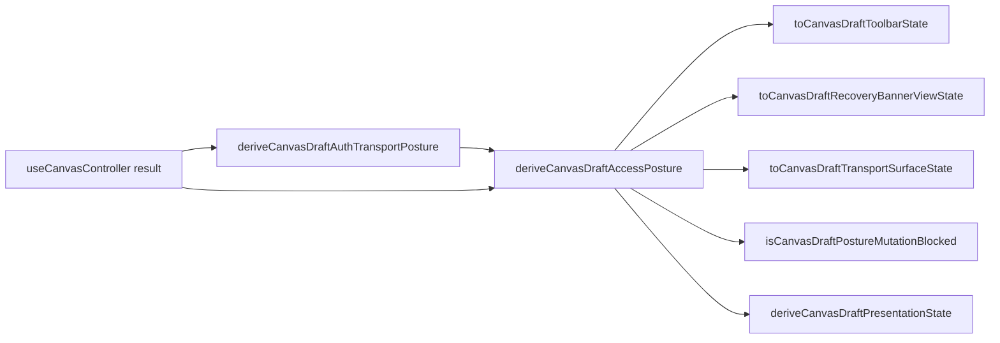

# TF-E2-M-B Canvas Draft Denial Posture Implementation Plan

> **For agentic workers:** REQUIRED SUB-SKILL: Use
> superpowers:subagent-driven-development or superpowers:executing-plans to
> implement this plan task-by-task. Steps use checkbox (`- [ ]`) syntax for
> tracking.

**Goal:** Ship a closed Canvas draft access posture model so protected draft
denials, read-only access, format failures, and recovery states produce truthful
copy, safe mutation gating, and user-visible recovery actions.

**Architecture:** `GetWorkspaceGraphDraft` remains the authoritative query rail.
The new `canvasDraftAccessPostureModel.ts` presentation and admission model
becomes the single source for toolbar state, recovery banner state,
center-surface state, graph mutation gating, plan/run gating, and recovery
command mapping. Existing route components consume resolved posture state and
do not implement auth, permission, or format conditionals in JSX.

**Tech Stack:** React 18, TypeScript, Vitest, Cypress, TanStack Query, existing
Canvas copy catalogs, existing protected workspace graph draft contract.

---

## Governing Sources

- `AGENTS.md`
- `docs/planning/status/governance-document-rule-inventory.md`
- `docs/guides/ai-work-protocol.md`
- `docs/architecture/command-query-rail-governance.md`
- `docs/architecture/fowler-opportunity-planning-governance.md`
- `docs/planning/state/agent-lane-e.yaml`
- `docs/planning/proposals/mandatory/frontend-and-ux/web-auth-project-onboarding-and-actionable-gaps-20260501.md`
- `docs/architecture/components/web/api-client-auth-component.md`
- `docs/architecture/components/web/graph/canvas-execution-selection-component.md`
- `docs/architecture/components/web/graph/canvas-startup-and-draft-recovery-component.md`
- `docs/architecture/components/web/graph/canvas-startup-and-draft-recovery-user-stories.md`
- `docs/architecture/components/web/graph/canvas-draft-access-posture-component.md`
- `packages/@dvt/contracts/src/contracts/planner/WorkspaceGraphDraft.v1.ts`

## Closed Scope

This plan implements only `TF-E2-M-B`.

In scope:

- one Canvas auth-transport posture adapter over final draft query errors;
- one Canvas draft access posture model;
- distinct `unauthenticated`, `forbidden_scope`, `read_only`, `format_error`,
  conflict, missing, projection, pending, and writable postures;
- copy catalog additions in English and Spanish;
- toolbar, banner, center-surface, route interaction, and bootstrap consumers;
- unit tests, architecture tests, and Cypress user-flow tests;
- documentation and lane planning alignment.

Out of scope:

- product login route;
- tenant-admin permission management;
- backend authorization changes;
- workspace graph draft contract changes;
- token refresh implementation;
- multi-canvas backend aggregate;
- plan-preview contract changes;
- run-start contract changes;
- replacing the existing live selected-closure proof lane.

## Root Cause

The current implementation has enough pieces to fail closed, but not enough
semantic encapsulation. Draft access mode, format errors, route recovery,
toolbar label, center-surface state, mutation permissions, and execution
command enablement are derived in separate modules. That lets the route show a
generic denied surface or a synced toolbar label when the protected draft read
has not produced writable truth, and it can leave plan/run command inputs
enabled through a policy path that did not consume draft-access posture.

## Selected Design

Use one presentation model:

```ts
export type CanvasDraftAccessPosture =
  | CanvasWritableDraftPosture
  | CanvasReadOnlyDraftPosture
  | CanvasUnauthenticatedDraftPosture
  | CanvasForbiddenScopeDraftPosture
  | CanvasFormatErrorDraftPosture
  | CanvasRecoveryDraftPosture
  | CanvasUnknownPendingDraftPosture;
```

Every visible route decision receives that posture:



Rejected alternatives:

- Patch only toolbar copy. Rejected because banner and permissions would still
  derive their own truth.
- Add a route-level auth branch. Rejected because API auth already owns token
  refresh and Canvas must not decode JWTs.
- Treat read-only as forbidden. Rejected because read-only keeps product value
  for inspection.

## Command And Query Catalog Binding

This slice does not add a new product command or query. It applies one posture
admission policy to the existing rails below. Any implementation that changes
the command contract rather than only gating existing route actions must update
the command/query catalog before code changes.

| Rail                                     | Type    | Catalog or contract surface          | Slice rule                                                      |
| ---------------------------------------- | ------- | ------------------------------------ | --------------------------------------------------------------- |
| `GetWorkspaceGraphDraft`                 | query   | web auth/project onboarding catalog  | authoritative source for capability, denial, and format state   |
| `CreateCanvas`                           | command | web auth/project onboarding catalog  | disabled unless posture is writable                             |
| `CreateCanvasNode`                       | command | web auth/project onboarding catalog  | disabled unless posture is writable                             |
| `RemoveCanvasNode`                       | command | web auth/project onboarding catalog  | disabled unless posture is writable                             |
| `CreateCanvasEdge`                       | command | web auth/project onboarding catalog  | disabled unless posture is writable                             |
| `RemoveCanvasEdge`                       | command | web auth/project onboarding catalog  | disabled unless posture is writable                             |
| `SaveWorkspaceGraphDraft`                | command | web auth/project onboarding catalog  | disabled unless posture is writable and CAS policy admits       |
| `PreviewPlan` / `IPlansPort.previewPlan` | command | Canvas execution selection component | disabled unless posture is writable and execution policy admits |
| `StartRunInput` / run start              | command | Canvas run-start boundary docs       | disabled unless posture is writable and execution policy admits |

Plan preview remains on the existing Canvas execution-action path documented by
the Canvas execution selection component. This slice does not change the
plan-preview contract; it only prevents plan affordances from being enabled
when draft access posture is not writable.

`RefreshSessionGrants` remains outside this implementation slice. The
session-recovery action invalidates/refetches the protected draft query after
the API client auth boundary has performed its bounded behavior; Canvas does not
implement a session-grants command or token-refresh command in this task.

## Implementation File Map

| File                                                                                       | Action   | Owned concern                                                                                                               |
| ------------------------------------------------------------------------------------------ | -------- | --------------------------------------------------------------------------------------------------------------------------- |
| `apps/web/src/app/views/canvas/canvasDraftAuthTransportPosture.ts`                         | Create   | Normalize protected draft query errors into Canvas auth-transport posture without token inspection.                         |
| `apps/web/src/app/views/canvas/canvasDraftAuthTransportPosture.test.ts`                    | Create   | Unit tests proving only real normalized API auth failures become Canvas auth posture.                                       |
| `apps/web/src/app/views/canvas/canvasDraftAccessPostureModel.ts`                           | Create   | Pure posture derivation and conversion helpers.                                                                             |
| `apps/web/src/app/views/canvas/canvasDraftAccessPostureModel.test.ts`                      | Create   | Exhaustive unit tests for posture and conversions.                                                                          |
| `apps/web/src/app/views/canvas/CanvasDraftAccessRecovery.templates.tsx`                    | Create   | Passive banner action template.                                                                                             |
| `apps/web/src/app/views/canvas/canvasDraftTransportErrorState.ts`                          | Modify   | Delegate denied and format transport surfaces to posture conversion.                                                        |
| `apps/web/src/app/views/canvas/canvasRecoveryBannerModel.ts`                               | Modify   | Render posture-derived recovery banner state.                                                                               |
| `apps/web/src/app/views/canvas/canvasDraftToolbarState.ts`                                 | Modify   | Keep recovery reason compatibility while delegating final label/tone to posture.                                            |
| `apps/web/src/app/views/canvas/canvasToolbarViewModel.ts`                                  | Modify   | Ensure workflow label cannot override access-posture recovery.                                                              |
| `apps/web/src/app/views/canvas/useCanvasAuthoringRuntime.ts`                               | Modify   | Derive and expose normalized draft auth transport posture from draft query error state.                                     |
| `apps/web/src/app/views/canvas/canvasAuthoringState.ts`                                    | Modify   | Expose draft posture and derive graph mutation capability from posture admission without owning plan/run permission inputs. |
| `apps/web/src/app/views/canvas/canvasAuthoringState.test.ts`                               | Modify   | Prove authoring mutation admission is closed by non-writable posture and stays separate from plan/run inputs.               |
| `apps/web/src/app/views/canvas/canvasRuntimePolicy.ts`                                     | Modify   | Resolve final graph, plan, run, reload, and inspector command enablement from posture-admitted inputs.                      |
| `apps/web/src/app/views/canvas/useCanvasController.ts`                                     | Modify   | Pass posture-admitted command inputs into runtime and execution seams.                                                      |
| `apps/web/src/app/views/canvas/canvasControllerViewModel.ts`                               | Modify   | Expose `draftAuthTransportPosture` to route state through the controller facade.                                            |
| `apps/web/src/app/views/canvas/canvasRouteInteractionState.ts`                             | Modify   | Gate mutation through posture policy.                                                                                       |
| `apps/web/src/app/views/canvas/canvasRouteViewState.ts`                                    | Modify   | Compose posture once and pass it to route consumers.                                                                        |
| `apps/web/src/app/views/canvas/canvasRouteViewState.test.ts`                               | Create   | Behavioral composition tests proving one posture drives toolbar, banner, transport surface, and permissions.                |
| `apps/web/src/app/views/canvas/canvasCopy.types.ts`                                        | Modify   | Add closed copy keys for posture labels and actions.                                                                        |
| `apps/web/src/app/views/canvas/canvasCopyCatalog.route.ts`                                 | Modify   | Add English copy.                                                                                                           |
| `apps/web/src/app/views/canvas/canvasCopyCatalog.route.es.ts`                              | Modify   | Add Spanish copy.                                                                                                           |
| `apps/web/src/app/views/canvas/canvasStartupAndDraftRecovery.architecture.test.ts`         | Modify   | Add semantic guard for posture model ownership.                                                                             |
| `apps/web/cypress/e2e/canvas/canvas-draft-access-posture.cy.ts`                            | Create   | User-visible denial and read-only flows.                                                                                    |
| `docs/architecture/components/web/graph/canvas-draft-access-posture-component.md`          | Modify   | Keep implemented API and invariants aligned after coding.                                                                   |
| `docs/architecture/components/web/graph/canvas-startup-and-draft-recovery-user-stories.md` | Modify   | Add `TF-E2-M-B` story rows and test mapping.                                                                                |
| `docs/architecture/components/web/graph/index.md`                                          | Modify   | Keep graph component navigation aligned with the new local guide.                                                           |
| `docs/planning/proposals/portfolio-map-20260403.md`                                        | Modify   | Keep proposal navigation aligned with the new implementation plan.                                                          |
| `docs/planning/state/agent-lane-e.yaml`                                                    | Modify   | Keep Lane E task state and evidence references aligned.                                                                     |
| `docs/.manifest.json`                                                                      | Generate | Keep governed documentation manifest aligned after docs generation.                                                         |

## Feature Mechanization Manifest

This manifest is the machine-readable closure contract for the implementation
plan. It is validated by:

```powershell
pnpm docs:feature-mechanization:tf-e2-m-b
```

```feature-mechanization
version: 1
featureId: TF-E2-M-B
mechanizationStatus: closed
noHumanDecisionsRemaining: true
implementationPlan: docs/planning/proposals/mandatory/frontend-and-ux/tf-e2-m-b-canvas-draft-denial-posture-implementation-plan-20260501.md
componentGuides:
  - docs/architecture/components/web/graph/canvas-draft-access-posture-component.md
userStories:
  - docs/architecture/components/web/graph/canvas-startup-and-draft-recovery-user-stories.md
governingSources:
  - AGENTS.md
  - docs/planning/status/governance-document-rule-inventory.md
  - docs/guides/ai-work-protocol.md
  - docs/architecture/command-query-rail-governance.md
  - docs/architecture/fowler-opportunity-planning-governance.md
  - docs/planning/status/system-governance-unit-taxonomy-20260501.md
allowedImplementationSurfaces:
  - apps/web/src/app/views/canvas/canvasDraftAuthTransportPosture.ts
  - apps/web/src/app/views/canvas/canvasDraftAuthTransportPosture.test.ts
  - apps/web/src/app/views/canvas/canvasDraftAccessPostureModel.ts
  - apps/web/src/app/views/canvas/canvasDraftAccessPostureModel.test.ts
  - apps/web/src/app/views/canvas/CanvasDraftAccessRecovery.templates.tsx
  - apps/web/src/app/views/canvas/canvasDraftTransportErrorState.ts
  - apps/web/src/app/views/canvas/canvasRecoveryBannerModel.ts
  - apps/web/src/app/views/canvas/canvasRecoveryBannerModel.test.ts
  - apps/web/src/app/views/canvas/canvasDraftToolbarState.ts
  - apps/web/src/app/views/canvas/canvasToolbarViewModel.ts
  - apps/web/src/app/views/canvas/canvasToolbarViewModel.test.ts
  - apps/web/src/app/views/canvas/useCanvasAuthoringRuntime.ts
  - apps/web/src/app/views/canvas/canvasAuthoringState.ts
  - apps/web/src/app/views/canvas/canvasAuthoringState.test.ts
  - apps/web/src/app/views/canvas/canvasRuntimePolicy.ts
  - apps/web/src/app/views/canvas/canvasRuntimePolicy.test.ts
  - apps/web/src/app/views/canvas/useCanvasController.ts
  - apps/web/src/app/views/canvas/canvasControllerViewModel.ts
  - apps/web/src/app/views/canvas/useCanvasController.core.test.tsx
  - apps/web/src/app/views/canvas/canvasRouteInteractionState.ts
  - apps/web/src/app/views/canvas/canvasRouteInteractionState.test.ts
  - apps/web/src/app/views/canvas/canvasRouteViewState.ts
  - apps/web/src/app/views/canvas/canvasRouteViewState.test.ts
  - apps/web/src/app/views/canvas/canvasCenterSurfaceTransport.tsx
  - apps/web/src/app/views/canvas/CanvasRecoveryBanner.tsx
  - apps/web/src/app/views/canvas/CanvasRecoveryBanner.test.tsx
  - apps/web/src/app/views/canvas/CanvasRecoveryBanner.templates.tsx
  - apps/web/src/app/views/canvas/canvasShellBuilder.types.ts
  - apps/web/src/app/views/canvas/canvasShellLayoutBuilder.tsx
  - apps/web/src/app/views/canvas/canvasShellPropsBuilder.tsx
  - apps/web/src/app/views/Canvas.readOnlyStates.test.tsx
  - apps/web/src/app/views/Canvas.test.controller.defaults.ts
  - apps/web/src/app/views/canvas/canvasCopy.types.ts
  - apps/web/src/app/views/canvas/canvasCopyCatalog.route.ts
  - apps/web/src/app/views/canvas/canvasCopyCatalog.route.es.ts
  - apps/web/src/app/views/canvas/copy.test.ts
  - apps/web/src/app/views/canvas/canvasStartupAndDraftRecovery.architecture.test.ts
  - apps/web/cypress/e2e/canvas/canvas-draft-access-posture.cy.ts
  - docs/architecture/components/web/graph/canvas-draft-access-posture-component.md
  - buzon/20260502-tf-e2-m-b-canvas-draft-access-posture-fowler-review.md
forbiddenImplementationSurfaces:
  - apps/web/src/app/services/api/** token refresh behavior
  - apps/web/src/app/services/api/** JWT decoding
  - packages/@dvt/contracts/** contract changes
  - apps/api/** backend authorization changes
commandQueryRails:
  - name: GetWorkspaceGraphDraft
    type: query
    dddOwner: WorkspaceGraphDraft read boundary
  - name: CreateCanvas
    type: command
    dddOwner: Canvas document aggregate
  - name: CreateCanvasNode
    type: command
    dddOwner: Canvas authoring graph
  - name: RemoveCanvasNode
    type: command
    dddOwner: Canvas authoring graph
  - name: CreateCanvasEdge
    type: command
    dddOwner: Canvas authoring graph
  - name: RemoveCanvasEdge
    type: command
    dddOwner: Canvas authoring graph
  - name: SaveWorkspaceGraphDraft
    type: command
    dddOwner: WorkspaceGraphDraft aggregate write boundary
  - name: PreviewPlan
    type: command
    dddOwner: Planner preview boundary
  - name: StartRunInput
    type: command
    dddOwner: Runtime execution boundary
domainObjects:
  - name: WorkspaceGraphDraft
    type: aggregate read boundary
    owner: protected workspace graph draft contract
  - name: WorkspaceGraphDraftCapabilityOutcome
    type: value object
    owner: contracts package
  - name: CanvasDraftAccessPosture
    type: presentation model
    owner: Canvas draft access posture component
  - name: CanvasDraftCommandAdmission
    type: policy projection
    owner: Canvas draft access posture component
  - name: CanvasDraftAuthTransportPosture
    type: value object
    owner: API client auth to Canvas posture boundary
fowlerSignals:
  - boundary drift
  - duplicate semantics
  - primitive obsession
  - hidden authority
  - responsibility overload
  - test-only confidence
  - documentation drift
architectureGuards:
  - name: canvasStartupAndDraftRecovery.architecture.test.ts
    command: pnpm --filter @dvt/web test -- canvasStartupAndDraftRecovery.architecture.test.ts
cypressFlows:
  - name: canvas-draft-access-posture.cy.ts
    command: pnpm --filter @dvt/web test:e2e:native -- --spec cypress/e2e/canvas/canvas-draft-access-posture.cy.ts
redGreenCycles:
  - id: auth-transport-posture
    redTest: pnpm --filter @dvt/web test -- canvasDraftAuthTransportPosture.test.ts
    expectedFailure: canvasDraftAuthTransportPosture.ts does not exist
    patchSurfaces:
      - apps/web/src/app/views/canvas/canvasDraftAuthTransportPosture.ts
    greenTest: pnpm --filter @dvt/web test -- canvasDraftAuthTransportPosture.test.ts
  - id: access-posture-model
    redTest: pnpm --filter @dvt/web test -- canvasDraftAccessPostureModel.test.ts
    expectedFailure: canvasDraftAccessPostureModel.ts does not exist
    patchSurfaces:
      - apps/web/src/app/views/canvas/canvasDraftAccessPostureModel.ts
    greenTest: pnpm --filter @dvt/web test -- canvasDraftAccessPostureModel.test.ts
  - id: copy-catalog-posture-keys
    redTest: pnpm --filter @dvt/web test -- copy.test.ts canvasDraftAccessPostureModel.test.ts
    expectedFailure: posture copy keys are missing from Canvas route copy catalogs
    patchSurfaces:
      - apps/web/src/app/views/canvas/canvasCopy.types.ts
      - apps/web/src/app/views/canvas/canvasCopyCatalog.route.ts
      - apps/web/src/app/views/canvas/canvasCopyCatalog.route.es.ts
    greenTest: pnpm --filter @dvt/web test -- copy.test.ts canvasDraftAccessPostureModel.test.ts
  - id: posture-consumer-admission
    redTest: pnpm --filter @dvt/web test -- canvasAuthoringState.test.ts canvasRouteInteractionState.test.ts canvasRecoveryBannerModel.test.ts canvasToolbarViewModel.test.ts canvasRuntimePolicy.test.ts useCanvasController.core.test.tsx canvasRouteViewState.test.ts
    expectedFailure: route consumers do not receive CanvasDraftAccessPosture
    patchSurfaces:
      - apps/web/src/app/views/canvas/canvasDraftTransportErrorState.ts
      - apps/web/src/app/views/canvas/canvasRecoveryBannerModel.ts
      - apps/web/src/app/views/canvas/canvasDraftToolbarState.ts
      - apps/web/src/app/views/canvas/canvasToolbarViewModel.ts
      - apps/web/src/app/views/canvas/useCanvasAuthoringRuntime.ts
      - apps/web/src/app/views/canvas/canvasAuthoringState.ts
      - apps/web/src/app/views/canvas/canvasRuntimePolicy.ts
      - apps/web/src/app/views/canvas/useCanvasController.ts
      - apps/web/src/app/views/canvas/canvasControllerViewModel.ts
      - apps/web/src/app/views/canvas/canvasRouteInteractionState.ts
      - apps/web/src/app/views/canvas/canvasRouteViewState.ts
    greenTest: pnpm --filter @dvt/web test -- canvasAuthoringState.test.ts canvasRouteInteractionState.test.ts canvasRecoveryBannerModel.test.ts canvasToolbarViewModel.test.ts canvasRuntimePolicy.test.ts useCanvasController.core.test.tsx canvasRouteViewState.test.ts
  - id: recovery-template
    redTest: pnpm --filter @dvt/web test -- CanvasRecoveryBanner.test.tsx
    expectedFailure: recovery banner cannot render resolved posture action state
    patchSurfaces:
      - apps/web/src/app/views/canvas/CanvasDraftAccessRecovery.templates.tsx
      - apps/web/src/app/views/canvas/CanvasRecoveryBanner.tsx
      - apps/web/src/app/views/canvas/CanvasRecoveryBanner.templates.tsx
      - apps/web/src/app/views/canvas/canvasShellLayoutBuilder.tsx
    greenTest: pnpm --filter @dvt/web test -- CanvasRecoveryBanner.test.tsx
  - id: semantic-architecture-guard
    redTest: pnpm --filter @dvt/web test -- canvasStartupAndDraftRecovery.architecture.test.ts
    expectedFailure: posture ownership guard expectations are absent
    patchSurfaces:
      - apps/web/src/app/views/canvas/canvasStartupAndDraftRecovery.architecture.test.ts
    greenTest: pnpm --filter @dvt/web test -- canvasStartupAndDraftRecovery.architecture.test.ts
  - id: cypress-user-flow-proof
    redTest: pnpm --filter @dvt/web test:e2e:native -- --spec cypress/e2e/canvas/canvas-draft-access-posture.cy.ts
    expectedFailure: Cypress spec does not exist or denied/read-only flows are not rendered
    patchSurfaces:
      - apps/web/cypress/e2e/canvas/canvas-draft-access-posture.cy.ts
    greenTest: pnpm --filter @dvt/web test:e2e:native -- --spec cypress/e2e/canvas/canvas-draft-access-posture.cy.ts
  - id: docs-and-status-closeout
    redTest: pnpm docs:feature-mechanization:tf-e2-m-b
    expectedFailure: implementation truth is not marked complete in component docs and Lane E
    patchSurfaces:
      - docs/architecture/components/web/graph/canvas-draft-access-posture-component.md
      - docs/architecture/components/web/graph/canvas-startup-and-draft-recovery-user-stories.md
      - docs/architecture/components/web/graph/index.md
      - docs/planning/proposals/portfolio-map-20260403.md
      - docs/planning/state/agent-lane-e.yaml
      - docs/.manifest.json
    greenTest: pnpm docs:feature-mechanization:tf-e2-m-b
symbols:
  - name: CanvasDraftAuthTransportPosture
    path: apps/web/src/app/views/canvas/canvasDraftAuthTransportPosture.ts
    dddOwner: API client auth to Canvas posture boundary
    cqRails:
      - GetWorkspaceGraphDraft
    fowlerSignals:
      - boundary drift
      - hidden authority
    architectureGuard: canvasStartupAndDraftRecovery.architecture.test.ts
    cypressCoverage: canvas-draft-access-posture.cy.ts
    unitTests:
      - canvasDraftAuthTransportPosture.test.ts
  - name: deriveCanvasDraftAuthTransportPosture
    path: apps/web/src/app/views/canvas/canvasDraftAuthTransportPosture.ts
    dddOwner: API client auth to Canvas posture boundary
    cqRails:
      - GetWorkspaceGraphDraft
    fowlerSignals:
      - boundary drift
      - hidden authority
    architectureGuard: canvasStartupAndDraftRecovery.architecture.test.ts
    cypressCoverage: canvas-draft-access-posture.cy.ts
    unitTests:
      - canvasDraftAuthTransportPosture.test.ts
  - name: CanvasDraftAccessPosture
    path: apps/web/src/app/views/canvas/canvasDraftAccessPostureModel.ts
    dddOwner: Canvas draft access posture component
    cqRails:
      - GetWorkspaceGraphDraft
    fowlerSignals:
      - duplicate semantics
      - primitive obsession
    architectureGuard: canvasStartupAndDraftRecovery.architecture.test.ts
    cypressCoverage: canvas-draft-access-posture.cy.ts
    unitTests:
      - canvasDraftAccessPostureModel.test.ts
  - name: CanvasDraftAccessPostureKind
    path: apps/web/src/app/views/canvas/canvasDraftAccessPostureModel.ts
    dddOwner: Canvas draft access posture component
    cqRails:
      - GetWorkspaceGraphDraft
    fowlerSignals:
      - primitive obsession
    architectureGuard: canvasStartupAndDraftRecovery.architecture.test.ts
    cypressCoverage: canvas-draft-access-posture.cy.ts
    unitTests:
      - canvasDraftAccessPostureModel.test.ts
  - name: CanvasDraftRecoveryAction
    path: apps/web/src/app/views/canvas/canvasDraftAccessPostureModel.ts
    dddOwner: Canvas draft access posture component
    cqRails:
      - GetWorkspaceGraphDraft
    fowlerSignals:
      - duplicate semantics
    architectureGuard: canvasStartupAndDraftRecovery.architecture.test.ts
    cypressCoverage: canvas-draft-access-posture.cy.ts
    unitTests:
      - canvasDraftAccessPostureModel.test.ts
  - name: deriveCanvasDraftAccessPosture
    path: apps/web/src/app/views/canvas/canvasDraftAccessPostureModel.ts
    dddOwner: Canvas draft access posture component
    cqRails:
      - GetWorkspaceGraphDraft
    fowlerSignals:
      - duplicate semantics
      - responsibility overload
    architectureGuard: canvasStartupAndDraftRecovery.architecture.test.ts
    cypressCoverage: canvas-draft-access-posture.cy.ts
    unitTests:
      - canvasDraftAccessPostureModel.test.ts
  - name: isCanvasDraftPostureMutationBlocked
    path: apps/web/src/app/views/canvas/canvasDraftAccessPostureModel.ts
    dddOwner: CanvasDraftCommandAdmission policy projection
    cqRails:
      - CreateCanvasNode
      - RemoveCanvasNode
      - CreateCanvasEdge
      - RemoveCanvasEdge
      - SaveWorkspaceGraphDraft
    fowlerSignals:
      - hidden authority
      - duplicate semantics
    architectureGuard: canvasStartupAndDraftRecovery.architecture.test.ts
    cypressCoverage: canvas-draft-access-posture.cy.ts
    unitTests:
      - canvasDraftAccessPostureModel.test.ts
      - canvasAuthoringState.test.ts
  - name: applyCanvasDraftPostureToRuntimePolicyInput
    path: apps/web/src/app/views/canvas/canvasDraftAccessPostureModel.ts
    dddOwner: CanvasDraftCommandAdmission policy projection
    cqRails:
      - CreateCanvasNode
      - RemoveCanvasNode
      - CreateCanvasEdge
      - RemoveCanvasEdge
      - SaveWorkspaceGraphDraft
      - PreviewPlan
      - StartRunInput
    fowlerSignals:
      - boundary drift
      - hidden authority
    architectureGuard: canvasStartupAndDraftRecovery.architecture.test.ts
    cypressCoverage: canvas-draft-access-posture.cy.ts
    unitTests:
      - canvasDraftAccessPostureModel.test.ts
      - canvasRuntimePolicy.test.ts
      - useCanvasController.core.test.tsx
  - name: resolveCanvasDraftAccessRecoveryCommand
    path: apps/web/src/app/views/canvas/canvasDraftAccessPostureModel.ts
    dddOwner: Canvas draft access posture component
    cqRails:
      - GetWorkspaceGraphDraft
    fowlerSignals:
      - duplicate semantics
      - responsibility overload
    architectureGuard: canvasStartupAndDraftRecovery.architecture.test.ts
    cypressCoverage: canvas-draft-access-posture.cy.ts
    unitTests:
      - canvasDraftAccessPostureModel.test.ts
      - CanvasRecoveryBanner.test.tsx
  - name: toCanvasDraftToolbarState
    path: apps/web/src/app/views/canvas/canvasDraftAccessPostureModel.ts
    dddOwner: Canvas draft access posture component
    cqRails:
      - GetWorkspaceGraphDraft
    fowlerSignals:
      - duplicate semantics
    architectureGuard: canvasStartupAndDraftRecovery.architecture.test.ts
    cypressCoverage: canvas-draft-access-posture.cy.ts
    unitTests:
      - canvasDraftAccessPostureModel.test.ts
      - canvasToolbarViewModel.test.ts
  - name: toCanvasDraftRecoveryBannerViewState
    path: apps/web/src/app/views/canvas/canvasDraftAccessPostureModel.ts
    dddOwner: Canvas draft access posture component
    cqRails:
      - GetWorkspaceGraphDraft
    fowlerSignals:
      - duplicate semantics
    architectureGuard: canvasStartupAndDraftRecovery.architecture.test.ts
    cypressCoverage: canvas-draft-access-posture.cy.ts
    unitTests:
      - canvasDraftAccessPostureModel.test.ts
      - canvasRecoveryBannerModel.test.ts
  - name: toCanvasDraftTransportSurfaceState
    path: apps/web/src/app/views/canvas/canvasDraftAccessPostureModel.ts
    dddOwner: Canvas draft access posture component
    cqRails:
      - GetWorkspaceGraphDraft
    fowlerSignals:
      - duplicate semantics
    architectureGuard: canvasStartupAndDraftRecovery.architecture.test.ts
    cypressCoverage: canvas-draft-access-posture.cy.ts
    unitTests:
      - canvasDraftAccessPostureModel.test.ts
      - canvasRouteViewState.test.ts
  - name: CanvasDraftAccessRecoveryTemplate
    path: apps/web/src/app/views/canvas/CanvasDraftAccessRecovery.templates.tsx
    dddOwner: Canvas draft access posture component
    cqRails:
      - GetWorkspaceGraphDraft
    fowlerSignals:
      - responsibility overload
    architectureGuard: canvasStartupAndDraftRecovery.architecture.test.ts
    cypressCoverage: canvas-draft-access-posture.cy.ts
    unitTests:
      - CanvasRecoveryBanner.test.tsx
  - name: CanvasDraftAccessRecoveryTemplateProps
    path: apps/web/src/app/views/canvas/CanvasDraftAccessRecovery.templates.tsx
    dddOwner: Canvas draft access posture component
    cqRails:
      - GetWorkspaceGraphDraft
    fowlerSignals:
      - data clump
    architectureGuard: canvasStartupAndDraftRecovery.architecture.test.ts
    cypressCoverage: canvas-draft-access-posture.cy.ts
    unitTests:
      - CanvasRecoveryBanner.test.tsx
  - name: CanvasRecoveryBannerPostureArgs
    path: apps/web/src/app/views/canvas/canvasRecoveryBannerModel.ts
    dddOwner: Canvas draft access posture component
    cqRails:
      - GetWorkspaceGraphDraft
    fowlerSignals:
      - responsibility overload
    architectureGuard: canvasStartupAndDraftRecovery.architecture.test.ts
    cypressCoverage: canvas-draft-access-posture.cy.ts
    unitTests:
      - canvasRecoveryBannerModel.test.ts
      - CanvasRecoveryBanner.test.tsx
  - name: CanvasRecoveryBannerPresentationArgs
    path: apps/web/src/app/views/canvas/canvasRecoveryBannerModel.ts
    dddOwner: Canvas draft access posture component
    cqRails:
      - GetWorkspaceGraphDraft
    fowlerSignals:
      - data clump
    architectureGuard: canvasStartupAndDraftRecovery.architecture.test.ts
    cypressCoverage: canvas-draft-access-posture.cy.ts
    unitTests:
      - canvasRecoveryBannerModel.test.ts
  - name: ResolveCanvasRecoveryBannerViewStateArgs
    path: apps/web/src/app/views/canvas/canvasRecoveryBannerModel.ts
    dddOwner: Canvas draft access posture component
    cqRails:
      - GetWorkspaceGraphDraft
    fowlerSignals:
      - primitive obsession
    architectureGuard: canvasStartupAndDraftRecovery.architecture.test.ts
    cypressCoverage: canvas-draft-access-posture.cy.ts
    unitTests:
      - canvasRecoveryBannerModel.test.ts
completionGate:
  - pnpm --filter @dvt/web test -- canvasDraftAuthTransportPosture.test.ts
  - pnpm --filter @dvt/web test -- canvasDraftAccessPostureModel.test.ts
  - pnpm --filter @dvt/web test -- canvasAuthoringState.test.ts canvasRouteInteractionState.test.ts canvasRecoveryBannerModel.test.ts canvasToolbarViewModel.test.ts canvasRuntimePolicy.test.ts useCanvasController.core.test.tsx canvasRouteViewState.test.ts
  - pnpm --filter @dvt/web test -- CanvasRecoveryBanner.test.tsx
  - pnpm --filter @dvt/web test -- canvasStartupAndDraftRecovery.architecture.test.ts
  - pnpm --filter @dvt/web typecheck
  - pnpm --filter @dvt/web test:e2e:native -- --spec cypress/e2e/canvas/canvas-draft-access-posture.cy.ts
  - pnpm docs:feature-mechanization:tf-e2-m-b
  - pnpm verify:prepush
```

## TDD Tasks

### Task 1: Add The Auth Transport Posture Adapter

**Files:**

- Create:
  `apps/web/src/app/views/canvas/canvasDraftAuthTransportPosture.ts`
- Create:
  `apps/web/src/app/views/canvas/canvasDraftAuthTransportPosture.test.ts`

- [ ] **Step 1: Write the failing auth transport tests**

Add the test file with these test cases:

```ts
import { describe, expect, it } from 'vitest';

import { ApiError } from '../../services/api/createApiClient';
import { deriveCanvasDraftAuthTransportPosture } from './canvasDraftAuthTransportPosture';

describe('canvasDraftAuthTransportPosture', () => {
  it('maps final normalized unauthorized API errors to unauthorized_final', () => {
    const error = new ApiError({
      message: 'Request to /workspace/graph/draft failed (401)',
      endpoint: '/workspace/graph/draft',
      statusCode: 401,
      category: 'unauthorized',
    });

    expect(deriveCanvasDraftAuthTransportPosture({ draftReadError: error })).toBe(
      'unauthorized_final'
    );
  });

  it('leaves non-auth transport and contract denials to the draft read model', () => {
    expect(deriveCanvasDraftAuthTransportPosture({ draftReadError: null })).toBe('none');
    expect(deriveCanvasDraftAuthTransportPosture({ draftReadError: new Error('boom') })).toBe(
      'none'
    );
  });
});
```

- [ ] **Step 2: Run the red test**

Run:

```powershell
pnpm --filter @dvt/web test -- canvasDraftAuthTransportPosture.test.ts
```

Expected: fails because `canvasDraftAuthTransportPosture.ts` does not exist.

- [ ] **Step 3: Add the adapter**

Create:

```ts
/** Owned concern: normalize protected Canvas draft query auth transport failures. */
import { ApiError } from '../../services/api/createApiClient';

export type CanvasDraftAuthTransportPosture = 'none' | 'unauthorized_final';

export function deriveCanvasDraftAuthTransportPosture(args: {
  draftReadError: unknown;
}): CanvasDraftAuthTransportPosture {
  return args.draftReadError instanceof ApiError && args.draftReadError.category === 'unauthorized'
    ? 'unauthorized_final'
    : 'none';
}
```

The adapter must not import API token helpers, decode JWTs, call refresh
endpoints, or infer refresh exhaustion. The current API client exposes only the
final normalized `ApiError` category after bounded retry behavior.

- [ ] **Step 4: Run the green test**

Run:

```powershell
pnpm --filter @dvt/web test -- canvasDraftAuthTransportPosture.test.ts
```

Expected: all tests pass.

### Task 2: Add The Closed Posture Model

**Files:**

- Create:
  `apps/web/src/app/views/canvas/canvasDraftAccessPostureModel.ts`
- Create:
  `apps/web/src/app/views/canvas/canvasDraftAccessPostureModel.test.ts`

- [ ] **Step 1: Write the failing posture tests**

Add the test file with these test cases:

```ts
import { describe, expect, it } from 'vitest';

import {
  deriveCanvasDraftAccessPosture,
  isCanvasDraftPostureMutationBlocked,
  toCanvasDraftToolbarState,
} from './canvasDraftAccessPostureModel';

describe('canvasDraftAccessPostureModel', () => {
  it('maps unauthenticated protected draft denial to session recovery', () => {
    const posture = deriveCanvasDraftAccessPosture({
      draftAccessMode: 'forbidden',
      draftCapabilityReason: 'unauthenticated',
      draftFormatError: null,
      recoveryReason: null,
      draftSaveStatus: 'idle',
      authTransportPosture: 'none',
    });

    expect(posture).toMatchObject({
      kind: 'unauthenticated',
      recoveryAction: 'refresh_session',
      mutationBlocked: true,
    });
    expect(toCanvasDraftToolbarState(posture).label).toBe('Session required');
    expect(isCanvasDraftPostureMutationBlocked(posture)).toBe(true);
  });

  it('maps workspace scope denial to forbidden scope recovery', () => {
    const posture = deriveCanvasDraftAccessPosture({
      draftAccessMode: 'forbidden',
      draftCapabilityReason: 'workspace_scope_denied',
      draftFormatError: null,
      recoveryReason: null,
      draftSaveStatus: 'idle',
      authTransportPosture: 'none',
    });

    expect(posture).toMatchObject({
      kind: 'forbidden_scope',
      recoveryAction: 'change_scope',
      mutationBlocked: true,
    });
    expect(toCanvasDraftToolbarState(posture).label).toBe('Draft access denied');
  });

  it('keeps read-only as inspectable and mutation-blocked', () => {
    const posture = deriveCanvasDraftAccessPosture({
      draftAccessMode: 'read_only',
      draftCapabilityReason: 'write_denied',
      draftFormatError: null,
      recoveryReason: null,
      draftSaveStatus: 'idle',
      authTransportPosture: 'none',
    });

    expect(posture).toMatchObject({
      kind: 'read_only',
      recoveryAction: 'inspect_only',
      mutationBlocked: true,
    });
    expect(toCanvasDraftToolbarState(posture).label).toBe('Read-only draft');
  });

  it('does not show synced for conflict, missing remote, or projection gap', () => {
    for (const recoveryReason of ['stale_conflict', 'missing_remote', 'projection_gap'] as const) {
      const posture = deriveCanvasDraftAccessPosture({
        draftAccessMode: 'writable',
        draftCapabilityReason: 'authorized',
        draftFormatError: null,
        recoveryReason,
        draftSaveStatus: 'idle',
        authTransportPosture: 'none',
      });

      expect(posture.kind).toBe(recoveryReason);
      expect(toCanvasDraftToolbarState(posture).label).not.toBe('Draft synced');
      expect(isCanvasDraftPostureMutationBlocked(posture)).toBe(true);
    }
  });

  it('maps final transport authorization failure to session recovery', () => {
    const posture = deriveCanvasDraftAccessPosture({
      draftAccessMode: 'unknown',
      draftCapabilityReason: null,
      draftFormatError: null,
      recoveryReason: null,
      draftSaveStatus: 'idle',
      authTransportPosture: 'unauthorized_final',
    });

    expect(posture).toMatchObject({
      kind: 'unauthenticated',
      recoveryAction: 'refresh_session',
      mutationBlocked: true,
    });
  });
});
```

- [ ] **Step 2: Run the red test**

Run:

```powershell
pnpm --filter @dvt/web test -- canvasDraftAccessPostureModel.test.ts
```

Expected: fails because `canvasDraftAccessPostureModel.ts` does not exist.

- [ ] **Step 3: Add the posture model**

Create the model with this public shape:

```ts
/** Owned concern: resolve protected Canvas draft access into one route-visible posture. */
import type {
  WorkspaceGraphDraftCapabilityReason,
  WorkspaceGraphDraftFormatError,
} from '@dvt/contracts';

import type { DraftSaveStatus } from './canvasDraftLifecycle.types';
import type { CanvasDraftAccessMode } from './canvasDraftReadModel';
import type { CanvasDraftRecoveryReason } from './canvasDraftToolbarState';
import { canvasViewCopy } from './copy';

import type { CanvasDraftAuthTransportPosture } from './canvasDraftAuthTransportPosture';

export type CanvasDraftRecoveryAction =
  | 'none'
  | 'refresh_session'
  | 'change_scope'
  | 'reload_latest_draft'
  | 'inspect_only'
  | 'escalate_format'
  | 'wait';

export type CanvasDraftAccessPostureKind =
  | 'writable'
  | 'saving'
  | 'saved'
  | 'read_only'
  | 'unauthenticated'
  | 'forbidden_scope'
  | 'format_error'
  | 'stale_conflict'
  | 'missing_remote'
  | 'projection_gap'
  | 'unknown_pending';

export type CanvasDraftAccessPosture = Readonly<{
  kind: CanvasDraftAccessPostureKind;
  title: string;
  message: string;
  toolbarLabel: string;
  toolbarTone: 'neutral' | 'warning' | 'danger';
  recoveryAction: CanvasDraftRecoveryAction;
  mutationBlocked: boolean;
  showReloadAction: boolean;
  isCenterSurfaceBlocking: boolean;
}>;

export type DeriveCanvasDraftAccessPostureArgs = Readonly<{
  draftAccessMode: CanvasDraftAccessMode;
  draftCapabilityReason: WorkspaceGraphDraftCapabilityReason | null;
  draftFormatError: WorkspaceGraphDraftFormatError | null;
  authTransportPosture: CanvasDraftAuthTransportPosture;
  recoveryReason: CanvasDraftRecoveryReason;
  draftSaveStatus: DraftSaveStatus;
}>;
```

The implementation must map:

- `draftCapabilityReason === 'unauthenticated'` to `unauthenticated`;
- `authTransportPosture === 'unauthorized_final'` to `unauthenticated` with
  `refresh_session`;
- `draftCapabilityReason === 'workspace_scope_denied'` or
  `tenant_mismatch` to `forbidden_scope`;
- `draftAccessMode === 'read_only'` to `read_only`;
- non-null `draftFormatError` to `format_error`;
- recovery reasons to their matching posture before writable state;
- writable save status to `writable`, `saving`, or `saved`;
- unknown to `unknown_pending`.

Also export:

```ts
export type CanvasDraftCommandAdmission = Readonly<{
  canMutateGraph: boolean;
  canPlan: boolean;
  canRun: boolean;
  canReloadLatestDraft: boolean;
}>;

export function applyCanvasDraftPostureToRuntimePolicyInput(args: {
  posture: CanvasDraftAccessPosture;
  canMutateGraph: boolean;
  canPlan: boolean;
  canRun: boolean;
  canReloadLatestDraft: boolean;
}): CanvasDraftCommandAdmission;

export function resolveCanvasDraftAccessRecoveryCommand(args: {
  posture: CanvasDraftAccessPosture;
  reloadLatestDraft: () => void;
  refetchDraftAfterAuthRefresh: () => void;
  focusScopeControls: () => void;
}): (() => void) | null;
```

- [ ] **Step 4: Run the green test**

Run:

```powershell
pnpm --filter @dvt/web test -- canvasDraftAccessPostureModel.test.ts
```

Expected: all tests pass.

### Task 3: Add Copy Keys In Both Locales

**Files:**

- Modify: `apps/web/src/app/views/canvas/canvasCopy.types.ts`
- Modify: `apps/web/src/app/views/canvas/canvasCopyCatalog.route.ts`
- Modify: `apps/web/src/app/views/canvas/canvasCopyCatalog.route.es.ts`
- Test: `apps/web/src/app/views/canvas/copy.test.ts`

- [ ] **Step 1: Write the failing copy test**

Add assertions that resolved copy includes these keys:

```ts
expect(canvasViewCopy.sessionRequiredDraftLabel).toBe('Session required');
expect(canvasViewCopy.readOnlyDraftLabel).toBe('Read-only draft');
expect(canvasViewCopy.refreshSessionActionLabel).toBe('Refresh session');
expect(resolveCanvasViewCopy('es').sessionRequiredDraftLabel).toBe('Sesion requerida');
```

Expected red: the keys do not exist.

- [ ] **Step 2: Add closed copy keys**

Add these keys to `CanvasViewCopy`:

```ts
readonly sessionRequiredDraftLabel: string;
readonly readOnlyDraftLabel: string;
readonly forbiddenScopeDraftLabel: string;
readonly draftFormatBlockedLabel: string;
readonly refreshSessionActionLabel: string;
readonly changeScopeActionLabel: string;
readonly inspectOnlyActionLabel: string;
readonly escalateFormatActionLabel: string;
readonly draftSessionRequiredTitle: string;
readonly draftSessionRequiredMessage: string;
readonly draftForbiddenScopeTitle: string;
readonly draftForbiddenScopeMessage: string;
readonly draftReadOnlyTitle: string;
readonly draftReadOnlyMessage: string;
```

English catalog values:

```ts
sessionRequiredDraftLabel: { key: 'canvas.draft.sessionRequiredLabel', fallback: 'Session required' },
readOnlyDraftLabel: { key: 'canvas.draft.readOnlyLabel', fallback: 'Read-only draft' },
forbiddenScopeDraftLabel: { key: 'canvas.draft.forbiddenScopeLabel', fallback: 'Draft access denied' },
draftFormatBlockedLabel: { key: 'canvas.draft.formatBlockedLabel', fallback: 'Draft format blocked' },
refreshSessionActionLabel: { key: 'canvas.draft.refreshSessionAction', fallback: 'Refresh session' },
changeScopeActionLabel: { key: 'canvas.draft.changeScopeAction', fallback: 'Change scope' },
inspectOnlyActionLabel: { key: 'canvas.draft.inspectOnlyAction', fallback: 'Inspect only' },
escalateFormatActionLabel: { key: 'canvas.draft.escalateFormatAction', fallback: 'Escalate draft format issue' },
draftSessionRequiredTitle: { key: 'canvas.draft.sessionRequiredTitle', fallback: 'Session required for draft access' },
draftSessionRequiredMessage: { key: 'canvas.draft.sessionRequiredMessage', fallback: 'Canvas cannot read the protected draft because the current session is missing or expired. Refresh the session.' },
draftForbiddenScopeTitle: { key: 'canvas.draft.forbiddenScopeTitle', fallback: 'Draft scope is forbidden' },
draftForbiddenScopeMessage: { key: 'canvas.draft.forbiddenScopeMessage', fallback: 'Canvas cannot read this workspace draft with the current tenant, project, or permission scope. Change scope or request access.' },
draftReadOnlyTitle: { key: 'canvas.draft.readOnlyTitle', fallback: 'Draft is read-only' },
draftReadOnlyMessage: { key: 'canvas.draft.readOnlyMessage', fallback: 'Canvas can inspect this draft, but graph edits, planning, and run start are disabled for the current scope.' },
```

Spanish catalog values must be ASCII-only:

```ts
sessionRequiredDraftLabel: 'Sesion requerida',
readOnlyDraftLabel: 'Draft en solo lectura',
forbiddenScopeDraftLabel: 'Acceso al draft denegado',
draftFormatBlockedLabel: 'Formato de draft bloqueado',
refreshSessionActionLabel: 'Refrescar sesion',
changeScopeActionLabel: 'Cambiar scope',
inspectOnlyActionLabel: 'Solo inspeccionar',
escalateFormatActionLabel: 'Escalar problema de formato del draft',
draftSessionRequiredTitle: 'Sesion requerida para acceder al draft',
draftSessionRequiredMessage:
  'Canvas no puede leer el draft protegido porque la sesion actual falta o ha expirado. Refresca la sesion.',
draftForbiddenScopeTitle: 'El scope del draft esta denegado',
draftForbiddenScopeMessage:
  'Canvas no puede leer este draft del workspace con el tenant, proyecto o permisos actuales. Cambia el scope o solicita acceso.',
draftReadOnlyTitle: 'El draft esta en solo lectura',
draftReadOnlyMessage:
  'Canvas puede inspeccionar este draft, pero la edicion del grafo, la planificacion y el arranque de runs estan deshabilitados para el scope actual.',
```

- [ ] **Step 3: Run copy tests**

Run:

```powershell
pnpm --filter @dvt/web test -- copy.test.ts
```

Expected: pass.

### Task 4: Route Consumers And Runtime Policy Use The Posture Model

**Files:**

- Modify: `apps/web/src/app/views/canvas/useCanvasAuthoringRuntime.ts`
- Modify: `apps/web/src/app/views/canvas/canvasAuthoringState.ts`
- Modify: `apps/web/src/app/views/canvas/canvasControllerViewModel.ts`
- Modify: `apps/web/src/app/views/canvas/canvasRuntimePolicy.ts`
- Modify: `apps/web/src/app/views/canvas/useCanvasController.ts`
- Modify: `apps/web/src/app/views/canvas/canvasRouteViewState.ts`
- Modify: `apps/web/src/app/views/canvas/canvasRouteInteractionState.ts`
- Modify: `apps/web/src/app/views/canvas/canvasDraftTransportErrorState.ts`
- Modify: `apps/web/src/app/views/canvas/canvasRecoveryBannerModel.ts`
- Modify: `apps/web/src/app/views/canvas/canvasDraftToolbarState.ts`
- Modify: `apps/web/src/app/views/canvas/canvasToolbarViewModel.ts`
- Test:
  `apps/web/src/app/views/canvas/canvasRouteInteractionState.test.ts`
- Test:
  `apps/web/src/app/views/canvas/canvasRecoveryBannerModel.test.ts`
- Test:
  `apps/web/src/app/views/canvas/canvasToolbarViewModel.test.ts`
- Test: `apps/web/src/app/views/canvas/canvasAuthoringState.test.ts`
- Test: `apps/web/src/app/views/canvas/canvasRuntimePolicy.test.ts`
- Test: `apps/web/src/app/views/canvas/useCanvasController.core.test.tsx`
- Test: `apps/web/src/app/views/canvas/canvasRouteViewState.test.ts`

- [ ] **Step 1: Write failing consumer tests**

Add tests that prove:

```ts
expect(toolbar.workflowStatusLabel).toBe('Recovery');
expect(toolbar.draftToolbarState.label).not.toBe('Draft synced');
expect(interactionState.effectiveUserPermissions.canEditEdges).toBe(false);
expect(interactionState.readOnlyState?.title).toBe('Limited mutation access');
```

Specific scenarios:

- unauthenticated draft read: center surface blocked, all unsafe mutations off;
- final transport `401`: session posture derives from
  `CanvasDraftAuthTransportPosture` without route token inspection;
- forbidden scope: center surface blocked, all unsafe mutations off;
- read-only: no center-surface error, inspection remains visible, edits off;
- format error: center surface error, all unsafe mutations off.
- authoring state: posture blocks graph mutation without owning plan/run
  permission inputs;
- runtime policy: graph edit, draft save, plan, run, source import, and
  inspector edit inputs are disabled whenever posture is not writable;
- route view state: one posture instance drives transport surface, interaction
  state, toolbar state, recovery banner state, and bootstrap presentation.

- [ ] **Step 2: Move command admission behind posture**

`useCanvasAuthoringRuntime.ts` must derive:

```ts
const draftAuthTransportPosture = deriveCanvasDraftAuthTransportPosture({
  draftReadError: draftFlow.graphModel.graphAuthorityQuery.error,
});
```

and return `draftAuthTransportPosture`. `canvasControllerViewModel.ts` must
expose that value through the controller facade. Canvas route files must not
import `canRefreshApiBearerToken`, decode JWT payloads, or call an auth refresh
URL.

`canvasAuthoringState.ts` must stop deriving mutation capability from raw
`draftAccessMode` booleans alone. It must receive or derive
`CanvasDraftAccessPosture`, return that posture, and gate only authoring graph
mutation through:

```ts
const canMutateGraph =
  canPersistDraftTransport && !isCanvasDraftPostureMutationBlocked(draftAccessPosture);
```

`canvasAuthoringState.ts` must not receive `baseCanPlan` or `baseCanRun`.
Planning and run-start admission belongs in `useCanvasController.ts`, where
route permissions and execution readiness already meet.

`useCanvasController.ts` must apply posture admission before calling
`resolveCanvasRuntimePolicy(...)`:

```ts
const commandAdmission = applyCanvasDraftPostureToRuntimePolicyInput({
  posture: draftAccessPosture,
  canMutateGraph,
  canPlan: store.userPermissions.canPlan && !isDraftRecoveryBlocked,
  canRun: store.userPermissions.canRun && !isDraftRecoveryBlocked,
  canReloadLatestDraft: draftAccessPosture.showReloadAction,
});
```

It must then pass the admitted values into `resolveCanvasRuntimePolicy(...)`.
`canvasRuntimePolicy.ts` remains the final runtime-policy resolver, but it must
not inspect `draftAccessMode`, `draftCapabilityReason`, or `draftFormatError`
directly.

- [ ] **Step 3: Add posture to route view state**

`CanvasRouteViewState` must include:

```ts
draftAccessPosture: CanvasDraftAccessPosture;
```

`deriveCanvasRouteViewState()` must call:

```ts
const draftAccessPosture = deriveCanvasDraftAccessPosture({
  draftAccessMode: controller.draftAccessMode,
  draftCapabilityReason: controller.draftCapabilityReason,
  draftFormatError: controller.draftFormatError,
  authTransportPosture: controller.draftAuthTransportPosture,
  recoveryReason: controller.draftRecoveryReason,
  draftSaveStatus: controller.draftSaveStatus,
});
```

- [ ] **Step 4: Delegate transport surface conversion**

`canvasDraftTransportErrorState.ts` must accept posture:

```ts
export function resolveCanvasDraftTransportErrorState(
  posture: CanvasDraftAccessPosture
): CanvasDraftTransportErrorState | null {
  return toCanvasDraftTransportSurfaceState(posture);
}
```

- [ ] **Step 5: Delegate banner and toolbar conversion**

`canvasRecoveryBannerModel.ts` must accept posture and call:

```ts
return toCanvasDraftRecoveryBannerViewState(posture);
```

`canvasDraftToolbarState.ts` keeps `deriveDraftRecoveryReason(...)` as the
recovery-signal producer. Final label and tone must come from posture through
`toCanvasDraftToolbarState(...)`.

- [ ] **Step 6: Run targeted tests**

Run:

```powershell
pnpm --filter @dvt/web test -- canvasDraftAuthTransportPosture.test.ts canvasDraftAccessPostureModel.test.ts canvasAuthoringState.test.ts canvasRouteInteractionState.test.ts canvasRecoveryBannerModel.test.ts canvasToolbarViewModel.test.ts canvasRuntimePolicy.test.ts useCanvasController.core.test.tsx canvasRouteViewState.test.ts
```

Expected: pass.

### Task 5: Add Passive Recovery Template

**Files:**

- Create:
  `apps/web/src/app/views/canvas/CanvasDraftAccessRecovery.templates.tsx`
- Modify:
  `apps/web/src/app/views/canvas/CanvasRecoveryBanner.templates.tsx`
- Modify:
  `apps/web/src/app/views/canvas/CanvasRecoveryBanner.tsx`
- Modify:
  `apps/web/src/app/views/canvas/canvasShellLayoutBuilder.tsx`
- Test:
  `apps/web/src/app/views/canvas/CanvasRecoveryBanner.test.tsx`

- [ ] **Step 1: Write failing template test**

Test assertions:

```ts
expect(screen.getByRole('button', { name: 'Refresh session' })).toBeEnabled();
expect(screen.getByText('Session required for draft access')).toBeVisible();
expect(screen.queryByRole('button', { name: 'Plan' })).not.toBeInTheDocument();
```

- [ ] **Step 2: Add passive template**

The new template must receive fully resolved state:

```ts
export type CanvasDraftAccessRecoveryTemplateProps = Readonly<{
  title: string;
  message: string;
  actionLabel: string;
  onAction: (() => void) | null;
  tone: 'warning' | 'danger';
}>;
```

The template must not import:

- `canvasViewCopy`;
- `CanvasDraftAccessPosture`;
- `CanvasDraftPresentationState`;
- controller hooks.

`CanvasRecoveryBanner.tsx` must receive already-resolved
`onDraftAccessRecoveryAction` from the shell layout builder. The template hides
the action button when `onAction` is `null`.

- [ ] **Step 3: Run template test**

Run:

```powershell
pnpm --filter @dvt/web test -- CanvasRecoveryBanner.test.tsx
```

Expected: pass.

### Task 6: Add Semantic Architecture Guard

**Files:**

- Modify:
  `apps/web/src/app/views/canvas/canvasStartupAndDraftRecovery.architecture.test.ts`

- [ ] **Step 1: Add failing architecture expectations**

Add these expectations:

```ts
const postureSource = readAppSource('canvasDraftAccessPostureModel.ts');
expect(postureSource).toContain('Owned concern: resolve protected Canvas draft access');
expect(postureSource).toContain("kind: 'unauthenticated'");
expect(postureSource).toContain("kind: 'forbidden_scope'");
expect(postureSource).toContain("kind: 'read_only'");
expect(postureSource).toContain('toCanvasDraftToolbarState');

const authTransportSource = readAppSource('canvasDraftAuthTransportPosture.ts');
expect(authTransportSource).toContain(
  'Owned concern: normalize protected Canvas draft query auth transport failures'
);
expect(authTransportSource).not.toContain('canRefreshApiBearerToken');
expect(authTransportSource).not.toContain('resolveApiBearerTokenForRequest');

const routeStateSource = readAppSource('canvasRouteViewState.ts');
expect(routeStateSource).toContain('deriveCanvasDraftAccessPosture');

const interactionSource = readAppSource('canvasRouteInteractionState.ts');
expect(interactionSource).toContain('isCanvasDraftPostureMutationBlocked');
expect(interactionSource).not.toContain("draftAccessMode === 'forbidden'");

const runtimePolicySource = readAppSource('canvasRuntimePolicy.ts');
expect(runtimePolicySource).not.toContain('draftAccessMode');
expect(runtimePolicySource).not.toContain('draftCapabilityReason');
expect(runtimePolicySource).not.toContain('draftFormatError');

const authoringStateSource = readAppSource('canvasAuthoringState.ts');
expect(authoringStateSource).toContain('isCanvasDraftPostureMutationBlocked');
expect(authoringStateSource).not.toContain('baseCanPlan');
expect(authoringStateSource).not.toContain('baseCanRun');

const controllerSource = readAppSource('useCanvasController.ts');
expect(controllerSource).toContain('applyCanvasDraftPostureToRuntimePolicyInput');
```

Expected red before Task 1, Task 2, and Task 4 are complete.

- [ ] **Step 2: Add docs traceability expectations**

Add:

```ts
const postureGuide = readRepoFile(
  'docs/architecture/components/web/graph/canvas-draft-access-posture-component.md'
);
const implementationPlan = readRepoFile(
  'docs/planning/proposals/mandatory/frontend-and-ux/tf-e2-m-b-canvas-draft-denial-posture-implementation-plan-20260501.md'
);
expect(postureGuide).toContain('## Public API');
expect(postureGuide).toContain('## Fowler Opportunity Matrix');
expect(implementationPlan).toContain('## TDD Tasks');
expect(implementationPlan).toContain('## Self-Review Iterations');
```

- [ ] **Step 3: Run architecture guard**

Run:

```powershell
pnpm --filter @dvt/web test -- canvasStartupAndDraftRecovery.architecture.test.ts
```

Expected: pass.

### Task 7: Add Cypress User-Flow Proof

**Files:**

- Create:
  `apps/web/cypress/e2e/canvas/canvas-draft-access-posture.cy.ts`
- Modify existing Cypress support only if a reusable fixture helper already
  exists and can stay scoped to Canvas draft authoring.

- [ ] **Step 1: Add unauthenticated flow**

Test behavior:

```ts
it('shows session recovery and disables unsafe Canvas actions when draft access is unauthenticated', () => {
  visitWithLiveWorkspaceSession('/canvas', {
    draftReadResponse: {
      statusCode: 200,
      body: buildDeniedDraftReadResponse({ reason: 'unauthenticated' }),
    },
  });

  cy.contains('Session required for draft access').then(($message) => {
    expect($message).to.be.visible;
  });
  cy.get('body').then(($body) => {
    expect($body.text()).not.to.contain('Draft synced');
  });
  cy.contains('button', 'Plan').then(($button) => {
    expect($button).to.be.disabled;
  });
  cy.contains('button', 'Run').then(($button) => {
    expect($button).to.be.disabled;
  });
  cy.contains('button', 'Refresh session').then(($button) => {
    expect($button).to.be.visible;
  });
});
```

- [ ] **Step 2: Add forbidden-scope flow**

Test behavior:

```ts
it('shows forbidden-scope recovery when workspace scope is denied', () => {
  visitWithLiveWorkspaceSession('/canvas', {
    draftReadResponse: {
      statusCode: 200,
      body: buildDeniedDraftReadResponse({ reason: 'workspace_scope_denied' }),
    },
  });

  cy.contains('Draft scope is forbidden').then(($message) => {
    expect($message).to.be.visible;
  });
  cy.contains('button', 'Change scope').then(($button) => {
    expect($button).to.be.visible;
  });
  cy.get('body').then(($body) => {
    expect($body.text()).not.to.contain('Draft synced');
  });
});
```

- [ ] **Step 3: Add read-only flow**

Test behavior:

```ts
it('keeps inspection visible and graph mutation disabled for read-only drafts', () => {
  visitWithLiveWorkspaceSession('/canvas', {
    draftReadResponse: {
      statusCode: 200,
      body: buildReadOnlyDraftReadResponse(),
    },
  });

  cy.contains('Draft is read-only').then(($message) => {
    expect($message).to.be.visible;
  });
  cy.get('.react-flow').then(($flow) => {
    expect($flow).to.be.visible;
  });
  cy.contains('button', 'Add first node').then(($button) => {
    expect($button).to.be.disabled;
  });
  cy.get('body').then(($body) => {
    expect($body.text()).not.to.contain('Draft synced');
  });
});
```

- [ ] **Step 4: Run Cypress spec**

Run:

```powershell
pnpm --filter @dvt/web test:e2e:native -- --spec cypress/e2e/canvas/canvas-draft-access-posture.cy.ts
```

Expected: pass in local environment with Cypress available.

### Task 8: Update Docs And Lane State After Code Green

**Files:**

- Modify:
  `docs/architecture/components/web/graph/canvas-draft-access-posture-component.md`
- Modify:
  `docs/architecture/components/web/graph/canvas-startup-and-draft-recovery-user-stories.md`
- Modify:
  `docs/architecture/components/web/graph/index.md`
- Modify:
  `docs/planning/proposals/portfolio-map-20260403.md`
- Modify:
  `docs/planning/state/agent-lane-e.yaml`
- Generate:
  `docs/.manifest.json`

- [ ] **Step 1: Update implementation truth**

When code is green, update the component guide `status` from `Proposed` to
`Active`, and update the implementation plan status from `Draft` to `Accepted`.

- [ ] **Step 2: Update Lane E**

Set `TF-E2-M-B` to `review` only after:

- unit tests pass;
- architecture test passes;
- Cypress proof passes or an explicit environment limitation is documented;
- `pnpm verify:prepush` passes.

- [ ] **Step 3: Regenerate docs**

Run:

```powershell
pnpm docs:sync
pnpm docs:workboard:generate
pnpm docs:gov:manifest
```

Expected: generated indexes and manifest are up to date.

## Full Validation Plan

Run these commands before PR:

```powershell
pnpm --filter @dvt/web test -- canvasDraftAuthTransportPosture.test.ts
pnpm --filter @dvt/web test -- canvasDraftAccessPostureModel.test.ts
pnpm --filter @dvt/web test -- canvasAuthoringState.test.ts canvasRouteInteractionState.test.ts canvasRecoveryBannerModel.test.ts canvasToolbarViewModel.test.ts canvasRuntimePolicy.test.ts useCanvasController.core.test.tsx canvasRouteViewState.test.ts
pnpm --filter @dvt/web test -- CanvasRecoveryBanner.test.tsx
pnpm --filter @dvt/web test -- canvasStartupAndDraftRecovery.architecture.test.ts
pnpm --filter @dvt/web typecheck
pnpm --filter @dvt/web test:e2e:native -- --spec cypress/e2e/canvas/canvas-draft-access-posture.cy.ts
pnpm docs:sync
pnpm docs:workboard:generate
pnpm docs:gov:manifest
pnpm verify:prepush
```

The PR MUST NOT claim clean completion if Cypress is skipped. If the local
environment cannot run Cypress, the closeout must state the skipped command and
the CI or live-proof path that still needs to run.

## Completion Criteria

- `Draft synced` appears only for writable settled draft postures.
- `unauthenticated` and `forbidden_scope` produce different copy and actions.
- `read_only` keeps the Canvas viewport inspectable and disables graph edits,
  plan, and run.
- `format_error` remains an error surface and never offers destructive local
  cleanup.
- Toolbar, banner, center surface, route interactions, and bootstrap consume
  `CanvasDraftAccessPosture`.
- Auth transport input is derived from final protected draft query errors in
  `canvasDraftAuthTransportPosture.ts`, without token helper imports or JWT
  decoding in Canvas route code.
- `canvasAuthoringState.ts` exposes posture and gates authoring graph mutation
  without owning plan or run permission inputs.
- `useCanvasController.ts` applies `CanvasDraftAccessPosture` admission to
  graph edit, draft save, plan, and run inputs before `canvasRuntimePolicy.ts`
  resolves the final command policy.
- Recovery callbacks are resolved outside JSX templates.
- Architecture guard prevents duplicated access-mode branches from returning.
- Cypress proves denied and read-only user-visible behavior.
- Docs and generated indexes are aligned.

## Self-Review Iterations

### Iteration 1: Verb And Scope Closure

Finding: the first draft used non-closed implementation verbs. Closure: this
plan uses closed requirements, exact files, exact exported symbols, exact tests,
exact commands, and explicit out-of-scope items.

### Iteration 2: Command/Query And DDD Closure

Finding: the implementation risked looking like route-local UX work only.
Closure: this plan binds the behavior to `GetWorkspaceGraphDraft`,
`WorkspaceGraphDraftCapabilityOutcome`, and `CanvasDraftAccessPosture`.

### Iteration 3: Fowler Opportunity Closure

Finding: denial posture risked being treated as copy cleanup. Closure: the
design classifies root causes as boundary drift, primitive obsession, hidden
authority, duplicate semantics, and test-only confidence, then applies
Presentation Model, Policy Object, Specification, Gateway, and State Machine
patterns.

### Iteration 4: Test Closure

Finding: unit tests alone would not prove user-facing behavior. Closure: this
plan requires unit tests, semantic architecture tests, and Cypress user-flow
tests, with explicit negative scenarios.

### Iteration 5: Drift Closure

Finding: design and plan docs risked drifting from existing Canvas guides.
Closure: this plan updates the graph index, startup and draft-recovery component
guide, user stories, portfolio map, and Lane E registry in the same documentation
slice.

### Iteration 6: Remaining Gap Scan

Result: no implementation step is allowed without a planned file, symbol, test,
and command. Remaining product areas are explicitly out of scope.

### Iteration 7: Command Admission Closure

Finding: a posture-only UI model would leave command authority in existing
runtime policy and controller paths. Closure: the plan now requires
`canvasAuthoringState.ts`, `canvasRuntimePolicy.ts`, and `useCanvasController.ts`
to consume posture-admitted command inputs, with runtime policy and route
composition tests.

### Iteration 8: Recovery Command Closure

Finding: recovery actions risked becoming JSX-level branches. Closure: the plan
now requires `resolveCanvasDraftAccessRecoveryCommand(...)` and shell-level
callback resolution before rendering passive templates.

### Iteration 9: Auth Transport Reality Closure

Finding: the plan briefly modeled refresh exhaustion and refresh unavailability
as Canvas-domain states, but the current API client exposes only a final
normalized `ApiError` category after bounded retry behavior. Closure: the plan
now adds `canvasDraftAuthTransportPosture.ts` with only `none` and
`unauthorized_final`; Canvas does not infer token-refresh internals.

### Iteration 10: Authoring Admission Test Closure

Finding: command admission was planned through `canvasAuthoringState.ts` without
naming its direct unit test. Closure: the file map, TDD task, validation plan,
and user-story test matrix now include `canvasAuthoringState.test.ts`.

### Iteration 11: SRP Command Admission Closure

Finding: the previous wording pushed plan/run admission into
`canvasAuthoringState.ts`, which would overload the authoring-state concern.
Closure: authoring state now owns posture exposure and graph mutation admission
only; `useCanvasController.ts` owns complete command admission because it is the
route composition seam where draft posture, route permissions, and execution
readiness meet.

### Iteration 12: Preview Rail Closure

Finding: plan preview was described as an existing path but was not named in
the command/query binding table even though this slice gates it. Closure:
`PreviewPlan` / `IPlansPort.previewPlan` is now listed as an existing Canvas
execution selection rail, with no contract change in this task.
