# TF-E2-M-C First Canvas And First Node Live Proof Implementation Plan

> **For agentic workers:** REQUIRED SUB-SKILL: Use
> superpowers:subagent-driven-development or superpowers:executing-plans to
> implement this plan task-by-task. Steps use checkbox (`- [ ]`) syntax for
> tracking.

**Goal:** Ship the first clean Canvas authoring lane through the live protected
runtime. A user opens `/canvas` with no selected document, creates the first
`transformation` or `dbt` canvas, adds the first node, drags it from the node
card body, saves through the authoritative draft boundary, reloads, and
sees the same document and layout without Cypress intercepting draft requests.

**Architecture:** Canvas remains a hexagonal route module. The route consumes
the `GetWorkspaceGraphDraft` query rail, sends write intent through
`CreateCanvas`, `CreateCanvasNode`, `SaveWorkspaceGraphDraft`, and the local
layout persistence policy, then renders only the authoritative draft projection
and route-local layout projection. A new first-authoring proof model owns the
semantic definition of "first canvas and first node are ready" so Cypress,
unit tests, architecture tests, and docs validate the same feature boundary.

**Tech Stack:** React 18, TypeScript, Vitest, Cypress, TanStack Query, React
Flow, existing Canvas copy catalogs, existing protected workspace graph draft
HTTP boundary, and existing Canvas draft/session persistence seams.

---

## Governing Sources

- `AGENTS.md`
- `docs/planning/status/governance-document-rule-inventory.md`
- `docs/guides/ai-work-protocol.md`
- `docs/architecture/command-query-rail-governance.md`
- `docs/architecture/fowler-opportunity-planning-governance.md`
- `docs/planning/state/agent-lane-e.yaml`
- `docs/planning/proposals/mandatory/frontend-and-ux/tf-e2-k-playground-complete-cycle-stories-20260424.md`
- `docs/planning/proposals/mandatory/frontend-and-ux/tf-e2-m-b-canvas-draft-denial-posture-implementation-plan-20260501.md`
- `docs/architecture/components/web/graph/canvas-first-authoring-live-proof-component.md`
- `docs/architecture/components/web/graph/canvas-layout-persistence-component.md`
- `docs/architecture/components/web/graph/canvas-startup-and-draft-recovery-component.md`
- `docs/architecture/components/web/graph/canvas-startup-and-draft-recovery-user-stories.md`
- `docs/architecture/components/web/graph/canvas-draft-access-posture-component.md`
- `packages/@dvt/contracts/src/contracts/planner/WorkspaceGraphDraft.v1.ts`

## Closed Scope

This plan implements only `TF-E2-M-C`.

In scope:

- clean first-canvas creation from the live protected Canvas route;
- `transformation` and `dbt` first-canvas variants;
- first-node creation only after an authoritative empty canvas save has
  settled;
- explicit whole-node movement and route-local layout persistence;
- keeping the whole-card drag surface as the governed operator gesture;
- hard reload or route revisit proving authoritative draft and layout restore;
- live Cypress proof with no intercepted draft reads or writes;
- unit tests, architecture tests, component guide, user stories, and feature
  mechanization manifest;
- repository-level feature mechanization guard proving real diff surfaces,
  forbidden surfaces, declared symbols, and Cypress draft-boundary discipline.

Out of scope:

- product login or tenant-admin management;
- backend authorization changes;
- planner preview or run-start behavior changes;
- multi-user collaboration conflict resolution beyond existing CAS behavior;
- new workspace graph draft contract versions;
- new plugin execution behavior;
- visual redesign of Canvas.

## Root Cause

The route now has protected draft reads, draft denial posture, and node/layout
persistence pieces, but the first clean authoring lane is still not a single
semantic feature. Existing tests prove parts of the path: create-canvas command
eligibility, stale React Flow drag payload handling, viewport projection, and
selected closure proof. They do not prove that a clean live workspace can create
the first document, add the first node after authoritative save, persist a drag
from the node card body, and restore through the same protected draft boundary.

The product risk is high because a user can see Canvas and still have no
actionable first-authoring path. Mature systems normally protect this with a
walking-skeleton acceptance lane: one end-to-end product path that crosses the
real boundary and enough semantic tests to stop local UI shims from replacing
domain behavior.

## Selected Design

Introduce a route-local proof model for first authoring and use it as the
closed semantic anchor for implementation.

```ts
export type CanvasFirstAuthoringLiveProof =
  | CanvasFirstAuthoringNeedsCanvasProof
  | CanvasFirstAuthoringCanvasCreatedProof
  | CanvasFirstAuthoringNodeCreatedProof
  | CanvasFirstAuthoringLayoutPersistedProof
  | CanvasFirstAuthoringRestoredProof;
```

The model is pure. It receives the settled draft projection, active canvas
document, authoring command result, layout persistence result, and reload
projection. It never reads React state directly and never calls HTTP. Consumers
use it for assertions and diagnostics, not for inventing new behavior.

```mermaid
flowchart LR
    Draft["GetWorkspaceGraphDraft query"]
    Empty["needs_canvas route state"]
    CreateCanvas["CreateCanvas command"]
    EmptySave["SaveWorkspaceGraphDraft empty canvas"]
    CreateNode["CreateCanvasNode command"]
    NodeSave["SaveWorkspaceGraphDraft node graph"]
    Drag["PersistCanvasLayout command"]
    Reload["GetWorkspaceGraphDraft after reload"]
    Proof["CanvasFirstAuthoringLiveProof"]
    Cypress["Cypress live first-authoring spec"]

    Draft --> Empty
    Empty --> CreateCanvas
    CreateCanvas --> EmptySave
    EmptySave --> CreateNode
    CreateNode --> NodeSave
    NodeSave --> Drag
    Drag --> Reload
    Reload --> Proof
    Proof --> Cypress
```



Rejected alternatives:

- Patch Cypress only. Rejected because browser assertions without semantic
  model ownership let route internals drift.
- Treat seed nodes as acceptable first-canvas proof. Rejected because the user
  reported seeded nodes as garbage when no project or canvas has been created.
- Add backend fixtures for this slice. Rejected because the target explicitly
  requires no intercepted draft requests and the existing protected runtime must
  be exercised.
- Fold the proof into the draft access posture model. Rejected because access
  posture owns admission and denial, while first authoring owns product
  progression after writable access is established.

## Command And Query Catalog Binding

No implementation is valid unless every externally visible behavior below is
represented by this rail catalog and owned by a DDD object.

| Rail                      | Type    | DDD owner                             | Slice rule                                                     |
| ------------------------- | ------- | ------------------------------------- | -------------------------------------------------------------- |
| `GetWorkspaceGraphDraft`  | query   | `WorkspaceGraphDraft` read boundary   | authoritative source for empty, created, and restored truth    |
| `CreateCanvas`            | command | `CanvasDocument` aggregate            | creates exactly one typed first canvas from `needs_canvas`     |
| `CreateCanvasNode`        | command | `CanvasAuthoringGraph` aggregate      | creates the first node only for an existing writable canvas    |
| `SaveWorkspaceGraphDraft` | command | `WorkspaceGraphDraft` write boundary  | persists canvas and node graph through existing CAS policy     |
| `PersistCanvasLayout`     | command | `CanvasLayoutProjection` value object | persists route-local drag-stop coordinates from node card body |
| `GetCanvasLayout`         | query   | `CanvasLayoutProjection` value object | restores route-local coordinates after reload or route revisit |

`PersistCanvasLayout` and `GetCanvasLayout` are route-local Canvas rails. If
implementation moves layout authority to backend storage, the command-query
catalog and this plan must be revised before code changes.

## Closed First-Authoring Defaults

The first-node path is closed so implementation does not choose node kinds at
coding time.

| Canvas kind      | Create button label | Command title           | First node kind | First node id  | First node label |
| ---------------- | ------------------- | ----------------------- | --------------- | -------------- | ---------------- |
| `transformation` | `Transformation`    | `Transformation canvas` | `dvt:source`    | `dvt-source-1` | `Source 1`       |
| `dbt`            | `dbt`               | `dbt canvas`            | `dbt:source`    | `dbt-source-1` | `Source 1`       |

These defaults come from the existing plugin registrations:

- `apps/web/src/app/plugins/dvt/dvtContributions.ts`
- `apps/web/src/app/plugins/dbt/dbtContributions.ts`
- `apps/web/src/app/views/canvas/canvasAuthoringNodeCommand.ts`

Any change to the first-node defaults must update this table, the component
guide, the feature mechanization manifest, the user stories, the unit tests,
the architecture guard, and the Cypress flow in the same branch.

## Live Workspace Strategy

The Cypress live proof must be repeatable without seeding first-authoring
success.

- The dedicated live runner sets `CYPRESS_requireLiveProtectedRuntime=1` and
  `CYPRESS_firstAuthoringRunId` before Cypress starts.
- The spec uses a test-owned workspace scope derived from
  `resolveLiveWorkspaceSession()`, the canvas variant, and the runner-provided
  `firstAuthoringRunId`, so the scope is unique per live proof run and stable
  inside the spec.
- Before the UI flow starts, the helper may issue a protected `GET
/workspace/graph/draft` for that scope only as a preflight.
- If the preflight returns `404`, the test proceeds through the UI.
- If the preflight returns `200`, the test fails with a dirty-scope message
  before opening Canvas.
- The helper must not issue `PUT /workspace/graph/draft` before the UI
  `CreateCanvas` path runs.
- The spec must not use `cy.intercept()` for `/workspace/graph/draft` reads or
  writes.
- The spec must prove node creation through protected
  `GET /workspace/graph/draft`, but must prove drag persistence through the
  route-local `dvt-web-canvas-interaction` layout store. Polling
  `draft.nodePositions` for drag movement is a drift because draft
  coordinates are only graph-authoritative seed data, not the local renderer
  layout projection.

This keeps the acceptance proof honest. It proves the product path instead of
creating the expected backend state outside the route.

## DDD Objects

| Object                          | Kind                 | Owner                                 | Invariant                                                       |
| ------------------------------- | -------------------- | ------------------------------------- | --------------------------------------------------------------- |
| `WorkspaceGraphDraft`           | Aggregate boundary   | protected draft contract              | route graph truth comes from the protected draft query          |
| `CanvasDocument`                | Aggregate            | Canvas authoring                      | first document is typed and created once from empty draft truth |
| `CanvasAuthoringGraph`          | Aggregate            | Canvas authoring                      | nodes belong to an active canvas document                       |
| `CanvasNodeDraft`               | Entity               | Canvas authoring                      | node identity and type survive save and reload                  |
| `CanvasLayoutProjection`        | Value object         | Canvas viewport layout                | coordinates are renderer-local and never overwrite graph truth  |
| `CanvasFirstAuthoringLiveProof` | Domain service model | Canvas first-authoring proof          | each transition is observable and backed by tests               |
| `CanvasDraftAccessPosture`      | Policy model         | Canvas draft access posture component | authoring commands run only when posture is writable            |
| `WorkspaceGraphDraftRevision`   | Value object         | protected draft contract              | saves use existing revision and CAS behavior                    |

## Implementation File Map

| File                                                                                                                      | Action | Owned concern                                                                                |
| ------------------------------------------------------------------------------------------------------------------------- | ------ | -------------------------------------------------------------------------------------------- |
| `apps/api/src/app.ts`                                                                                                     | Modify | Allow browser CORS preflight for protected draft writes used by Canvas authoring.            |
| `apps/api/test/app.test.ts`                                                                                               | Modify | Prove workspace graph draft write preflight exposes the required browser method and headers. |
| `apps/web/src/app/views/canvas/canvasFirstAuthoringLiveProof.ts`                                                          | Create | Pure proof model for first canvas, first node, layout persistence, and restore.              |
| `apps/web/src/app/views/canvas/canvasFirstAuthoringLiveProof.test.ts`                                                     | Create | Exhaustive positive and negative proof-state tests.                                          |
| `apps/web/src/app/views/canvas/canvasHostCycleState.ts`                                                                   | Modify | Keep clean `needs_canvas` state distinct from seeded or restored document state.             |
| `apps/web/src/app/views/canvas/canvasHostCycleState.test.ts`                                                              | Modify | Prove clean startup has no seeded nodes before document creation.                            |
| `apps/web/src/app/views/canvas/canvasCreateCanvasDocumentCommand.ts`                                                      | Modify | Ensure first-canvas command emits typed, empty, saveable document intent.                    |
| `apps/web/src/app/views/canvas/canvasCreateCanvasDocumentCommand.test.ts`                                                 | Modify | Prove transformation and dbt first-canvas variants plus negative duplicate path.             |
| `apps/web/src/app/views/canvas/canvasDraftSession.types.ts`                                                               | Modify | Carry the save-window working-set snapshot needed to protect local edits in flight.          |
| `apps/web/src/app/views/canvas/canvasDraftSessionMachine.ts`                                                              | Modify | Preserve writable draft-session transitions after authoritative save success.                |
| `apps/web/src/app/views/canvas/canvasDraftSessionWorkingSet.ts`                                                           | Modify | Reuse canonical working-set equality for save-window drift detection.                        |
| `apps/web/src/app/views/canvas/canvasDraftSession.test.ts`                                                                | Modify | Prove save success hydrates persisted draft truth unless local edits happened in flight.     |
| `apps/web/src/app/views/canvas/useCanvasController.ts`                                                                    | Modify | Compose first-canvas and first-node command flow through existing ports.                     |
| `apps/web/src/app/views/canvas/useCanvasController.core.test.tsx`                                                         | Modify | Prove first-node creation waits for authoritative first-canvas save.                         |
| `apps/web/src/app/views/canvas/useCanvasController.persistence.test.tsx`                                                  | Modify | Prove created node and layout persist through draft/session boundaries.                      |
| `apps/web/src/app/stores/canvasInteractionStore.ts`                                                                       | Modify | Mark route-local layout store hydration through persist merge without hook self-reference.   |
| `apps/web/src/app/stores/canvasInteractionStore.test.ts`                                                                  | Modify | Prove automatic store hydration without manual `persist.rehydrate()` calls.                  |
| `apps/web/src/app/views/canvas/useCanvasNodeAuthoringHandlers.ts`                                                         | Modify | Keep first-node creation behind writable draft posture and active canvas guard.              |
| `apps/web/src/app/views/canvas/useCanvasNodeChangeHandlers.test.tsx`                                                      | Modify | Prove drag-stop payload coordinates survive stale React Flow node arrays.                    |
| `apps/web/src/app/views/canvas/useCanvasViewportGraphModel.test.tsx`                                                      | Modify | Prove restored draft and local layout project into one visible node.                         |
| `apps/web/src/app/views/canvas/canvasNodeMapper.ts`                                                                       | Modify | Keep React Flow node drag on the whole node by omitting a drag-handle selector.              |
| `apps/web/src/app/components/canvas/DbtNodeComponent.architecture.test.ts`                                                | Modify | Prove no grip-only drag selector is reintroduced.                                            |
| `apps/web/src/app/components/canvas/DbtNodeComponent.tsx`                                                                 | Modify | Render the node shell without a separate grip-only drag affordance.                          |
| `apps/web/src/app/components/canvas/DbtNodeComponent.module.css`                                                          | Modify | Avoid stale drag-handle styling.                                                             |
| `apps/web/src/app/views/canvas/CanvasViewport.test.tsx`                                                                   | Modify | Prove node drag stays governed by viewport permissions.                                      |
| `apps/web/src/app/views/Canvas.test.controller.defaults.ts`                                                               | Modify | Keep Canvas controller test defaults aligned with required drag callbacks.                   |
| `apps/web/src/app/views/canvas/canvasStartupAndDraftRecovery.architecture.test.ts`                                        | Modify | Guard semantic first-authoring proof ownership and no seeded startup nodes.                  |
| `apps/web/cypress/support/canvasFirstAuthoring.ts`                                                                        | Create | Cypress helpers for live draft-node assertions and route-local layout assertions.            |
| `apps/web/cypress/e2e/canvas/canvas-first-authoring-live.cy.ts`                                                           | Create | Live user flow: create, add, drag, save, reload, restore.                                    |
| `apps/web/package.json`                                                                                                   | Modify | Expose the package-level mandatory first-authoring live proof script.                        |
| `docs/architecture/components/web/graph/canvas-first-authoring-live-proof-component.md`                                   | Create | Component API, invariants, transitions, consumers, and diagrams.                             |
| `docs/architecture/components/web/graph/canvas-layout-persistence-component.md`                                           | Modify | Align route-local layout hydration and active drag persistence invariants.                   |
| `docs/architecture/components/web/graph/canvas-startup-and-draft-recovery-component.md`                                   | Modify | Keep whole-node drag surface semantics aligned with implementation.                          |
| `docs/architecture/components/web/graph/graph-frontend-architecture.md`                                                   | Modify | Keep graph-level drag-surface topology aligned with implementation.                          |
| `docs/architecture/components/web/graph/canvas-startup-and-draft-recovery-user-stories.md`                                | Modify | Add TF-E2-M-C user stories and scenario matrix rows.                                         |
| `docs/architecture/components/web/graph/index.md`                                                                         | Modify | Keep component navigation aligned.                                                           |
| `docs/.manifest.json`                                                                                                     | Modify | Keep generated governance manifest aligned.                                                  |
| `docs/planning/proposals/mandatory/frontend-and-ux/tf-e2-m-b-canvas-draft-denial-posture-implementation-plan-20260501.md` | Modify | Narrow prior forbidden surfaces so Canvas feature work is not blocked by JWT wording drift.  |
| `docs/planning/proposals/portfolio-map-20260403.md`                                                                       | Modify | Keep mandatory proposal navigation aligned.                                                  |
| `docs/planning/state/agent-lane-e.yaml`                                                                                   | Modify | Keep Lane E status and evidence refs aligned.                                                |
| `docs/planning/reviews/architecture-and-governance/20260501-tf-e2-m-c-fowler-hard-qa-review.md`                           | Create | Hard QA findings and fix plan for the live-proof closure pass.                               |
| `docs/planning/status/generated-code-state.md`                                                                            | Modify | Keep generated source/test inventory aligned after Cypress additions.                        |
| `docs/planning/status/governance-document-rule-inventory.md`                                                              | Modify | Document implementation-mode enforcement.                                                    |
| `docs/planning/status/system-governance-document-unit-map-20260501.md`                                                    | Modify | Keep generated governance document unit map aligned after docs additions.                    |
| `docs/planning/status/system-governance-document-unit-map.docs.yaml`                                                      | Modify | Keep generated governance document unit data aligned after docs additions.                   |
| `package.json`                                                                                                            | Modify | Add and wire implementation-mode feature mechanization checks.                               |
| `scripts/run-canvas-first-authoring-live-proof.cjs`                                                                       | Create | Boot the protected API, web app, grants, and Cypress proof lane for this feature.            |
| `scripts/check-feature-mechanization.cjs`                                                                                 | Modify | Enforce real diff, surface, symbol, and Cypress draft-boundary rules.                        |
| `scripts/check-feature-mechanization.test.cjs`                                                                            | Modify | Unit-test implementation-mode guard behavior and negative paths.                             |

## Feature Mechanization Manifest

This manifest is the machine-readable closure contract for the implementation
plan. It is validated by:

```powershell
pnpm docs:feature-mechanization:tf-e2-m-c
```

```feature-mechanization
version: 1
featureId: TF-E2-M-C
mechanizationStatus: closed
noHumanDecisionsRemaining: true
implementationPlan: docs/planning/proposals/mandatory/frontend-and-ux/tf-e2-m-c-first-canvas-first-node-live-proof-implementation-plan-20260501.md
componentGuides:
  - docs/architecture/components/web/graph/canvas-first-authoring-live-proof-component.md
userStories:
  - docs/architecture/components/web/graph/canvas-startup-and-draft-recovery-user-stories.md
governingSources:
  - AGENTS.md
  - docs/planning/status/governance-document-rule-inventory.md
  - docs/guides/ai-work-protocol.md
  - docs/architecture/command-query-rail-governance.md
  - docs/architecture/fowler-opportunity-planning-governance.md
  - docs/planning/state/agent-lane-e.yaml
  - docs/planning/proposals/mandatory/frontend-and-ux/tf-e2-k-playground-complete-cycle-stories-20260424.md
  - docs/architecture/components/web/graph/canvas-layout-persistence-component.md
  - docs/architecture/components/web/graph/canvas-draft-access-posture-component.md
allowedImplementationSurfaces:
  - apps/api/src/app.ts
  - apps/api/test/app.test.ts
  - apps/web/src/app/views/canvas/CanvasCenterSurface.tsx
  - apps/web/src/app/views/canvas/CanvasEmptyAuthoringEntrypoint.architecture.test.ts
  - apps/web/src/app/views/canvas/CanvasShell.test.tsx
  - apps/web/src/app/views/canvas/CanvasShellMainPanel.tsx
  - apps/web/src/app/views/canvas/CanvasToolbar.test.tsx
  - apps/web/src/app/views/canvas/CanvasToolbar.tsx
  - apps/web/src/app/views/canvas/CanvasToolbarPrimaryControls.tsx
  - apps/web/src/app/views/canvas/CanvasViewport.tsx
  - apps/web/src/app/views/canvas/canvasFirstAuthoringLiveProof.ts
  - apps/web/src/app/views/canvas/canvasFirstAuthoringLiveProof.test.ts
  - apps/web/src/app/views/canvas/canvasCenterSurface.types.ts
  - apps/web/src/app/views/canvas/canvasCenterSurfaceWorkbench.tsx
  - apps/web/src/app/views/canvas/canvasControllerViewModel.ts
  - apps/web/src/app/views/canvas/canvasAuthoringNodeCommand.ts
  - apps/web/src/app/views/canvas/canvasAuthoringNodeCommand.test.ts
  - apps/web/src/app/views/canvas/canvasCopy.types.ts
  - apps/web/src/app/views/canvas/canvasCopyCatalog.toolbar.ts
  - apps/web/src/app/views/canvas/canvasCopyCatalog.toolbar.es.ts
  - apps/web/src/app/views/canvas/canvasGraphHandlerContractBuilders.ts
  - apps/web/src/app/views/canvas/canvasGraphHandlerContracts.ts
  - apps/web/src/app/views/canvas/canvasGraphUtils.ts
  - apps/web/src/app/views/canvas/canvasHostCycleState.ts
  - apps/web/src/app/views/canvas/canvasHostCycleState.test.ts
  - apps/web/src/app/views/canvas/canvasPalette.ts
  - apps/web/src/app/views/canvas/canvasShellChromeCommandsBuilder.ts
  - apps/web/src/app/views/canvas/canvasShellGraphBuilder.ts
  - apps/web/src/app/views/canvas/canvasMutationHandlerContractBuilders.ts
  - apps/web/src/app/views/canvas/canvasMutationHandlerContracts.ts
  - apps/web/src/app/views/canvas/canvasRouteViewState.ts
  - apps/web/src/app/views/canvas/canvasShell.types.ts
  - apps/web/src/app/views/canvas/canvasShellBuilder.types.ts
  - apps/web/src/app/views/canvas/canvasShellGraphCommandsBuilder.ts
  - apps/web/src/app/views/canvas/canvasShellLayoutBuilder.tsx
  - apps/web/src/app/views/canvas/canvasShellPropsBuilder.tsx
  - apps/web/src/app/views/canvas/canvasCreateCanvasDocumentCommand.ts
  - apps/web/src/app/views/canvas/canvasCreateCanvasDocumentCommand.test.ts
  - apps/web/src/app/views/canvas/canvasDraftSession.types.ts
  - apps/web/src/app/views/canvas/canvasDraftSessionMachine.ts
  - apps/web/src/app/views/canvas/canvasDraftSessionWorkingSet.ts
  - apps/web/src/app/views/canvas/canvasDraftSession.test.ts
  - apps/web/src/app/views/canvas/useCanvasController.ts
  - apps/web/src/app/views/canvas/useCanvasController.core.test.tsx
  - apps/web/src/app/views/canvas/useCanvasController.persistence.test.tsx
  - apps/web/src/app/views/canvas/useCanvasController.test.harness.tsx
  - apps/web/src/app/stores/canvasInteractionStore.ts
  - apps/web/src/app/stores/canvasInteractionStore.test.ts
  - apps/web/src/app/views/canvas/useCanvasLayoutPersistence.ts
  - apps/web/src/app/views/canvas/useCanvasGraphHandlers.ts
  - apps/web/src/app/views/canvas/useCanvasGraphHandlers.types.ts
  - apps/web/src/app/views/canvas/useCanvasGraphHandlers.test.support.tsx
  - apps/web/src/app/views/canvas/useCanvasGraphHandlers.layout.test.tsx
  - apps/web/src/app/views/canvas/useCanvasLayoutHandlers.ts
  - apps/web/src/app/views/canvas/useCanvasMutationHandlers.ts
  - apps/web/src/app/views/canvas/useCanvasNodeAuthoringHandlers.ts
  - apps/web/src/app/views/canvas/useCanvasNodeChangeHandlers.ts
  - apps/web/src/app/views/canvas/useCanvasNodeChangeHandlers.architecture.test.ts
  - apps/web/src/app/views/canvas/useCanvasNodeChangeHandlers.test.tsx
  - apps/web/src/app/views/canvas/useCanvasViewportGraphModel.test.tsx
  - apps/web/src/app/views/canvas/useCanvasStoreFacade.ts
  - apps/web/src/app/views/canvas/canvasNodeMapper.ts
  - apps/web/src/app/stores/uiLayoutStore.ts
  - apps/web/src/app/stores/uiLayoutStore.test.ts
  - apps/web/src/app/components/canvas/DbtNodeComponent.architecture.test.ts
  - apps/web/src/app/components/canvas/DbtNodeComponent.tsx
  - apps/web/src/app/components/canvas/DbtNodeComponent.module.css
  - apps/web/src/app/views/canvas/CanvasViewport.test.tsx
  - apps/web/src/app/views/Canvas.test.controller.defaults.ts
  - apps/web/src/app/views/canvas/canvasStartupAndDraftRecovery.architecture.test.ts
  - apps/web/cypress/support/canvasFirstAuthoring.ts
  - apps/web/cypress/e2e/canvas/canvas-first-authoring-live.cy.ts
  - apps/web/cypress/e2e/canvas/canvas-happy-path-draggable.cy.ts
  - apps/web/package.json
  - docs/architecture/components/web/graph/canvas-first-authoring-live-proof-component.md
  - docs/architecture/components/web/graph/canvas-layout-persistence-component.md
  - docs/architecture/components/web/graph/canvas-startup-and-draft-recovery-component.md
  - docs/architecture/components/web/graph/graph-frontend-architecture.md
  - docs/architecture/components/web/graph/canvas-startup-and-draft-recovery-user-stories.md
  - docs/architecture/components/web/graph/index.md
  - docs/guides/canvas-authoring-user-manual-20260501.md
  - docs/evidence/assets/20260503-canvas-happy-path-draggable/**
  - docs/evidence/ed-20260503-canvas-happy-path-draggable-proof.md
  - docs/evidence/index.md
  - docs/risk-register/quality/R-20260503-CANVAS-EMPTY-STATE-MESSAGE-AMBIGUITY.yaml
  - docs/risk-register/quality/index.md
  - docs/.manifest.json
  - docs/planning/proposals/mandatory/frontend-and-ux/tf-e2-m-b-canvas-draft-denial-posture-implementation-plan-20260501.md
  - docs/planning/proposals/mandatory/frontend-and-ux/tf-e2-m-c-first-canvas-first-node-live-proof-implementation-plan-20260501.md
  - docs/planning/proposals/portfolio-map-20260403.md
  - docs/planning/closeouts/20260502-tf-e2-m-c-first-authoring-live-proof-closeout.md
  - docs/planning/closeouts/index.md
  - docs/planning/state/agent-lane-e.yaml
  - docs/planning/reviews/architecture-and-governance/20260501-tf-e2-m-c-fowler-hard-qa-review.md
  - docs/planning/status/generated-code-state.md
  - docs/planning/status/governance-document-rule-inventory.md
  - docs/planning/status/governance-files/SYS-DOCS-GOVERNANCE.files.yaml
  - docs/planning/status/governance-files/SYS-REPO-METADATA.files.yaml
  - docs/planning/status/governance-files/SYS-WEB.files.yaml
  - docs/planning/status/system-governance-component-index-20260501.md
  - docs/planning/status/system-governance-component-index.components.yaml
  - docs/planning/status/system-governance-document-unit-map-20260501.md
  - docs/planning/status/system-governance-document-unit-map.docs.yaml
  - docs/planning/status/system-governance-file-fingerprint-baseline.yaml
  - docs/planning/status/system-governance-file-index-20260501.md
  - docs/planning/status/system-governance-file-index.files.yaml
  - package.json
  - scripts/run-canvas-first-authoring-live-proof.cjs
  - scripts/check-feature-mechanization.cjs
  - scripts/check-feature-mechanization.test.cjs
  - buzon/20260428-codex-fowler-web-graph-startup-and-draft-recovery-analysis.md
forbiddenImplementationSurfaces:
  - apps/web/src/app/services/api/** token refresh behavior
  - apps/api/src/services/auth/** backend authorization behavior
  - apps/api/src/services/workspace/** backend draft persistence behavior
  - packages/@dvt/contracts/** contract changes
  - packages/@dvt/engine/** runtime execution behavior
  - apps/web/src/app/views/canvas/canvasDraftLocalNodeCatalog.ts seeded project nodes in clean startup
commandQueryRails:
  - name: GetWorkspaceGraphDraft
    type: query
    dddOwner: WorkspaceGraphDraft read boundary
  - name: CreateCanvas
    type: command
    dddOwner: CanvasDocument aggregate
  - name: CreateCanvasNode
    type: command
    dddOwner: CanvasAuthoringGraph aggregate
  - name: SaveWorkspaceGraphDraft
    type: command
    dddOwner: WorkspaceGraphDraft write boundary
  - name: PersistCanvasLayout
    type: command
    dddOwner: CanvasLayoutProjection value object
  - name: GetCanvasLayout
    type: query
    dddOwner: CanvasLayoutProjection value object
  - name: ConfigureCanvasViewportPreferences
    type: command
    dddOwner: CanvasViewportPreferences value object
  - name: ValidateFeatureMechanizationImplementation
    type: command
    dddOwner: Repository feature mechanization guard
  - name: RunCanvasFirstAuthoringLiveProof
    type: command
    dddOwner: Repository protected-runtime browser proof runner
domainObjects:
  - WorkspaceGraphDraft
  - CanvasDocument
  - CanvasAuthoringGraph
  - CanvasNodeDraft
  - CanvasLayoutProjection
  - CanvasViewportPreferences
  - CanvasFirstAuthoringLiveProof
  - CanvasDraftAccessPosture
  - WorkspaceGraphDraftRevision
fowlerSignals:
  - walking-skeleton user journey over the real boundary
  - explicit domain service for first authoring proof
  - semantic architecture guard instead of barrel-only tests
  - no fake backend intercepts in acceptance coverage
  - no direct draft seeding before first-authoring UI commands
  - local layout projection separated from graph authority
architectureGuards:
  - apps/web/src/app/views/canvas/canvasStartupAndDraftRecovery.architecture.test.ts
  - docs/architecture/components/web/graph/canvas-first-authoring-live-proof-component.md
cypressFlows:
  - apps/web/cypress/e2e/canvas/canvas-first-authoring-live.cy.ts
completionGate:
  - pnpm docs:feature-mechanization:tf-e2-m-c
  - pnpm docs:feature-mechanization:implementation
  - pnpm test:docs:feature-mechanization
  - pnpm --filter @dvt/web test -- canvasFirstAuthoringLiveProof.test.ts
  - pnpm --filter @dvt/web test -- canvasHostCycleState.test.ts canvasCreateCanvasDocumentCommand.test.ts
  - pnpm --filter @dvt/web test -- useCanvasController.core.test.tsx useCanvasController.persistence.test.tsx
  - pnpm --filter @dvt/web test -- useCanvasNodeChangeHandlers.test.tsx useCanvasViewportGraphModel.test.tsx CanvasViewport.test.tsx
  - pnpm --filter @dvt/web test -- DbtNodeComponent.architecture.test.ts
  - pnpm --filter @dvt/web test -- canvasStartupAndDraftRecovery.architecture.test.ts
  - pnpm --filter dvt-api test -- app.test.ts
  - pnpm --filter @dvt/web test:e2e:first-authoring:live
  - pnpm verify:prepush
redGreenCycles:
  - id: tf-e2-m-c-mechanization-manifest
    redTest: node scripts/check-feature-mechanization.cjs --feature TF-E2-M-C
    expectedFailure: Required feature TF-E2-M-C has no feature mechanization manifest.
    patchSurfaces:
      - docs/planning/proposals/mandatory/frontend-and-ux/tf-e2-m-c-first-canvas-first-node-live-proof-implementation-plan-20260501.md
      - package.json
    greenTest: pnpm docs:feature-mechanization:tf-e2-m-c
  - id: repository-implementation-mechanization-guard
    redTest: pnpm test:docs:feature-mechanization
    expectedFailure: validateFeatureImplementationManifests is not a function.
    patchSurfaces:
      - scripts/check-feature-mechanization.cjs
      - scripts/check-feature-mechanization.test.cjs
      - package.json
      - docs/planning/status/governance-document-rule-inventory.md
      - docs/planning/proposals/mandatory/frontend-and-ux/tf-e2-m-c-first-canvas-first-node-live-proof-implementation-plan-20260501.md
    greenTest: pnpm test:docs:feature-mechanization
  - id: first-authoring-proof-model
    redTest: pnpm --filter @dvt/web test -- canvasFirstAuthoringLiveProof.test.ts
    expectedFailure: first-authoring proof model and tests do not exist.
    patchSurfaces:
      - apps/web/src/app/views/canvas/canvasFirstAuthoringLiveProof.ts
      - apps/web/src/app/views/canvas/canvasFirstAuthoringLiveProof.test.ts
    greenTest: pnpm --filter @dvt/web test -- canvasFirstAuthoringLiveProof.test.ts
  - id: clean-first-canvas-command
    redTest: pnpm --filter @dvt/web test -- canvasHostCycleState.test.ts canvasCreateCanvasDocumentCommand.test.ts
    expectedFailure: clean startup, typed first-canvas, and duplicate negative path are not proven together.
    patchSurfaces:
      - apps/web/src/app/views/canvas/canvasHostCycleState.ts
      - apps/web/src/app/views/canvas/canvasHostCycleState.test.ts
      - apps/web/src/app/views/canvas/canvasCreateCanvasDocumentCommand.ts
      - apps/web/src/app/views/canvas/canvasCreateCanvasDocumentCommand.test.ts
    greenTest: pnpm --filter @dvt/web test -- canvasHostCycleState.test.ts canvasCreateCanvasDocumentCommand.test.ts
  - id: first-node-and-layout-persistence
    redTest: pnpm --filter @dvt/web test -- useCanvasController.core.test.tsx useCanvasController.persistence.test.tsx useCanvasNodeChangeHandlers.test.tsx useCanvasViewportGraphModel.test.tsx CanvasViewport.test.tsx canvasInteractionStore.test.ts
    expectedFailure: first-node creation after authoritative first-canvas save, whole-node drag behavior, automatic layout-store hydration, and layout persistence are not closed.
    patchSurfaces:
      - apps/web/src/app/views/canvas/useCanvasController.ts
      - apps/web/src/app/views/canvas/useCanvasController.core.test.tsx
      - apps/web/src/app/views/canvas/useCanvasController.persistence.test.tsx
      - apps/web/src/app/stores/canvasInteractionStore.ts
      - apps/web/src/app/stores/canvasInteractionStore.test.ts
      - apps/web/src/app/views/canvas/useCanvasNodeAuthoringHandlers.ts
      - apps/web/src/app/views/canvas/useCanvasNodeChangeHandlers.test.tsx
      - apps/web/src/app/views/canvas/useCanvasViewportGraphModel.test.tsx
      - apps/web/src/app/views/canvas/canvasNodeMapper.ts
      - apps/web/src/app/components/canvas/DbtNodeComponent.architecture.test.ts
      - apps/web/src/app/components/canvas/DbtNodeComponent.tsx
      - apps/web/src/app/components/canvas/DbtNodeComponent.module.css
      - apps/web/src/app/views/canvas/CanvasViewport.test.tsx
    greenTest: pnpm --filter @dvt/web test -- useCanvasController.core.test.tsx useCanvasController.persistence.test.tsx useCanvasNodeChangeHandlers.test.tsx useCanvasViewportGraphModel.test.tsx CanvasViewport.test.tsx canvasInteractionStore.test.ts
  - id: semantic-architecture-guard
    redTest: pnpm --filter @dvt/web test -- canvasStartupAndDraftRecovery.architecture.test.ts
    expectedFailure: architecture guard does not require first-authoring proof ownership or no seeded clean startup nodes.
    patchSurfaces:
      - apps/web/src/app/views/canvas/canvasStartupAndDraftRecovery.architecture.test.ts
      - docs/architecture/components/web/graph/canvas-first-authoring-live-proof-component.md
      - docs/architecture/components/web/graph/canvas-startup-and-draft-recovery-user-stories.md
    greenTest: pnpm --filter @dvt/web test -- canvasStartupAndDraftRecovery.architecture.test.ts
  - id: browser-draft-write-preflight
    redTest: pnpm --filter dvt-api test -- app.test.ts
    expectedFailure: CORS preflight for PUT /workspace/graph/draft only advertises GET, HEAD, and POST, so the browser cannot execute SaveWorkspaceGraphDraft.
    patchSurfaces:
      - apps/api/src/app.ts
      - apps/api/test/app.test.ts
    greenTest: pnpm --filter dvt-api test -- app.test.ts
  - id: cypress-live-first-authoring
    redTest: pnpm --filter @dvt/web test:e2e:first-authoring:live
    expectedFailure: dedicated live Cypress proof runner for clean-scope preflight, create, add, drag, save, reload, and restore does not exist.
    patchSurfaces:
      - apps/web/cypress/support/canvasFirstAuthoring.ts
      - apps/web/cypress/e2e/canvas/canvas-first-authoring-live.cy.ts
      - apps/web/package.json
      - package.json
      - scripts/run-canvas-first-authoring-live-proof.cjs
    greenTest: pnpm --filter @dvt/web test:e2e:first-authoring:live
symbols:
  - name: edgeAuthoring
    path: apps/web/src/app/views/canvas/canvasGraphHandlerContractBuilders.ts
    dddOwner: Canvas graph interaction contract builder
    cqRails:
      - CreateCanvasNode
    fowlerSignals:
      - contract mapper for edge command seam
    architectureGuard: useCanvasGraphHandlers.architecture.test.ts
    cypressCoverage: canvas-happy-path-draggable.cy.ts
    unitTests:
      - useCanvasGraphHandlers.layout.test.tsx
  - name: layout
    path: apps/web/src/app/views/canvas/canvasGraphHandlerContractBuilders.ts
    dddOwner: CanvasLayoutProjection value object
    cqRails:
      - PersistCanvasLayout
      - ConfigureCanvasViewportPreferences
    fowlerSignals:
      - contract mapper for layout command seam
    architectureGuard: useCanvasGraphHandlers.architecture.test.ts
    cypressCoverage: canvas-happy-path-draggable.cy.ts
    unitTests:
      - useCanvasGraphHandlers.layout.test.tsx
  - name: nodeAuthoring
    path: apps/web/src/app/views/canvas/canvasGraphHandlerContractBuilders.ts
    dddOwner: CanvasAuthoringGraph aggregate
    cqRails:
      - CreateCanvasNode
    fowlerSignals:
      - contract mapper for node authoring command seam
    architectureGuard: useCanvasGraphHandlers.architecture.test.ts
    cypressCoverage: canvas-first-authoring-live.cy.ts
    unitTests:
      - canvasAuthoringNodeCommand.test.ts
  - name: selection
    path: apps/web/src/app/views/canvas/canvasGraphHandlerContractBuilders.ts
    dddOwner: Canvas selection projection
    cqRails:
      - GetCanvasLayout
    fowlerSignals:
      - query-side contract mapper for selection state
    architectureGuard: useCanvasGraphHandlers.architecture.test.ts
    cypressCoverage: canvas-happy-path-draggable.cy.ts
    unitTests:
      - useCanvasGraphHandlers.layout.test.tsx
  - name: rejectTransformationConnectionWith
    path: apps/web/src/app/views/canvas/useCanvasGraphHandlers.test.support.tsx
    dddOwner: Canvas graph interaction test support
    cqRails:
      - CreateCanvasNode
    fowlerSignals:
      - negative test fixture for transformation connection policy
    architectureGuard: useCanvasGraphHandlers.architecture.test.ts
    cypressCoverage: canvas-happy-path-draggable.cy.ts
    unitTests:
      - useCanvasGraphHandlers.layout.test.tsx
  - name: buildToolbarProps
    path: apps/web/src/app/views/canvas/CanvasToolbar.test.tsx
    dddOwner: CanvasViewportPreferences test fixture
    cqRails:
      - ConfigureCanvasViewportPreferences
    fowlerSignals:
      - test-data-builder for route chrome command contract
    architectureGuard: canvasStartupAndDraftRecovery.architecture.test.ts
    cypressCoverage: canvas-happy-path-draggable.cy.ts
    unitTests:
      - CanvasToolbar.test.tsx
  - name: FIRST_AUTHORING_NODE_POSITION
    path: apps/web/src/app/views/canvas/canvasAuthoringNodeCommand.ts
    dddOwner: CanvasAuthoringGraph aggregate
    cqRails:
      - CreateCanvasNode
    fowlerSignals:
      - visible first authoring slot instead of hidden origin default
    architectureGuard: canvasStartupAndDraftRecovery.architecture.test.ts
    cypressCoverage: canvas-first-authoring-live.cy.ts
    unitTests:
      - canvasAuthoringNodeCommand.test.ts
  - name: LayoutOptions
    path: apps/web/src/app/views/canvas/canvasGraphUtils.ts
    dddOwner: CanvasLayoutProjection value object
    cqRails:
      - PersistCanvasLayout
      - ConfigureCanvasViewportPreferences
    fowlerSignals:
      - explicit coordinate projection policy
    architectureGuard: canvasStartupAndDraftRecovery.architecture.test.ts
    cypressCoverage: canvas-happy-path-draggable.cy.ts
    unitTests:
      - useCanvasGraphHandlers.layout.test.tsx
  - name: getLayoutedElements
    path: apps/web/src/app/views/canvas/canvasGraphUtils.ts
    dddOwner: CanvasLayoutProjection value object
    cqRails:
      - PersistCanvasLayout
    fowlerSignals:
      - preserve node semantics while projecting coordinates
    architectureGuard: canvasStartupAndDraftRecovery.architecture.test.ts
    cypressCoverage: canvas-happy-path-draggable.cy.ts
    unitTests:
      - useCanvasGraphHandlers.layout.test.tsx
  - name: resolveLayoutPosition
    path: apps/web/src/app/views/canvas/canvasGraphUtils.ts
    dddOwner: CanvasLayoutProjection value object
    cqRails:
      - PersistCanvasLayout
      - ConfigureCanvasViewportPreferences
    fowlerSignals:
      - policy object for snapped coordinate projection
    architectureGuard: canvasStartupAndDraftRecovery.architecture.test.ts
    cypressCoverage: canvas-happy-path-draggable.cy.ts
    unitTests:
      - useCanvasGraphHandlers.layout.test.tsx
  - name: snapCoordinate
    path: apps/web/src/app/views/canvas/canvasGraphUtils.ts
    dddOwner: CanvasLayoutProjection value object
    cqRails:
      - ConfigureCanvasViewportPreferences
    fowlerSignals:
      - deterministic value-object helper
    architectureGuard: canvasStartupAndDraftRecovery.architecture.test.ts
    cypressCoverage: canvas-happy-path-draggable.cy.ts
    unitTests:
      - useCanvasGraphHandlers.layout.test.tsx
  - name: DEFAULT_CANVAS_GRID_COLOR
    path: apps/web/src/app/views/canvas/canvasPalette.ts
    dddOwner: CanvasViewportPreferences value object
    cqRails:
      - ConfigureCanvasViewportPreferences
    fowlerSignals:
      - canonical default for visual preference normalization
    architectureGuard: canvasStartupAndDraftRecovery.architecture.test.ts
    cypressCoverage: canvas-happy-path-draggable.cy.ts
    unitTests:
      - uiLayoutStore.test.ts
  - name: normalizeCanvasHexColor
    path: apps/web/src/app/views/canvas/canvasPalette.ts
    dddOwner: CanvasViewportPreferences value object
    cqRails:
      - ConfigureCanvasViewportPreferences
    fowlerSignals:
      - validation boundary for persisted visual preferences
    architectureGuard: canvasStartupAndDraftRecovery.architecture.test.ts
    cypressCoverage: canvas-happy-path-draggable.cy.ts
    unitTests:
      - uiLayoutStore.test.ts
  - name: DragPoint
    path: apps/web/cypress/e2e/canvas/canvas-happy-path-draggable.cy.ts
    dddOwner: Canvas happy-path draggable Cypress proof
    cqRails:
      - CreateCanvas
      - CreateCanvasNode
      - PersistCanvasLayout
    fowlerSignals:
      - browser-level regression proof
      - writable Canvas happy path
    architectureGuard: canvasStartupAndDraftRecovery.architecture.test.ts
    cypressCoverage: canvas-happy-path-draggable.cy.ts
    unitTests:
      - canvasDraftSession.test.ts
  - name: addSourceNodeIfMissing
    path: apps/web/cypress/e2e/canvas/canvas-happy-path-draggable.cy.ts
    dddOwner: Canvas happy-path draggable Cypress proof
    cqRails:
      - CreateCanvasNode
    fowlerSignals:
      - browser-level regression proof
      - writable Canvas happy path
    architectureGuard: canvasStartupAndDraftRecovery.architecture.test.ts
    cypressCoverage: canvas-happy-path-draggable.cy.ts
    unitTests:
      - canvasDraftSession.test.ts
  - name: assertSourceNodeMovedFrom
    path: apps/web/cypress/e2e/canvas/canvas-happy-path-draggable.cy.ts
    dddOwner: Canvas happy-path draggable Cypress proof
    cqRails:
      - PersistCanvasLayout
    fowlerSignals:
      - browser-level regression proof
      - writable Canvas happy path
    architectureGuard: canvasStartupAndDraftRecovery.architecture.test.ts
    cypressCoverage: canvas-happy-path-draggable.cy.ts
    unitTests:
      - canvasDraftSession.test.ts
  - name: buildMouseDragEvent
    path: apps/web/cypress/e2e/canvas/canvas-happy-path-draggable.cy.ts
    dddOwner: Canvas happy-path draggable Cypress proof
    cqRails:
      - PersistCanvasLayout
    fowlerSignals:
      - browser-level regression proof
      - writable Canvas happy path
    architectureGuard: canvasStartupAndDraftRecovery.architecture.test.ts
    cypressCoverage: canvas-happy-path-draggable.cy.ts
    unitTests:
      - canvasDraftSession.test.ts
  - name: createTransformationCanvasIfEmpty
    path: apps/web/cypress/e2e/canvas/canvas-happy-path-draggable.cy.ts
    dddOwner: Canvas happy-path draggable Cypress proof
    cqRails:
      - CreateCanvas
    fowlerSignals:
      - browser-level regression proof
      - writable Canvas happy path
    architectureGuard: canvasStartupAndDraftRecovery.architecture.test.ts
    cypressCoverage: canvas-happy-path-draggable.cy.ts
    unitTests:
      - canvasDraftSession.test.ts
  - name: dispatchMouseDragEvent
    path: apps/web/cypress/e2e/canvas/canvas-happy-path-draggable.cy.ts
    dddOwner: Canvas happy-path draggable Cypress proof
    cqRails:
      - PersistCanvasLayout
    fowlerSignals:
      - browser-level regression proof
      - writable Canvas happy path
    architectureGuard: canvasStartupAndDraftRecovery.architecture.test.ts
    cypressCoverage: canvas-happy-path-draggable.cy.ts
    unitTests:
      - canvasDraftSession.test.ts
  - name: dragSourceNode
    path: apps/web/cypress/e2e/canvas/canvas-happy-path-draggable.cy.ts
    dddOwner: Canvas happy-path draggable Cypress proof
    cqRails:
      - PersistCanvasLayout
    fowlerSignals:
      - browser-level regression proof
      - writable Canvas happy path
    architectureGuard: canvasStartupAndDraftRecovery.architecture.test.ts
    cypressCoverage: canvas-happy-path-draggable.cy.ts
    unitTests:
      - canvasDraftSession.test.ts
  - name: stubRuntimeCapabilities
    path: apps/web/cypress/e2e/canvas/canvas-happy-path-draggable.cy.ts
    dddOwner: Canvas happy-path draggable Cypress proof
    cqRails:
      - GetWorkspaceGraphDraft
    fowlerSignals:
      - browser-level regression proof
      - protected backend capability stub
    architectureGuard: canvasStartupAndDraftRecovery.architecture.test.ts
    cypressCoverage: canvas-happy-path-draggable.cy.ts
    unitTests:
      - canvasDraftSession.test.ts
  - name: upsertNode
    path: apps/web/src/app/views/canvas/canvasDraftSessionWorkingSet.ts
    dddOwner: CanvasAuthoringGraph aggregate
    cqRails:
      - CreateCanvasNode
      - SaveWorkspaceGraphDraft
    fowlerSignals:
      - explicit domain mutation over route-local draft session
      - no parallel node mutation helper
    architectureGuard: canvasStartupAndDraftRecovery.architecture.test.ts
    cypressCoverage: canvas-happy-path-draggable.cy.ts
    unitTests:
      - canvasDraftSession.test.ts
  - name: visitCanvasWithStubbedBackend
    path: apps/web/cypress/e2e/canvas/canvas-happy-path-draggable.cy.ts
    dddOwner: Canvas happy-path draggable Cypress proof
    cqRails:
      - GetWorkspaceGraphDraft
    fowlerSignals:
      - browser-level regression proof
      - protected backend capability stub
    architectureGuard: canvasStartupAndDraftRecovery.architecture.test.ts
    cypressCoverage: canvas-happy-path-draggable.cy.ts
    unitTests:
      - canvasDraftSession.test.ts
  - name: FeatureImplementationGuard
    path: scripts/check-feature-mechanization.cjs
    dddOwner: Repository feature mechanization guard
    cqRails:
      - ValidateFeatureMechanizationImplementation
    fowlerSignals:
      - mechanical feature implementation contract
      - semantic architecture guard
    architectureGuard: scripts/check-feature-mechanization.test.cjs
    cypressCoverage: apps/web/cypress/e2e/canvas/canvas-first-authoring-live.cy.ts
    unitTests:
      - scripts/check-feature-mechanization.test.cjs
  - name: FeatureMechanizationGitDiffReader
    path: scripts/check-feature-mechanization.cjs
    dddOwner: Repository feature mechanization guard
    cqRails:
      - ValidateFeatureMechanizationImplementation
    fowlerSignals:
      - real diff validation
      - no local shortcut implementation
    architectureGuard: scripts/check-feature-mechanization.test.cjs
    cypressCoverage: apps/web/cypress/e2e/canvas/canvas-first-authoring-live.cy.ts
    unitTests:
      - scripts/check-feature-mechanization.test.cjs
  - name: validateFeatureImplementationManifests
    path: scripts/check-feature-mechanization.cjs
    dddOwner: Repository feature mechanization guard
    cqRails:
      - ValidateFeatureMechanizationImplementation
    fowlerSignals:
      - C&Q and DDD bound implementation gate
      - forbidden surface protection
    architectureGuard: scripts/check-feature-mechanization.test.cjs
    cypressCoverage: apps/web/cypress/e2e/canvas/canvas-first-authoring-live.cy.ts
    unitTests:
      - scripts/check-feature-mechanization.test.cjs
  - name: CanvasFirstAuthoringLiveProofTransition
    path: apps/web/src/app/views/canvas/canvasFirstAuthoringLiveProof.ts
    dddOwner: Canvas first-authoring proof domain service
    cqRails:
      - GetWorkspaceGraphDraft
      - CreateCanvas
      - CreateCanvasNode
      - PersistCanvasLayout
      - GetCanvasLayout
    fowlerSignals:
      - closed transition vocabulary
      - semantic encapsulation
    architectureGuard: apps/web/src/app/views/canvas/canvasStartupAndDraftRecovery.architecture.test.ts
    cypressCoverage: apps/web/cypress/e2e/canvas/canvas-first-authoring-live.cy.ts
    unitTests:
      - apps/web/src/app/views/canvas/canvasFirstAuthoringLiveProof.test.ts
  - name: CanvasFirstAuthoringCanvas
    path: apps/web/src/app/views/canvas/canvasFirstAuthoringLiveProof.ts
    dddOwner: CanvasDocument aggregate
    cqRails:
      - CreateCanvas
    fowlerSignals:
      - domain vocabulary
      - typed first canvas
    architectureGuard: apps/web/src/app/views/canvas/canvasStartupAndDraftRecovery.architecture.test.ts
    cypressCoverage: apps/web/cypress/e2e/canvas/canvas-first-authoring-live.cy.ts
    unitTests:
      - apps/web/src/app/views/canvas/canvasFirstAuthoringLiveProof.test.ts
  - name: CanvasFirstAuthoringNode
    path: apps/web/src/app/views/canvas/canvasFirstAuthoringLiveProof.ts
    dddOwner: CanvasNodeDraft entity
    cqRails:
      - CreateCanvasNode
    fowlerSignals:
      - first-node default proof
      - entity invariant
    architectureGuard: apps/web/src/app/views/canvas/canvasStartupAndDraftRecovery.architecture.test.ts
    cypressCoverage: apps/web/cypress/e2e/canvas/canvas-first-authoring-live.cy.ts
    unitTests:
      - apps/web/src/app/views/canvas/canvasFirstAuthoringLiveProof.test.ts
  - name: CanvasFirstAuthoringLayout
    path: apps/web/src/app/views/canvas/canvasFirstAuthoringLiveProof.ts
    dddOwner: CanvasLayoutProjection value object
    cqRails:
      - PersistCanvasLayout
      - GetCanvasLayout
    fowlerSignals:
      - local projection separation
      - layout invariant
    architectureGuard: apps/web/src/app/views/canvas/canvasStartupAndDraftRecovery.architecture.test.ts
    cypressCoverage: apps/web/cypress/e2e/canvas/canvas-first-authoring-live.cy.ts
    unitTests:
      - apps/web/src/app/views/canvas/canvasFirstAuthoringLiveProof.test.ts
  - name: CanvasFirstAuthoringRestoredDraft
    path: apps/web/src/app/views/canvas/canvasFirstAuthoringLiveProof.ts
    dddOwner: WorkspaceGraphDraft read boundary
    cqRails:
      - GetWorkspaceGraphDraft
      - GetCanvasLayout
    fowlerSignals:
      - reload proof
      - real boundary restoration
    architectureGuard: apps/web/src/app/views/canvas/canvasStartupAndDraftRecovery.architecture.test.ts
    cypressCoverage: apps/web/cypress/e2e/canvas/canvas-first-authoring-live.cy.ts
    unitTests:
      - apps/web/src/app/views/canvas/canvasFirstAuthoringLiveProof.test.ts
  - name: CanvasFirstAuthoringDraftAccess
    path: apps/web/src/app/views/canvas/canvasFirstAuthoringLiveProof.ts
    dddOwner: CanvasDraftAccessPosture policy model
    cqRails:
      - CreateCanvas
    fowlerSignals:
      - fail-closed command admission
      - policy boundary
    architectureGuard: apps/web/src/app/views/canvas/canvasStartupAndDraftRecovery.architecture.test.ts
    cypressCoverage: apps/web/cypress/e2e/canvas/canvas-first-authoring-live.cy.ts
    unitTests:
      - apps/web/src/app/views/canvas/canvasFirstAuthoringLiveProof.test.ts
  - name: CanvasFirstAuthoringDraftAccessBlockedReason
    path: apps/web/src/app/views/canvas/canvasFirstAuthoringLiveProof.ts
    dddOwner: CanvasDraftAccessPosture policy model
    cqRails:
      - GetWorkspaceGraphDraft
      - CreateCanvas
    fowlerSignals:
      - closed blocked-reason vocabulary
      - fail-closed command admission
    architectureGuard: apps/web/src/app/views/canvas/canvasStartupAndDraftRecovery.architecture.test.ts
    cypressCoverage: apps/web/cypress/e2e/canvas/canvas-first-authoring-live.cy.ts
    unitTests:
      - apps/web/src/app/views/canvas/canvasFirstAuthoringLiveProof.test.ts
  - name: CanvasFirstAuthoringBlockedReason
    path: apps/web/src/app/views/canvas/canvasFirstAuthoringLiveProof.ts
    dddOwner: Canvas first-authoring proof domain service
    cqRails:
      - GetWorkspaceGraphDraft
      - CreateCanvas
      - CreateCanvasNode
      - PersistCanvasLayout
      - GetCanvasLayout
    fowlerSignals:
      - closed blocked-reason vocabulary
      - no stringly fallback proof state
    architectureGuard: apps/web/src/app/views/canvas/canvasStartupAndDraftRecovery.architecture.test.ts
    cypressCoverage: apps/web/cypress/e2e/canvas/canvas-first-authoring-live.cy.ts
    unitTests:
      - apps/web/src/app/views/canvas/canvasFirstAuthoringLiveProof.test.ts
  - name: CanvasFirstAuthoringLiveProofInput
    path: apps/web/src/app/views/canvas/canvasFirstAuthoringLiveProof.ts
    dddOwner: Canvas first-authoring proof domain service
    cqRails:
      - GetWorkspaceGraphDraft
      - CreateCanvas
      - CreateCanvasNode
      - SaveWorkspaceGraphDraft
      - PersistCanvasLayout
      - GetCanvasLayout
    fowlerSignals:
      - named input object
      - SRP proof boundary
    architectureGuard: apps/web/src/app/views/canvas/canvasStartupAndDraftRecovery.architecture.test.ts
    cypressCoverage: apps/web/cypress/e2e/canvas/canvas-first-authoring-live.cy.ts
    unitTests:
      - apps/web/src/app/views/canvas/canvasFirstAuthoringLiveProof.test.ts
  - name: CanvasFirstAuthoringDefault
    path: apps/web/src/app/views/canvas/canvasFirstAuthoringLiveProof.ts
    dddOwner: Canvas first-authoring proof domain service
    cqRails:
      - CreateCanvasNode
    fowlerSignals:
      - closed first-node defaults
      - no implementation-time choice
    architectureGuard: apps/web/src/app/views/canvas/canvasStartupAndDraftRecovery.architecture.test.ts
    cypressCoverage: apps/web/cypress/e2e/canvas/canvas-first-authoring-live.cy.ts
    unitTests:
      - apps/web/src/app/views/canvas/canvasFirstAuthoringLiveProof.test.ts
  - name: FIRST_AUTHORING_DEFAULTS
    path: apps/web/src/app/views/canvas/canvasFirstAuthoringLiveProof.ts
    dddOwner: Canvas first-authoring proof domain service
    cqRails:
      - CreateCanvasNode
    fowlerSignals:
      - mechanical defaults
      - dbt and transformation parity
    architectureGuard: apps/web/src/app/views/canvas/canvasStartupAndDraftRecovery.architecture.test.ts
    cypressCoverage: apps/web/cypress/e2e/canvas/canvas-first-authoring-live.cy.ts
    unitTests:
      - apps/web/src/app/views/canvas/canvasFirstAuthoringLiveProof.test.ts
  - name: CanvasFirstAuthoringLiveProof
    path: apps/web/src/app/views/canvas/canvasFirstAuthoringLiveProof.ts
    dddOwner: Canvas first-authoring proof domain service
    cqRails:
      - GetWorkspaceGraphDraft
      - SaveWorkspaceGraphDraft
      - GetCanvasLayout
    fowlerSignals:
      - domain service
      - walking skeleton
    architectureGuard: apps/web/src/app/views/canvas/canvasStartupAndDraftRecovery.architecture.test.ts
    cypressCoverage: apps/web/cypress/e2e/canvas/canvas-first-authoring-live.cy.ts
    unitTests:
      - apps/web/src/app/views/canvas/canvasFirstAuthoringLiveProof.test.ts
  - name: deriveCanvasFirstAuthoringLiveProof
    path: apps/web/src/app/views/canvas/canvasFirstAuthoringLiveProof.ts
    dddOwner: Canvas first-authoring proof domain service
    cqRails:
      - GetWorkspaceGraphDraft
      - CreateCanvas
      - CreateCanvasNode
      - PersistCanvasLayout
    fowlerSignals:
      - semantic encapsulation
      - pure decision model
    architectureGuard: apps/web/src/app/views/canvas/canvasStartupAndDraftRecovery.architecture.test.ts
    cypressCoverage: apps/web/cypress/e2e/canvas/canvas-first-authoring-live.cy.ts
    unitTests:
      - apps/web/src/app/views/canvas/canvasFirstAuthoringLiveProof.test.ts
  - name: isCanvasFirstAuthoringProofComplete
    path: apps/web/src/app/views/canvas/canvasFirstAuthoringLiveProof.ts
    dddOwner: Canvas first-authoring proof domain service
    cqRails:
      - GetWorkspaceGraphDraft
      - GetCanvasLayout
    fowlerSignals:
      - semantic completion predicate
      - testable route proof
    architectureGuard: apps/web/src/app/views/canvas/canvasStartupAndDraftRecovery.architecture.test.ts
    cypressCoverage: apps/web/cypress/e2e/canvas/canvas-first-authoring-live.cy.ts
    unitTests:
      - apps/web/src/app/views/canvas/canvasFirstAuthoringLiveProof.test.ts
  - name: assertCanvasFirstAuthoringInvariant
    path: apps/web/src/app/views/canvas/canvasFirstAuthoringLiveProof.ts
    dddOwner: Canvas first-authoring proof domain service
    cqRails:
      - GetWorkspaceGraphDraft
      - GetCanvasLayout
    fowlerSignals:
      - invariant assertion
      - negative proof coverage
    architectureGuard: apps/web/src/app/views/canvas/canvasStartupAndDraftRecovery.architecture.test.ts
    cypressCoverage: apps/web/cypress/e2e/canvas/canvas-first-authoring-live.cy.ts
    unitTests:
      - apps/web/src/app/views/canvas/canvasFirstAuthoringLiveProof.test.ts
  - name: resolveExpectedFirstNode
    path: apps/web/src/app/views/canvas/canvasFirstAuthoringLiveProof.ts
    dddOwner: Canvas first-authoring proof domain service
    cqRails:
      - CreateCanvasNode
    fowlerSignals:
      - closed first-node default lookup
      - no implementation-time branching
    architectureGuard: apps/web/src/app/views/canvas/canvasStartupAndDraftRecovery.architecture.test.ts
    cypressCoverage: apps/web/cypress/e2e/canvas/canvas-first-authoring-live.cy.ts
    unitTests:
      - apps/web/src/app/views/canvas/canvasFirstAuthoringLiveProof.test.ts
  - name: matchesExpectedFirstNode
    path: apps/web/src/app/views/canvas/canvasFirstAuthoringLiveProof.ts
    dddOwner: CanvasNodeDraft entity
    cqRails:
      - CreateCanvasNode
    fowlerSignals:
      - first-node invariant
      - negative proof coverage
    architectureGuard: apps/web/src/app/views/canvas/canvasStartupAndDraftRecovery.architecture.test.ts
    cypressCoverage: apps/web/cypress/e2e/canvas/canvas-first-authoring-live.cy.ts
    unitTests:
      - apps/web/src/app/views/canvas/canvasFirstAuthoringLiveProof.test.ts
  - name: hasRestoredLayout
    path: apps/web/src/app/views/canvas/canvasFirstAuthoringLiveProof.ts
    dddOwner: CanvasLayoutProjection value object
    cqRails:
      - GetCanvasLayout
    fowlerSignals:
      - route-local layout proof
      - restored coordinate invariant
    architectureGuard: apps/web/src/app/views/canvas/canvasStartupAndDraftRecovery.architecture.test.ts
    cypressCoverage: apps/web/cypress/e2e/canvas/canvas-first-authoring-live.cy.ts
    unitTests:
      - apps/web/src/app/views/canvas/canvasFirstAuthoringLiveProof.test.ts
  - name: canvasHostCycleState.needs_canvas
    path: apps/web/src/app/views/canvas/canvasHostCycleState.ts
    dddOwner: Canvas document aggregate
    cqRails:
      - GetWorkspaceGraphDraft
      - CreateCanvas
    fowlerSignals:
      - explicit lifecycle state
      - fail-closed empty startup
    architectureGuard: apps/web/src/app/views/canvas/canvasStartupAndDraftRecovery.architecture.test.ts
    cypressCoverage: apps/web/cypress/e2e/canvas/canvas-first-authoring-live.cy.ts
    unitTests:
      - apps/web/src/app/views/canvas/canvasHostCycleState.test.ts
      - apps/web/src/app/views/canvas/canvasCreateCanvasDocumentCommand.test.ts
  - name: canCreateFirstNode
    path: apps/web/src/app/views/canvas/canvasHostCycleState.ts
    dddOwner: CanvasAuthoringGraph aggregate
    cqRails:
      - CreateCanvasNode
    fowlerSignals:
      - named first-node admission policy
      - no JSX-level readiness branching
    architectureGuard: apps/web/src/app/views/canvas/canvasStartupAndDraftRecovery.architecture.test.ts
    cypressCoverage: apps/web/cypress/e2e/canvas/canvas-first-authoring-live.cy.ts
    unitTests:
      - apps/web/src/app/views/canvas/canvasHostCycleState.test.ts
  - name: normalizeCanvasKind
    path: apps/web/src/app/views/canvas/canvasHostCycleState.ts
    dddOwner: Canvas authoring kind normalization policy
    cqRails:
      - CreateCanvasNode
    fowlerSignals:
      - semantic normalization
      - anti-drift guard
    architectureGuard: apps/web/src/app/views/canvas/canvasStartupAndDraftRecovery.architecture.test.ts
    cypressCoverage: apps/web/cypress/e2e/canvas/canvas-first-authoring-live.cy.ts
    unitTests:
      - apps/web/src/app/views/canvas/canvasHostCycleState.test.ts
  - name: normalizeCanvasKind
    path: apps/web/src/app/views/canvas/canvasShellPanelsBuilder.ts
    dddOwner: Canvas authoring kind normalization policy
    cqRails:
      - CreateCanvasNode
    fowlerSignals:
      - semantic normalization
      - anti-drift guard
    architectureGuard: apps/web/src/app/views/canvas/canvasStartupAndDraftRecovery.architecture.test.ts
    cypressCoverage: apps/web/cypress/e2e/canvas/canvas-first-authoring-live.cy.ts
    unitTests:
      - apps/web/src/app/views/canvas/canvasShellPanelsBuilder.test.ts
  - name: handleCreateCanvasDocument
    path: apps/web/src/app/views/canvas/useCanvasController.ts
    dddOwner: CanvasDocument aggregate
    cqRails:
      - CreateCanvas
      - SaveWorkspaceGraphDraft
    fowlerSignals:
      - command handler
      - boundary orchestration
    architectureGuard: apps/web/src/app/views/canvas/canvasStartupAndDraftRecovery.architecture.test.ts
    cypressCoverage: apps/web/cypress/e2e/canvas/canvas-first-authoring-live.cy.ts
    unitTests:
      - apps/web/src/app/views/canvas/useCanvasController.core.test.tsx
      - apps/web/src/app/views/canvas/canvasCreateCanvasDocumentCommand.test.ts
  - name: handleCreateAuthoringNode
    path: apps/web/src/app/views/canvas/useCanvasNodeAuthoringHandlers.ts
    dddOwner: CanvasAuthoringGraph aggregate
    cqRails:
      - CreateCanvasNode
      - SaveWorkspaceGraphDraft
    fowlerSignals:
      - command handler
      - invariant enforcement
    architectureGuard: apps/web/src/app/views/canvas/canvasStartupAndDraftRecovery.architecture.test.ts
    cypressCoverage: apps/web/cypress/e2e/canvas/canvas-first-authoring-live.cy.ts
    unitTests:
      - apps/web/src/app/views/canvas/useCanvasController.core.test.tsx
  - name: CanvasControllerStateDefaults
    path: apps/web/src/app/views/Canvas.test.controller.defaults.ts
    dddOwner: Canvas route presentation model
    cqRails:
      - CreateCanvas
      - CreateCanvasNode
      - PersistCanvasLayout
    fowlerSignals:
      - named controller test fixture boundary
      - no ad hoc shell default duplication
    architectureGuard: apps/web/src/app/views/canvas/canvasStartupAndDraftRecovery.architecture.test.ts
    cypressCoverage: apps/web/cypress/e2e/canvas/canvas-first-authoring-live.cy.ts
    unitTests:
      - apps/web/src/app/views/canvas/CanvasShell.test.tsx
  - name: graphChange
    path: apps/web/src/app/views/canvas/canvasMutationHandlerContractBuilders.ts
    dddOwner: CanvasAuthoringGraph aggregate
    cqRails:
      - CreateCanvasNode
      - PersistCanvasLayout
    fowlerSignals:
      - sub-handler contract builder
      - SRP split of broad mutation seam
    architectureGuard: apps/web/src/app/views/canvas/useCanvasNodeChangeHandlers.architecture.test.ts
    cypressCoverage: apps/web/cypress/e2e/canvas/canvas-first-authoring-live.cy.ts
    unitTests:
      - apps/web/src/app/views/canvas/useCanvasNodeChangeHandlers.test.tsx
  - name: sourceImport
    path: apps/web/src/app/views/canvas/canvasMutationHandlerContractBuilders.ts
    dddOwner: CanvasAuthoringGraph aggregate
    cqRails:
      - CreateCanvasNode
    fowlerSignals:
      - sub-handler contract builder
      - source import seam isolation
    architectureGuard: apps/web/src/app/views/canvas/useCanvasNodeChangeHandlers.architecture.test.ts
    cypressCoverage: apps/web/cypress/e2e/canvas/canvas-first-authoring-live.cy.ts
    unitTests:
      - apps/web/src/app/views/canvas/useCanvasNodeChangeHandlers.test.tsx
  - name: deriveCanvasRouteViewState
    path: apps/web/src/app/views/canvas/canvasRouteViewState.ts
    dddOwner: Canvas route presentation model
    cqRails:
      - GetWorkspaceGraphDraft
      - CreateCanvas
      - CreateCanvasNode
      - GetCanvasLayout
    fowlerSignals:
      - presentation model composition
      - shell state anti-duplication
    architectureGuard: apps/web/src/app/views/canvas/canvasStartupAndDraftRecovery.architecture.test.ts
    cypressCoverage: apps/web/cypress/e2e/canvas/canvas-first-authoring-live.cy.ts
    unitTests:
      - apps/web/src/app/views/canvas/CanvasShell.test.tsx
  - name: CanvasInteractionPersistedState
    path: apps/web/src/app/stores/canvasInteractionStore.ts
    dddOwner: CanvasLayoutProjection value object
    cqRails:
      - GetCanvasLayout
      - PersistCanvasLayout
    fowlerSignals:
      - named persisted layout-state boundary
      - no hook self-reference during store hydration
    architectureGuard: apps/web/src/app/views/canvas/canvasStartupAndDraftRecovery.architecture.test.ts
    cypressCoverage: apps/web/cypress/e2e/canvas/canvas-first-authoring-live.cy.ts
    unitTests:
      - apps/web/src/app/stores/canvasInteractionStore.test.ts
  - name: isRecord
    path: apps/web/src/app/stores/canvasInteractionStore.ts
    dddOwner: CanvasLayoutProjection value object
    cqRails:
      - GetCanvasLayout
    fowlerSignals:
      - explicit persisted-state shape guard
      - no unsafe storage merge
    architectureGuard: apps/web/src/app/views/canvas/canvasStartupAndDraftRecovery.architecture.test.ts
    cypressCoverage: apps/web/cypress/e2e/canvas/canvas-first-authoring-live.cy.ts
    unitTests:
      - apps/web/src/app/stores/canvasInteractionStore.test.ts
  - name: mergeCanvasInteractionPersistedState
    path: apps/web/src/app/stores/canvasInteractionStore.ts
    dddOwner: CanvasLayoutProjection value object
    cqRails:
      - GetCanvasLayout
      - PersistCanvasLayout
    fowlerSignals:
      - automatic hydration readiness
      - side-effect-free persisted-state merge
    architectureGuard: apps/web/src/app/views/canvas/canvasStartupAndDraftRecovery.architecture.test.ts
    cypressCoverage: apps/web/cypress/e2e/canvas/canvas-first-authoring-live.cy.ts
    unitTests:
      - apps/web/src/app/stores/canvasInteractionStore.test.ts
  - name: CanvasLayoutCompletionHandler
    path: apps/web/src/app/views/canvas/canvasMutationHandlerContracts.ts
    dddOwner: CanvasLayoutProjection value object
    cqRails:
      - PersistCanvasLayout
    fowlerSignals:
      - named layout completion callback port
      - no duplicated handler shape
    architectureGuard: apps/web/src/app/views/canvas/useCanvasNodeChangeHandlers.architecture.test.ts
    cypressCoverage: apps/web/cypress/e2e/canvas/canvas-first-authoring-live.cy.ts
    unitTests:
      - apps/web/src/app/views/canvas/useCanvasNodeChangeHandlers.test.tsx
  - name: CanvasNodePositions
    path: apps/web/src/app/views/canvas/canvasMutationHandlerContracts.ts
    dddOwner: CanvasLayoutProjection value object
    cqRails:
      - PersistCanvasLayout
      - GetCanvasLayout
    fowlerSignals:
      - named renderer coordinate map
      - graph/layout projection separation
    architectureGuard: apps/web/src/app/views/canvas/useCanvasNodeChangeHandlers.architecture.test.ts
    cypressCoverage: apps/web/cypress/e2e/canvas/canvas-first-authoring-live.cy.ts
    unitTests:
      - apps/web/src/app/views/canvas/useCanvasNodeChangeHandlers.test.tsx
  - name: NodeDragController
    path: apps/web/src/app/views/canvas/useCanvasController.persistence.test.tsx
    dddOwner: CanvasLayoutProjection value object
    cqRails:
      - PersistCanvasLayout
    fowlerSignals:
      - explicit drag controller test double
      - no implicit renderer mutation in persistence tests
    architectureGuard: apps/web/src/app/views/canvas/canvasStartupAndDraftRecovery.architecture.test.ts
    cypressCoverage: apps/web/cypress/e2e/canvas/canvas-first-authoring-live.cy.ts
    unitTests:
      - apps/web/src/app/views/canvas/useCanvasController.persistence.test.tsx
  - name: CanvasNodePositions
    path: apps/web/src/app/views/canvas/useCanvasNodeChangeHandlers.ts
    dddOwner: CanvasLayoutProjection value object
    cqRails:
      - PersistCanvasLayout
      - GetCanvasLayout
    fowlerSignals:
      - named local layout extraction result
      - no ad hoc coordinate map
    architectureGuard: apps/web/src/app/views/canvas/useCanvasNodeChangeHandlers.architecture.test.ts
    cypressCoverage: apps/web/cypress/e2e/canvas/canvas-first-authoring-live.cy.ts
    unitTests:
      - apps/web/src/app/views/canvas/useCanvasNodeChangeHandlers.test.tsx
  - name: extractCanvasNodePositions
    path: apps/web/src/app/views/canvas/useCanvasNodeChangeHandlers.ts
    dddOwner: CanvasLayoutProjection value object
    cqRails:
      - PersistCanvasLayout
    fowlerSignals:
      - named renderer-coordinate extraction
      - no duplicated React Flow traversal
    architectureGuard: apps/web/src/app/views/canvas/useCanvasNodeChangeHandlers.architecture.test.ts
    cypressCoverage: apps/web/cypress/e2e/canvas/canvas-first-authoring-live.cy.ts
    unitTests:
      - apps/web/src/app/views/canvas/useCanvasNodeChangeHandlers.test.tsx
  - name: hasLayoutPersistablePositionChange
    path: apps/web/src/app/views/canvas/useCanvasNodeChangeHandlers.ts
    dddOwner: CanvasLayoutProjection value object
    cqRails:
      - PersistCanvasLayout
    fowlerSignals:
      - named drag-frame persistence policy
      - active and settled frame semantics
    architectureGuard: apps/web/src/app/views/canvas/useCanvasNodeChangeHandlers.architecture.test.ts
    cypressCoverage: apps/web/cypress/e2e/canvas/canvas-first-authoring-live.cy.ts
    unitTests:
      - apps/web/src/app/views/canvas/useCanvasNodeChangeHandlers.test.tsx
  - name: useCanvasLayoutPersistence.handleNodeDrag
    path: apps/web/src/app/views/canvas/useCanvasLayoutPersistence.ts
    dddOwner: CanvasLayoutProjection value object
    cqRails:
      - PersistCanvasLayout
      - GetCanvasLayout
    fowlerSignals:
      - active gesture persistence
      - route-local layout proof
    architectureGuard: apps/web/src/app/views/canvas/canvasStartupAndDraftRecovery.architecture.test.ts
    cypressCoverage: apps/web/cypress/e2e/canvas/canvas-first-authoring-live.cy.ts
    unitTests:
      - apps/web/src/app/views/canvas/useCanvasController.persistence.test.tsx
      - apps/web/src/app/views/canvas/useCanvasNodeChangeHandlers.test.tsx
      - apps/web/src/app/views/canvas/useCanvasViewportGraphModel.test.tsx
  - name: useCanvasLayoutPersistence.handleNodeDragStop
    path: apps/web/src/app/views/canvas/useCanvasLayoutPersistence.ts
    dddOwner: CanvasLayoutProjection value object
    cqRails:
      - PersistCanvasLayout
      - GetCanvasLayout
    fowlerSignals:
      - projection separation
      - stale payload protection
    architectureGuard: apps/web/src/app/views/canvas/canvasStartupAndDraftRecovery.architecture.test.ts
    cypressCoverage: apps/web/cypress/e2e/canvas/canvas-first-authoring-live.cy.ts
    unitTests:
      - apps/web/src/app/views/canvas/useCanvasController.persistence.test.tsx
      - apps/web/src/app/views/canvas/useCanvasNodeChangeHandlers.test.tsx
      - apps/web/src/app/views/canvas/useCanvasViewportGraphModel.test.tsx
  - name: WholeNodeDragSurface
    path: apps/web/src/app/views/canvas/canvasNodeMapper.ts
    dddOwner: CanvasLayoutProjection value object
    cqRails:
      - PersistCanvasLayout
    fowlerSignals:
      - semantic UI affordance
      - interaction boundary
    architectureGuard: apps/web/src/app/views/canvas/canvasStartupAndDraftRecovery.architecture.test.ts
    cypressCoverage: apps/web/cypress/e2e/canvas/canvas-first-authoring-live.cy.ts
    unitTests:
      - apps/web/src/app/views/canvas/CanvasViewport.test.tsx
  - name: resolveLiveFirstAuthoringWorkspaceSession
    path: apps/web/cypress/support/canvasFirstAuthoring.ts
    dddOwner: WorkspaceGraphDraft read boundary
    cqRails:
      - GetWorkspaceGraphDraft
    fowlerSignals:
      - repeatable acceptance fixture boundary
      - no direct success seeding
      - run-unique live proof scope
    architectureGuard: apps/web/src/app/views/canvas/canvasStartupAndDraftRecovery.architecture.test.ts
    cypressCoverage: apps/web/cypress/e2e/canvas/canvas-first-authoring-live.cy.ts
    unitTests:
      - apps/web/src/app/views/canvas/canvasStartupAndDraftRecovery.architecture.test.ts
  - name: assertLiveFirstAuthoringDraftScopeIsClean
    path: apps/web/cypress/support/canvasFirstAuthoring.ts
    dddOwner: WorkspaceGraphDraft read boundary
    cqRails:
      - GetWorkspaceGraphDraft
    fowlerSignals:
      - fail-fast acceptance precondition
      - no hidden fixture mutation
    architectureGuard: apps/web/src/app/views/canvas/canvasStartupAndDraftRecovery.architecture.test.ts
    cypressCoverage: apps/web/cypress/e2e/canvas/canvas-first-authoring-live.cy.ts
    unitTests:
      - apps/web/src/app/views/canvas/canvasStartupAndDraftRecovery.architecture.test.ts
  - name: isLiveProtectedRuntimeRequired
    path: apps/web/cypress/support/canvasFirstAuthoring.ts
    dddOwner: Repository protected-runtime browser proof runner
    cqRails:
      - RunCanvasFirstAuthoringLiveProof
    fowlerSignals:
      - mandatory live proof admission
      - no skipped acceptance proof when runner requires live runtime
    architectureGuard: apps/web/src/app/views/canvas/canvasStartupAndDraftRecovery.architecture.test.ts
    cypressCoverage: apps/web/cypress/e2e/canvas/canvas-first-authoring-live.cy.ts
    unitTests:
      - apps/web/src/app/views/canvas/canvasStartupAndDraftRecovery.architecture.test.ts
  - name: requireLiveProtectedRuntimeEnv
    path: apps/web/cypress/support/canvasFirstAuthoring.ts
    dddOwner: Repository protected-runtime browser proof runner
    cqRails:
      - RunCanvasFirstAuthoringLiveProof
    fowlerSignals:
      - mandatory live proof admission
      - fail-fast missing runtime configuration
    architectureGuard: apps/web/src/app/views/canvas/canvasStartupAndDraftRecovery.architecture.test.ts
    cypressCoverage: apps/web/cypress/e2e/canvas/canvas-first-authoring-live.cy.ts
    unitTests:
      - apps/web/src/app/views/canvas/canvasStartupAndDraftRecovery.architecture.test.ts
  - name: skipWhenFirstAuthoringLiveEnvIsMissing
    path: apps/web/cypress/support/canvasFirstAuthoring.ts
    dddOwner: Repository protected-runtime browser proof runner
    cqRails:
      - RunCanvasFirstAuthoringLiveProof
    fowlerSignals:
      - optional local Cypress skip remains explicit
      - mandatory runner cannot zero-pass
    architectureGuard: apps/web/src/app/views/canvas/canvasStartupAndDraftRecovery.architecture.test.ts
    cypressCoverage: apps/web/cypress/e2e/canvas/canvas-first-authoring-live.cy.ts
    unitTests:
      - apps/web/src/app/views/canvas/canvasStartupAndDraftRecovery.architecture.test.ts
  - name: FirstAuthoringVariant
    path: apps/web/cypress/support/canvasFirstAuthoring.ts
    dddOwner: Canvas first-authoring proof domain service
    cqRails:
      - CreateCanvas
      - CreateCanvasNode
    fowlerSignals:
      - closed canvas variant vocabulary
      - no implementation-time variant invention
    architectureGuard: apps/web/src/app/views/canvas/canvasStartupAndDraftRecovery.architecture.test.ts
    cypressCoverage: apps/web/cypress/e2e/canvas/canvas-first-authoring-live.cy.ts
    unitTests:
      - apps/web/src/app/views/canvas/canvasStartupAndDraftRecovery.architecture.test.ts
  - name: DraftNodePosition
    path: apps/web/cypress/support/canvasFirstAuthoring.ts
    dddOwner: CanvasLayoutProjection value object
    cqRails:
      - GetWorkspaceGraphDraft
      - GetCanvasLayout
    fowlerSignals:
      - explicit coordinate value object
      - graph/layout comparison without stringly values
    architectureGuard: apps/web/src/app/views/canvas/canvasStartupAndDraftRecovery.architecture.test.ts
    cypressCoverage: apps/web/cypress/e2e/canvas/canvas-first-authoring-live.cy.ts
    unitTests:
      - apps/web/src/app/views/canvas/canvasStartupAndDraftRecovery.architecture.test.ts
  - name: CanvasLayoutStorageBody
    path: apps/web/cypress/support/canvasFirstAuthoring.ts
    dddOwner: CanvasLayoutProjection value object
    cqRails:
      - GetCanvasLayout
    fowlerSignals:
      - named local-storage boundary shape
      - no ad hoc storage parsing in spec
    architectureGuard: apps/web/src/app/views/canvas/canvasStartupAndDraftRecovery.architecture.test.ts
    cypressCoverage: apps/web/cypress/e2e/canvas/canvas-first-authoring-live.cy.ts
    unitTests:
      - apps/web/src/app/views/canvas/canvasStartupAndDraftRecovery.architecture.test.ts
  - name: WorkspaceGraphDraftReadBody
    path: apps/web/cypress/support/canvasFirstAuthoring.ts
    dddOwner: WorkspaceGraphDraft read boundary
    cqRails:
      - GetWorkspaceGraphDraft
    fowlerSignals:
      - named protected draft read shape
      - no raw response parsing in spec
    architectureGuard: apps/web/src/app/views/canvas/canvasStartupAndDraftRecovery.architecture.test.ts
    cypressCoverage: apps/web/cypress/e2e/canvas/canvas-first-authoring-live.cy.ts
    unitTests:
      - apps/web/src/app/views/canvas/canvasStartupAndDraftRecovery.architecture.test.ts
  - name: DraftReadRequest
    path: apps/web/cypress/support/canvasFirstAuthoring.ts
    dddOwner: WorkspaceGraphDraft read boundary
    cqRails:
      - GetWorkspaceGraphDraft
    fowlerSignals:
      - named protected draft request shape
      - explicit Cypress helper return contract
    architectureGuard: apps/web/src/app/views/canvas/canvasStartupAndDraftRecovery.architecture.test.ts
    cypressCoverage: apps/web/cypress/e2e/canvas/canvas-first-authoring-live.cy.ts
    unitTests:
      - apps/web/src/app/views/canvas/canvasStartupAndDraftRecovery.architecture.test.ts
  - name: CANVAS_INTERACTION_STORAGE_KEY
    path: apps/web/cypress/support/canvasFirstAuthoring.ts
    dddOwner: CanvasLayoutProjection value object
    cqRails:
      - GetCanvasLayout
    fowlerSignals:
      - canonical route-local layout store key
      - no draft-bound layout polling
    architectureGuard: apps/web/src/app/views/canvas/canvasStartupAndDraftRecovery.architecture.test.ts
    cypressCoverage: apps/web/cypress/e2e/canvas/canvas-first-authoring-live.cy.ts
    unitTests:
      - apps/web/src/app/views/canvas/canvasStartupAndDraftRecovery.architecture.test.ts
  - name: readRequiredFirstAuthoringEnv
    path: apps/web/cypress/support/canvasFirstAuthoring.ts
    dddOwner: Repository protected-runtime browser proof runner
    cqRails:
      - RunCanvasFirstAuthoringLiveProof
    fowlerSignals:
      - fail-fast runtime configuration
      - no silent optional live proof
    architectureGuard: apps/web/src/app/views/canvas/canvasStartupAndDraftRecovery.architecture.test.ts
    cypressCoverage: apps/web/cypress/e2e/canvas/canvas-first-authoring-live.cy.ts
    unitTests:
      - apps/web/src/app/views/canvas/canvasStartupAndDraftRecovery.architecture.test.ts
  - name: buildDraftReadUrl
    path: apps/web/cypress/support/canvasFirstAuthoring.ts
    dddOwner: WorkspaceGraphDraft read boundary
    cqRails:
      - GetWorkspaceGraphDraft
    fowlerSignals:
      - single protected draft query URL builder
      - no repeated URL construction
    architectureGuard: apps/web/src/app/views/canvas/canvasStartupAndDraftRecovery.architecture.test.ts
    cypressCoverage: apps/web/cypress/e2e/canvas/canvas-first-authoring-live.cy.ts
    unitTests:
      - apps/web/src/app/views/canvas/canvasStartupAndDraftRecovery.architecture.test.ts
  - name: buildDraftReadRequest
    path: apps/web/cypress/support/canvasFirstAuthoring.ts
    dddOwner: WorkspaceGraphDraft read boundary
    cqRails:
      - GetWorkspaceGraphDraft
    fowlerSignals:
      - single protected draft request object
      - no Cypress request duplication
    architectureGuard: apps/web/src/app/views/canvas/canvasStartupAndDraftRecovery.architecture.test.ts
    cypressCoverage: apps/web/cypress/e2e/canvas/canvas-first-authoring-live.cy.ts
    unitTests:
      - apps/web/src/app/views/canvas/canvasStartupAndDraftRecovery.architecture.test.ts
  - name: resolveDraftNodePosition
    path: apps/web/cypress/support/canvasFirstAuthoring.ts
    dddOwner: WorkspaceGraphDraft read boundary
    cqRails:
      - GetWorkspaceGraphDraft
    fowlerSignals:
      - named graph-authoritative node projection
      - no spec-level response traversal
    architectureGuard: apps/web/src/app/views/canvas/canvasStartupAndDraftRecovery.architecture.test.ts
    cypressCoverage: apps/web/cypress/e2e/canvas/canvas-first-authoring-live.cy.ts
    unitTests:
      - apps/web/src/app/views/canvas/canvasStartupAndDraftRecovery.architecture.test.ts
  - name: positionsDiffer
    path: apps/web/cypress/support/canvasFirstAuthoring.ts
    dddOwner: CanvasLayoutProjection value object
    cqRails:
      - PersistCanvasLayout
      - GetCanvasLayout
    fowlerSignals:
      - named coordinate comparison
      - no magic comparison logic in Cypress flow
    architectureGuard: apps/web/src/app/views/canvas/canvasStartupAndDraftRecovery.architecture.test.ts
    cypressCoverage: apps/web/cypress/e2e/canvas/canvas-first-authoring-live.cy.ts
    unitTests:
      - apps/web/src/app/views/canvas/canvasStartupAndDraftRecovery.architecture.test.ts
  - name: readWorkspaceLayoutKey
    path: apps/web/cypress/support/canvasFirstAuthoring.ts
    dddOwner: CanvasLayoutProjection value object
    cqRails:
      - GetCanvasLayout
    fowlerSignals:
      - canonical tenant/project/environment layout key
      - no duplicate key formula in spec
    architectureGuard: apps/web/src/app/views/canvas/canvasStartupAndDraftRecovery.architecture.test.ts
    cypressCoverage: apps/web/cypress/e2e/canvas/canvas-first-authoring-live.cy.ts
    unitTests:
      - apps/web/src/app/views/canvas/canvasStartupAndDraftRecovery.architecture.test.ts
  - name: summarizeDraftReadResponse
    path: apps/web/cypress/support/canvasFirstAuthoring.ts
    dddOwner: WorkspaceGraphDraft read boundary
    cqRails:
      - GetWorkspaceGraphDraft
    fowlerSignals:
      - diagnostic boundary summary
      - failure evidence without hidden mutation
    architectureGuard: apps/web/src/app/views/canvas/canvasStartupAndDraftRecovery.architecture.test.ts
    cypressCoverage: apps/web/cypress/e2e/canvas/canvas-first-authoring-live.cy.ts
    unitTests:
      - apps/web/src/app/views/canvas/canvasStartupAndDraftRecovery.architecture.test.ts
  - name: readCanvasLayoutsFromStorage
    path: apps/web/cypress/support/canvasFirstAuthoring.ts
    dddOwner: CanvasLayoutProjection value object
    cqRails:
      - GetCanvasLayout
    fowlerSignals:
      - named route-local layout parser
      - no protected draft layout drift
    architectureGuard: apps/web/src/app/views/canvas/canvasStartupAndDraftRecovery.architecture.test.ts
    cypressCoverage: apps/web/cypress/e2e/canvas/canvas-first-authoring-live.cy.ts
    unitTests:
      - apps/web/src/app/views/canvas/canvasStartupAndDraftRecovery.architecture.test.ts
  - name: resolveCanvasLayoutNodePosition
    path: apps/web/cypress/support/canvasFirstAuthoring.ts
    dddOwner: CanvasLayoutProjection value object
    cqRails:
      - GetCanvasLayout
    fowlerSignals:
      - named route-local node-position projection
      - no draft-bound layout assertion
    architectureGuard: apps/web/src/app/views/canvas/canvasStartupAndDraftRecovery.architecture.test.ts
    cypressCoverage: apps/web/cypress/e2e/canvas/canvas-first-authoring-live.cy.ts
    unitTests:
      - apps/web/src/app/views/canvas/canvasStartupAndDraftRecovery.architecture.test.ts
  - name: summarizeCanvasLayoutStorage
    path: apps/web/cypress/support/canvasFirstAuthoring.ts
    dddOwner: CanvasLayoutProjection value object
    cqRails:
      - GetCanvasLayout
    fowlerSignals:
      - diagnostic local layout summary
      - route-local evidence on failure
    architectureGuard: apps/web/src/app/views/canvas/canvasStartupAndDraftRecovery.architecture.test.ts
    cypressCoverage: apps/web/cypress/e2e/canvas/canvas-first-authoring-live.cy.ts
    unitTests:
      - apps/web/src/app/views/canvas/canvasStartupAndDraftRecovery.architecture.test.ts
  - name: pollLiveDraftNodePosition
    path: apps/web/cypress/support/canvasFirstAuthoring.ts
    dddOwner: WorkspaceGraphDraft read boundary
    cqRails:
      - GetWorkspaceGraphDraft
    fowlerSignals:
      - condition-based live draft wait
      - no arbitrary acceptance sleep
    architectureGuard: apps/web/src/app/views/canvas/canvasStartupAndDraftRecovery.architecture.test.ts
    cypressCoverage: apps/web/cypress/e2e/canvas/canvas-first-authoring-live.cy.ts
    unitTests:
      - apps/web/src/app/views/canvas/canvasStartupAndDraftRecovery.architecture.test.ts
  - name: pollLiveCanvasLayoutNodePosition
    path: apps/web/cypress/support/canvasFirstAuthoring.ts
    dddOwner: CanvasLayoutProjection value object
    cqRails:
      - GetCanvasLayout
    fowlerSignals:
      - condition-based route-local layout wait
      - no protected draft layout polling
    architectureGuard: apps/web/src/app/views/canvas/canvasStartupAndDraftRecovery.architecture.test.ts
    cypressCoverage: apps/web/cypress/e2e/canvas/canvas-first-authoring-live.cy.ts
    unitTests:
      - apps/web/src/app/views/canvas/canvasStartupAndDraftRecovery.architecture.test.ts
  - name: waitForLiveFirstAuthoringDraftNode
    path: apps/web/cypress/support/canvasFirstAuthoring.ts
    dddOwner: WorkspaceGraphDraft read boundary
    cqRails:
      - GetWorkspaceGraphDraft
    fowlerSignals:
      - protected draft node proof
      - graph authority separated from layout proof
    architectureGuard: apps/web/src/app/views/canvas/canvasStartupAndDraftRecovery.architecture.test.ts
    cypressCoverage: apps/web/cypress/e2e/canvas/canvas-first-authoring-live.cy.ts
    unitTests:
      - apps/web/src/app/views/canvas/canvasStartupAndDraftRecovery.architecture.test.ts
  - name: waitForLiveFirstAuthoringLayoutPositionChange
    path: apps/web/cypress/support/canvasFirstAuthoring.ts
    dddOwner: CanvasLayoutProjection value object
    cqRails:
      - PersistCanvasLayout
      - GetCanvasLayout
    fowlerSignals:
      - route-local layout proof
      - no draft node-position drift
    architectureGuard: apps/web/src/app/views/canvas/canvasStartupAndDraftRecovery.architecture.test.ts
    cypressCoverage: apps/web/cypress/e2e/canvas/canvas-first-authoring-live.cy.ts
    unitTests:
      - apps/web/src/app/views/canvas/canvasStartupAndDraftRecovery.architecture.test.ts
  - name: CanvasFirstAuthoringLiveProofRunner
    path: scripts/run-canvas-first-authoring-live-proof.cjs
    dddOwner: Repository protected-runtime browser proof runner
    cqRails:
      - RunCanvasFirstAuthoringLiveProof
      - GetWorkspaceGraphDraft
      - CreateCanvas
      - CreateCanvasNode
      - PersistCanvasLayout
      - GetCanvasLayout
    fowlerSignals:
      - one live walking skeleton runner
      - protected-runtime acceptance proof
      - no draft endpoint intercepts
    architectureGuard: apps/web/src/app/views/canvas/canvasStartupAndDraftRecovery.architecture.test.ts
    cypressCoverage: apps/web/cypress/e2e/canvas/canvas-first-authoring-live.cy.ts
    unitTests:
      - apps/web/src/app/views/canvas/canvasStartupAndDraftRecovery.architecture.test.ts
  - name: http
    path: scripts/run-canvas-first-authoring-live-proof.cjs
    dddOwner: Repository protected-runtime browser proof runner
    cqRails:
      - RunCanvasFirstAuthoringLiveProof
    fowlerSignals:
      - local runtime health probe dependency
      - explicit runner infrastructure import
    architectureGuard: apps/web/src/app/views/canvas/canvasStartupAndDraftRecovery.architecture.test.ts
    cypressCoverage: apps/web/cypress/e2e/canvas/canvas-first-authoring-live.cy.ts
    unitTests:
      - apps/web/src/app/views/canvas/canvasStartupAndDraftRecovery.architecture.test.ts
  - name: https
    path: scripts/run-canvas-first-authoring-live-proof.cjs
    dddOwner: Repository protected-runtime browser proof runner
    cqRails:
      - RunCanvasFirstAuthoringLiveProof
    fowlerSignals:
      - local runtime health probe dependency
      - explicit runner infrastructure import
    architectureGuard: apps/web/src/app/views/canvas/canvasStartupAndDraftRecovery.architecture.test.ts
    cypressCoverage: apps/web/cypress/e2e/canvas/canvas-first-authoring-live.cy.ts
    unitTests:
      - apps/web/src/app/views/canvas/canvasStartupAndDraftRecovery.architecture.test.ts
  - name: path
    path: scripts/run-canvas-first-authoring-live-proof.cjs
    dddOwner: Repository protected-runtime browser proof runner
    cqRails:
      - RunCanvasFirstAuthoringLiveProof
    fowlerSignals:
      - deterministic script path resolution
      - explicit runner infrastructure import
    architectureGuard: apps/web/src/app/views/canvas/canvasStartupAndDraftRecovery.architecture.test.ts
    cypressCoverage: apps/web/cypress/e2e/canvas/canvas-first-authoring-live.cy.ts
    unitTests:
      - apps/web/src/app/views/canvas/canvasStartupAndDraftRecovery.architecture.test.ts
  - name: readline
    path: scripts/run-canvas-first-authoring-live-proof.cjs
    dddOwner: Repository protected-runtime browser proof runner
    cqRails:
      - RunCanvasFirstAuthoringLiveProof
    fowlerSignals:
      - prefixed process output boundary
      - explicit runner infrastructure import
    architectureGuard: apps/web/src/app/views/canvas/canvasStartupAndDraftRecovery.architecture.test.ts
    cypressCoverage: apps/web/cypress/e2e/canvas/canvas-first-authoring-live.cy.ts
    unitTests:
      - apps/web/src/app/views/canvas/canvasStartupAndDraftRecovery.architecture.test.ts
  - name: main
    path: scripts/run-canvas-first-authoring-live-proof.cjs
    dddOwner: Repository protected-runtime browser proof runner
    cqRails:
      - RunCanvasFirstAuthoringLiveProof
    fowlerSignals:
      - executable proof entrypoint
      - mechanized completion gate
    architectureGuard: apps/web/src/app/views/canvas/canvasStartupAndDraftRecovery.architecture.test.ts
    cypressCoverage: apps/web/cypress/e2e/canvas/canvas-first-authoring-live.cy.ts
    unitTests:
      - apps/web/src/app/views/canvas/canvasStartupAndDraftRecovery.architecture.test.ts
```

## Mechanical Implementation Tasks

- [x] Add `canvasFirstAuthoringLiveProof.test.ts` red cases for
      `needs_canvas`, typed canvas creation, first-node creation, persisted
      layout, reload restore, missing active canvas, read-only posture, and
      duplicate first-canvas attempts.
- [x] Add `canvasFirstAuthoringLiveProof.ts` with the closed discriminated
      model and no React, HTTP, or Cypress imports.
- [x] Extend clean host-cycle tests so a protected empty draft produces an
      empty entrypoint and no seeded project nodes.
- [x] Extend first-canvas command tests so `transformation` and `dbt` create
      typed empty documents and duplicate creation fails closed.
- [x] Extend controller tests so first-node creation waits for the first-canvas
      save, creates `dvt-source-1` for transformation, creates `dbt-source-1`
      for dbt, and refuses to run when draft access posture is not writable.
- [x] Extend persistence tests so drag-stop payload coordinates survive stale
      React Flow node arrays and hard reload restoration.
- [x] Extend route-local store tests so automatic persistence hydration marks
      the layout store ready without manual test-only rehydrate calls.
- [x] Keep whole-card drag as the governed surface and extend tests so the node
      moves from the card body while permissions remain fail-closed.
- [x] Add semantic architecture guard assertions for proof ownership, no seeded
      startup nodes, first-node defaults, no direct Cypress draft seeding, no
      draft endpoint intercepts, and docs/implementation traceability.
- [x] Add Cypress live proof with clean-scope preflight, no direct draft `PUT`
      before UI commands, and no `cy.intercept()` for draft read/write
      endpoints.
- [x] Run all completion gates in the order listed by the manifest.

## Test Plan

Red tests are mandatory before implementation patches. Green tests must run
after each patch group.

```powershell
node scripts/check-feature-mechanization.cjs --feature TF-E2-M-C
pnpm docs:feature-mechanization:tf-e2-m-c
pnpm docs:feature-mechanization:implementation
pnpm test:docs:feature-mechanization
pnpm --filter @dvt/web test -- canvasFirstAuthoringLiveProof.test.ts
pnpm --filter @dvt/web test -- canvasHostCycleState.test.ts canvasCreateCanvasDocumentCommand.test.ts
pnpm --filter @dvt/web test -- useCanvasController.core.test.tsx useCanvasController.persistence.test.tsx
pnpm --filter @dvt/web test -- useCanvasNodeChangeHandlers.test.tsx useCanvasViewportGraphModel.test.tsx CanvasViewport.test.tsx canvasInteractionStore.test.ts
pnpm --filter @dvt/web test -- canvasStartupAndDraftRecovery.architecture.test.ts
pnpm --filter dvt-api test -- app.test.ts
pnpm --filter @dvt/web test:e2e:first-authoring:live
pnpm --filter @dvt/web typecheck
pnpm verify:prepush
```

## Completion Criteria

- `docs:feature-mechanization:tf-e2-m-c` passes.
- `docs:feature-mechanization:implementation` rejects unplanned diff surfaces,
  forbidden surfaces, undeclared new code symbols, draft endpoint intercepts,
  and Cypress direct draft `PUT` seeding.
- The implementation creates no first-run seeded nodes when there is no
  authoritative project or canvas document.
- The first live document can be created as `transformation` and `dbt`.
- The first live node can be created only after the first-canvas save has
  settled.
- The first transformation node is `dvt-source-1`; the first dbt node is
  `dbt-source-1`.
- The node shell does not expose a separate grip-only drag handle; the whole
  card is the drag surface when mutation is allowed.
- Dragging the first card from the node body persists the dropped
  coordinate and restores it after reload.
- Cypress proves the full flow against live protected runtime draft requests
  through `pnpm --filter @dvt/web test:e2e:first-authoring:live`.
- The dedicated live runner must fail when protected runtime configuration is
  missing; it must not pass with zero executed Cypress tests.
- Cypress live proof uses a run-unique project scope that is stable within the
  spec and does not fail when a prior run saved a draft in the same environment.
- Architecture tests prove the semantic proof model, DDD ownership, and no
  local duplicate semantics.
- Store tests prove `dvt-web-canvas-interaction` automatic hydration readiness
  so route-local layout observations cannot stay queued forever.
- `pnpm verify:prepush` passes without skipped checks or relaxed rules.

## Fowler Review

Improved patterns expected from the implementation:

- Walking skeleton over the real boundary instead of fixture-only confidence.
- Domain service encapsulation for first-authoring proof.
- Explicit command/query rails for every user-visible action.
- Projection separation between graph authority and viewport layout.
- Semantic architecture guard that detects drift before Cypress does.

Antipatterns this plan forbids:

- seeded nodes on clean startup;
- Cypress draft endpoint intercepts as success proof;
- direct Cypress `PUT /workspace/graph/draft` seeding before the UI create
  command;
- JSX-level command branching;
- duplicate first-canvas semantics in host, tab strip, and controller;
- grip-only drag semantics hidden behind a misleading handle name;
- layout persistence code that overwrites graph authority;
- plan/run behavior changes inside this authoring slice.

## Self-Review Iterations

Pass 1 conclusion: the route can be mechanical only if the feature has a
manifest and named symbols before implementation. This plan adds that contract.

Pass 2 conclusion: C&Q rails are sufficient because every user-visible action
maps to an existing product rail or an explicitly named route-local layout rail.

Pass 3 conclusion: no human decision remains for this slice. The implementation
is closed through the listed red/green surfaces, allowed-surface manifest, live
Cypress proof, architecture guard, generated governance artifacts, and closeout
evidence.
