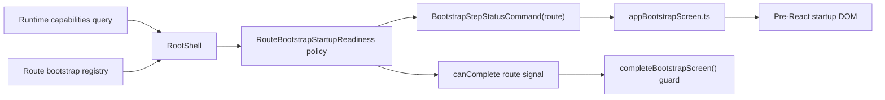

# TF-E2-M-D Startup Route Readiness Implementation Plan

## Governing Sources

- `AGENTS.md`
- `docs/planning/status/governance-document-rule-inventory.md`
- `docs/planning/state/agent-lane-e.yaml`
- `docs/guides/ai-work-protocol.md`
- `docs/guides/testing-and-ci-capabilities.md`
- `docs/architecture/command-query-rail-governance.md`
- `docs/architecture/fowler-opportunity-planning-governance.md`
- `docs/architecture/components/web/app-bootstrap-screen-component.md`

## Problem Statement

The fifth startup check is route readiness. Today `RootShell` forwards the
active route publication directly into the pre-React bootstrap screen. That
means a route that momentarily publishes `complete` before runtime capabilities
settle, or a route seam that falls back to its initial `pending` publication
after a governed terminal publication, can make the startup gate look like a
bouncing or half-loaded module.

The product value is operational clarity: a user or operator must be able to
tell whether Raven is still waiting for runtime capability posture, whether the
route rendered a governed recovery surface, or whether startup is actually
ready. The startup gate must not make unsafe route readiness look complete
before capability posture is visible.

## Fowler Analysis

| Signal               | Current risk                                                                          | Correction                                                                                 |
| -------------------- | ------------------------------------------------------------------------------------- | ------------------------------------------------------------------------------------------ |
| Boundary drift       | `RootShell` mixes route publication with cross-step readiness ordering.               | Move cross-step route readiness into a pure policy owned by app bootstrap.                 |
| Duplicate semantics  | Route components decide readiness and root decides final shell reveal separately.     | Route readiness policy returns both the effective route command and can-complete posture.  |
| Temporal coupling    | A route may publish before capabilities settle.                                       | Suppress route `complete` while capabilities are in cold-start pending.                    |
| Test-only confidence | Existing tests cover route complete/failure, but not demotion or capability ordering. | Add negative unit, root integration, architecture, and Cypress user-flow coverage.         |
| Documentation drift  | Component guide describes the screen but not the new route-readiness invariant.       | Update the component guide with API, invariants, transitions, consumers, and test mapping. |

Compared with mature systems, this follows a small presentation policy instead
of hiding the issue in effects, retry timing, or copy. Mature startup gates keep
cross-step readiness as an explicit state machine with no presentation
regression after a terminal signal for the same route.

## Command And Query Rail

| Rail                                | Type    | Owning bounded context    | DDD owner                                        | Application port                                                | Adapter surface                               | Scope and authorization                                                                                     | Negative tests                                                                                                                                  |
| ----------------------------------- | ------- | ------------------------- | ------------------------------------------------ | --------------------------------------------------------------- | --------------------------------------------- | ----------------------------------------------------------------------------------------------------------- | ----------------------------------------------------------------------------------------------------------------------------------------------- |
| `ObserveAppBootstrapRouteReadiness` | query   | Web Shell / App Bootstrap | `RouteBootstrapStartupReadinessState` read model | Active route bootstrap registry plus runtime capabilities query | `RootShell` route readiness policy            | Browser-local observation only; no tenant data mutation; inherits active route and capability query posture | Route `complete` before capabilities settle stays pending; same route cannot demote stable posture to pending; route id change resets stability |
| `PublishAppBootstrapStepStatus`     | command | Web Shell / App Bootstrap | `BootstrapStepStatusCommand` value object        | `setBootstrapStepStatus`                                        | Pre-React `appBootstrapScreen.ts` DOM adapter | Browser-local DOM startup gate command; no backend authorization decision                                   | Effective route command must be generated from policy, not raw route presentation                                                               |
| `CompleteAppBootstrapScreen`        | command | Web Shell / App Bootstrap | `BootstrapScreenState` aggregate                 | `completeBootstrapScreen`                                       | Pre-React `appBootstrapScreen.ts` DOM adapter | Browser-local shell reveal; guarded by all step states                                                      | Complete is not called while capabilities cold-start pending                                                                                    |

No new externally observable behavior may be implemented outside these rails.

## DDD Objects

| Object                                | Type                   | Owned concern                                                                                           |
| ------------------------------------- | ---------------------- | ------------------------------------------------------------------------------------------------------- |
| `RouteBootstrapStartupReadinessState` | read model             | Remembers same-route stable route readiness so terminal or blocker posture does not regress to pending. |
| `RouteBootstrapPresentation`          | value object           | Route-published readiness posture and detail copy.                                                      |
| `RuntimeCapabilitiesBootstrapState`   | query input            | Whether capability posture is still in cold-start pending.                                              |
| `BootstrapStepStatusCommand`          | command value object   | The only command shape sent to the pre-React bootstrap screen for a step.                               |
| `BootstrapScreenState`                | presentation aggregate | The startup gate aggregate that guards visible state and DOM removal.                                   |

## Solution Design



The implementation adds one pure app-bootstrap policy:

1. If the active route changes, discard the previous stable route posture.
2. If runtime capabilities are still in cold-start pending and the active route
   publishes `complete`, publish an effective route `pending` command with
   capability-waiting copy.
3. If the same route already published a stable posture and later falls back to
   `pending`, keep the stable posture.
4. If the route publishes `failed`, `blocked`, `error`, or `complete`, store it
   as the stable posture for that route.
5. `RootShell` uses the effective policy result for both the route startup
   command and shell completion attempt.

## User Stories

| Story            | Scenario                                                                                 | Acceptance                                                                                                                |
| ---------------- | ---------------------------------------------------------------------------------------- | ------------------------------------------------------------------------------------------------------------------------- |
| US-TF-E2-M-D-001 | As an operator, I see route readiness wait while runtime capabilities are still loading. | Capabilities remains pending, route does not show `complete`, progress does not show all checks settled.                  |
| US-TF-E2-M-D-002 | As an operator, I see a governed route failure remain stable.                            | A route `failed` publication is visible and a later same-route pending publication does not regress the fifth check.      |
| US-TF-E2-M-D-003 | As a user, I can recover from a governed route failure.                                  | The same route can move from failed to complete and the startup gate can finish once capabilities and health are settled. |
| US-TF-E2-M-D-004 | As a navigator, I do not inherit stale readiness from another route.                     | Changing route id resets the stable route posture and uses the new route's pending posture.                               |
| US-TF-E2-M-D-005 | As a maintainer, I can mechanically prove the slice.                                     | Unit, root integration, architecture, Cypress, feature mechanization, and prepush gates cover the declared rails.         |

## Test Strategy

| Layer            | Command                                                                                          | Coverage                                                                                   |
| ---------------- | ------------------------------------------------------------------------------------------------ | ------------------------------------------------------------------------------------------ |
| Unit TDD         | `pnpm --filter @dvt/web test -- routeBootstrapStartupReadiness.test.ts`                          | Policy red/green for capability ordering, stable route demotion, recovery, route-id reset. |
| Root integration | `pnpm --filter @dvt/web test -- Root.bootstrapFlow.test.tsx`                                     | Root publishes effective route command and does not complete before capabilities settle.   |
| Architecture     | `pnpm --filter @dvt/web test -- routeBootstrapStartupReadiness.architecture.test.ts`             | Semantic ownership, no Canvas coupling, Root uses policy, docs carry rail/invariants.      |
| Cypress          | `pnpm --filter @dvt/web test:e2e:startup-route-readiness`                                        | User-visible startup gate waits on capabilities after the Canvas route becomes routable.   |
| Mechanization    | `pnpm docs:feature-mechanization:tf-e2-m-d` and `pnpm docs:feature-mechanization:implementation` | Declared diff surfaces, symbols, rails, and Cypress draft-boundary rules.                  |
| Closeout         | `pnpm verify:prepush`                                                                            | Repository prepush baseline.                                                               |

## Feature Mechanization Manifest

```feature-mechanization
version: 1
featureId: TF-E2-M-D
mechanizationStatus: closed
noHumanDecisionsRemaining: true
implementationPlan: docs/planning/proposals/mandatory/frontend-and-ux/tf-e2-m-d-startup-route-readiness-implementation-plan-20260502.md
componentGuides:
  - docs/architecture/components/web/app-bootstrap-screen-component.md
userStories:
  - docs/planning/proposals/mandatory/frontend-and-ux/tf-e2-m-d-startup-route-readiness-implementation-plan-20260502.md
governingSources:
  - AGENTS.md
  - docs/planning/status/governance-document-rule-inventory.md
  - docs/planning/state/agent-lane-e.yaml
  - docs/guides/ai-work-protocol.md
  - docs/guides/testing-and-ci-capabilities.md
  - docs/architecture/command-query-rail-governance.md
  - docs/architecture/fowler-opportunity-planning-governance.md
  - docs/architecture/components/web/app-bootstrap-screen-component.md
allowedImplementationSurfaces:
  - apps/web/src/app/routes.ts
  - apps/web/src/app/routes.test.tsx
  - apps/web/src/app/Root.tsx
  - apps/web/src/app/Root.bootstrapFlow.test.tsx
  - apps/web/src/app/bootstrap/appBootstrapCopy.ts
  - apps/web/src/app/bootstrap/routeBootstrapStartupReadiness.ts
  - apps/web/src/app/bootstrap/routeBootstrapStartupReadiness.test.ts
  - apps/web/src/app/bootstrap/routeBootstrapStartupReadiness.architecture.test.ts
  - apps/web/cypress/e2e/shell/startup-route-readiness.cy.ts
  - apps/web/package.json
  - buzon/20260502-tf-e2-m-d-startup-route-readiness-fowler-review.md
  - docs/.manifest.json
  - docs/**/index.md
  - docs/architecture/components/web/app-bootstrap-screen-component.md
  - docs/planning/proposals/mandatory/frontend-and-ux/tf-e2-m-d-startup-route-readiness-implementation-plan-20260502.md
  - docs/planning/state/agent-lane-e.yaml
  - docs/planning/state/agent-lane-e.md
  - docs/planning/state/execution-workboard.md
  - docs/planning/state/open-task-route.md
  - docs/planning/status/**
  - package.json
forbiddenImplementationSurfaces:
  - apps/api/**
  - packages/**
  - specs/contracts/**
  - apps/web/src/app/views/canvas/canvasDraftLocalNodeCatalog.ts seeded project nodes in clean startup
  - apps/web/src/app/services/workspace/** persistence semantics
  - apps/web/src/app/services/api/** token refresh behavior
commandQueryRails:
  - name: ObserveAppBootstrapRouteReadiness
    type: query
    dddOwner: RouteBootstrapStartupReadinessState read model
  - name: PublishAppBootstrapStepStatus
    type: command
    dddOwner: BootstrapStepStatusCommand value object
  - name: CompleteAppBootstrapScreen
    type: command
    dddOwner: BootstrapScreenState presentation aggregate
domainObjects:
  - name: RouteBootstrapStartupReadinessState
    type: read model
    owner: Web Shell / App Bootstrap
  - name: RouteBootstrapPresentation
    type: value object
    owner: Web Shell / App Bootstrap
  - name: RuntimeCapabilitiesBootstrapState
    type: query input
    owner: Runtime capability query boundary
  - name: BootstrapStepStatusCommand
    type: command value object
    owner: App bootstrap screen component
  - name: BootstrapScreenState
    type: presentation aggregate
    owner: App bootstrap screen component
fowlerSignals:
  - Boundary drift
  - Duplicate semantics
  - Temporal coupling
  - Test-only confidence
  - Documentation drift
architectureGuards:
  - pnpm --filter @dvt/web test -- routeBootstrapStartupReadiness.architecture.test.ts
  - pnpm docs:feature-mechanization:tf-e2-m-d
cypressFlows:
  - pnpm --filter @dvt/web test:e2e:startup-route-readiness
completionGate:
  - pnpm docs:feature-mechanization:tf-e2-m-d
  - pnpm docs:feature-mechanization:implementation
  - pnpm --filter @dvt/web test -- routeBootstrapStartupReadiness.test.ts
  - pnpm --filter @dvt/web test -- Root.bootstrapFlow.test.tsx
  - pnpm --filter @dvt/web test -- routeBootstrapStartupReadiness.architecture.test.ts
  - pnpm --filter @dvt/web test:e2e:startup-route-readiness
  - pnpm --filter @dvt/web typecheck
  - pnpm verify:prepush
redGreenCycles:
  - id: route-readiness-policy
    redTest: pnpm --filter @dvt/web test -- routeBootstrapStartupReadiness.test.ts
    expectedFailure: routeBootstrapStartupReadiness.ts does not exist and policy semantics are not implemented.
    patchSurfaces:
      - apps/web/src/app/bootstrap/routeBootstrapStartupReadiness.ts
      - apps/web/src/app/bootstrap/routeBootstrapStartupReadiness.test.ts
      - apps/web/src/app/bootstrap/appBootstrapCopy.ts
    greenTest: pnpm --filter @dvt/web test -- routeBootstrapStartupReadiness.test.ts
  - id: root-route-readiness-wiring
    redTest: pnpm --filter @dvt/web test -- Root.bootstrapFlow.test.tsx
    expectedFailure: RootShell forwards raw route readiness and can complete while capabilities are still cold-start pending.
    patchSurfaces:
      - apps/web/src/app/Root.tsx
      - apps/web/src/app/Root.bootstrapFlow.test.tsx
    greenTest: pnpm --filter @dvt/web test -- Root.bootstrapFlow.test.tsx
  - id: semantic-architecture-guard
    redTest: pnpm --filter @dvt/web test -- routeBootstrapStartupReadiness.architecture.test.ts
    expectedFailure: semantic guard for route readiness policy ownership is absent.
    patchSurfaces:
      - apps/web/src/app/bootstrap/routeBootstrapStartupReadiness.architecture.test.ts
      - docs/architecture/components/web/app-bootstrap-screen-component.md
    greenTest: pnpm --filter @dvt/web test -- routeBootstrapStartupReadiness.architecture.test.ts
  - id: startup-route-readiness-cypress
    redTest: pnpm --filter @dvt/web test:e2e:startup-route-readiness
    expectedFailure: Cypress proof does not exist for route ready before capabilities settle.
    patchSurfaces:
      - apps/web/cypress/e2e/shell/startup-route-readiness.cy.ts
      - apps/web/package.json
    greenTest: pnpm --filter @dvt/web test:e2e:startup-route-readiness
  - id: docs-and-lane-closeout
    redTest: pnpm docs:feature-mechanization:tf-e2-m-d
    expectedFailure: TF-E2-M-D implementation plan, component guide, and lane evidence are not aligned.
    patchSurfaces:
      - docs/planning/proposals/mandatory/frontend-and-ux/tf-e2-m-d-startup-route-readiness-implementation-plan-20260502.md
      - docs/architecture/components/web/app-bootstrap-screen-component.md
      - docs/planning/state/agent-lane-e.yaml
      - docs/planning/state/agent-lane-e.md
      - docs/planning/state/execution-workboard.md
      - docs/planning/state/open-task-route.md
      - docs/.manifest.json
      - docs/planning/status/**
      - package.json
    greenTest: pnpm docs:feature-mechanization:tf-e2-m-d
symbols:
  - name: RouteBootstrapStartupReadinessState
    path: apps/web/src/app/bootstrap/routeBootstrapStartupReadiness.ts
    dddOwner: RouteBootstrapStartupReadinessState read model
    cqRails:
      - ObserveAppBootstrapRouteReadiness
    fowlerSignals:
      - Boundary drift
      - Temporal coupling
    architectureGuard: routeBootstrapStartupReadiness.architecture.test.ts
    cypressCoverage: startup-route-readiness.cy.ts
    unitTests:
      - routeBootstrapStartupReadiness.test.ts
  - name: RouteBootstrapStartupReadinessArgs
    path: apps/web/src/app/bootstrap/routeBootstrapStartupReadiness.ts
    dddOwner: RouteBootstrapStartupReadinessState read model
    cqRails:
      - ObserveAppBootstrapRouteReadiness
    fowlerSignals:
      - Boundary drift
      - Temporal coupling
    architectureGuard: routeBootstrapStartupReadiness.architecture.test.ts
    cypressCoverage: startup-route-readiness.cy.ts
    unitTests:
      - routeBootstrapStartupReadiness.test.ts
  - name: RouteBootstrapStartupReadinessResolution
    path: apps/web/src/app/bootstrap/routeBootstrapStartupReadiness.ts
    dddOwner: BootstrapStepStatusCommand value object
    cqRails:
      - ObserveAppBootstrapRouteReadiness
      - PublishAppBootstrapStepStatus
      - CompleteAppBootstrapScreen
    fowlerSignals:
      - Duplicate semantics
      - Temporal coupling
    architectureGuard: routeBootstrapStartupReadiness.architecture.test.ts
    cypressCoverage: startup-route-readiness.cy.ts
    unitTests:
      - routeBootstrapStartupReadiness.test.ts
  - name: createInitialRouteBootstrapStartupReadinessState
    path: apps/web/src/app/bootstrap/routeBootstrapStartupReadiness.ts
    dddOwner: RouteBootstrapStartupReadinessState read model
    cqRails:
      - ObserveAppBootstrapRouteReadiness
    fowlerSignals:
      - Boundary drift
      - Documentation drift
    architectureGuard: routeBootstrapStartupReadiness.architecture.test.ts
    cypressCoverage: startup-route-readiness.cy.ts
    unitTests:
      - routeBootstrapStartupReadiness.test.ts
  - name: resolveRouteBootstrapStartupReadiness
    path: apps/web/src/app/bootstrap/routeBootstrapStartupReadiness.ts
    dddOwner: RouteBootstrapStartupReadinessState read model
    cqRails:
      - ObserveAppBootstrapRouteReadiness
      - PublishAppBootstrapStepStatus
      - CompleteAppBootstrapScreen
    fowlerSignals:
      - Boundary drift
      - Duplicate semantics
      - Temporal coupling
      - Test-only confidence
    architectureGuard: routeBootstrapStartupReadiness.architecture.test.ts
    cypressCoverage: startup-route-readiness.cy.ts
    unitTests:
      - routeBootstrapStartupReadiness.test.ts
  - name: resolveEffectiveRoutePresentation
    path: apps/web/src/app/bootstrap/routeBootstrapStartupReadiness.ts
    dddOwner: RouteBootstrapStartupReadinessState internal policy helper
    cqRails:
      - ObserveAppBootstrapRouteReadiness
      - PublishAppBootstrapStepStatus
      - CompleteAppBootstrapScreen
    fowlerSignals:
      - Boundary drift
      - Temporal coupling
    architectureGuard: routeBootstrapStartupReadiness.architecture.test.ts
    cypressCoverage: startup-route-readiness.cy.ts
    unitTests:
      - routeBootstrapStartupReadiness.test.ts
  - name: resolveCapabilitiesSuppressedPresentation
    path: apps/web/src/app/bootstrap/routeBootstrapStartupReadiness.ts
    dddOwner: RouteBootstrapStartupReadinessState internal policy helper
    cqRails:
      - ObserveAppBootstrapRouteReadiness
      - PublishAppBootstrapStepStatus
      - CompleteAppBootstrapScreen
    fowlerSignals:
      - Boundary drift
      - Temporal coupling
    architectureGuard: routeBootstrapStartupReadiness.architecture.test.ts
    cypressCoverage: startup-route-readiness.cy.ts
    unitTests:
      - routeBootstrapStartupReadiness.test.ts
  - name: isStableRouteBootstrapStatus
    path: apps/web/src/app/bootstrap/routeBootstrapStartupReadiness.ts
    dddOwner: RouteBootstrapStartupReadinessState internal policy helper
    cqRails:
      - ObserveAppBootstrapRouteReadiness
    fowlerSignals:
      - Duplicate semantics
      - Test-only confidence
    architectureGuard: routeBootstrapStartupReadiness.architecture.test.ts
    cypressCoverage: startup-route-readiness.cy.ts
    unitTests:
      - routeBootstrapStartupReadiness.test.ts
  - name: PublicRouteBootstrapBoundary
    path: apps/web/src/app/routes.ts
    dddOwner: BootstrapScreenState presentation aggregate
    cqRails:
      - PublishAppBootstrapStepStatus
      - CompleteAppBootstrapScreen
    fowlerSignals:
      - Boundary drift
      - Documentation drift
    architectureGuard: routeBootstrapStartupReadiness.architecture.test.ts
    cypressCoverage: startup-route-readiness.cy.ts
    unitTests:
      - routes.test.tsx
  - name: mountBootstrapDom
    path: apps/web/src/app/routes.test.tsx
    dddOwner: BootstrapScreenState test fixture
    cqRails:
      - CompleteAppBootstrapScreen
    fowlerSignals:
      - Test-only confidence
    architectureGuard: routeBootstrapStartupReadiness.architecture.test.ts
    cypressCoverage: startup-route-readiness.cy.ts
    unitTests:
      - routes.test.tsx
```

## Implementation Order

1. Add red unit and integration tests for the readiness policy.
2. Add the pure policy and capability-waiting copy.
3. Wire `RootShell` to publish the effective route command and completion
   posture.
4. Add architecture and Cypress proofs.
5. Update component guide, lane evidence, generated docs state, and
   mechanization metadata.
6. Run targeted tests, Cypress, typecheck, docs gates, and prepush.

## Risks And Controls

| Risk                                                                    | Control                                                                                                                  |
| ----------------------------------------------------------------------- | ------------------------------------------------------------------------------------------------------------------------ |
| Startup screen never completes after health settles.                    | Root completion effect stays dependent on health, capability, and effective route completion posture.                    |
| Policy hides real route failures.                                       | Only suppress `complete` while capabilities cold-start; `failed`, `blocked`, and `error` remain visible.                 |
| Stable posture leaks across route navigation.                           | State is keyed by active route id and resets on route id change.                                                         |
| Cypress creates false confidence with fake draft endpoint interception. | Cypress uses fetch-level e2e stubs and does not use `cy.intercept()` for `/workspace/graph/draft` or direct draft `PUT`. |
