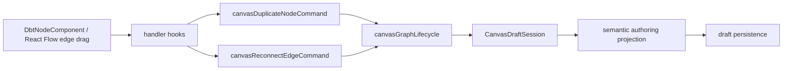
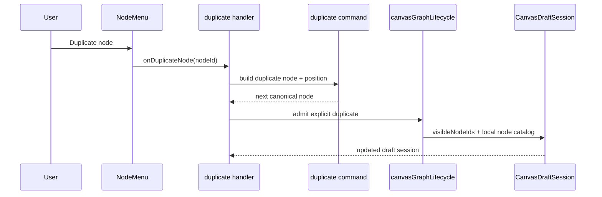
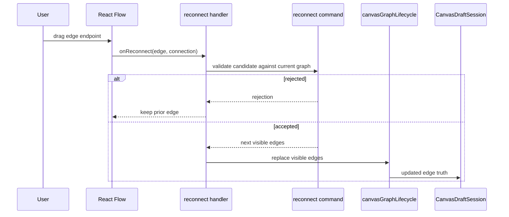

# TF-E2 Node And Edge Lifecycle Closure Plan 2026-04-25

## Summary

This proposal closes the remaining production lifecycle route after the
Inspector hard cut:

- `TF-E2-B`: duplicate-node persistence and move or reload proof closure
- `TF-E2-C`: edge reconnect semantics and reload-proof edge persistence

The important audit result is simple:

- move and reload already have real proof lanes
- duplicate node does not have a governed command surface
- edge reconnect is not wired into React Flow at all

That means the residual work is not "refactor until it feels cleaner". It is a
product-capability gap.

## Governing Sources

- `AGENTS.md`
- `docs/planning/status/governance-document-rule-inventory.md`
- `docs/guides/ai-work-protocol.md`
- `docs/planning/state/agent-lane-e.yaml`
- `docs/planning/proposals/mandatory/frontend-and-ux/tf-e2-production-node-authoring-and-persistence-plan-20260416.md`
- `docs/planning/proposals/mandatory/frontend-and-ux/tf-e2-canvas-target-architecture-execution-plan-20260417.md`
- `docs/planning/proposals/mandatory/frontend-and-ux/tf-e2-inspector-authoring-and-lifecycle-closure-plan-20260425.md`
- `docs/architecture/components/web/graph/canvas-graph-lifecycle-component.md`
- `docs/architecture/components/web/graph/graph-canvas-runtime-model.md`

## Audit

### Current state

| Concern        | Current owner                            | State now                                                              | Gap                                                         |
| -------------- | ---------------------------------------- | ---------------------------------------------------------------------- | ----------------------------------------------------------- |
| node create    | `useCanvasAuthoringNodeCreationHandlers` | implemented and proven                                                 | none                                                        |
| node remove    | `useCanvasNodeRemovalHandlers`           | implemented and proven                                                 | none                                                        |
| node move      | route + draft lifecycle                  | implemented and proven                                                 | final planning closure only                                 |
| node duplicate | none                                     | absent                                                                 | no command seam, no UI affordance, no persistence proof     |
| edge create    | `useCanvasEdgeAuthoringHandlers`         | implemented and proven                                                 | none                                                        |
| edge delete    | `useCanvasEdgeChangeHandlers`            | implemented and proven                                                 | none                                                        |
| edge reconnect | none                                     | absent                                                                 | not wired to React Flow, no validation or persistence proof |
| reload proof   | controller and route tests               | exists for conflict, missing-remote, projection scope, and host cycles | missing duplicate-node and reconnect-edge reload evidence   |

### Fowler reading

- `canvasGraphLifecycle` is the aggregate-local mutation component.
- Duplicate-node identity generation is not aggregate mutation; it is an
  adjacent application command.
- Edge reconnect is also an application command because it revalidates a new
  connection candidate against the existing graph before applying mutation.
- `DbtNodeComponent.tsx` and `CanvasViewport.tsx` must remain transport or
  passive adapters. They can expose gestures, but they must not own duplicate
  or reconnect policy.

## Comparison With Mature Systems

- Mature node-graph workbenches such as NiFi or Node-RED let operators clone a
  node configuration without copying edge attachments blindly. The duplicate is
  a new node identity with copied configuration and a displaced position.
- Mature graph editors let edge reconnect reuse the same validation rules as
  edge creation. They do not special-case reconnect into an unvalidated visual
  move.
- Mature editors also keep reconnect as one semantic edit over the same graph
  truth, not as an invisible delete plus add split across unrelated UI hooks.

The same rules fit this Canvas route.

## Architectural Decision

Add two explicit command seams beside `canvasGraphLifecycle`:

1. `canvasDuplicateNodeCommand`
2. `canvasReconnectEdgeCommand`

`canvasGraphLifecycle` stays responsible for mutation over the working set.
These new commands stay responsible for:

- generating duplicate-node identity, name, and placement
- validating reconnect against the same connection guards used for edge create
- producing the next visible graph that is then committed through
  `canvasGraphLifecycle`

## Decision Rules

1. Duplicate node creates a new node identity; it does not mutate the original
   node.
2. Duplicate node copies governed metadata and description, but does not copy
   attached edges.
3. Duplicate node re-enters the same draft aggregate and persistence flow as
   create, move, and edit.
4. Edge reconnect preserves one semantic edge identity in the viewport while
   replacing its endpoints.
5. Reconnect reuses the same connection validation rules as edge creation, with
   the edited edge excluded from duplicate checks.
6. Invalid reconnect stays fail-closed and leaves the prior edge untouched.
7. Neither duplicate nor reconnect logic may live in `DbtNodeComponent.tsx` or
   `CanvasViewport.tsx`.

## Proposed Topology

## Sequence: Duplicate Node

## Sequence: Reconnect Edge

## User Stories

### US-E2-020: duplicate a node without duplicating its edges

As an operator, I can duplicate a node from the canvas itself and get a new
editable node with copied metadata and a displaced position.

Acceptance:

- duplicate creates a new node id
- duplicate keeps description, tags, and metadata
- duplicate does not copy inbound or outbound edges
- duplicate survives draft save and reload

### US-E2-021: reconnect an edge through the canonical graph truth

As an operator, I can reconnect an existing edge to a new valid target or
source, and invalid reconnects are rejected without corrupting the current
graph.

Acceptance:

- reconnect is available only in writable posture
- duplicate-edge, self-loop, cycle, and plugin-rule failures stay fail-closed
- accepted reconnect updates the same canonical draft truth used by reload

### US-E2-022: move and reload proof stay green after duplicate and reconnect

As the route owner, I need duplicate and reconnect to coexist with the existing
move, conflict, and missing-remote posture.

Acceptance:

- existing move and reload proofs stay green
- duplicate and reconnect add focused proof rather than widening unrelated
  adapters

## TDD Route

1. Red: duplicate-node command tests for new id, copied metadata, displaced
   position, and no copied edges.
2. Green: duplicate-node command and handler seam.
3. Red: reconnect command tests for accepted reconnect and fail-closed
   rejection.
4. Green: React Flow `onReconnect` wiring plus draft-session persistence.
5. Red: controller or route lifecycle proof for duplicate and reconnect reload.
6. Green: docs, workboard, matrix, and closeout.

## Exit Criteria

This residual route is complete only when:

- duplicate node is user-triggerable
- reconnect edge is user-triggerable
- both write through the canonical draft aggregate
- reload proof exists for the new semantics
- docs and planning no longer claim those capabilities are still open
