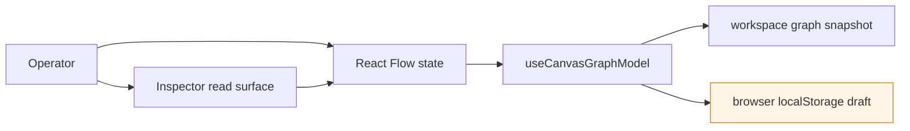
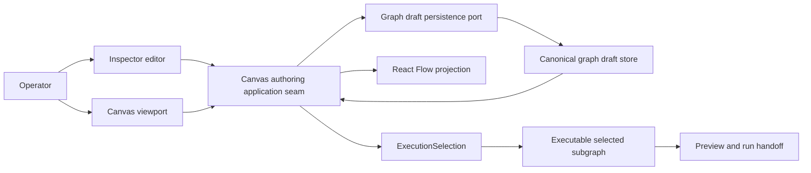

# TF-E2 Production Node Authoring And Persistence Plan 2026-04-16

## Summary

`TF-E1` closed the first operator-usable transformation vertical. It did not
close production-grade authoring for editable nodes.

This proposal defines the next governed slice: make Canvas node authoring
behave like a real product surface with canonical persistence, durable edges,
editable properties, deterministic reload, and a proof-oriented test matrix.

The decision is to keep this work in `Lane E`. A new lane is not required. A
new planning slice is required.

The active implementation posture is also explicit after the 2026-04-20 sync:
no retrocompatibility path will be preserved on the active Canvas authoring
route once the typed draft-authoring port is adopted.

## Related execution companion

The target-architecture execution companion for this proposal lives in
[TF-E2 Canvas Target Architecture Execution Plan 2026-04-17](./tf-e2-canvas-target-architecture-execution-plan-20260417.md).

Use that document when the question is not "what is the scope of TF-E2" but
"how do we arrive at the target architecture through executable backlog,
bounded contexts, ports, aggregates, and phased validation".

## Governing sources

- `docs/planning/status/governance-document-rule-inventory.md`
- `docs/guides/ai-work-protocol.md`
- `docs/planning/state/planning-control-tower.md`
- `docs/planning/state/how-to-add-tasks.md`
- `docs/planning/state/agent-lane-e.yaml`
- `docs/planning/proposals/mandatory/runtime-and-contracts/tf-a2-workspace-graph-draft-persistence-boundary-plan-20260416.md`
- `docs/planning/proposals/mandatory/runtime-and-contracts/transformation-flow-architecture-and-contracts-20260405.md`
- `docs/planning/proposals/mandatory/runtime-and-contracts/transformation-flow-delivery-plan-20260405.md`
- `docs/architecture/components/web/graph/canvas-component-map-and-modernization-review.md`
- `docs/architecture/components/web/inspector/inspector-frontend-architecture.md`
- `docs/architecture/components/web/frontend-data-boundary-architecture.md`
- `docs/architecture/components/web/ux-implementation-guide.md`

## Problem statement

Today the graph authoring surface still mixes three different truth models:

1. workspace graph snapshot returned by the workspace service
2. route-local React Flow state
3. browser-local draft persistence keyed by workspace in `localStorage`

That mixture is enough for MVP experimentation, but it is not an acceptable
product persistence model. Hard reload and mutation behavior can drift because
the editable graph is not yet owned by one canonical persistence boundary.

The target for this slice is not visual polish. It is operational integrity.

## Current-state findings

### What is already in place

- `TF-E1` already proved the first `design -> plan -> run -> result` loop.
- the Canvas route already has one controller seam and one graph-handler seam
- layout persistence for viewport and node positions already exists
- selection-driven Inspector rendering already exists
- negative-path tests already exist around graph handlers and execution actions
- the composition root now exposes `workspaceGraphDraftAuthoringPort` beside
  `workspaceService`
- the active Canvas draft read and write path now routes through
  `IWorkspaceGraphDraftAuthoringPort` via `canvasDraftRepository`
- save attempts still build governed `DesignGraphDraft` payloads from scoped
  canonical nodes, canonical edges, and preview provenance Git metadata before
  hitting the protected draft-authoring boundary
- that shape is now the active architectural drift: it proves the typed port is
  wired, but it still treats the editable draft as a compile artifact and
  therefore blocks graph-first incomplete authoring states such as the first
  node on an empty Canvas
- preview and run still need a governed selection seam: runnable SQL nodes must
  execute through a selected dependency closure, not by requiring the whole
  editable draft to be compile-valid

### What is still not product-grade

- the projected `WorkspaceGraphDraft` DTO still survives as an internal
  projection and mock or test seam, so route presentation has not yet switched
  to the full typed capability and format-outcome model
- explicit writable, read-only, and forbidden posture from boundary outcomes
  still needs full route-level closure across toolbar affordances, graph
  mutation gating, and Inspector editing posture
- node CRUD, edge CRUD, and property editing are not yet closed around one
  canonical save and reload contract
- property editing is weaker than read-heavy inspection
- reload correctness is not yet proven through a dedicated end-to-end matrix
- React Flow render state can still become more authoritative than the governed
  authoring model if mutations are not routed through one persistence owner

## Decision

`Lane E` owns the frontend productization slice.

This slice must not ship with fake persistence. If the current backend or
workspace boundary cannot own canonical graph-draft persistence, the follow-up
must be planned explicitly in the relevant backend lane instead of letting the
frontend pretend that `localStorage` is the product source of truth.

For the active Canvas authoring path, this proposal also rejects a long-lived
compatibility phase. `TF-E2-A` must hard-cut from
`IWorkspacePort.getGraphDraft/saveGraphDraft` to
`IWorkspaceGraphDraftAuthoringPort` once the route and composition seams are
ready.

## Blocking dependency chain

`TF-E2` is not allowed to define the persistence boundary locally.

Execution order is:

1. `TF-A2` freezes the typed workspace graph authoring-draft contract and
   separates it from compile-ready `DesignGraphDraft`
2. `TF-C4` implements the protected API/store boundary for that corrected
   contract
3. `TF-A2-C` defines `ExecutionSelection` and the selected-subgraph projection
   used by preview and run
4. `TF-E2-A` adopts the shared boundary inside Canvas and Inspector flows

That means `TF-E2-A` is adoption work, not contract invention.

## Current state diagram



The risk is not that local draft state exists. The risk is that it can become
the de facto authoring truth for product behavior.

## Target state diagram



Rules:

- React Flow is a projection, not the source of truth
- Inspector edits go through the same authoring seam as graph mutations
- reload always rehydrates from the canonical draft store first
- preview and run consume a selected executable subgraph derived from the same
  canonical authoring truth
- loose nodes outside the selected dependency closure do not block a selected
  runnable SQL node
- the active authoring route does not preserve a second compatibility seam over
  the projected `WorkspaceGraphDraft` DTO

## Functional requirements

The slice is complete only when all of the following are true:

1. node create, delete, duplicate, and move operations update the canonical
   draft
2. edge create, delete, and reconnect operations update the canonical draft
3. node properties edited through the Inspector are validated and saved
4. hard reload restores nodes, edges, and editable properties deterministically
5. invalid graph mutations fail closed with explicit UX feedback
6. planning and run handoff read the same persisted authoring truth through an
   explicit `ExecutionSelection` and selected dependency closure
7. editable graph reads and writes travel through the governed workspace
   graph-draft contract rather than route-local DTOs or browser-local state
8. saves use compare-and-swap against the authoritative draft revision instead
   of blind overwrite
9. stale or conflicting writes return explicit caller-visible conflict behavior
10. retrying the same logical save after transport failure is idempotent and
    does not duplicate semantic state changes
11. degraded or unavailable persistence renders explicit route states instead of
    silently falling back to fake success
12. active tenant, project, and environment scope is explicit in the caller
    journey for graph-draft reads and writes
13. read-authorized but write-forbidden callers enter an explicit Canvas
    read-only state instead of discovering permission loss through failed edits
14. authorization denials and protected write attempts are auditable through the
    governed backend boundary rather than inferred from frontend logs
15. the slice emits or preserves enough telemetry and correlation data to be
    operable under live failure conditions rather than only testable in local UX
16. hard reload either rehydrates the active governed draft schema or fails
    closed with an explicit typed recovery outcome for non-active or
    unsupported schema versions
17. unsupported or corrupt persisted drafts fail closed with explicit recovery
    UX rather than silently resetting to empty or browser-local state

## Non-goals

- redesigning the `transformation-sql-first-v1` contract
- broadening the planner profile beyond the governed SQL-first vertical
- replacing the Canvas route with another editor
- inventing plugin-owned persistence semantics inside the frontend

## Work packages

### TF-E2-A. Canonical graph-draft ownership

Define the canonical owner for editable graph drafts and the exact boundary
between Canvas state, workspace APIs, and browser-local fallback behavior.

Output:

- adoption of the shared workspace graph-draft contract defined by `TF-A2`
- Canvas reads and writes flow through the protected API/store path landed by
  `TF-C4`
- the active Canvas authoring route cuts over to
  `IWorkspaceGraphDraftAuthoringPort` through the composition root instead of
  continuing over `IWorkspacePort.getGraphDraft/saveGraphDraft`
- Canvas save behavior uses compare-and-swap and the explicit reject-on-stale
  merge posture defined by the shared contract
- Canvas consumes explicit capability outcomes for writable, read-only, and
  forbidden posture instead of inferring editability from local route state
- Canvas consumes explicit format metadata and typed format-evolution failures
  instead of assuming one timeless serialization shape
- no route-local DTO, hook-local save envelope, or `localStorage` authority
  remains on the active product path
- the projected `WorkspaceGraphDraft` DTO is no longer an active-authoring
  compatibility surface in Canvas
- explicit fail-closed behavior when canonical persistence is unavailable

### TF-E2-B. Node lifecycle persistence

Close node create, delete, duplicate, move, and reload behavior around the
canonical graph-draft boundary.

Output:

- node mutations persist through the canonical authoring seam
- hard reload rehydrates nodes from canonical truth for the active governed
  schema and fails closed for non-active or unsupported schemas
- route state distinguishes pending save, save failure, and saved states
- stale revision conflicts trigger explicit reload-or-reapply UX instead of
  silent overwrite
- read-only posture keeps node inspection available while mutation controls are
  gated with explicit product wording
- corrupt or unsupported persisted drafts surface explicit degraded recovery
  posture instead of silent reset

### TF-E2-C. Edge lifecycle and graph guards

Close edge create, delete, reconnect, and visibility behavior around the same
canonical model.

Output:

- edge mutations persist and survive reload
- invalid or partial connections fail closed
- edge visibility is driven by canonical graph state, not transient modal state
- edge creation, reconnect, and delete affordances are disabled in read-only
  posture without hiding graph visibility

### TF-E2-D. Inspector-backed property editing

Turn the Inspector from a mostly read-heavy panel into the canonical editing
surface for governed node properties.

Output:

- the route-owned Inspector is the writable property-editing surface for
  governed node types in this slice
- validation, dirty-state handling, save, cancel, and reload behavior
- saved properties round-trip into graph rehydration and preview inputs
- Inspector reflects read-only capability explicitly and does not present fake
  save affordances when write permission is absent
- plugin-owned or auxiliary inspector panels remain read-only until a governed
  follow-up proposal expands their write ownership

### TF-E2-E. Proof-oriented test matrix

Add the automated proof baseline for the full authoring lifecycle.

Output:

- unit tests for graph mutation reducers, guards, and serialization
- integration tests for controller plus Inspector edit flows
- Cypress coverage for create, connect, edit, reload, and delete behavior
- negative-path coverage for save failure, invalid connection, and stale reload
- execution-action test-file splitting on `main` is baseline; the remaining
  proof work is shared test-support and application-service/command coverage

## Operability baseline

`TF-E2` is not complete when the route only works in tests. The slice must also
be diagnosable under production failure and degraded conditions.

Minimum operability requirements:

- protected graph-draft reads and writes emit governed backend telemetry for
  request rate, latency, failure, and conflict outcomes
- protected graph-draft reads and writes participate in trace spans that can be
  joined to audit evidence through the shared `correlationId` and `decisionId`
- Canvas preserves and surfaces enough caller-visible correlation context for
  support and operator workflows when save, conflict, or authorization paths
  occur
- non-active or unsupported draft schema versions can be diagnosed through
  explicit format metadata and typed recovery state rather than opaque reload
  behavior
- one operator-facing recovery runbook covers draft save failures, conflict
  storms, read-only posture, authorization denials, degraded persistence
  diagnosis, and corrupt or unsupported draft recovery
- the runbook points to the canonical metrics, traces, and audit join keys
  rather than asking operators to infer state from browser symptoms
- the runbook also names the governed compatibility window, migration owner,
  and backfill posture for persisted draft schema evolution

This does not require a new top-level observability route. It does require that
the slice is operable through the existing bounded observability context and
operator documentation.

## Test strategy

### Unit

- canonical draft serialization and parsing
- schema-version, stored-schema-version, and revision parsing
- migration-state parsing
- node CRUD reducers and guards
- edge CRUD and reconnect guards
- property validation and dirty-state rules
- reload merge rules when workspace snapshot and saved draft disagree
- compare-and-swap request building and conflict parsing
- idempotent retry key handling
- capability parsing for writable, read-only, and forbidden caller posture
- correlation envelope parsing for audit and observability join keys
- typed unsupported-schema and recovery outcome parsing
- typed corrupt or unsupported draft outcome parsing

### Integration

- `useCanvasController` consumes canonical draft truth, not visual-only state
- Inspector save updates the rendered node and persisted draft consistently
- failed save does not leave the route in a fake-saved state
- preview action reads the saved authoring truth after edits through
  `ExecutionSelection`
- selected SQL node preview/run ignores unrelated loose draft nodes outside the
  selected closure
- invalid selected nodes return selection diagnostics without mutating or
  replacing the editable draft
- stale revision writes surface an explicit conflict state instead of silent
  overwrite
- duplicate save retries do not create duplicate semantic mutations
- read-authorized and write-forbidden callers see read-only Canvas behavior
  without hidden mutation paths
- save failure and conflict flows preserve caller-visible correlation data
  instead of collapsing into opaque generic errors
- non-active or unsupported persisted drafts surface typed recovery posture
  without caller-visible fake success
- corrupt or unsupported persisted drafts surface explicit degraded recovery
  state instead of blank-canvas fallback

### Cypress

1. create node -> reload -> node still exists
2. connect nodes -> reload -> edge still exists
3. edit property -> reload -> value still exists
4. stale concurrent edit -> conflict state -> reload and reapply required
5. duplicate save retry after transport interruption -> no duplicate semantic
   mutation
6. delete node -> reload -> node and dependent edges are absent
7. invalid connection attempt -> no ghost edge rendered
8. persistence failure -> explicit UX state, no silent success
9. read-only caller -> graph remains visible, mutation controls are gated, and
   Inspector shows non-editable property posture
10. tenant or workspace mismatch from protected boundary -> explicit forbidden
    or degraded route state rather than silent fallback
11. operator follows the runbook for save failure or conflict and can correlate
    the route failure to backend telemetry and audit evidence without guessing
12. non-active or unsupported persisted draft schema -> explicit degraded or
    recovery state, no silent empty canvas, no browser-local substitution
13. corrupt persisted draft -> explicit degraded recovery state, no silent
    empty canvas, no browser-local substitution

## Acceptance criteria

`TF-E2` is ready for implementation closeout only when:

1. Canvas mutations and Inspector edits share one canonical draft owner
2. that owner is reached through the shared workspace graph-draft contract plus
   protected API/store boundary rather than frontend-local persistence
3. compare-and-swap, reject-on-stale, and idempotent retry behavior are visible
   in the caller-facing UX and tests
4. hard reload is deterministic for nodes, edges, and properties
5. preview and run no longer depend on hidden visual-only graph state and enter
   through explicit `ExecutionSelection`
6. Canvas exposes explicit writable, read-only, forbidden, and degraded states
   using protected boundary outcomes instead of local permission heuristics
7. the automated proof matrix covers both happy and negative paths, including
   read-only and authorization paths
8. metrics, traces, audit correlation, and one recovery runbook exist for the
   protected authoring path so the slice is operable, not only testable
9. persisted draft schema evolution is governed through explicit
   `schemaVersion` ownership and typed fail-closed behavior for non-active,
   corrupt, or unsupported drafts
10. no product behavior depends on `localStorage` alone pretending to be
    canonical persistence

## Not done if

This slice is not done if any of the following remain true:

1. React Flow state is still more authoritative than the persisted draft
2. node or edge state survives only because of browser-local storage
3. Inspector edits are visible but not durably saved
4. reload behavior is not covered by Cypress or equivalent end-to-end proof
5. save failures are hidden behind optimistic UI without explicit correction
6. the route hides authorization loss behind disabled behavior without explicit
   read-only or forbidden explanation
7. operators cannot correlate save or conflict failures to backend metrics,
   traces, and audit evidence using governed identifiers
8. no runbook exists for degraded persistence or conflict diagnosis
9. reload only works for the current persisted draft format and lacks typed
   fail-closed behavior for non-active or unsupported schemas
10. corrupt or unsupported persisted drafts silently reset to empty or fall back
    to browser-local state

## Validation baseline for this planning slice

```bash
pnpm docs:planning:lanes:generate
pnpm docs:workboard:generate
pnpm docs:sync
pnpm verify:prepush
```
