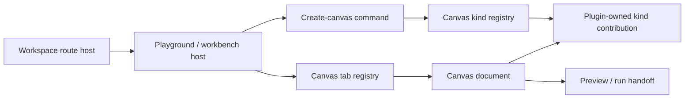
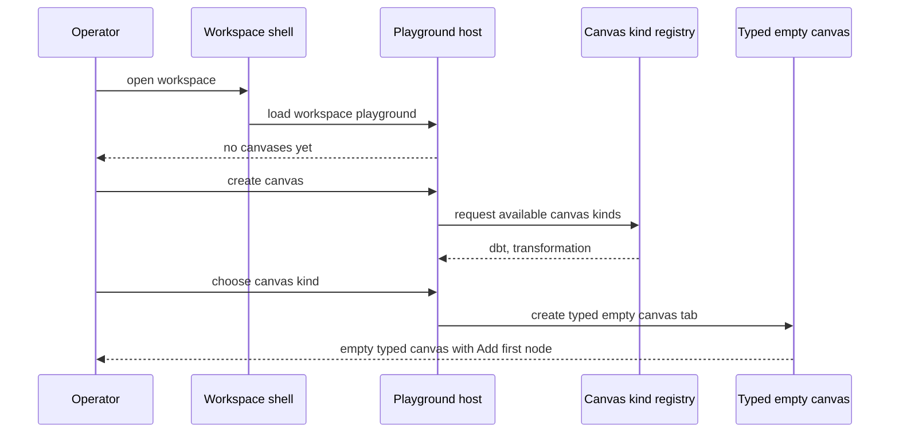
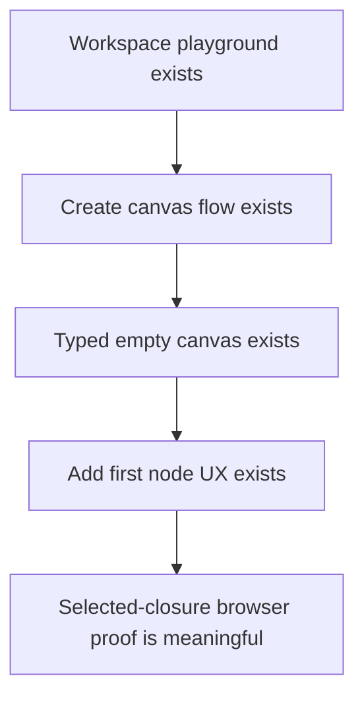

# TF-E2 project playground and multi-canvas host plan 2026-04-23

## Summary

This proposal freezes the missing product and architectural host model above
the current Canvas route.

The repository already converged on a `workspace-first` direction: Canvas is a
graph document, not route authority and not the whole product center.

What is still missing is the governed host that makes that statement usable:

- one project or workspace playground as the first-class authoring surface
- `0..N` persisted canvases per project or workspace, with UX forcing creation
  of the first canvas immediately
- tabs as the operator-visible surface for switching canvases
- typed canvas kinds owned by plugins but hosted by the product shell

Without that host model, the current selected-closure browser-proof discussion
is premature: there is still no governed user-visible flow for:

1. opening the playground
2. creating a canvas
3. choosing the canvas kind
4. entering the empty typed canvas
5. creating the first node through the real UX

## Governing sources

- `AGENTS.md`
- `docs/planning/status/governance-document-rule-inventory.md`
- `docs/guides/ai-work-protocol.md`
- `docs/planning/state/planning-control-tower.md`
- `docs/planning/state/how-to-add-tasks.md`
- `docs/planning/state/agent-lane-e.yaml`
- `docs/architecture/reference-architecture.md`
- `docs/concepts/domain-language.md`
- `docs/planning/proposals/workspace-first-frontend-architecture-specification.md`
- `docs/planning/proposals/mandatory/frontend-and-ux/tf-e2-canvas-target-architecture-execution-plan-20260417.md`
- `docs/planning/proposals/mandatory/frontend-and-ux/tf-e2-canvas-empty-authoring-entrypoint-design-20260422.md`
- `docs/architecture/components/web/graph/canvas-controller-current-to-target-architecture.md`

## Relationship to current canon

- `workspace-first-frontend-architecture-specification.md` already freezes the
  principle that Canvas is a graph document inside a workspace and should be
  demoted from sole product center.
- `tf-e2-canvas-target-architecture-execution-plan-20260417.md` already freezes
  the seam-first route migration and the authoring/runtime hard cut.
- `tf-e2-canvas-empty-authoring-entrypoint-design-20260422.md` already freezes
  the rule that an empty Canvas must become productive through `Add first node`.

This proposal fills the layer that still sits between those decisions:

- where the operator lands before a canvas exists
- how multiple canvases are modeled
- how a typed empty canvas is chosen
- how plugin-owned canvas kinds stay bounded under a host-owned shell

## Think-first analysis

### Problem summary

The current UI still behaves as if `/canvas` were a singular top-level working
surface.

That prevents three important truths from becoming product-real:

1. a project or workspace can contain more than one graph document
2. different graph documents can have different semantics and plugin-owned
   node catalogs
3. the browser cannot prove realistic authoring flows until the user can create
   the first canvas and then the first node through the same host model that
   production users will see

### Root cause

The root cause is model conflation.

The current product surface still mixes:

1. the project or workspace container
2. the workbench or playground surface
3. the graph document
4. the plugin-owned graph semantics

In Fowler terms, one route is still trying to carry the responsibilities of
container, workspace session, document host, and domain-specific editor.

That is why the repo can hold correct local node and draft mechanics while
still lacking a credible end-to-end authoring UX.

### Constraints and invariants

- keep `workspace-first` as the canonical persistence and architectural model
  until a wider glossary or route rename is explicitly approved
- product copy may refer to the current workspace as a project, but code and
  docs must not split the persisted host concept into two competing authorities
- Canvas remains a document or tab, not route authority
- host shell owns routing, tab persistence, access posture, and plugin loading
- plugin-owned canvas kinds may contribute catalog, connection rules, and
  inspector surfaces, but not shell ownership or execution authority
- runtime environment stays out of the authoring shell center and remains
  evidence or runtime metadata, not the playground's primary selector
- no fake auto-generated graph should be created just to skip the empty host
  state
- the browser proof matrix must start from the real host flow:
  `playground -> create canvas -> choose kind -> add first node`

### Options considered

#### Option A: keep Canvas as the top-level center and add more creation affordances inside it

Benefits:

- smallest local diff
- preserves the current route mental model

Rejected because:

- it keeps container and document semantics mixed
- it does not explain multi-canvas ownership honestly
- it continues to make browser proof depend on one route pretending to be both
  project and editor

#### Option B: adopt a host-owned playground with tabbed canvases and typed canvas kinds

Benefits:

- matches the existing `workspace-first` canon
- gives a real place to create and switch canvases
- lets plugins own graph semantics without owning the product shell
- makes the selected-closure and node-creation E2E route defensible

Decision:

- accepted

#### Option C: make the shell fully plugin-authored and let plugins define project, host, and canvas semantics

Benefits:

- maximum flexibility

Rejected because:

- it is premature
- it erodes host ownership
- it risks turning plugin contribution into implicit execution or product-shell
  authority

### Selected option and rationale

Adopt Option B.

The shell should present a project or workspace playground that hosts one or
more typed canvas tabs.

The host owns:

- workspace selection
- tab registry and restoration
- create-canvas flow
- capability gating
- persistence and route state

The plugin owns:

- the canvas kind registration
- node catalog
- connection rules
- typed inspector surface
- canvas-specific semantics and empty-state copy

This keeps the shell generic and the canvas semantics explicit.

## Decision

The canonical host model for the next TF-E2 slices is:

1. the persisted operational container remains `Workspace`
2. the operator-visible center surface is a playground or workbench
3. the playground hosts `CanvasDocument` tabs
4. each `CanvasDocument` has a `kind`
5. `kind` is registered by a plugin-owned contribution, but hosted by a
   shell-owned registry
6. the minimal initial kinds are:
   - `dbt`
   - `transformation`
7. `TF-E2-E` browser proof slices are blocked on this host model, because an
   honest browser proof must include create-canvas and create-first-node UX

## Naming decision

To avoid fresh drift, use this naming rule in code and canonical docs:

- `Workspace`: persisted operational container and route authority
- `Playground` or `Workbench`: host surface inside the workspace
- `Canvas`: graph document tab inside the playground
- `Canvas kind`: typed graph/editor flavor contributed by a plugin

Product copy may say `Project` when showing the current workspace to the user,
but the canonical host contract remains `workspace-first` in this slice.

## Domain model

| Type                     | Responsibility                                                                        |
| ------------------------ | ------------------------------------------------------------------------------------- |
| `WorkspaceDescriptor`    | host container selected by route and shell                                            |
| `WorkbenchTab`           | shell-owned tab identity and restoration contract                                     |
| `CanvasDocument`         | graph document tab with id, title, plugin, kind, and draft refs                       |
| `CanvasKindRegistration` | plugin-contributed declaration of canvas kind, icon, copy, node catalog, and handlers |
| `CanvasCreationIntent`   | host-owned command to create a new canvas of a given kind                             |
| `CanvasHostState`        | open tabs, active canvas id, and empty-host posture                                   |

## Component ownership

## Host flow

### Enter workspace and create first canvas

### Browser-proof dependency rule

## Minimal initial canvas kinds

### `dbt`

- graph for dbt-style source, transform, exposure, and related typed authoring
- plugin-owned node catalog and connection policy
- suited for the existing dbt-oriented authoring and persistence surfaces

### `transformation`

- graph for pipeline-style transformation similar to NiFi-style flow editing
- plugin-owned source, processor, and sink catalog
- host still owns persistence, tabs, preview handoff, and run admission path

## Explicit non-goals for this slice

- plugin-authored shell navigation
- plugin-owned execution authority
- marketplace or untrusted plugin runtime
- automatic creation of a hidden default graph without user intent
- E2E selected-closure claims before create-canvas and create-first-node UX

## Proposed slice order

1. `TF-E2-K`: freeze playground host model, canvas document identity, and
   canvas kind registry contract
2. `TF-E2-K-A`: add create-canvas UX and typed empty-host posture
3. `TF-E2-K-B`: add host-owned tab restoration for multiple canvases
4. `TF-E2-K-C`: add typed empty-canvas states for `dbt` and `transformation`
5. `TF-E2-K-D`: add `Add first node` command and node-catalog entry through the
   typed canvas
6. only then continue `TF-E2-E-A..D`

## Acceptance criteria

- the workspace route no longer overclaims that one canvas is the whole authoring surface
- a workspace can host multiple canvases as first-class tabs
- each canvas has an explicit kind
- the host can create the first canvas through governed UI
- a typed empty canvas can render a first-node entrypoint honestly
- selected-closure Cypress work is sequenced after create-canvas and create-node UX

## Recommendation

Proceed docs-first with `TF-E2-K` and treat it as the missing prerequisite above
`TF-E2-A` empty-entry and `TF-E2-E` browser proof.

Do not claim end-to-end selected-closure UX until the user can:

1. enter the workspace playground
2. create a canvas
3. choose `dbt` or `transformation`
4. add the first node
5. then preview and run from that real host model
