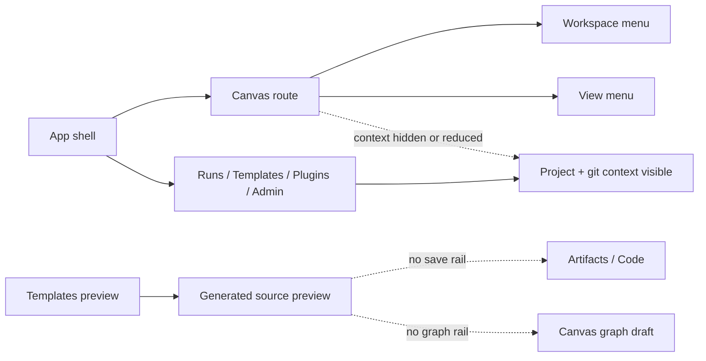
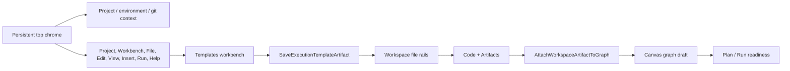

# Top Menu Templates Artifact Graph Flow Plan

## Purpose

Rationalize the product shell without adding another left navigation rail, and
turn Templates from a preview-only surface into a governed product flow:
generated source can be saved as a workspace artifact, discovered in Code and
Artifacts, and inserted into the Canvas graph as an authored step.

This is a Think-First Fowler plan. It defines the intended boundaries, rails,
and tests before implementation.

## Governing Sources

- `AGENTS.md`
- `docs/planning/status/governance-document-rule-inventory.md`
- `docs/guides/ai-work-protocol.md`
- `docs/architecture/fowler-opportunity-planning-governance.md`
- `docs/architecture/command-query-rail-governance.md`
- `docs/architecture/reference-architecture.md`
- `docs/concepts/domain-language.md`
- `docs/architecture/components/web/workbench-ui-contract-and-component-inventory.md`
- `docs/architecture/components/web/appshell/shell-workspace-context-component.md`
- `docs/architecture/components/web/templates/execution-template-source-generation-component.md`
- `docs/architecture/components/web/templates/execution-template-source-generation-user-stories.md`
- `docs/planning/proposals/mandatory/frontend-and-ux/f21-execution-template-source-generation-workbench-plan-20260522.md`
- `docs/planning/proposals/mandatory/frontend-and-ux/artifacts-workspace-project-files-plan-20260524.md`
- Planning DB tasks `E-SHELL-TOP-MENU-RATIONALIZATION-1` and
  `E-TEMPLATES-ARTIFACT-GRAPH-FLOW-1`

## Existing State Findings

- The active Workbench UI contract already says the top menu and command
  palette are the canonical command discovery surfaces.
- The same contract says the Canvas workbench must not include a fixed left
  navigation rail.
- Current app-shell behavior is inconsistent across routes: non-Canvas routes
  show workspace context and git context in the upper chrome, while Canvas
  relies on a narrower workbench shell that hides those signals.
- `ShellMenu` currently has only `Workspace` and `View` menu kinds. `Workspace`
  mixes route navigation, project context, and git context. `View` mixes route
  projections, panels, and Canvas-specific rendering controls.
- The Templates component guide intentionally limits Templates to selection,
  parameter capture, validation, deterministic preview, and export metadata.
  It explicitly excludes persistence, save, apply, and execution behavior.
- Code and Artifacts already read project files through the workspace file
  query rails. They should not receive a parallel artifact catalog for the same
  project files.
- Canvas graph drafting already owns authored graph changes. Templates must not
  mutate graph state directly.

## Product Acceptance Statements

The user-facing target is:

- The top chrome always shows compact project, environment, and git context in
  Canvas, Runs, Templates, Plugins, and Admin.
- The user can navigate to Canvas, Runs, Templates, Plugins, and Admin from the
  top menu without a new permanent left rail.
- The Canvas workbench keeps its route-local view strip for Graph, Code,
  Lineage, Differences, Artifacts, and Executions.
- The user can generate source in Templates and save it as a workspace artifact.
- The saved artifact appears through the same Code and Artifacts project-file
  surfaces as other workspace artifacts.
- The user can insert a saved artifact into the Canvas graph as a step.
- Read-only mode cannot execute. The UI must offer an intelligible path into an
  execution-capable mode instead of exposing disabled buttons with technical
  copy.
- If the user only wants to execute SQL, the Run menu must expose that product
  intent as a distinct path from full graph execution.

## Problem Summary

The current shell makes the product feel split into unrelated screens. Canvas is
the primary working surface, but its chrome hides context that appears on
secondary routes. Navigation to Runs and Templates is not a natural part of the
Canvas workflow. Templates can generate useful source, but the result has no
governed path into project artifacts or the graph.

## Root Cause

There are three boundary failures:

1. Shell command discovery is presentation-shaped instead of intent-shaped.
   The menus reflect implementation history rather than product tasks.
2. Templates owns generated source preview but not a handoff contract. The
   preview is an orphan output.
3. Graph authoring and artifact discovery are valid owned contexts, but the
   product flow between Templates, Artifacts, Code, Canvas, Plan, and Run is not
   represented by rails.

## Invariants

- Do not add a permanent left navigation rail to Canvas.
- Do not hide workspace context or git context on the primary workbench route.
- Do not let Templates execute, mutate graph state, or write project files
  directly outside a named command rail.
- Do not create a parallel file browser, artifact service, or graph mutation
  service for generated template output.
- Do not present read-only mode as executable. Execution-capable mode must be a
  clear user action and must still pass authorization/readiness checks.
- Do not fabricate project files, run receipts, graph nodes, or dbt output in
  tests.
- Use Planning DB tasks as the work source of truth; generated markdown views
  are not task state.

## Current State

## Target State

## Top Menu Taxonomy

| Menu        | Product intent                                 | Examples                                                                                            | Must not contain                       |
| ----------- | ---------------------------------------------- | --------------------------------------------------------------------------------------------------- | -------------------------------------- |
| `Project`   | Workspace identity and scope.                  | Project name, environment, git branch/status, rename project, select source, connection state.      | Graph-local mutations or run dispatch. |
| `Workbench` | Global route navigation.                       | Canvas, Runs, Templates, Plugins, Admin.                                                            | Canvas route-local view tabs.          |
| `File`      | Project file and artifact lifecycle.           | New canvas, import dbt project, save draft, save generated artifact, export dbt-compatible project. | Execution dispatch.                    |
| `Edit`      | Current selection changes.                     | Undo, redo, rename, duplicate, delete, edit selected artifact metadata.                             | Route navigation.                      |
| `View`      | Presentation and panels.                       | Canvas overlays, minimap, grid, inspector, explorer, bottom log, focus mode.                        | Mutating commands.                     |
| `Insert`    | Add authored content to the current workbench. | dbt source/model/macro/test node, saved artifact step, template-derived step.                       | Import/export operations.              |
| `Run`       | Execution intent.                              | Plan graph, execute graph, execute selected, execute SQL only, open latest runs.                    | Template source generation.            |
| `Help`      | Diagnostics and discoverability.               | Plugin capability status, command reference, keyboard shortcuts, route diagnostics.                 | Primary product workflow.              |

The Canvas view strip remains route-local and compact. It is not replaced by
global navigation and it is not duplicated in the top menu.

## Command And Query Rail Catalog

| Rail                               | Type    | Owning bounded context       | DDD owner                            | Port or adapter surface             | Scope and authorization                                                                    | Negative tests                                                                                                                                                       |
| ---------------------------------- | ------- | ---------------------------- | ------------------------------------ | ----------------------------------- | ------------------------------------------------------------------------------------------ | -------------------------------------------------------------------------------------------------------------------------------------------------------------------- |
| `ResolveShellCommandMenu`          | query   | Web operator shell           | `ShellCommandMenuReadModel`          | Shell top-menu presenter            | Route, plugin, project, and capability scoped; read-only projection.                       | Canvas does not receive a fixed left rail; unavailable routes are shown as unavailable instead of removed silently; duplicate menu commands fail architecture guard. |
| `ListExecutionTemplateProfiles`    | query   | Web operator workbench       | `ExecutionTemplateCatalogReadModel`  | Templates route presentation model  | Existing local catalog rail.                                                               | Unknown template id cannot fabricate a profile.                                                                                                                      |
| `GenerateExecutionTemplatePreview` | query   | Web operator workbench       | `ExecutionTemplatePreviewProjection` | Templates route presentation model  | Existing deterministic preview rail; no persistence or execution.                          | Missing required values block preview and save eligibility.                                                                                                          |
| `SaveExecutionTemplateArtifact`    | command | Workspace artifact authoring | `WorkspaceArtifactWritePolicy`       | Workspace artifact command port     | Project/workspace scoped; write permission required; provenance and content hash required. | Invalid path, duplicate path conflict, stale preview, read-only workspace, and unavailable file store reject with explicit reasons.                                  |
| `ListWorkspaceFiles`               | query   | Workspace files              | `WorkspaceArtifactIndex`             | Existing workspace file query port  | Existing project-file read scope.                                                          | Saved artifact must appear only after an accepted save command; unsupported files are not promoted to artifacts.                                                     |
| `GetWorkspaceFileContent`          | query   | Workspace files              | `WorkspaceArtifactPreview`           | Existing workspace file query port  | Existing project-file read scope.                                                          | Missing artifact path returns unavailable or not-found state, not placeholder content.                                                                               |
| `AttachWorkspaceArtifactToGraph`   | command | Canvas graph drafting        | `WorkspaceGraphAuthoringDraft`       | Canvas graph draft command port     | Graph edit permission and expected draft version required.                                 | Missing artifact, unsupported artifact kind, stale draft version, read-only graph, and invalid connection rule reject.                                               |
| `ObservePlanRunReadiness`          | query   | Plan and run readiness       | `PlanRunReadinessProjection`         | Existing plan/run readiness surface | Existing authorization and readiness policy.                                               | Read-only mode cannot execute; SQL-only execution is distinct from full graph execution.                                                                             |

Before implementation is complete, proposed rails must be promoted from this
proposal into the canonical component docs that own the long-lived semantics.

## Fowler Opportunity Matrix

| Scenario                                                                      | Opportunity             | Fowler pattern                                            | DDD owner                                                          | Rail                                                   | Implementation surfaces                                                   | Unit or package test                 | Architecture test                           | User-flow test                           | Out of scope                              |
| ----------------------------------------------------------------------------- | ----------------------- | --------------------------------------------------------- | ------------------------------------------------------------------ | ------------------------------------------------------ | ------------------------------------------------------------------------- | ------------------------------------ | ------------------------------------------- | ---------------------------------------- | ----------------------------------------- |
| Canvas and non-Canvas routes expose different workspace and git context.      | Duplicate semantics     | Presentation Model                                        | `ShellCommandMenuReadModel` and shell workspace context projection | `ResolveShellCommandMenu`                              | Shell top bar, shell menu model, shell navigation model                   | Shell menu projection tests          | Shell chrome architecture guard             | Cypress route navigation smoke           | New permanent left rail                   |
| Workspace and View menus mix navigation, context, panels, and route controls. | Responsibility overload | Replace Conditional with Polymorphism, Presentation Model | `ShellCommandMenuReadModel`                                        | `ResolveShellCommandMenu`                              | `ShellMenu`, menu contribution model, DVT route contributions             | Menu taxonomy tests                  | Duplicate-command guard                     | Top-menu navigation flow                 | Command palette implementation            |
| Templates generates useful source with no governed handoff.                   | Orphan output           | Service Layer, Repository, Gateway                        | `WorkspaceArtifactWritePolicy`                                     | `SaveExecutionTemplateArtifact`                        | Templates view model, artifact command adapter, workspace file projection | Save eligibility and rejection tests | No direct file writes from Templates        | Generate, save, inspect artifact flow    | Provider execution                        |
| Saved generated source must appear in Code and Artifacts.                     | Boundary drift          | Read Model projection                                     | `WorkspaceArtifactIndex` and `WorkspaceArtifactPreview`            | `ListWorkspaceFiles`, `GetWorkspaceFileContent`        | Existing workspace file query surfaces and artifact classification policy | Artifact classification tests        | No parallel artifact service guard          | Code and Artifacts visibility flow       | Generic file browser                      |
| Saved artifact becomes a Canvas graph step.                                   | Feature envy            | Aggregate command, Policy                                 | `WorkspaceGraphAuthoringDraft`                                     | `AttachWorkspaceArtifactToGraph`                       | Canvas insert model, graph draft command adapter, node-kind policy        | Attach artifact command tests        | No Templates-to-graph direct mutation guard | Save artifact, insert graph step flow    | Auto-layout engine redesign               |
| Read-only and execution-capable modes are unclear.                            | Hidden authority        | Policy and explicit state transition                      | `PlanRunReadinessProjection`                                       | `ObservePlanRunReadiness`                              | Canvas toolbar/menu readiness, bottom log, run menu                       | Readiness state tests                | No read-only execute guard                  | Enter execution mode and run-intent flow | Bypassing permissions                     |
| User only wants to execute SQL.                                               | Missing domain intent   | Introduce Explicit Command                                | SQL execution readiness policy                                     | Existing or proposed SQL-only run rail after discovery | Run menu, Code/SQL selection surface                                      | SQL-only readiness tests             | Rail catalog guard                          | SQL-only run path proof                  | Full SQL runner if backend rail is absent |

## Implementation Route

1. Update canonical component docs for shell menu ownership, Templates artifact
   save ownership, and Canvas artifact-step insertion ownership.
2. Add the feature mechanization manifest when implementation starts. This
   plan intentionally does not declare a fenced `feature-mechanization` block
   yet because repository guards only accept `implemented` or `closed` status.
3. Write red tests for the shell menu taxonomy and no-left-rail invariant.
4. Implement `ResolveShellCommandMenu` as a shell read model, then wire the top
   menu without changing Canvas into a secondary navigation layout.
5. Write red tests for template artifact save eligibility and rejection paths.
6. Implement `SaveExecutionTemplateArtifact` through the workspace artifact
   command boundary.
7. Reuse `ListWorkspaceFiles` and `GetWorkspaceFileContent` so Code and
   Artifacts discover saved generated source through the existing workspace
   file rails.
8. Write red tests for inserting a saved artifact as a Canvas step.
9. Implement `AttachWorkspaceArtifactToGraph` through the Canvas graph draft
   command boundary.
10. Add user-flow proof for Generate template -> Save artifact -> Inspect in
    Code/Artifacts -> Insert into Canvas graph -> Plan/Run readiness.

## Test Plan

- Unit tests for menu taxonomy, route contribution projection, and duplicate
  command prevention.
- Presentation tests for top bar context consistency across Canvas, Runs,
  Templates, Plugins, and Admin.
- Unit tests for `SaveExecutionTemplateArtifact` path policy, provenance,
  content hash, duplicate path handling, and read-only rejection.
- Unit tests for artifact classification reusing workspace file rails.
- Unit tests for `AttachWorkspaceArtifactToGraph` stale version, unsupported
  artifact kind, missing artifact, and read-only rejection.
- Architecture tests proving Templates cannot write files or mutate graph state
  directly.
- Architecture tests proving Canvas does not regain a permanent left navigation
  rail.
- Cypress or Playwright user-flow proof for the end-to-end product path.
- Pre-push validation after implementation, with no hook bypass.

## Out Of Scope

- A new permanent left navigation rail.
- A generic command palette.
- Provider credentials and provider-owned template catalogs.
- Direct execution from Templates.
- Full dbt runtime integration unless an existing run rail already owns it.
- A generic file browser or parallel artifact API.
- Silent mock success paths for save, graph insertion, or execution.

## Residuals To Track During Implementation

- Git context is visible today but may still be detached or unknown. If the
  implementation cannot make git actionable without a backend rail, create a
  separate task instead of masking it.
- SQL-only execution must first reuse an existing command rail. If no rail
  exists, implementation must add a catalog entry before exposing the action.
- If the current workspace artifact store is read-only in a given runtime, the
  UI must offer an explicit execution/editing mode transition or a clear
  unavailable state. It must not leave the user with unexplained disabled
  controls.

## Planning DB Disposition

- `E-SHELL-TOP-MENU-RATIONALIZATION-1` owns shell/menu rationalization and must
  be delivered first.
- `E-TEMPLATES-ARTIFACT-GRAPH-FLOW-1` depends on shell/menu rationalization and
  owns the Templates -> artifact -> graph workflow.
- This plan is the formal planning evidence for both tasks. It is not itself a
  code closeout.
