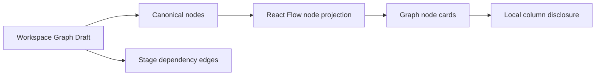
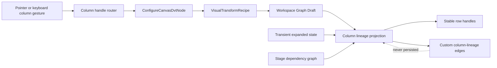

# VTX1 Column Lineage And Mapping Projection Plan

## Think-First Analysis

### Problem summary

Canvas renders stage dependencies with React Flow and can disclose node columns,
but those rows have no stable ports and `VisualTransformRecipe` has no visual
projection. A user therefore cannot see or author the field-level mapping that
already has one semantic authority.

### Root cause

The existing viewport projection maps only canonical node edges. Column
disclosure is local card state, the node mapper drops recipe output identity,
and the generic connection handler treats every React Flow gesture as a stage
dependency. Implementing column lines directly in any of those components
would create duplicated state or bypass the `ConfigureCanvasDvtNode` command
rail.

### Invariants

- GitHub issue #2384 owns delivery state; Planning DB owns architecture and
  feature mechanization.
- `VisualTransformRecipe` is the sole semantic authority for Source-to-Model
  mappings.
- Column edges and terminal Model-to-Sink lineage are derived read models and
  are never saved as graph edges.
- Existing stage-edge admission remains owned by #2330 and
  `proposeConnection`; column gestures are routed before that rail by their
  stable handle kind.
- Existing nonblank SQL is never discarded to create a visual recipe.
- Collapsing columns changes presentation only and cannot mutate the recipe.
- Automap requires exact normalized name, known compatible type, and exactly
  one candidate.
- The solution reuses `@xyflow/react`, `CanvasNodePortHandle`,
  `GraphNodeColumnSection`, and the Graph Draft aggregate.
- No new router, renderer, library, store, API, or persistence collection is
  introduced.

### Options considered

1. **Persist React Flow column edges. Rejected.** This duplicates recipe truth.
2. **Store mappings in card state. Rejected.** Reload would lose authority and
   cards would own domain behavior.
3. **Extend the stage-edge validator. Rejected.** It would mix two distinct
   intents and conflict with #2330.
4. **Add another graph renderer. Rejected.** Current React Flow handles and
   custom edges are sufficient.
5. **Selected: recipe command plus derived viewport projection.** Stable
   column handles route to the existing node command rail; the viewport derives
   visible lineage on every authoritative recipe change.

## Current And Target Components





## MVP Semantics

### Stable handles

Column handle IDs encode direction, node identity, and the semantic column
reference. Encoding and parsing live in one pure module. Source rows expose
only `source`; Model recipe outputs expose `target` and `source`; Sink rows
expose only `target`.

### Mapping command

A Source-to-Model connection upserts one target recipe output:

- create a passthrough output when the target has no recipe output;
- replace the input for an existing single-input passthrough mapping;
- preserve output ID and output name;
- reject missing stage dependency, unknown columns, non-Model targets, and
  nonblank SQL authority;
- canonicalize through the #2383 contract before updating the Graph Draft.

Removing a selected column edge removes only that input relation. An output
with no remaining inputs is removed from the recipe in the MVP because it no
longer describes an executable visual expression.

### Derived lineage

Source-to-Model edges come only from recipe input references. Model-to-Sink
edges are terminal lineage derived from recipe outputs plus an existing stage
dependency and a unique exact-name, known-type-compatible Sink column. This
terminal projection is read-only; changing it is performed by renaming or
editing the Model recipe in #2385, never by persisting a Sink edge.

Column edges render only while both endpoint disclosures expose the referenced
rows. Disclosure state is transient viewport presentation state, not domain
state.

### Accessible interaction

- Pointer drag uses React Flow `onConnect` with stable column handles.
- Enter or Space on a source handle selects the mapping origin; Enter or Space
  on a Model target handle invokes the same command.
- Selected lineage edges expose a localized remove action reachable by
  keyboard.
- Column disclosure calls `useUpdateNodeInternals` after expand, collapse, and
  remainder changes.
- Status and rejection copy is localized in English and Spanish and announced
  through the existing feedback surface.

## Command And Query Rails

| Intent                       | Rail                          | Type    | DDD owner                        |
| ---------------------------- | ----------------------------- | ------- | -------------------------------- |
| Configure a Model mapping    | `ConfigureCanvasDvtNode`      | command | DVT transform authoring metadata |
| Persist recipe authority     | `SaveCanvasAuthoringDraft`    | command | Workspace Graph Authoring Draft  |
| Read recipe and dependencies | `GetWorkspaceGraphDraft`      | query   | Workspace Graph Draft record     |
| Project nodes and lineage    | `ProjectCanvasAuthoringDraft` | query   | Canvas authoring semantic graph  |

No parallel command/query rail is added.

## Fowler Opportunity Matrix

| Scenario                                    | Signal                   | MVP treatment                                   | Evidence           |
| ------------------------------------------- | ------------------------ | ----------------------------------------------- | ------------------ |
| Recipe and drawn edges can diverge          | Duplicated state         | derive all column edges from recipe             | projection tests   |
| Every connection reaches the node validator | Divergent change         | route stable column handles first               | handler tests      |
| Cards own hidden semantic disclosure        | Inappropriate intimacy   | callback reports presentation state to viewport | component tests    |
| Handle IDs are assembled ad hoc             | Primitive obsession      | one encoder/parser value boundary               | unit tests         |
| Automap guesses unknown types               | Speculative generality   | exact name + known type + unique candidate      | negative tests     |
| SQL is silently replaced by mapping mode    | Hidden temporal coupling | fail closed on nonblank SQL                     | command tests      |
| New renderer/library proposed               | Parallel abstraction     | reuse React Flow and current card shell         | architecture guard |

## Definition Of Ready

- [x] #2383 is merged and fixes recipe/reference authority.
- [x] `main@3ec6d683d` and open ownership were checked.
- [x] Current node mapper, viewport projection, card disclosure, handle,
      connection handler, draft command, and edge-change owners were traced.
- [x] #2330 was reviewed and its stage-edge admission policy remains separate.
- [x] Pointer and keyboard interaction use the same semantic command.
- [x] Existing renderer/router/library surfaces are sufficient.
- [x] Command/query rails, Fowler matrix, target diagram, exclusions, and
      microcommit sequence are fixed before production changes.

## Definition Of Done

- [x] Source column rows expose output handles only.
- [x] Model recipe-output rows expose input and output handles.
- [x] Sink column rows expose input handles only.
- [x] Recipe mappings render as a visually distinct custom edge.
- [x] No column edge or disclosure state is persisted as semantic graph truth.
- [x] Pointer and keyboard create/change mappings through one command.
- [x] A selected mapping can be removed by keyboard or pointer.
- [x] Deterministic automap creates only exact-name, known-compatible,
      unambiguous mappings.
- [x] Ambiguous, incompatible, disconnected, or SQL-authoritative cases fail
      closed without mutation.
- [x] Collapse, expand, and remainder disclosure update React Flow internals.
- [x] Compact cards remain free of column-edge noise while collapsed.
- [x] Unit, presentation, Cypress, accessibility, ES/EN, lint, type-check,
      governance, and pre-push gates pass.
- [x] No debt, stub, new dependency, duplicated renderer, or disabled rule is
      introduced.

## Microcommit Sequence

1. `docs(docs)` define #2384 projection and command plan.
2. `feat(web)` add governed mapping command and derived projection.
3. `feat(web)` render accessible role-correct column ports.
4. `feat(web)` wire pointer and keyboard mapping interactions.
5. `fix(web)` keep derived mapping selection and deletion operable.
6. `fix(web)` preserve the source type on prospective outputs.
7. `test(web)` prove the bounded lifecycle, architecture, locale, and a11y flow.
8. `docs(docs)` close mechanization, component rationale, evidence, and risk.

## Validation Plan

- focused Canvas unit and presentation tests for every red/green cycle;
- Web lint and type-check;
- headed browser verification in ES and EN with pointer and keyboard;
- constrained-viewport Cypress verification with accessibility assertions;
- bounded Cypress column-mapping flow;
- feature-mechanization and governance checks;
- `pnpm verify:prepush`.

```feature-mechanization
version: 1
featureId: VTX1-COLUMN-LINEAGE-MAPPING-PROJECTION
mechanizationStatus: closed
noHumanDecisionsRemaining: true
implementationPlan: docs/planning/proposals/mandatory/frontend-and-ux/vtx1-column-lineage-mapping-projection-plan-20260816.md
componentGuides:
  - docs/architecture/components/web/graph/canvas-inspector-authoring-component.md
userStories:
  - https://github.com/dunay2/dvt/issues/2384
governingSources:
  - AGENTS.md
  - docs/planning/status/governance-document-rule-inventory.md
  - docs/architecture/command-query-rail-governance.md
  - docs/architecture/fowler-opportunity-planning-governance.md
  - docs/adr/ADR-0061-github-mvp-task-authority-and-planning-db-architecture-boundary.md
allowedImplementationSurfaces:
  - apps/web/src/app/components/canvas/CanvasNodePortHandle.tsx
  - apps/web/src/app/components/canvas/CanvasNodePortHandle.test.tsx
  - apps/web/src/app/components/canvas/CanvasNodeShell.module.css
  - apps/web/src/app/components/canvas/DbtNodeComponent.tsx
  - apps/web/src/app/components/canvas/canvasNodePresentationCopy.contract.ts
  - apps/web/src/app/components/canvas/canvasNodePresentationTruth.contract.ts
  - apps/web/src/app/components/inspector/nodePropertiesReadModel.ts
  - apps/web/src/app/components/inspector/nodePropertiesReadModel.test.ts
  - apps/web/src/app/plugins/graph/GraphNodeCardView.tsx
  - apps/web/src/app/plugins/graph/GraphNodeColumnSection.tsx
  - apps/web/src/app/plugins/graph/GraphNodeColumnSection.test.tsx
  - apps/web/src/app/plugins/graph/GraphNodeRenderer.tsx
  - apps/web/src/app/plugins/graph/graphNodeCardCopyTokens.ts
  - apps/web/src/app/plugins/graph/graphNodeCardReadModel.test.ts
  - apps/web/src/app/plugins/graph/graphNodeCardStrategyUtils.ts
  - apps/web/src/app/plugins/graph/graphVisualTokens.ts
  - apps/web/src/app/views/canvas/canvasColumnMappingAuthoring.ts
  - apps/web/src/app/views/canvas/canvasColumnMappingAuthoring.test.ts
  - apps/web/src/app/views/canvas/canvasColumnLineageProjection.ts
  - apps/web/src/app/views/canvas/canvasColumnLineageProjection.test.ts
  - apps/web/src/app/views/canvas/CanvasColumnLineageEdge.tsx
  - apps/web/src/app/views/canvas/CanvasColumnLineageEdge.test.tsx
  - apps/web/src/app/views/canvas/CanvasViewportSurfaceView.tsx
  - apps/web/src/app/views/canvas/canvasAuthoringProjection.architecture.test.ts
  - apps/web/src/app/views/canvas/canvasControllerViewModel.ts
  - apps/web/src/app/views/canvas/canvasCopy.types.ts
  - apps/web/src/app/views/canvas/canvasCopyCatalog.authoring.ts
  - apps/web/src/app/views/canvas/canvasCopyCatalog.authoring.es.ts
  - apps/web/src/app/views/canvas/canvasNodeMapper.ts
  - apps/web/src/app/views/canvas/canvasNodePresentationProjection.ts
  - apps/web/src/app/views/canvas/canvasNodePresentationProjection.test.ts
  - apps/web/src/app/views/canvas/canvasNodePresentationCopy.ts
  - apps/web/src/app/views/canvas/canvasNodeInteractionPresentation.ts
  - apps/web/src/app/views/canvas/useCanvasController.ts
  - apps/web/src/app/views/canvas/useCanvasControllerReadModel.ts
  - apps/web/src/app/views/canvas/useCanvasControllerReadModel.test.tsx
  - apps/web/src/app/views/canvas/useCanvasEdgeAuthoringHandlers.ts
  - apps/web/src/app/views/canvas/useCanvasGraphHandlers.ts
  - apps/web/src/app/views/canvas/useCanvasGraphHandlers.edgeAuthoring.test.tsx
  - apps/web/src/app/views/canvas/useCanvasGraphHandlers.types.ts
  - apps/web/src/app/views/canvas/useCanvasViewportGraphModel.ts
  - apps/web/src/app/views/canvas/useCanvasViewportGraphModel.nodeData.test.tsx
  - apps/web/cypress/support/canvasDraftAuthoring.ts
  - apps/web/cypress/e2e/canvas/canvas-column-lineage-mapping.cy.ts
  - docs/architecture/components/web/graph/canvas-inspector-authoring-component.md
  - docs/architecture/components/web/graph/canvas-workbench-command-query-catalog.md
  - docs/evidence/**
  - docs/risk-register/quality/**
  - docs/planning/proposals/mandatory/frontend-and-ux/vtx1-column-lineage-mapping-projection-plan-20260816.md
  - docs/.manifest.json
  - docs/**/index.md
  - tools/planning-db/state/db-governance-surfaces.json
forbiddenImplementationSurfaces:
  - apps/api/**
  - packages/@dvt/contracts/**
  - packages/@dvt/engine/**
  - packages/@dvt/adapter-*/**
  - .github/**
commandQueryRails:
  - name: ConfigureCanvasDvtNode
    type: command
    dddOwner: DvtTransformAuthoringMetadata
  - name: SaveCanvasAuthoringDraft
    type: command
    dddOwner: WorkspaceGraphAuthoringDraft
  - name: GetWorkspaceGraphDraft
    type: query
    dddOwner: WorkspaceGraphDraftRecord
  - name: ProjectCanvasAuthoringDraft
    type: query
    dddOwner: CanvasAuthoringSemanticGraph
domainObjects:
  - name: CanvasColumnMapping
    type: derived read model
    owner: Canvas authoring projection
  - name: VisualTransformRecipeV1
    type: value object
    owner: DVT Transform Authoring
symbols:
  - { name: assertNoSeriousAccessibilityViolations, path: apps/web/cypress/e2e/canvas/canvas-column-lineage-mapping.cy.ts, dddOwner: Canvas column mapping verification, cqRails: [ConfigureCanvasDvtNode, ProjectCanvasAuthoringDraft], fowlerSignals: [Test-only confidence], architectureGuard: pnpm --filter @dvt/web test:canvas-architecture:run, cypressCoverage: apps/web/cypress/e2e/canvas/canvas-column-lineage-mapping.cy.ts, unitTests: [apps/web/src/app/views/canvas/canvasColumnMappingAuthoring.test.ts] }
  - { name: canvasNode, path: apps/web/cypress/e2e/canvas/canvas-column-lineage-mapping.cy.ts, dddOwner: Canvas column mapping verification, cqRails: [ConfigureCanvasDvtNode, ProjectCanvasAuthoringDraft], fowlerSignals: [Test-only confidence], architectureGuard: pnpm --filter @dvt/web test:canvas-architecture:run, cypressCoverage: apps/web/cypress/e2e/canvas/canvas-column-lineage-mapping.cy.ts, unitTests: [apps/web/src/app/views/canvas/canvasColumnMappingAuthoring.test.ts] }
  - { name: stubColumnMappingCanvas, path: apps/web/cypress/e2e/canvas/canvas-column-lineage-mapping.cy.ts, dddOwner: Canvas column mapping verification, cqRails: [ConfigureCanvasDvtNode, ProjectCanvasAuthoringDraft], fowlerSignals: [Test-only confidence], architectureGuard: pnpm --filter @dvt/web test:canvas-architecture:run, cypressCoverage: apps/web/cypress/e2e/canvas/canvas-column-lineage-mapping.cy.ts, unitTests: [apps/web/src/app/views/canvas/canvasColumnMappingAuthoring.test.ts] }
  - { name: toggleColumns, path: apps/web/cypress/e2e/canvas/canvas-column-lineage-mapping.cy.ts, dddOwner: Canvas column mapping verification, cqRails: [ConfigureCanvasDvtNode, ProjectCanvasAuthoringDraft], fowlerSignals: [Test-only confidence], architectureGuard: pnpm --filter @dvt/web test:canvas-architecture:run, cypressCoverage: apps/web/cypress/e2e/canvas/canvas-column-lineage-mapping.cy.ts, unitTests: [apps/web/src/app/views/canvas/canvasColumnMappingAuthoring.test.ts] }
  - { name: visitColumnMappingCanvas, path: apps/web/cypress/e2e/canvas/canvas-column-lineage-mapping.cy.ts, dddOwner: Canvas column mapping verification, cqRails: [ConfigureCanvasDvtNode, ProjectCanvasAuthoringDraft], fowlerSignals: [Test-only confidence], architectureGuard: pnpm --filter @dvt/web test:canvas-architecture:run, cypressCoverage: apps/web/cypress/e2e/canvas/canvas-column-lineage-mapping.cy.ts, unitTests: [apps/web/src/app/views/canvas/canvasColumnMappingAuthoring.test.ts] }
  - { name: GraphNodeColumnPortDirection, path: apps/web/src/app/plugins/graph/GraphNodeColumnSection.tsx, dddOwner: Graph node column presentation, cqRails: [ProjectCanvasAuthoringDraft, ConfigureCanvasDvtNode], fowlerSignals: [Inappropriate intimacy], architectureGuard: pnpm --filter @dvt/web test:canvas-architecture:run, cypressCoverage: apps/web/cypress/e2e/canvas/canvas-column-lineage-mapping.cy.ts, unitTests: [apps/web/src/app/plugins/graph/GraphNodeColumnSection.test.tsx] }
  - { name: GraphNodeColumnPortIdentity, path: apps/web/src/app/plugins/graph/GraphNodeColumnSection.tsx, dddOwner: Graph node column presentation, cqRails: [ProjectCanvasAuthoringDraft, ConfigureCanvasDvtNode], fowlerSignals: [Inappropriate intimacy], architectureGuard: pnpm --filter @dvt/web test:canvas-architecture:run, cypressCoverage: apps/web/cypress/e2e/canvas/canvas-column-lineage-mapping.cy.ts, unitTests: [apps/web/src/app/plugins/graph/GraphNodeColumnSection.test.tsx] }
  - { name: GraphNodeColumnSection, path: apps/web/src/app/plugins/graph/GraphNodeColumnSection.tsx, dddOwner: Graph node column presentation, cqRails: [ProjectCanvasAuthoringDraft, ConfigureCanvasDvtNode], fowlerSignals: [Inappropriate intimacy], architectureGuard: pnpm --filter @dvt/web test:canvas-architecture:run, cypressCoverage: apps/web/cypress/e2e/canvas/canvas-column-lineage-mapping.cy.ts, unitTests: [apps/web/src/app/plugins/graph/GraphNodeColumnSection.test.tsx] }
  - { name: CanvasColumnLineageEdge, path: apps/web/src/app/views/canvas/CanvasColumnLineageEdge.tsx, dddOwner: Canvas column lineage presentation, cqRails: [ProjectCanvasAuthoringDraft, ConfigureCanvasDvtNode], fowlerSignals: [Duplicated state], architectureGuard: pnpm --filter @dvt/web test:canvas-architecture:run, cypressCoverage: apps/web/cypress/e2e/canvas/canvas-column-lineage-mapping.cy.ts, unitTests: [apps/web/src/app/views/canvas/CanvasColumnLineageEdge.test.tsx] }
  - { name: CanvasColumnLineageFlowEdge, path: apps/web/src/app/views/canvas/CanvasColumnLineageEdge.tsx, dddOwner: Canvas column lineage presentation, cqRails: [ProjectCanvasAuthoringDraft, ConfigureCanvasDvtNode], fowlerSignals: [Duplicated state], architectureGuard: pnpm --filter @dvt/web test:canvas-architecture:run, cypressCoverage: apps/web/cypress/e2e/canvas/canvas-column-lineage-mapping.cy.ts, unitTests: [apps/web/src/app/views/canvas/CanvasColumnLineageEdge.test.tsx] }
  - { name: InteractiveCanvasColumnLineageEdgeData, path: apps/web/src/app/views/canvas/CanvasColumnLineageEdge.tsx, dddOwner: Canvas column lineage presentation, cqRails: [ProjectCanvasAuthoringDraft, ConfigureCanvasDvtNode], fowlerSignals: [Duplicated state], architectureGuard: pnpm --filter @dvt/web test:canvas-architecture:run, cypressCoverage: apps/web/cypress/e2e/canvas/canvas-column-lineage-mapping.cy.ts, unitTests: [apps/web/src/app/views/canvas/CanvasColumnLineageEdge.test.tsx] }
  - { name: CANVAS_EDGE_TYPES, path: apps/web/src/app/views/canvas/CanvasViewportSurfaceView.tsx, dddOwner: Canvas viewport edge registry, cqRails: [ProjectCanvasAuthoringDraft], fowlerSignals: [Parallel abstraction], architectureGuard: pnpm --filter @dvt/web test:canvas-architecture:run, cypressCoverage: apps/web/cypress/e2e/canvas/canvas-column-lineage-mapping.cy.ts, unitTests: [apps/web/src/app/views/canvas/CanvasColumnLineageEdge.test.tsx] }
  - { name: CanvasColumnHandleIdentity, path: apps/web/src/app/views/canvas/canvasColumnLineageProjection.ts, dddOwner: Canvas column lineage projection, cqRails: [ProjectCanvasAuthoringDraft], fowlerSignals: [Duplicated state], architectureGuard: pnpm --filter @dvt/web test:canvas-architecture:run, cypressCoverage: apps/web/cypress/e2e/canvas/canvas-column-lineage-mapping.cy.ts, unitTests: [apps/web/src/app/views/canvas/canvasColumnLineageProjection.test.ts] }
  - { name: CanvasColumnLineageEdge, path: apps/web/src/app/views/canvas/canvasColumnLineageProjection.ts, dddOwner: Canvas column lineage projection, cqRails: [ProjectCanvasAuthoringDraft], fowlerSignals: [Duplicated state], architectureGuard: pnpm --filter @dvt/web test:canvas-architecture:run, cypressCoverage: apps/web/cypress/e2e/canvas/canvas-column-lineage-mapping.cy.ts, unitTests: [apps/web/src/app/views/canvas/canvasColumnLineageProjection.test.ts] }
  - { name: CanvasColumnLineageEdgeData, path: apps/web/src/app/views/canvas/canvasColumnLineageProjection.ts, dddOwner: Canvas column lineage projection, cqRails: [ProjectCanvasAuthoringDraft], fowlerSignals: [Duplicated state], architectureGuard: pnpm --filter @dvt/web test:canvas-architecture:run, cypressCoverage: apps/web/cypress/e2e/canvas/canvas-column-lineage-mapping.cy.ts, unitTests: [apps/web/src/app/views/canvas/canvasColumnLineageProjection.test.ts] }
  - { name: CanvasColumnPortDirection, path: apps/web/src/app/views/canvas/canvasColumnLineageProjection.ts, dddOwner: Canvas column lineage projection, cqRails: [ProjectCanvasAuthoringDraft], fowlerSignals: [Duplicated state], architectureGuard: pnpm --filter @dvt/web test:canvas-architecture:run, cypressCoverage: apps/web/cypress/e2e/canvas/canvas-column-lineage-mapping.cy.ts, unitTests: [apps/web/src/app/views/canvas/canvasColumnLineageProjection.test.ts] }
  - { name: Column, path: apps/web/src/app/views/canvas/canvasColumnLineageProjection.ts, dddOwner: Canvas column lineage projection, cqRails: [ProjectCanvasAuthoringDraft], fowlerSignals: [Duplicated state], architectureGuard: pnpm --filter @dvt/web test:canvas-architecture:run, cypressCoverage: apps/web/cypress/e2e/canvas/canvas-column-lineage-mapping.cy.ts, unitTests: [apps/web/src/app/views/canvas/canvasColumnLineageProjection.test.ts] }
  - { name: HANDLE_PREFIX, path: apps/web/src/app/views/canvas/canvasColumnLineageProjection.ts, dddOwner: Canvas column lineage projection, cqRails: [ProjectCanvasAuthoringDraft], fowlerSignals: [Duplicated state], architectureGuard: pnpm --filter @dvt/web test:canvas-architecture:run, cypressCoverage: apps/web/cypress/e2e/canvas/canvas-column-lineage-mapping.cy.ts, unitTests: [apps/web/src/app/views/canvas/canvasColumnLineageProjection.test.ts] }
  - { name: buildLineageEdge, path: apps/web/src/app/views/canvas/canvasColumnLineageProjection.ts, dddOwner: Canvas column lineage projection, cqRails: [ProjectCanvasAuthoringDraft], fowlerSignals: [Duplicated state], architectureGuard: pnpm --filter @dvt/web test:canvas-architecture:run, cypressCoverage: apps/web/cypress/e2e/canvas/canvas-column-lineage-mapping.cy.ts, unitTests: [apps/web/src/app/views/canvas/canvasColumnLineageProjection.test.ts] }
  - { name: createCanvasColumnHandleId, path: apps/web/src/app/views/canvas/canvasColumnLineageProjection.ts, dddOwner: Canvas column lineage projection, cqRails: [ProjectCanvasAuthoringDraft], fowlerSignals: [Duplicated state], architectureGuard: pnpm --filter @dvt/web test:canvas-architecture:run, cypressCoverage: apps/web/cypress/e2e/canvas/canvas-column-lineage-mapping.cy.ts, unitTests: [apps/web/src/app/views/canvas/canvasColumnLineageProjection.test.ts] }
  - { name: createLineageEdgeId, path: apps/web/src/app/views/canvas/canvasColumnLineageProjection.ts, dddOwner: Canvas column lineage projection, cqRails: [ProjectCanvasAuthoringDraft], fowlerSignals: [Duplicated state], architectureGuard: pnpm --filter @dvt/web test:canvas-architecture:run, cypressCoverage: apps/web/cypress/e2e/canvas/canvas-column-lineage-mapping.cy.ts, unitTests: [apps/web/src/app/views/canvas/canvasColumnLineageProjection.test.ts] }
  - { name: hasDependency, path: apps/web/src/app/views/canvas/canvasColumnLineageProjection.ts, dddOwner: Canvas column lineage projection, cqRails: [ProjectCanvasAuthoringDraft], fowlerSignals: [Duplicated state], architectureGuard: pnpm --filter @dvt/web test:canvas-architecture:run, cypressCoverage: apps/web/cypress/e2e/canvas/canvas-column-lineage-mapping.cy.ts, unitTests: [apps/web/src/app/views/canvas/canvasColumnLineageProjection.test.ts] }
  - { name: isRecord, path: apps/web/src/app/views/canvas/canvasColumnLineageProjection.ts, dddOwner: Canvas column lineage projection, cqRails: [ProjectCanvasAuthoringDraft], fowlerSignals: [Duplicated state], architectureGuard: pnpm --filter @dvt/web test:canvas-architecture:run, cypressCoverage: apps/web/cypress/e2e/canvas/canvas-column-lineage-mapping.cy.ts, unitTests: [apps/web/src/app/views/canvas/canvasColumnLineageProjection.test.ts] }
  - { name: parseCanvasColumnHandleId, path: apps/web/src/app/views/canvas/canvasColumnLineageProjection.ts, dddOwner: Canvas column lineage projection, cqRails: [ProjectCanvasAuthoringDraft], fowlerSignals: [Duplicated state], architectureGuard: pnpm --filter @dvt/web test:canvas-architecture:run, cypressCoverage: apps/web/cypress/e2e/canvas/canvas-column-lineage-mapping.cy.ts, unitTests: [apps/web/src/app/views/canvas/canvasColumnLineageProjection.test.ts] }
  - { name: projectCanvasColumnLineage, path: apps/web/src/app/views/canvas/canvasColumnLineageProjection.ts, dddOwner: Canvas column lineage projection, cqRails: [ProjectCanvasAuthoringDraft], fowlerSignals: [Duplicated state], architectureGuard: pnpm --filter @dvt/web test:canvas-architecture:run, cypressCoverage: apps/web/cypress/e2e/canvas/canvas-column-lineage-mapping.cy.ts, unitTests: [apps/web/src/app/views/canvas/canvasColumnLineageProjection.test.ts] }
  - { name: readColumns, path: apps/web/src/app/views/canvas/canvasColumnLineageProjection.ts, dddOwner: Canvas column lineage projection, cqRails: [ProjectCanvasAuthoringDraft], fowlerSignals: [Duplicated state], architectureGuard: pnpm --filter @dvt/web test:canvas-architecture:run, cypressCoverage: apps/web/cypress/e2e/canvas/canvas-column-lineage-mapping.cy.ts, unitTests: [apps/web/src/app/views/canvas/canvasColumnLineageProjection.test.ts] }
  - { name: readString, path: apps/web/src/app/views/canvas/canvasColumnLineageProjection.ts, dddOwner: Canvas column lineage projection, cqRails: [ProjectCanvasAuthoringDraft], fowlerSignals: [Duplicated state], architectureGuard: pnpm --filter @dvt/web test:canvas-architecture:run, cypressCoverage: apps/web/cypress/e2e/canvas/canvas-column-lineage-mapping.cy.ts, unitTests: [apps/web/src/app/views/canvas/canvasColumnLineageProjection.test.ts] }
  - { name: readVisualRecipe, path: apps/web/src/app/views/canvas/canvasColumnLineageProjection.ts, dddOwner: Canvas column lineage projection, cqRails: [ProjectCanvasAuthoringDraft], fowlerSignals: [Duplicated state], architectureGuard: pnpm --filter @dvt/web test:canvas-architecture:run, cypressCoverage: apps/web/cypress/e2e/canvas/canvas-column-lineage-mapping.cy.ts, unitTests: [apps/web/src/app/views/canvas/canvasColumnLineageProjection.test.ts] }
  - { name: resolveCanvasColumnPortDirections, path: apps/web/src/app/views/canvas/canvasColumnLineageProjection.ts, dddOwner: Canvas column lineage projection, cqRails: [ProjectCanvasAuthoringDraft], fowlerSignals: [Duplicated state], architectureGuard: pnpm --filter @dvt/web test:canvas-architecture:run, cypressCoverage: apps/web/cypress/e2e/canvas/canvas-column-lineage-mapping.cy.ts, unitTests: [apps/web/src/app/views/canvas/canvasColumnLineageProjection.test.ts] }
  - { name: CanvasColumnAutomapResult, path: apps/web/src/app/views/canvas/canvasColumnMappingAuthoring.ts, dddOwner: Canvas column mapping command, cqRails: [ConfigureCanvasDvtNode, SaveCanvasAuthoringDraft], fowlerSignals: [Hidden authority], architectureGuard: pnpm --filter @dvt/web test:canvas-architecture:run, cypressCoverage: apps/web/cypress/e2e/canvas/canvas-column-lineage-mapping.cy.ts, unitTests: [apps/web/src/app/views/canvas/canvasColumnMappingAuthoring.test.ts] }
  - { name: CanvasColumnMappingRejection, path: apps/web/src/app/views/canvas/canvasColumnMappingAuthoring.ts, dddOwner: Canvas column mapping command, cqRails: [ConfigureCanvasDvtNode, SaveCanvasAuthoringDraft], fowlerSignals: [Hidden authority], architectureGuard: pnpm --filter @dvt/web test:canvas-architecture:run, cypressCoverage: apps/web/cypress/e2e/canvas/canvas-column-lineage-mapping.cy.ts, unitTests: [apps/web/src/app/views/canvas/canvasColumnMappingAuthoring.test.ts] }
  - { name: CanvasColumnMappingResult, path: apps/web/src/app/views/canvas/canvasColumnMappingAuthoring.ts, dddOwner: Canvas column mapping command, cqRails: [ConfigureCanvasDvtNode, SaveCanvasAuthoringDraft], fowlerSignals: [Hidden authority], architectureGuard: pnpm --filter @dvt/web test:canvas-architecture:run, cypressCoverage: apps/web/cypress/e2e/canvas/canvas-column-lineage-mapping.cy.ts, unitTests: [apps/web/src/app/views/canvas/canvasColumnMappingAuthoring.test.ts] }
  - { name: CanvasColumnMappingSource, path: apps/web/src/app/views/canvas/canvasColumnMappingAuthoring.ts, dddOwner: Canvas column mapping command, cqRails: [ConfigureCanvasDvtNode, SaveCanvasAuthoringDraft], fowlerSignals: [Hidden authority], architectureGuard: pnpm --filter @dvt/web test:canvas-architecture:run, cypressCoverage: apps/web/cypress/e2e/canvas/canvas-column-lineage-mapping.cy.ts, unitTests: [apps/web/src/app/views/canvas/canvasColumnMappingAuthoring.test.ts] }
  - { name: CanvasColumnMappingTarget, path: apps/web/src/app/views/canvas/canvasColumnMappingAuthoring.ts, dddOwner: Canvas column mapping command, cqRails: [ConfigureCanvasDvtNode, SaveCanvasAuthoringDraft], fowlerSignals: [Hidden authority], architectureGuard: pnpm --filter @dvt/web test:canvas-architecture:run, cypressCoverage: apps/web/cypress/e2e/canvas/canvas-column-lineage-mapping.cy.ts, unitTests: [apps/web/src/app/views/canvas/canvasColumnMappingAuthoring.test.ts] }
  - { name: Column, path: apps/web/src/app/views/canvas/canvasColumnMappingAuthoring.ts, dddOwner: Canvas column mapping command, cqRails: [ConfigureCanvasDvtNode, SaveCanvasAuthoringDraft], fowlerSignals: [Hidden authority], architectureGuard: pnpm --filter @dvt/web test:canvas-architecture:run, cypressCoverage: apps/web/cypress/e2e/canvas/canvas-column-lineage-mapping.cy.ts, unitTests: [apps/web/src/app/views/canvas/canvasColumnMappingAuthoring.test.ts] }
  - { name: applyCanvasColumnMapping, path: apps/web/src/app/views/canvas/canvasColumnMappingAuthoring.ts, dddOwner: Canvas column mapping command, cqRails: [ConfigureCanvasDvtNode, SaveCanvasAuthoringDraft], fowlerSignals: [Hidden authority], architectureGuard: pnpm --filter @dvt/web test:canvas-architecture:run, cypressCoverage: apps/web/cypress/e2e/canvas/canvas-column-lineage-mapping.cy.ts, unitTests: [apps/web/src/app/views/canvas/canvasColumnMappingAuthoring.test.ts] }
  - { name: areCanvasColumnTypesCompatible, path: apps/web/src/app/views/canvas/canvasColumnMappingAuthoring.ts, dddOwner: Canvas column mapping command, cqRails: [ConfigureCanvasDvtNode, SaveCanvasAuthoringDraft], fowlerSignals: [Hidden authority], architectureGuard: pnpm --filter @dvt/web test:canvas-architecture:run, cypressCoverage: apps/web/cypress/e2e/canvas/canvas-column-lineage-mapping.cy.ts, unitTests: [apps/web/src/app/views/canvas/canvasColumnMappingAuthoring.test.ts] }
  - { name: automapCanvasColumns, path: apps/web/src/app/views/canvas/canvasColumnMappingAuthoring.ts, dddOwner: Canvas column mapping command, cqRails: [ConfigureCanvasDvtNode, SaveCanvasAuthoringDraft], fowlerSignals: [Hidden authority], architectureGuard: pnpm --filter @dvt/web test:canvas-architecture:run, cypressCoverage: apps/web/cypress/e2e/canvas/canvas-column-lineage-mapping.cy.ts, unitTests: [apps/web/src/app/views/canvas/canvasColumnMappingAuthoring.test.ts] }
  - { name: createEmptyRecipe, path: apps/web/src/app/views/canvas/canvasColumnMappingAuthoring.ts, dddOwner: Canvas column mapping command, cqRails: [ConfigureCanvasDvtNode, SaveCanvasAuthoringDraft], fowlerSignals: [Hidden authority], architectureGuard: pnpm --filter @dvt/web test:canvas-architecture:run, cypressCoverage: apps/web/cypress/e2e/canvas/canvas-column-lineage-mapping.cy.ts, unitTests: [apps/web/src/app/views/canvas/canvasColumnMappingAuthoring.test.ts] }
  - { name: createOutputId, path: apps/web/src/app/views/canvas/canvasColumnMappingAuthoring.ts, dddOwner: Canvas column mapping command, cqRails: [ConfigureCanvasDvtNode, SaveCanvasAuthoringDraft], fowlerSignals: [Hidden authority], architectureGuard: pnpm --filter @dvt/web test:canvas-architecture:run, cypressCoverage: apps/web/cypress/e2e/canvas/canvas-column-lineage-mapping.cy.ts, unitTests: [apps/web/src/app/views/canvas/canvasColumnMappingAuthoring.test.ts] }
  - { name: hasStageDependency, path: apps/web/src/app/views/canvas/canvasColumnMappingAuthoring.ts, dddOwner: Canvas column mapping command, cqRails: [ConfigureCanvasDvtNode, SaveCanvasAuthoringDraft], fowlerSignals: [Hidden authority], architectureGuard: pnpm --filter @dvt/web test:canvas-architecture:run, cypressCoverage: apps/web/cypress/e2e/canvas/canvas-column-lineage-mapping.cy.ts, unitTests: [apps/web/src/app/views/canvas/canvasColumnMappingAuthoring.test.ts] }
  - { name: isRecord, path: apps/web/src/app/views/canvas/canvasColumnMappingAuthoring.ts, dddOwner: Canvas column mapping command, cqRails: [ConfigureCanvasDvtNode, SaveCanvasAuthoringDraft], fowlerSignals: [Hidden authority], architectureGuard: pnpm --filter @dvt/web test:canvas-architecture:run, cypressCoverage: apps/web/cypress/e2e/canvas/canvas-column-lineage-mapping.cy.ts, unitTests: [apps/web/src/app/views/canvas/canvasColumnMappingAuthoring.test.ts] }
  - { name: isSimplePassthrough, path: apps/web/src/app/views/canvas/canvasColumnMappingAuthoring.ts, dddOwner: Canvas column mapping command, cqRails: [ConfigureCanvasDvtNode, SaveCanvasAuthoringDraft], fowlerSignals: [Hidden authority], architectureGuard: pnpm --filter @dvt/web test:canvas-architecture:run, cypressCoverage: apps/web/cypress/e2e/canvas/canvas-column-lineage-mapping.cy.ts, unitTests: [apps/web/src/app/views/canvas/canvasColumnMappingAuthoring.test.ts] }
  - { name: normalizeKnownType, path: apps/web/src/app/views/canvas/canvasColumnMappingAuthoring.ts, dddOwner: Canvas column mapping command, cqRails: [ConfigureCanvasDvtNode, SaveCanvasAuthoringDraft], fowlerSignals: [Hidden authority], architectureGuard: pnpm --filter @dvt/web test:canvas-architecture:run, cypressCoverage: apps/web/cypress/e2e/canvas/canvas-column-lineage-mapping.cy.ts, unitTests: [apps/web/src/app/views/canvas/canvasColumnMappingAuthoring.test.ts] }
  - { name: readColumns, path: apps/web/src/app/views/canvas/canvasColumnMappingAuthoring.ts, dddOwner: Canvas column mapping command, cqRails: [ConfigureCanvasDvtNode, SaveCanvasAuthoringDraft], fowlerSignals: [Hidden authority], architectureGuard: pnpm --filter @dvt/web test:canvas-architecture:run, cypressCoverage: apps/web/cypress/e2e/canvas/canvas-column-lineage-mapping.cy.ts, unitTests: [apps/web/src/app/views/canvas/canvasColumnMappingAuthoring.test.ts] }
  - { name: readEditableRecipe, path: apps/web/src/app/views/canvas/canvasColumnMappingAuthoring.ts, dddOwner: Canvas column mapping command, cqRails: [ConfigureCanvasDvtNode, SaveCanvasAuthoringDraft], fowlerSignals: [Hidden authority], architectureGuard: pnpm --filter @dvt/web test:canvas-architecture:run, cypressCoverage: apps/web/cypress/e2e/canvas/canvas-column-lineage-mapping.cy.ts, unitTests: [apps/web/src/app/views/canvas/canvasColumnMappingAuthoring.test.ts] }
  - { name: readNonblankString, path: apps/web/src/app/views/canvas/canvasColumnMappingAuthoring.ts, dddOwner: Canvas column mapping command, cqRails: [ConfigureCanvasDvtNode, SaveCanvasAuthoringDraft], fowlerSignals: [Hidden authority], architectureGuard: pnpm --filter @dvt/web test:canvas-architecture:run, cypressCoverage: apps/web/cypress/e2e/canvas/canvas-column-lineage-mapping.cy.ts, unitTests: [apps/web/src/app/views/canvas/canvasColumnMappingAuthoring.test.ts] }
  - { name: removeCanvasColumnMapping, path: apps/web/src/app/views/canvas/canvasColumnMappingAuthoring.ts, dddOwner: Canvas column mapping command, cqRails: [ConfigureCanvasDvtNode, SaveCanvasAuthoringDraft], fowlerSignals: [Hidden authority], architectureGuard: pnpm --filter @dvt/web test:canvas-architecture:run, cypressCoverage: apps/web/cypress/e2e/canvas/canvas-column-lineage-mapping.cy.ts, unitTests: [apps/web/src/app/views/canvas/canvasColumnMappingAuthoring.test.ts] }
  - { name: resolveCanvasColumnMappingTarget, path: apps/web/src/app/views/canvas/canvasColumnMappingAuthoring.ts, dddOwner: Canvas column mapping command, cqRails: [ConfigureCanvasDvtNode, SaveCanvasAuthoringDraft], fowlerSignals: [Hidden authority], architectureGuard: pnpm --filter @dvt/web test:canvas-architecture:run, cypressCoverage: apps/web/cypress/e2e/canvas/canvas-column-lineage-mapping.cy.ts, unitTests: [apps/web/src/app/views/canvas/canvasColumnMappingAuthoring.test.ts] }
  - { name: resolveSessionNode, path: apps/web/src/app/views/canvas/canvasColumnMappingAuthoring.ts, dddOwner: Canvas column mapping command, cqRails: [ConfigureCanvasDvtNode, SaveCanvasAuthoringDraft], fowlerSignals: [Hidden authority], architectureGuard: pnpm --filter @dvt/web test:canvas-architecture:run, cypressCoverage: apps/web/cypress/e2e/canvas/canvas-column-lineage-mapping.cy.ts, unitTests: [apps/web/src/app/views/canvas/canvasColumnMappingAuthoring.test.ts] }
  - { name: projectInteractiveColumns, path: apps/web/src/app/views/canvas/useCanvasControllerReadModel.ts, dddOwner: Canvas controller read model, cqRails: [ProjectCanvasAuthoringDraft], fowlerSignals: [Divergent change], architectureGuard: pnpm --filter @dvt/web test:canvas-architecture:run, cypressCoverage: apps/web/cypress/e2e/canvas/canvas-column-lineage-mapping.cy.ts, unitTests: [apps/web/src/app/views/canvas/useCanvasControllerReadModel.test.tsx] }
  - { name: formatColumnMappingRejection, path: apps/web/src/app/views/canvas/useCanvasEdgeAuthoringHandlers.ts, dddOwner: Canvas edge authoring command router, cqRails: [ConfigureCanvasDvtNode], fowlerSignals: [Divergent change], architectureGuard: pnpm --filter @dvt/web test:canvas-architecture:run, cypressCoverage: apps/web/cypress/e2e/canvas/canvas-column-lineage-mapping.cy.ts, unitTests: [apps/web/src/app/views/canvas/useCanvasGraphHandlers.edgeAuthoring.test.tsx] }
  - { name: resolveCurrentNode, path: apps/web/src/app/views/canvas/useCanvasEdgeAuthoringHandlers.ts, dddOwner: Canvas edge authoring command router, cqRails: [ConfigureCanvasDvtNode], fowlerSignals: [Divergent change], architectureGuard: pnpm --filter @dvt/web test:canvas-architecture:run, cypressCoverage: apps/web/cypress/e2e/canvas/canvas-column-lineage-mapping.cy.ts, unitTests: [apps/web/src/app/views/canvas/useCanvasGraphHandlers.edgeAuthoring.test.tsx] }
  - { name: useCanvasColumnMappingHandlers, path: apps/web/src/app/views/canvas/useCanvasEdgeAuthoringHandlers.ts, dddOwner: Canvas edge authoring command router, cqRails: [ConfigureCanvasDvtNode], fowlerSignals: [Divergent change], architectureGuard: pnpm --filter @dvt/web test:canvas-architecture:run, cypressCoverage: apps/web/cypress/e2e/canvas/canvas-column-lineage-mapping.cy.ts, unitTests: [apps/web/src/app/views/canvas/useCanvasGraphHandlers.edgeAuthoring.test.tsx] }
fowlerSignals:
  - Duplicated state
  - Divergent change
  - Inappropriate intimacy
  - Primitive obsession
  - Speculative generality
  - Hidden temporal coupling
  - Parallel abstraction
architectureGuards:
  - pnpm docs:feature-mechanization:implementation -- --feature VTX1-COLUMN-LINEAGE-MAPPING-PROJECTION
cypressFlows:
  - apps/web/cypress/e2e/canvas/canvas-column-lineage-mapping.cy.ts
completionGate:
  - pnpm --filter @dvt/web test:canvas:run -- src/app/views/canvas/canvasColumnMappingAuthoring.test.ts src/app/views/canvas/canvasColumnLineageProjection.test.ts
  - pnpm --filter @dvt/web test:presentation:run -- src/app/plugins/graph/GraphNodeColumnSection.test.tsx
  - pnpm --filter @dvt/web test:canvas-presentation:run -- src/app/views/canvas/CanvasColumnLineageEdge.test.tsx
  - pnpm --filter @dvt/web test:canvas-architecture:run -- src/app/views/canvas/canvasAuthoringProjection.architecture.test.ts
  - pnpm --filter @dvt/web test:e2e:native -- --spec cypress/e2e/canvas/canvas-column-lineage-mapping.cy.ts
  - pnpm --filter @dvt/web lint
  - pnpm --filter @dvt/web typecheck
  - pnpm docs:feature-mechanization:implementation -- --feature VTX1-COLUMN-LINEAGE-MAPPING-PROJECTION
  - pnpm verify:prepush
redGreenCycles:
  - id: column-mapping-authority
    redTest: pnpm --filter @dvt/web test:canvas:run -- src/app/views/canvas/canvasColumnMappingAuthoring.test.ts
    expectedFailure: No governed command projects a column gesture into VisualTransformRecipe.
    patchSurfaces:
      - apps/web/src/app/views/canvas/canvasColumnMappingAuthoring.ts
      - apps/web/src/app/views/canvas/canvasColumnMappingAuthoring.test.ts
    greenTest: pnpm --filter @dvt/web test:canvas:run -- src/app/views/canvas/canvasColumnMappingAuthoring.test.ts
  - id: column-lineage-projection
    redTest: pnpm --filter @dvt/web test:canvas:run -- src/app/views/canvas/canvasColumnLineageProjection.test.ts
    expectedFailure: Recipe inputs have no stable React Flow handle and edge projection.
    patchSurfaces:
      - apps/web/src/app/views/canvas/canvasColumnLineageProjection.ts
      - apps/web/src/app/views/canvas/canvasColumnLineageProjection.test.ts
    greenTest: pnpm --filter @dvt/web test:canvas:run -- src/app/views/canvas/canvasColumnLineageProjection.test.ts
  - id: accessible-column-ports
    redTest: pnpm --filter @dvt/web test:presentation:run -- src/app/plugins/graph/GraphNodeColumnSection.test.tsx
    expectedFailure: Disclosed column rows have no role-correct pointer or keyboard ports.
    patchSurfaces:
      - apps/web/src/app/components/canvas/CanvasNodePortHandle.tsx
      - apps/web/src/app/plugins/graph/GraphNodeColumnSection.tsx
      - apps/web/src/app/views/canvas/CanvasColumnLineageEdge.tsx
    greenTest: pnpm --filter @dvt/web test:presentation:run -- src/app/plugins/graph/GraphNodeColumnSection.test.tsx
```
