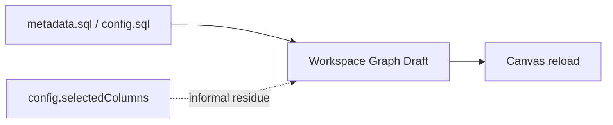
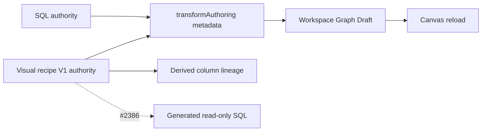

# VTX1 Visual Transform Recipe Authority Plan

## Think-First Analysis

### Problem summary

The DVT model node currently persists editable SQL, while the only column-like
selection residue is the informal `metadata.config.selectedColumns` string
array. That residue cannot express output identity, rename, ordered operations,
multi-input expressions, or filters, and must not become a second authority
beside SQL.

### Root cause

`WorkspaceGraphAuthoringDraft` already preserves JSON-compatible node metadata
through save and reload, but DVT has no versioned semantic contract for visual
transformation intent. Column references are primitive dotted strings and the
authoring mode is implicit. A UI or edge implementation built on those values
would encode product meaning in presentation state.

### Constraints and invariants

- GitHub issue #2383 owns task state; Planning DB owns the architecture design
  and feature mechanization.
- `WorkspaceGraphAuthoringDraft` remains the only persistence aggregate.
- Existing SQL nodes without a mode discriminant remain SQL-authoritative.
- Visual and SQL authority are mutually exclusive for one transform.
- Visual recipes contain no SQL projection, secrets, runtime state, geometry,
  React Flow edges, or execution result.
- Column lineage edges are derived from recipe input references.
- Output, input, and operation array order is semantic and must be preserved.
- Output IDs remain stable across rename; input references do not depend on
  Canvas coordinates.
- `config.selectedColumns` remains inert historical metadata and is neither
  migrated nor treated as recipe authority.
- #2333 keeps exclusive ownership of SQL parsing, PostgreSQL diagnostics,
  readiness, Preview, PlanRef, and Run.

### Options considered

1. **Persist column edges. Rejected.** It creates a second authority that can
   diverge from the recipe.
2. **Promote `selectedColumns`. Rejected.** Dotted strings are ambiguous and
   cannot represent output or operation semantics.
3. **Infer a recipe from existing SQL. Rejected.** V1 does not promise SQL to
   visual reconstruction.
4. **Create a generic expression DSL. Rejected.** The MVP needs a closed set of
   typed operations, not another planner.
5. **Selected: versioned recipe value object in node metadata.** The existing
   Graph Draft transports one strict recipe contract and one explicit
   `visual | sql` authority state.

### Current and target authority





## Pre-Implementation Brief

- **Mode:** bounded contract and persistence slice.
- **Baseline:** `main@6abc6bc8b`.
- **Expected outcome:** a visual recipe can be validated, canonicalized,
  serialized into one DVT transform node, saved through the existing Graph
  Draft, and reopened without semantic change; legacy SQL remains valid.
- **Risk:** hidden dual authority, unstable references, invented migration,
  permissive unknown operations, or overlap with SQL readiness.
- **Mitigation:** strict discriminated schemas, explicit compatibility rule,
  deterministic roundtrip tests, and forbidden runtime/UI surfaces.
- **Out of scope:** mapping UI, React Flow handles/edges, recipe editor, SQL
  generation, SQL parsing, validation, Preview, runtime, and migration.
- **Libraries:** none; Zod and current contract/draft projections are enough.

## Contract V1

### Stable identities

```text
ColumnInputRef = { nodeId, columnName }
OutputColumn   = { id, name, dataType?, expression }
```

`OutputColumn.name` expresses rename. An excluded input is absent from outputs.
Neither concern receives a duplicate operation or boolean field.

### Closed operation set

- `passthrough`;
- `cast` with a target type;
- `function` with one of `trim | upper | lower | coalesce | concat` and scalar
  arguments;
- `constant` with a scalar JSON value.

Simple V1 filters use a stable input reference and a closed comparison set.
JOIN, GROUP BY, window functions, arbitrary AST nodes, provider dialects, and
runtime semantics remain outside this contract.

### Authority state

```text
sql    -> editable SQL is authority; recipe is absent
visual -> recipe is authority; editable SQL is absent
```

An old node with no authority envelope is read as SQL. Converting Visual to SQL
is fail-safe: it requires a nonblank generated SQL input, removes the recipe
authority atomically, and never reconstructs a recipe from SQL.

## Command And Query Rails

| Intent                        | Rail                          | Type    | DDD owner                        |
| ----------------------------- | ----------------------------- | ------- | -------------------------------- |
| Configure transform authority | `ConfigureCanvasDvtNode`      | command | DVT transform authoring metadata |
| Persist the aggregate         | `SaveCanvasAuthoringDraft`    | command | Workspace Graph Authoring Draft  |
| Read the aggregate            | `GetWorkspaceGraphDraft`      | query   | Workspace Graph Draft record     |
| Reopen semantic nodes         | `ProjectCanvasAuthoringDraft` | query   | Canvas authoring semantic graph  |

No new command, query, store, route, or adapter is introduced.

## Fowler Opportunity Matrix

| Scenario                                           | Signal                 | Treatment                               | Owner                  | Evidence                     |
| -------------------------------------------------- | ---------------------- | --------------------------------------- | ---------------------- | ---------------------------- |
| SQL and column residue can both look authoritative | Hidden authority       | explicit discriminated authority state  | DVT transform metadata | authority tests              |
| Column identity is a dotted string                 | Primitive obsession    | `ColumnInputRef` value object           | recipe contract        | schema negative tests        |
| Recipe and rendered edges can diverge              | Duplicated state       | lineage derived from recipe only        | recipe projection      | architecture guard in #2384  |
| UI could validate its own recipe shape             | Boundary drift         | one exported Zod contract/canonicalizer | contracts              | contract/Web roundtrip tests |
| Arbitrary expression framework appears early       | Speculative generality | closed V1 unions                        | recipe contract        | unknown-operation rejection  |
| Reload changes order or meaning                    | Temporal coupling      | deterministic canonical serialization   | Graph Draft projection | full roundtrip test          |

## Definition Of Ready

- [x] #2383 owns the bounded task and #2382 owns the epic.
- [x] Baseline and overlapping open PRs were checked.
- [x] Current SQL, Inspector, metadata, Graph Draft, and reload paths were
      traced end to end.
- [x] Existing rails were selected for reuse.
- [x] V1 identities, operations, filters, compatibility, and exclusions are
      fixed.
- [x] #2333 ownership is preserved and no runtime surface is needed.
- [x] Fowler matrix and TDD sequence are fixed before production edits.

## Definition Of Done

- [ ] A strict, exported, versioned recipe contract exists.
- [ ] SQL and visual authority cannot validate simultaneously.
- [ ] Output IDs and input references are nonblank and deterministic.
- [ ] Duplicate output IDs and unsupported operations/functions reject.
- [ ] Recipe serialization preserves semantic array order and strips no valid
      intent.
- [ ] Visual metadata survives CanonicalNode -> Graph Draft -> CanonicalNode.
- [ ] Legacy SQL nodes remain SQL-authoritative without migration.
- [ ] Visual to SQL transition rejects blank SQL and removes recipe authority.
- [ ] Column edges are documented as derived and not persisted.
- [ ] Contract, Web, architecture, lint, type-check, ARC-2, governance, and
      pre-push gates pass.
- [ ] No debt, stub, parser, runtime path, store, edge collection, or disabled
      rule is introduced.

## Microcommit Sequence

1. `docs(docs)` declare #2383 design and mechanization.
2. `test(contracts)` add red recipe schema/canonicalization tests.
3. `feat(contracts)` add the minimal V1 value objects and schemas.
4. `test(web)` add red authority, compatibility, transition, and Graph Draft
   roundtrip tests.
5. `feat(web)` integrate the recipe authority with DVT node metadata.
6. `docs(docs)` add ARC-2 evidence, risk, and canonical component updates.

## Validation Plan

- focused `@dvt/contracts` recipe tests;
- focused Web DVT authority and Graph Draft projection tests;
- contracts/Web lint and type-check;
- ARC check and evidence/risk validation;
- feature mechanization/governance checks;
- `pnpm verify:prepush`.

## Follow-up bounded editor slice (#2385)

Issue #2385 realizes the already-governed visual recipe through the existing
contextual Node Properties surface. It reuses `ConfigureCanvasDvtNode` and the
current Apply/Cancel Graph Draft lifecycle; it adds no store, route, planner,
graph, persisted mapping, form engine, or SQL authority. Connected column
choices are derived from the current semantic graph, while generated SQL stays
read-only in the existing Code section.

The V1 editor covers output inclusion and rename, ordered closed-set
operations, multi-input expressions, and simple filters. Pointer and keyboard
controls share the same commands, validation reuses `VisualTransformRecipeV1`,
and ES/EN copy remains in the existing Canvas copy catalog.

## Follow-up explicit Visual to SQL transfer (#2386)

Issue #2386 exposes the existing `convertDvtVisualTransformToSql` policy in the
contextual Code section. The generated SQL remains read-only until the user
confirms the irreversible authority change; confirmation writes that exact SQL
through `ConfigureCanvasDvtNode` into the existing Graph Draft aggregate. The
same SQL editor already used by SQL-authoritative transforms then becomes the
editing surface.

This slice adds no SQL parser, reverse SQL-to-Visual conversion, store,
planner, graph, persisted intermediate representation, workspace service call,
or runtime validation. PostgreSQL validation remains owned by #2333 and the
end-to-end Preview proof remains owned by #2387.

```feature-mechanization
version: 1
featureId: VTX1-VISUAL-TRANSFORM-RECIPE-AUTHORITY
mechanizationStatus: closed
noHumanDecisionsRemaining: true
implementationPlan: docs/planning/proposals/mandatory/frontend-and-ux/vtx1-visual-transform-recipe-authority-plan-20260816.md
componentGuides:
  - docs/architecture/components/web/graph/canvas-inspector-authoring-component.md
userStories:
  - https://github.com/dunay2/dvt/issues/2383
  - https://github.com/dunay2/dvt/issues/2385
  - https://github.com/dunay2/dvt/issues/2386
governingSources:
  - AGENTS.md
  - docs/planning/status/governance-document-rule-inventory.md
  - docs/architecture/command-query-rail-governance.md
  - docs/architecture/fowler-opportunity-planning-governance.md
  - docs/adr/ADR-0035-planner-public-contract-evolution-protocol.md
  - docs/adr/ADR-0061-github-mvp-task-authority-and-planning-db-architecture-boundary.md
allowedImplementationSurfaces:
  - packages/@dvt/contracts/src/contracts/planner/VisualTransformRecipe.v1.ts
  - packages/@dvt/contracts/src/index.ts
  - packages/@dvt/contracts/test/visual-transform-recipe.contract.test.ts
  - apps/web/src/app/views/canvas/canvasDvtTransformAuthoringAuthority.ts
  - apps/web/src/app/views/canvas/canvasDvtTransformAuthoringAuthority.test.ts
  - apps/web/src/app/views/canvas/canvasTransformationSqlMirror.ts
  - apps/web/src/app/views/canvas/canvasTransformationSqlMirror.test.ts
  - apps/web/src/app/services/workspace/workspaceGraphDraftProjection.test.ts
  - apps/web/src/app/views/canvas/canvasDraftAuthoring.test.ts
  - apps/web/src/app/views/Canvas.test.controller.defaults.ts
  - apps/web/src/app/views/canvas/useCanvasInspectorCommands.ts
  - apps/web/src/app/views/canvas/useCanvasController.activeDraftNodeAuthoring.test.tsx
  - apps/web/src/app/views/canvas/canvasControllerViewModel.ts
  - apps/web/src/app/views/canvas/canvasInspectorAuthoring.types.ts
  - apps/web/src/app/views/canvas/canvasShellBuilder.types.ts
  - apps/web/src/app/views/canvas/canvasShellPanelsBuilder.ts
  - apps/web/src/app/views/canvas/canvasShellPanelsBuilder.test.ts
  - apps/web/src/app/views/canvas/canvasShellPropsBuilder.tsx
  - apps/web/src/app/views/canvas/CanvasInspectorAuthoringSection.tsx
  - apps/web/src/app/views/canvas/CanvasNodeWorkbenchPanel.tsx
  - apps/web/src/app/views/canvas/CanvasNodeWorkbenchPanel.test.tsx
  - apps/web/src/app/views/canvas/canvasInspectorAuthoringComponent.architecture.test.ts
  - apps/web/src/app/views/canvas/DvtAuthoringFields.test.tsx
  - apps/web/src/app/views/canvas/DvtAuthoringFields.tsx
  - apps/web/src/app/views/canvas/DvtVisualTransformRecipeAuthoringSection.tsx
  - apps/web/src/app/views/canvas/canvasCopy.types.ts
  - apps/web/src/app/views/canvas/canvasCopyCatalog.authoring.es.ts
  - apps/web/src/app/views/canvas/canvasCopyCatalog.authoring.ts
  - apps/web/src/app/views/canvas/canvasCopyFormatting.ts
  - apps/web/src/app/views/canvas/canvasDvtAuthoringModel.ts
  - apps/web/src/app/views/canvas/canvasInspectorAuthoringErrorCodes.ts
  - apps/web/src/app/views/canvas/canvasInspectorAuthoringModel.test.ts
  - docs/architecture/components/web/graph/canvas-inspector-authoring-component.md
  - docs/architecture/components/web/graph/canvas-workbench-command-query-catalog.md
  - docs/evidence/**
  - docs/risk-register/quality/**
  - docs/planning/proposals/mandatory/frontend-and-ux/vtx1-visual-transform-recipe-authority-plan-20260816.md
  - docs/.manifest.json
  - docs/**/index.md
  - tools/planning-db/state/db-governance-surfaces.json
  - docs/planning/status/system-governance-unit-index.units.yaml
  - docs/planning/status/system-governance-unit-index-20260501.md
  - docs/planning/status/system-governance-planstore-file-ownership-20260501.md
forbiddenImplementationSurfaces:
  - apps/api/**
  - apps/web/src/app/views/canvas/DvtSqlTransformAuthoringSection.tsx
  - apps/web/src/app/views/canvas/previewGraphNodePayloads.ts
  - packages/@dvt/engine/**
  - packages/@dvt/adapter-*/**
  - .github/**
commandQueryRails:
  - name: ConfigureCanvasDvtNode
    type: command
    dddOwner: DvtTransformAuthoringMetadata
  - name: SaveCanvasAuthoringDraft
    type: command
    dddOwner: WorkspaceGraphAuthoringDraft
  - name: GetWorkspaceGraphDraft
    type: query
    dddOwner: WorkspaceGraphDraftRecord
  - name: ProjectCanvasAuthoringDraft
    type: query
    dddOwner: CanvasAuthoringSemanticGraph
domainObjects:
  - name: VisualTransformRecipeV1
    type: value object
    owner: DVT Transform Authoring
  - name: DvtTransformAuthoringAuthority
    type: policy
    owner: DVT Transform Authoring
fowlerSignals:
  - Hidden authority
  - Primitive obsession
  - Duplicated state
  - Boundary drift
  - Speculative generality
  - Temporal coupling
architectureGuards:
  - pnpm docs:feature-mechanization:implementation -- --feature VTX1-VISUAL-TRANSFORM-RECIPE-AUTHORITY
cypressFlows:
  - Agent-browser /canvas Node Properties visual recipe Apply, Cancel, reload, ES/EN, keyboard, and narrow viewport proof for #2385
  - Agent-browser /canvas generated SQL Convert to SQL confirm, cancel, reload, ES/EN, and editor authority proof for #2386
completionGate:
  - pnpm --filter @dvt/contracts test
  - pnpm --filter @dvt/web test:canvas:run -- src/app/views/canvas/canvasDvtTransformAuthoringAuthority.test.ts src/app/views/canvas/canvasDraftAuthoring.test.ts
  - pnpm --filter @dvt/web test:canvas:run -- src/app/views/canvas/DvtAuthoringFields.test.tsx src/app/views/canvas/canvasInspectorAuthoringModel.test.ts src/app/views/canvas/CanvasNodeWorkbenchPanel.test.tsx
  - pnpm --filter @dvt/web test:workspace-services:run -- src/app/services/workspace/workspaceGraphDraftProjection.test.ts
  - pnpm --filter @dvt/web test:canvas-presentation:run -- CanvasNodeWorkbenchPanel.test.tsx useCanvasController.activeDraftNodeAuthoring.test.tsx
  - pnpm --filter @dvt/web test:canvas-architecture:run -- canvasInspectorAuthoringComponent.architecture.test.ts
  - pnpm --filter @dvt/web lint
  - pnpm --filter @dvt/contracts typecheck
  - pnpm --filter @dvt/web typecheck
  - pnpm docs:feature-mechanization:implementation -- --feature VTX1-VISUAL-TRANSFORM-RECIPE-AUTHORITY
  - pnpm verify:prepush
redGreenCycles:
  - id: visual-recipe-contract
    redTest: pnpm --filter @dvt/contracts test -- visual-transform-recipe.contract.test.ts
    expectedFailure: No strict versioned visual recipe schema exists.
    patchSurfaces:
      - packages/@dvt/contracts/src/contracts/planner/VisualTransformRecipe.v1.ts
      - packages/@dvt/contracts/test/visual-transform-recipe.contract.test.ts
    greenTest: pnpm --filter @dvt/contracts test -- visual-transform-recipe.contract.test.ts
  - id: dvt-authority-roundtrip
    redTest: pnpm --filter @dvt/web test:canvas:run -- src/app/views/canvas/canvasDvtTransformAuthoringAuthority.test.ts src/app/views/canvas/canvasDraftAuthoring.test.ts
    expectedFailure: Visual authority and recipe do not have a governed metadata roundtrip.
    patchSurfaces:
      - apps/web/src/app/views/canvas/canvasDvtTransformAuthoringAuthority.ts
      - apps/web/src/app/views/canvas/canvasDvtTransformAuthoringAuthority.test.ts
      - apps/web/src/app/services/workspace/workspaceGraphDraftProjection.test.ts
      - apps/web/src/app/views/canvas/canvasDraftAuthoring.test.ts
    greenTest: pnpm --filter @dvt/web test:canvas:run -- src/app/views/canvas/canvasDvtTransformAuthoringAuthority.test.ts src/app/views/canvas/canvasDraftAuthoring.test.ts
  - id: visual-recipe-contextual-editor
    redTest: pnpm --filter @dvt/web test:canvas:run -- src/app/views/canvas/DvtAuthoringFields.test.tsx src/app/views/canvas/canvasInspectorAuthoringModel.test.ts
    expectedFailure: Node Properties cannot edit and validate the persisted visual recipe authority.
    patchSurfaces:
      - apps/web/src/app/views/canvas/DvtVisualTransformRecipeAuthoringSection.tsx
      - apps/web/src/app/views/canvas/DvtAuthoringFields.tsx
      - apps/web/src/app/views/canvas/canvasDvtAuthoringModel.ts
      - apps/web/src/app/views/canvas/canvasCopyCatalog.authoring.ts
      - apps/web/src/app/views/canvas/canvasCopyCatalog.authoring.es.ts
    greenTest: pnpm --filter @dvt/web test:canvas:run -- src/app/views/canvas/DvtAuthoringFields.test.tsx src/app/views/canvas/canvasInspectorAuthoringModel.test.ts src/app/views/canvas/CanvasNodeWorkbenchPanel.test.tsx
  - id: explicit-visual-to-sql-authority-transfer
    redTest: pnpm --filter @dvt/web test:canvas-presentation:run -- CanvasNodeWorkbenchPanel.test.tsx useCanvasController.activeDraftNodeAuthoring.test.tsx
    expectedFailure: Generated SQL has no explicit confirmed route into the existing SQL authority.
    patchSurfaces:
      - apps/web/src/app/views/canvas/CanvasNodeWorkbenchPanel.tsx
      - apps/web/src/app/views/canvas/useCanvasInspectorCommands.ts
      - apps/web/src/app/views/canvas/canvasDvtTransformAuthoringAuthority.ts
      - apps/web/src/app/views/canvas/canvasTransformationSqlMirror.ts
    greenTest: pnpm --filter @dvt/web test:canvas-presentation:run -- CanvasNodeWorkbenchPanel.test.tsx useCanvasController.activeDraftNodeAuthoring.test.tsx
symbols:
  - &contractSymbol
    name: VisualTransformRecipeV1Schema
    path: packages/@dvt/contracts/src/contracts/planner/VisualTransformRecipe.v1.ts
    dddOwner: VisualTransformRecipeV1
    cqRails: [ConfigureCanvasDvtNode, SaveCanvasAuthoringDraft]
    fowlerSignals: [Hidden authority, Primitive obsession, Speculative generality]
    architectureGuard: pnpm docs:feature-mechanization:implementation -- --feature VTX1-VISUAL-TRANSFORM-RECIPE-AUTHORITY
    cypressCoverage: N/A - contract and persistence slice
    unitTests: [packages/@dvt/contracts/test/visual-transform-recipe.contract.test.ts]
  - <<: *contractSymbol
    name: DVT_TRANSFORM_AUTHORING_MODE
  - <<: *contractSymbol
    name: DvtTransformAuthoringAuthorityV1
  - <<: *contractSymbol
    name: DvtTransformAuthoringAuthorityV1Schema
  - <<: *contractSymbol
    name: JsonScalarSchema
  - <<: *contractSymbol
    name: NonBlankStringSchema
  - <<: *contractSymbol
    name: NullComparisonFilterV1Schema
  - <<: *contractSymbol
    name: SqlTransformAuthoringAuthorityV1Schema
  - <<: *contractSymbol
    name: VISUAL_TRANSFORM_FILTER_OPERATOR
  - <<: *contractSymbol
    name: VISUAL_TRANSFORM_FUNCTION_ID
  - <<: *contractSymbol
    name: VISUAL_TRANSFORM_RECIPE_VERSION
  - <<: *contractSymbol
    name: ValueComparisonFilterV1Schema
  - <<: *contractSymbol
    name: VisualTransformAuthoringAuthorityV1Schema
  - <<: *contractSymbol
    name: VisualTransformCastOperationV1Schema
  - <<: *contractSymbol
    name: VisualTransformColumnInputRefV1
  - <<: *contractSymbol
    name: VisualTransformColumnInputRefV1Schema
  - <<: *contractSymbol
    name: VisualTransformConstantOperationV1Schema
  - <<: *contractSymbol
    name: VisualTransformExpressionV1
  - <<: *contractSymbol
    name: VisualTransformExpressionV1Schema
  - <<: *contractSymbol
    name: VisualTransformFilterV1
  - <<: *contractSymbol
    name: VisualTransformFilterV1Schema
  - <<: *contractSymbol
    name: VisualTransformFunctionOperationV1Schema
  - <<: *contractSymbol
    name: VisualTransformOperationV1
  - <<: *contractSymbol
    name: VisualTransformOperationV1Schema
  - <<: *contractSymbol
    name: VisualTransformOutputColumnV1
  - <<: *contractSymbol
    name: VisualTransformOutputColumnV1Schema
  - <<: *contractSymbol
    name: VisualTransformPassthroughOperationV1Schema
  - <<: *contractSymbol
    name: VisualTransformRecipeV1
  - <<: *contractSymbol
    name: addDuplicateIdIssues
  - <<: *contractSymbol
    name: canonicalizeVisualTransformRecipeV1
  - <<: *contractSymbol
    name: serializeVisualTransformRecipeV1
  - &authoritySymbol
    name: readDvtTransformAuthoringAuthority
    path: apps/web/src/app/views/canvas/canvasDvtTransformAuthoringAuthority.ts
    dddOwner: DvtTransformAuthoringAuthority
    cqRails: [ConfigureCanvasDvtNode, ProjectCanvasAuthoringDraft]
    fowlerSignals: [Hidden authority, Boundary drift]
    architectureGuard: pnpm docs:feature-mechanization:implementation -- --feature VTX1-VISUAL-TRANSFORM-RECIPE-AUTHORITY
    cypressCoverage: N/A - no UI in #2383
    unitTests: [apps/web/src/app/views/canvas/canvasDvtTransformAuthoringAuthority.test.ts]
  - <<: *authoritySymbol
    name: DVT_TRANSFORM_AUTHORING_AUTHORITY_METADATA_KEY
  - <<: *authoritySymbol
    name: DvtTransformAuthoringAuthority
  - <<: *authoritySymbol
    name: applyDvtVisualTransformRecipe
  - <<: *authoritySymbol
    name: assertDvtTransformNode
  - <<: *authoritySymbol
    name: convertDvtVisualTransformToSql
  - <<: *authoritySymbol
    name: hasEditableSqlMetadata
  - <<: *authoritySymbol
    name: isRecord
  - <<: *authoritySymbol
    name: removeEditableSqlMetadata
  - &visualEditorSymbol
    name: DvtVisualTransformRecipeAuthoringSection
    path: apps/web/src/app/views/canvas/DvtVisualTransformRecipeAuthoringSection.tsx
    dddOwner: DvtTransformAuthoringMetadata
    cqRails: [ConfigureCanvasDvtNode, ProjectCanvasAuthoringDraft]
    fowlerSignals: [Duplicated state, Speculative generality]
    architectureGuard: pnpm docs:feature-mechanization:implementation -- --feature VTX1-VISUAL-TRANSFORM-RECIPE-AUTHORITY
    cypressCoverage: Agent-browser Node Properties visual recipe proof
    unitTests: [apps/web/src/app/views/canvas/DvtAuthoringFields.test.tsx]
  - <<: *visualEditorSymbol
    name: CAST_TYPES
  - <<: *visualEditorSymbol
    name: FILTER_OPERATORS
  - <<: *visualEditorSymbol
    name: InputColumn
  - <<: *visualEditorSymbol
    name: OperationKind
  - <<: *visualEditorSymbol
    name: createOperation
  - <<: *visualEditorSymbol
    name: isRecord
  - <<: *visualEditorSymbol
    name: nextStableId
  - <<: *visualEditorSymbol
    name: normalizeExpression
  - <<: *visualEditorSymbol
    name: operationKind
  - <<: *visualEditorSymbol
    name: readColumns
  - <<: *visualEditorSymbol
    name: readString
  - <<: *visualEditorSymbol
    name: resolveInputColumns
  - <<: *visualEditorSymbol
    name: updateFilter
  - <<: *visualEditorSymbol
    name: updateOutput
  - &visualEditorModelSymbol
    name: DvtVisualTransformAuthoringMetadata
    path: apps/web/src/app/views/canvas/canvasDvtAuthoringModel.ts
    dddOwner: DvtTransformAuthoringMetadata
    cqRails: [ConfigureCanvasDvtNode, ProjectCanvasAuthoringDraft]
    fowlerSignals: [Hidden authority, Boundary drift]
    architectureGuard: pnpm docs:feature-mechanization:implementation -- --feature VTX1-VISUAL-TRANSFORM-RECIPE-AUTHORITY
    cypressCoverage: Agent-browser Node Properties visual recipe proof
    unitTests: [apps/web/src/app/views/canvas/canvasInspectorAuthoringModel.test.ts]
  - <<: *visualEditorModelSymbol
    name: createSqlTransformMetadata
```
