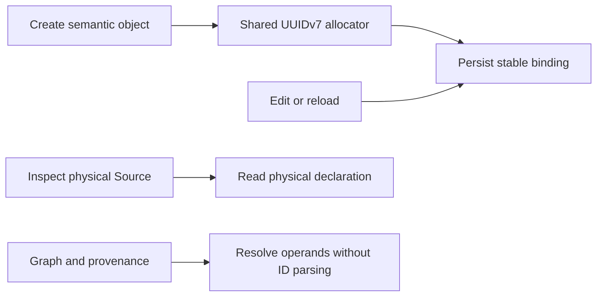

# Opaque DVT authoring identity

GitHub issue #2936 owns delivery state and acceptance. Planning DB owns the
existing ConfigureCanvasDvtNode rail and its feature mechanization. The canonical
identity rule and design rationale live in the semantic-transformation component.

## Contract and integration

Assign new RelationId and FieldId values through the shared contracts allocator.
Reuse surviving identities on rename, reorder, expression edit and reload. Read a
clean physical Source without manufacturing a semantic projection. Resolve JOIN
and SET operands through graph context and explicit provenance, never ID text.
Return the actual createdFieldId from the existing output creation command.

The final integration combines cuts 1–10 while preserving the shared Source and
Transform kinds already on main. The caller sees one Canvas and one semantic
authority; dbt remains an integration and external authority.



## Validation boundary

Normal contracts and Web tests, lint, typecheck, ARC-2 and pre-push gates apply.
Regression tests cover missing createdFieldId and name-derived output
identity after Source replacement. Source Inspector tests cover repeated clean
reads; lineage tests preserve identity across a real edit of one persisted draft.
Duplication allocates disjoint identities and remaps structured references. UNION
ALL lineage covers every input, including grouping and grouped windows, and
rejects disconnected or ambiguous graph provenance.

The manifest below is an evidence snapshot exported from Planning DB revision
2; it is not an alternative authoring authority or a task board.
CI explicitly bootstraps an isolated Planning DB from repository evidence. Local
validation of this snapshot uses a newly created isolated CI database and the
same explicit bootstrap workflow. It never imports into, replaces or rebuilds
the working Planning DB. This isolation is required because the legacy validator
can otherwise perform an implicit import when a Markdown snapshot changes.

```feature-mechanization
{
  "symbols": [
    {
      "name": "DVT_FIELD_ID",
      "path": "apps/web/cypress/e2e/canvas/canvas-substrait-aggregate-window.cy.ts",
      "cqRails": [
        "ConfigureCanvasDvtNode"
      ],
      "dddOwner": "DvtSubstraitAuthoringSidecarV1",
      "unitTests": [
        "pnpm --filter @dvt/contracts test",
        "pnpm --filter @dvt/web test:canvas-unit:run"
      ],
      "fowlerSignals": [
        "Hidden authority in identifier text",
        "Replace derived identity with assigned identity"
      ],
      "cypressCoverage": "apps/web/cypress/e2e/canvas/canvas-substrait-inner-join-field-selection.cy.ts",
      "architectureGuard": "pnpm --filter @dvt/web test:architecture:run"
    },
    {
      "name": "DVT_FIELD_ID",
      "path": "apps/web/cypress/e2e/canvas/canvas-substrait-grouping.cy.ts",
      "cqRails": [
        "ConfigureCanvasDvtNode"
      ],
      "dddOwner": "DvtSubstraitAuthoringSidecarV1",
      "unitTests": [
        "pnpm --filter @dvt/contracts test",
        "pnpm --filter @dvt/web test:canvas-unit:run"
      ],
      "fowlerSignals": [
        "Hidden authority in identifier text",
        "Replace derived identity with assigned identity"
      ],
      "cypressCoverage": "apps/web/cypress/e2e/canvas/canvas-substrait-inner-join-field-selection.cy.ts",
      "architectureGuard": "pnpm --filter @dvt/web test:architecture:run"
    },
    {
      "name": "OPAQUE_FIELD_ID",
      "path": "apps/web/cypress/e2e/canvas/canvas-substrait-union-all.cy.ts",
      "cqRails": [
        "ConfigureCanvasDvtNode"
      ],
      "dddOwner": "DvtSubstraitAuthoringSidecarV1",
      "unitTests": [
        "pnpm --filter @dvt/contracts test",
        "pnpm --filter @dvt/web test:canvas-unit:run"
      ],
      "fowlerSignals": [
        "Hidden authority in identifier text",
        "Replace derived identity with assigned identity"
      ],
      "cypressCoverage": "apps/web/cypress/e2e/canvas/canvas-substrait-inner-join-field-selection.cy.ts",
      "architectureGuard": "pnpm --filter @dvt/web test:architecture:run"
    },
    {
      "name": "DVT_FIELD_ID",
      "path": "apps/web/cypress/e2e/canvas/canvas-substrait-window.cy.ts",
      "cqRails": [
        "ConfigureCanvasDvtNode"
      ],
      "dddOwner": "DvtSubstraitAuthoringSidecarV1",
      "unitTests": [
        "pnpm --filter @dvt/contracts test",
        "pnpm --filter @dvt/web test:canvas-unit:run"
      ],
      "fowlerSignals": [
        "Hidden authority in identifier text",
        "Replace derived identity with assigned identity"
      ],
      "cypressCoverage": "apps/web/cypress/e2e/canvas/canvas-substrait-inner-join-field-selection.cy.ts",
      "architectureGuard": "pnpm --filter @dvt/web test:architecture:run"
    },
    {
      "name": "readProjectionEntry",
      "path": "apps/web/src/app/views/canvas/canvasColumnMappingAuthoring.ts",
      "cqRails": [
        "ConfigureCanvasDvtNode"
      ],
      "dddOwner": "DvtSubstraitAuthoringSidecarV1",
      "unitTests": [
        "pnpm --filter @dvt/contracts test",
        "pnpm --filter @dvt/web test:canvas-unit:run"
      ],
      "fowlerSignals": [
        "Hidden authority in identifier text",
        "Replace derived identity with assigned identity"
      ],
      "cypressCoverage": "apps/web/cypress/e2e/canvas/canvas-substrait-inner-join-field-selection.cy.ts",
      "architectureGuard": "pnpm --filter @dvt/web test:architecture:run"
    },
    {
      "name": "EditableCanvasProjectionEntry",
      "path": "apps/web/src/app/views/canvas/canvasColumnProjectionAuthority.ts",
      "cqRails": [
        "ConfigureCanvasDvtNode"
      ],
      "dddOwner": "DvtSubstraitAuthoringSidecarV1",
      "unitTests": [
        "pnpm --filter @dvt/contracts test",
        "pnpm --filter @dvt/web test:canvas-unit:run"
      ],
      "fowlerSignals": [
        "Hidden authority in identifier text",
        "Replace derived identity with assigned identity"
      ],
      "cypressCoverage": "apps/web/cypress/e2e/canvas/canvas-substrait-inner-join-field-selection.cy.ts",
      "architectureGuard": "pnpm --filter @dvt/web test:architecture:run"
    },
    {
      "name": "bindProjectionSourceTypes",
      "path": "apps/web/src/app/views/canvas/canvasColumnProjectionAuthority.ts",
      "cqRails": [
        "ConfigureCanvasDvtNode"
      ],
      "dddOwner": "DvtSubstraitAuthoringSidecarV1",
      "unitTests": [
        "pnpm --filter @dvt/contracts test",
        "pnpm --filter @dvt/web test:canvas-unit:run"
      ],
      "fowlerSignals": [
        "Hidden authority in identifier text",
        "Replace derived identity with assigned identity"
      ],
      "cypressCoverage": "apps/web/cypress/e2e/canvas/canvas-substrait-inner-join-field-selection.cy.ts",
      "architectureGuard": "pnpm --filter @dvt/web test:architecture:run"
    },
    {
      "name": "carryForwardProjectionIdentity",
      "path": "apps/web/src/app/views/canvas/canvasColumnProjectionAuthority.ts",
      "cqRails": [
        "ConfigureCanvasDvtNode"
      ],
      "dddOwner": "DvtSubstraitAuthoringSidecarV1",
      "unitTests": [
        "pnpm --filter @dvt/contracts test",
        "pnpm --filter @dvt/web test:canvas-unit:run"
      ],
      "fowlerSignals": [
        "Hidden authority in identifier text",
        "Replace derived identity with assigned identity"
      ],
      "cypressCoverage": "apps/web/cypress/e2e/canvas/canvas-substrait-inner-join-field-selection.cy.ts",
      "architectureGuard": "pnpm --filter @dvt/web test:architecture:run"
    },
    {
      "name": "hasEditableOutputs",
      "path": "apps/web/src/app/views/canvas/canvasColumnProjectionAuthority.ts",
      "cqRails": [
        "ConfigureCanvasDvtNode"
      ],
      "dddOwner": "DvtSubstraitAuthoringSidecarV1",
      "unitTests": [
        "pnpm --filter @dvt/contracts test",
        "pnpm --filter @dvt/web test:canvas-unit:run"
      ],
      "fowlerSignals": [
        "Hidden authority in identifier text",
        "Replace derived identity with assigned identity"
      ],
      "cypressCoverage": "apps/web/cypress/e2e/canvas/canvas-substrait-inner-join-field-selection.cy.ts",
      "architectureGuard": "pnpm --filter @dvt/web test:architecture:run"
    },
    {
      "name": "readCurrentProjectionDraft",
      "path": "apps/web/src/app/views/canvas/canvasColumnProjectionAuthority.ts",
      "cqRails": [
        "ConfigureCanvasDvtNode"
      ],
      "dddOwner": "DvtSubstraitAuthoringSidecarV1",
      "unitTests": [
        "pnpm --filter @dvt/contracts test",
        "pnpm --filter @dvt/web test:canvas-unit:run"
      ],
      "fowlerSignals": [
        "Hidden authority in identifier text",
        "Replace derived identity with assigned identity"
      ],
      "cypressCoverage": "apps/web/cypress/e2e/canvas/canvas-substrait-inner-join-field-selection.cy.ts",
      "architectureGuard": "pnpm --filter @dvt/web test:architecture:run"
    },
    {
      "name": "readEditableCanvasProjectionEntry",
      "path": "apps/web/src/app/views/canvas/canvasColumnProjectionAuthority.ts",
      "cqRails": [
        "ConfigureCanvasDvtNode"
      ],
      "dddOwner": "DvtSubstraitAuthoringSidecarV1",
      "unitTests": [
        "pnpm --filter @dvt/contracts test",
        "pnpm --filter @dvt/web test:canvas-unit:run"
      ],
      "fowlerSignals": [
        "Hidden authority in identifier text",
        "Replace derived identity with assigned identity"
      ],
      "cypressCoverage": "apps/web/cypress/e2e/canvas/canvas-substrait-inner-join-field-selection.cy.ts",
      "architectureGuard": "pnpm --filter @dvt/web test:architecture:run"
    },
    {
      "name": "sameProjectionSource",
      "path": "apps/web/src/app/views/canvas/canvasColumnProjectionAuthority.ts",
      "cqRails": [
        "ConfigureCanvasDvtNode"
      ],
      "dddOwner": "DvtSubstraitAuthoringSidecarV1",
      "unitTests": [
        "pnpm --filter @dvt/contracts test",
        "pnpm --filter @dvt/web test:canvas-unit:run"
      ],
      "fowlerSignals": [
        "Hidden authority in identifier text",
        "Replace derived identity with assigned identity"
      ],
      "cypressCoverage": "apps/web/cypress/e2e/canvas/canvas-substrait-inner-join-field-selection.cy.ts",
      "architectureGuard": "pnpm --filter @dvt/web test:architecture:run"
    },
    {
      "name": "filterRelationId",
      "path": "apps/web/src/app/views/canvas/canvasDvtSubstraitFilter.ts",
      "cqRails": [
        "ConfigureCanvasDvtNode"
      ],
      "dddOwner": "DvtSubstraitAuthoringSidecarV1",
      "unitTests": [
        "pnpm --filter @dvt/contracts test",
        "pnpm --filter @dvt/web test:canvas-unit:run"
      ],
      "fowlerSignals": [
        "Hidden authority in identifier text",
        "Replace derived identity with assigned identity"
      ],
      "cypressCoverage": "apps/web/cypress/e2e/canvas/canvas-substrait-inner-join-field-selection.cy.ts",
      "architectureGuard": "pnpm --filter @dvt/web test:architecture:run"
    },
    {
      "name": "DvtSubstraitNInputJoinInspection",
      "path": "apps/web/src/app/views/canvas/canvasDvtSubstraitJoinComposition.ts",
      "cqRails": [
        "ConfigureCanvasDvtNode"
      ],
      "dddOwner": "DvtSubstraitAuthoringSidecarV1",
      "unitTests": [
        "pnpm --filter @dvt/contracts test",
        "pnpm --filter @dvt/web test:canvas-unit:run"
      ],
      "fowlerSignals": [
        "Hidden authority in identifier text",
        "Replace derived identity with assigned identity"
      ],
      "cypressCoverage": "apps/web/cypress/e2e/canvas/canvas-substrait-inner-join-field-selection.cy.ts",
      "architectureGuard": "pnpm --filter @dvt/web test:architecture:run"
    },
    {
      "name": "DvtSubstraitNInputJoinProjection",
      "path": "apps/web/src/app/views/canvas/canvasDvtSubstraitJoinComposition.ts",
      "cqRails": [
        "ConfigureCanvasDvtNode"
      ],
      "dddOwner": "DvtSubstraitAuthoringSidecarV1",
      "unitTests": [
        "pnpm --filter @dvt/contracts test",
        "pnpm --filter @dvt/web test:canvas-unit:run"
      ],
      "fowlerSignals": [
        "Hidden authority in identifier text",
        "Replace derived identity with assigned identity"
      ],
      "cypressCoverage": "apps/web/cypress/e2e/canvas/canvas-substrait-inner-join-field-selection.cy.ts",
      "architectureGuard": "pnpm --filter @dvt/web test:architecture:run"
    },
    {
      "name": "InspectedJoinStage",
      "path": "apps/web/src/app/views/canvas/canvasDvtSubstraitJoinComposition.ts",
      "cqRails": [
        "ConfigureCanvasDvtNode"
      ],
      "dddOwner": "DvtSubstraitAuthoringSidecarV1",
      "unitTests": [
        "pnpm --filter @dvt/contracts test",
        "pnpm --filter @dvt/web test:canvas-unit:run"
      ],
      "fowlerSignals": [
        "Hidden authority in identifier text",
        "Replace derived identity with assigned identity"
      ],
      "cypressCoverage": "apps/web/cypress/e2e/canvas/canvas-substrait-inner-join-field-selection.cy.ts",
      "architectureGuard": "pnpm --filter @dvt/web test:architecture:run"
    },
    {
      "name": "InspectedJoinStructure",
      "path": "apps/web/src/app/views/canvas/canvasDvtSubstraitJoinComposition.ts",
      "cqRails": [
        "ConfigureCanvasDvtNode"
      ],
      "dddOwner": "DvtSubstraitAuthoringSidecarV1",
      "unitTests": [
        "pnpm --filter @dvt/contracts test",
        "pnpm --filter @dvt/web test:canvas-unit:run"
      ],
      "fowlerSignals": [
        "Hidden authority in identifier text",
        "Replace derived identity with assigned identity"
      ],
      "cypressCoverage": "apps/web/cypress/e2e/canvas/canvas-substrait-inner-join-field-selection.cy.ts",
      "architectureGuard": "pnpm --filter @dvt/web test:architecture:run"
    },
    {
      "name": "JoinBuildInput",
      "path": "apps/web/src/app/views/canvas/canvasDvtSubstraitJoinComposition.ts",
      "cqRails": [
        "ConfigureCanvasDvtNode"
      ],
      "dddOwner": "DvtSubstraitAuthoringSidecarV1",
      "unitTests": [
        "pnpm --filter @dvt/contracts test",
        "pnpm --filter @dvt/web test:canvas-unit:run"
      ],
      "fowlerSignals": [
        "Hidden authority in identifier text",
        "Replace derived identity with assigned identity"
      ],
      "cypressCoverage": "apps/web/cypress/e2e/canvas/canvas-substrait-inner-join-field-selection.cy.ts",
      "architectureGuard": "pnpm --filter @dvt/web test:architecture:run"
    },
    {
      "name": "JoinBuildOutput",
      "path": "apps/web/src/app/views/canvas/canvasDvtSubstraitJoinComposition.ts",
      "cqRails": [
        "ConfigureCanvasDvtNode"
      ],
      "dddOwner": "DvtSubstraitAuthoringSidecarV1",
      "unitTests": [
        "pnpm --filter @dvt/contracts test",
        "pnpm --filter @dvt/web test:canvas-unit:run"
      ],
      "fowlerSignals": [
        "Hidden authority in identifier text",
        "Replace derived identity with assigned identity"
      ],
      "cypressCoverage": "apps/web/cypress/e2e/canvas/canvas-substrait-inner-join-field-selection.cy.ts",
      "architectureGuard": "pnpm --filter @dvt/web test:architecture:run"
    },
    {
      "name": "JoinBuildPredicate",
      "path": "apps/web/src/app/views/canvas/canvasDvtSubstraitJoinComposition.ts",
      "cqRails": [
        "ConfigureCanvasDvtNode"
      ],
      "dddOwner": "DvtSubstraitAuthoringSidecarV1",
      "unitTests": [
        "pnpm --filter @dvt/contracts test",
        "pnpm --filter @dvt/web test:canvas-unit:run"
      ],
      "fowlerSignals": [
        "Hidden authority in identifier text",
        "Replace derived identity with assigned identity"
      ],
      "cypressCoverage": "apps/web/cypress/e2e/canvas/canvas-substrait-inner-join-field-selection.cy.ts",
      "architectureGuard": "pnpm --filter @dvt/web test:architecture:run"
    },
    {
      "name": "JoinBuildSource",
      "path": "apps/web/src/app/views/canvas/canvasDvtSubstraitJoinComposition.ts",
      "cqRails": [
        "ConfigureCanvasDvtNode"
      ],
      "dddOwner": "DvtSubstraitAuthoringSidecarV1",
      "unitTests": [
        "pnpm --filter @dvt/contracts test",
        "pnpm --filter @dvt/web test:canvas-unit:run"
      ],
      "fowlerSignals": [
        "Hidden authority in identifier text",
        "Replace derived identity with assigned identity"
      ],
      "cypressCoverage": "apps/web/cypress/e2e/canvas/canvas-substrait-inner-join-field-selection.cy.ts",
      "architectureGuard": "pnpm --filter @dvt/web test:architecture:run"
    },
    {
      "name": "JoinFieldLocator",
      "path": "apps/web/src/app/views/canvas/canvasDvtSubstraitJoinComposition.ts",
      "cqRails": [
        "ConfigureCanvasDvtNode"
      ],
      "dddOwner": "DvtSubstraitAuthoringSidecarV1",
      "unitTests": [
        "pnpm --filter @dvt/contracts test",
        "pnpm --filter @dvt/web test:canvas-unit:run"
      ],
      "fowlerSignals": [
        "Hidden authority in identifier text",
        "Replace derived identity with assigned identity"
      ],
      "cypressCoverage": "apps/web/cypress/e2e/canvas/canvas-substrait-inner-join-field-selection.cy.ts",
      "architectureGuard": "pnpm --filter @dvt/web test:architecture:run"
    },
    {
      "name": "JoinOriginField",
      "path": "apps/web/src/app/views/canvas/canvasDvtSubstraitJoinComposition.ts",
      "cqRails": [
        "ConfigureCanvasDvtNode"
      ],
      "dddOwner": "DvtSubstraitAuthoringSidecarV1",
      "unitTests": [
        "pnpm --filter @dvt/contracts test",
        "pnpm --filter @dvt/web test:canvas-unit:run"
      ],
      "fowlerSignals": [
        "Hidden authority in identifier text",
        "Replace derived identity with assigned identity"
      ],
      "cypressCoverage": "apps/web/cypress/e2e/canvas/canvas-substrait-inner-join-field-selection.cy.ts",
      "architectureGuard": "pnpm --filter @dvt/web test:architecture:run"
    },
    {
      "name": "ValidInnerJoinGrouping",
      "path": "apps/web/src/app/views/canvas/canvasDvtSubstraitJoinComposition.ts",
      "cqRails": [
        "ConfigureCanvasDvtNode"
      ],
      "dddOwner": "DvtSubstraitAuthoringSidecarV1",
      "unitTests": [
        "pnpm --filter @dvt/contracts test",
        "pnpm --filter @dvt/web test:canvas-unit:run"
      ],
      "fowlerSignals": [
        "Hidden authority in identifier text",
        "Replace derived identity with assigned identity"
      ],
      "cypressCoverage": "apps/web/cypress/e2e/canvas/canvas-substrait-inner-join-field-selection.cy.ts",
      "architectureGuard": "pnpm --filter @dvt/web test:architecture:run"
    },
    {
      "name": "appendDvtSubstraitInnerJoinInput",
      "path": "apps/web/src/app/views/canvas/canvasDvtSubstraitJoinComposition.ts",
      "cqRails": [
        "ConfigureCanvasDvtNode"
      ],
      "dddOwner": "DvtSubstraitAuthoringSidecarV1",
      "unitTests": [
        "pnpm --filter @dvt/contracts test",
        "pnpm --filter @dvt/web test:canvas-unit:run"
      ],
      "fowlerSignals": [
        "Hidden authority in identifier text",
        "Replace derived identity with assigned identity"
      ],
      "cypressCoverage": "apps/web/cypress/e2e/canvas/canvas-substrait-inner-join-field-selection.cy.ts",
      "architectureGuard": "pnpm --filter @dvt/web test:architecture:run"
    },
    {
      "name": "assertCompatibleSourceRefs",
      "path": "apps/web/src/app/views/canvas/canvasDvtSubstraitJoinComposition.ts",
      "cqRails": [
        "ConfigureCanvasDvtNode"
      ],
      "dddOwner": "DvtSubstraitAuthoringSidecarV1",
      "unitTests": [
        "pnpm --filter @dvt/contracts test",
        "pnpm --filter @dvt/web test:canvas-unit:run"
      ],
      "fowlerSignals": [
        "Hidden authority in identifier text",
        "Replace derived identity with assigned identity"
      ],
      "cypressCoverage": "apps/web/cypress/e2e/canvas/canvas-substrait-inner-join-field-selection.cy.ts",
      "architectureGuard": "pnpm --filter @dvt/web test:architecture:run"
    },
    {
      "name": "baseJoinRel",
      "path": "apps/web/src/app/views/canvas/canvasDvtSubstraitJoinComposition.ts",
      "cqRails": [
        "ConfigureCanvasDvtNode"
      ],
      "dddOwner": "DvtSubstraitAuthoringSidecarV1",
      "unitTests": [
        "pnpm --filter @dvt/contracts test",
        "pnpm --filter @dvt/web test:canvas-unit:run"
      ],
      "fowlerSignals": [
        "Hidden authority in identifier text",
        "Replace derived identity with assigned identity"
      ],
      "cypressCoverage": "apps/web/cypress/e2e/canvas/canvas-substrait-inner-join-field-selection.cy.ts",
      "architectureGuard": "pnpm --filter @dvt/web test:architecture:run"
    },
    {
      "name": "binaryFieldForLocator",
      "path": "apps/web/src/app/views/canvas/canvasDvtSubstraitJoinComposition.ts",
      "cqRails": [
        "ConfigureCanvasDvtNode"
      ],
      "dddOwner": "DvtSubstraitAuthoringSidecarV1",
      "unitTests": [
        "pnpm --filter @dvt/contracts test",
        "pnpm --filter @dvt/web test:canvas-unit:run"
      ],
      "fowlerSignals": [
        "Hidden authority in identifier text",
        "Replace derived identity with assigned identity"
      ],
      "cypressCoverage": "apps/web/cypress/e2e/canvas/canvas-substrait-inner-join-field-selection.cy.ts",
      "architectureGuard": "pnpm --filter @dvt/web test:architecture:run"
    },
    {
      "name": "buildInputsFromProjection",
      "path": "apps/web/src/app/views/canvas/canvasDvtSubstraitJoinComposition.ts",
      "cqRails": [
        "ConfigureCanvasDvtNode"
      ],
      "dddOwner": "DvtSubstraitAuthoringSidecarV1",
      "unitTests": [
        "pnpm --filter @dvt/contracts test",
        "pnpm --filter @dvt/web test:canvas-unit:run"
      ],
      "fowlerSignals": [
        "Hidden authority in identifier text",
        "Replace derived identity with assigned identity"
      ],
      "cypressCoverage": "apps/web/cypress/e2e/canvas/canvas-substrait-inner-join-field-selection.cy.ts",
      "architectureGuard": "pnpm --filter @dvt/web test:architecture:run"
    },
    {
      "name": "buildOutputsFromProjection",
      "path": "apps/web/src/app/views/canvas/canvasDvtSubstraitJoinComposition.ts",
      "cqRails": [
        "ConfigureCanvasDvtNode"
      ],
      "dddOwner": "DvtSubstraitAuthoringSidecarV1",
      "unitTests": [
        "pnpm --filter @dvt/contracts test",
        "pnpm --filter @dvt/web test:canvas-unit:run"
      ],
      "fowlerSignals": [
        "Hidden authority in identifier text",
        "Replace derived identity with assigned identity"
      ],
      "cypressCoverage": "apps/web/cypress/e2e/canvas/canvas-substrait-inner-join-field-selection.cy.ts",
      "architectureGuard": "pnpm --filter @dvt/web test:architecture:run"
    },
    {
      "name": "buildPredicatesFromProjection",
      "path": "apps/web/src/app/views/canvas/canvasDvtSubstraitJoinComposition.ts",
      "cqRails": [
        "ConfigureCanvasDvtNode"
      ],
      "dddOwner": "DvtSubstraitAuthoringSidecarV1",
      "unitTests": [
        "pnpm --filter @dvt/contracts test",
        "pnpm --filter @dvt/web test:canvas-unit:run"
      ],
      "fowlerSignals": [
        "Hidden authority in identifier text",
        "Replace derived identity with assigned identity"
      ],
      "cypressCoverage": "apps/web/cypress/e2e/canvas/canvas-substrait-inner-join-field-selection.cy.ts",
      "architectureGuard": "pnpm --filter @dvt/web test:architecture:run"
    },
    {
      "name": "createCollisionSafeOutputName",
      "path": "apps/web/src/app/views/canvas/canvasDvtSubstraitJoinComposition.ts",
      "cqRails": [
        "ConfigureCanvasDvtNode"
      ],
      "dddOwner": "DvtSubstraitAuthoringSidecarV1",
      "unitTests": [
        "pnpm --filter @dvt/contracts test",
        "pnpm --filter @dvt/web test:canvas-unit:run"
      ],
      "fowlerSignals": [
        "Hidden authority in identifier text",
        "Replace derived identity with assigned identity"
      ],
      "cypressCoverage": "apps/web/cypress/e2e/canvas/canvas-substrait-inner-join-field-selection.cy.ts",
      "architectureGuard": "pnpm --filter @dvt/web test:architecture:run"
    },
    {
      "name": "createDvtSubstraitInnerJoinDraft",
      "path": "apps/web/src/app/views/canvas/canvasDvtSubstraitJoinComposition.ts",
      "cqRails": [
        "ConfigureCanvasDvtNode"
      ],
      "dddOwner": "DvtSubstraitAuthoringSidecarV1",
      "unitTests": [
        "pnpm --filter @dvt/contracts test",
        "pnpm --filter @dvt/web test:canvas-unit:run"
      ],
      "fowlerSignals": [
        "Hidden authority in identifier text",
        "Replace derived identity with assigned identity"
      ],
      "cypressCoverage": "apps/web/cypress/e2e/canvas/canvas-substrait-inner-join-field-selection.cy.ts",
      "architectureGuard": "pnpm --filter @dvt/web test:architecture:run"
    },
    {
      "name": "createDvtSubstraitNInputJoinDraft",
      "path": "apps/web/src/app/views/canvas/canvasDvtSubstraitJoinComposition.ts",
      "cqRails": [
        "ConfigureCanvasDvtNode"
      ],
      "dddOwner": "DvtSubstraitAuthoringSidecarV1",
      "unitTests": [
        "pnpm --filter @dvt/contracts test",
        "pnpm --filter @dvt/web test:canvas-unit:run"
      ],
      "fowlerSignals": [
        "Hidden authority in identifier text",
        "Replace derived identity with assigned identity"
      ],
      "cypressCoverage": "apps/web/cypress/e2e/canvas/canvas-substrait-inner-join-field-selection.cy.ts",
      "architectureGuard": "pnpm --filter @dvt/web test:architecture:run"
    },
    {
      "name": "fieldIdForLocator",
      "path": "apps/web/src/app/views/canvas/canvasDvtSubstraitJoinComposition.ts",
      "cqRails": [
        "ConfigureCanvasDvtNode"
      ],
      "dddOwner": "DvtSubstraitAuthoringSidecarV1",
      "unitTests": [
        "pnpm --filter @dvt/contracts test",
        "pnpm --filter @dvt/web test:canvas-unit:run"
      ],
      "fowlerSignals": [
        "Hidden authority in identifier text",
        "Replace derived identity with assigned identity"
      ],
      "cypressCoverage": "apps/web/cypress/e2e/canvas/canvas-substrait-inner-join-field-selection.cy.ts",
      "architectureGuard": "pnpm --filter @dvt/web test:architecture:run"
    },
    {
      "name": "flattenNInputJoinTree",
      "path": "apps/web/src/app/views/canvas/canvasDvtSubstraitJoinComposition.ts",
      "cqRails": [
        "ConfigureCanvasDvtNode"
      ],
      "dddOwner": "DvtSubstraitAuthoringSidecarV1",
      "unitTests": [
        "pnpm --filter @dvt/contracts test",
        "pnpm --filter @dvt/web test:canvas-unit:run"
      ],
      "fowlerSignals": [
        "Hidden authority in identifier text",
        "Replace derived identity with assigned identity"
      ],
      "cypressCoverage": "apps/web/cypress/e2e/canvas/canvas-substrait-inner-join-field-selection.cy.ts",
      "architectureGuard": "pnpm --filter @dvt/web test:architecture:run"
    },
    {
      "name": "hasCurrentInnerJoinSemanticHash",
      "path": "apps/web/src/app/views/canvas/canvasDvtSubstraitJoinComposition.ts",
      "cqRails": [
        "ConfigureCanvasDvtNode"
      ],
      "dddOwner": "DvtSubstraitAuthoringSidecarV1",
      "unitTests": [
        "pnpm --filter @dvt/contracts test",
        "pnpm --filter @dvt/web test:canvas-unit:run"
      ],
      "fowlerSignals": [
        "Hidden authority in identifier text",
        "Replace derived identity with assigned identity"
      ],
      "cypressCoverage": "apps/web/cypress/e2e/canvas/canvas-substrait-inner-join-field-selection.cy.ts",
      "architectureGuard": "pnpm --filter @dvt/web test:architecture:run"
    },
    {
      "name": "hasUniqueInnerJoinSidecarIdentity",
      "path": "apps/web/src/app/views/canvas/canvasDvtSubstraitJoinComposition.ts",
      "cqRails": [
        "ConfigureCanvasDvtNode"
      ],
      "dddOwner": "DvtSubstraitAuthoringSidecarV1",
      "unitTests": [
        "pnpm --filter @dvt/contracts test",
        "pnpm --filter @dvt/web test:canvas-unit:run"
      ],
      "fowlerSignals": [
        "Hidden authority in identifier text",
        "Replace derived identity with assigned identity"
      ],
      "cypressCoverage": "apps/web/cypress/e2e/canvas/canvas-substrait-inner-join-field-selection.cy.ts",
      "architectureGuard": "pnpm --filter @dvt/web test:architecture:run"
    },
    {
      "name": "inspectDvtSubstraitInnerJoinDraft",
      "path": "apps/web/src/app/views/canvas/canvasDvtSubstraitJoinComposition.ts",
      "cqRails": [
        "ConfigureCanvasDvtNode"
      ],
      "dddOwner": "DvtSubstraitAuthoringSidecarV1",
      "unitTests": [
        "pnpm --filter @dvt/contracts test",
        "pnpm --filter @dvt/web test:canvas-unit:run"
      ],
      "fowlerSignals": [
        "Hidden authority in identifier text",
        "Replace derived identity with assigned identity"
      ],
      "cypressCoverage": "apps/web/cypress/e2e/canvas/canvas-substrait-inner-join-field-selection.cy.ts",
      "architectureGuard": "pnpm --filter @dvt/web test:architecture:run"
    },
    {
      "name": "inspectDvtSubstraitNInputJoinDraft",
      "path": "apps/web/src/app/views/canvas/canvasDvtSubstraitJoinComposition.ts",
      "cqRails": [
        "ConfigureCanvasDvtNode"
      ],
      "dddOwner": "DvtSubstraitAuthoringSidecarV1",
      "unitTests": [
        "pnpm --filter @dvt/contracts test",
        "pnpm --filter @dvt/web test:canvas-unit:run"
      ],
      "fowlerSignals": [
        "Hidden authority in identifier text",
        "Replace derived identity with assigned identity"
      ],
      "cypressCoverage": "apps/web/cypress/e2e/canvas/canvas-substrait-inner-join-field-selection.cy.ts",
      "architectureGuard": "pnpm --filter @dvt/web test:architecture:run"
    },
    {
      "name": "inspectNInputJoinNode",
      "path": "apps/web/src/app/views/canvas/canvasDvtSubstraitJoinComposition.ts",
      "cqRails": [
        "ConfigureCanvasDvtNode"
      ],
      "dddOwner": "DvtSubstraitAuthoringSidecarV1",
      "unitTests": [
        "pnpm --filter @dvt/contracts test",
        "pnpm --filter @dvt/web test:canvas-unit:run"
      ],
      "fowlerSignals": [
        "Hidden authority in identifier text",
        "Replace derived identity with assigned identity"
      ],
      "cypressCoverage": "apps/web/cypress/e2e/canvas/canvas-substrait-inner-join-field-selection.cy.ts",
      "architectureGuard": "pnpm --filter @dvt/web test:architecture:run"
    },
    {
      "name": "inspectNInputJoinStructure",
      "path": "apps/web/src/app/views/canvas/canvasDvtSubstraitJoinComposition.ts",
      "cqRails": [
        "ConfigureCanvasDvtNode"
      ],
      "dddOwner": "DvtSubstraitAuthoringSidecarV1",
      "unitTests": [
        "pnpm --filter @dvt/contracts test",
        "pnpm --filter @dvt/web test:canvas-unit:run"
      ],
      "fowlerSignals": [
        "Hidden authority in identifier text",
        "Replace derived identity with assigned identity"
      ],
      "cypressCoverage": "apps/web/cypress/e2e/canvas/canvas-substrait-inner-join-field-selection.cy.ts",
      "architectureGuard": "pnpm --filter @dvt/web test:architecture:run"
    },
    {
      "name": "locatorForFieldId",
      "path": "apps/web/src/app/views/canvas/canvasDvtSubstraitJoinComposition.ts",
      "cqRails": [
        "ConfigureCanvasDvtNode"
      ],
      "dddOwner": "DvtSubstraitAuthoringSidecarV1",
      "unitTests": [
        "pnpm --filter @dvt/contracts test",
        "pnpm --filter @dvt/web test:canvas-unit:run"
      ],
      "fowlerSignals": [
        "Hidden authority in identifier text",
        "Replace derived identity with assigned identity"
      ],
      "cypressCoverage": "apps/web/cypress/e2e/canvas/canvas-substrait-inner-join-field-selection.cy.ts",
      "architectureGuard": "pnpm --filter @dvt/web test:architecture:run"
    },
    {
      "name": "locatorKey",
      "path": "apps/web/src/app/views/canvas/canvasDvtSubstraitJoinComposition.ts",
      "cqRails": [
        "ConfigureCanvasDvtNode"
      ],
      "dddOwner": "DvtSubstraitAuthoringSidecarV1",
      "unitTests": [
        "pnpm --filter @dvt/contracts test",
        "pnpm --filter @dvt/web test:canvas-unit:run"
      ],
      "fowlerSignals": [
        "Hidden authority in identifier text",
        "Replace derived identity with assigned identity"
      ],
      "cypressCoverage": "apps/web/cypress/e2e/canvas/canvas-substrait-inner-join-field-selection.cy.ts",
      "architectureGuard": "pnpm --filter @dvt/web test:architecture:run"
    },
    {
      "name": "matchesSemanticInput",
      "path": "apps/web/src/app/views/canvas/canvasDvtSubstraitJoinComposition.ts",
      "cqRails": [
        "ConfigureCanvasDvtNode"
      ],
      "dddOwner": "DvtSubstraitAuthoringSidecarV1",
      "unitTests": [
        "pnpm --filter @dvt/contracts test",
        "pnpm --filter @dvt/web test:canvas-unit:run"
      ],
      "fowlerSignals": [
        "Hidden authority in identifier text",
        "Replace derived identity with assigned identity"
      ],
      "cypressCoverage": "apps/web/cypress/e2e/canvas/canvas-substrait-inner-join-field-selection.cy.ts",
      "architectureGuard": "pnpm --filter @dvt/web test:architecture:run"
    },
    {
      "name": "requireUniqueTrimmedFields",
      "path": "apps/web/src/app/views/canvas/canvasDvtSubstraitJoinComposition.ts",
      "cqRails": [
        "ConfigureCanvasDvtNode"
      ],
      "dddOwner": "DvtSubstraitAuthoringSidecarV1",
      "unitTests": [
        "pnpm --filter @dvt/contracts test",
        "pnpm --filter @dvt/web test:canvas-unit:run"
      ],
      "fowlerSignals": [
        "Hidden authority in identifier text",
        "Replace derived identity with assigned identity"
      ],
      "cypressCoverage": "apps/web/cypress/e2e/canvas/canvas-substrait-inner-join-field-selection.cy.ts",
      "architectureGuard": "pnpm --filter @dvt/web test:architecture:run"
    },
    {
      "name": "resolveGraphInputs",
      "path": "apps/web/src/app/views/canvas/canvasDvtSubstraitJoinComposition.ts",
      "cqRails": [
        "ConfigureCanvasDvtNode"
      ],
      "dddOwner": "DvtSubstraitAuthoringSidecarV1",
      "unitTests": [
        "pnpm --filter @dvt/contracts test",
        "pnpm --filter @dvt/web test:canvas-unit:run"
      ],
      "fowlerSignals": [
        "Hidden authority in identifier text",
        "Replace derived identity with assigned identity"
      ],
      "cypressCoverage": "apps/web/cypress/e2e/canvas/canvas-substrait-inner-join-field-selection.cy.ts",
      "architectureGuard": "pnpm --filter @dvt/web test:architecture:run"
    },
    {
      "name": "sameInputShape",
      "path": "apps/web/src/app/views/canvas/canvasDvtSubstraitJoinComposition.ts",
      "cqRails": [
        "ConfigureCanvasDvtNode"
      ],
      "dddOwner": "DvtSubstraitAuthoringSidecarV1",
      "unitTests": [
        "pnpm --filter @dvt/contracts test",
        "pnpm --filter @dvt/web test:canvas-unit:run"
      ],
      "fowlerSignals": [
        "Hidden authority in identifier text",
        "Replace derived identity with assigned identity"
      ],
      "cypressCoverage": "apps/web/cypress/e2e/canvas/canvas-substrait-inner-join-field-selection.cy.ts",
      "architectureGuard": "pnpm --filter @dvt/web test:architecture:run"
    },
    {
      "name": "sameLocator",
      "path": "apps/web/src/app/views/canvas/canvasDvtSubstraitJoinComposition.ts",
      "cqRails": [
        "ConfigureCanvasDvtNode"
      ],
      "dddOwner": "DvtSubstraitAuthoringSidecarV1",
      "unitTests": [
        "pnpm --filter @dvt/contracts test",
        "pnpm --filter @dvt/web test:canvas-unit:run"
      ],
      "fowlerSignals": [
        "Hidden authority in identifier text",
        "Replace derived identity with assigned identity"
      ],
      "cypressCoverage": "apps/web/cypress/e2e/canvas/canvas-substrait-inner-join-field-selection.cy.ts",
      "architectureGuard": "pnpm --filter @dvt/web test:architecture:run"
    },
    {
      "name": "samePrefix",
      "path": "apps/web/src/app/views/canvas/canvasDvtSubstraitJoinComposition.ts",
      "cqRails": [
        "ConfigureCanvasDvtNode"
      ],
      "dddOwner": "DvtSubstraitAuthoringSidecarV1",
      "unitTests": [
        "pnpm --filter @dvt/contracts test",
        "pnpm --filter @dvt/web test:canvas-unit:run"
      ],
      "fowlerSignals": [
        "Hidden authority in identifier text",
        "Replace derived identity with assigned identity"
      ],
      "cypressCoverage": "apps/web/cypress/e2e/canvas/canvas-substrait-inner-join-field-selection.cy.ts",
      "architectureGuard": "pnpm --filter @dvt/web test:architecture:run"
    },
    {
      "name": "createDvtSubstraitPilotDraft",
      "path": "apps/web/src/app/views/canvas/canvasDvtSubstraitPilot.ts",
      "cqRails": [
        "ConfigureCanvasDvtNode"
      ],
      "dddOwner": "DvtSubstraitAuthoringSidecarV1",
      "unitTests": [
        "pnpm --filter @dvt/contracts test",
        "pnpm --filter @dvt/web test:canvas-unit:run"
      ],
      "fowlerSignals": [
        "Hidden authority in identifier text",
        "Replace derived identity with assigned identity"
      ],
      "cypressCoverage": "apps/web/cypress/e2e/canvas/canvas-substrait-inner-join-field-selection.cy.ts",
      "architectureGuard": "pnpm --filter @dvt/web test:architecture:run"
    },
    {
      "name": "DvtSubstraitProjectionSemanticSource",
      "path": "apps/web/src/app/views/canvas/canvasDvtSubstraitProjection.ts",
      "cqRails": [
        "ConfigureCanvasDvtNode"
      ],
      "dddOwner": "DvtSubstraitAuthoringSidecarV1",
      "unitTests": [
        "pnpm --filter @dvt/contracts test",
        "pnpm --filter @dvt/web test:canvas-unit:run"
      ],
      "fowlerSignals": [
        "Hidden authority in identifier text",
        "Replace derived identity with assigned identity"
      ],
      "cypressCoverage": "apps/web/cypress/e2e/canvas/canvas-substrait-inner-join-field-selection.cy.ts",
      "architectureGuard": "pnpm --filter @dvt/web test:architecture:run"
    },
    {
      "name": "DvtSubstraitProjectionSemantics",
      "path": "apps/web/src/app/views/canvas/canvasDvtSubstraitProjection.ts",
      "cqRails": [
        "ConfigureCanvasDvtNode"
      ],
      "dddOwner": "DvtSubstraitAuthoringSidecarV1",
      "unitTests": [
        "pnpm --filter @dvt/contracts test",
        "pnpm --filter @dvt/web test:canvas-unit:run"
      ],
      "fowlerSignals": [
        "Hidden authority in identifier text",
        "Replace derived identity with assigned identity"
      ],
      "cypressCoverage": "apps/web/cypress/e2e/canvas/canvas-substrait-inner-join-field-selection.cy.ts",
      "architectureGuard": "pnpm --filter @dvt/web test:architecture:run"
    },
    {
      "name": "inspectBaseUnionAll",
      "path": "apps/web/src/app/views/canvas/canvasDvtSubstraitSetComposition.ts",
      "cqRails": [
        "ConfigureCanvasDvtNode"
      ],
      "dddOwner": "DvtSubstraitAuthoringSidecarV1",
      "unitTests": [
        "pnpm --filter @dvt/contracts test",
        "pnpm --filter @dvt/web test:canvas-unit:run"
      ],
      "fowlerSignals": [
        "Hidden authority in identifier text",
        "Replace derived identity with assigned identity"
      ],
      "cypressCoverage": "apps/web/cypress/e2e/canvas/canvas-substrait-inner-join-field-selection.cy.ts",
      "architectureGuard": "pnpm --filter @dvt/web test:architecture:run"
    },
    {
      "name": "projectionInputMatchesSource",
      "path": "apps/web/src/app/views/canvas/canvasDvtSubstraitSetComposition.ts",
      "cqRails": [
        "ConfigureCanvasDvtNode"
      ],
      "dddOwner": "DvtSubstraitAuthoringSidecarV1",
      "unitTests": [
        "pnpm --filter @dvt/contracts test",
        "pnpm --filter @dvt/web test:canvas-unit:run"
      ],
      "fowlerSignals": [
        "Hidden authority in identifier text",
        "Replace derived identity with assigned identity"
      ],
      "cypressCoverage": "apps/web/cypress/e2e/canvas/canvas-substrait-inner-join-field-selection.cy.ts",
      "architectureGuard": "pnpm --filter @dvt/web test:architecture:run"
    },
    {
      "name": "sortedFieldsForRelation",
      "path": "apps/web/src/app/views/canvas/canvasDvtSubstraitSetComposition.ts",
      "cqRails": [
        "ConfigureCanvasDvtNode"
      ],
      "dddOwner": "DvtSubstraitAuthoringSidecarV1",
      "unitTests": [
        "pnpm --filter @dvt/contracts test",
        "pnpm --filter @dvt/web test:canvas-unit:run"
      ],
      "fowlerSignals": [
        "Hidden authority in identifier text",
        "Replace derived identity with assigned identity"
      ],
      "cypressCoverage": "apps/web/cypress/e2e/canvas/canvas-substrait-inner-join-field-selection.cy.ts",
      "architectureGuard": "pnpm --filter @dvt/web test:architecture:run"
    },
    {
      "name": "FIELD_ID_PREFIX",
      "path": "packages/@dvt/contracts/src/contracts/planner/DvtSubstraitAuthoringIdentity.ts",
      "cqRails": [
        "ConfigureCanvasDvtNode"
      ],
      "dddOwner": "DvtSubstraitAuthoringSidecarV1",
      "unitTests": [
        "pnpm --filter @dvt/contracts test",
        "pnpm --filter @dvt/web test:canvas-unit:run"
      ],
      "fowlerSignals": [
        "Hidden authority in identifier text",
        "Replace derived identity with assigned identity"
      ],
      "cypressCoverage": "apps/web/cypress/e2e/canvas/canvas-substrait-inner-join-field-selection.cy.ts",
      "architectureGuard": "pnpm --filter @dvt/web test:architecture:run"
    },
    {
      "name": "RELATION_ID_PREFIX",
      "path": "packages/@dvt/contracts/src/contracts/planner/DvtSubstraitAuthoringIdentity.ts",
      "cqRails": [
        "ConfigureCanvasDvtNode"
      ],
      "dddOwner": "DvtSubstraitAuthoringSidecarV1",
      "unitTests": [
        "pnpm --filter @dvt/contracts test",
        "pnpm --filter @dvt/web test:canvas-unit:run"
      ],
      "fowlerSignals": [
        "Hidden authority in identifier text",
        "Replace derived identity with assigned identity"
      ],
      "cypressCoverage": "apps/web/cypress/e2e/canvas/canvas-substrait-inner-join-field-selection.cy.ts",
      "architectureGuard": "pnpm --filter @dvt/web test:architecture:run"
    },
    {
      "name": "allocateDvtFieldId",
      "path": "packages/@dvt/contracts/src/contracts/planner/DvtSubstraitAuthoringIdentity.ts",
      "cqRails": [
        "ConfigureCanvasDvtNode"
      ],
      "dddOwner": "DvtSubstraitAuthoringSidecarV1",
      "unitTests": [
        "pnpm --filter @dvt/contracts test",
        "pnpm --filter @dvt/web test:canvas-unit:run"
      ],
      "fowlerSignals": [
        "Hidden authority in identifier text",
        "Replace derived identity with assigned identity"
      ],
      "cypressCoverage": "apps/web/cypress/e2e/canvas/canvas-substrait-inner-join-field-selection.cy.ts",
      "architectureGuard": "pnpm --filter @dvt/web test:architecture:run"
    },
    {
      "name": "allocateDvtRelationId",
      "path": "packages/@dvt/contracts/src/contracts/planner/DvtSubstraitAuthoringIdentity.ts",
      "cqRails": [
        "ConfigureCanvasDvtNode"
      ],
      "dddOwner": "DvtSubstraitAuthoringSidecarV1",
      "unitTests": [
        "pnpm --filter @dvt/contracts test",
        "pnpm --filter @dvt/web test:canvas-unit:run"
      ],
      "fowlerSignals": [
        "Hidden authority in identifier text",
        "Replace derived identity with assigned identity"
      ],
      "cypressCoverage": "apps/web/cypress/e2e/canvas/canvas-substrait-inner-join-field-selection.cy.ts",
      "architectureGuard": "pnpm --filter @dvt/web test:architecture:run"
    },
    {
      "name": "readSubstraitProjectionLineage",
      "path": "apps/web/src/app/views/canvas/canvasColumnLineageProjection.ts",
      "cqRails": [
        "ConfigureCanvasDvtNode"
      ],
      "dddOwner": "DvtSubstraitAuthoringSidecarV1",
      "unitTests": [
        "pnpm --filter @dvt/contracts test",
        "pnpm --filter @dvt/web test:canvas-unit:run"
      ],
      "fowlerSignals": [
        "Hidden authority in identifier text",
        "Replace derived identity with assigned identity"
      ],
      "cypressCoverage": "apps/web/cypress/e2e/canvas/canvas-substrait-inner-join-field-selection.cy.ts",
      "architectureGuard": "pnpm --filter @dvt/web test:architecture:run"
    },
    {
      "name": "hasCurrentSemanticHash",
      "path": "apps/web/src/app/views/canvas/canvasDvtSubstraitSetComposition.ts",
      "cqRails": [
        "ConfigureCanvasDvtNode"
      ],
      "dddOwner": "DvtSubstraitAuthoringSidecarV1",
      "unitTests": [
        "pnpm --filter @dvt/contracts test",
        "pnpm --filter @dvt/web test:canvas-unit:run"
      ],
      "fowlerSignals": [
        "Hidden authority in identifier text",
        "Replace derived identity with assigned identity"
      ],
      "cypressCoverage": "apps/web/cypress/e2e/canvas/canvas-substrait-inner-join-field-selection.cy.ts",
      "architectureGuard": "pnpm --filter @dvt/web test:architecture:run"
    },
    {
      "name": "hasUniqueSidecarIdentity",
      "path": "apps/web/src/app/views/canvas/canvasDvtSubstraitSetComposition.ts",
      "cqRails": [
        "ConfigureCanvasDvtNode"
      ],
      "dddOwner": "DvtSubstraitAuthoringSidecarV1",
      "unitTests": [
        "pnpm --filter @dvt/contracts test",
        "pnpm --filter @dvt/web test:canvas-unit:run"
      ],
      "fowlerSignals": [
        "Hidden authority in identifier text",
        "Replace derived identity with assigned identity"
      ],
      "cypressCoverage": "apps/web/cypress/e2e/canvas/canvas-substrait-inner-join-field-selection.cy.ts",
      "architectureGuard": "pnpm --filter @dvt/web test:architecture:run"
    },
    {
      "name": "inspectDvtSubstraitUnionAllDraft",
      "path": "apps/web/src/app/views/canvas/canvasDvtSubstraitSetComposition.ts",
      "cqRails": [
        "ConfigureCanvasDvtNode"
      ],
      "dddOwner": "DvtSubstraitAuthoringSidecarV1",
      "unitTests": [
        "pnpm --filter @dvt/contracts test",
        "pnpm --filter @dvt/web test:canvas-unit:run"
      ],
      "fowlerSignals": [
        "Hidden authority in identifier text",
        "Replace derived identity with assigned identity"
      ],
      "cypressCoverage": "apps/web/cypress/e2e/canvas/canvas-substrait-inner-join-field-selection.cy.ts",
      "architectureGuard": "pnpm --filter @dvt/web test:architecture:run"
    },
    {
      "name": "DvtSubstraitMultiInputLineage",
      "path": "apps/web/src/app/views/canvas/canvasColumnLineageProjection.ts",
      "cqRails": [
        "ConfigureCanvasDvtNode"
      ],
      "dddOwner": "DvtSubstraitAuthoringSidecarV1",
      "unitTests": [
        "pnpm --filter @dvt/contracts test",
        "pnpm --filter @dvt/web test:canvas-unit:run"
      ],
      "fowlerSignals": [
        "Hidden authority in identifier text",
        "Replace derived identity with assigned identity"
      ],
      "cypressCoverage": "apps/web/cypress/e2e/canvas/canvas-substrait-inner-join-field-selection.cy.ts",
      "architectureGuard": "pnpm --filter @dvt/web test:architecture:run"
    },
    {
      "name": "readSubstraitMultiInputLineage",
      "path": "apps/web/src/app/views/canvas/canvasColumnLineageProjection.ts",
      "cqRails": [
        "ConfigureCanvasDvtNode"
      ],
      "dddOwner": "DvtSubstraitAuthoringSidecarV1",
      "unitTests": [
        "pnpm --filter @dvt/contracts test",
        "pnpm --filter @dvt/web test:canvas-unit:run"
      ],
      "fowlerSignals": [
        "Hidden authority in identifier text",
        "Replace derived identity with assigned identity"
      ],
      "cypressCoverage": "apps/web/cypress/e2e/canvas/canvas-substrait-inner-join-field-selection.cy.ts",
      "architectureGuard": "pnpm --filter @dvt/web test:architecture:run"
    }
  ],
  "version": 1,
  "featureId": "VTX2-OPAQUE-AUTHORING-IDENTITY-2936",
  "userStories": [
    "https://github.com/dunay2/dvt/issues/2936"
  ],
  "cypressFlows": [
    "apps/web/cypress/e2e/canvas/canvas-substrait-inner-join-field-selection.cy.ts",
    "apps/web/cypress/e2e/canvas/canvas-substrait-union-all.cy.ts"
  ],
  "domainObjects": [
    "DvtSubstraitAuthoringSidecarV1",
    "DvtSubstraitSemanticDocumentV1"
  ],
  "fowlerSignals": [
    "Hidden authority in identifier text",
    "Replace derived identity with assigned identity"
  ],
  "completionGate": [
    "pnpm --filter @dvt/contracts test",
    "pnpm --filter @dvt/web test:canvas-unit:run",
    "pnpm --filter @dvt/web test:presentation:run",
    "pnpm --filter @dvt/web test:architecture:run",
    "pnpm verify:prepush"
  ],
  "redGreenCycles": [
    {
      "id": "configurecanvasdvtnode-record",
      "redTest": "pnpm --filter @dvt/web exec vitest run --config vitest.canvas-unit.config.ts src/app/views/canvas/canvasCalculatedColumnAuthoring.test.ts",
      "greenTest": "pnpm --filter @dvt/web exec vitest run --config vitest.canvas-unit.config.ts src/app/views/canvas/canvasCalculatedColumnAuthoring.test.ts",
      "patchSurfaces": [
        "apps/web/src/app/views/canvas/**",
        "apps/web/src/app/components/inspector/NodePropertiesTabs.sectionContent.test.tsx",
        "apps/web/cypress/e2e/canvas/**",
        "packages/@dvt/contracts/src/contracts/planner/DvtSubstraitAuthoringIdentity.ts",
        "packages/@dvt/contracts/src/substrait.ts",
        "packages/@dvt/contracts/test/dvt-substrait-authoring-identity.contract.test.ts",
        "docs/**"
      ],
      "expectedFailure": "New output result omits createdFieldId; stale source replacement derives output IDs from names"
    }
  ],
  "componentGuides": [
    "docs/architecture/system/subsystems/semantic-transformation/index.md"
  ],
  "governingSources": [
    "AGENTS.md",
    "docs/adr/ADR-0064-substrait-semantic-reference-and-bounded-logical-profile.md",
    "docs/architecture/command-query-rail-governance.md",
    "docs/architecture/fowler-opportunity-planning-governance.md"
  ],
  "commandQueryRails": [
    {
      "name": "ConfigureCanvasDvtNode",
      "type": "command",
      "status": "implemented",
      "dddOwner": "DvtSubstraitAuthoringSidecarV1",
      "negativeTests": [
        "Source inspection remains clean without a semantic document",
        "Invalid or duplicate output creation leaves the draft unchanged",
        "Legacy IDs survive edits without rekeying",
        "JOIN and SET reject ambiguous graph bindings"
      ],
      "adapterSurface": "Canvas Inspector, calculated output and relational composition controls",
      "applicationPort": "Existing Canvas authoring commands and semantic draft factories",
      "authorizationScope": "Active editable workspace graph draft; read-only inspection never allocates identity"
    }
  ],
  "architectureGuards": [
    "pnpm --filter @dvt/web test:architecture:run"
  ],
  "implementationPlan": "docs/planning/proposals/mandatory/frontend-and-ux/vtx2-opaque-authoring-identity-plan-20260906.md",
  "mechanizationStatus": "implemented",
  "noHumanDecisionsRemaining": true,
  "allowedImplementationSurfaces": [
    "apps/web/src/app/views/canvas/**",
    "apps/web/src/app/components/inspector/NodePropertiesTabs.sectionContent.test.tsx",
    "apps/web/cypress/e2e/canvas/**",
    "packages/@dvt/contracts/src/contracts/planner/DvtSubstraitAuthoringIdentity.ts",
    "packages/@dvt/contracts/src/substrait.ts",
    "packages/@dvt/contracts/test/dvt-substrait-authoring-identity.contract.test.ts",
    "docs/**"
  ],
  "forbiddenImplementationSurfaces": [
    "apps/api/**",
    "packages/@dvt/engine/**",
    "packages/@dvt/adapter-*/**",
    "new identity services or persisted semantic models"
  ]
}
```
