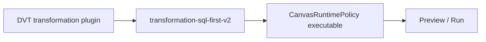
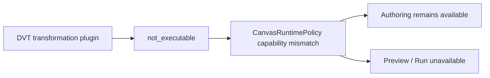

# VTX2 Web SQL-first Hard Cut Plan

## Governing sources

- `AGENTS.md`
- `docs/guides/ai-work-protocol.md`
- `docs/architecture/command-query-rail-governance.md`
- `docs/architecture/fowler-opportunity-planning-governance.md`
- `docs/adr/ADR-0064-substrait-semantic-reference-and-bounded-logical-profile.md`
- `docs/planning/proposals/mandatory/runtime-and-contracts/vtx2-substrait-semantic-reference-design-20260824.md`
- GitHub issues #2594 and #2600

## Think-first analysis

### Problem and root cause

The DVT transformation Canvas registers `transformation_preview` with the
`transformation-sql-first-v2` profile even though canonical authoring now belongs to the
pinned Substrait semantic document. Consequently the shared runtime policy advertises
Preview and Run through an execution architecture that #2600 has explicitly retired.
The root cause is stale plugin admission, not missing runtime functionality.

### Invariants

- Canonical Transform authoring and Graph Draft persistence remain available.
- DVT Preview and Run fail closed until #2524 and #2723 provide the current path.
- DBT execution strategies remain unchanged and separately governed.
- No replacement strategy, fallback, alias, compatibility flag, or local capability model is added.
- Existing `ValidateCanvasTransformationRun` readiness and runtime-policy rails are reused.
- Later VTX1/compiler/runtime deletion remains outside this first green slice.

### Options

1. **Selected: register DVT as `not_executable`.** Reuse the existing runtime-policy
   unavailable state, preserve authoring, and prove no preview/run request is possible.
2. Keep the SQL-first strategy behind a flag: rejected because it preserves dual authority.
3. Add a new Substrait strategy now: rejected because #2524/#2723 own that implementation.
4. Hide toolbar actions locally: rejected because it bypasses the shared runtime policy.

## Current and target flow





## Fowler planning matrix

| Scenario                     | Opportunity       | Pattern                      | DDD owner                       | Rail                              | Proof                         |
| ---------------------------- | ----------------- | ---------------------------- | ------------------------------- | --------------------------------- | ----------------------------- |
| DVT selects retired strategy | Duplicate meaning | Replace conditional strategy | Canvas runtime admission policy | `ValidateCanvasTransformationRun` | contribution + policy tests   |
| Toolbar exposes legacy route | Hidden authority  | Fail closed                  | Canvas execution readiness      | existing runtime policy query     | visible browser negative flow |
| DBT remains executable       | Shotgun surgery   | Preserve bounded strategy    | DBT execution projection        | existing DBT preview rails        | existing Canvas suite         |

## Pre-implementation brief

- **Mode:** Full.
- **Baseline:** `main@f36a6641ac7c4d8e2035a40b05083fc3e410f428`.
- **Scope:** only DVT plugin execution admission, its policy tests, one browser guardrail,
  and the active Web architecture statement.
- **Risk:** accidental loss of authoring; mitigate by asserting node admission and mutation
  stay enabled while Preview/Run are absent.
- **Out of scope:** deleting VTX1 authoring, compiler contracts, technical runtime steps,
  or implementing the replacement runtime.
- **Libraries:** none; the existing runtime-policy seam already models unavailable execution.
- **Microcommits:** plan; red behavior; production admission; architecture/closeout.
- **Validation:** focused Vitest, focused Cypress, Web typecheck/lint, mechanization,
  governance refresh, and `pnpm verify:prepush`.

## Feature mechanization

```feature-mechanization
version: 1
featureId: VTX2-WEB-SQL-FIRST-HARDCUT-2600
mechanizationStatus: implemented
noHumanDecisionsRemaining: true
implementationPlan: docs/planning/proposals/mandatory/frontend-and-ux/vtx2-web-sql-first-hardcut-plan-20260903.md
componentGuides:
  - docs/architecture/components/web/graph/graph-frontend-architecture.md
  - docs/architecture/components/web/graph/canvas-plan-run-readiness-component.md
governingSources:
  - AGENTS.md
  - docs/architecture/command-query-rail-governance.md
  - docs/architecture/fowler-opportunity-planning-governance.md
  - docs/adr/ADR-0064-substrait-semantic-reference-and-bounded-logical-profile.md
  - docs/planning/proposals/mandatory/runtime-and-contracts/vtx2-substrait-semantic-reference-design-20260824.md
userStories:
  - As a Canvas author, I can keep editing canonical Transform semantics without invoking the retired SQL-first execution path.
domainObjects:
  - Canvas runtime admission policy
fowlerSignals:
  - Duplicate semantics
  - Hidden authority
allowedImplementationSurfaces:
  - apps/web/src/app/plugins/dvt/dvtContributions.ts
  - apps/web/src/app/plugins/dvt/dvtContributions.architecture.test.ts
  - apps/web/src/app/views/canvas/canvasRuntimePolicy.test.ts
  - apps/web/cypress/e2e/canvas/canvas-preview-run-authoring.cy.ts
  - docs/architecture/components/web/graph/graph-frontend-architecture.md
  - docs/planning/proposals/mandatory/frontend-and-ux/vtx2-web-sql-first-hardcut-plan-20260903.md
  - docs/planning/closeouts/vtx2-web-sql-first-hardcut-2600-closeout.md
  - docs/.manifest.json
  - docs/**/index.md
forbiddenImplementationSurfaces:
  - packages/@dvt/contracts/**
  - packages/@dvt/engine/**
  - packages/@dvt/planner/**
  - packages/@dvt/adapter-*/**
  - apps/api/**
commandQueryRails:
  - name: ValidateCanvasTransformationRun
    type: query
    status: implemented
    dddOwner: Transformation graph validation
    applicationPort: Existing Canvas runtime policy
    adapterSurface: DVT Canvas plugin contribution
    authorizationScope: Current Canvas graph presentation
    negativeTests:
      - DVT transformation authoring remains available while Preview and Run are unavailable
      - no preview or run request is emitted for the unavailable DVT strategy
architectureGuards:
  - pnpm docs:feature-mechanization:implementation --feature VTX2-WEB-SQL-FIRST-HARDCUT-2600
cypressFlows:
  - apps/web/cypress/e2e/canvas/canvas-preview-run-authoring.cy.ts
completionGate:
  - pnpm --filter @dvt/web test:canvas
  - pnpm --filter @dvt/web typecheck
  - pnpm --filter @dvt/web lint
  - pnpm governance:refresh
  - pnpm verify:prepush
redGreenCycles:
  - id: dvt-execution-admission-hardcut
    redTest: apps/web/src/app/plugins/dvt/dvtContributions.architecture.test.ts
    expectedFailure: DVT still registers the retired transformation SQL-first preview strategy.
    patchSurfaces:
      - apps/web/src/app/plugins/dvt/dvtContributions.ts
    greenTest: apps/web/src/app/plugins/dvt/dvtContributions.architecture.test.ts
  - id: visible-dvt-execution-unavailable
    redTest: apps/web/cypress/e2e/canvas/canvas-preview-run-authoring.cy.ts
    expectedFailure: The transformation Canvas still exposes Preview or Run through the retired strategy.
    patchSurfaces:
      - apps/web/src/app/plugins/dvt/dvtContributions.ts
    greenTest: apps/web/cypress/e2e/canvas/canvas-preview-run-authoring.cy.ts
symbols:
  - name: dvtContributions
    path: apps/web/src/app/plugins/dvt/dvtContributions.ts
    dddOwner: Canvas runtime admission policy
    cqRails: [ValidateCanvasTransformationRun]
    fowlerSignals: [Replace Conditional with Strategy]
    architectureGuard: pnpm docs:feature-mechanization:implementation --feature VTX2-WEB-SQL-FIRST-HARDCUT-2600
    cypressCoverage: apps/web/cypress/e2e/canvas/canvas-preview-run-authoring.cy.ts
    unitTests: [apps/web/src/app/plugins/dvt/dvtContributions.architecture.test.ts]
```
