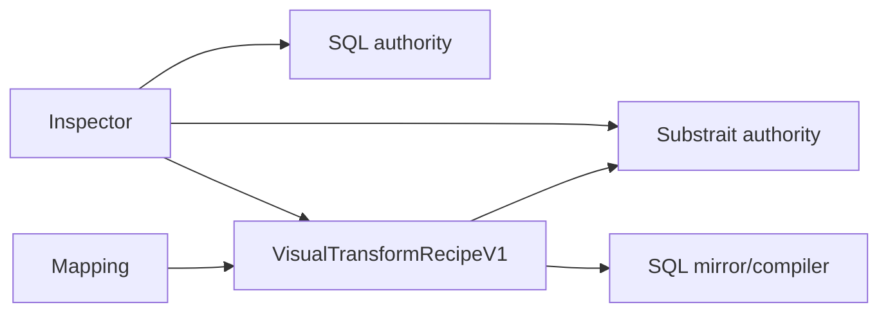
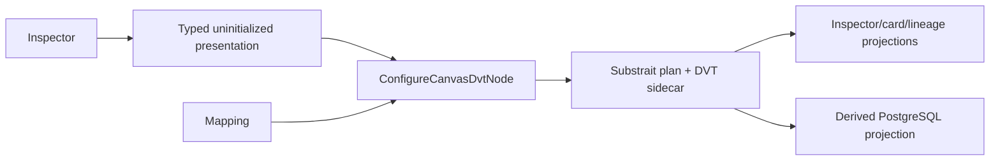

# VTX2 Web VTX1 Authoring Hard Cut Plan

## Governing sources

- `AGENTS.md`
- `docs/guides/ai-work-protocol.md`
- `docs/architecture/command-query-rail-governance.md`
- `docs/architecture/fowler-opportunity-planning-governance.md`
- `docs/adr/ADR-0035-planner-public-contract-evolution.md`
- `docs/adr/ADR-0064-substrait-semantic-reference-and-bounded-logical-profile.md`
- `docs/planning/proposals/mandatory/runtime-and-contracts/vtx2-substrait-semantic-reference-design-20260824.md`
- GitHub issues #2594 and #2600

## Think-first analysis

### Problem and root cause

The Web authoring boundary still accepts three mutually exclusive authorities:
handwritten SQL, `VisualTransformRecipeV1`, and canonical Substrait. Column mapping,
lineage, card projection, and Inspector rendering translate between them. This preserves
the VTX1 recipe as a second semantic model and lets an empty SQL draft act as an implicit
Substrait initializer. The root cause is an incomplete VTX2 hard cut, not missing authoring
capability.

### Invariants

- `DvtSubstraitSemanticDocumentV1` plus its DVT sidecar is the only persisted Transform
  semantic authority.
- A new Transform may be uninitialized in presentation state, but applying authoring
  creates canonical Substrait metadata through `ConfigureCanvasDvtNode`.
- Existing canonical projection, field-function, join, set, aggregate, window, reorder,
  output-toggle, alias, lineage, and comment behaviors remain available.
- Legacy SQL/VTX1 metadata is unsupported and fails closed; there is no migration,
  compatibility alias, feature flag, or hidden fallback.
- PostgreSQL rendering remains a derived target projection. DBT SQL quoting remains an
  unrelated utility and moves out of the deleted VTX1 compiler.
- Preview/compiler profile contracts and runtime step kinds remain for later ordered
  #2600 slices.

### Selected option

Delete the VTX1 editor, compiler, SQL mirror, recipe contract, and translation branches.
Replace the implicit empty-SQL state with a typed Web-only `uninitialized` presentation
state that can start existing canonical Substrait drafts. Rewrite column mapping directly
against the Substrait projection rather than round-tripping through a recipe-shaped DTO.

Rejected alternatives:

- retain SQL or VTX1 as read-only compatibility: rejected by #2600;
- migrate old drafts on read: rejected because it creates an undeclared compatibility rail;
- keep recipe types as private mapping DTOs: rejected because that preserves duplicate
  semantics under another name;
- implement replacement execution: owned by #2524 and #2723.

## Current and target flow





## Fowler planning matrix

| Scenario                                         | Opportunity            | Pattern                                                   | DDD owner                      | Rail                          | Proof                      |
| ------------------------------------------------ | ---------------------- | --------------------------------------------------------- | ------------------------------ | ----------------------------- | -------------------------- |
| Three persisted transform authorities            | Duplicate semantics    | Replace Type Code with one canonical value object         | `DvtNodeAuthoringMetadata`     | `ConfigureCanvasDvtNode`      | authority + contract tests |
| Mapping converts Substrait to VTX1 and back      | Middle man             | Inline/replace translation with direct canonical mutation | Substrait projection authoring | `ConfigureCanvasDvtNode`      | mapping behavior tests     |
| One 721-line VTX1 editor owns unrelated UI rules | Divergent change       | Delete obsolete component                                 | Canvas Inspector presentation  | `InspectCanvasNode`           | component absence guard    |
| DBT imports quoting from VTX1 compiler           | Inappropriate intimacy | Move function to focused SQL identifier utility           | DBT artifact projection        | existing DBT projection query | DBT artifact tests         |

## Pre-implementation brief

- **Mode:** Full; this removes a public contract and observable legacy behavior.
- **Baseline:** `main@5138e4c383fea9b0189bec109482242f1ff593aa`.
- **Scope:** Web VTX1/SQL authoring, direct canonical column mapping, dead recipe contract
  exports/tests, focused architecture docs, ARC-2 evidence and risk.
- **Risk:** accidentally making a new Transform inert. Mitigation: prove uninitialized
  presentation can create a canonical projection/join/set draft and reload it.
- **Negative paths:** legacy SQL/VTX1 metadata rejects; malformed/absent canonical metadata
  never mutates; unsupported mapping remains fail-closed.
- **Libraries/rail:** no new library; reuse `ConfigureCanvasDvtNode` and existing Substrait modules.
- **Microcommits:** plan; red behavior; contract hard cut; Web hard cut; docs/evidence.
- **Validation:** focused Contracts/Web tests, Web lint/typecheck, ARC check, governance
  refresh, and `pnpm verify:prepush`.

## Feature mechanization

```feature-mechanization
version: 1
featureId: VTX2-WEB-VTX1-AUTHORING-HARDCUT-2600
mechanizationStatus: implemented
noHumanDecisionsRemaining: true
implementationPlan: docs/planning/proposals/mandatory/frontend-and-ux/vtx2-web-vtx1-authoring-hardcut-plan-20260903.md
componentGuides:
  - docs/architecture/components/web/graph/graph-frontend-architecture.md
  - docs/architecture/components/web/graph/canvas-workbench-command-query-catalog.md
governingSources:
  - AGENTS.md
  - docs/architecture/command-query-rail-governance.md
  - docs/architecture/fowler-opportunity-planning-governance.md
  - docs/adr/ADR-0064-substrait-semantic-reference-and-bounded-logical-profile.md
  - docs/planning/proposals/mandatory/runtime-and-contracts/vtx2-substrait-semantic-reference-design-20260824.md
userStories:
  - As a Canvas author, I edit and inspect one canonical Substrait Transform authority without SQL or VTX1 fallback.
domainObjects:
  - DvtNodeAuthoringMetadata
  - DvtSubstraitSemanticDocumentV1
fowlerSignals:
  - Duplicate semantics
  - Middle man
  - Divergent change
allowedImplementationSurfaces:
  - apps/web/src/app/views/canvas/**
  - apps/web/src/app/views/Canvas.test.controller.defaults.ts
  - apps/web/src/app/views/artifacts/artifactsMonacoReadonlyViewer.architecture.test.ts
  - apps/web/src/app/views/templates/templatesMonacoPreview.architecture.test.ts
  - packages/@dvt/contracts/src/contracts/planner/VisualTransformRecipe.v1.ts
  - packages/@dvt/contracts/src/contracts/planner/DvtTransformAuthoringAuthority.v1.ts
  - packages/@dvt/contracts/src/index.ts
  - packages/@dvt/contracts/test/**
  - docs/architecture/components/web/graph/**
  - docs/architecture/system/subsystems/semantic-transformation/index.md
  - docs/contracts/planner/index.md
  - docs/evidence/**
  - docs/risk-register/quality/**
  - docs/planning/proposals/mandatory/frontend-and-ux/vtx2-web-vtx1-authoring-hardcut-plan-20260903.md
  - docs/planning/closeouts/**
  - docs/.manifest.json
  - docs/**/index.md
forbiddenImplementationSurfaces:
  - apps/api/**
  - packages/@dvt/engine/**
  - packages/@dvt/planner/**
  - packages/@dvt/adapter-*/**
commandQueryRails:
  - name: ConfigureCanvasDvtNode
    type: command
    status: implemented
    dddOwner: DvtNodeAuthoringMetadata
    applicationPort: Existing Canvas graph authoring handlers
    adapterSurface: Canvas Inspector and field gestures
    authorizationScope: Active editable workspace graph draft
    negativeTests:
      - legacy SQL and VisualTransformRecipeV1 metadata reject without mutation
      - malformed or absent source provenance cannot create canonical semantics
architectureGuards:
  - pnpm docs:feature-mechanization:implementation --feature VTX2-WEB-VTX1-AUTHORING-HARDCUT-2600
cypressFlows:
  - apps/web/cypress/e2e/canvas/canvas-preview-run-authoring.cy.ts
completionGate:
  - pnpm --filter @dvt/contracts test
  - pnpm --filter @dvt/web test:canvas
  - pnpm --filter @dvt/web typecheck
  - pnpm --filter @dvt/web lint
  - pnpm governance:refresh
  - pnpm verify:prepush
redGreenCycles:
  - id: vtx1-authority-absence
    redTest: apps/web/src/app/views/canvas/canvasAuthoringProjection.architecture.test.ts
    expectedFailure: Web production still imports or exposes VTX1 recipe, SQL mirror, and compiler authorities.
    patchSurfaces:
      - apps/web/src/app/views/canvas/**
      - packages/@dvt/contracts/src/**
    greenTest: apps/web/src/app/views/canvas/canvasAuthoringProjection.architecture.test.ts
  - id: canonical-transform-initialization
    redTest: apps/web/src/app/views/canvas/DvtAuthoringFields.test.tsx
    expectedFailure: A new Transform depends on an empty SQL draft to start canonical Substrait authoring.
    patchSurfaces:
      - apps/web/src/app/views/canvas/DvtAuthoringFields.tsx
      - apps/web/src/app/views/canvas/canvasDvtAuthoringModel.ts
    greenTest: apps/web/src/app/views/canvas/DvtAuthoringFields.test.tsx
symbols:
  - &vtx2Symbol
    name: readDvtTransformAuthoringAuthority
    path: apps/web/src/app/views/canvas/canvasDvtTransformAuthoringAuthority.ts
    dddOwner: DvtNodeAuthoringMetadata
    cqRails: [ConfigureCanvasDvtNode]
    fowlerSignals: [Replace Type Code with one canonical value object]
    architectureGuard: pnpm docs:feature-mechanization:implementation --feature VTX2-WEB-VTX1-AUTHORING-HARDCUT-2600
    cypressCoverage: apps/web/cypress/e2e/canvas/canvas-preview-run-authoring.cy.ts
    unitTests: [apps/web/src/app/views/canvas/canvasDvtTransformAuthoringAuthority.test.ts]
  - { <<: *vtx2Symbol, name: DvtSubstraitTransformStart, path: apps/web/src/app/views/canvas/DvtSubstraitTransformStart.tsx }
  - { <<: *vtx2Symbol, name: areCanvasColumnTypesCompatible, path: apps/web/src/app/views/canvas/canvasColumnAutomap.ts }
  - { <<: *vtx2Symbol, name: automapCanvasColumns, path: apps/web/src/app/views/canvas/canvasColumnAutomap.ts }
  - { <<: *vtx2Symbol, name: normalizeKnownType, path: apps/web/src/app/views/canvas/canvasColumnAutomap.ts }
  - { <<: *vtx2Symbol, name: CanvasColumn, path: apps/web/src/app/views/canvas/canvasColumnMappingModel.ts }
  - { <<: *vtx2Symbol, name: CanvasColumnAutomapResult, path: apps/web/src/app/views/canvas/canvasColumnMappingModel.ts }
  - { <<: *vtx2Symbol, name: CanvasColumnMappingRejection, path: apps/web/src/app/views/canvas/canvasColumnMappingModel.ts }
  - { <<: *vtx2Symbol, name: CanvasColumnMappingResult, path: apps/web/src/app/views/canvas/canvasColumnMappingModel.ts }
  - { <<: *vtx2Symbol, name: CanvasColumnMappingSource, path: apps/web/src/app/views/canvas/canvasColumnMappingModel.ts }
  - { <<: *vtx2Symbol, name: CanvasColumnMappingTarget, path: apps/web/src/app/views/canvas/canvasColumnMappingModel.ts }
  - { <<: *vtx2Symbol, name: createCanvasColumnOutputId, path: apps/web/src/app/views/canvas/canvasColumnMappingModel.ts }
  - { <<: *vtx2Symbol, name: hasCanvasStageDependency, path: apps/web/src/app/views/canvas/canvasColumnMappingModel.ts }
  - { <<: *vtx2Symbol, name: isRecord, path: apps/web/src/app/views/canvas/canvasColumnMappingModel.ts }
  - { <<: *vtx2Symbol, name: readCanvasNodeColumns, path: apps/web/src/app/views/canvas/canvasColumnMappingModel.ts }
  - { <<: *vtx2Symbol, name: readNonblankString, path: apps/web/src/app/views/canvas/canvasColumnMappingModel.ts }
  - { <<: *vtx2Symbol, name: resolveCanvasSessionNode, path: apps/web/src/app/views/canvas/canvasColumnMappingModel.ts }
  - { <<: *vtx2Symbol, name: reorderCanvasColumnOutput, path: apps/web/src/app/views/canvas/canvasColumnOutputAuthoring.ts }
  - { <<: *vtx2Symbol, name: setCanvasColumnOutputIncluded, path: apps/web/src/app/views/canvas/canvasColumnOutputAuthoring.ts }
  - { <<: *vtx2Symbol, name: EditableCanvasProjection, path: apps/web/src/app/views/canvas/canvasColumnProjectionAuthority.ts }
  - { <<: *vtx2Symbol, name: canAuthorCanvasColumnMappings, path: apps/web/src/app/views/canvas/canvasColumnProjectionAuthority.ts }
  - { <<: *vtx2Symbol, name: copyOutputDescriptions, path: apps/web/src/app/views/canvas/canvasColumnProjectionAuthority.ts }
  - { <<: *vtx2Symbol, name: isSimpleCanvasPassthrough, path: apps/web/src/app/views/canvas/canvasColumnProjectionAuthority.ts }
  - { <<: *vtx2Symbol, name: persistCanvasProjectionOutputs, path: apps/web/src/app/views/canvas/canvasColumnProjectionAuthority.ts }
  - { <<: *vtx2Symbol, name: readEditableCanvasProjection, path: apps/web/src/app/views/canvas/canvasColumnProjectionAuthority.ts }
  - { <<: *vtx2Symbol, name: resolveCanvasColumnMappingTarget, path: apps/web/src/app/views/canvas/canvasColumnProjectionAuthority.ts }
  - { <<: *vtx2Symbol, name: DvtNodeAuthoringMetadata, path: apps/web/src/app/views/canvas/canvasDvtAuthoringTypes.ts }
  - { <<: *vtx2Symbol, name: DvtNodeAuthoringMetadataErrors, path: apps/web/src/app/views/canvas/canvasDvtAuthoringTypes.ts }
  - { <<: *vtx2Symbol, name: DvtSinkAuthoringMetadata, path: apps/web/src/app/views/canvas/canvasDvtAuthoringTypes.ts }
  - { <<: *vtx2Symbol, name: DvtSourceAuthoringMetadata, path: apps/web/src/app/views/canvas/canvasDvtAuthoringTypes.ts }
  - { <<: *vtx2Symbol, name: DvtSubstraitTransformAuthoringMetadata, path: apps/web/src/app/views/canvas/canvasDvtAuthoringTypes.ts }
  - { <<: *vtx2Symbol, name: DvtUninitializedTransformAuthoringMetadata, path: apps/web/src/app/views/canvas/canvasDvtAuthoringTypes.ts }
  - { <<: *vtx2Symbol, name: DEFAULT_MATERIALIZATION, path: apps/web/src/app/views/canvas/canvasDvtSinkAuthoring.ts }
  - { <<: *vtx2Symbol, name: DEFAULT_SCHEMA_NAME, path: apps/web/src/app/views/canvas/canvasDvtSinkAuthoring.ts }
  - { <<: *vtx2Symbol, name: DEFAULT_WRITE_MODE, path: apps/web/src/app/views/canvas/canvasDvtSinkAuthoring.ts }
  - { <<: *vtx2Symbol, name: VALID_MATERIALIZATIONS, path: apps/web/src/app/views/canvas/canvasDvtSinkAuthoring.ts }
  - { <<: *vtx2Symbol, name: VALID_WRITE_MODES, path: apps/web/src/app/views/canvas/canvasDvtSinkAuthoring.ts }
  - { <<: *vtx2Symbol, name: applyDvtSinkAuthoringMetadata, path: apps/web/src/app/views/canvas/canvasDvtSinkAuthoring.ts }
  - { <<: *vtx2Symbol, name: createDvtSinkAuthoringMetadata, path: apps/web/src/app/views/canvas/canvasDvtSinkAuthoring.ts }
  - { <<: *vtx2Symbol, name: normalizeEnum, path: apps/web/src/app/views/canvas/canvasDvtSinkAuthoring.ts }
  - { <<: *vtx2Symbol, name: validateDvtSinkAuthoringMetadata, path: apps/web/src/app/views/canvas/canvasDvtSinkAuthoring.ts }
  - { <<: *vtx2Symbol, name: DEFAULT_SCHEMA_NAME, path: apps/web/src/app/views/canvas/canvasDvtSourceAuthoring.ts }
  - { <<: *vtx2Symbol, name: DVT_AUTHORING_PLUGIN_ID, path: apps/web/src/app/views/canvas/canvasDvtSourceAuthoring.ts }
  - { <<: *vtx2Symbol, name: DVT_WAREHOUSE_SOURCE_PLUGIN_ID, path: apps/web/src/app/views/canvas/canvasDvtSourceAuthoring.ts }
  - { <<: *vtx2Symbol, name: applyDvtSourceAuthoringMetadata, path: apps/web/src/app/views/canvas/canvasDvtSourceAuthoring.ts }
  - { <<: *vtx2Symbol, name: createDvtSourceAuthoringMetadata, path: apps/web/src/app/views/canvas/canvasDvtSourceAuthoring.ts }
  - { <<: *vtx2Symbol, name: isRecord, path: apps/web/src/app/views/canvas/canvasDvtSourceAuthoring.ts }
  - { <<: *vtx2Symbol, name: normalizeDvtIdentifier, path: apps/web/src/app/views/canvas/canvasDvtSourceAuthoring.ts }
  - { <<: *vtx2Symbol, name: parseConnectionRef, path: apps/web/src/app/views/canvas/canvasDvtSourceAuthoring.ts }
  - { <<: *vtx2Symbol, name: parseImportedConnectionRef, path: apps/web/src/app/views/canvas/canvasDvtSourceAuthoring.ts }
  - { <<: *vtx2Symbol, name: readDvtNodeConfig, path: apps/web/src/app/views/canvas/canvasDvtSourceAuthoring.ts }
  - { <<: *vtx2Symbol, name: readDvtString, path: apps/web/src/app/views/canvas/canvasDvtSourceAuthoring.ts }
  - { <<: *vtx2Symbol, name: resolveEffectiveDvtConnectionRef, path: apps/web/src/app/views/canvas/canvasDvtSourceAuthoring.ts }
  - { <<: *vtx2Symbol, name: resolveInheritedDvtConnectionRef, path: apps/web/src/app/views/canvas/canvasDvtSourceAuthoring.ts }
  - { <<: *vtx2Symbol, name: validateDvtSourceAuthoringMetadata, path: apps/web/src/app/views/canvas/canvasDvtSourceAuthoring.ts }
  - { <<: *vtx2Symbol, name: withDvtConfig, path: apps/web/src/app/views/canvas/canvasDvtSourceAuthoring.ts }
  - { <<: *vtx2Symbol, name: TransformMetadata, path: apps/web/src/app/views/canvas/canvasDvtTransformAuthoring.ts }
  - { <<: *vtx2Symbol, name: applyDvtTransformAuthoringMetadata, path: apps/web/src/app/views/canvas/canvasDvtTransformAuthoring.ts }
  - { <<: *vtx2Symbol, name: createDvtTransformAuthoringMetadata, path: apps/web/src/app/views/canvas/canvasDvtTransformAuthoring.ts }
  - { <<: *vtx2Symbol, name: fromDraft, path: apps/web/src/app/views/canvas/canvasDvtTransformAuthoring.ts }
  - { <<: *vtx2Symbol, name: RETIRED_LINEAGE_PROVENANCE_METADATA_KEY, path: apps/web/src/app/views/canvas/canvasDvtTransformAuthoringAuthority.ts }
  - { <<: *vtx2Symbol, name: DvtTransformAuthoringAuthority, path: apps/web/src/app/views/canvas/canvasDvtTransformAuthoringAuthority.ts }
  - { <<: *vtx2Symbol, name: hasRetiredSqlMetadata, path: apps/web/src/app/views/canvas/canvasDvtTransformAuthoringAuthority.ts }
  - { <<: *vtx2Symbol, name: removeRetiredAuthorityMetadata, path: apps/web/src/app/views/canvas/canvasDvtTransformAuthoringAuthority.ts }
  - { <<: *vtx2Symbol, name: quoteSqlIdentifier, path: apps/web/src/app/views/canvas/canvasSqlIdentifier.ts }
  - { <<: *vtx2Symbol, name: DVT_TRANSFORM_AUTHORING_AUTHORITY_VERSION, path: packages/@dvt/contracts/src/contracts/planner/DvtTransformAuthoringAuthority.v1.ts }
  - { <<: *vtx2Symbol, name: DVT_TRANSFORM_AUTHORING_MODE, path: packages/@dvt/contracts/src/contracts/planner/DvtTransformAuthoringAuthority.v1.ts }
  - { <<: *vtx2Symbol, name: DvtTransformAuthoringAuthorityV1, path: packages/@dvt/contracts/src/contracts/planner/DvtTransformAuthoringAuthority.v1.ts }
  - { <<: *vtx2Symbol, name: DvtTransformAuthoringAuthorityV1Schema, path: packages/@dvt/contracts/src/contracts/planner/DvtTransformAuthoringAuthority.v1.ts }
```
