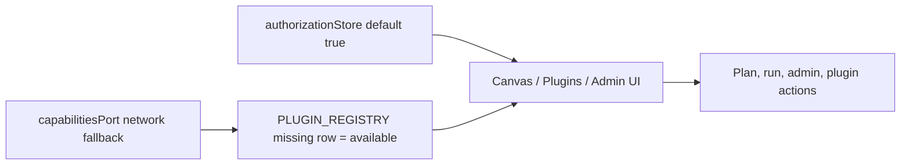
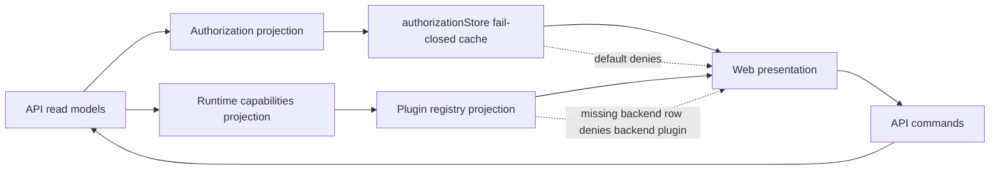

# Web API Authorization And Capability Authority Hardcut Implementation Plan

> **For agentic workers:** REQUIRED SUB-SKILL: Use
> superpowers:test-driven-development to implement this plan task-by-task. Steps
> use checkbox (`- [ ]`) syntax for tracking.

**Goal:** Make web authorization and backend capability readiness fail closed
unless server-projected read models explicitly grant them.

**Architecture:** Apply Fowler Replace Implicit Authority With Explicit
Projection. The browser keeps presentation state, but executable decisions flow
from API-owned authorization and capability projections. Static plugin
contributions remain composition data, not execution authority.

**Tech Stack:** React, TypeScript, Zustand, Vitest, Mermaid, repository feature
mechanization.

---

## Governing Sources

- `AGENTS.md`
- `docs/planning/status/governance-document-rule-inventory.md`
- `docs/guides/ai-work-protocol.md`
- `docs/architecture/command-query-rail-governance.md`
- `docs/architecture/fowler-opportunity-planning-governance.md`
- `docs/adr/ADR-0051-access-decision-service-and-openfga-adapter.md`
- `docs/adr/ADR-0055-server-owned-effective-workspace-context.md`
- `docs/adr/ADR-0056-web-ui-authority-is-server-projected.md`
- `docs/planning/reviews/20260510-web-api-integration-gap-review.md`

## Command / Query Rail Posture

This slice does not add backend routes. It hardens web interpretation of
existing query rails:

| Rail                                | Type    | Owner                               | Web rule                                                                                                               |
| ----------------------------------- | ------- | ----------------------------------- | ---------------------------------------------------------------------------------------------------------------------- |
| `GetRuntimeSession`                 | Query   | Runtime session admission           | May identify the principal; does not grant workspace or command authority by itself.                                   |
| `GetEffectiveWorkspaceContext`      | Query   | Protected runtime workspace context | Provides workspace scope projection before protected route rendering.                                                  |
| `GetRuntimeCapabilities`            | Query   | Runtime capability projection       | Backend-backed plugin readiness requires an explicit available row.                                                    |
| `ObserveAppBootstrapRouteReadiness` | Query   | Web shell / app bootstrap           | Static route registration may exist for guarded direct links, but runtime navigation availability is server-projected. |
| `StartRun`                          | Command | Protected runtime run start         | Browser permission defaults cannot authorize this command.                                                             |
| `PreviewExecutablePlan`             | Command | Protected runtime plan preview      | Browser permission defaults cannot authorize this command.                                                             |

## Current Drift



## Target Shape



## Feature Mechanization

```feature-mechanization
version: 1
featureId: WEB-API-AUTHORITY-HARDCUT-20260510
mechanizationStatus: implemented
noHumanDecisionsRemaining: true
implementationPlan: docs/planning/proposals/mandatory/frontend-and-ux/web-api-authority-hardcut-plan-20260510.md
componentGuides:
  - docs/architecture/components/web/workspace/web-api-authority-hardcut-component.md
  - docs/architecture/components/web/workspace/web-api-authority-hardcut-user-stories.md
  - docs/planning/reviews/20260510-web-api-integration-gap-review.md
userStories:
  - docs/architecture/components/web/workspace/web-api-authority-hardcut-user-stories.md
governingSources:
  - AGENTS.md
  - docs/planning/status/governance-document-rule-inventory.md
  - docs/guides/ai-work-protocol.md
  - docs/architecture/command-query-rail-governance.md
  - docs/architecture/fowler-opportunity-planning-governance.md
  - docs/adr/ADR-0051-access-decision-service-and-openfga-adapter.md
  - docs/adr/ADR-0055-server-owned-effective-workspace-context.md
  - docs/adr/ADR-0056-web-ui-authority-is-server-projected.md
  - docs/planning/reviews/20260510-web-api-integration-gap-review.md
allowedImplementationSurfaces:
  - buzon/**
  - docs/adr/**
  - docs/architecture/components/web/workspace/web-api-authority-hardcut-component.md
  - docs/architecture/components/web/workspace/web-api-authority-hardcut-user-stories.md
  - docs/planning/proposals/mandatory/frontend-and-ux/web-api-authority-hardcut-plan-20260510.md
  - docs/planning/reviews/20260510-web-api-integration-gap-review.md
  - docs/planning/status/**
  - docs/.manifest.json
  - docs/**/index.md
  - traceability.config.json
  - apps/web/src/app/stores/authorizationStore.ts
  - apps/web/src/app/stores/authorizationStore.test.ts
  - apps/web/src/app/stores/webStoreDomainOwnership.architecture.test.ts
  - apps/web/src/app/services/capabilities/capabilitiesPort.ts
  - apps/web/src/app/services/composition/appServices.test.ts
  - apps/web/src/app/services/composition/appServicesAuthorityHardcut.architecture.test.ts
  - apps/web/src/app/plugins/registry.ts
  - apps/web/src/app/plugins/registry.test.ts
  - apps/web/src/app/plugins/pluginRuntimeProjection.architecture.test.ts
  - apps/web/src/app/Root.shellChrome.test.support.ts
  - apps/web/src/app/views/PluginsView.tsx
  - apps/web/src/app/views/PluginsView.test.tsx
forbiddenImplementationSurfaces:
  - apps/api/**
  - packages/**
  - specs/contracts/**
  - docs/archive/**
commandQueryRails:
  - name: GetRuntimeSession
    type: query
    dddOwner: Runtime session admission
  - name: GetEffectiveWorkspaceContext
    type: query
    dddOwner: Protected runtime workspace context
  - name: GetRuntimeCapabilities
    type: query
    dddOwner: Runtime capability projection
  - name: ObserveAppBootstrapRouteReadiness
    type: query
    dddOwner: Web shell / app bootstrap
  - name: PreviewExecutablePlan
    type: command
    dddOwner: Plan preview application service
  - name: StartRun
    type: command
    dddOwner: Run start application service
domainObjects:
  - name: UserPermissions
    type: server-projected read model cache
    owner: Web authorization projection
  - name: RuntimeCapabilitiesDto
    type: server-projected read model
    owner: Web runtime capabilities projection
  - name: PluginContributions
    type: static composition declaration
    owner: Web plugin composition
fowlerSignals:
  - Hidden Authority in optimistic browser permissions
  - Parallel Model between static plugin declarations and backend readiness
  - Primitive Obsession around frontend-local capabilities
  - Fail Open default on missing backend plugin capability rows
architectureGuards:
  - pnpm --filter @dvt/web exec vitest run src/app/services/composition/appServicesAuthorityHardcut.architecture.test.ts
  - pnpm --filter @dvt/web exec vitest run src/app/stores/webStoreDomainOwnership.architecture.test.ts
cypressFlows:
  - N/A - authority projection and registry boundary only
completionGate:
  - pnpm docs:sync
  - pnpm docs:status:generate
  - pnpm --filter @dvt/web exec vitest run src/app/stores/authorizationStore.test.ts src/app/plugins/registry.test.ts src/app/services/composition/appServices.test.ts src/app/services/composition/appServicesAuthorityHardcut.architecture.test.ts src/app/views/PluginsView.test.tsx
  - pnpm --filter @dvt/web typecheck
  - pnpm docs:feature-mechanization:implementation
  - pnpm verify:prepush
redGreenCycles:
  - id: authorization-default-deny
    redTest: pnpm --filter @dvt/web exec vitest run src/app/stores/authorizationStore.test.ts
    expectedFailure: DEFAULT_USER_PERMISSIONS still grants plan, run, edge edit, plugin, and RBAC permissions.
    patchSurfaces:
      - apps/web/src/app/stores/authorizationStore.test.ts
      - apps/web/src/app/stores/authorizationStore.ts
    greenTest: pnpm --filter @dvt/web exec vitest run src/app/stores/authorizationStore.test.ts
  - id: capabilities-network-fails-closed
    redTest: pnpm --filter @dvt/web exec vitest run src/app/services/composition/appServices.test.ts
    expectedFailure: createCapabilitiesPort still returns frontend-local capabilities on network failure.
    patchSurfaces:
      - apps/web/src/app/services/composition/appServices.test.ts
      - apps/web/src/app/services/capabilities/capabilitiesPort.ts
    greenTest: pnpm --filter @dvt/web exec vitest run src/app/services/composition/appServices.test.ts
  - id: backend-plugin-row-required
    redTest: pnpm --filter @dvt/web exec vitest run src/app/plugins/registry.test.ts src/app/views/PluginsView.test.tsx
    expectedFailure: backend-backed plugin surfaces are still projected when capabilities are absent or missing the backend plugin row.
    patchSurfaces:
      - apps/web/src/app/plugins/registry.test.ts
      - apps/web/src/app/plugins/registry.ts
      - apps/web/src/app/views/PluginsView.test.tsx
      - apps/web/src/app/views/PluginsView.tsx
    greenTest: pnpm --filter @dvt/web exec vitest run src/app/plugins/registry.test.ts src/app/views/PluginsView.test.tsx
  - id: semantic-authority-guard
    redTest: pnpm --filter @dvt/web exec vitest run src/app/services/composition/appServicesAuthorityHardcut.architecture.test.ts
    expectedFailure: no architecture guard yet proves the UI authority boundary is semantic and documented.
    patchSurfaces:
      - apps/web/src/app/services/composition/appServicesAuthorityHardcut.architecture.test.ts
      - docs/architecture/components/web/workspace/web-api-authority-hardcut-component.md
      - docs/architecture/components/web/workspace/web-api-authority-hardcut-user-stories.md
      - buzon/20260510-codex-fowler-web-api-authority-hardcut-analysis.md
    greenTest: pnpm --filter @dvt/web exec vitest run src/app/services/composition/appServicesAuthorityHardcut.architecture.test.ts
symbols:
  - name: DEFAULT_USER_PERMISSIONS
    path: apps/web/src/app/stores/authorizationStore.ts
    dddOwner: Web authorization projection
    cqRails:
      - GetRuntimeSession
      - GetEffectiveWorkspaceContext
    fowlerSignals:
      - Fail closed default replaces Hidden Authority
    architectureGuard: pnpm --filter @dvt/web exec vitest run src/app/services/composition/appServicesAuthorityHardcut.architecture.test.ts
    cypressCoverage: N/A
    unitTests:
      - apps/web/src/app/stores/authorizationStore.test.ts
  - name: createCapabilitiesPort
    path: apps/web/src/app/services/capabilities/capabilitiesPort.ts
    dddOwner: Web runtime capabilities projection
    cqRails:
      - GetRuntimeCapabilities
    fowlerSignals:
      - Backend capability query failure remains explicit
    architectureGuard: pnpm --filter @dvt/web exec vitest run src/app/services/composition/appServicesAuthorityHardcut.architecture.test.ts
    cypressCoverage: N/A
    unitTests:
      - apps/web/src/app/services/composition/appServices.test.ts
  - name: getRuntimePlugins
    path: apps/web/src/app/plugins/registry.ts
    dddOwner: Web plugin composition projection
    cqRails:
      - GetRuntimeCapabilities
    fowlerSignals:
      - Missing backend plugin row fails closed
    architectureGuard: pnpm --filter @dvt/web exec vitest run src/app/services/composition/appServicesAuthorityHardcut.architecture.test.ts
    cypressCoverage: N/A
    unitTests:
      - apps/web/src/app/plugins/registry.test.ts
  - name: getRouteViews
    path: apps/web/src/app/plugins/registry.ts
    dddOwner: Web plugin static route projection
    cqRails:
      - ObserveAppBootstrapRouteReadiness
      - GetRuntimeCapabilities
    fowlerSignals:
      - Separates static route composition from backend-backed runtime
        availability
    architectureGuard: pnpm --filter @dvt/web exec vitest run src/app/plugins/pluginRuntimeProjection.architecture.test.ts src/app/services/composition/appServicesAuthorityHardcut.architecture.test.ts
    cypressCoverage: N/A
    unitTests:
      - apps/web/src/app/plugins/pluginRuntimeProjection.architecture.test.ts
  - name: buildRuntimeCapabilities
    path: apps/web/src/app/plugins/registry.test.ts
    dddOwner: Web plugin composition projection tests
    cqRails:
      - GetRuntimeCapabilities
    fowlerSignals:
      - Keeps capability negative cases explicit in the registry unit tests
    architectureGuard: pnpm --filter @dvt/web exec vitest run src/app/plugins/registry.test.ts
    cypressCoverage: N/A
    unitTests:
      - apps/web/src/app/plugins/registry.test.ts
  - name: requiresBackendCapability
    path: apps/web/src/app/plugins/registry.ts
    dddOwner: Web plugin composition projection
    cqRails:
      - GetRuntimeCapabilities
    fowlerSignals:
      - Encapsulates the backend-authority requirement instead of repeating
        string checks across plugin projection paths
    architectureGuard: pnpm --filter @dvt/web exec vitest run src/app/services/composition/appServicesAuthorityHardcut.architecture.test.ts
    cypressCoverage: N/A
    unitTests:
      - apps/web/src/app/plugins/registry.test.ts
  - name: REPO_ROOT
    path: apps/web/src/app/services/composition/appServicesAuthorityHardcut.architecture.test.ts
    dddOwner: Web authority architecture guard
    cqRails:
      - GetRuntimeSession
      - GetRuntimeCapabilities
    fowlerSignals:
      - Keeps the semantic guard anchored at repository root instead of
        duplicating path assumptions per assertion
    architectureGuard: pnpm --filter @dvt/web exec vitest run src/app/services/composition/appServicesAuthorityHardcut.architecture.test.ts
    cypressCoverage: N/A
    unitTests:
      - apps/web/src/app/services/composition/appServicesAuthorityHardcut.architecture.test.ts
  - name: REQUIRED_DOCS
    path: apps/web/src/app/services/composition/appServicesAuthorityHardcut.architecture.test.ts
    dddOwner: Web authority architecture guard
    cqRails:
      - GetRuntimeSession
      - GetRuntimeCapabilities
    fowlerSignals:
      - Validates documentation completeness as a semantic invariant of the
        hardcut
    architectureGuard: pnpm --filter @dvt/web exec vitest run src/app/services/composition/appServicesAuthorityHardcut.architecture.test.ts
    cypressCoverage: N/A
    unitTests:
      - apps/web/src/app/services/composition/appServicesAuthorityHardcut.architecture.test.ts
  - name: readRepoFile
    path: apps/web/src/app/services/composition/appServicesAuthorityHardcut.architecture.test.ts
    dddOwner: Web authority architecture guard
    cqRails:
      - GetRuntimeSession
      - GetRuntimeCapabilities
    fowlerSignals:
      - Centralizes repository-file reads for semantic assertions
    architectureGuard: pnpm --filter @dvt/web exec vitest run src/app/services/composition/appServicesAuthorityHardcut.architecture.test.ts
    cypressCoverage: N/A
    unitTests:
      - apps/web/src/app/services/composition/appServicesAuthorityHardcut.architecture.test.ts
```

## Implementation Steps

- [x] Write the failing authorization default test in
      `authorizationStore.test.ts`.
- [x] Run the authorization test and verify it fails because defaults are
      permissive.
- [x] Change `DEFAULT_USER_PERMISSIONS` to deny every command capability.
- [x] Run the authorization test and verify it passes.
- [x] Write the failing capabilities-port test that expects network failures to
      reject instead of returning `frontend-local`.
- [x] Run the capabilities test and verify it fails because the fallback still
      resolves.
- [x] Remove the network fallback from `createCapabilitiesPort`.
- [x] Run the capabilities test and verify it passes.
- [x] Write failing plugin registry and plugin view tests that require backend
      plugin rows for backend-backed plugins.
- [x] Run the plugin tests and verify they fail because missing backend rows are
      projected as available.
- [x] Change registry projection so backend-backed plugins require explicit
      available backend capability rows.
- [x] Run plugin tests and verify they pass.
- [x] Add a semantic architecture test for authority hardcut docs, docblocks,
      and forbidden fail-open vocabulary.
- [x] Run the architecture test red, implement the guard content, then run it
      green.
- [x] Run closeout validation commands in the completion gate.
