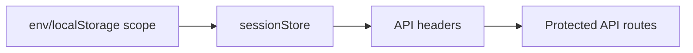
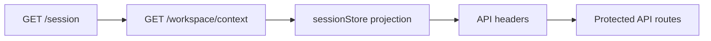

# Web API Effective Workspace Context Remediation Plan

> **For agentic workers:** REQUIRED SUB-SKILL: Use
> superpowers:test-driven-development for code steps. Steps use checkbox
> (`- [ ]`) syntax for tracking.

**Goal:** Make protected web API mode consume a backend-owned effective
workspace context instead of treating local env/localStorage scope as product
authority.

**Architecture:** Keep `GET /session` as authentication/profile only. Add a
separate `GetEffectiveWorkspaceContext` query rail and route. The protected web
route gate resolves session, then workspace context, then applies the granted
context to `sessionStore` before rendering.

**Tech Stack:** Fastify route handlers, TypeScript application ports, pg-backed
grant read model, React route gate, Vitest, Mermaid documentation.

---

## Governing Sources

- `AGENTS.md`
- `docs/planning/status/governance-document-rule-inventory.md`
- `docs/guides/ai-work-protocol.md`
- `docs/architecture/command-query-rail-governance.md`
- `docs/architecture/fowler-opportunity-planning-governance.md`
- `docs/planning/reviews/20260510-web-api-integration-gap-review.md`
- `docs/adr/ADR-0055-server-owned-effective-workspace-context.md`
- `docs/architecture/components/web/appshell/effective-workspace-context-component.md`

## Command / Query Rail

| Field                   | Value                                                                        |
| ----------------------- | ---------------------------------------------------------------------------- |
| Rail                    | `GetEffectiveWorkspaceContext`                                               |
| Type                    | query                                                                        |
| Bounded context         | Protected runtime workspace context                                          |
| DDD object              | `EffectiveWorkspaceContext` read model                                       |
| Application port        | `IWorkspaceContextQuery`                                                     |
| Adapter surface         | `GET /workspace/context`                                                     |
| Scope and authorization | authenticated principal plus backend grant store                             |
| Negative tests          | missing token, no workspace grants, session endpoint must not return context |

## Current And Target Shape





## Feature Mechanization

```feature-mechanization
version: 1
featureId: WEB-API-EFFECTIVE-WORKSPACE-CONTEXT-20260510
mechanizationStatus: implemented
noHumanDecisionsRemaining: true
implementationPlan: docs/planning/proposals/mandatory/frontend-and-ux/web-api-effective-workspace-context-remediation-plan-20260510.md
componentGuides:
  - docs/architecture/components/web/appshell/effective-workspace-context-component.md
  - docs/architecture/components/web/appshell/effective-workspace-context-user-stories.md
  - docs/planning/reviews/20260510-web-api-integration-gap-review.md
userStories:
  - docs/architecture/components/web/appshell/effective-workspace-context-user-stories.md
governingSources:
  - AGENTS.md
  - docs/planning/status/governance-document-rule-inventory.md
  - docs/guides/ai-work-protocol.md
  - docs/architecture/command-query-rail-governance.md
  - docs/architecture/fowler-opportunity-planning-governance.md
  - docs/adr/ADR-0055-server-owned-effective-workspace-context.md
allowedImplementationSurfaces:
  - buzon/20260510-web-api-remediation-execution-log.md
  - buzon/20260510-codex-fowler-web-api-remediation-analysis.md
  - docs/adr/ADR-0055-server-owned-effective-workspace-context.md
  - docs/evidence/ed-20260510-web-api-effective-workspace-context.md
  - docs/risk-register/quality/r-20260510-web-api-ewc.yaml
  - docs/architecture/components/web/appshell/effective-workspace-context-component.md
  - docs/architecture/components/web/appshell/effective-workspace-context-user-stories.md
  - docs/planning/proposals/mandatory/frontend-and-ux/web-api-effective-workspace-context-remediation-plan-20260510.md
  - docs/planning/reviews/20260510-web-api-integration-gap-review.md
  - apps/api/src/application/ports/workspaceContext.ts
  - apps/api/src/infrastructure/auth/embeddedWorkspaceContextQuery.ts
  - apps/api/src/entrypoints/http/authHeaders.ts
  - apps/api/src/entrypoints/http/workspaceContextRoute.ts
  - apps/api/src/entrypoints/http/sessionRoute.ts
  - apps/api/src/entrypoints/http/protectedRuntimeWorkspaceContextRouteGroup.ts
  - apps/api/src/entrypoints/http/registerProtectedRuntimeRoutes.ts
  - apps/api/src/entrypoints/http/runtimeRoutes.constants.ts
  - apps/api/src/modules/protectedRuntime/buildProtectedSecurityRuntime.ts
  - apps/api/src/modules/buildProtectedRuntimeModule.ts
  - apps/api/src/modules/types.ts
  - apps/api/src/application/ports/protectedRuntimeRailVocabulary.ts
  - apps/api/src/application/ports/protectedRuntimeWorkspaceCommandQueryRails.ts
  - apps/api/test/entrypoints/http/workspaceContextRoute.test.ts
  - apps/api/test/infrastructure/auth/embeddedWorkspaceContextQuery.test.ts
  - apps/api/test/entrypoints/http/registerProtectedRuntimeRoutes.test.ts
  - apps/api/test/entrypoints/http/protectedRuntimeRouteGroup.architecture.test.ts
  - apps/api/test/modules/registerOperationalHooks.cases.ts
  - apps/web/src/app/services/session/protectedRouteSessionContext.ts
  - apps/web/src/app/services/session/protectedRouteSessionContext.test.ts
  - apps/web/src/app/services/session/protectedRouteSessionContext.architecture.test.ts
  - apps/web/src/app/bootstrap/AuthRouteGate.tsx
  - docs/planning/status/**
  - docs/.manifest.json
  - docs/**/index.md
forbiddenImplementationSurfaces:
  - packages/@dvt/contracts/**
  - packages/@dvt/engine/**
  - packages/@dvt/adapter-*/**
  - specs/contracts/**
  - docs/archive/**
commandQueryRails:
  - name: GetRuntimeSession
    type: query
    dddOwner: Runtime session admission
  - name: GetEffectiveWorkspaceContext
    type: query
    dddOwner: Protected runtime workspace context
domainObjects:
  - name: EffectiveWorkspaceContext
    type: read model
    owner: Protected runtime workspace context
  - name: GrantedWorkspaceContext
    type: read model option
    owner: Protected runtime workspace context
fowlerSignals:
  - UI owns effective workspace scope through local storage
  - Session endpoint must not absorb workspace-context responsibility
  - Protected routes should use server-owned scope before rendering
architectureGuards:
  - pnpm --filter @dvt/web exec vitest run src/app/services/session/protectedRouteSessionContext.architecture.test.ts
  - pnpm --filter dvt-api exec vitest run test/entrypoints/http/protectedRuntimeRouteGroup.architecture.test.ts
cypressFlows:
  - N/A - protected route startup and route/API query semantics only
completionGate:
  - pnpm docs:sync
  - pnpm --filter dvt-api exec vitest run test/entrypoints/http/workspaceContextRoute.test.ts test/infrastructure/auth/embeddedWorkspaceContextQuery.test.ts test/entrypoints/http/registerProtectedRuntimeRoutes.test.ts test/entrypoints/http/protectedRuntimeRouteGroup.architecture.test.ts
  - pnpm --filter @dvt/web exec vitest run src/app/services/session/protectedRouteSessionContext.test.ts src/app/services/session/protectedRouteSessionContext.architecture.test.ts
  - pnpm --filter dvt-api typecheck
  - pnpm --filter @dvt/web typecheck
  - pnpm docs:feature-mechanization:implementation
  - pnpm verify:prepush
redGreenCycles:
  - id: api-effective-workspace-context-route
    redTest: pnpm --filter dvt-api exec vitest run test/entrypoints/http/workspaceContextRoute.test.ts
    expectedFailure: workspaceContextRoute does not exist yet.
    patchSurfaces:
      - apps/api/test/entrypoints/http/workspaceContextRoute.test.ts
      - apps/api/src/entrypoints/http/workspaceContextRoute.ts
      - apps/api/src/application/ports/workspaceContext.ts
    greenTest: pnpm --filter dvt-api exec vitest run test/entrypoints/http/workspaceContextRoute.test.ts
  - id: api-grant-backed-workspace-context-query
    redTest: pnpm --filter dvt-api exec vitest run test/infrastructure/auth/embeddedWorkspaceContextQuery.test.ts
    expectedFailure: EmbeddedWorkspaceContextQuery does not exist yet.
    patchSurfaces:
      - apps/api/test/infrastructure/auth/embeddedWorkspaceContextQuery.test.ts
      - apps/api/src/infrastructure/auth/embeddedWorkspaceContextQuery.ts
    greenTest: pnpm --filter dvt-api exec vitest run test/infrastructure/auth/embeddedWorkspaceContextQuery.test.ts
  - id: web-protected-route-applies-context
    redTest: pnpm --filter @dvt/web exec vitest run src/app/services/session/protectedRouteSessionContext.test.ts
    expectedFailure: protected route session resolver does not call /workspace/context yet.
    patchSurfaces:
      - apps/web/src/app/services/session/protectedRouteSessionContext.test.ts
      - apps/web/src/app/services/session/protectedRouteSessionContext.ts
      - apps/web/src/app/bootstrap/AuthRouteGate.tsx
    greenTest: pnpm --filter @dvt/web exec vitest run src/app/services/session/protectedRouteSessionContext.test.ts
symbols:
  - name: EffectiveWorkspaceContext
    path: apps/api/src/application/ports/workspaceContext.ts
    dddOwner: Protected runtime workspace context
    cqRails:
      - GetEffectiveWorkspaceContext
    fowlerSignals:
      - Session endpoint must not absorb workspace-context responsibility
    architectureGuard: pnpm --filter dvt-api exec vitest run test/entrypoints/http/protectedRuntimeRouteGroup.architecture.test.ts
    cypressCoverage: N/A
    unitTests:
      - apps/api/test/infrastructure/auth/embeddedWorkspaceContextQuery.test.ts
  - name: EffectiveWorkspaceContextEnvelope
    path: apps/api/src/application/ports/workspaceContext.ts
    dddOwner: Protected runtime workspace context
    cqRails:
      - GetEffectiveWorkspaceContext
    fowlerSignals:
      - Session endpoint must not absorb workspace-context responsibility
    architectureGuard: pnpm --filter dvt-api exec vitest run test/entrypoints/http/protectedRuntimeRouteGroup.architecture.test.ts
    cypressCoverage: N/A
    unitTests:
      - apps/api/test/entrypoints/http/workspaceContextRoute.test.ts
  - name: IWorkspaceContextQuery
    path: apps/api/src/application/ports/workspaceContext.ts
    dddOwner: Protected runtime workspace context
    cqRails:
      - GetEffectiveWorkspaceContext
    fowlerSignals:
      - Session endpoint must not absorb workspace-context responsibility
    architectureGuard: pnpm --filter dvt-api exec vitest run test/entrypoints/http/protectedRuntimeRouteGroup.architecture.test.ts
    cypressCoverage: N/A
    unitTests:
      - apps/api/test/infrastructure/auth/embeddedWorkspaceContextQuery.test.ts
  - name: extractBearerToken
    path: apps/api/src/entrypoints/http/authHeaders.ts
    dddOwner: Runtime session admission
    cqRails:
      - GetRuntimeSession
      - GetEffectiveWorkspaceContext
    fowlerSignals:
      - Session endpoint must not absorb workspace-context responsibility
    architectureGuard: pnpm --filter dvt-api exec vitest run test/entrypoints/http/protectedRuntimeRouteGroup.architecture.test.ts
    cypressCoverage: N/A
    unitTests:
      - apps/api/test/entrypoints/http/workspaceContextRoute.test.ts
  - name: registerProtectedWorkspaceContextRouteGroup
    path: apps/api/src/entrypoints/http/protectedRuntimeWorkspaceContextRouteGroup.ts
    dddOwner: Protected runtime workspace context
    cqRails:
      - GetEffectiveWorkspaceContext
    fowlerSignals:
      - Protected routes should use server-owned scope before rendering
    architectureGuard: pnpm --filter dvt-api exec vitest run test/entrypoints/http/protectedRuntimeRouteGroup.architecture.test.ts
    cypressCoverage: N/A
    unitTests:
      - apps/api/test/entrypoints/http/registerProtectedRuntimeRoutes.test.ts
  - name: WorkspaceContextRouteDeps
    path: apps/api/src/entrypoints/http/workspaceContextRoute.ts
    dddOwner: Protected runtime workspace context
    cqRails:
      - GetEffectiveWorkspaceContext
    fowlerSignals:
      - Protected routes should use server-owned scope before rendering
    architectureGuard: pnpm --filter dvt-api exec vitest run test/entrypoints/http/protectedRuntimeRouteGroup.architecture.test.ts
    cypressCoverage: N/A
    unitTests:
      - apps/api/test/entrypoints/http/workspaceContextRoute.test.ts
  - name: workspaceContextRoute
    path: apps/api/src/entrypoints/http/workspaceContextRoute.ts
    dddOwner: Protected runtime workspace context
    cqRails:
      - GetEffectiveWorkspaceContext
    fowlerSignals:
      - Protected routes should use server-owned scope before rendering
    architectureGuard: pnpm --filter dvt-api exec vitest run test/entrypoints/http/protectedRuntimeRouteGroup.architecture.test.ts
    cypressCoverage: N/A
    unitTests:
      - apps/api/test/entrypoints/http/workspaceContextRoute.test.ts
  - name: EmbeddedWorkspaceContextQuery
    path: apps/api/src/infrastructure/auth/embeddedWorkspaceContextQuery.ts
    dddOwner: Protected runtime workspace context
    cqRails:
      - GetEffectiveWorkspaceContext
    fowlerSignals:
      - UI owns effective workspace scope through local storage
    architectureGuard: pnpm --filter dvt-api exec vitest run test/entrypoints/http/protectedRuntimeRouteGroup.architecture.test.ts
    cypressCoverage: N/A
    unitTests:
      - apps/api/test/infrastructure/auth/embeddedWorkspaceContextQuery.test.ts
  - name: EnvironmentGrantJson
    path: apps/api/src/infrastructure/auth/embeddedWorkspaceContextQuery.ts
    dddOwner: Protected runtime workspace context
    cqRails:
      - GetEffectiveWorkspaceContext
    fowlerSignals:
      - UI owns effective workspace scope through local storage
    architectureGuard: pnpm --filter dvt-api exec vitest run test/entrypoints/http/protectedRuntimeRouteGroup.architecture.test.ts
    cypressCoverage: N/A
    unitTests:
      - apps/api/test/infrastructure/auth/embeddedWorkspaceContextQuery.test.ts
  - name: PrincipalAccessRow
    path: apps/api/src/infrastructure/auth/embeddedWorkspaceContextQuery.ts
    dddOwner: Protected runtime workspace context
    cqRails:
      - GetEffectiveWorkspaceContext
    fowlerSignals:
      - UI owns effective workspace scope through local storage
    architectureGuard: pnpm --filter dvt-api exec vitest run test/entrypoints/http/protectedRuntimeRouteGroup.architecture.test.ts
    cypressCoverage: N/A
    unitTests:
      - apps/api/test/infrastructure/auth/embeddedWorkspaceContextQuery.test.ts
  - name: ProjectGrantJson
    path: apps/api/src/infrastructure/auth/embeddedWorkspaceContextQuery.ts
    dddOwner: Protected runtime workspace context
    cqRails:
      - GetEffectiveWorkspaceContext
    fowlerSignals:
      - UI owns effective workspace scope through local storage
    architectureGuard: pnpm --filter dvt-api exec vitest run test/entrypoints/http/protectedRuntimeRouteGroup.architecture.test.ts
    cypressCoverage: N/A
    unitTests:
      - apps/api/test/infrastructure/auth/embeddedWorkspaceContextQuery.test.ts
  - name: TenantGrantJson
    path: apps/api/src/infrastructure/auth/embeddedWorkspaceContextQuery.ts
    dddOwner: Protected runtime workspace context
    cqRails:
      - GetEffectiveWorkspaceContext
    fowlerSignals:
      - UI owns effective workspace scope through local storage
    architectureGuard: pnpm --filter dvt-api exec vitest run test/entrypoints/http/protectedRuntimeRouteGroup.architecture.test.ts
    cypressCoverage: N/A
    unitTests:
      - apps/api/test/infrastructure/auth/embeddedWorkspaceContextQuery.test.ts
  - name: isAssertedValueAllowed
    path: apps/api/src/infrastructure/auth/embeddedWorkspaceContextQuery.ts
    dddOwner: Protected runtime workspace context
    cqRails:
      - GetEffectiveWorkspaceContext
    fowlerSignals:
      - Protected routes should use server-owned scope before rendering
    architectureGuard: pnpm --filter dvt-api exec vitest run test/entrypoints/http/protectedRuntimeRouteGroup.architecture.test.ts
    cypressCoverage: N/A
    unitTests:
      - apps/api/test/infrastructure/auth/embeddedWorkspaceContextQuery.test.ts
  - name: projectAvailableWorkspaces
    path: apps/api/src/infrastructure/auth/embeddedWorkspaceContextQuery.ts
    dddOwner: Protected runtime workspace context
    cqRails:
      - GetEffectiveWorkspaceContext
    fowlerSignals:
      - Protected routes should use server-owned scope before rendering
    architectureGuard: pnpm --filter dvt-api exec vitest run test/entrypoints/http/protectedRuntimeRouteGroup.architecture.test.ts
    cypressCoverage: N/A
    unitTests:
      - apps/api/test/infrastructure/auth/embeddedWorkspaceContextQuery.test.ts
  - name: createReply
    path: apps/api/test/entrypoints/http/workspaceContextRoute.test.ts
    dddOwner: Protected runtime workspace context tests
    cqRails:
      - GetEffectiveWorkspaceContext
    fowlerSignals:
      - Protected routes should use server-owned scope before rendering
    architectureGuard: pnpm --filter dvt-api exec vitest run test/entrypoints/http/protectedRuntimeRouteGroup.architecture.test.ts
    cypressCoverage: N/A
    unitTests:
      - apps/api/test/entrypoints/http/workspaceContextRoute.test.ts
  - name: principal
    path: apps/api/test/entrypoints/http/workspaceContextRoute.test.ts
    dddOwner: Protected runtime workspace context tests
    cqRails:
      - GetEffectiveWorkspaceContext
    fowlerSignals:
      - Protected routes should use server-owned scope before rendering
    architectureGuard: pnpm --filter dvt-api exec vitest run test/entrypoints/http/protectedRuntimeRouteGroup.architecture.test.ts
    cypressCoverage: N/A
    unitTests:
      - apps/api/test/entrypoints/http/workspaceContextRoute.test.ts
  - name: principal
    path: apps/api/test/infrastructure/auth/embeddedWorkspaceContextQuery.test.ts
    dddOwner: Protected runtime workspace context tests
    cqRails:
      - GetEffectiveWorkspaceContext
    fowlerSignals:
      - Protected routes should use server-owned scope before rendering
    architectureGuard: pnpm --filter dvt-api exec vitest run test/entrypoints/http/protectedRuntimeRouteGroup.architecture.test.ts
    cypressCoverage: N/A
    unitTests:
      - apps/api/test/infrastructure/auth/embeddedWorkspaceContextQuery.test.ts
  - name: readRepoFile
    path: apps/web/src/app/services/session/protectedRouteSessionContext.architecture.test.ts
    dddOwner: Web protected route startup tests
    cqRails:
      - GetEffectiveWorkspaceContext
    fowlerSignals:
      - UI owns effective workspace scope through local storage
    architectureGuard: pnpm --filter @dvt/web exec vitest run src/app/services/session/protectedRouteSessionContext.architecture.test.ts
    cypressCoverage: N/A
    unitTests:
      - apps/web/src/app/services/session/protectedRouteSessionContext.architecture.test.ts
  - name: AuthGateDeniedReason
    path: apps/web/src/app/bootstrap/AuthRouteGate.tsx
    dddOwner: Web protected route startup
    cqRails:
      - GetRuntimeSession
      - GetEffectiveWorkspaceContext
    fowlerSignals:
      - UI must distinguish authenticated workspace denial from login failure
    architectureGuard: pnpm --filter @dvt/web exec vitest run src/app/services/session/protectedRouteSessionContext.architecture.test.ts
    cypressCoverage: N/A
    unitTests:
      - apps/web/src/app/services/session/protectedRouteSessionContext.test.ts
  - name: classifyProtectedRouteSessionError
    path: apps/web/src/app/bootstrap/AuthRouteGate.tsx
    dddOwner: Web protected route startup
    cqRails:
      - GetRuntimeSession
      - GetEffectiveWorkspaceContext
    fowlerSignals:
      - UI must distinguish authenticated workspace denial from login failure
    architectureGuard: pnpm --filter @dvt/web exec vitest run src/app/services/session/protectedRouteSessionContext.architecture.test.ts
    cypressCoverage: N/A
    unitTests:
      - apps/web/src/app/services/session/protectedRouteSessionContext.test.ts
  - name: hasWorkspaceContextNotGrantedBody
    path: apps/web/src/app/bootstrap/AuthRouteGate.tsx
    dddOwner: Web protected route startup
    cqRails:
      - GetEffectiveWorkspaceContext
    fowlerSignals:
      - UI must not collapse server-owned workspace denial into local auth state
    architectureGuard: pnpm --filter @dvt/web exec vitest run src/app/services/session/protectedRouteSessionContext.architecture.test.ts
    cypressCoverage: N/A
    unitTests:
      - apps/web/src/app/services/session/protectedRouteSessionContext.test.ts
  - name: EffectiveWorkspaceContext
    path: apps/web/src/app/services/session/protectedRouteSessionContext.ts
    dddOwner: Web protected route startup
    cqRails:
      - GetEffectiveWorkspaceContext
    fowlerSignals:
      - UI owns effective workspace scope through local storage
    architectureGuard: pnpm --filter @dvt/web exec vitest run src/app/services/session/protectedRouteSessionContext.architecture.test.ts
    cypressCoverage: N/A
    unitTests:
      - apps/web/src/app/services/session/protectedRouteSessionContext.test.ts
  - name: EffectiveWorkspaceContextResponse
    path: apps/web/src/app/services/session/protectedRouteSessionContext.ts
    dddOwner: Web protected route startup
    cqRails:
      - GetEffectiveWorkspaceContext
    fowlerSignals:
      - UI owns effective workspace scope through local storage
    architectureGuard: pnpm --filter @dvt/web exec vitest run src/app/services/session/protectedRouteSessionContext.architecture.test.ts
    cypressCoverage: N/A
    unitTests:
      - apps/web/src/app/services/session/protectedRouteSessionContext.test.ts
  - name: sameWorkspaceContext
    path: apps/web/src/app/services/session/protectedRouteSessionContext.ts
    dddOwner: Web protected route startup
    cqRails:
      - GetEffectiveWorkspaceContext
    fowlerSignals:
      - Preserve preselected workspace only when backend grants it
    architectureGuard: pnpm --filter @dvt/web exec vitest run src/app/services/session/protectedRouteSessionContext.architecture.test.ts
    cypressCoverage: apps/web/cypress/e2e/canvas/canvas-first-authoring-live.cy.ts
    unitTests:
      - apps/web/src/app/services/session/protectedRouteSessionContext.test.ts
  - name: resolveRouteWorkspaceContext
    path: apps/web/src/app/services/session/protectedRouteSessionContext.ts
    dddOwner: Web protected route startup
    cqRails:
      - GetEffectiveWorkspaceContext
    fowlerSignals:
      - Avoid collapsing multiple granted workspaces into the first effective scope
    architectureGuard: pnpm --filter @dvt/web exec vitest run src/app/services/session/protectedRouteSessionContext.architecture.test.ts
    cypressCoverage: apps/web/cypress/e2e/canvas/canvas-first-authoring-live.cy.ts
    unitTests:
      - apps/web/src/app/services/session/protectedRouteSessionContext.test.ts
  - name: resolveProtectedRouteSessionContext
    path: apps/web/src/app/services/session/protectedRouteSessionContext.ts
    dddOwner: Web protected route startup
    cqRails:
      - GetRuntimeSession
      - GetEffectiveWorkspaceContext
    fowlerSignals:
      - UI owns effective workspace scope through local storage
    architectureGuard: pnpm --filter @dvt/web exec vitest run src/app/services/session/protectedRouteSessionContext.architecture.test.ts
    cypressCoverage: N/A
    unitTests:
      - apps/web/src/app/services/session/protectedRouteSessionContext.test.ts
```

## Tasks

### Task 1: API route and port

**Files:**

- Create `apps/api/src/application/ports/workspaceContext.ts`
- Create `apps/api/src/entrypoints/http/workspaceContextRoute.ts`
- Create `apps/api/src/entrypoints/http/authHeaders.ts`
- Modify `apps/api/src/entrypoints/http/sessionRoute.ts`
- Test `apps/api/test/entrypoints/http/workspaceContextRoute.test.ts`

- [x] Write failing route tests for 401, 403, and successful context response.
- [x] Run `pnpm --filter dvt-api exec vitest run test/entrypoints/http/workspaceContextRoute.test.ts`.
- [x] Implement the route and shared bearer-token extraction.
- [x] Re-run the same test to green.

### Task 2: Grant-backed workspace context query

**Files:**

- Create `apps/api/src/infrastructure/auth/embeddedWorkspaceContextQuery.ts`
- Modify `apps/api/src/modules/protectedRuntime/buildProtectedSecurityRuntime.ts`
- Modify `apps/api/src/modules/buildProtectedRuntimeModule.ts`
- Modify `apps/api/src/modules/types.ts`
- Test `apps/api/test/infrastructure/auth/embeddedWorkspaceContextQuery.test.ts`

- [x] Write failing tests for first granted workspace, suspended principal, and token assertion filtering.
- [x] Run `pnpm --filter dvt-api exec vitest run test/infrastructure/auth/embeddedWorkspaceContextQuery.test.ts`.
- [x] Implement the query adapter.
- [x] Re-run the same test to green.

### Task 3: Route registration and rail catalog

**Files:**

- Create `apps/api/src/entrypoints/http/protectedRuntimeWorkspaceContextRouteGroup.ts`
- Modify `apps/api/src/entrypoints/http/registerProtectedRuntimeRoutes.ts`
- Modify `apps/api/src/entrypoints/http/runtimeRoutes.constants.ts`
- Modify `apps/api/src/application/ports/protectedRuntimeRailVocabulary.ts`
- Modify `apps/api/src/application/ports/protectedRuntimeCommandQueryRails.ts`
- Test `apps/api/test/entrypoints/http/registerProtectedRuntimeRoutes.test.ts`
- Test `apps/api/test/entrypoints/http/protectedRuntimeRouteGroup.architecture.test.ts`

- [x] Write/update failing tests proving `GET /workspace/context` is mounted and cataloged.
- [x] Run the route-group tests.
- [x] Implement registration and catalog rows.
- [x] Re-run the route-group tests to green.

### Task 4: Web protected route resolver

**Files:**

- Create `apps/web/src/app/services/session/protectedRouteSessionContext.ts`
- Create `apps/web/src/app/services/session/protectedRouteSessionContext.test.ts`
- Create `apps/web/src/app/services/session/protectedRouteSessionContext.architecture.test.ts`
- Modify `apps/web/src/app/bootstrap/AuthRouteGate.tsx`

- [x] Write failing web resolver and semantic architecture tests.
- [x] Run `pnpm --filter @dvt/web exec vitest run src/app/services/session/protectedRouteSessionContext.test.ts src/app/services/session/protectedRouteSessionContext.architecture.test.ts`.
- [x] Implement the resolver and wire `AuthRouteGate` to it.
- [x] Re-run the web tests to green.

### Task 5: Documentation and drift cleanup

**Files:**

- Modify `docs/planning/reviews/20260510-web-api-integration-gap-review.md`
- Modify this plan to `mechanizationStatus: implemented`
- Update generated docs with `pnpm docs:sync`

- [x] Replace "extend `/session` or add query" with the ADR-0055 decision.
- [x] Run docs sync and feature mechanization checks.
- [x] Run focused API/web typechecks.
- [x] Run `pnpm verify:prepush`.
