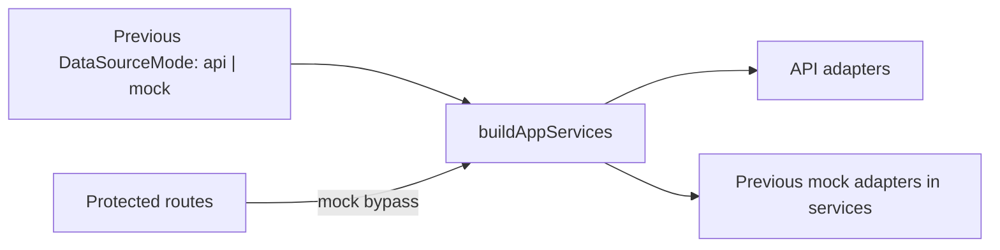
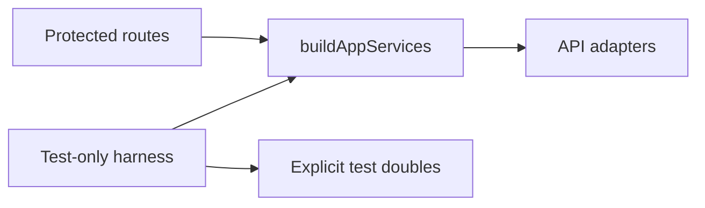

# Web API Mock Runtime Hardcut Plan

> **For agentic workers:** REQUIRED SUB-SKILL: Use
> superpowers:test-driven-development for code steps. Steps use checkbox
> (`- [ ]`) syntax for tracking.

**Goal:** Remove mock runtime semantics from the product web composition root.
Fixture-backed behavior may remain only as explicit test-only doubles, but
production app services, route gating, data-source resolution, and API port
factories must be API-only.

**Architecture:** Apply Fowler Replace Conditional With Polymorphism at the test
boundary rather than inside product composition. The browser may use local
presentation state, but product runtime, plan, run, workspace, admin, and
warehouse semantics must come from API rails or fail closed when the rail is
missing.

**Tech Stack:** React, TypeScript, Vitest architecture guards, repository
feature mechanization, Mermaid documentation, existing app service composition.

---

## Governing Sources

- `AGENTS.md`
- `docs/planning/status/governance-document-rule-inventory.md`
- `docs/guides/ai-work-protocol.md`
- `docs/architecture/command-query-rail-governance.md`
- `docs/architecture/fowler-opportunity-planning-governance.md`
- `docs/planning/reviews/20260510-web-api-integration-gap-review.md`
- `docs/architecture/components/web/workspace/mock-runtime-hardcut-component.md`
- `docs/architecture/components/web/workspace/mock-runtime-hardcut-user-stories.md`

## Command / Query Rail Posture

This slice does not add a new backend command or query rail. It removes a
parallel frontend rail provider. Missing capabilities stay represented as
explicit unavailable states in API ports until the owning backend rail exists.

| Existing intent            | Product posture after hardcut       | Test-only posture                |
| -------------------------- | ----------------------------------- | -------------------------------- |
| `GetRuntimeSession`        | API-only protected route gate       | Tests inject session doubles     |
| `PreviewExecutablePlan`    | API plans port                      | Tests inject plan-port doubles   |
| `StartRun` and run queries | API runs port                       | Tests inject runs-port doubles   |
| Workspace graph/files      | API workspace ports                 | Tests inject workspace doubles   |
| Missing workspace rails    | Explicit unavailable API capability | Tests may exercise local doubles |
| Graph draft authoring      | API graph draft authoring port      | Tests inject graph-draft doubles |

## Previous And Implemented Shape





## Fowler / DDD Findings

- Hidden Authority: mock services created plans, runs, audit, graph revisions,
  workspace files, and warehouse imports as product-equivalent truth.
- Parallel Model: mock runtime objects lived beside API adapters and shaped
  production composition decisions.
- Primitive Obsession: `mode: 'mock'` carried too much semantic meaning through
  unrelated services.
- Boundary Drift: protected route auth had a mock bypass while API mode had a
  real session and workspace context query.

## Feature Mechanization

```feature-mechanization
version: 1
featureId: WEB-API-MOCK-RUNTIME-HARDCUT-20260510
mechanizationStatus: implemented
noHumanDecisionsRemaining: true
implementationPlan: docs/planning/proposals/mandatory/frontend-and-ux/web-api-mock-runtime-hardcut-plan-20260510.md
componentGuides:
  - docs/architecture/components/web/workspace/mock-runtime-hardcut-component.md
  - docs/architecture/components/web/workspace/mock-runtime-hardcut-user-stories.md
  - docs/planning/reviews/20260510-web-api-integration-gap-review.md
userStories:
  - docs/architecture/components/web/workspace/mock-runtime-hardcut-user-stories.md
governingSources:
  - AGENTS.md
  - docs/planning/status/governance-document-rule-inventory.md
  - docs/guides/ai-work-protocol.md
  - docs/architecture/command-query-rail-governance.md
  - docs/architecture/fowler-opportunity-planning-governance.md
  - docs/planning/reviews/20260510-web-api-integration-gap-review.md
allowedImplementationSurfaces:
  - docs/planning/proposals/mandatory/frontend-and-ux/web-api-mock-runtime-hardcut-plan-20260510.md
  - docs/architecture/components/web/workspace/mock-runtime-hardcut-component.md
  - docs/architecture/components/web/workspace/mock-runtime-hardcut-user-stories.md
  - docs/architecture/components/web/workspace/workspace-port-decomposition-component.md
  - docs/architecture/components/web/workspace/workspace-port-decomposition-user-stories.md
  - docs/planning/reviews/20260510-web-api-integration-gap-review.md
  - buzon/**
  - apps/web/src/app/bootstrap/AuthRouteGate.tsx
  - apps/web/src/app/bootstrap/AuthRouteGate.test.tsx
  - apps/web/src/app/services/config/**
  - apps/web/src/app/services/composition/**
  - apps/web/src/app/services/plans/**
  - apps/web/src/app/services/runs/**
  - apps/web/src/app/services/workspace/**
  - apps/web/src/app/ports/**
  - apps/web/src/app/services/AppServicesContext.tsx
  - apps/web/src/app/services/AppServicesContext.test.tsx
  - apps/web/src/app/components/**
  - apps/web/src/app/views/**
  - apps/web/src/app/queries/**
  - apps/web/src/app/routes.test.tsx
  - apps/web/src/app/AppProviders.test.tsx
  - apps/web/src/app/Root*.ts*
  - apps/web/src/app/data/**
  - apps/web/src/testing/**
  - docs/planning/status/**
  - docs/.manifest.json
  - docs/**/index.md
forbiddenImplementationSurfaces:
  - apps/api/**
  - packages/**
  - specs/contracts/**
  - docs/archive/**
commandQueryRails:
  - name: GetRuntimeSession
    type: query
    dddOwner: Runtime session admission
  - name: PreviewExecutablePlan
    type: command
    dddOwner: Plan preview application service
  - name: StartRun
    type: command
    dddOwner: Run start application service
  - name: GetWorkspaceGraphDraft
    type: query
    dddOwner: Workspace graph draft read model
domainObjects:
  - name: DataSourceMode
    type: value object
    owner: Web composition runtime mode
  - name: AppServices
    type: composition root
    owner: Web application service ports
  - name: AppServices test doubles
    type: test harness
    owner: Web test runtime fixtures
fowlerSignals:
  - Hidden Authority from mock runtime services
  - Parallel Model between mock services and API rails
  - Boundary Drift in protected route auth bypass
  - Primitive Obsession around mode mock
architectureGuards:
  - pnpm --filter @dvt/web exec vitest run src/app/services/composition/appServicesMockHardcut.architecture.test.ts
  - pnpm --filter @dvt/web exec vitest run src/app/services/workspace/workspacePortDecomposition.architecture.test.ts
cypressFlows:
  - N/A - composition and adapter-boundary hardcut only
completionGate:
  - pnpm docs:sync
  - pnpm docs:status:generate
  - pnpm --filter @dvt/web exec vitest run src/app/services/composition/appServicesMockHardcut.architecture.test.ts
  - pnpm --filter @dvt/web exec vitest run src/app/services/config/dataSource.test.ts src/app/services/composition/appServices.test.ts src/app/services/workspace/workspacePorts.imports.test.ts
  - pnpm --filter @dvt/web typecheck
  - pnpm docs:feature-mechanization:implementation
  - pnpm verify:prepush
redGreenCycles:
  - id: mock-free-product-composition
    redTest: pnpm --filter @dvt/web exec vitest run src/app/services/composition/appServicesMockHardcut.architecture.test.ts
    expectedFailure: product composition still imports mock adapters, exposes mock mode, and bypasses route auth for mock.
    patchSurfaces:
      - apps/web/src/app/services/composition/appServicesMockHardcut.architecture.test.ts
      - apps/web/src/app/services/composition/appServices.ts
      - apps/web/src/app/bootstrap/AuthRouteGate.tsx
      - apps/web/src/app/services/config/dataSource.ts
    greenTest: pnpm --filter @dvt/web exec vitest run src/app/services/composition/appServicesMockHardcut.architecture.test.ts
  - id: test-doubles-explicit-injection
    redTest: pnpm --filter @dvt/web typecheck
    expectedFailure: tests still ask product composition for mode mock instead of injecting explicit doubles.
    patchSurfaces:
      - apps/web/src/testing/**
      - apps/web/src/app/**/*.test.ts
      - apps/web/src/app/**/*.test.tsx
    greenTest: pnpm --filter @dvt/web typecheck
  - id: semantic-encapsulation-and-doc-drift
    redTest: pnpm --filter @dvt/web exec vitest run src/app/services/composition/appServicesMockHardcut.architecture.test.ts
    expectedFailure: hardcut modules lack owned-concern docblocks and docs preserve retired runtime vocabulary.
    patchSurfaces:
      - apps/web/src/app/services/composition/appServicesMockHardcut.architecture.test.ts
      - apps/web/src/app/services/config/dataSource.ts
      - apps/web/src/app/services/plans/plansService.ts
      - apps/web/src/testing/**
      - docs/architecture/components/web/workspace/mock-runtime-hardcut-component.md
      - docs/architecture/components/web/workspace/mock-runtime-hardcut-user-stories.md
      - docs/architecture/components/web/workspace/workspace-port-decomposition-component.md
      - docs/architecture/components/web/workspace/workspace-port-decomposition-user-stories.md
      - docs/planning/reviews/20260510-web-api-integration-gap-review.md
      - buzon/**
    greenTest: pnpm --filter @dvt/web exec vitest run src/app/services/composition/appServicesMockHardcut.architecture.test.ts
symbols:
  - name: HARDCUT_OWNED_CONCERN_MODULES
    path: apps/web/src/app/services/composition/appServicesMockHardcut.architecture.test.ts
    dddOwner: Web composition architecture guard
    cqRails:
      - GetRuntimeSession
      - PreviewExecutablePlan
      - StartRun
      - GetWorkspaceGraphDraft
    fowlerSignals:
      - Semantic architecture guard requires module-boundary ownership declarations
    architectureGuard: pnpm --filter @dvt/web exec vitest run src/app/services/composition/appServicesMockHardcut.architecture.test.ts
    cypressCoverage: N/A
    unitTests:
      - apps/web/src/app/services/composition/appServicesMockHardcut.architecture.test.ts
  - name: HARDCUT_DOCUMENTATION_FILES
    path: apps/web/src/app/services/composition/appServicesMockHardcut.architecture.test.ts
    dddOwner: Web composition architecture guard
    cqRails:
      - GetRuntimeSession
      - PreviewExecutablePlan
      - StartRun
      - GetWorkspaceGraphDraft
    fowlerSignals:
      - Documentation drift guard requires API-only product wording and test-only fixture wording
    architectureGuard: pnpm --filter @dvt/web exec vitest run src/app/services/composition/appServicesMockHardcut.architecture.test.ts
    cypressCoverage: N/A
    unitTests:
      - apps/web/src/app/services/composition/appServicesMockHardcut.architecture.test.ts
  - name: createAppServicesTestOverrides
    path: apps/web/src/testing/appServicesTestDoubles.ts
    dddOwner: Web test runtime fixtures
    cqRails:
      - GetRuntimeSession
      - PreviewExecutablePlan
      - StartRun
      - GetWorkspaceGraphDraft
    fowlerSignals:
      - Explicit test double injection replaces product mock mode
    architectureGuard: pnpm --filter @dvt/web exec vitest run src/app/services/composition/appServicesMockHardcut.architecture.test.ts
    cypressCoverage: N/A
    unitTests:
      - apps/web/src/app/services/composition/appServicesMockHardcut.architecture.test.ts
  - name: AppServicesTestOverridesOptions
    path: apps/web/src/testing/appServicesTestDoubles.ts
    dddOwner: Web test runtime fixtures
    cqRails:
      - GetRuntimeSession
      - PreviewExecutablePlan
      - StartRun
      - GetWorkspaceGraphDraft
    fowlerSignals:
      - Test harness options replace product runtime mode switches
    architectureGuard: pnpm --filter @dvt/web exec vitest run src/app/services/composition/appServicesMockHardcut.architecture.test.ts
    cypressCoverage: N/A
    unitTests:
      - apps/web/src/app/services/composition/appServices.test.ts
  - name: createMockPlansService
    path: apps/web/src/testing/plansPortDoubles.ts
    dddOwner: Web test runtime fixtures
    cqRails:
      - PreviewExecutablePlan
    fowlerSignals:
      - Explicit plan-port double replaces product mock mode
    architectureGuard: pnpm --filter @dvt/web exec vitest run src/app/services/composition/appServicesMockHardcut.architecture.test.ts
    cypressCoverage: N/A
    unitTests:
      - apps/web/src/app/services/plans/plansService.test.ts
  - name: stubAuthenticatedSessionFetch
    path: apps/web/src/app/routes.test.tsx
    dddOwner: Web route test runtime fixtures
    cqRails:
      - GetRuntimeSession
    fowlerSignals:
      - Protected routes test real API session bootstrap instead of mock bypass
    architectureGuard: pnpm --filter @dvt/web exec vitest run src/app/services/composition/appServicesMockHardcut.architecture.test.ts
    cypressCoverage: N/A
    unitTests:
      - apps/web/src/app/routes.test.tsx
  - name: PRODUCT_COMPOSITION_FILES
    path: apps/web/src/app/services/composition/appServicesMockHardcut.architecture.test.ts
    dddOwner: Web composition architecture guard
    cqRails:
      - GetRuntimeSession
      - PreviewExecutablePlan
      - StartRun
      - GetWorkspaceGraphDraft
    fowlerSignals:
      - Architecture guard enumerates product composition files that must stay mock-free
    architectureGuard: pnpm --filter @dvt/web exec vitest run src/app/services/composition/appServicesMockHardcut.architecture.test.ts
    cypressCoverage: N/A
    unitTests:
      - apps/web/src/app/services/composition/appServicesMockHardcut.architecture.test.ts
  - name: listFilesRecursive
    path: apps/web/src/app/services/composition/appServicesMockHardcut.architecture.test.ts
    dddOwner: Web composition architecture guard
    cqRails:
      - GetRuntimeSession
      - PreviewExecutablePlan
      - StartRun
      - GetWorkspaceGraphDraft
    fowlerSignals:
      - Architecture guard scans product service trees for forbidden mock modules
    architectureGuard: pnpm --filter @dvt/web exec vitest run src/app/services/composition/appServicesMockHardcut.architecture.test.ts
    cypressCoverage: N/A
    unitTests:
      - apps/web/src/app/services/composition/appServicesMockHardcut.architecture.test.ts
  - name: readRepoFile
    path: apps/web/src/app/services/composition/appServicesMockHardcut.architecture.test.ts
    dddOwner: Web composition architecture guard
    cqRails:
      - GetRuntimeSession
      - PreviewExecutablePlan
      - StartRun
      - GetWorkspaceGraphDraft
    fowlerSignals:
      - Architecture guard verifies source-level hardcut invariants
    architectureGuard: pnpm --filter @dvt/web exec vitest run src/app/services/composition/appServicesMockHardcut.architecture.test.ts
    cypressCoverage: N/A
    unitTests:
      - apps/web/src/app/services/composition/appServicesMockHardcut.architecture.test.ts
  - name: resolveBaseWorkspaceConfig
    path: apps/web/src/app/services/config/workspaceConfig.ts
    dddOwner: Web workspace config query
    cqRails:
      - GetRuntimeSession
    fowlerSignals:
      - Product workspace config no longer exposes a mock example workspace
    architectureGuard: pnpm --filter @dvt/web exec vitest run src/app/services/composition/appServicesMockHardcut.architecture.test.ts
    cypressCoverage: N/A
    unitTests:
      - apps/web/src/app/services/config/dataSource.test.ts
  - name: createPlansService
    path: apps/web/src/app/services/plans/plansService.ts
    dddOwner: Web plan API port composition
    cqRails:
      - PreviewExecutablePlan
    fowlerSignals:
      - Product plans service is API-only
    architectureGuard: pnpm --filter @dvt/web exec vitest run src/app/services/composition/appServicesMockHardcut.architecture.test.ts
    cypressCoverage: N/A
    unitTests:
      - apps/web/src/app/services/plans/plansService.test.ts
  - name: CanvasRouteStartupBlockState
    path: apps/web/src/app/views/canvas/canvasRouteInteractionState.ts
    dddOwner: Web canvas route presentation state
    cqRails:
      - GetWorkspaceGraphDraft
    fowlerSignals:
      - Canvas route state no longer branches on product mock runtime
    architectureGuard: pnpm --filter @dvt/web exec vitest run src/app/services/composition/appServicesMockHardcut.architecture.test.ts
    cypressCoverage: N/A
    unitTests:
      - apps/web/src/app/views/canvas/canvasRouteInteractionState.test.ts
  - name: isPlatformHealthQuery
    path: apps/web/src/app/views/canvas/useCanvasController.test.graphQuery.ts
    dddOwner: Web canvas test query fixtures
    cqRails:
      - GetRuntimeSession
    fowlerSignals:
      - Canvas tests distinguish platform health from graph data without product mock runtime
    architectureGuard: pnpm --filter @dvt/web exec vitest run src/app/services/composition/appServicesMockHardcut.architecture.test.ts
    cypressCoverage: N/A
    unitTests:
      - apps/web/src/app/views/canvas/useCanvasController.persistence.test.tsx
  - name: setCanvasHarnessGraphQueryPending
    path: apps/web/src/app/views/canvas/useCanvasController.test.graphQuery.ts
    dddOwner: Web canvas test query fixtures
    cqRails:
      - GetWorkspaceGraphDraft
    fowlerSignals:
      - Canvas tests inject query state explicitly instead of relying on product mock mode
    architectureGuard: pnpm --filter @dvt/web exec vitest run src/app/services/composition/appServicesMockHardcut.architecture.test.ts
    cypressCoverage: N/A
    unitTests:
      - apps/web/src/app/views/canvas/useCanvasController.persistence.test.tsx
  - name: CanvasHarnessPlatformHealthData
    path: apps/web/src/app/views/canvas/useCanvasController.test.queryClientMocks.ts
    dddOwner: Web canvas test query fixtures
    cqRails:
      - GetRuntimeSession
    fowlerSignals:
      - Canvas tests explicitly model platform health query data
    architectureGuard: pnpm --filter @dvt/web exec vitest run src/app/services/composition/appServicesMockHardcut.architecture.test.ts
    cypressCoverage: N/A
    unitTests:
      - apps/web/src/app/views/canvas/useCanvasController.persistence.test.tsx
  - name: createWorkspacePorts
    path: apps/web/src/app/services/workspace/workspacePorts.ts
    dddOwner: Web workspace API composition
    cqRails:
      - GetWorkspaceGraphDraft
    fowlerSignals:
      - Product workspace ports are API-only
    architectureGuard: pnpm --filter @dvt/web exec vitest run src/app/services/composition/appServicesMockHardcut.architecture.test.ts
    cypressCoverage: N/A
    unitTests:
      - apps/web/src/app/services/workspace/workspacePorts.imports.test.ts
  - name: DataSourceMode
    path: apps/web/src/app/services/config/dataSource.ts
    dddOwner: Web composition runtime mode
    cqRails:
      - GetRuntimeSession
    fowlerSignals:
      - Remove primitive mock branch from product runtime
    architectureGuard: pnpm --filter @dvt/web exec vitest run src/app/services/composition/appServicesMockHardcut.architecture.test.ts
    cypressCoverage: N/A
    unitTests:
      - apps/web/src/app/services/config/dataSource.test.ts
```

## Implementation Steps

- [x] Identify mock authority surfaces in app service composition.
- [x] Declare the hardcut plan and feature mechanization.
- [x] Add architecture guard proving product composition cannot import mock
      adapters or expose `mode: 'mock'`.
- [x] Move mock adapters and fixtures to explicit test-double surfaces.
- [x] Make product data-source resolution API-only.
- [x] Update tests to inject doubles instead of enabling mock mode.
- [x] Update the web/API gap review and component docs.
- [x] Run closeout validation for the web package.
