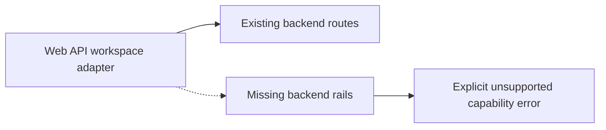

# Web API Workspace Port Route Parity Remediation Plan

## Purpose

This slice implements the first remediation from
[`20260510-web-api-integration-gap-review.md`](../../../reviews/20260510-web-api-integration-gap-review.md):
the web API workspace adapter must not call endpoints that the backend does not
expose.

The slice does not add backend routes. Missing capabilities remain unavailable
until their command/query rails are designed and implemented.

## Scope

Included:

- Fail closed in API mode for workspace adapter methods whose HTTP routes do
  not exist.
- Keep the existing real API rails for graph draft reads and workspace file
  reads.
- Add tests proving unsupported API-mode capabilities do not issue HTTP calls
  to missing routes.
- Update the web/API gap review with the implemented route-parity posture.

Excluded:

- Adding `GET /diff/changes`, `GET /plugins`, `GET /admin/roles`,
  `GET /admin/audit`, or `POST /workspace/files/:path`.
- Splitting `IWorkspacePort` into narrower ports; this plan only removes false
  API route confidence.
- Changing mock-mode semantics.
- Changing view layout or navigation.

## Current And Target Shape



Target:

- Existing routes still execute through `apiClient`.
- Missing routes fail before transport, with a typed unsupported-capability
  error that names the missing rail.
- Tests guard against reintroducing orphan `/diff`, `/plugins`, `/admin`, or
  workspace-file-write calls into the API adapter.

## Feature Mechanization

```feature-mechanization
version: 1
featureId: WEB-API-WORKSPACE-PORT-ROUTE-PARITY-20260510
mechanizationStatus: implemented
noHumanDecisionsRemaining: true
implementationPlan: docs/planning/proposals/mandatory/frontend-and-ux/web-api-workspace-port-route-parity-remediation-plan-20260510.md
componentGuides:
  - docs/planning/reviews/20260510-web-api-integration-gap-review.md
  - docs/architecture/command-query-rail-governance.md
  - docs/architecture/reference-architecture.md
userStories:
  - docs/planning/reviews/20260510-web-api-integration-gap-review.md
governingSources:
  - AGENTS.md
  - docs/planning/status/governance-document-rule-inventory.md
  - docs/guides/ai-work-protocol.md
  - docs/architecture/command-query-rail-governance.md
  - docs/architecture/fowler-opportunity-planning-governance.md
  - docs/planning/reviews/20260510-web-api-integration-gap-review.md
allowedImplementationSurfaces:
  - docs/planning/proposals/mandatory/frontend-and-ux/web-api-workspace-port-route-parity-remediation-plan-20260510.md
  - docs/planning/reviews/20260510-web-api-integration-gap-review.md
  - apps/web/src/app/services/workspace/workspaceService.api.ts
  - apps/web/src/app/services/workspace/workspaceService.api.test.ts
  - apps/web/src/app/services/workspace/workspaceErrors.ts
  - docs/planning/status/**
  - docs/.manifest.json
  - docs/**/index.md
forbiddenImplementationSurfaces:
  - apps/api/**
  - packages/**
  - specs/contracts/**
  - .golden/**
  - docs/archive/**
commandQueryRails:
  - name: GetWorkspaceGraphDraft
    type: query
    dddOwner: Workspace graph draft
  - name: ListWorkspaceFiles
    type: query
    dddOwner: Workspace file read model
  - name: GetWorkspaceFileContent
    type: query
    dddOwner: Workspace file read model
  - name: GetWorkspaceDiffChanges
    type: query
    dddOwner: Workspace diff read model
    status: missing-backend-rail
  - name: ListWorkspacePlugins
    type: query
    dddOwner: Runtime plugin catalog read model
    status: missing-backend-rail
  - name: ListAdminRoles
    type: query
    dddOwner: Admin RBAC read model
    status: missing-backend-rail
  - name: ListAdminAuditLog
    type: query
    dddOwner: Admin audit read model
    status: missing-backend-rail
  - name: SaveWorkspaceFileContent
    type: command
    dddOwner: Workspace file command model
    status: missing-backend-rail
domainObjects:
  - name: WorkspaceApiCapabilityUnsupportedError
    type: adapter unavailable-state error
    owner: Web workspace API adapter
  - name: ApiWorkspaceService
    type: web API adapter
    owner: Web workspace integration
fowlerSignals:
  - API adapter contains calls for routes that do not exist
  - Broad frontend port mixes unrelated bounded contexts
  - Missing backend rails must fail closed instead of masquerading as routes
architectureGuards:
  - pnpm --filter @dvt/web exec vitest run src/app/services/workspace/workspaceService.api.test.ts
  - pnpm docs:feature-mechanization:implementation
cypressFlows:
  - N/A - adapter fail-closed posture only
completionGate:
  - pnpm docs:sync
  - pnpm --filter @dvt/web exec vitest run src/app/services/workspace/workspaceService.api.test.ts
  - pnpm --filter @dvt/web typecheck
  - pnpm docs:feature-mechanization:implementation
  - pnpm verify:prepush
redGreenCycles:
  - id: api-workspace-adapter-fails-closed-for-missing-routes
    redTest: pnpm --filter @dvt/web exec vitest run src/app/services/workspace/workspaceService.api.test.ts
    expectedFailure: workspaceService.api still calls /diff/changes, /plugins, /admin/roles, /admin/audit, and POST /workspace/files/:path through apiClient.
    patchSurfaces:
      - apps/web/src/app/services/workspace/workspaceService.api.test.ts
      - apps/web/src/app/services/workspace/workspaceService.api.ts
      - apps/web/src/app/services/workspace/workspaceErrors.ts
    greenTest: pnpm --filter @dvt/web exec vitest run src/app/services/workspace/workspaceService.api.test.ts
symbols:
  - name: WorkspaceApiCapabilityUnsupportedError
    path: apps/web/src/app/services/workspace/workspaceErrors.ts
    dddOwner: Workspace API unavailable capability posture
    cqRails:
      - GetWorkspaceDiffChanges
      - ListWorkspacePlugins
      - ListAdminRoles
      - ListAdminAuditLog
      - SaveWorkspaceFileContent
    fowlerSignals:
      - Missing backend rails must fail closed instead of masquerading as routes
    architectureGuard: pnpm --filter @dvt/web exec vitest run src/app/services/workspace/workspaceService.api.test.ts
    cypressCoverage: N/A - adapter fail-closed posture only
    unitTests:
      - apps/web/src/app/services/workspace/workspaceService.api.test.ts
  - name: WorkspaceApiUnsupportedCapability
    path: apps/web/src/app/services/workspace/workspaceErrors.ts
    dddOwner: Workspace API unavailable capability posture
    cqRails:
      - GetWorkspaceDiffChanges
      - ListWorkspacePlugins
      - ListAdminRoles
      - ListAdminAuditLog
      - SaveWorkspaceFileContent
    fowlerSignals:
      - Missing backend rails must fail closed instead of masquerading as routes
    architectureGuard: pnpm --filter @dvt/web exec vitest run src/app/services/workspace/workspaceService.api.test.ts
    cypressCoverage: N/A - adapter fail-closed posture only
    unitTests:
      - apps/web/src/app/services/workspace/workspaceService.api.test.ts
  - name: WorkspaceApiUnsupportedRail
    path: apps/web/src/app/services/workspace/workspaceErrors.ts
    dddOwner: Workspace API unavailable capability posture
    cqRails:
      - GetWorkspaceDiffChanges
      - ListWorkspacePlugins
      - ListAdminRoles
      - ListAdminAuditLog
      - SaveWorkspaceFileContent
    fowlerSignals:
      - Missing backend rails must fail closed instead of masquerading as routes
    architectureGuard: pnpm --filter @dvt/web exec vitest run src/app/services/workspace/workspaceService.api.test.ts
    cypressCoverage: N/A - adapter fail-closed posture only
    unitTests:
      - apps/web/src/app/services/workspace/workspaceService.api.test.ts
  - name: createApiWorkspaceService
    path: apps/web/src/app/services/workspace/workspaceService.api.ts
    dddOwner: Web workspace API adapter
    cqRails:
      - GetWorkspaceGraphDraft
      - ListWorkspaceFiles
      - GetWorkspaceFileContent
      - GetWorkspaceDiffChanges
      - ListWorkspacePlugins
      - ListAdminRoles
      - ListAdminAuditLog
      - SaveWorkspaceFileContent
    fowlerSignals:
      - API adapter contains calls for routes that do not exist
      - Broad frontend port mixes unrelated bounded contexts
    architectureGuard: pnpm --filter @dvt/web exec vitest run src/app/services/workspace/workspaceService.api.test.ts
    cypressCoverage: N/A - adapter fail-closed posture only
    unitTests:
      - apps/web/src/app/services/workspace/workspaceService.api.test.ts
  - name: rejectUnsupportedApiWorkspaceCapability
    path: apps/web/src/app/services/workspace/workspaceService.api.ts
    dddOwner: Web workspace API adapter
    cqRails:
      - GetWorkspaceDiffChanges
      - ListWorkspacePlugins
      - ListAdminRoles
      - ListAdminAuditLog
      - SaveWorkspaceFileContent
    fowlerSignals:
      - Missing backend rails must fail closed instead of masquerading as routes
    architectureGuard: pnpm --filter @dvt/web exec vitest run src/app/services/workspace/workspaceService.api.test.ts
    cypressCoverage: N/A - adapter fail-closed posture only
    unitTests:
      - apps/web/src/app/services/workspace/workspaceService.api.test.ts
  - name: ApiWorkspaceService
    path: apps/web/src/app/services/workspace/workspaceService.api.test.ts
    dddOwner: Web workspace API adapter test harness
    cqRails:
      - GetWorkspaceDiffChanges
      - ListWorkspacePlugins
      - ListAdminRoles
      - ListAdminAuditLog
      - SaveWorkspaceFileContent
    fowlerSignals:
      - Missing backend rails must fail closed instead of masquerading as routes
    architectureGuard: pnpm --filter @dvt/web exec vitest run src/app/services/workspace/workspaceService.api.test.ts
    cypressCoverage: N/A - adapter fail-closed posture only
    unitTests:
      - apps/web/src/app/services/workspace/workspaceService.api.test.ts
  - name: unsupportedApiWorkspaceOperations
    path: apps/web/src/app/services/workspace/workspaceService.api.test.ts
    dddOwner: Web workspace API adapter test harness
    cqRails:
      - GetWorkspaceDiffChanges
      - ListWorkspacePlugins
      - ListAdminRoles
      - ListAdminAuditLog
      - SaveWorkspaceFileContent
    fowlerSignals:
      - Missing backend rails must fail closed instead of masquerading as routes
    architectureGuard: pnpm --filter @dvt/web exec vitest run src/app/services/workspace/workspaceService.api.test.ts
    cypressCoverage: N/A - adapter fail-closed posture only
    unitTests:
      - apps/web/src/app/services/workspace/workspaceService.api.test.ts
```

## Acceptance Criteria

- `createApiWorkspaceService` does not call absent `/diff/changes`, `/plugins`,
  `/admin/roles`, `/admin/audit`, or workspace-file-write endpoints.
- Unsupported API-mode workspace capabilities reject with a typed error before
  any `apiClient` transport method is called.
- Existing protected graph draft and workspace file read behavior remains
  unchanged.
- The review records that route-parity remediation slice 1 has been applied.

## Validation Plan

Run:

```bash
pnpm docs:sync
pnpm --filter @dvt/web exec vitest run src/app/services/workspace/workspaceService.api.test.ts
pnpm --filter @dvt/web typecheck
pnpm docs:feature-mechanization:implementation
pnpm verify:prepush
```
