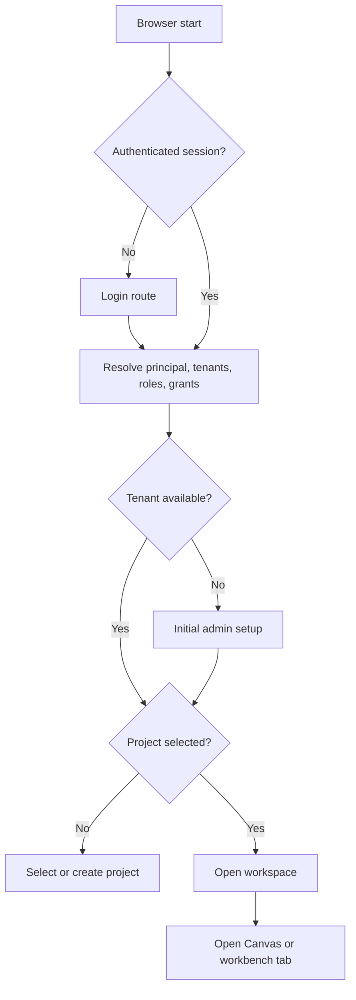
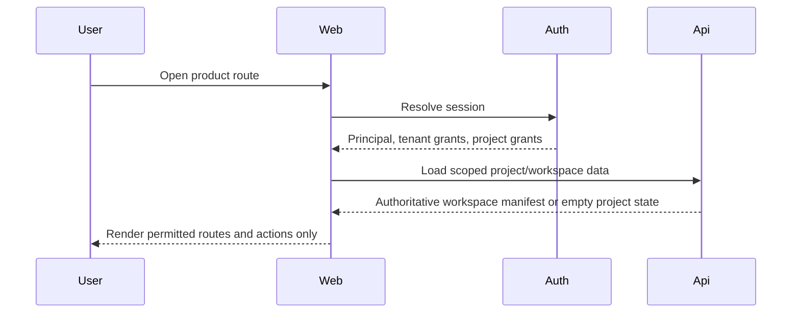
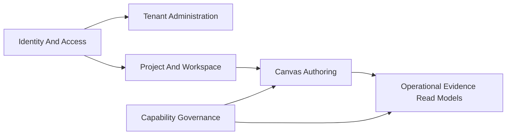
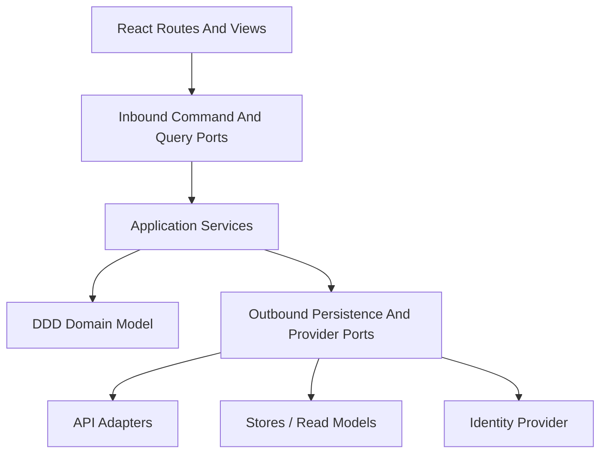

# Web Auth, Project Onboarding, And Actionable Product Gaps

## Problem Statement

The web product currently has useful Canvas authoring flows, but the startup
posture is not mature enough for product use:

- there is no visible login or permission onboarding route in the web router;
- shell workspace selectors are persisted in `localStorage` through
  `dvt-web-session`;
- Cypress can seed tenant, project, and environment directly for tests;
- sample graph nodes can appear in fixture-backed flows even though a real user
  has not selected or created a project;
- several UI actions are described as pending backend work instead of being
  tracked as actionable product stories with contracts and negative tests.

This proposal converts those gaps into deliverable stories. It does not treat
E2E fixture data as product truth.

## Repository Findings

- `apps/web/src/app/routes.ts` defines root, plugin, `/plugins`, and `/admin`
  routes, but no `/login`, `/setup`, `/users`, or tenant-admin onboarding route.
- `apps/web/src/app/stores/sessionStore.ts` owns tenant, project, and
  environment selector values and persists them to `localStorage`.
- `apps/web/cypress/support/workspaceSession.ts` seeds `dvt-web-session` for E2E
  tests.
- `apps/web/cypress/support/canvasDraftAuthoring.ts` creates the fixture nodes
  `src_orders`, `model_orders`, and `orders_dashboard`.
- `docs/planning/proposals/web-user-stories-20260429.md` already identifies
  backend verification gaps for admin roles, audit, workspace files, lineage,
  cost, diff, and some capability surfaces.
- `apps/api/src` already contains protected runtime authentication and
  authorization seams for command and workspace draft routes, but the web shell
  does not expose a first-class user session, login, or tenant-user management
  journey.

## Target Product Posture

The web app should start from identity, then scope, then workspace:

## Command And Query Catalog

This catalog specializes the repository-wide
[Command And Query Rail Governance](../../../../architecture/command-query-rail-governance.md).
The repository rule is canonical; this proposal is the product-slice catalog
for web auth, tenant administration, project onboarding, Canvas startup, and
actionable capability gaps.

The later story matrix maps each command and query back to a user story, DDD
object, port, and negative test.

### Exhaustiveness Rule

This catalog is the implementation rail for this product slice under the
repository-wide command/query rule.

No route, view action, API endpoint, application use case, service method,
adapter method, Cypress workflow, or architecture test may introduce product
behavior for this slice unless that behavior is represented by one command or
one query in this catalog.

Adding behavior outside the catalog is drift. To add a new behavior, the change
must first update this proposal with:

- the command or query name;
- whether it is a command or a query;
- the owning bounded context;
- the inbound port;
- the outbound port or store if one is needed;
- the DDD object or read model it creates, changes, or returns;
- the user story or backlog story it serves;
- the negative tests that prove fail-closed behavior.

Commands and queries are product-level intents, not transport or framework
operations. For example, `CreateProject` is a command; `POST /projects` is an
adapter route for that command. `GetWorkspaceManifest` is a query;
`GET /workspaces/:id/manifest` is an adapter route for that query.

Catalog coverage at this design gate:

- 24 product commands;
- 27 product queries;
- 12 user stories mapped in the story matrix;
- 6 bounded contexts;
- 18 inbound/outbound ports named in the hexagonal boundary plan.

### Rail Completeness Check

The current rail is sufficient for implementation planning only if the first
implementation slice stays inside these boundaries:

- identity-first startup;
- tenant-admin bootstrap and role assignment;
- authoritative tenant/project scope discovery;
- project creation and empty workspace/canvas startup;
- Canvas authoring after project scope exists;
- disabled-action capability-gap governance;
- read-only operational evidence contracts for files, lineage, cost, diff, and
  logs.

It is not sufficient for future product areas such as billing, promotion
workflows, external identity-provider administration, customer tenancy billing,
or write-side lineage/cost/diff operations. Those areas require new commands or
queries before implementation.

### Commands

Identity and session:

- `StartLogin`: begins login and records the intended return route.
- `CompleteLogin`: exchanges the provider callback for an authenticated
  product session.
- `LogoutPrincipal`: clears the authenticated session and browser scope cache.
- `RefreshSessionGrants`: refreshes tenant, project, role, and action grants.

Tenant administration:

- `BootstrapTenantAdmin`: creates the first tenant and first tenant
  administrator for an unbootstrapped installation.
- `CreateTenantUser`: creates a user account scoped to one tenant.
- `InviteTenantUser`: invites a tenant-scoped user.
- `DisableTenantUser`: disables product access without deleting audit history.
- `AssignTenantRole`: grants a role to a principal within a tenant or project.
- `RevokeTenantRole`: removes a role assignment within a tenant or project.

Scope, project, and workspace:

- `SelectTenantScope`: selects a tenant from the authenticated grant set.
- `SelectProjectScope`: selects a project from the selected tenant grants.
- `CreateProject`: creates a tenant-owned project with no sample graph data.
- `CreateWorkspace`: creates a workspace container for a project.
- `CreateCanvas`: creates an empty typed canvas inside a workspace.
- `EnableDemoProjectSeed`: explicitly enables demo seed data for a project.

Canvas authoring:

- `CreateCanvasNode`: adds a node allowed by the active canvas kind.
- `RemoveCanvasNode`: removes a node and dependent edges from the draft.
- `SaveWorkspaceGraphDraft`: persists the draft with expected revision.
- `CreateCanvasEdge`: adds an allowed edge between two canvas nodes.
- `RemoveCanvasEdge`: removes an edge from the workspace draft.

Capability-gap governance:

- `RegisterDisabledActionGap`: maps a disabled UI action to a story ID,
  capability, and backend contract reference.
- `AcknowledgeUnavailableCapability`: records that an operator saw an explicit
  unavailable-capability posture.
- `RequestCapabilityRecheck`: refreshes backend and plugin capability posture.

### Queries

Identity and session:

- `GetSessionProfile`: returns principal identity, grants, roles, allowed
  actions, and default scope.
- `GetBootstrapStatus`: returns whether first tenant-admin bootstrap is allowed.
- `ListGrantedTenants`: returns tenants available to the principal.
- `ListGrantedProjects`: returns projects available under the selected tenant.
- `ListGrantedEnvironments`: returns environments available for runtime
  evidence review.

Tenant administration:

- `ListTenantUsers`: returns tenant users with status and role summary.
- `GetTenantUser`: returns a single tenant user with assignments.
- `ListTenantRoles`: returns assignable roles and included actions.
- `ListRoleAssignments`: returns current role assignments for a tenant or
  project.
- `ListAdminAuditEvents`: returns administrative audit events.

Project, workspace, and Canvas:

- `ListProjects`: returns tenant-scoped project descriptors.
- `GetProject`: returns one project descriptor and project posture.
- `GetWorkspaceManifest`: returns workspaces, canvases, files, and openable
  surfaces for the selected project.
- `GetWorkspaceGraphDraft`: returns the protected graph draft after
  authentication and project selection.
- `ListCanvasKinds`: returns canvas kinds available to the selected project.
- `ListNodeKindCatalog`: returns node kinds allowed for the active canvas kind.

Capability-gap governance:

- `GetRuntimeCapabilities`: returns backend and plugin capability posture.
- `ListDisabledActionGaps`: returns disabled actions with story ID, missing
  capability, and contract reference.
- `GetCapabilityContract`: returns the expected backend contract for a
  capability.

Operational evidence read models:

- `ListWorkspaceFiles`: returns a tenant/project-scoped file tree.
- `GetWorkspaceFileContent`: returns authorized file content.
- `GetNodeLineage`: returns lineage for a graph node.
- `GetImpactAnalysis`: returns downstream impact from a selected node.
- `GetCostSummary`: returns cost attribution summary when cost is available.
- `GetCostCoverage`: returns cost instrumentation coverage.
- `GetDiff`: returns comparison between two refs or environments.
- `GetRunLogStream`: returns live or historical run log events.

## Story Backlog

### WEB-AUTH-1: Authenticated Startup Gate

**As** an unauthenticated user, **I want** protected product routes to require
login **so that** tenant and project data never render without identity.

Acceptance criteria:

- Opening `/`, `/canvas`, `/runs`, `/plugins`, or `/admin` without a session
  redirects to `/login`.
- Deep links return to the original route after successful login when the user
  has permission for that route.
- Failed or expired session resolution clears local session state and returns
  to `/login`.
- Canvas graph APIs are not called before authentication succeeds.
- Negative tests cover expired token, malformed token, missing token, and denied
  route permission.

Backend/API need:

- Session profile endpoint such as `GET /session` or `GET /me`.
- Authenticated principal payload with tenant grants, project grants, and
  allowed actions.

### WEB-AUTH-2: Initial Tenant Admin Bootstrap

**As** a platform operator, **I want** a first admin bootstrap flow **so that** a
new installation can create its first tenant and administrator without manual
database edits.

Acceptance criteria:

- If no tenant admin exists, the app opens an explicit setup route.
- Setup creates the tenant, the initial admin user, and the first project scope.
- Setup is disabled once the bootstrap invariant is satisfied.
- All bootstrap actions are audited.
- Negative tests cover duplicate bootstrap, weak identity payload, tenant ID
  collision, and attempts by a non-bootstrap caller.

Backend/API need:

- Bootstrap status endpoint.
- One-time bootstrap command with idempotency key and audit event.

### WEB-AUTH-3: Tenant-Scoped User And Role Administration

**As** a tenant admin, **I want** to create users and assign tenant/project
permissions **so that** teams can operate without sharing admin credentials.

Acceptance criteria:

- Tenant admin can invite or create users scoped to a tenant.
- Tenant admin can grant and revoke roles per tenant and project.
- Tenant admin cannot grant a role broader than their own authority.
- Role changes invalidate stale sessions or force permission refresh.
- Audit log records before and after state for every role change.
- Negative tests cover cross-tenant assignment, privilege escalation, duplicate
  user, revoked user, and stale session permissions.

Backend/API need:

- `GET /admin/users`, `POST /admin/users`, `PATCH /admin/users/:id`.
- `GET /admin/roles`, `POST /admin/role-assignments`,
  `DELETE /admin/role-assignments/:id`.
- Audit endpoint for admin events.

### WEB-SCOPE-1: Authoritative Scope Discovery

**As** a logged-in user, **I want** tenant, project, and environment selectors
to come from server-authorized grants **so that** the UI cannot invent a scope
from browser storage.

Acceptance criteria:

- Shell selectors are populated only from the authenticated session profile.
- Persisted browser values are accepted only if they are still in the grant
  list.
- Selecting a tenant clears incompatible project and workspace state.
- Selecting a project opens an empty project state if no workspace exists.
- Negative tests cover deleted project, revoked tenant grant, stale
  `localStorage`, and URL scope that is outside the user's grants.

Backend/API need:

- Session profile includes accessible tenants, projects, environments, and
  default selections.

### WEB-PROJECT-1: Clean Startup Without A Project

**As** a new user with no selected project, **I want** a clean project selection
or creation state **so that** Canvas does not show fixture nodes or misleading
data.

Acceptance criteria:

- Starting the app without a selected project does not call
  `/workspace/graph/draft`.
- The left project panel is empty until a project is selected or created.
- `src_orders`, `model_orders`, and `orders_dashboard` never appear in normal
  startup unless a selected project draft actually contains them.
- Cypress fixture nodes remain isolated to E2E support files and explicit demo
  mode.
- Negative tests cover empty account, account with tenant but no project,
  invalid persisted project, and project deleted while browser storage remains.

Backend/API need:

- Project catalog endpoint scoped by tenant.
- Project creation command.
- Workspace manifest endpoint that can return an honest empty project state.

### WEB-PROJECT-2: Project Creation And Empty Canvas Creation

**As** a data engineer, **I want** to create a project and start with an empty
typed canvas **so that** I can build a graph from my own resources.

Acceptance criteria:

- Project creation collects name, owning tenant, and initial plugin/source
  posture.
- New projects create no sample nodes by default.
- User can create an empty canvas and choose its canvas kind.
- First node catalog is derived from the canvas kind.
- Negative tests cover duplicate project name, unsupported canvas kind, missing
  plugin capability, and failed draft creation.

Backend/API need:

- `POST /projects`.
- `GET /projects`.
- `POST /workspaces` or equivalent workspace manifest creation command.
- `POST /workspace/canvases` or equivalent canvas creation command.

### WEB-GAP-1: Replace "Pending Backend" With Linked Capability Stories

**As** a product owner, **I want** every disabled action to link to a concrete
story and backend capability **so that** the UI never hides incomplete product
work behind vague copy.

Acceptance criteria:

- Disabled actions include a story ID, missing capability, and expected backend
  contract.
- The UI copy avoids "backend pending" as a terminal explanation.
- The backlog maps each disabled action to a vertical and a negative test.
- Negative tests cover unavailable capability, 404 contract, 403 permission,
  409 stale revision, and 500 backend failure.

### WEB-GAP-2: Workspace Files Contract

**As** a reviewer, **I want** source files to load through a verified workspace
files contract **so that** code views are not mock-only.

Acceptance criteria:

- Web file tree reads use an API route verified in `apps/api`.
- File content requests are tenant/project scoped.
- Read-only failures show honest empty/error states.
- Negative tests cover missing file, path traversal, unauthorized project, and
  unsupported binary file.

### WEB-GAP-3: Lineage And Impact Contract

**As** a reviewer, **I want** lineage and impact analysis to come from a
verified contract **so that** Canvas and Lineage show authoritative impact data.

Acceptance criteria:

- Node lineage drill-down has a verified endpoint or documented derivation
  limit.
- Column lineage absence is represented as an explicit unavailable state.
- Negative tests cover unknown node, partial lineage, stale graph revision, and
  unauthorized tenant.

### WEB-GAP-4: Cost Attribution Contract

**As** a platform admin, **I want** cost views to be backed by a cost
attribution contract **so that** cost dashboards do not promise unavailable
data.

Acceptance criteria:

- Cost UI renders only when cost capability is available.
- Empty state links to the cost attribution story and missing contract.
- Negative tests cover unavailable capability, partial attribution, and
  cross-tenant cost query.

### WEB-GAP-5: Diff Contract

**As** a technical lead, **I want** diff views to use a verified backend
contract **so that** environment/ref comparisons are not UI-only placeholders.

Acceptance criteria:

- Diff route uses a verified comparison contract.
- Diff request includes tenant, project, left ref, right ref, and mode.
- Negative tests cover missing ref, incompatible refs, unauthorized project, and
  empty diff.

### WEB-GAP-6: Run Logs Streaming Contract

**As** an operator, **I want** run logs to stream through a verified contract
**so that** runtime debugging works without fixture data.

Acceptance criteria:

- Logs route or tab consumes a real API stream or polling contract.
- Terminal runs can still load historical logs.
- Negative tests cover run not found, unauthorized run, stream disconnect, and
  malformed log event.

## CQRS Command And Query Design

### Design Rules

- Commands mutate authoritative state and return receipts, not screen-shaped
  read models.
- Queries return read models and never grant permission by themselves.
- Every command is evaluated against an authenticated principal and an explicit
  tenant scope.
- Create/update commands carry an idempotency key where repeat delivery is
  possible.
- Browser storage may cache selected scope, but server grants decide whether a
  cached scope is still valid.
- Fixture and demo data are never default product data. Demo seeding is an
  explicit command.

### User Story Command/Query Matrix

#### WEB-AUTH-1: Authenticated Startup Gate

Commands:

- `StartLogin`
- `CompleteLogin`
- `LogoutPrincipal`
- `RefreshSessionGrants`

Queries:

- `GetSessionProfile`
- `GetRuntimeCapabilities`

DDD objects:

- `AuthenticatedSession`
- `SessionProfile`
- `Principal`
- `GrantSet`
- `ReturnRoute`
- `ActionName`
- `ScopeRef`

Hexagonal ports:

- `SessionCommandPort`
- `SessionQueryPort`
- `IdentityProviderPort`
- `PrincipalDirectoryPort`

Negative tests:

- missing token redirects to login and does not call workspace APIs;
- expired token clears cached scope and returns to login;
- malformed token fails closed;
- authenticated principal without route grant cannot open the protected route.

#### WEB-AUTH-2: Initial Tenant Admin Bootstrap

Commands:

- `BootstrapTenantAdmin`

Queries:

- `GetBootstrapStatus`
- `GetSessionProfile`

DDD objects:

- `TenantBootstrap`
- `Tenant`
- `TenantUser`
- `TenantAdminRole`
- `BootstrapTokenRef`
- `AdminAuditEvent`
- `IdempotencyKey`

Hexagonal ports:

- `TenantAdminCommandPort`
- `TenantAdminQueryPort`
- `PrincipalDirectoryPort`
- `RoleAssignmentStore`
- `AuditLogPort`

Negative tests:

- duplicate bootstrap is rejected after the first admin exists;
- bootstrap without authorized bootstrap context is rejected;
- tenant slug collision is rejected;
- weak or incomplete admin identity payload is rejected.

#### WEB-AUTH-3: Tenant-Scoped User And Role Administration

Commands:

- `CreateTenantUser`
- `InviteTenantUser`
- `DisableTenantUser`
- `AssignTenantRole`
- `RevokeTenantRole`

Queries:

- `ListTenantUsers`
- `GetTenantUser`
- `ListTenantRoles`
- `ListRoleAssignments`
- `ListAdminAuditEvents`

DDD objects:

- `TenantUser`
- `UserAccount`
- `RoleAssignment`
- `TenantAccessPolicy`
- `RoleAssignmentPolicy`
- `AdminAuditEvent`
- `EmailAddress`

Hexagonal ports:

- `TenantAdminCommandPort`
- `TenantAdminQueryPort`
- `PrincipalDirectoryPort`
- `RoleAssignmentStore`
- `AuditLogPort`

Negative tests:

- cross-tenant user creation is rejected;
- tenant admin cannot grant broader privileges than their own;
- duplicate email or principal identity is rejected;
- disabled user cannot receive new project role assignments;
- stale sessions refresh or lose revoked permissions.

#### WEB-SCOPE-1: Authoritative Scope Discovery

Commands:

- `RefreshSessionGrants`
- `SelectTenantScope`
- `SelectProjectScope`
- `LogoutPrincipal`

Queries:

- `GetSessionProfile`
- `ListGrantedTenants`
- `ListGrantedProjects`
- `ListGrantedEnvironments`
- `GetRuntimeCapabilities`

DDD objects:

- `GrantSet`
- `TenantGrant`
- `ProjectGrant`
- `EnvironmentGrant`
- `SelectedScope`
- `ScopeRef`
- `ScopeSelectionPolicy`

Hexagonal ports:

- `SessionCommandPort`
- `SessionQueryPort`
- `ProjectCatalogQueryPort`
- `CapabilityQueryPort`

Negative tests:

- stale `localStorage` project is ignored when it is absent from grants;
- revoked tenant grant clears project/workspace state;
- URL scope outside grants fails closed;
- deleted project selection returns to project onboarding.

#### WEB-PROJECT-1: Clean Startup Without A Project

Commands:

- `SelectTenantScope`
- `SelectProjectScope`
- `CreateProject`

Queries:

- `GetSessionProfile`
- `ListProjects`
- `GetProject`
- `GetWorkspaceManifest`

DDD objects:

- `Project`
- `ProjectDescriptor`
- `SelectedScope`
- `WorkspaceStartupPolicy`
- `WorkspaceManifest`
- `DemoSeedMode`

Hexagonal ports:

- `ProjectCommandPort`
- `ProjectCatalogQueryPort`
- `WorkspaceManifestQueryPort`
- `SessionQueryPort`

Negative tests:

- no selected project does not call `GetWorkspaceGraphDraft`;
- empty tenant shows project onboarding and no sample nodes;
- invalid cached project is cleared;
- deleted project does not render `src_orders`, `model_orders`, or
  `orders_dashboard`.

#### WEB-PROJECT-2: Project Creation And Empty Canvas Creation

Commands:

- `CreateProject`
- `CreateWorkspace`
- `CreateCanvas`
- `EnableDemoProjectSeed`

Queries:

- `ListProjects`
- `GetProject`
- `GetWorkspaceManifest`
- `ListCanvasKinds`
- `ListNodeKindCatalog`

DDD objects:

- `Project`
- `Workspace`
- `WorkspaceManifest`
- `CanvasDocument`
- `CanvasKind`
- `ProjectCreationPolicy`
- `DemoSeedPolicy`

Hexagonal ports:

- `ProjectCommandPort`
- `WorkspaceCommandPort`
- `ProjectCatalogQueryPort`
- `WorkspaceManifestQueryPort`
- `CanvasCatalogQueryPort`

Negative tests:

- duplicate project name inside the same tenant is rejected;
- unsupported canvas kind is rejected;
- new project contains no sample graph nodes by default;
- demo seed requires explicit `EnableDemoProjectSeed`.

#### WEB-GAP-1: Replace "Pending Backend" With Linked Capability Stories

Commands:

- `RegisterDisabledActionGap`
- `AcknowledgeUnavailableCapability`
- `RequestCapabilityRecheck`

Queries:

- `ListDisabledActionGaps`
- `GetCapabilityContract`
- `GetRuntimeCapabilities`

DDD objects:

- `DisabledActionGap`
- `CapabilityRegistry`
- `CapabilityContract`
- `CapabilityName`
- `BackendContractRef`
- `StoryId`

Hexagonal ports:

- `CapabilityGapCommandPort`
- `CapabilityQueryPort`
- `CapabilityRegistryStore`

Negative tests:

- disabled action without story ID is rejected by architecture test;
- disabled action without missing capability is rejected;
- disabled action without contract reference is rejected;
- vague "pending backend" copy is rejected by copy governance.

#### WEB-GAP-2: Workspace Files Contract

Commands:

- None in the first slice. This is a read-model vertical.

Queries:

- `ListWorkspaceFiles`
- `GetWorkspaceFileContent`
- `GetSessionProfile`

DDD objects:

- `WorkspaceFileTree`
- `WorkspaceFileContent`
- `WorkspacePath`
- `WorkspaceFileReadPolicy`

Hexagonal ports:

- `OperationalEvidenceQueryPort`
- `WorkspaceFileRepository`
- `SessionQueryPort`

Negative tests:

- path traversal is rejected;
- missing file returns an explicit not-found state;
- unauthorized project cannot read files;
- binary or unsupported file type returns unsupported-content posture.

#### WEB-GAP-3: Lineage And Impact Contract

Commands:

- None in the first slice. This is a read-model vertical.

Queries:

- `GetNodeLineage`
- `GetImpactAnalysis`
- `GetWorkspaceGraphDraft`

DDD objects:

- `NodeLineageView`
- `ImpactAnalysisView`
- `LineageNodeRef`
- `LineageReadPolicy`

Hexagonal ports:

- `OperationalEvidenceQueryPort`
- `LineageReadModelStore`
- `WorkspaceManifestQueryPort`

Negative tests:

- unknown node returns not-found;
- partial lineage is marked partial, not treated as complete;
- stale graph revision blocks impact comparison;
- unauthorized tenant cannot read lineage.

#### WEB-GAP-4: Cost Attribution Contract

Commands:

- `AcknowledgeUnavailableCapability`
- `RequestCapabilityRecheck`

Queries:

- `GetRuntimeCapabilities`
- `GetCostSummary`
- `GetCostCoverage`

DDD objects:

- `CostSummaryView`
- `CostCoverageView`
- `CapabilityStatus`
- `UnavailableReason`
- `CostReadPolicy`

Hexagonal ports:

- `CapabilityQueryPort`
- `OperationalEvidenceQueryPort`
- `CostReadModelStore`

Negative tests:

- unavailable cost capability shows empty state with linked story;
- partial attribution is marked partial;
- cross-tenant cost query is rejected;
- missing contract returns unavailable state, not zero cost.

#### WEB-GAP-5: Diff Contract

Commands:

- None in the first slice. Diff is read-only until promotion workflows exist.

Queries:

- `GetDiff`
- `GetSessionProfile`
- `GetWorkspaceManifest`

DDD objects:

- `DiffView`
- `DiffScope`
- `SourceRef`
- `DiffMode`
- `DiffReadPolicy`

Hexagonal ports:

- `OperationalEvidenceQueryPort`
- `DiffReadModelStore`
- `WorkspaceManifestQueryPort`

Negative tests:

- missing left or right ref is rejected;
- incompatible refs return unsupported-comparison posture;
- unauthorized project cannot diff;
- empty diff is a valid empty state, not a failure.

#### WEB-GAP-6: Run Logs Streaming Contract

Commands:

- None in the first slice. Logs are read-only evidence.

Queries:

- `GetRunLogStream`
- `GetSessionProfile`

DDD objects:

- `RunLogStreamView`
- `RunLogEvent`
- `RunLogCursor`
- `RunLogReadPolicy`

Hexagonal ports:

- `OperationalEvidenceQueryPort`
- `RunLogStreamPort`
- `SessionQueryPort`

Negative tests:

- run not found returns not-found;
- unauthorized run is rejected;
- stream disconnect enters recoverable disconnected posture;
- malformed log event is rejected and reported as stream corruption.

## DDD Domain Design

### Bounded Context Map

### Concrete Domain Object Construction Backlog

The first implementation pass creates domain objects before UI routing. These
objects are intentionally small and behavior-owned; they are not DTO aliases.

Identity and access objects:

- `PrincipalId`: value object. Owns non-empty authenticated principal identity.
- `UserId`: value object. Owns product user identity independent from provider
  subject.
- `AuthenticatedSession`: value object. Owns session reference, principal, issue
  time, expiry, and authentication provider.
- `SessionProfile`: read model. Owns principal, grants, default scope, and
  available actions for shell startup.
- `GrantSet`: value object. Owns tenant, project, environment, and action
  grants. Invariant: every project grant belongs to a granted tenant.
- `ScopeRef`: value object. Owns tenant/project/environment scope. Invariant:
  tenant is always present; project is optional only before project selection.
- `SelectedScope`: value object. Owns currently selected tenant/project and
  optional environment evidence scope.
- `ActionName`: value object. Owns command or route action names used by
  authorization.

Tenant administration objects:

- `Tenant`: aggregate root. Owns tenant identity, slug, status, and bootstrap
  posture.
- `TenantBootstrap`: aggregate root. Owns first-admin creation invariant.
  Invariant: bootstrap can succeed once per installation.
- `TenantUser`: entity. Owns tenant-scoped user lifecycle: invited, active,
  disabled.
- `RoleAssignment`: entity. Owns principal, role, scope, assignment source, and
  timestamps.
- `TenantAccessPolicy`: domain policy. Owns membership and authorization
  decisions for tenant/project actions.
- `RoleAssignmentPolicy`: domain policy. Owns privilege-escalation prevention.
- `AdminAuditEvent`: entity/read model. Owns immutable audit facts for admin
  commands.

Project and workspace objects:

- `Project`: aggregate root. Owns tenant-scoped project identity, name, status,
  and demo-seed posture.
- `ProjectDescriptor`: read model. Owns shell-visible project list data.
- `Workspace`: aggregate root. Owns workspace identity, project membership, and
  default canvas relation.
- `WorkspaceManifest`: read model. Owns openable workspaces, canvases, files,
  and default surfaces.
- `CanvasDocument`: entity. Owns canvas identity, title, kind, and workspace
  relation.
- `CanvasKind`: value object. Owns typed canvas family such as transformation or
  dbt.
- `DemoSeedMode`: value object. Owns explicit demo seeding state. Invariant:
  default is disabled.

Canvas authoring objects:

- `WorkspaceGraphDraft`: aggregate root. Owns node IDs, edge IDs, positions,
  revision, and draft capability.
- `CanvasNode`: entity. Owns node identity, node kind, plugin owner, role,
  metadata, and status.
- `CanvasEdge`: entity. Owns source node, target node, relation, and edge
  identity.
- `DraftRevision`: value object. Owns optimistic concurrency token.
- `NodeKind`: value object. Owns node catalog identity and plugin family.
- `CanvasCatalogEntry`: read model. Owns node kind availability for one canvas
  kind.
- `NodePosition`: value object. Owns persisted x/y layout coordinates.

Capability governance objects:

- `CapabilityRegistry`: aggregate root. Owns capability name, provider/plugin
  owner, availability, and contract reference.
- `DisabledActionGap`: entity. Owns disabled UI action, story ID, missing
  capability, backend contract, and user-facing reason.
- `CapabilityContract`: value object. Owns expected route/event contract
  reference.
- `CapabilityStatus`: value object. Owns available, unavailable, degraded, and
  unknown states.
- `BackendContractRef`: value object. Owns a canonical contract or API route
  reference.

Operational evidence objects:

- `WorkspaceFileTree`: read model. Owns file hierarchy under authorized project
  scope.
- `WorkspaceFileContent`: read model. Owns content, content type, path, and
  revision.
- `NodeLineageView`: read model. Owns upstream/downstream lineage facts.
- `ImpactAnalysisView`: read model. Owns impacted nodes and severity posture.
- `CostSummaryView`: read model. Owns cost totals and attribution state.
- `CostCoverageView`: read model. Owns cost instrumentation coverage.
- `DiffView`: read model. Owns comparison facts and empty-diff posture.
- `RunLogStreamView`: read model. Owns live/historical log event stream state.

### Identity And Access Context

Owned concern: authenticate principals, resolve grants, and authorize
tenant/project actions.

Aggregates and entities:

- `Principal`: authenticated actor known to the system.
- `UserAccount`: login-capable account attached to one or more tenants.
- `TenantAccessPolicy`: aggregate that owns tenant membership and role
  assignment invariants.
- `RoleAssignment`: entity representing a role granted to a principal for a
  scope.

Value objects:

- `PrincipalId`, `UserId`, `TenantId`, `ProjectId`, `RoleId`.
- `ActionName`, `ScopeRef`, `GrantSet`, `ReturnRoute`.
- `SessionProfile`, `AuthenticatedSessionRef`.

Domain services and policies:

- `AuthenticationPolicy`: decides whether a provider session can become a
  product session.
- `AuthorizationPolicy`: evaluates action plus scope against a grant set.
- `RoleAssignmentPolicy`: prevents privilege escalation and cross-tenant grants.

Domain events:

- `PrincipalAuthenticated`, `SessionGrantsRefreshed`, `TenantRoleAssigned`,
  `TenantRoleRevoked`, `TenantUserDisabled`.

### Tenant Administration Context

Owned concern: manage tenant users, first-admin bootstrap, role assignments, and
audit visibility.

Aggregates and entities:

- `Tenant`: security and governance boundary.
- `TenantBootstrap`: one-time aggregate that controls initial admin creation.
- `TenantUser`: tenant-scoped user lifecycle entity.
- `AdminAuditEvent`: immutable event record for administrative operations.

Value objects:

- `BootstrapTokenRef`, `TenantSlug`, `EmailAddress`, `AuditEventId`,
  `AdminCommandReceipt`.

Domain services and policies:

- `TenantBootstrapPolicy`: allows first bootstrap only while no admin exists.
- `TenantUserPolicy`: validates user creation, disablement, and invitation.
- `AdminAuditPolicy`: requires before/after audit facts for role changes.

Domain events:

- `TenantBootstrapped`, `TenantUserCreated`, `TenantUserInvited`,
  `AdminAuditRecorded`.

### Project And Workspace Context

Owned concern: select or create project/workspace scope before any Canvas graph
data can load.

Aggregates and entities:

- `Project`: tenant-owned product workspace root.
- `Workspace`: operational container for canvases and files.
- `WorkspaceManifest`: aggregate read boundary for canvases, files, and default
  openable surfaces.
- `CanvasDocument`: typed graph document inside a workspace.

Value objects:

- `WorkspaceId`, `CanvasId`, `CanvasKind`, `ProjectName`, `WorkspaceName`,
  `DemoSeedMode`, `WorkspaceManifestVersion`.

Domain services and policies:

- `ProjectCreationPolicy`: rejects duplicate names and missing tenant scope.
- `WorkspaceStartupPolicy`: blocks graph loading when no project is selected.
- `DemoSeedPolicy`: allows sample nodes only through explicit demo mode.

Domain events:

- `ProjectCreated`, `WorkspaceCreated`, `CanvasCreated`,
  `DemoProjectSeedEnabled`.

### Canvas Authoring Context

Owned concern: mutate protected workspace graph drafts after project and
capability checks have succeeded.

Aggregates and entities:

- `WorkspaceGraphDraft`: aggregate for editable graph state.
- `CanvasNode`: graph node admitted by canvas kind and node catalog.
- `CanvasEdge`: graph edge admitted by connection rules.

Value objects:

- `DraftRevision`, `NodeId`, `EdgeId`, `NodeKind`, `NodePosition`,
  `CanvasCatalogEntry`, `IdempotencyKey`.

Domain services and policies:

- `CanvasNodeAdmissionPolicy`: admits node kinds for the active canvas kind.
- `CanvasEdgeAdmissionPolicy`: validates connection rules.
- `DraftRevisionPolicy`: prevents stale writes.

Domain events:

- `CanvasNodeCreated`, `CanvasNodeRemoved`, `CanvasEdgeCreated`,
  `CanvasEdgeRemoved`, `WorkspaceGraphDraftSaved`.

### Capability Governance Context

Owned concern: make product capability availability explicit and connect
disabled actions to executable backlog.

Aggregates and entities:

- `CapabilityRegistry`: aggregate of backend and plugin capabilities.
- `DisabledActionGap`: entity linking a UI action to story ID, capability, and
  backend contract.
- `CapabilityContract`: expected API or event contract for a capability.

Value objects:

- `CapabilityName`, `CapabilityStatus`, `StoryId`, `BackendContractRef`,
  `UnavailableReason`.

Domain services and policies:

- `CapabilityAvailabilityPolicy`: resolves whether a user can see, execute, or
  diagnose an action.
- `DisabledActionMappingPolicy`: rejects vague "pending backend" posture when a
  story and contract can be named.

Domain events:

- `CapabilityUnavailableRecorded`, `DisabledActionGapRegistered`,
  `CapabilityPostureRefreshed`.

### Operational Evidence Read Models

Owned concern: expose files, lineage, cost, diff, and logs as read models
without leaking write authority.

Read models:

- `WorkspaceFileTree`, `WorkspaceFileContent`.
- `NodeLineageView`, `ImpactAnalysisView`.
- `CostSummaryView`, `CostCoverageView`.
- `DiffView`, `RunLogStreamView`.

Policies:

- Read models are tenant/project scoped.
- Read models cannot authorize commands.
- Unavailable read models produce explicit unavailable states, not fake data.

## Hexagonal Boundary Plan

Inbound command ports:

- `SessionCommandPort`
- `TenantAdminCommandPort`
- `ProjectCommandPort`
- `WorkspaceCommandPort`
- `CanvasAuthoringCommandPort`
- `CapabilityGapCommandPort`

Inbound query ports:

- `SessionQueryPort`
- `TenantAdminQueryPort`
- `ProjectCatalogQueryPort`
- `WorkspaceManifestQueryPort`
- `CanvasCatalogQueryPort`
- `CapabilityQueryPort`
- `OperationalEvidenceQueryPort`

Outbound ports:

- `IdentityProviderPort`
- `PrincipalDirectoryPort`
- `RoleAssignmentStore`
- `AuditLogPort`
- `ProjectCatalogStore`
- `WorkspaceManifestStore`
- `WorkspaceGraphDraftStore`
- `CapabilityRegistryStore`
- `WorkspaceFileRepository`
- `LineageReadModelStore`
- `CostReadModelStore`
- `DiffReadModelStore`
- `RunLogStreamPort`

Adapter rules:

- Web routes consume application hooks/facades, never raw adapters.
- API handlers call command/query use cases, not domain entities directly.
- Mock and API adapters implement the same ports and must not diverge in
  semantics.
- `localStorage` is an adapter for local convenience only; it is not an
  authorization source.

## Fowler, SOLID, And Anti-Pattern Review

Patterns applied:

- CQRS: commands and queries are split by intent and return type.
- Application Service: use cases coordinate commands/queries and transactions.
- Aggregate Root: tenant access, project/workspace, graph draft, and capability
  registry own invariants.
- Repository: persistence stays behind stores and read-model ports.
- Policy/Specification: authorization, role assignment, node admission, and
  demo seeding are explicit policies.
- Anti-Corruption Layer: provider login, backend DTOs, plugin capabilities, and
  read models map into product domain objects.

SOLID application:

- SRP: each bounded context owns one product concern.
- OCP: new capabilities and plugins extend catalog/registry ports instead of
  changing Canvas startup rules.
- LSP: mock and API adapters must satisfy the same port contracts.
- ISP: command ports and query ports stay narrow by vertical.
- DIP: routes and use cases depend on ports, not concrete adapters.

Anti-patterns rejected:

- `localStorage` as session authority.
- Canvas as startup authority before project selection.
- Fixture nodes as product seed data.
- "Pending backend" copy without a story, capability, and contract.
- Route components acting as transaction scripts.
- One broad `AdminService` that mixes users, roles, audit, bootstrap, and
  capability posture.

## Implementation Planning

### Think-First Analysis

Problem summary: web startup currently lacks a product-grade identity, scope,
and project boundary, while some UI actions are backed by vague backend-gap
language instead of executable stories.

Root cause: the frontend evolved from route-level Canvas authoring and E2E
fixtures before the product identity and project-onboarding domains were
modeled as first-class DDD contexts.

Constraints and invariants:

- Reference Architecture requires hexagonal boundaries and explicit tenant
  isolation.
- Domain Language distinguishes DVT from the engine and keeps workspace/project
  terminology explicit.
- Lane E requires views to avoid direct mock data and consume typed service or
  port boundaries.
- No product route may render tenant/project graph data before authentication
  and project selection.

Selected option: implement this as a CQRS/DDD vertical with identity,
tenant-admin, project/workspace, Canvas authoring, and capability-governance
contexts. This keeps product rules out of route components and lets backend
contracts land behind explicit command/query ports.

Rejected alternatives:

- Add only a `/login` screen: rejected because it would not solve tenant grants,
  user administration, or clean project startup.
- Keep fixture nodes as default onboarding: rejected because it hides whether a
  real project exists.
- Implement backend gaps as disabled buttons only: rejected because it creates
  product drift and no executable backlog.

### Pre-Implementation Brief

Mode: Full.

Scope:

- Design and then implement web/API command/query boundaries for login, tenant
  administration, project onboarding, clean startup, and disabled-action gaps.
- Introduce DDD value objects and policies before route wiring.
- Preserve Canvas authoring behavior only after authenticated project scope
  exists.

Touched paths expected during implementation:

- `apps/web/src/app/routes.ts`
- `apps/web/src/app/stores/sessionStore.ts`
- `apps/web/src/app/services/**`
- `apps/web/src/app/ports/**`
- `apps/web/src/app/views/**`
- `apps/api/src/**`
- `packages/@dvt/contracts/**` if public contracts are introduced
- `docs/planning/proposals/mandatory/frontend-and-ux/**`
- `docs/architecture/components/web/**`

### Implementation File Plan

API domain modules:

- `apps/api/src/domain/identity/session.ts`: `AuthenticatedSession`,
  `SessionProfile`, `Principal`, `GrantSet`, `ScopeRef`, `SelectedScope`.
- `apps/api/src/domain/identity/sessionPolicy.ts`: `AuthenticationPolicy`,
  `AuthorizationPolicy`, `ScopeSelectionPolicy`.
- `apps/api/src/domain/tenant-admin/tenant.ts`: `Tenant`,
  `TenantBootstrap`, `TenantUser`, `RoleAssignment`, `AdminAuditEvent`.
- `apps/api/src/domain/tenant-admin/tenantPolicies.ts`:
  `TenantBootstrapPolicy`, `TenantUserPolicy`, `RoleAssignmentPolicy`,
  `AdminAuditPolicy`.
- `apps/api/src/domain/project-workspace/project.ts`: `Project`,
  `ProjectDescriptor`, `Workspace`, `WorkspaceManifest`, `CanvasDocument`.
- `apps/api/src/domain/project-workspace/projectPolicies.ts`:
  `ProjectCreationPolicy`, `WorkspaceStartupPolicy`, `DemoSeedPolicy`.
- `apps/api/src/domain/capabilities/capabilityRegistry.ts`:
  `CapabilityRegistry`, `CapabilityContract`, `DisabledActionGap`.
- `apps/api/src/domain/capabilities/capabilityPolicies.ts`:
  `CapabilityAvailabilityPolicy`, `DisabledActionMappingPolicy`.

API application command/query modules:

- `apps/api/src/application/commands/sessionCommands.ts`
- `apps/api/src/application/commands/tenantAdminCommands.ts`
- `apps/api/src/application/commands/projectWorkspaceCommands.ts`
- `apps/api/src/application/commands/canvasAuthoringCommands.ts`
- `apps/api/src/application/commands/capabilityGapCommands.ts`
- `apps/api/src/application/queries/sessionQueries.ts`
- `apps/api/src/application/queries/tenantAdminQueries.ts`
- `apps/api/src/application/queries/projectWorkspaceQueries.ts`
- `apps/api/src/application/queries/capabilityQueries.ts`
- `apps/api/src/application/queries/operationalEvidenceQueries.ts`

API port modules:

- `apps/api/src/application/ports/sessionPorts.ts`
- `apps/api/src/application/ports/tenantAdminPorts.ts`
- `apps/api/src/application/ports/projectWorkspacePorts.ts`
- `apps/api/src/application/ports/capabilityPorts.ts`
- `apps/api/src/application/ports/operationalEvidencePorts.ts`

Web boundary modules:

- `apps/web/src/app/ports/sessionProfile.ts`
- `apps/web/src/app/ports/tenantAdmin.ts`
- `apps/web/src/app/ports/projectWorkspace.ts`
- `apps/web/src/app/ports/capabilityGaps.ts`
- `apps/web/src/app/services/session/sessionProfilePort.ts`
- `apps/web/src/app/services/tenantAdmin/tenantAdminService.api.ts`
- `apps/web/src/app/services/tenantAdmin/tenantAdminService.mock.ts`
- `apps/web/src/app/services/projectWorkspace/projectWorkspaceService.api.ts`
- `apps/web/src/app/services/projectWorkspace/projectWorkspaceService.mock.ts`
- `apps/web/src/app/services/capabilityGaps/capabilityGapsService.api.ts`
- `apps/web/src/app/services/capabilityGaps/capabilityGapsService.mock.ts`

Web route modules:

- `apps/web/src/app/views/LoginView.tsx`
- `apps/web/src/app/views/SetupView.tsx`
- `apps/web/src/app/views/ProjectOnboardingView.tsx`
- `apps/web/src/app/views/admin/TenantUsersPanel.tsx`
- `apps/web/src/app/bootstrap/AuthRouteGate.tsx`
- `apps/web/src/app/bootstrap/ProjectScopeGate.tsx`

Architecture fitness tests:

- `apps/api/test/architecture/webProductDomainBoundaries.architecture.test.ts`
- `apps/web/src/app/bootstrap/authRouteGate.architecture.test.ts`
- `apps/web/src/app/views/canvas/canvasNoFixtureStartup.architecture.test.ts`
- `apps/web/src/app/capabilities/disabledActionGapCopy.architecture.test.ts`

Out of scope for the first implementation slice:

- Full external identity-provider production rollout.
- Billing and cost attribution implementation.
- Full lineage, diff, and logs backend implementation beyond executable
  contract stories.

Validation plan:

- Web unit tests for session gate, scope validation, and no-project startup.
- API tests for auth/session, tenant-admin, project catalog, and denied scopes
  once endpoints are introduced.
- Cypress tests for login-required, no-project clean startup, project creation,
  canvas creation, node add/remove/reload, and disabled-action gap copy.
- `pnpm docs:sync`.
- `pnpm docs:workboard:generate` when lane YAML changes.
- `pnpm lint:md`.
- `pnpm verify:prepush`.

### Phase Plan

Phase 1: lock contracts and tests.

- Add command/query contract docs for session, tenant admin, project catalog,
  workspace manifest, and capability gaps.
- Add negative tests first for unauthenticated route access, stale
  `localStorage`, no project selected, and cross-tenant role assignment.

Phase 2: introduce domain objects and policies.

- Add value objects for principal, tenant, project, role, scope, grant set,
  project descriptor, workspace manifest, canvas kind, and capability.
- Add policy tests for bootstrap, role assignment, workspace startup, demo
  seeding, and disabled-action mapping.

Phase 3: wire hexagonal ports.

- Add command/query ports and API/mock adapters.
- Move route code to application hooks/facades.
- Keep `localStorage` as a cache adapter only.

Phase 4: product routes and UX states.

- Add login gate, setup route, tenant-admin user management route, project
  selection/creation state, and empty project Canvas posture.
- Ensure `src_orders`, `model_orders`, and `orders_dashboard` are visible only
  in E2E fixtures or explicit demo mode.

Phase 5: browser proof and regression guard.

- Add Cypress coverage for login, permissions, project creation, empty startup,
  canvas add/remove/reload, disabled actions, and denied scopes.
- Add architecture tests preventing route components from importing concrete
  adapters or treating `localStorage` as authority.

## Vertical Delivery Plan

| Vertical                    | Stories                                   | Product value                                                             | Required negative tests                                                     |
| --------------------------- | ----------------------------------------- | ------------------------------------------------------------------------- | --------------------------------------------------------------------------- |
| Identity and tenant control | WEB-AUTH-1, WEB-AUTH-2, WEB-AUTH-3        | Users and permissions become real product concepts.                       | missing token, expired token, privilege escalation, cross-tenant assignment |
| Scope and clean startup     | WEB-SCOPE-1, WEB-PROJECT-1, WEB-PROJECT-2 | Startup becomes honest: no fake project, no fixture nodes.                | stale storage, no project, deleted project, unsupported canvas kind         |
| Actionable backend gaps     | WEB-GAP-1 through WEB-GAP-6               | Disabled UI becomes a governed backlog, not vague "pending backend" copy. | 403, 404, 409, unavailable capability, malformed response                   |

## Definition Of Done

- Web routes include an authentication gate before product data loads.
- Session and scope are resolved from server-authorized grants, not invented by
  browser storage.
- A tenant admin can manage users and permissions for at least one tenant.
- Startup with no project renders an onboarding state and no graph nodes.
- Demo or fixture nodes are behind explicit test/demo mode only.
- Every disabled action has a linked story, missing capability, backend
  contract, and negative test.
- Documentation and user manual state the real product prerequisites in English.
