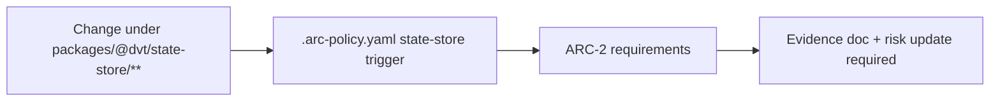

# ARC State Store Policy Routing Plan

## Problem

The ARC policy still used the conceptual trigger name `state-core` and routed it
to `packages/@dvt/state/**`. The current package is `@dvt/state-store` under
`packages/@dvt/state-store/**`.

That mismatch made the ARC policy stale: future state-store changes could miss
the ARC-2 evidence and risk posture expected for state-store boundaries.

## Target

Rename the trigger to the canonical package concept and route it through the
real package path. Keep the ARC level and evidence/risk requirements unchanged.



## Acceptance

- `.arc-policy.yaml` has a `state-store` trigger.
- The trigger glob is exactly `packages/@dvt/state-store/**`.
- The stale `packages/@dvt/state/**` glob is absent.
- `pnpm test:ci-tools` covers the policy contract.
- Lane C task `CI-AUDIT-ARC-STATE-STORE` records the closure evidence.

## Feature Mechanization Manifest

```feature-mechanization
version: 1
featureId: CI-AUDIT-ARC-STATE-STORE
mechanizationStatus: implemented
noHumanDecisionsRemaining: true
implementationPlan: docs/planning/proposals/mandatory/governance-and-docs/arc-state-store-policy-routing-plan-20260510.md
componentGuides:
  - docs/guides/testing-and-ci-capabilities.md
  - docs/planning/reviews/ci-and-delivery/20260506-ci-build-audit-review.md
userStories:
  - docs/planning/proposals/mandatory/governance-and-docs/arc-state-store-policy-routing-plan-20260510.md
governingSources:
  - AGENTS.md
  - docs/planning/status/governance-document-rule-inventory.md
  - docs/guides/ai-work-protocol.md
  - docs/guides/testing-and-ci-capabilities.md
  - docs/architecture/command-query-rail-governance.md
  - docs/architecture/fowler-opportunity-planning-governance.md
  - .arc-policy.yaml
allowedImplementationSurfaces:
  - .arc-policy.yaml
  - tools/ci/arc-policy-state-store.test.mjs
  - docs/planning/state/agent-lane-c.yaml
  - docs/planning/proposals/mandatory/governance-and-docs/arc-state-store-policy-routing-plan-20260510.md
  - docs/.manifest.json
forbiddenImplementationSurfaces:
  - apps/**
  - packages/@dvt/state-store/**
  - packages/@dvt/engine/**
  - packages/@dvt/contracts/**
  - packages/@dvt/adapter-*/**
commandQueryRails:
  - name: EvaluateArcPolicy
    type: query
    dddOwner: ArcPolicy
domainObjects:
  - name: ArcPolicy
    type: policy
    owner: CI governance
fowlerSignals:
  - Stale path rule
  - Primitive string routing drift
  - False-positive governance coverage
architectureGuards:
  - node --test tools/ci/arc-policy-state-store.test.mjs
  - pnpm test:ci-tools
cypressFlows:
  - not-applicable: CI governance policy has no browser workflow.
completionGate:
  - node --test tools/ci/arc-policy-state-store.test.mjs
  - pnpm test:ci-tools
  - pnpm governance:refresh
  - pnpm docs:feature-mechanization:implementation
  - pnpm verify:prepush
redGreenCycles:
  - id: state-store-arc-policy-route
    redTest: node --test tools/ci/arc-policy-state-store.test.mjs
    expectedFailure: ARC policy has no `state-store` trigger and still contains the stale `packages/@dvt/state/**` glob.
    patchSurfaces:
      - .arc-policy.yaml
      - tools/ci/arc-policy-state-store.test.mjs
    greenTest: node --test tools/ci/arc-policy-state-store.test.mjs
symbols:
  - name: policy
    path: tools/ci/arc-policy-state-store.test.mjs
    dddOwner: ArcPolicy
    cqRails:
      - EvaluateArcPolicy
    fowlerSignals:
      - Stale path rule
      - Primitive string routing drift
    architectureGuard: node --test tools/ci/arc-policy-state-store.test.mjs
    cypressCoverage: "not-applicable: CI governance policy has no browser workflow."
    unitTests:
      - node --test tools/ci/arc-policy-state-store.test.mjs
```
