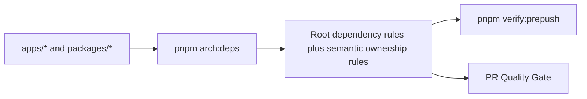

# Architecture Dependency Boundary Guard Implementation Plan

## Owned Concern

This plan owns the repository-level dependency-boundary guard that turns the
current local dependency-cruiser usage into a single architecture gate for DVT
package and application boundaries.

The feature is intentionally static-analysis scoped. It does not change runtime
behavior, public contracts, adapter behavior, or web user flows.

## Current State

`dependency-cruiser` exists only as local app policy in `apps/api` and
`apps/outbox-worker`. That leaves the repository-wide architecture rules
described by ADRs and Fowler reviews enforceable mostly by convention.

```mermaid
flowchart LR
  api[apps/api dependency-cruiser] --> localOnly[Local app boundary]
  outbox[apps/outbox-worker dependency-cruiser] --> localOnly
  packages[packages/@dvt/*] --> convention[Review convention]
  web[apps/web] --> convention
```

## Target State

The root workspace owns one architecture dependency guard command that runs
dependency-cruiser and the repository semantic ownership checks before push and
in PR quality checks.



## Command And Query Catalog

| Rail                                      | Type    | DDD owner                                | Implementation surface                                                                    | Expected result                                                              |
| ----------------------------------------- | ------- | ---------------------------------------- | ----------------------------------------------------------------------------------------- | ---------------------------------------------------------------------------- |
| `CheckArchitectureDependencyBoundaries`   | query   | Repository architecture dependency guard | `.dependency-cruiser.cjs`, `tools/ci/check-architecture-dependencies.mjs`, `package.json` | Fails when a package/app import violates a declared dependency boundary.     |
| `CheckAdapterCanonicalContractOwnership`  | query   | Repository architecture dependency guard | `tools/ci/check-architecture-dependencies.mjs`                                            | Fails when a concrete adapter owns canonical/versioned contract definitions. |
| `CheckArchitectureDependencyGuardWiring`  | query   | Repository CI governance baseline        | `tools/ci/architecture-dependency-guard.test.mjs`                                         | Fails when the guard is missing from scripts, prepush, or PR gate.           |
| `ApplyArchitectureDependencyBoundaryGate` | command | Repository CI governance baseline        | `.github/workflows/pr-quality-gate.yml`, `package.json`                                   | Adds the boundary guard to local and remote validation.                      |

No product command/query is introduced because this feature is a repository
architecture query and CI command, not user-visible product behavior.

## Initial Rule Set

The first global rule set is intentionally small and enforceable:

1. `@dvt/contracts` source cannot depend on DVT runtime packages.
2. `@dvt/planner` source cannot depend on `@dvt/engine` or concrete adapters.
3. `@dvt/engine` source cannot depend on concrete adapters.
4. Concrete adapters cannot define canonical contracts; contract-internal deep
   imports are also forbidden as a supporting boundary.
5. `apps/web` cannot import backend adapters.
6. Presentation folders cannot import infrastructure folders directly.
7. Domain folders cannot import React, HTTP, filesystem, PostgreSQL, or
   Temporal runtime dependencies.
8. Cycles between `packages/@dvt/*` source files are forbidden.
9. Cross-package deep imports from app/runtime package source are forbidden
   except package roots and explicit public API subpaths.
10. Runtime package source cannot import repository scripts or tools.

## DDD Objects

| Object                               | Type                          | Invariants                                                                                                         |
| ------------------------------------ | ----------------------------- | ------------------------------------------------------------------------------------------------------------------ |
| `ArchitectureDependencyRuleSet`      | Repository architecture value | Every rule has one name, one owner, one failure mode, and one dependency scope.                                    |
| `ArchitectureDependencyBoundaryGate` | CI query                      | The root command must execute the current rule set against `apps` and `packages`.                                  |
| `ArchitectureDependencyGuardWiring`  | CI wiring proof               | Local prepush and remote PR gate must both call `pnpm arch:deps`.                                                  |
| `AdapterCanonicalContractPolicy`     | Repository ownership policy   | Concrete adapters may implement ports, but canonical/versioned contracts live in canonical contract packages only. |

## Fowler Review

Improved patterns:

- Boundary drift becomes a mechanical failure instead of review memory.
- Package roots become the default public API, reducing deep import leakage.
- Runtime packages cannot silently depend on scripts or tools.
- Local app dependency-cruiser usage is generalized into one repository guard.
- Adapter-owned contract drift becomes a semantic architecture failure instead
  of an import-shape-only convention.

Antipatterns blocked:

- Hidden architecture authority inside package-local configs.
- Engine-to-adapter coupling.
- Planner-to-runtime coupling.
- Contract source importing behavior packages.
- Concrete adapters defining canonical/versioned contract files or symbols.
- Web UI importing backend adapter implementation.
- Runtime code using repo tooling as production dependency.

Out of scope:

- This feature does not rewrite existing app-local dependency-cruiser configs.
- This feature does not remove legitimate adapter-to-engine port dependencies.
- This feature does not add Cypress coverage because no user-visible behavior
  changes.
- This feature does not migrate historical package tests that import another
  package's internals; this cut enforces app and runtime source boundaries.

## Feature Mechanization Manifest

```feature-mechanization
version: 1
featureId: ARCH-DEPS-GUARD
mechanizationStatus: closed
noHumanDecisionsRemaining: true
implementationPlan: docs/planning/proposals/mandatory/governance-and-docs/architecture-dependency-boundary-guard-implementation-plan-20260502.md
componentGuides:
  - docs/guides/testing-and-ci-capabilities.md
userStories:
  - docs/planning/proposals/mandatory/governance-and-docs/architecture-dependency-boundary-guard-implementation-plan-20260502.md
governingSources:
  - AGENTS.md
  - docs/planning/status/governance-document-rule-inventory.md
  - docs/guides/ai-work-protocol.md
  - docs/guides/testing-and-ci-capabilities.md
  - docs/architecture/command-query-rail-governance.md
  - docs/architecture/fowler-opportunity-planning-governance.md
allowedImplementationSurfaces:
  - .dependency-cruiser.cjs
  - .github/workflows/pr-quality-gate.yml
  - docs/.manifest.json
  - docs/**/index.md
  - docs/guides/testing-and-ci-capabilities.md
  - docs/planning/proposals/mandatory/governance-and-docs/architecture-dependency-boundary-guard-implementation-plan-20260502.md
  - docs/planning/status/**
  - package.json
  - pnpm-lock.yaml
  - tools/ci/architecture-dependency-guard.test.mjs
  - tools/ci/check-architecture-dependencies.mjs
  - tools/ci/workflow-pattern-parity.test.mjs
forbiddenImplementationSurfaces:
  - apps/**
  - packages/**
  - specs/contracts/**
  - docs/archive/**
commandQueryRails:
  - name: CheckArchitectureDependencyBoundaries
    type: query
    dddOwner: Repository architecture dependency guard
  - name: CheckAdapterCanonicalContractOwnership
    type: query
    dddOwner: Repository architecture dependency guard
  - name: CheckArchitectureDependencyGuardWiring
    type: query
    dddOwner: Repository CI governance baseline
  - name: ApplyArchitectureDependencyBoundaryGate
    type: command
    dddOwner: Repository CI governance baseline
domainObjects:
  - name: ArchitectureDependencyRuleSet
    type: repository architecture value
    owner: Repository architecture dependency guard
  - name: ArchitectureDependencyBoundaryGate
    type: CI query
    owner: Repository architecture dependency guard
  - name: ArchitectureDependencyGuardWiring
    type: CI wiring proof
    owner: Repository CI governance baseline
  - name: AdapterCanonicalContractPolicy
    type: repository ownership policy
    owner: Repository architecture dependency guard
fowlerSignals:
  - Boundary drift
  - Hidden authority
  - Duplicate semantics
  - Test-only confidence
  - Canonical contract ownership drift
architectureGuards:
  - node --test tools/ci/architecture-dependency-guard.test.mjs
  - pnpm arch:deps
  - pnpm test:ci-tools
  - pnpm docs:feature-mechanization
  - pnpm docs:feature-mechanization:implementation
cypressFlows:
  - N/A - repository architecture dependency guard only
completionGate:
  - node --test tools/ci/architecture-dependency-guard.test.mjs
  - pnpm arch:deps
  - pnpm test:ci-tools
  - pnpm docs:sync
  - pnpm docs:gov:manifest
  - pnpm docs:governance:document-unit-map
  - pnpm docs:governance:file-component-index
  - pnpm docs:governance:file-fingerprint-baseline
  - pnpm docs:governance:file-fingerprint-impact
  - pnpm docs:feature-mechanization
  - pnpm docs:feature-mechanization:implementation
  - pnpm verify:prepush
redGreenCycles:
  - id: root-architecture-dependency-guard-wiring
    redTest: node --test tools/ci/architecture-dependency-guard.test.mjs
    expectedFailure: Root dependency-cruiser script, config, package dependency, and CI wiring are missing.
    patchSurfaces:
      - tools/ci/architecture-dependency-guard.test.mjs
      - package.json
      - pnpm-lock.yaml
      - .github/workflows/pr-quality-gate.yml
    greenTest: node --test tools/ci/architecture-dependency-guard.test.mjs
  - id: root-architecture-dependency-boundary-rules
    redTest: pnpm arch:deps
    expectedFailure: Root dependency-cruiser config is missing or lacks the declared boundary rules.
    patchSurfaces:
      - .dependency-cruiser.cjs
      - package.json
      - tools/ci/check-architecture-dependencies.mjs
    greenTest: pnpm arch:deps
  - id: adapter-canonical-contract-ownership-semantics
    redTest: node --test tools/ci/architecture-dependency-guard.test.mjs
    expectedFailure: Import-shape rules do not reject adapter-owned canonical/versioned contract definitions.
    patchSurfaces:
      - tools/ci/architecture-dependency-guard.test.mjs
      - tools/ci/check-architecture-dependencies.mjs
      - package.json
    greenTest: node --test tools/ci/architecture-dependency-guard.test.mjs
  - id: feature-mechanization-closeout
    redTest: pnpm docs:feature-mechanization:implementation
    expectedFailure: Dependency guard implementation surfaces are outside allowedImplementationSurfaces before this plan declares them.
    patchSurfaces:
      - docs/planning/proposals/mandatory/governance-and-docs/architecture-dependency-boundary-guard-implementation-plan-20260502.md
      - docs/.manifest.json
      - docs/planning/status/**
    greenTest: pnpm docs:feature-mechanization:implementation
symbols:
  - &archDependencyGuardTestSymbol
    name: REQUIRED_ARCH_DEPENDENCY_RULES
    path: tools/ci/architecture-dependency-guard.test.mjs
    dddOwner: Repository architecture dependency guard test
    cqRails:
      - CheckArchitectureDependencyGuardWiring
      - CheckArchitectureDependencyBoundaries
    fowlerSignals:
      - Boundary drift
      - Test-only confidence
    architectureGuard: tools/ci/architecture-dependency-guard.test.mjs
    cypressCoverage: N/A - repository architecture dependency guard only
    unitTests:
      - tools/ci/architecture-dependency-guard.test.mjs
  - <<: *archDependencyGuardTestSymbol
    name: REQUIRED_SEMANTIC_ARCHITECTURE_RULES
    cqRails:
      - CheckArchitectureDependencyGuardWiring
      - CheckAdapterCanonicalContractOwnership
    fowlerSignals:
      - Canonical contract ownership drift
      - Test-only confidence
  - <<: *archDependencyGuardTestSymbol
    name: REQUIRED_ARCH_DEPENDENCY_COMMANDS
  - <<: *archDependencyGuardTestSymbol
    name: DEPCRUISE_BIN
  - <<: *archDependencyGuardTestSymbol
    name: DEPCRUISE_CONFIG
  - <<: *archDependencyGuardTestSymbol
    name: DEPENDENCY_RULE_FIXTURES
  - <<: *archDependencyGuardTestSymbol
    name: readText
  - <<: *archDependencyGuardTestSymbol
    name: readJson
  - <<: *archDependencyGuardTestSymbol
    name: readCruiserConfig
  - <<: *archDependencyGuardTestSymbol
    name: extractForbiddenRuleNames
  - <<: *archDependencyGuardTestSymbol
    name: writeFixtureFiles
  - <<: *archDependencyGuardTestSymbol
    name: writeTsConfig
  - <<: *archDependencyGuardTestSymbol
    name: collectDependencyViolations
  - &architectureDependencyScriptSymbol
    name: ARCHITECTURE_DEPENDENCY_TARGETS
    path: tools/ci/check-architecture-dependencies.mjs
    dddOwner: Repository architecture dependency guard
    cqRails:
      - CheckArchitectureDependencyBoundaries
      - CheckAdapterCanonicalContractOwnership
    fowlerSignals:
      - Boundary drift
      - Canonical contract ownership drift
    architectureGuard: pnpm arch:deps
    cypressCoverage: N/A - repository architecture dependency guard only
    unitTests:
      - tools/ci/architecture-dependency-guard.test.mjs
  - <<: *architectureDependencyScriptSymbol
    name: ADAPTER_CANONICAL_CONTRACT_RULE_NAME
  - <<: *architectureDependencyScriptSymbol
    name: ADAPTER_SOURCE_FILE_PATTERN
  - <<: *architectureDependencyScriptSymbol
    name: SKIPPED_DIRECTORY_NAMES
  - <<: *architectureDependencyScriptSymbol
    name: VERSIONED_CANONICAL_CONTRACT_FILE_PATTERN
  - <<: *architectureDependencyScriptSymbol
    name: ADAPTER_CONTRACT_FOLDER_PATTERN
  - <<: *architectureDependencyScriptSymbol
    name: VERSIONED_CANONICAL_EXPORT_PATTERN
  - <<: *architectureDependencyScriptSymbol
    name: normalizePath
  - <<: *architectureDependencyScriptSymbol
    name: readArchitectureDependencyConfig
  - <<: *architectureDependencyScriptSymbol
    name: listFilesRecursive
  - <<: *architectureDependencyScriptSymbol
    name: getAdapterCanonicalContractReason
  - <<: *architectureDependencyScriptSymbol
    name: collectAdapterCanonicalContractFindings
  - <<: *architectureDependencyScriptSymbol
    name: runDependencyCruise
  - <<: *architectureDependencyScriptSymbol
    name: formatCruiseViolations
  - <<: *architectureDependencyScriptSymbol
    name: formatAdapterCanonicalContractFindings
  - <<: *architectureDependencyScriptSymbol
    name: runArchitectureDependencyGuard
  - <<: *architectureDependencyScriptSymbol
    name: main
```

## Validation Plan

```powershell
node --test tools/ci/architecture-dependency-guard.test.mjs
pnpm arch:deps
pnpm test:ci-tools
pnpm docs:feature-mechanization
pnpm docs:feature-mechanization:implementation
pnpm verify:prepush
```
