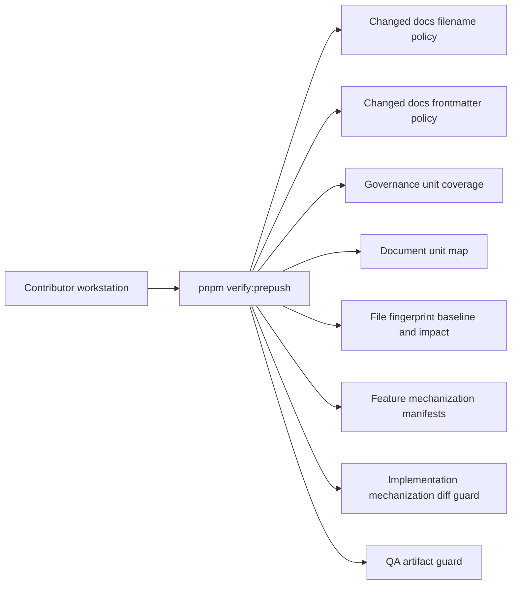
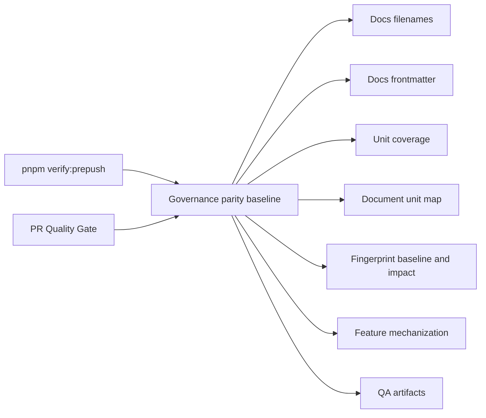
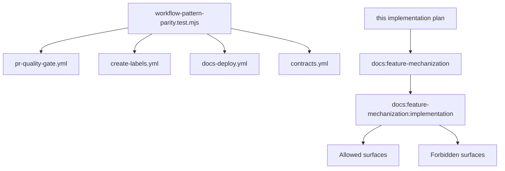

# CI Governance Parity Implementation Plan

## Owned Concern

This plan owns the CI/governance change that makes remote PR checks enforce the
same merge-blocking repository governance subset that local `pnpm
verify:prepush` already enforces. It also owns the small workflow hardening
changes needed to keep CI reproducible and reviewable.

The feature is intentionally repository-governance scoped. It does not change
application behavior, domain runtime contracts, adapters, or browser user
flows.

## Current State

Local pre-push validation already checks governance surfaces that decide whether
a feature is mechanically closed:



Before this implementation, the remote `PR Quality Gate` workflow did not run
all of that subset. The result was a Fowler drift: local completion could depend
on a stricter gate than remote merge review, which created two authorities for
the same quality decision.

## Target State

Remote PR checks and local pre-push checks share the same governance decision
for the repository-level mechanization subset:



Workflow hardening is included because it protects the same CI bounded context:

- `create-labels` uses a SHA-pinned `actions/github-script` reference.
- `docs-deploy` pins the Zensical package version, scopes `contents: write`
  to the single `build-deploy` job, and gates the actual GitHub Pages
  publication behind the explicit `run_pages_deploy` `workflow_dispatch`
  input so a build run cannot push to `gh-pages` unless an operator
  requests it.
- `contracts` no longer carries a hardcoded PostgreSQL password literal; the
  test credential is derived from the GitHub run identity for that run, and
  the parity test asserts both the absence of the prior literal and the
  presence of the run-scoped form so any drift back to a reusable literal
  fails the gate.

## Prepush And PR Quality Parity Map

The merge-blocking governance baseline is the subset of `verify:prepush`
commands whose semantics are workflow-meaningful on a PR (no `--changed-only`
local-only mode, no developer-only typecheck shortcut). Every prepush command
must resolve to one of: in the parity baseline, covered by another step in a
canonical merge-blocking workflow, or declared as an out-of-scope follow-up
below.

| `verify:prepush` command                               | Remote coverage                                                                              | Notes                                                  |
| ------------------------------------------------------ | -------------------------------------------------------------------------------------------- | ------------------------------------------------------ |
| `node scripts/docs-workboard-check-changed.cjs`        | `Validate planning workboard outputs` (`pnpm docs:workboard:check`) in `pr-quality-gate.yml` | Lane-yaml-gated; same drift signal.                    |
| `pnpm docs:gov:locations -- --changed-only`            | `Enforce Markdown location policy` (`pnpm docs:gov:locations`) in `pr-quality-gate.yml`      | Remote runs the full-tree variant.                     |
| `pnpm docs:gov:filenames:changed`                      | Parity baseline                                                                              | Asserted by `workflow-pattern-parity.test.mjs`.        |
| `pnpm docs:gov:frontmatter:changed`                    | Parity baseline                                                                              | Asserted by `workflow-pattern-parity.test.mjs`.        |
| `pnpm docs:gov:generated-policy`                       | Not currently mirrored on any workflow                                                       | Tracked as out-of-scope follow-up `CI-GOV-PARITY-F1`.  |
| `pnpm docs:governance:unit-coverage`                   | Parity baseline                                                                              | Asserted by `workflow-pattern-parity.test.mjs`.        |
| `pnpm docs:governance:document-unit-map:check`         | Parity baseline                                                                              | Asserted by `workflow-pattern-parity.test.mjs`.        |
| `pnpm docs:governance:file-component-index:check`      | Parity baseline                                                                              | Asserted by `workflow-pattern-parity.test.mjs`.        |
| `pnpm docs:governance:file-fingerprint-baseline:check` | Parity baseline                                                                              | Asserted by `workflow-pattern-parity.test.mjs`.        |
| `pnpm docs:governance:file-fingerprint-impact:check`   | Parity baseline                                                                              | Asserted by `workflow-pattern-parity.test.mjs`.        |
| `pnpm docs:feature-mechanization`                      | Parity baseline                                                                              | Asserted by `workflow-pattern-parity.test.mjs`.        |
| `pnpm docs:feature-mechanization:implementation`       | Parity baseline                                                                              | Asserted by `workflow-pattern-parity.test.mjs`.        |
| `pnpm arch:deps`                                       | Parity baseline                                                                              | Asserted by `workflow-pattern-parity.test.mjs`.        |
| `pnpm docs:arc:evidence:check -- --changed-only`       | `ARC docs / evidence validate` (`tools/ci/doc-check.mjs`) in `pr-quality-gate.yml`           | Remote uses ARC JSON instead of `--changed-only`.      |
| `pnpm qa:artifact:check`                               | Parity baseline                                                                              | Asserted by `workflow-pattern-parity.test.mjs`.        |
| `pnpm lint:md:changed`                                 | `Lint changed Markdown` (`pnpm lint:md:changed`) in `ci.yml`                                 | Same script, scoped to PR diff.                        |
| `node scripts/check-changed.cjs`                       | `ci.yml` changed-file ESLint and Prettier jobs                                               | Same lint/format coverage on the diff.                 |
| `node scripts/check-forbidden-tracked-files.cjs`       | `Enforce forbidden generated files policy` in `pr-quality-gate.yml`                          | Identical script invocation.                           |
| `node scripts/type-check-prepush.cjs`                  | `test.yml` affected workspace type-check                                                     | Remote uses affected/full type-check, not the wrapper. |

Inclusion rule for the parity baseline (the constant
`PR_QUALITY_PREPUSH_GOVERNANCE_COMMANDS` in
`tools/ci/workflow-pattern-parity.test.mjs`): the command (a) runs in
`verify:prepush`, (b) has identical remote semantics without `--changed-only`
or developer-only behavior, and (c) is not already a named step in another
canonical merge-blocking workflow. Any prepush command that fails any of those
conditions is documented in the table above with its alternative remote home or
its follow-up identifier.

## Command And Query Catalog

All observable implementation work is bound to the repository CI/governance
bounded context.

| Rail                                      | Type    | DDD owner                                     | Implementation surface                                                     | Expected result                                                                                            |
| ----------------------------------------- | ------- | --------------------------------------------- | -------------------------------------------------------------------------- | ---------------------------------------------------------------------------------------------------------- |
| `CheckPrQualityGovernanceParity`          | query   | Repository CI governance baseline             | `tools/ci/workflow-pattern-parity.test.mjs`                                | Fails when `PR Quality Gate` omits a merge-blocking governance command from `verify:prepush`.              |
| `ApplyPrQualityGovernanceParity`          | command | Repository CI governance baseline             | `.github/workflows/pr-quality-gate.yml`                                    | Adds the missing governance commands to the remote PR workflow.                                            |
| `CheckWorkflowDependencyPins`             | query   | Workflow dependency policy                    | `tools/ci/workflow-pattern-parity.test.mjs`                                | Fails when a workflow uses an unpinned action or unpinned docs builder dependency covered by this feature. |
| `ApplyWorkflowDependencyPins`             | command | Workflow dependency policy                    | `.github/workflows/create-labels.yml`, `.github/workflows/docs-deploy.yml` | Pins the action and docs builder dependency at reviewed versions.                                          |
| `CheckContractsWorkflowCredentialPosture` | query   | Contracts workflow runtime credential posture | `tools/ci/workflow-pattern-parity.test.mjs`                                | Fails when the contracts workflow reintroduces the hardcoded PostgreSQL password literal.                  |
| `ApplyContractsWorkflowCredentialPosture` | command | Contracts workflow runtime credential posture | `.github/workflows/contracts.yml`                                          | Replaces the literal test password with a run-scoped value.                                                |
| `CheckFeatureMechanizationDiffSurface`    | query   | Feature mechanization diff guard              | `scripts/check-feature-mechanization.cjs`                                  | Fails when this feature changes files outside declared implementation surfaces.                            |

No implementation outside those rails is allowed in this feature.

## DDD Objects

| Object                              | Type                               | Invariants                                                                                                             |
| ----------------------------------- | ---------------------------------- | ---------------------------------------------------------------------------------------------------------------------- |
| `WorkflowGovernanceBaseline`        | Repository governance policy value | The remote PR quality workflow must include every command listed in the parity baseline for this feature.              |
| `WorkflowDependencyPin`             | Workflow configuration value       | The reviewed action/package reference must be exact, not a mutable floating version.                                   |
| `ContractWorkflowRuntimeCredential` | Workflow runtime value             | Test credentials may be generated for an isolated CI run, but the workflow must not store a reusable password literal. |
| `FeatureMechanizationDiffSurface`   | Governance guard aggregate         | Every real diff path must match an allowed surface and must not match a forbidden surface.                             |

## Fowler Review

Improved patterns:

- Single authority for governance completion between local and remote gates.
- Explicit configuration as policy instead of hidden workflow behavior.
- Mechanical tests for workflow posture rather than manual PR memory.
- Reproducible docs deployment dependency selection.

Antipatterns removed or blocked:

- Parallel quality gates with different semantics.
- Floating action/package references in governed workflows.
- Secret-like literals embedded in workflow configuration.
- Feature implementation diff outside an explicit plan.

Remaining non-goals:

- This feature does not configure branch protection in GitHub settings because
  that setting is not stored in tracked repository YAML.
- This feature does not introduce remote Turbo cache because it requires
  repository-owned secrets and a separate operational decision.
- `CI-GOV-PARITY-F1` (follow-up): mirror `pnpm docs:gov:generated-policy` in
  `pr-quality-gate.yml` so the generated-docs policy check stops being a
  prepush-only gate. Out of scope here because it requires triaging the
  current generated-policy failures on `main` before remote enforcement is
  safe.

## Implementation Map



## User Stories

- As a reviewer, I need the PR gate to run the same governance closure checks as
  local `verify:prepush` so I do not approve a PR that only passed locally.
- As a release maintainer, I need workflow action and docs builder versions to
  be pinned so a later upstream release cannot change our CI behavior silently.
- As a security reviewer, I need contracts CI to avoid reusable password
  literals so workflow examples do not normalize secret-like configuration.
- As an implementer, I need the feature mechanization guard to reject CI changes
  outside this declared plan so the implementation remains mechanical.

Negative scenarios:

- If `pr-quality-gate.yml` drops `pnpm docs:feature-mechanization:implementation`,
  the workflow parity test fails.
- If `create-labels.yml` returns to `actions/github-script@v9`, the workflow
  parity test fails.
- If `docs-deploy.yml` returns to `python -m pip install zensical`, the workflow
  parity test fails.
- If `contracts.yml` reintroduces `POSTGRES_PASSWORD: dvt_test` or
  `postgresql://dvt_test:dvt_test@`, the workflow parity test fails.
- If `contracts.yml` replaces the run-scoped `${{ github.run_id }}` form with
  any other reusable literal, the parity test fails its positive
  `POSTGRES_PASSWORD: ${{ github.run_id }}` and `DATABASE_URL` assertions.
- If `docs-deploy.yml` removes the `if: ${{ github.event.inputs.run_pages_deploy
== 'true' }}` gate on the GitHub Pages publish step, the parity test fails
  the dispatch-gate assertion.
- If the diff touches app, package, or contract runtime code, the feature
  mechanization diff guard fails.

## Feature Mechanization Manifest

```feature-mechanization
version: 1
featureId: CI-GOV-PARITY
mechanizationStatus: closed
noHumanDecisionsRemaining: true
implementationPlan: docs/planning/proposals/mandatory/governance-and-docs/ci-governance-parity-implementation-plan-20260502.md
componentGuides:
  - docs/guides/testing-and-ci-capabilities.md
userStories:
  - docs/planning/proposals/mandatory/governance-and-docs/ci-governance-parity-implementation-plan-20260502.md
governingSources:
  - AGENTS.md
  - docs/planning/status/governance-document-rule-inventory.md
  - docs/guides/ai-work-protocol.md
  - docs/guides/testing-and-ci-capabilities.md
  - docs/architecture/command-query-rail-governance.md
  - docs/architecture/fowler-opportunity-planning-governance.md
allowedImplementationSurfaces:
  - .github/workflows/pr-quality-gate.yml
  - .github/workflows/create-labels.yml
  - .github/workflows/docs-deploy.yml
  - .github/workflows/contracts.yml
  - docs/.manifest.json
  - docs/**/index.md
  - docs/guides/testing-and-ci-capabilities.md
  - docs/planning/proposals/mandatory/governance-and-docs/ci-governance-parity-implementation-plan-20260502.md
  - docs/planning/status/**
  - tools/ci/workflow-pattern-parity.test.mjs
forbiddenImplementationSurfaces:
  - apps/**
  - packages/**
  - specs/contracts/**
  - docs/archive/**
commandQueryRails:
  - name: CheckPrQualityGovernanceParity
    type: query
    dddOwner: Repository CI governance baseline
  - name: ApplyPrQualityGovernanceParity
    type: command
    dddOwner: Repository CI governance baseline
  - name: CheckWorkflowDependencyPins
    type: query
    dddOwner: Workflow dependency policy
  - name: ApplyWorkflowDependencyPins
    type: command
    dddOwner: Workflow dependency policy
  - name: CheckContractsWorkflowCredentialPosture
    type: query
    dddOwner: Contracts workflow runtime credential posture
  - name: ApplyContractsWorkflowCredentialPosture
    type: command
    dddOwner: Contracts workflow runtime credential posture
  - name: CheckFeatureMechanizationDiffSurface
    type: query
    dddOwner: Feature mechanization diff guard
domainObjects:
  - name: WorkflowGovernanceBaseline
    type: repository governance value
    owner: Repository CI governance baseline
  - name: WorkflowDependencyPin
    type: workflow configuration value
    owner: Workflow dependency policy
  - name: ContractWorkflowRuntimeCredential
    type: workflow runtime value
    owner: Contracts workflow runtime credential posture
  - name: FeatureMechanizationDiffSurface
    type: governance guard aggregate
    owner: Feature mechanization diff guard
fowlerSignals:
  - Hidden authority
  - Configuration drift
  - Duplicate governance gate
  - Secret-like literal in workflow configuration
  - Non-reproducible workflow dependency
architectureGuards:
  - node --test tools/ci/workflow-pattern-parity.test.mjs
  - pnpm test:ci-tools
  - pnpm docs:feature-mechanization
  - pnpm docs:feature-mechanization:implementation
cypressFlows:
  - N/A - repository CI governance workflow only
completionGate:
  - node --test tools/ci/workflow-pattern-parity.test.mjs
  - pnpm test:ci-tools
  - pnpm docs:sync
  - pnpm docs:gov:manifest
  - pnpm docs:governance:document-unit-map
  - pnpm docs:governance:file-component-index
  - pnpm docs:governance:file-fingerprint-baseline
  - pnpm docs:governance:file-fingerprint-impact
  - pnpm docs:feature-mechanization
  - pnpm docs:feature-mechanization:implementation
  - pnpm verify:prepush
redGreenCycles:
  - id: pr-quality-governance-parity
    redTest: node --test tools/ci/workflow-pattern-parity.test.mjs
    expectedFailure: PR Quality Gate omits one or more merge-blocking governance commands from the prepush baseline.
    patchSurfaces:
      - tools/ci/workflow-pattern-parity.test.mjs
      - .github/workflows/pr-quality-gate.yml
    greenTest: node --test tools/ci/workflow-pattern-parity.test.mjs
  - id: workflow-dependency-pins
    redTest: node --test tools/ci/workflow-pattern-parity.test.mjs
    expectedFailure: create-labels uses a mutable action reference or docs-deploy installs an unpinned Zensical version.
    patchSurfaces:
      - tools/ci/workflow-pattern-parity.test.mjs
      - .github/workflows/create-labels.yml
      - .github/workflows/docs-deploy.yml
    greenTest: node --test tools/ci/workflow-pattern-parity.test.mjs
  - id: contracts-workflow-credential-posture
    redTest: node --test tools/ci/workflow-pattern-parity.test.mjs
    expectedFailure: contracts workflow contains a reusable dvt_test password literal.
    patchSurfaces:
      - tools/ci/workflow-pattern-parity.test.mjs
      - .github/workflows/contracts.yml
    greenTest: node --test tools/ci/workflow-pattern-parity.test.mjs
  - id: feature-mechanization-closeout
    redTest: pnpm docs:feature-mechanization:implementation
    expectedFailure: CI governance changes are outside allowedImplementationSurfaces before this plan declares them.
    patchSurfaces:
      - docs/planning/proposals/mandatory/governance-and-docs/ci-governance-parity-implementation-plan-20260502.md
      - docs/.manifest.json
      - docs/planning/status/**
    greenTest: pnpm docs:feature-mechanization:implementation
symbols:
  - name: PR_QUALITY_PREPUSH_GOVERNANCE_COMMANDS
    path: tools/ci/workflow-pattern-parity.test.mjs
    dddOwner: Repository CI governance baseline
    cqRails:
      - CheckPrQualityGovernanceParity
    fowlerSignals:
      - Duplicate governance gate
      - Hidden authority
    architectureGuard: tools/ci/workflow-pattern-parity.test.mjs
    cypressCoverage: N/A - repository CI governance workflow only
    unitTests:
      - tools/ci/workflow-pattern-parity.test.mjs
```

## Validation Plan

The implementation is complete only when these checks pass without skipped
rules:

```powershell
node --test tools/ci/workflow-pattern-parity.test.mjs
pnpm test:ci-tools
pnpm docs:sync
pnpm docs:gov:manifest
pnpm docs:governance:document-unit-map
pnpm docs:governance:file-component-index
pnpm docs:governance:file-fingerprint-baseline
pnpm docs:governance:file-fingerprint-impact
pnpm docs:feature-mechanization
pnpm docs:feature-mechanization:implementation
pnpm verify:prepush
```
