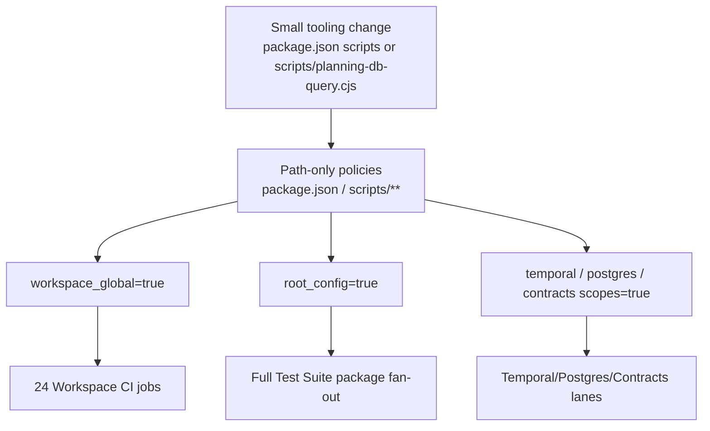
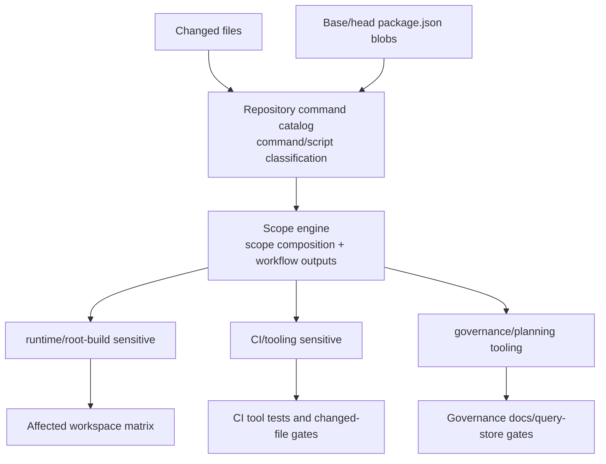

# CI Scope Optimization Implementation Plan

> **For agentic workers:** REQUIRED SUB-SKILL: Use
> superpowers:subagent-driven-development (recommended) or
> superpowers:executing-plans to implement this plan task-by-task. Steps use
> checkbox (`- [ ]`) syntax for tracking.

**Goal:** Reduce unnecessary PR CI fan-out while preserving merge-blocking
coverage for real runtime, contract, root-build, and governance changes.

**2026-05-10 implementation note:** The contracts, adapter-postgres,
determinism, and coverage workflow consumers now read semantic outputs from
`tools/ci/emit-scope.mjs` instead of retaining local `dorny/paths-filter`
package-root rules. The slice closed the shared-consumer migration for
`CI-AUDIT-CONTRACTS-SCOPE`; `CI-AUDIT-ENGINE-COVERAGE` still required the
follow-up engine package canary documented in
`ci-audit-engine-coverage-plan-20260515.md`. Local hook convergence remains
separately governed by `CDG-W1-3`.

**Architecture:** Keep `tools/ci/scope-config.mjs` as the workflow scope API and
orchestrator, but move package-script and script-path semantics into the
repository command catalog defined by the command catalog normalization plan.
`emit-scope.mjs` and `emit-workspace-matrix.mjs` must load semantic context from
`GIT_BASE` and `GIT_HEAD` before computing workflow outputs, so `package.json`
decisions are based on old/new content and catalog classifications rather than
filename presence alone. Workflows keep consuming those stable entrypoints; the
optimization happens behind them and is protected by CI tool contract tests.

**Tech Stack:** GitHub Actions, Node.js `node:test`, `tools/ci/*` scope
helpers, JSON policy files, `pnpm test:ci-tools`, `pnpm verify:prepush`.

---

## Owned Concern

This plan owns PR CI scope classification and workflow fan-out for repository
tooling, package-script, governance, and planning-query-store changes.

It does not change application runtime behavior, contract semantics, adapter
behavior, Temporal worker behavior, or GitHub branch protection settings.

## Dependency And Sequencing Decision

This plan depends on the command taxonomy owned by
`docs/planning/proposals/mandatory/governance-and-docs/repository-command-catalog-normalization-plan-20260508.md`.

## Prerequisite Command Catalog Slice

The repository command catalog normalization plan is the prerequisite for
script and package-command classification. This CI scope optimization slice must
consume the catalog instead of creating another hand-maintained list of
governance, planning, runtime, and CI tooling command names.

Implementation order:

1. Close or co-implement the repository command catalog first:
   `tools/ci/repository-command-catalog.mjs` must classify package scripts,
   root script files, `tools/ci/**`, and `.github/scripts/**` into stable
   domain and CI sensitivity classes.
2. Keep `package.json` as the human command registry; the catalog reads that
   registry and exposes deterministic command classifications.
3. Make `tools/ci/scope-config.mjs` consume catalog classifications and own only
   scope composition, policy loading, git base/head context, and workflow output
   mapping.

This plan must not create a second package-script or script-path classifier in
`scope-config.mjs`. If both plans land in one PR, catalog tests and catalog
exports are implemented before CI scope consumers.

## Triggering Evidence

The PR that merged as `cc8058a9` included a small root package script addition:

```diff
+    "governance:db:query": "node scripts/planning-db-query.cjs",
```

The current scope logic classified that change as all of:

- 24 `Workspace CI (*)` matrix jobs through `workspace_global`;
- `Test Suite` `root_config=true`;
- all Temporal integration capability lanes;
- adapter-postgres integration;
- contracts, determinism, and golden validation.

The root cause is path-only scope classification:

- `tools/ci/policy/workflow-scope.json` includes `package.json` and
  `scripts/**` under `workspace_global`;
- `tools/ci/scope-config.mjs` expands `workspace_global` to every workspace;
- `TEST_SCOPE_PATTERNS.root_config` treats every root `package.json` change as
  a full root test trigger;
- PR quality and contracts scopes include `package.json` without inspecting
  whether dependencies, lifecycle scripts, or only governance command aliases
  changed.

## Current State Diagram



## Target State Diagram



## Command And Query Catalog

<!-- markdownlint-disable MD060 -->

| Rail                                  | Type  | DDD owner                         | Implementation surface                                                  | Expected result                                                                   |
| ------------------------------------- | ----- | --------------------------------- | ----------------------------------------------------------------------- | --------------------------------------------------------------------------------- |
| `ClassifyRepositoryCommand`           | query | Repository command catalog        | `tools/ci/repository-command-catalog.mjs`                               | Classifies package scripts and script-file paths into domain and CI sensitivity.  |
| `ClassifyChangedCiScope`              | query | Repository CI scope policy        | `tools/ci/scope-config.mjs`, `tools/ci/policy/workflow-scope.json`      | Composes catalog classifications and root package base/head blobs into scopes.    |
| `EmitAffectedWorkspaceMatrix`         | query | Repository CI scope policy        | `tools/ci/emit-workspace-matrix.mjs`, `.github/workflows/ci.yml`        | Emits only affected workspace build/typecheck jobs for PRs.                       |
| `EmitWorkflowCapabilityScopes`        | query | Repository CI scope policy        | `tools/ci/emit-scope.mjs`, workflow consumers                           | Emits test, PR-quality, adapter-postgres, and contract scopes from one model.     |
| `ValidateCiScopeOptimizationContract` | query | Repository CI tool contract tests | `tools/ci/workflow-scope-classification.test.mjs`, `pnpm test:ci-tools` | Fails when tooling-only changes reopen runtime-wide CI or skip changed-file lint. |

<!-- markdownlint-enable MD060 -->

No new workflow may introduce a parallel hand-written path filter for a scope
already represented by `tools/ci/scope-config.mjs`, and `scope-config.mjs` must
not reimplement package-script or script-path semantics already represented by
`tools/ci/repository-command-catalog.mjs`.

## Feature Mechanization Manifest

```feature-mechanization
version: 1
featureId: CI-SCOPE-OPTIMIZATION-20260508
mechanizationStatus: closed
noHumanDecisionsRemaining: true
implementationPlan: docs/planning/proposals/mandatory/governance-and-docs/ci-scope-optimization-plan-20260508.md
componentGuides:
  - docs/guides/testing-and-ci-capabilities.md
  - docs/planning/proposals/mandatory/governance-and-docs/repository-command-catalog-normalization-plan-20260508.md
  - docs/planning/proposals/mandatory/governance-and-docs/ci-delivery-governance-consolidated-action-plan-20260331.md
  - docs/architecture/components/ci-governance/system-governance-generation-workflow-component.md
userStories:
  - docs/planning/proposals/mandatory/governance-and-docs/ci-scope-optimization-plan-20260508.md
governingSources:
  - AGENTS.md
  - docs/planning/status/governance-document-rule-inventory.md
  - docs/guides/ai-work-protocol.md
  - docs/guides/testing-and-ci-capabilities.md
  - docs/architecture/command-query-rail-governance.md
  - docs/architecture/fowler-opportunity-planning-governance.md
  - docs/planning/proposals/mandatory/governance-and-docs/repository-command-catalog-normalization-plan-20260508.md
allowedImplementationSurfaces:
  - package.json
  - .husky/pre-push
  - .github/workflows/ci.yml
  - .github/workflows/test.yml
  - .github/workflows/pr-quality-gate.yml
  - .github/workflows/contracts.yml
  - tools/ci/repository-command-catalog.mjs
  - tools/ci/repository-command-catalog.test.mjs
  - tools/ci/scope-config.mjs
  - tools/ci/emit-scope.mjs
  - tools/ci/emit-workspace-matrix.mjs
  - tools/ci/emit-test-matrix.mjs
  - tools/ci/policy/workflow-scope.json
  - tools/ci/policy/adapter-postgres-relevance.json
  - tools/ci/workflow-scope-classification.test.mjs
  - tools/ci/architecture-dependency-guard.test.mjs
  - tools/ci/generated-docs-single-writer-policy.test.mjs
  - tools/ci/workflow-pattern-parity.test.mjs
  - tools/ci/turbo-workspace-task-contract.test.mjs
  - tools/ci/test/path-matcher.test.mjs
  - tools/ci/package-json-scope-classification.test.mjs
  - tools/ci/prepush-typecheck-scope.mjs
  - tools/ci/emit-scope.test.mjs
  - tools/ci/emit-workspace-matrix.test.mjs
  - tools/ci/emit-test-matrix.test.mjs
  - scripts/local-validation-plan.cjs
  - scripts/verify-changed.test.cjs
  - scripts/README.md
  - docs/guides/testing-and-ci-capabilities.md
  - docs/planning/proposals/mandatory/governance-and-docs/repository-command-catalog-normalization-plan-20260508.md
  - docs/planning/proposals/mandatory/governance-and-docs/ci-scope-optimization-plan-20260508.md
  - docs/planning/proposals/mandatory/governance-and-docs/ci-delivery-governance-consolidated-action-plan-20260331.md
  - docs/planning/state/agent-lane-c.yaml
  - docs/planning/status/**
  - docs/.manifest.json
  - docs/**/index.md
forbiddenImplementationSurfaces:
  - apps/**
  - packages/**
  - specs/contracts/**
  - .golden/**
  - docs/archive/**
commandQueryRails:
  - name: ClassifyRepositoryCommand
    type: query
    dddOwner: Repository command catalog
  - name: ClassifyChangedCiScope
    type: query
    dddOwner: Repository CI scope policy
  - name: EmitAffectedWorkspaceMatrix
    type: query
    dddOwner: Repository CI scope policy
  - name: EmitWorkflowCapabilityScopes
    type: query
    dddOwner: Repository CI scope policy
  - name: ValidateCiScopeOptimizationContract
    type: query
    dddOwner: Repository CI tool contract tests
domainObjects:
  - name: RepositoryCommandCatalogClassification
    type: command sensitivity read model
    owner: Repository command catalog
  - name: ChangedFileSet
    type: CI scope input
    owner: Repository CI scope policy
  - name: ChangedScopeContext
    type: semantic CI scope input
    owner: Repository CI scope policy
  - name: PackageJsonChangeClass
    type: semantic scope classifier
    owner: Repository CI scope policy
  - name: ScriptPathChangeClass
    type: semantic scope classifier
    owner: Repository CI scope policy
  - name: WorkspaceMatrix
    type: GitHub Actions matrix read model
    owner: Repository CI scope policy
  - name: WorkflowModeScopeOutputs
    type: GitHub Actions output read model
    owner: Repository CI scope policy
fowlerSignals:
  - Primitive obsession in path-only CI scope decisions
  - Shotgun CI fan-out from root script aliases
  - Duplicate scope authority between workflow paths and local gates
architectureGuards:
  - node --test tools/ci/repository-command-catalog.test.mjs tools/ci/package-json-scope-classification.test.mjs tools/ci/workflow-scope-classification.test.mjs tools/ci/emit-scope.test.mjs tools/ci/emit-workspace-matrix.test.mjs tools/ci/workflow-pattern-parity.test.mjs tools/ci/test/path-matcher.test.mjs
  - pnpm test:ci-tools
  - pnpm docs:feature-mechanization:implementation
cypressFlows:
  - N/A - CI scope tooling only
completionGate:
  - node --test tools/ci/repository-command-catalog.test.mjs tools/ci/package-json-scope-classification.test.mjs tools/ci/workflow-scope-classification.test.mjs tools/ci/emit-scope.test.mjs tools/ci/emit-workspace-matrix.test.mjs tools/ci/workflow-pattern-parity.test.mjs tools/ci/test/path-matcher.test.mjs
  - pnpm test:ci-tools
  - pnpm governance:refresh
  - pnpm docs:feature-mechanization:implementation
  - pnpm verify:prepush
redGreenCycles:
  - id: tooling-only-script-does-not-open-workspace-matrix
    redTest: node --test tools/ci/workflow-scope-classification.test.mjs
    expectedFailure: scripts/planning-db-query.cjs currently expands to every workspace through workspace_global.
    patchSurfaces:
      - tools/ci/repository-command-catalog.mjs
      - tools/ci/repository-command-catalog.test.mjs
      - tools/ci/policy/workflow-scope.json
      - tools/ci/scope-config.mjs
      - tools/ci/workflow-scope-classification.test.mjs
    greenTest: node --test tools/ci/workflow-scope-classification.test.mjs
  - id: command-catalog-is-scope-authority
    redTest: node --test tools/ci/repository-command-catalog.test.mjs tools/ci/package-json-scope-classification.test.mjs
    expectedFailure: package-script and script-path semantics are still derived inside scope-config or workflow policies instead of the repository command catalog.
    patchSurfaces:
      - tools/ci/repository-command-catalog.mjs
      - tools/ci/repository-command-catalog.test.mjs
      - tools/ci/scope-config.mjs
      - tools/ci/package-json-scope-classification.test.mjs
    greenTest: node --test tools/ci/repository-command-catalog.test.mjs tools/ci/package-json-scope-classification.test.mjs
  - id: package-script-alias-does-not-open-runtime-scopes
    redTest: node --test tools/ci/package-json-scope-classification.test.mjs
    expectedFailure: a package.json scripts-only governance alias currently classifies as any_test, root_config, and global runtime scope.
    patchSurfaces:
      - tools/ci/repository-command-catalog.mjs
      - tools/ci/scope-config.mjs
      - tools/ci/emit-scope.mjs
      - tools/ci/emit-workspace-matrix.mjs
      - tools/ci/package-json-scope-classification.test.mjs
      - tools/ci/workflow-scope-classification.test.mjs
    greenTest: node --test tools/ci/package-json-scope-classification.test.mjs tools/ci/workflow-scope-classification.test.mjs
  - id: package-json-scripts-only-does-not-open-any-test
    redTest: node --test tools/ci/workflow-scope-classification.test.mjs
    expectedFailure: any_test still inherits root package.json through ROOT_CONFIG_PATTERNS.
    patchSurfaces:
      - tools/ci/scope-config.mjs
      - tools/ci/workflow-scope-classification.test.mjs
    greenTest: node --test tools/ci/workflow-scope-classification.test.mjs
  - id: package-json-git-blobs-feed-scope
    redTest: node --test tools/ci/package-json-scope-classification.test.mjs
    expectedFailure: emitters currently pass only file names, so package.json scope cannot inspect base/head content.
    patchSurfaces:
      - tools/ci/scope-config.mjs
      - tools/ci/emit-scope.mjs
      - tools/ci/emit-workspace-matrix.mjs
      - tools/ci/package-json-scope-classification.test.mjs
    greenTest: node --test tools/ci/package-json-scope-classification.test.mjs
  - id: package-json-read-failure-fails-closed
    redTest: node --test tools/ci/package-json-scope-classification.test.mjs
    expectedFailure: package.json read or parse failures are not yet converted to conservative root-build and capability-sensitive scope.
    patchSurfaces:
      - tools/ci/repository-command-catalog.mjs
      - tools/ci/scope-config.mjs
      - tools/ci/package-json-scope-classification.test.mjs
    greenTest: node --test tools/ci/package-json-scope-classification.test.mjs
  - id: emitters-use-semantic-context
    redTest: node --test tools/ci/emit-scope.test.mjs tools/ci/emit-workspace-matrix.test.mjs
    expectedFailure: emitters currently pass only changed file names into scope computation and do not prove semantic package-json outputs.
    patchSurfaces:
      - tools/ci/emit-scope.mjs
      - tools/ci/emit-workspace-matrix.mjs
      - tools/ci/emit-scope.test.mjs
      - tools/ci/emit-workspace-matrix.test.mjs
    greenTest: node --test tools/ci/emit-scope.test.mjs tools/ci/emit-workspace-matrix.test.mjs
  - id: changed-file-validation-survives-empty-matrix
    redTest: node --test tools/ci/workflow-scope-classification.test.mjs tools/ci/workflow-pattern-parity.test.mjs
    expectedFailure: a governance/planning script can produce an empty workspace matrix without any CI changed-file validation signal.
    patchSurfaces:
      - .github/workflows/ci.yml
      - tools/ci/scope-config.mjs
      - tools/ci/emit-scope.mjs
      - tools/ci/workflow-scope-classification.test.mjs
      - tools/ci/workflow-pattern-parity.test.mjs
    greenTest: node --test tools/ci/workflow-scope-classification.test.mjs tools/ci/workflow-pattern-parity.test.mjs
  - id: runtime-package-json-still-opens-root-scope
    redTest: node --test tools/ci/package-json-scope-classification.test.mjs
    expectedFailure: dependency, packageManager, lifecycle, and lint-staged changes must remain runtime/root-build sensitive after the classifier split.
    patchSurfaces:
      - tools/ci/scope-config.mjs
      - tools/ci/package-json-scope-classification.test.mjs
    greenTest: node --test tools/ci/package-json-scope-classification.test.mjs
  - id: adapter-postgres-and-contracts-use-semantic-scope
    redTest: node --test tools/ci/workflow-pattern-parity.test.mjs tools/ci/test/path-matcher.test.mjs
    expectedFailure: adapter-postgres and contracts workflows still use path-only filters for package.json.
    patchSurfaces:
      - .github/workflows/test.yml
      - .github/workflows/contracts.yml
      - tools/ci/scope-config.mjs
      - tools/ci/emit-scope.mjs
      - tools/ci/workflow-pattern-parity.test.mjs
      - tools/ci/test/path-matcher.test.mjs
    greenTest: node --test tools/ci/workflow-pattern-parity.test.mjs tools/ci/test/path-matcher.test.mjs
  - id: test-workflow-determinism-and-coverage-use-semantic-scope
    redTest: node --test tools/ci/workflow-pattern-parity.test.mjs
    expectedFailure: test.yml still uses inline paths-filter package.json rules for determinism and coverage.
    patchSurfaces:
      - .github/workflows/test.yml
      - tools/ci/emit-scope.mjs
      - tools/ci/workflow-pattern-parity.test.mjs
    greenTest: node --test tools/ci/workflow-pattern-parity.test.mjs
  - id: workflow-parity-docs
    redTest: pnpm docs:feature-mechanization:implementation
    expectedFailure: workflow and scope policy changes are outside allowedImplementationSurfaces before this manifest declares them.
    patchSurfaces:
      - docs/planning/proposals/mandatory/governance-and-docs/ci-scope-optimization-plan-20260508.md
      - docs/guides/testing-and-ci-capabilities.md
      - docs/planning/status/**
    greenTest: pnpm docs:feature-mechanization:implementation
symbols:
  - name: readJsonAtGitRef
    path: tools/ci/scope-config.mjs
    dddOwner: ChangedScopeContext
    cqRails:
      - ClassifyChangedCiScope
    fowlerSignals:
      - Primitive obsession in path-only CI scope decisions
    architectureGuard: node --test tools/ci/package-json-scope-classification.test.mjs
    cypressCoverage: N/A - CI scope tooling only
    unitTests:
      - node --test tools/ci/package-json-scope-classification.test.mjs
  - name: buildChangedScopeContext
    path: tools/ci/scope-config.mjs
    dddOwner: ChangedScopeContext
    cqRails:
      - ClassifyChangedCiScope
    fowlerSignals:
      - Duplicate scope authority between workflow paths and local gates
    architectureGuard: node --test tools/ci/package-json-scope-classification.test.mjs tools/ci/workflow-scope-classification.test.mjs
    cypressCoverage: N/A - CI scope tooling only
    unitTests:
      - node --test tools/ci/package-json-scope-classification.test.mjs tools/ci/workflow-scope-classification.test.mjs
  - name: classifyPackageJsonChange
    path: tools/ci/repository-command-catalog.mjs
    dddOwner: PackageJsonChangeClass
    cqRails:
      - ClassifyRepositoryCommand
      - ClassifyChangedCiScope
    fowlerSignals:
      - Primitive obsession in path-only CI scope decisions
    architectureGuard: node --test tools/ci/package-json-scope-classification.test.mjs
    cypressCoverage: N/A - CI scope tooling only
    unitTests:
      - node --test tools/ci/package-json-scope-classification.test.mjs
  - name: isDeterminismJobScript
    path: tools/ci/scope-config.mjs
    dddOwner: WorkflowModeScopeOutputs
    cqRails:
      - EmitWorkflowCapabilityScopes
    fowlerSignals:
      - Primitive obsession in package-root CI scope decisions
    architectureGuard: node --test tools/ci/emit-scope.test.mjs
    cypressCoverage: N/A - CI scope tooling only
    unitTests:
      - node --test tools/ci/emit-scope.test.mjs
  - name: classifyScriptPathChange
    path: tools/ci/repository-command-catalog.mjs
    dddOwner: ScriptPathChangeClass
    cqRails:
      - ClassifyRepositoryCommand
      - ClassifyChangedCiScope
    fowlerSignals:
      - Shotgun CI fan-out from root script aliases
    architectureGuard: node --test tools/ci/workflow-scope-classification.test.mjs
    cypressCoverage: N/A - CI scope tooling only
    unitTests:
      - node --test tools/ci/workflow-scope-classification.test.mjs
  - name: computeWorkspaceMatrix
    path: tools/ci/scope-config.mjs
    dddOwner: WorkspaceMatrix
    cqRails:
      - EmitAffectedWorkspaceMatrix
    fowlerSignals:
      - Duplicate scope authority between workflow paths and local gates
    architectureGuard: node --test tools/ci/workflow-scope-classification.test.mjs
    cypressCoverage: N/A - CI scope tooling only
    unitTests:
      - node --test tools/ci/workflow-scope-classification.test.mjs
  - name: computeBooleanScope
    path: tools/ci/scope-config.mjs
    dddOwner: ChangedFileSet
    cqRails:
      - EmitWorkflowCapabilityScopes
    fowlerSignals:
      - Primitive obsession in path-only CI scope decisions
    architectureGuard: node --test tools/ci/test/path-matcher.test.mjs
    cypressCoverage: N/A - CI scope tooling only
    unitTests:
      - node --test tools/ci/test/path-matcher.test.mjs
  - name: TEST_ROOT_BUILD_PATTERNS
    path: tools/ci/scope-config.mjs
    dddOwner: WorkflowModeScopeOutputs
    cqRails:
      - EmitWorkflowCapabilityScopes
    fowlerSignals:
      - Duplicate scope authority between workflow paths and local gates
    architectureGuard: node --test tools/ci/emit-scope.test.mjs tools/ci/workflow-pattern-parity.test.mjs
    cypressCoverage: N/A - CI scope tooling only
    unitTests:
      - node --test tools/ci/emit-scope.test.mjs tools/ci/workflow-pattern-parity.test.mjs
  - name: TEST_DETERMINISM_PATTERNS
    path: tools/ci/scope-config.mjs
    dddOwner: WorkflowModeScopeOutputs
    cqRails:
      - EmitWorkflowCapabilityScopes
    fowlerSignals:
      - Duplicate scope authority between workflow paths and local gates
    architectureGuard: node --test tools/ci/emit-scope.test.mjs tools/ci/workflow-pattern-parity.test.mjs
    cypressCoverage: N/A - CI scope tooling only
    unitTests:
      - node --test tools/ci/emit-scope.test.mjs tools/ci/workflow-pattern-parity.test.mjs
  - name: TEST_COVERAGE_PATTERNS
    path: tools/ci/scope-config.mjs
    dddOwner: WorkflowModeScopeOutputs
    cqRails:
      - EmitWorkflowCapabilityScopes
    fowlerSignals:
      - Duplicate scope authority between workflow paths and local gates
    architectureGuard: node --test tools/ci/emit-scope.test.mjs tools/ci/workflow-pattern-parity.test.mjs
    cypressCoverage: N/A - CI scope tooling only
    unitTests:
      - node --test tools/ci/emit-scope.test.mjs tools/ci/workflow-pattern-parity.test.mjs
  - name: PR_QUALITY_ROOT_BUILD_PATTERNS
    path: tools/ci/scope-config.mjs
    dddOwner: WorkflowModeScopeOutputs
    cqRails:
      - EmitWorkflowCapabilityScopes
    fowlerSignals:
      - Duplicate scope authority between workflow paths and local gates
    architectureGuard: node --test tools/ci/emit-scope.test.mjs tools/ci/workflow-pattern-parity.test.mjs
    cypressCoverage: N/A - CI scope tooling only
    unitTests:
      - node --test tools/ci/emit-scope.test.mjs tools/ci/workflow-pattern-parity.test.mjs
  - name: PR_QUALITY_CI_TOOLING_PATTERNS
    path: tools/ci/scope-config.mjs
    dddOwner: WorkflowModeScopeOutputs
    cqRails:
      - EmitWorkflowCapabilityScopes
    fowlerSignals:
      - Duplicate scope authority between workflow paths and local gates
    architectureGuard: node --test tools/ci/emit-scope.test.mjs tools/ci/workflow-pattern-parity.test.mjs
    cypressCoverage: N/A - CI scope tooling only
    unitTests:
      - node --test tools/ci/emit-scope.test.mjs tools/ci/workflow-pattern-parity.test.mjs
  - name: PR_QUALITY_GOVERNANCE_TOOLING_PATTERNS
    path: tools/ci/scope-config.mjs
    dddOwner: WorkflowModeScopeOutputs
    cqRails:
      - EmitWorkflowCapabilityScopes
    fowlerSignals:
      - Duplicate scope authority between workflow paths and local gates
    architectureGuard: node --test tools/ci/emit-scope.test.mjs tools/ci/workflow-pattern-parity.test.mjs
    cypressCoverage: N/A - CI scope tooling only
    unitTests:
      - node --test tools/ci/emit-scope.test.mjs tools/ci/workflow-pattern-parity.test.mjs
  - name: computeWorkflowModeScopeOutputs
    path: tools/ci/scope-config.mjs
    dddOwner: WorkflowModeScopeOutputs
    cqRails:
      - EmitWorkflowCapabilityScopes
    fowlerSignals:
      - Duplicate scope authority between workflow paths and local gates
    architectureGuard: node --test tools/ci/emit-scope.test.mjs tools/ci/workflow-pattern-parity.test.mjs
    cypressCoverage: N/A - CI scope tooling only
    unitTests:
      - node --test tools/ci/emit-scope.test.mjs
  - name: packageJsonScriptChange
    path: tools/ci/emit-scope.test.mjs
    dddOwner: ValidateCiScopeOptimizationContract
    cqRails:
      - ValidateCiScopeOptimizationContract
    fowlerSignals:
      - Primitive obsession in package-root CI scope decisions
    architectureGuard: node --test tools/ci/emit-scope.test.mjs
    cypressCoverage: N/A - CI scope tooling only
    unitTests:
      - node --test tools/ci/emit-scope.test.mjs
  - name: EXCLUDED_TEST_PACKAGE_NAMES
    path: tools/ci/scope-config.mjs
    dddOwner: TestPackageMatrix
    cqRails:
      - EmitWorkflowCapabilityScopes
    fowlerSignals:
      - Keep explicit runtime lanes out of package matrix duplication
    architectureGuard: node --test tools/ci/emit-test-matrix.test.mjs
    cypressCoverage: N/A - CI scope tooling only
    unitTests:
      - node --test tools/ci/emit-test-matrix.test.mjs
  - name: TEST_PACKAGE_ENTRIES
    path: tools/ci/scope-config.mjs
    dddOwner: TestPackageMatrix
    cqRails:
      - EmitWorkflowCapabilityScopes
    fowlerSignals:
      - Replace duplicated package test workflow steps with a governed matrix
    architectureGuard: node --test tools/ci/emit-test-matrix.test.mjs
    cypressCoverage: N/A - CI scope tooling only
    unitTests:
      - node --test tools/ci/emit-test-matrix.test.mjs
  - name: computeTestPackageMatrix
    path: tools/ci/scope-config.mjs
    dddOwner: TestPackageMatrix
    cqRails:
      - EmitWorkflowCapabilityScopes
    fowlerSignals:
      - Compose package test fan-out from shared scope outputs
    architectureGuard: node --test tools/ci/emit-test-matrix.test.mjs
    cypressCoverage: N/A - CI scope tooling only
    unitTests:
      - node --test tools/ci/emit-test-matrix.test.mjs
  - name: buildTestMatrixOutputs
    path: tools/ci/emit-test-matrix.mjs
    dddOwner: TestPackageMatrix
    cqRails:
      - EmitWorkflowCapabilityScopes
    fowlerSignals:
      - Keep workflow matrix emission behind a testable function
    architectureGuard: node --test tools/ci/emit-test-matrix.test.mjs
    cypressCoverage: N/A - CI scope tooling only
    unitTests:
      - node --test tools/ci/emit-test-matrix.test.mjs
  - name: main
    path: tools/ci/emit-test-matrix.mjs
    dddOwner: TestPackageMatrix
    cqRails:
      - EmitWorkflowCapabilityScopes
    fowlerSignals:
      - Emit GitHub Actions outputs from the governed CI scope model
    architectureGuard: node --test tools/ci/emit-test-matrix.test.mjs
    cypressCoverage: N/A - CI scope tooling only
    unitTests:
      - node --test tools/ci/emit-test-matrix.test.mjs
  - name: DEDICATED_TEST_PACKAGES
    path: tools/ci/emit-test-matrix.test.mjs
    dddOwner: ValidateCiScopeOptimizationContract
    cqRails:
      - ValidateCiScopeOptimizationContract
    fowlerSignals:
      - Guard explicit workflow lanes against duplicate matrix ownership
    architectureGuard: node --test tools/ci/emit-test-matrix.test.mjs
    cypressCoverage: N/A - CI scope tooling only
    unitTests:
      - node --test tools/ci/emit-test-matrix.test.mjs
  - name: collectWorkspaceTestPackages
    path: tools/ci/emit-test-matrix.test.mjs
    dddOwner: ValidateCiScopeOptimizationContract
    cqRails:
      - ValidateCiScopeOptimizationContract
    fowlerSignals:
      - Prove every workspace package test script is represented
    architectureGuard: node --test tools/ci/emit-test-matrix.test.mjs
    cypressCoverage: N/A - CI scope tooling only
    unitTests:
      - node --test tools/ci/emit-test-matrix.test.mjs
  - name: collectWorkspacePackagesByName
    path: tools/ci/emit-test-matrix.test.mjs
    dddOwner: ValidateCiScopeOptimizationContract
    cqRails:
      - ValidateCiScopeOptimizationContract
    fowlerSignals:
      - Prevent matrix entries for workspaces without test scripts
    architectureGuard: node --test tools/ci/emit-test-matrix.test.mjs
    cypressCoverage: N/A - CI scope tooling only
    unitTests:
      - node --test tools/ci/emit-test-matrix.test.mjs
  - name: repoRoot
    path: scripts/local-validation-plan.cjs
    dddOwner: LocalValidationPlan
    cqRails:
      - ValidateCiScopeOptimizationContract
    fowlerSignals:
      - Keep local validation execution rooted at the repository boundary
    architectureGuard: node --test scripts/verify-prepush.test.cjs scripts/verify-changed.test.cjs
    cypressCoverage: N/A - local CI tooling only
    unitTests:
      - node --test scripts/verify-prepush.test.cjs scripts/verify-changed.test.cjs
  - name: path
    path: scripts/local-validation-plan.cjs
    dddOwner: LocalValidationPlan
    cqRails:
      - ValidateCiScopeOptimizationContract
    fowlerSignals:
      - Keep repository-root resolution explicit in the shared validation module
    architectureGuard: node --test scripts/verify-prepush.test.cjs scripts/verify-changed.test.cjs
    cypressCoverage: N/A - local CI tooling only
    unitTests:
      - node --test scripts/verify-prepush.test.cjs scripts/verify-changed.test.cjs
  - name: step
    path: scripts/local-validation-plan.cjs
    dddOwner: LocalValidationPlan
    cqRails:
      - ValidateCiScopeOptimizationContract
    fowlerSignals:
      - Replace duplicated command object literals with a single step factory
    architectureGuard: node --test scripts/verify-prepush.test.cjs scripts/verify-changed.test.cjs
    cypressCoverage: N/A - local CI tooling only
    unitTests:
      - node --test scripts/verify-prepush.test.cjs scripts/verify-changed.test.cjs
  - name: MECHANICAL_PREPUSH_STEPS
    path: scripts/local-validation-plan.cjs
    dddOwner: LocalValidationPlan
    cqRails:
      - ValidateCiScopeOptimizationContract
    fowlerSignals:
      - Separate mechanical local pre-push checks from full closeout validation
    architectureGuard: node --test scripts/verify-prepush.test.cjs
    cypressCoverage: N/A - local CI tooling only
    unitTests:
      - node --test scripts/verify-prepush.test.cjs
  - name: VERIFY_CHANGED_BASE_STEPS
    path: scripts/local-validation-plan.cjs
    dddOwner: LocalValidationPlan
    cqRails:
      - ValidateCiScopeOptimizationContract
    fowlerSignals:
      - Keep fast changed-slice verification declarative
    architectureGuard: node --test scripts/verify-changed.test.cjs
    cypressCoverage: N/A - local CI tooling only
    unitTests:
      - node --test scripts/verify-changed.test.cjs
  - name: PREPUSH_GROUPS
    path: scripts/local-validation-plan.cjs
    dddOwner: LocalValidationPlan
    cqRails:
      - ValidateCiScopeOptimizationContract
    fowlerSignals:
      - Group expensive closeout checks behind full pre-push mode
    architectureGuard: node --test scripts/verify-prepush.test.cjs
    cypressCoverage: N/A - local CI tooling only
    unitTests:
      - node --test scripts/verify-prepush.test.cjs
  - name: VERIFY_CHANGED_GROUPS
    path: scripts/local-validation-plan.cjs
    dddOwner: LocalValidationPlan
    cqRails:
      - ValidateCiScopeOptimizationContract
    fowlerSignals:
      - Keep scoped planning and verifier self-tests out of the base wrapper
    architectureGuard: node --test scripts/verify-changed.test.cjs
    cypressCoverage: N/A - local CI tooling only
    unitTests:
      - node --test scripts/verify-changed.test.cjs
  - name: normalizeChangedFiles
    path: scripts/local-validation-plan.cjs
    dddOwner: LocalChangedFileSet
    cqRails:
      - ValidateCiScopeOptimizationContract
    fowlerSignals:
      - Avoid duplicate path normalization between local validation wrappers
    architectureGuard: node --test scripts/verify-changed.test.cjs
    cypressCoverage: N/A - local CI tooling only
    unitTests:
      - node --test scripts/verify-changed.test.cjs
  - name: matchesAny
    path: scripts/local-validation-plan.cjs
    dddOwner: LocalChangedFileSet
    cqRails:
      - ValidateCiScopeOptimizationContract
    fowlerSignals:
      - Centralize local changed-path predicates
    architectureGuard: node --test scripts/verify-changed.test.cjs
    cypressCoverage: N/A - local CI tooling only
    unitTests:
      - node --test scripts/verify-changed.test.cjs
  - name: hasPlanningDbChange
    path: scripts/local-validation-plan.cjs
    dddOwner: LocalChangedFileSet
    cqRails:
      - ValidateCiScopeOptimizationContract
    fowlerSignals:
      - Keep planning DB validation scoped to planning/query-store surfaces
    architectureGuard: node --test scripts/verify-changed.test.cjs
    cypressCoverage: N/A - local CI tooling only
    unitTests:
      - node --test scripts/verify-changed.test.cjs
  - name: hasDeveloperWorkflowVerifierChange
    path: scripts/local-validation-plan.cjs
    dddOwner: LocalChangedFileSet
    cqRails:
      - ValidateCiScopeOptimizationContract
    fowlerSignals:
      - Run local verifier self-tests only when the verifier changes
    architectureGuard: node --test scripts/verify-changed.test.cjs
    cypressCoverage: N/A - local CI tooling only
    unitTests:
      - node --test scripts/verify-changed.test.cjs
  - name: pushStepOnce
    path: scripts/local-validation-plan.cjs
    dddOwner: LocalValidationPlan
    cqRails:
      - ValidateCiScopeOptimizationContract
    fowlerSignals:
      - Avoid duplicate local validation commands after grouping
    architectureGuard: node --test scripts/verify-prepush.test.cjs scripts/verify-changed.test.cjs
    cypressCoverage: N/A - local CI tooling only
    unitTests:
      - node --test scripts/verify-prepush.test.cjs scripts/verify-changed.test.cjs
  - name: pushSteps
    path: scripts/local-validation-plan.cjs
    dddOwner: LocalValidationPlan
    cqRails:
      - ValidateCiScopeOptimizationContract
    fowlerSignals:
      - Compose validation groups without duplicating loop logic
    architectureGuard: node --test scripts/verify-prepush.test.cjs scripts/verify-changed.test.cjs
    cypressCoverage: N/A - local CI tooling only
    unitTests:
      - node --test scripts/verify-prepush.test.cjs scripts/verify-changed.test.cjs
  - name: classifyPrepushScope
    path: scripts/local-validation-plan.cjs
    dddOwner: LocalValidationPlan
    cqRails:
      - ValidateCiScopeOptimizationContract
    fowlerSignals:
      - Make full pre-push the explicit closeout path
    architectureGuard: node --test scripts/verify-prepush.test.cjs
    cypressCoverage: N/A - local CI tooling only
    unitTests:
      - node --test scripts/verify-prepush.test.cjs
  - name: buildPrepushPlan
    path: scripts/local-validation-plan.cjs
    dddOwner: LocalValidationPlan
    cqRails:
      - ValidateCiScopeOptimizationContract
    fowlerSignals:
      - Build mechanical and full local pre-push plans from one table
    architectureGuard: node --test scripts/verify-prepush.test.cjs
    cypressCoverage: N/A - local CI tooling only
    unitTests:
      - node --test scripts/verify-prepush.test.cjs
  - name: buildVerifyChangedPlan
    path: scripts/local-validation-plan.cjs
    dddOwner: LocalValidationPlan
    cqRails:
      - ValidateCiScopeOptimizationContract
    fowlerSignals:
      - Keep local changed verification as a focused plan builder
    architectureGuard: node --test scripts/verify-changed.test.cjs
    cypressCoverage: N/A - local CI tooling only
    unitTests:
      - node --test scripts/verify-changed.test.cjs
  - name: commandLabel
    path: scripts/local-validation-plan.cjs
    dddOwner: LocalValidationPlan
    cqRails:
      - ValidateCiScopeOptimizationContract
    fowlerSignals:
      - Share operator-facing command labels across local validation wrappers
    architectureGuard: node --test scripts/verify-prepush.test.cjs scripts/verify-changed.test.cjs
    cypressCoverage: N/A - local CI tooling only
    unitTests:
      - node --test scripts/verify-prepush.test.cjs scripts/verify-changed.test.cjs
  - name: executeCommandPlan
    path: scripts/local-validation-plan.cjs
    dddOwner: LocalValidationPlan
    cqRails:
      - ValidateCiScopeOptimizationContract
    fowlerSignals:
      - Remove duplicated spawn/error handling from local validation wrappers
    architectureGuard: node --test scripts/verify-prepush.test.cjs scripts/verify-changed.test.cjs
    cypressCoverage: N/A - local CI tooling only
    unitTests:
      - node --test scripts/verify-prepush.test.cjs scripts/verify-changed.test.cjs
  - name: PLANNING_WORKFLOW_SCRIPT_TESTS
    path: scripts/local-validation-plan.cjs
    dddOwner: LocalValidationPlan
    cqRails:
      - ValidateCiScopeOptimizationContract
    fowlerSignals:
      - Route planning workflow script edits to focused adjacent tests
    architectureGuard: node --test scripts/verify-changed.test.cjs
    cypressCoverage: N/A - local CI tooling only
    unitTests:
      - node --test scripts/verify-changed.test.cjs
  - name: hasPlanningDbFullSuiteChange
    path: scripts/local-validation-plan.cjs
    dddOwner: LocalValidationPlan
    cqRails:
      - ValidateCiScopeOptimizationContract
    fowlerSignals:
      - Keep full planning DB tests scoped to DB implementation surfaces
    architectureGuard: node --test scripts/verify-changed.test.cjs
    cypressCoverage: N/A - local CI tooling only
    unitTests:
      - node --test scripts/verify-changed.test.cjs
  - name: planningWorkflowTestSteps
    path: scripts/local-validation-plan.cjs
    dddOwner: LocalValidationPlan
    cqRails:
      - ValidateCiScopeOptimizationContract
    fowlerSignals:
      - Convert changed planning workflow scripts into focused test steps
    architectureGuard: node --test scripts/verify-changed.test.cjs
    cypressCoverage: N/A - local CI tooling only
    unitTests:
      - node --test scripts/verify-changed.test.cjs
```

## File Structure

- Create or modify `tools/ci/repository-command-catalog.mjs`: own package
  script, repository script path, `tools/ci/**`, and `.github/scripts/**`
  classification. This is the only module that decides whether a command is
  runtime/root-build, CI-tooling, governance/planning-tooling, or
  capability-sensitive.
- Create or modify `tools/ci/repository-command-catalog.test.mjs`: proves every
  current package script and repository script path has a catalog class.
- Modify `tools/ci/scope-config.mjs`: consume repository command catalog
  classifications and add the base/head scope context loader that can read
  `package.json` blobs from git. It must not duplicate package-script or
  script-path semantics.
- Modify `package.json`: extend `test:ci-tools` so it runs both
  `tools/ci/*.test.mjs` and `tools/ci/test/*.test.mjs`.
- Modify `tools/ci/policy/workflow-scope.json`: replace broad `scripts/**`
  workspace global scope with explicit runtime/build-sensitive script paths.
- Modify `tools/ci/policy/adapter-postgres-relevance.json`: keep
  adapter-postgres path ownership data only; remove root `package.json` as an
  unconditional adapter-postgres trigger after `test.yml` consumes semantic
  outputs.
- Modify `tools/ci/emit-scope.mjs`: emit the new semantic booleans without
  changing existing consumer names until workflow consumers are migrated; it
  must build the semantic scope context from `GIT_BASE` and `GIT_HEAD` before
  calling scope functions.
- Modify `tools/ci/emit-workspace-matrix.mjs`: keep the output shape stable,
  but pass semantic context into matrix calculation so root package changes can
  be narrowed safely.
- Modify `.github/workflows/ci.yml`: keep the matrix consumer unchanged, add a
  separate changed-file-validation signal for script/tooling-only changes, and
  use it to keep ESLint/Prettier changed-file validation running when the
  workspace matrix is empty.
- Modify `.github/workflows/test.yml`: replace broad `root_config`,
  adapter-postgres `paths-filter`, determinism `paths-filter`, and coverage
  `paths-filter` decisions with shared semantic outputs.
- Modify `.github/workflows/pr-quality-gate.yml`: stop Temporal integration
  lanes from treating unrelated root package aliases and unrelated `tools/ci/**`
  edits as capability changes.
- Modify `.github/workflows/contracts.yml`: replace inline `paths-filter`
  package-root rules with `emit-scope.mjs --mode contracts` outputs.
- Create `tools/ci/package-json-scope-classification.test.mjs`: tests package
  script, dependency, override, lifecycle, and lint-staged scenarios.
- Create `tools/ci/emit-scope.test.mjs`: tests mode output mapping and semantic
  emitter behavior.
- Create `tools/ci/emit-workspace-matrix.test.mjs`: tests matrix emitter
  behavior with semantic package context.
- Modify `tools/ci/workflow-scope-classification.test.mjs`: tests script path
  classes, `any_test`, changed-file validation, and workspace matrix size.
- Modify `tools/ci/workflow-pattern-parity.test.mjs`: verifies workflows still
  consume centralized scope outputs and do not reintroduce broad inline filters.
- Modify `tools/ci/test/path-matcher.test.mjs`: verifies PR-quality capability
  isolation; this file may remain under `tools/ci/test/` only if
  `pnpm test:ci-tools` runs nested CI tool tests.
- Modify `docs/guides/testing-and-ci-capabilities.md`: documents the new scope
  classes and expected CI behavior.

## Implementation Tasks

### Task 1: Baseline Scope Regression Tests

**Files:**

- Modify: `tools/ci/workflow-scope-classification.test.mjs`
- Test: `tools/ci/workflow-scope-classification.test.mjs`

- [ ] **Step 1: Add failing matrix tests for tooling-only paths**

Add tests that express the intended behavior:

```js
test('governance and planning scripts do not open the workspace matrix', () => {
  for (const file of [
    'scripts/generate-governance-coverage-report.cjs',
    'scripts/generate-governance-remediation-queue.cjs',
    'scripts/planning-db-query.cjs',
  ]) {
    const matrix = computeWorkspaceMatrix([file]);
    assert.equal(matrix.anyChanged, false);
    assert.deepEqual(matrix.include, []);
  }
});
```

- [ ] **Step 2: Add changed-file validation coverage for those paths**

The workspace matrix must be empty, but the changed-file validation rail must
still run for changed repository scripts:

```js
test('governance and planning scripts still trigger changed-file validation', () => {
  const scope = computeBooleanScope(['scripts/planning-db-query.cjs'], WORKFLOW_SCOPE_PATTERNS);

  assert.equal(scope.changed_file_validation_relevant, true);
  assert.equal(scope.any_code, false);
});
```

- [ ] **Step 3: Add package-json scripts-only test-scope coverage**

The Test Suite must not run for a root `package.json` change that only adds a
governance/planning alias:

```js
test('package json scripts-only governance aliases do not open test scope', () => {
  const scriptsOnlyContext = {
    packageJsonChange: {
      packageScriptsOnly: true,
      rootBuildSensitive: false,
      dependencySensitive: false,
      lifecycleSensitive: false,
      ciToolingSensitive: false,
      governanceToolingOnly: true,
      temporalCapabilitySensitive: false,
      postgresCapabilitySensitive: false,
      contractCapabilitySensitive: false,
    },
  };

  const scope = computeBooleanScope(['package.json'], TEST_SCOPE_PATTERNS, scriptsOnlyContext);

  assert.equal(scope.any_test, false);
  assert.equal(scope.root_config, false);
});
```

- [ ] **Step 4: Run the red test**

Run:

```bash
node --test tools/ci/workflow-scope-classification.test.mjs
```

Expected before implementation: failure showing those scripts currently expand
to all workspace entries, `package.json` scripts-only changes still set
`any_test`, and/or `changed_file_validation_relevant` is not yet emitted.

- [ ] **Step 5: Add positive control tests**

Add tests proving runtime work still opens the right workspace:

```js
test('runtime workspace paths still open only their owning workspace', () => {
  assert.deepEqual(computeWorkspaceMatrix(['apps/web/src/main.tsx']).include, [
    { name: 'web', pkg: '@dvt/web' },
  ]);
  assert.deepEqual(computeWorkspaceMatrix(['packages/@dvt/planner/src/index.ts']).include, [
    { name: 'planner', pkg: '@dvt/planner' },
  ]);
});
```

- [ ] **Step 6: Leave the test failing until Task 3**

Do not weaken assertions. The red state is the evidence that the current CI
scope is over-broad.

### Task 2: Repository Command Catalog And Package JSON Classification Tests

**Files:**

- Create: `tools/ci/package-json-scope-classification.test.mjs`
- Create or modify: `tools/ci/repository-command-catalog.mjs`
- Create or modify: `tools/ci/repository-command-catalog.test.mjs`
- Modify: `tools/ci/scope-config.mjs`
- Modify: `package.json`
- Test: `tools/ci/repository-command-catalog.test.mjs`
- Test: `tools/ci/package-json-scope-classification.test.mjs`

- [ ] **Step 1: Add a test harness for before/after package JSON content**

Create the test file with helper fixtures:

```js
import assert from 'node:assert/strict';
import test from 'node:test';

import { buildChangedScopeContext } from './scope-config.mjs';
import { classifyPackageJsonChange } from './repository-command-catalog.mjs';

const basePackage = {
  scripts: {
    build: 'turbo run build',
    test: 'pnpm -r test',
  },
  dependencies: { pg: '^8.16.3' },
  devDependencies: { typescript: '5.9.3' },
  pnpm: { overrides: { semver: '7.7.4' } },
};

function clone(value) {
  return JSON.parse(JSON.stringify(value));
}
```

- [ ] **Step 2: Add the scripts-only governance alias test**

```js
test('governance query alias is tooling-only package change', () => {
  const next = clone(basePackage);
  next.scripts['governance:db:query'] = 'node scripts/planning-db-query.cjs';

  const classification = classifyPackageJsonChange(basePackage, next);

  assert.equal(classification.packageScriptsOnly, true);
  assert.equal(classification.rootBuildSensitive, false);
  assert.equal(classification.dependencySensitive, false);
  assert.equal(classification.lifecycleSensitive, false);
  assert.equal(classification.ciToolingSensitive, false);
  assert.equal(classification.governanceToolingOnly, true);
});
```

- [ ] **Step 2A: Add CI-tooling positive control**

```js
test('ci helper script alias is CI-tooling sensitive but not root-build by default', () => {
  const next = clone(basePackage);
  next.scripts['ci:scope'] = 'node tools/ci/emit-scope.mjs --mode workflow';

  const classification = classifyPackageJsonChange(basePackage, next);

  assert.equal(classification.packageScriptsOnly, true);
  assert.equal(classification.rootBuildSensitive, false);
  assert.equal(classification.ciToolingSensitive, true);
  assert.equal(classification.governanceToolingOnly, false);
});
```

- [ ] **Step 3: Add base/head scope context tests**

The semantic classifier must be reachable from the same inputs CI has:
`GIT_BASE`, `GIT_HEAD`, and changed file names. Add a test that injects a
deterministic package reader so the test does not depend on repository history:

```js
test('changed scope context reads package json content when package changed', async () => {
  const next = clone(basePackage);
  next.scripts['governance:db:query'] = 'node scripts/planning-db-query.cjs';

  const context = await buildChangedScopeContext({
    baseRef: 'base',
    headRef: 'head',
    changedFiles: ['package.json'],
    readJsonAtRef: async (ref, filePath) => {
      assert.equal(filePath, 'package.json');
      return ref === 'base' ? basePackage : next;
    },
  });

  assert.equal(context.packageJsonChange.governanceToolingOnly, true);
  assert.equal(context.packageJsonChange.ciToolingSensitive, false);
  assert.equal(context.packageJsonChange.rootBuildSensitive, false);
});
```

- [ ] **Step 4: Add fail-closed context tests**

If `package.json` changed but the base/head content cannot be read or parsed,
scope classification must remain conservative:

```js
test('changed scope context fails closed when package json cannot be read', async () => {
  const context = await buildChangedScopeContext({
    baseRef: 'base',
    headRef: 'head',
    changedFiles: ['package.json'],
    readJsonAtRef: async () => {
      throw new Error('missing blob');
    },
  });

  assert.equal(context.packageJsonChange.rootBuildSensitive, true);
  assert.equal(context.packageJsonChange.dependencySensitive, true);
  assert.equal(context.packageJsonChange.lifecycleSensitive, true);
  assert.equal(context.packageJsonChange.temporalCapabilitySensitive, true);
  assert.equal(context.packageJsonChange.postgresCapabilitySensitive, true);
  assert.equal(context.packageJsonChange.contractCapabilitySensitive, true);
  assert.equal(context.packageJsonChange.ciToolingSensitive, true);
});
```

- [ ] **Step 5: Add dependency and lifecycle positive controls**

```js
test('dependency changes remain root-build sensitive', () => {
  const next = clone(basePackage);
  next.dependencies.zod = '^4.3.6';

  assert.equal(classifyPackageJsonChange(basePackage, next).rootBuildSensitive, true);
  assert.equal(classifyPackageJsonChange(basePackage, next).dependencySensitive, true);
});

test('prepare and lint-staged changes remain lifecycle sensitive', () => {
  const next = clone(basePackage);
  next.scripts.prepare = 'node scripts/setup-git-hooks.cjs';
  next['lint-staged'] = { 'scripts/**/*.cjs': ['eslint --fix'] };

  assert.equal(classifyPackageJsonChange(basePackage, next).rootBuildSensitive, true);
  assert.equal(classifyPackageJsonChange(basePackage, next).lifecycleSensitive, true);
});
```

- [ ] **Step 6: Run the red test**

Run:

```bash
node --test tools/ci/repository-command-catalog.test.mjs tools/ci/package-json-scope-classification.test.mjs
```

Expected before implementation: `tools/ci/repository-command-catalog.mjs`,
`classifyPackageJsonChange`, and `buildChangedScopeContext` are not exported.

### Task 3: Implement Semantic Scope Engine

**Files:**

- Create or modify: `tools/ci/repository-command-catalog.mjs`
- Create or modify: `tools/ci/repository-command-catalog.test.mjs`
- Modify: `tools/ci/scope-config.mjs`
- Modify: `tools/ci/policy/workflow-scope.json`
- Modify: `tools/ci/policy/adapter-postgres-relevance.json`
- Modify: `tools/ci/emit-scope.mjs`
- Modify: `tools/ci/emit-workspace-matrix.mjs`
- Test: `tools/ci/package-json-scope-classification.test.mjs`
- Test: `tools/ci/workflow-scope-classification.test.mjs`

- [ ] **Step 1: Add package JSON classifier in the command catalog**

Implement `classifyPackageJsonChange(previousPackage, nextPackage)` in
`tools/ci/repository-command-catalog.mjs`, then import it from
`tools/ci/scope-config.mjs`.

Rules:

- `dependencies`, `devDependencies`, `optionalDependencies`,
  `peerDependencies`, `pnpm`, `overrides`, `resolutions`, `engines`,
  `packageManager`, `workspaces`, `main`, `types`, `exports`, `imports`,
  `bin`, `files`, `type`, and `lint-staged` are root-build sensitive.
- `scripts.prepare`, `scripts.preinstall`, `scripts.install`,
  `scripts.postinstall`, `scripts.prepack`, `scripts.postpack`,
  `scripts.prepublishOnly`, `scripts.hooks:*`, `scripts.precommit:*`, and
  scripts that invoke `turbo`, `tsc`, `vitest`, `vite`, `eslint`, `prettier`,
  `cypress`, `tsx`, `node tools/ci`, or `node scripts/build-*` are
  root-build or CI-tool sensitive. Commands that invoke `node tools/ci/**` are
  `ciToolingSensitive=true`; they are root-build sensitive only when the catalog
  classifies the command as build-graph affecting.
- Script keys that start with `docs:`, `planning:`, or `governance:` are
  governance-tooling-only only when the command invokes an already tracked
  governance/planning command target: `node scripts/generate-governance-*.cjs`,
  `node scripts/check-governance-*.cjs`, `node scripts/planning-db-*.cjs`,
  `node scripts/generate-workboard.cjs`, `pnpm docs:*`, or
  `pnpm planning:*`. A governance-named script that invokes `turbo`, `tsc`,
  `vitest`, `vite`, `eslint`, `prettier`, `cypress`, `tsx`, `node tools/ci`, a
  runtime helper, or a package workspace command remains CI-tool or root-build
  sensitive.
- The returned object must always include
  `packageScriptsOnly`, `rootBuildSensitive`, `dependencySensitive`,
  `lifecycleSensitive`, `ciToolingSensitive`, `governanceToolingOnly`,
  `temporalCapabilitySensitive`, `postgresCapabilitySensitive`, and
  `contractCapabilitySensitive`.

- [ ] **Step 2: Add the base/head scope context loader**

Implement `readJsonAtGitRef(ref, filePath)` and
`buildChangedScopeContext({ baseRef, headRef, changedFiles, readJsonAtRef })` in
`tools/ci/scope-config.mjs`.

Rules:

- read `package.json` with `git show <ref>:package.json` only when the changed
  file set includes root `package.json`;
- classify the returned base/head objects through `classifyPackageJsonChange`;
- return `packageJsonChange: null` when `package.json` did not change;
- fail closed when `package.json` changed but either blob cannot be read or
  parsed: mark root-build, dependency, lifecycle, contract, Temporal, and
  Postgres capability scopes as sensitive, and set `ciToolingSensitive=true`;
- keep the loader injectable in tests through the `readJsonAtRef` option shown
  in Task 2.

`emit-scope.mjs` and `emit-workspace-matrix.mjs` must call this context builder
with `GIT_BASE`, `GIT_HEAD`, and `getChangedFiles(...)` before computing
outputs.

- [ ] **Step 3: Add workflow policy keys and required-key validation**

Update `tools/ci/policy/workflow-scope.json`,
`readWorkflowScopePolicy()`, and `WORKFLOW_SCOPE_PATTERNS` so the new output is
schema-validated:

```json
"changed_file_validation_relevant": [
  "scripts/*.cjs",
  "scripts/**/*.cjs",
  "scripts/*.js",
  "scripts/**/*.js",
  "scripts/*.ps1",
  "scripts/**/*.ps1",
  "tools/ci/**",
  "package.json",
  ".github/workflows/**",
  ".github/actions/setup-node-pnpm/**",
  ".github/scripts/**",
  "eslint.config.cjs",
  ".prettierrc.json"
]
```

`package.json` in this key does not mean runtime tests should run; it means
changed-file validation still runs when the semantic classifier narrows the
workspace matrix and test scopes.

- [ ] **Step 4: Split script path classes**

Replace broad `scripts/**` in `workspace_global` with explicit sensitive paths
or catalog-derived equivalents. The JSON policy must not keep a catch-all
`scripts/**` entry that sends every governance script to the workspace matrix:

```json
[
  "scripts/build-workspace-runtime-deps.cjs",
  "scripts/skip-prebuild-if-orchestrated.cjs",
  "scripts/skip-pretest-if-ci.cjs",
  "scripts/run-turbo-workspace-task.cjs",
  "scripts/db-migrate.cjs",
  "scripts/provision-postgres-app-role.cjs",
  "scripts/run-temporal-postgres-proof.cjs"
]
```

Keep governance scripts under docs/governance checks instead of workspace
matrix fan-out. If `workflow-scope.json` retains an explicit sensitive-script
list, add a catalog test that proves the list is a projection of
`tools/ci/repository-command-catalog.mjs`, not an independently maintained
second classifier.

- [ ] **Step 5: Keep direct runtime paths conservative**

Do not narrow `apps/**`, `packages/**`, `.github/workflows/**`,
`pnpm-lock.yaml`, `pnpm-workspace.yaml`, `turbo.json`, `tsconfig*.json`,
`vitest.config.ts`, `eslint.config.cjs`, `.prettierrc.json`, or
`commitlint.config.cjs` in this task.

- [ ] **Step 6: Thread context through matrix and boolean scope**

Update the scope functions so callers can keep their stable public shape while
passing semantic context:

```js
computeBooleanScope(changedFiles, scopePatterns, scopeContext);
computeWorkspaceMatrix(changedFiles, scopeContext);
```

Required behavior:

- `computeWorkspaceMatrix(['package.json'], scriptsOnlyContext)` returns
  `{ anyChanged: false, include: [] }`;
- `computeWorkspaceMatrix(['package.json'], dependencySensitiveContext)` returns
  all `WORKSPACE_ENTRIES`;
- `computeBooleanScope(['package.json'], TEST_SCOPE_PATTERNS, scriptsOnlyContext)`
  does not set `any_test` or `root_config`;
- `computeBooleanScope(['package.json'], CONTRACT_SCOPE_PATTERNS, scriptsOnlyContext)`
  does not set contracts, determinism, or golden scopes;
- `computeBooleanScope(['package.json'], WORKFLOW_SCOPE_PATTERNS, scriptsOnlyContext)`
  sets `changed_file_validation_relevant` but does not force workspace matrix
  fan-out;
- path-only sensitive files still match their existing policy entries.

- [ ] **Step 7: Define mode output mapping in code**

Implement `computeWorkflowModeScopeOutputs(mode, changedFiles, scopeContext)` in
`tools/ci/scope-config.mjs` and have `emit-scope.mjs` call it. It must preserve
current output names while deriving them from semantic classes:

<!-- markdownlint-disable MD060 -->

| Mode         | Required outputs                                                                                                                                                                                                                                         |
| ------------ | -------------------------------------------------------------------------------------------------------------------------------------------------------------------------------------------------------------------------------------------------------- |
| `workflow`   | `any_code`, `docs_changed`, `docs_structure_changed`, `lane_yaml_changed`, `generated_status_relevant`, `generated_capability_relevant`, `changed_file_validation_relevant`                                                                              |
| `test`       | `any_test`, package-specific outputs, `root_config`, `root_build_sensitive`, `postgres_capability_changed`, `determinism_relevant`, `coverage_relevant`                                                                                                  |
| `pr-quality` | `temporal_changed`, `temporal_transformation_changed`, `temporal_postgres_changed`, `adapter_postgres_changed`, `root_build_sensitive`, `ci_tooling_changed`, `governance_tooling_changed`, `temporal_capability_changed`, `postgres_capability_changed` |
| `contracts`  | `contracts_relevant`, `determinism_relevant`, `golden_relevant`, `contract_capability_changed`                                                                                                                                                           |

<!-- markdownlint-enable MD060 -->

For scripts-only governance/planning aliases, `test.any_test`,
`test.root_config`, `test.determinism_relevant`, `test.coverage_relevant`,
`test.postgres_capability_changed`, `pr-quality.temporal_*`,
`pr-quality.adapter_postgres_changed`, and all `contracts` relevance outputs
must be false.

- [ ] **Step 8: Run focused tests**

Run:

```bash
node --test tools/ci/package-json-scope-classification.test.mjs tools/ci/workflow-scope-classification.test.mjs
```

Expected: all package JSON and matrix scope tests pass.

### Task 4: Emitter Contract Tests

**Files:**

- Create: `tools/ci/emit-scope.test.mjs`
- Create: `tools/ci/emit-workspace-matrix.test.mjs`
- Modify: `tools/ci/emit-scope.mjs`
- Modify: `tools/ci/emit-workspace-matrix.mjs`
- Test: `tools/ci/emit-scope.test.mjs`
- Test: `tools/ci/emit-workspace-matrix.test.mjs`

- [ ] **Step 1: Add `emit-scope` semantic output tests**

Create a test that exercises the same output mapping used by `emit-scope.mjs`
without shelling out to GitHub Actions:

```js
import assert from 'node:assert/strict';
import test from 'node:test';

import { computeWorkflowModeScopeOutputs } from './scope-config.mjs';

const scriptsOnlyContext = {
  packageJsonChange: {
    packageScriptsOnly: true,
    rootBuildSensitive: false,
    dependencySensitive: false,
    lifecycleSensitive: false,
    ciToolingSensitive: false,
    governanceToolingOnly: true,
    temporalCapabilitySensitive: false,
    postgresCapabilitySensitive: false,
    contractCapabilitySensitive: false,
  },
};

test('emit-scope workflow mode keeps changed-file validation for scripts-only package json', () => {
  const scope = computeWorkflowModeScopeOutputs('workflow', ['package.json'], scriptsOnlyContext);

  assert.equal(scope.changed_file_validation_relevant, true);
  assert.equal(scope.any_code, false);
});

test('emit-scope contracts mode keeps scripts-only package json out of contract lanes', () => {
  const scope = computeWorkflowModeScopeOutputs('contracts', ['package.json'], scriptsOnlyContext);

  assert.equal(scope.contracts_relevant, false);
  assert.equal(scope.determinism_relevant, false);
  assert.equal(scope.golden_relevant, false);
});
```

- [ ] **Step 2: Add `emit-workspace-matrix` semantic output tests**

Create a test proving the matrix emitter uses the semantic context:

```js
import assert from 'node:assert/strict';
import test from 'node:test';

import { computeWorkspaceMatrix, WORKSPACE_ENTRIES } from './scope-config.mjs';

test('workspace matrix emitter keeps scripts-only package json empty', () => {
  const matrix = computeWorkspaceMatrix(['package.json'], {
    packageJsonChange: {
      packageScriptsOnly: true,
      rootBuildSensitive: false,
      dependencySensitive: false,
      lifecycleSensitive: false,
      ciToolingSensitive: false,
      governanceToolingOnly: true,
    },
  });

  assert.equal(matrix.anyChanged, false);
  assert.deepEqual(matrix.include, []);
});

test('workspace matrix emitter fails closed for package json read failure', () => {
  const matrix = computeWorkspaceMatrix(['package.json'], {
    packageJsonChange: {
      rootBuildSensitive: true,
      dependencySensitive: true,
      lifecycleSensitive: true,
      ciToolingSensitive: true,
      failClosed: true,
    },
  });

  assert.equal(matrix.anyChanged, true);
  assert.equal(matrix.include.length, WORKSPACE_ENTRIES.length);
});
```

- [ ] **Step 3: Run the red emitter tests**

Run:

```bash
node --test tools/ci/emit-scope.test.mjs tools/ci/emit-workspace-matrix.test.mjs
```

Expected before implementation: failure because
`computeWorkflowModeScopeOutputs` is not exported and the matrix function does
not consume semantic context yet.

### Task 5: Migrate Workflow Consumers Without New Inline Filters

**Files:**

- Modify: `.github/workflows/ci.yml`
- Modify: `.github/workflows/test.yml`
- Modify: `.github/workflows/pr-quality-gate.yml`
- Modify: `.github/workflows/contracts.yml`
- Modify: `package.json`
- Modify: `tools/ci/emit-scope.mjs`
- Test: `tools/ci/emit-scope.test.mjs`
- Modify: `tools/ci/workflow-pattern-parity.test.mjs`
- Modify: `tools/ci/test/path-matcher.test.mjs`
- Test: `tools/ci/workflow-pattern-parity.test.mjs`
- Test: `tools/ci/test/path-matcher.test.mjs`

- [ ] **Step 1: Expose stable semantic outputs**

Add scope outputs such as:

- `root_build_sensitive`
- `changed_file_validation_relevant`
- `ci_tooling_changed`
- `governance_tooling_changed`
- `package_dependency_changed`
- `package_lifecycle_changed`
- `temporal_capability_changed`
- `postgres_capability_changed`
- `contract_capability_changed`

Do this through `emit-scope.mjs`; workflows must not parse JSON directly.

- [ ] **Step 1A: Keep nested CI tool tests under `pnpm test:ci-tools`**

Update `package.json` so the CI tool contract runner covers both top-level and
nested CI test files:

```json
"test:ci-tools": "node --test tools/ci/*.test.mjs tools/ci/test/*.test.mjs"
```

This keeps `tools/ci/test/path-matcher.test.mjs` inside the canonical CI tool
validation command instead of requiring a separate memory-only command.

- [ ] **Step 2: Keep changed-file lint/format for empty matrix changes**

Update `.github/workflows/ci.yml` so `detect-affected` exposes
`changed_file_validation_relevant` and `lint-and-format` runs when any of these
are true:

```yaml
needs.detect-affected.outputs.any_changed == 'true' ||
needs.detect-affected.outputs.docs_changed == 'true' ||
needs.detect-affected.outputs.changed_file_validation_relevant == 'true'
```

This preserves ESLint/Prettier changed-file validation for
`scripts/planning-db-query.cjs` even when `emit-workspace-matrix.mjs` returns an
empty workspace matrix.

- [ ] **Step 3: Update `test.yml` root-config checks**

Replace `steps.scope.outputs.root_config == 'true'` for every package test
with a narrower output:

- use `root_build_sensitive` for dependency/build graph changes;
- use package-specific outputs for package paths;
- do not use governance-only or planning-only script changes to run package
  tests.

- [ ] **Step 4: Update `test.yml` adapter-postgres detection**

Replace the current `detect-pg-scope` generated `paths-filter` usage with
`emit-scope.mjs --mode test`. The job output must come from the semantic
boolean:

```yaml
adapter_postgres_changed: ${{ steps.scope.outputs.postgres_capability_changed }}
```

The job must also fetch enough history and pass the same semantic diff refs used
by the other scope emitters:

```yaml
with:
  fetch-depth: ${{ github.event_name == 'pull_request' && '0' || '1' }}
env:
  GIT_BASE: origin/${{ github.base_ref }}
  GIT_HEAD: ${{ github.sha }}
```

Do not remove root `package.json` from
`tools/ci/policy/adapter-postgres-relevance.json` until this workflow consumer
uses the semantic output. Dependency, lockfile, TypeScript, adapter, engine,
run-domain, contract, and workflow changes must continue to run the
adapter-postgres lane.

- [ ] **Step 5: Update `pr-quality-gate.yml` capability lanes**

Temporal integration lanes should run for adapter-temporal, engine, contracts,
runtime dependency helper, and workflow changes that affect those lanes. They
should not run for `governance:db:query` or planning DB query scripts.

- [ ] **Step 6: Update `contracts.yml` scope detection**

Replace inline `paths-filter` package-root assumptions with
`emit-scope.mjs --mode contracts`. The workflow should keep the existing output
names for downstream jobs, but their values must come from semantic outputs:

```yaml
contracts_relevant: ${{ steps.scope.outputs.contracts_relevant }}
determinism_relevant: ${{ steps.scope.outputs.determinism_relevant }}
golden_relevant: ${{ steps.scope.outputs.golden_relevant }}
```

For pull requests, a scripts-only governance alias in root `package.json` must
leave all three outputs false. Dependency, lockfile, contract, engine, golden,
and contract-tooling changes must still leave the relevant outputs true.

- [ ] **Step 7: Update `test.yml` determinism and coverage detection**

Replace the inline `paths-filter` blocks in `test-determinism` and `coverage`
with `emit-scope.mjs --mode test` outputs:

```yaml
determinism_relevant: ${{ steps.scope.outputs.determinism_relevant }}
coverage_relevant: ${{ steps.scope.outputs.coverage_relevant }}
```

For pull requests, a root `package.json` scripts-only governance/planning alias
must leave both outputs false. Engine workspace changes, contracts, lockfile,
`vitest.config.ts`, and workflow changes that affect those lanes must still
leave the relevant output true. The engine coverage scope is closed by
`CI-AUDIT-ENGINE-COVERAGE-20260515`, which makes coverage follow the governed
`packages/@dvt/engine/**` package boundary instead of a source/test-only subset.

- [ ] **Step 8: Add parity assertions**

Extend `tools/ci/workflow-pattern-parity.test.mjs` to assert:

- workflows still call `emit-scope.mjs`;
- `contracts.yml` no longer contains inline `paths-filter` package-root rules;
- `test.yml` no longer uses `generate-paths-filter.js` for the adapter-postgres
  semantic decision;
- `test.yml` no longer contains inline `paths-filter` blocks for determinism or
  coverage package-root decisions;
- workflows do not include new broad inline `package.json` filters for
  contracts or capability lanes;
- `ci.yml` wires `changed_file_validation_relevant` into `lint-and-format`;
- `ci.yml` still consumes `emit-workspace-matrix.mjs`;
- `package.json` keeps `pnpm test:ci-tools` covering
  `tools/ci/test/*.test.mjs`.

- [ ] **Step 9: Run workflow contract tests**

Run:

```bash
node --test tools/ci/emit-scope.test.mjs tools/ci/workflow-pattern-parity.test.mjs tools/ci/test/path-matcher.test.mjs
pnpm test:ci-tools
```

Expected: all CI tool tests pass.

### Task 6: Documentation And Closeout Validation

**Files:**

- Modify: `docs/guides/testing-and-ci-capabilities.md`
- Modify:
  `docs/planning/proposals/mandatory/governance-and-docs/ci-delivery-governance-consolidated-action-plan-20260331.md`
- Modify:
  `docs/planning/proposals/mandatory/governance-and-docs/ci-scope-optimization-plan-20260508.md`

- [ ] **Step 1: Document the scope classes**

In `docs/guides/testing-and-ci-capabilities.md`, add the rule that
`package.json` is semantically classified and that scripts-only
governance/planning aliases do not open the runtime workspace matrix. The guide
must also state that those aliases still run changed-file lint/format through
`changed_file_validation_relevant`, and that adapter-postgres/contracts workflow
decisions, Test Suite determinism, and Test Suite coverage consume the shared
semantic scope outputs rather than hand-written `package.json` filters.

- [ ] **Step 2: Update the consolidated CI action plan**

Record this slice as the active remediation for CDG-1 and CDG-2. Do not reopen
closed historical items.

- [ ] **Step 3: Run docs and governance validation**

Run:

```bash
pnpm docs:sync
node --test tools/ci/repository-command-catalog.test.mjs tools/ci/package-json-scope-classification.test.mjs tools/ci/workflow-scope-classification.test.mjs tools/ci/emit-scope.test.mjs tools/ci/emit-workspace-matrix.test.mjs tools/ci/workflow-pattern-parity.test.mjs tools/ci/test/path-matcher.test.mjs
pnpm test:ci-tools
pnpm docs:feature-mechanization -- --feature CI-SCOPE-OPTIMIZATION-20260508
pnpm docs:feature-mechanization:implementation
pnpm governance:refresh
pnpm verify:prepush
```

Expected: all commands pass, generated surfaces remain stable, and no
forbidden generated files are tracked.

## Acceptance Criteria

- A governance/planning script-only change no longer emits a 24-workspace
  matrix in `CI - Code Quality`.
- That same script-only change still runs changed-file lint/format validation
  through `changed_file_validation_relevant`.
- A root `package.json` change that only adds a governance/planning command
  alias does not run runtime package tests, Temporal integration, adapter
  Postgres integration, contracts, determinism, coverage, or golden jobs.
- That scripts-only alias leaves `test.any_test`, `test.root_config`,
  `test.determinism_relevant`, and `test.coverage_relevant` false.
- A root `package.json` decision is made from `GIT_BASE` and `GIT_HEAD` content
  when those refs are available; if content cannot be read, the classifier
  fails closed and treats the change as root-build sensitive.
- Dependency, lockfile, Turbo, TypeScript, workflow, runtime helper, adapter,
  engine, and contract changes remain conservative and merge-blocking.
- Command semantics remain centralized in
  `tools/ci/repository-command-catalog.mjs`; CI scope composition remains in
  `tools/ci/scope-config.mjs` plus policy JSON files.
- Adapter-postgres and contracts workflows do not keep parallel broad
  `package.json` filters.
- `pnpm test:ci-tools` runs both `tools/ci/*.test.mjs` and
  `tools/ci/test/*.test.mjs`.
- Workflow tests prove the expected fan-out for the triggering scenarios.
- Emitter tests prove `emit-scope.mjs` and `emit-workspace-matrix.mjs` consume
  semantic base/head context instead of path names alone.
- Documentation names the current scope behavior and recovery commands.

## Out Of Scope

- Removing required branch-protection checks in GitHub settings.
- Reducing CodeQL or Dependency Review.
- Removing `PR Quality Checks` as a required aggregate gate.
- Replacing Turborepo or changing package build contracts.
- Skipping checks with `continue-on-error`, `--no-verify`, or hidden bypasses.

## Validation Plan

The implementation slice must run:

```bash
node --test tools/ci/repository-command-catalog.test.mjs tools/ci/package-json-scope-classification.test.mjs tools/ci/workflow-scope-classification.test.mjs tools/ci/emit-scope.test.mjs tools/ci/emit-workspace-matrix.test.mjs tools/ci/workflow-pattern-parity.test.mjs tools/ci/test/path-matcher.test.mjs
pnpm test:ci-tools
pnpm docs:feature-mechanization -- --feature CI-SCOPE-OPTIMIZATION-20260508
pnpm docs:feature-mechanization:implementation
pnpm governance:refresh
pnpm verify:prepush
```

After PR creation, verify GitHub Actions show narrower job fan-out for a
governance-only script or package-script-alias PR before merging the
optimization.
