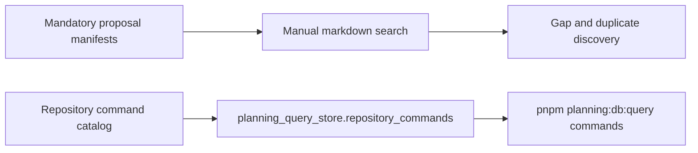

# Command/Query Rail Catalog DB-First Plan

> **For agentic workers:** REQUIRED SUB-SKILL: Use the repository AI work
> protocol to execute this plan task-by-task. Steps use checkbox syntax for
> tracking.

**Goal:** move product command/query rail catalogs into the planning DB query
store so gaps, implementation refs, and duplicates are operator-queryable.

**Architecture:** feature-mechanization manifests stay the governed source for
declared rails. `planning:db:import` materializes those declarations into
`planning_query_store.command_query_rails`, and `planning:db:query
command-query-rails` reads the DB view instead of reparsing Markdown.

**Tech Stack:** CommonJS planning DB import/query scripts, local Postgres
planning query store, Markdown feature-mechanization manifests, and Node test
runner suites.

---

## Governing Sources

- `AGENTS.md`
- `docs/planning/status/governance-document-rule-inventory.md`
- `docs/guides/ai-work-protocol.md`
- `docs/planning/status/db-surface-inventory.md`
- `docs/architecture/command-query-rail-governance.md`
- `docs/architecture/fowler-opportunity-planning-governance.md`
- `docs/adr/adr-0055-planning-db-canonical-operational-source.md`

## Current State



The repository command catalog is already DB-indexed, but product command/query
rails remain embedded in feature-mechanization Markdown. Operators can validate
manifests, but cannot query all declared product rails, find missing
implementation refs, or identify duplicate rail names through the DB.

## Target State

```mermaid
flowchart LR
  Manifest[feature-mechanization commandQueryRails] --> Import[pnpm planning:db:import]
  Symbols[symbols[].cqRails] --> Import
  Import --> RailTable[planning_query_store.command_query_rails]
  RailTable --> RailView[planning_query_store.command_query_rail_query]
  RailView --> Query[pnpm planning:db:query command-query-rails]
  Query --> Gap[--gaps true]
  Query --> Duplicate[--duplicates true]
```

The DB stores rail declarations and their symbol implementation refs. The view
computes `is_gap`, `implementation_ref_count`, `duplicate_count`, and
`is_duplicate`, so local commands and CI checks do not need to reparse Markdown
to inspect the catalog.

## Feature Mechanization

```feature-mechanization
version: 1
featureId: GD-CQ-RAIL-CATALOG-DB-FIRST-20260602
mechanizationStatus: implemented
noHumanDecisionsRemaining: true
implementationPlan: docs/planning/proposals/mandatory/governance-and-docs/command-query-rail-catalog-db-first-plan-20260602.md
componentGuides:
  - docs/planning/proposals/mandatory/governance-and-docs/command-query-rail-catalog-db-first-plan-20260602.md
userStories:
  - As an operator, I can query product command/query rails from the planning DB and filter gaps.
  - As an architect, I can identify duplicate product rail names by type from one DB view.
governingSources:
  - AGENTS.md
  - docs/planning/status/governance-document-rule-inventory.md
  - docs/guides/ai-work-protocol.md
  - docs/planning/status/db-surface-inventory.md
  - docs/architecture/command-query-rail-governance.md
  - docs/architecture/fowler-opportunity-planning-governance.md
  - docs/adr/adr-0055-planning-db-canonical-operational-source.md
allowedImplementationSurfaces:
  - docs/planning/proposals/mandatory/governance-and-docs/command-query-rail-catalog-db-first-plan-20260602.md
  - docs/planning/status/db-surface-inventory.md
  - docs/guides/testing-and-ci-capabilities.md
  - docs/.manifest.json
  - docs/**/index.md
  - scripts/planning-db-import.cjs
  - scripts/planning-db-import.test.cjs
  - scripts/planning-db-query.cjs
  - scripts/planning-db-query.test.cjs
  - scripts/planning-db-migrate.test.cjs
  - scripts/planning-db-surface-inventory-check.cjs
  - tools/planning-db/migrations/053_command_query_rail_catalog.sql
forbiddenImplementationSurfaces:
  - apps/**
  - packages/**
  - specs/contracts/**
commandQueryRails:
  - name: ImportCommandQueryRailCatalog
    type: command
    dddOwner: CommandQueryRailCatalog
  - name: QueryCommandQueryRailCatalog
    type: query
    dddOwner: CommandQueryRailCatalogReadModel
  - name: InventoryDbGovernanceSurface
    type: query
    dddOwner: DbGovernanceSurfaceInventory
domainObjects:
  - name: CommandQueryRailCatalog
    type: imported catalog
    owner: Architecture / Docs / Delivery
  - name: CommandQueryRailCatalogReadModel
    type: read model
    owner: Architecture / Docs / Delivery
  - name: CommandQueryRailDuplicate
    type: quality finding
    owner: Architecture / Docs / Delivery
  - name: CommandQueryRailGap
    type: quality finding
    owner: Architecture / Docs / Delivery
fowlerSignals:
  - Duplicate Semantics from rail names declared in multiple manifests without one queryable catalog.
  - Hidden Authority when implementation refs remain embedded in docs instead of DB rows.
  - Parallel Model between repository command catalog and product command/query rail catalogs.
architectureGuards:
  - node --test scripts/planning-db-import.test.cjs scripts/planning-db-query.test.cjs scripts/planning-db-migrate.test.cjs
  - pnpm planning:db:inventory:check
  - pnpm docs:feature-mechanization:implementation
cypressFlows:
  - N/A - DB governance query rail only
completionGate:
  - pnpm governance:refresh
  - pnpm planning:db:inventory:check
  - node --test scripts/planning-db-import.test.cjs scripts/planning-db-query.test.cjs scripts/planning-db-migrate.test.cjs
  - pnpm verify:prepush
redGreenCycles:
  - id: command-query-rail-catalog-snapshot
    redTest: node --test scripts/planning-db-import.test.cjs scripts/planning-db-query.test.cjs scripts/planning-db-migrate.test.cjs
    expectedFailure: buildCommandQueryRailSnapshot is not a function and command-query-rails is an unknown query.
    patchSurfaces:
      - scripts/planning-db-import.cjs
      - scripts/planning-db-query.cjs
      - tools/planning-db/migrations/053_command_query_rail_catalog.sql
    greenTest: node --test scripts/planning-db-import.test.cjs scripts/planning-db-query.test.cjs scripts/planning-db-migrate.test.cjs
symbols:
  - name: listTrackedFeatureMechanizationDocuments
    path: scripts/planning-db-import.cjs
    dddOwner: CommandQueryRailCatalog
    cqRails: [ImportCommandQueryRailCatalog]
    fowlerSignals: [Hidden Authority]
    architectureGuard: node --test scripts/planning-db-import.test.cjs
    cypressCoverage: N/A - DB import helper
    unitTests:
      - scripts/planning-db-import.test.cjs
  - name: normalizeRailName
    path: scripts/planning-db-import.cjs
    dddOwner: CommandQueryRailCatalog
    cqRails: [ImportCommandQueryRailCatalog]
    fowlerSignals: [Duplicate Semantics]
    architectureGuard: node --test scripts/planning-db-import.test.cjs
    cypressCoverage: N/A - normalization helper
    unitTests:
      - scripts/planning-db-import.test.cjs
  - name: normalizeRailStatus
    path: scripts/planning-db-import.cjs
    dddOwner: CommandQueryRailCatalog
    cqRails: [ImportCommandQueryRailCatalog]
    fowlerSignals: [Hidden Authority]
    architectureGuard: node --test scripts/planning-db-import.test.cjs
    cypressCoverage: N/A - normalization helper
    unitTests:
      - scripts/planning-db-import.test.cjs
  - name: isCommandQueryRailGap
    path: scripts/planning-db-import.cjs
    dddOwner: CommandQueryRailGap
    cqRails: [ImportCommandQueryRailCatalog]
    fowlerSignals: [Hidden Authority]
    architectureGuard: node --test scripts/planning-db-import.test.cjs
    cypressCoverage: N/A - DB import helper
    unitTests:
      - scripts/planning-db-import.test.cjs
  - name: normalizeFeatureMechanizationDocument
    path: scripts/planning-db-import.cjs
    dddOwner: CommandQueryRailCatalog
    cqRails: [ImportCommandQueryRailCatalog]
    fowlerSignals: [Hidden Authority]
    architectureGuard: node --test scripts/planning-db-import.test.cjs
    cypressCoverage: N/A - DB import helper
    unitTests:
      - scripts/planning-db-import.test.cjs
  - name: symbolReferencesForRail
    path: scripts/planning-db-import.cjs
    dddOwner: CommandQueryRailCatalog
    cqRails: [ImportCommandQueryRailCatalog]
    fowlerSignals: [Hidden Authority]
    architectureGuard: node --test scripts/planning-db-import.test.cjs
    cypressCoverage: N/A - DB import helper
    unitTests:
      - scripts/planning-db-import.test.cjs
  - name: buildCommandQueryRailSnapshot
    path: scripts/planning-db-import.cjs
    dddOwner: CommandQueryRailCatalog
    cqRails: [ImportCommandQueryRailCatalog]
    fowlerSignals: [Parallel Model]
    architectureGuard: node --test scripts/planning-db-import.test.cjs
    cypressCoverage: N/A - DB import helper
    unitTests:
      - scripts/planning-db-import.test.cjs
  - name: insertCommandQueryRailSnapshot
    path: scripts/planning-db-import.cjs
    dddOwner: CommandQueryRailCatalog
    cqRails: [ImportCommandQueryRailCatalog]
    fowlerSignals: [Parallel Model]
    architectureGuard: node --test scripts/planning-db-import.test.cjs
    cypressCoverage: N/A - DB import helper
    unitTests:
      - scripts/planning-db-import.test.cjs
  - name: parseBooleanFilter
    path: scripts/planning-db-query.cjs
    dddOwner: CommandQueryRailCatalogReadModel
    cqRails: [QueryCommandQueryRailCatalog]
    fowlerSignals: [Hidden Authority]
    architectureGuard: node --test scripts/planning-db-query.test.cjs
    cypressCoverage: N/A - CLI parser helper
    unitTests:
      - scripts/planning-db-query.test.cjs
  - name: buildCommandQueryRailRows
    path: scripts/planning-db-query.cjs
    dddOwner: CommandQueryRailCatalogReadModel
    cqRails: [QueryCommandQueryRailCatalog]
    fowlerSignals: [Duplicate Semantics]
    architectureGuard: node --test scripts/planning-db-query.test.cjs
    cypressCoverage: N/A - CLI formatter helper
    unitTests:
      - scripts/planning-db-query.test.cjs
  - name: appendBooleanFilter
    path: scripts/planning-db-query.cjs
    dddOwner: CommandQueryRailCatalogReadModel
    cqRails: [QueryCommandQueryRailCatalog]
    fowlerSignals: [Hidden Authority]
    architectureGuard: node --test scripts/planning-db-query.test.cjs
    cypressCoverage: N/A - SQL filter helper
    unitTests:
      - scripts/planning-db-query.test.cjs
  - name: commandQueryRailSelect
    path: scripts/planning-db-query.cjs
    dddOwner: CommandQueryRailCatalogReadModel
    cqRails: [QueryCommandQueryRailCatalog]
    fowlerSignals: [Parallel Model]
    architectureGuard: node --test scripts/planning-db-query.test.cjs
    cypressCoverage: N/A - SQL select helper
    unitTests:
      - scripts/planning-db-query.test.cjs
  - name: readCommandQueryRailRows
    path: scripts/planning-db-query.cjs
    dddOwner: CommandQueryRailCatalogReadModel
    cqRails: [QueryCommandQueryRailCatalog]
    fowlerSignals: [Duplicate Semantics]
    architectureGuard: node --test scripts/planning-db-query.test.cjs
    cypressCoverage: N/A - DB query helper
    unitTests:
      - scripts/planning-db-query.test.cjs
```

## Closeout Checks

- [x] Add failing tests for the import snapshot, DB migration, and CLI query.
- [x] Add `planning_query_store.command_query_rails` and
      `command_query_rail_query`.
- [x] Import `commandQueryRails` and `symbols[].cqRails` into DB rows.
- [x] Expose `pnpm planning:db:query command-query-rails`.
- [ ] Run governance refresh and pre-push validation before PR.
