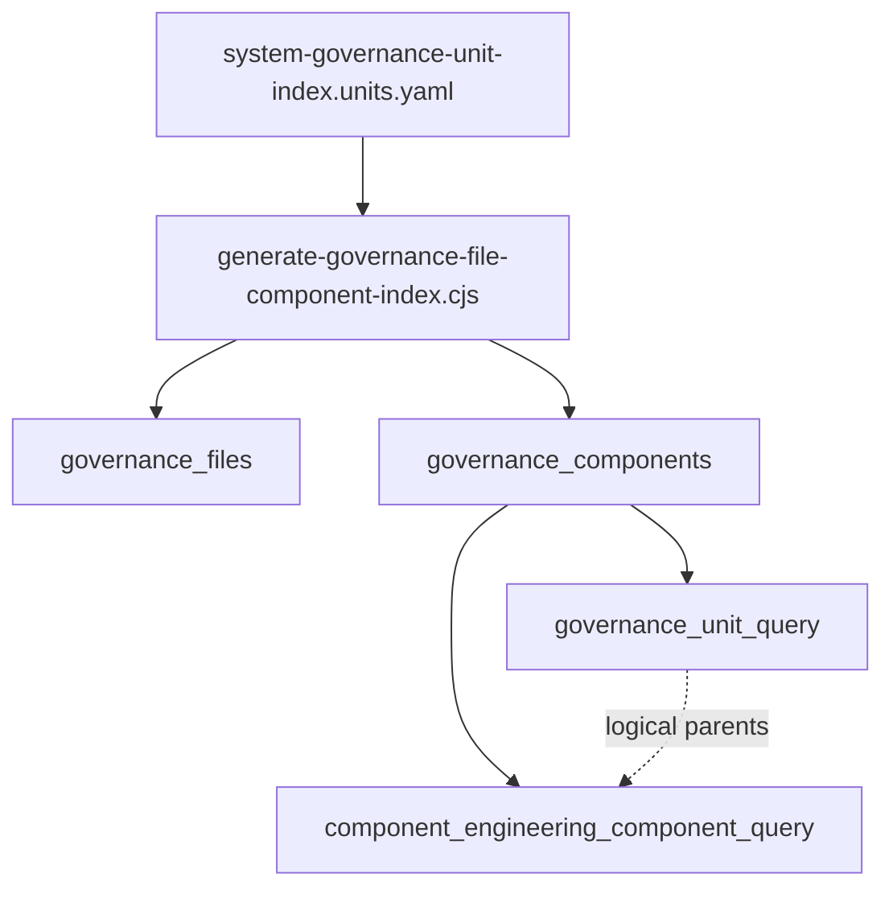
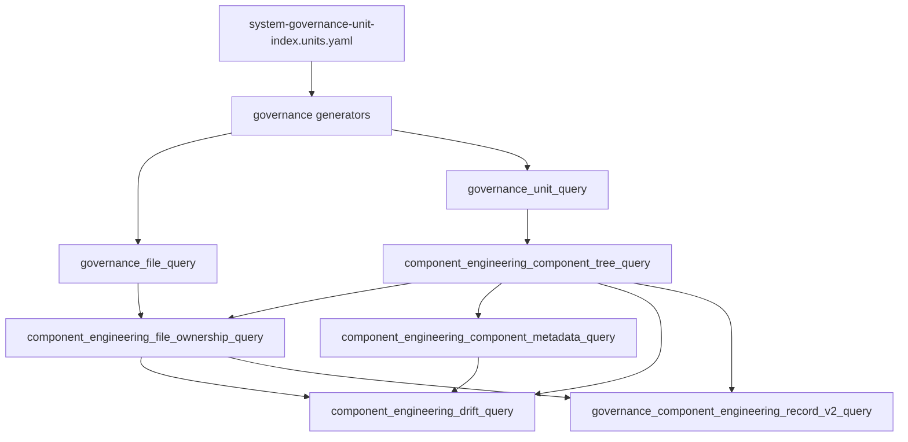

# Component Engineering Composite Hierarchy Implementation Plan

> **For agentic workers:** REQUIRED SUB-SKILL: Use
> `superpowers:subagent-driven-development` or
> `superpowers:executing-plans` to implement this plan task-by-task. Steps use
> checkbox (`- [ ]`) syntax for tracking.

**Goal:** make component engineering records a falsifiable engineering model in
which every tracked repository file belongs to exactly one leaf component and
every component can be composed of other components.

**Architecture:** this plan applies the Composite pattern to system governance:
components are recursive assemblies rather than a flat list plus a separate
unit tree. Git-tracked governance sources remain the review authority,
Postgres remains the DB-first query surface, and generated indexes become
evidence that the component tree matches the real repository.

**Tech Stack:** Markdown governance docs, `system-governance-unit-index`
manifest YAML, Node.js governance generators, Postgres planning DB migrations,
`planning:db:query`, Node test runner, and repository pre-push validation.

---

## Governing Sources

- `AGENTS.md`
- `docs/planning/status/governance-document-rule-inventory.md`
- `docs/architecture/reference-architecture.md`
- `docs/architecture/command-query-rail-governance.md`
- `docs/architecture/fowler-opportunity-planning-governance.md`
- `docs/planning/status/db-surface-inventory.md`
- `docs/planning/status/system-governance-unit-index.units.yaml`
- `docs/planning/status/system-governance-unit-index-20260501.md`
- `docs/planning/proposals/mandatory/governance-and-docs/system-governance-unit-index-plan-20260501.md`
- `docs/planning/proposals/mandatory/governance-and-docs/planning-state-query-store-plan-20260506.md`
- `docs/adr/ADR-0053-file-state-fingerprint-governance.md`
- `docs/adr/adr-0055-planning-db-canonical-operational-source.md`

## Feature Mechanization

This manifest governs the implementation slice for DB-first component
engineering hierarchy, semantic component validation, and the engine pilot
subdivision.

```feature-mechanization
version: 1
featureId: COMPONENT-ENGINEERING-COMPOSITE-HIERARCHY-20260513
mechanizationStatus: implemented
noHumanDecisionsRemaining: true
implementationPlan: docs/planning/proposals/mandatory/governance-and-docs/component-engineering-composite-hierarchy-plan-20260513.md
componentGuides:
  - docs/architecture/components/ci-governance/component-engineering-record-component.md
userStories:
  - docs/architecture/components/ci-governance/component-engineering-record-user-stories.md
governingSources:
  - AGENTS.md
  - docs/planning/status/governance-document-rule-inventory.md
  - docs/architecture/reference-architecture.md
  - docs/architecture/command-query-rail-governance.md
  - docs/architecture/fowler-opportunity-planning-governance.md
  - docs/planning/status/db-surface-inventory.md
  - docs/planning/status/system-governance-unit-index.units.yaml
  - docs/planning/proposals/mandatory/governance-and-docs/system-governance-unit-index-plan-20260501.md
  - docs/planning/proposals/mandatory/governance-and-docs/planning-state-query-store-plan-20260506.md
allowedImplementationSurfaces:
  - docs/planning/proposals/mandatory/governance-and-docs/component-engineering-composite-hierarchy-plan-20260513.md
  - docs/planning/proposals/portfolio-map-20260403.md
  - docs/planning/status/db-surface-inventory.md
  - docs/planning/status/system-governance-unit-taxonomy-20260501.md
  - docs/planning/status/system-governance-unit-index.units.yaml
  - docs/architecture/components/ci-governance/component-engineering-invariants.md
  - docs/architecture/components/ci-governance/component-engineering-record-component.md
  - docs/architecture/components/ci-governance/component-engineering-record-user-stories.md
  - docs/architecture/components/ci-governance/index.md
  - docs/architecture/components/index.md
  - scripts/planning-db-query.cjs
  - scripts/planning-db-query.test.cjs
  - scripts/planning-db-import.cjs
  - scripts/planning-db-import.test.cjs
  - scripts/planning-db-migrate.test.cjs
  - scripts/check-governance-unit-coverage.cjs
  - scripts/check-governance-unit-coverage.test.cjs
  - scripts/generate-governance-file-component-index.cjs
  - scripts/generate-governance-file-component-index.test.cjs
  - tools/planning-db/migrations/032_component_engineering_composite_hierarchy.sql
  - tools/planning-db/migrations/033_component_engineering_component_tree_leaf_filter.sql
  - tools/planning-db/migrations/034_component_engineering_rule_runtime.sql
  - tools/planning-db/migrations/035_component_engineering_schema_boundary.sql
  - tools/planning-db/migrations/038_component_engineering_local_file_ownership.sql
  - tools/planning-db/migrations/039_component_engineering_effective_quality.sql
  - docs/.manifest.json
  - docs/**/index.md
forbiddenImplementationSurfaces:
  - apps/**
  - packages/**
  - specs/contracts/**
  - package.json
commandQueryRails:
  - name: PublishComponentEngineeringCompositeHierarchyPlan
    type: command
    dddOwner: Governance proposal publication
  - name: ReadComponentHierarchy
    type: query
    dddOwner: Governance local operations
  - name: ValidateComponentEngineeringDrift
    type: query
    dddOwner: Governance local operations
  - name: ReadComponentEngineeringRules
    type: query
    dddOwner: Governance local operations
  - name: EvaluateComponentEngineeringRules
    type: query
    dddOwner: Governance local operations
  - name: ReadComponentEngineeringQuality
    type: query
    dddOwner: Governance local operations
  - name: ReadComponentEngineeringMetadata
    type: query
    dddOwner: Governance local operations
domainObjects:
  - name: Component engineering composite hierarchy plan
    type: governance proposal
    owner: Architecture / Docs / Delivery
  - name: Component composite hierarchy
    type: planned read model
    owner: Governance local operations
  - name: Component file ownership
    type: planned read model
    owner: Governance local operations
  - name: Component engineering drift
    type: planned read model
    owner: Governance local operations
  - name: Component engineering invariant catalog
    type: planned read model
    owner: Governance local operations
  - name: Component engineering rule evaluation
    type: planned read model
    owner: Governance local operations
  - name: Component engineering quality rollup
    type: planned read model
    owner: Governance local operations
  - name: Component engineering metadata schema
    type: planned read model
    owner: Governance local operations
fowlerSignals:
  - Boundary Drift from parent IDs that do not resolve inside component engineering records
  - Responsibility Overload from root components that own many unrelated files directly
  - Hidden Authority when drift can only be seen through local inspection instead of a query rail
  - Documentation Drift when component docs and generated component rows disagree
architectureGuards:
  - node --test scripts/planning-db-migrate.test.cjs
  - node --test scripts/planning-db-query.test.cjs
  - node --test scripts/check-governance-unit-coverage.test.cjs
  - node --test scripts/generate-governance-file-component-index.test.cjs
  - pnpm docs:governance:unit-coverage
  - pnpm docs:feature-mechanization:implementation
  - pnpm lint:md:changed
  - pnpm verify:prepush
cypressFlows:
  - N/A - repository governance proposal only
completionGate:
  - pnpm docs:sync
  - pnpm governance:refresh
  - pnpm planning:db:migrate
  - pnpm planning:db:query component-tree --component SYS-RUNTIME-ENGINE-CORE
  - pnpm planning:db:query component-tree --parent SYS-RUNTIME-ENGINE-CORE
  - pnpm planning:db:query component-metadata --component SYS-RUNTIME-ENGINE-CORE
  - pnpm planning:db:query component-rules --kind responsibility --limit 5
  - pnpm planning:db:query component-rule-evaluations --component SYS-RUNTIME-ENGINE-CORE --kind CEI-ID-006 --limit 5
  - pnpm planning:db:query component-quality --component SYS-RUNTIME-ENGINE-CORE
  - pnpm planning:db:query component-drift --component SYS-RUNTIME-ENGINE-CORE
  - node --test scripts/planning-db-migrate.test.cjs
  - node --test scripts/planning-db-query.test.cjs
  - node --test scripts/check-governance-unit-coverage.test.cjs
  - node --test scripts/generate-governance-file-component-index.test.cjs
  - pnpm exec markdownlint-cli2 "docs/planning/proposals/mandatory/governance-and-docs/component-engineering-composite-hierarchy-plan-20260513.md" "docs/planning/proposals/portfolio-map-20260403.md"
  - pnpm docs:feature-mechanization:implementation
  - pnpm verify:prepush
redGreenCycles:
  - id: composite-hierarchy-migration
    redTest: node --test scripts/planning-db-migrate.test.cjs
    expectedFailure: migration 032 and its component tree/drift views do not exist.
    patchSurfaces:
      - tools/planning-db/migrations/032_component_engineering_composite_hierarchy.sql
      - scripts/planning-db-migrate.test.cjs
    greenTest: node --test scripts/planning-db-migrate.test.cjs
  - id: component-tree-source-neutral-leaves
    redTest: node --test scripts/planning-db-migrate.test.cjs
    expectedFailure: component leaf checks count source records as child components after migration 032.
    patchSurfaces:
      - tools/planning-db/migrations/033_component_engineering_component_tree_leaf_filter.sql
      - scripts/planning-db-migrate.test.cjs
    greenTest: node --test scripts/planning-db-migrate.test.cjs
  - id: component-tree-query-rails
    redTest: node --test scripts/planning-db-query.test.cjs
    expectedFailure: component-tree and component-drift are unknown queries.
    patchSurfaces:
      - scripts/planning-db-query.cjs
      - scripts/planning-db-query.test.cjs
      - docs/planning/status/db-surface-inventory.md
    greenTest: node --test scripts/planning-db-query.test.cjs
  - id: semantic-component-contract
    redTest: node --test scripts/check-governance-unit-coverage.test.cjs
    expectedFailure: component-to-component parentage and missing canonical metadata are not validated.
    patchSurfaces:
      - scripts/check-governance-unit-coverage.cjs
      - scripts/check-governance-unit-coverage.test.cjs
      - docs/planning/status/system-governance-unit-taxonomy-20260501.md
    greenTest: node --test scripts/check-governance-unit-coverage.test.cjs
  - id: engine-leaf-ownership
    redTest: node --test scripts/generate-governance-file-component-index.test.cjs
    expectedFailure: nested engine files resolve to the parent component instead of the leaf component.
    patchSurfaces:
      - scripts/generate-governance-file-component-index.cjs
      - scripts/generate-governance-file-component-index.test.cjs
      - docs/planning/status/system-governance-unit-index.units.yaml
    greenTest: node --test scripts/generate-governance-file-component-index.test.cjs
  - id: feature-surface-manifest
    redTest: pnpm docs:feature-mechanization:implementation
    expectedFailure: implementation files are outside allowedImplementationSurfaces until this manifest declares the slice.
    patchSurfaces:
      - docs/planning/proposals/mandatory/governance-and-docs/component-engineering-composite-hierarchy-plan-20260513.md
      - docs/planning/proposals/portfolio-map-20260403.md
    greenTest: pnpm docs:feature-mechanization:implementation
  - id: governance-query-auto-import
    redTest: node --test scripts/planning-db-query.test.cjs
    expectedFailure: component-tree reads stale governance projections before importing them.
    patchSurfaces:
      - scripts/planning-db-query.cjs
      - scripts/planning-db-query.test.cjs
      - scripts/planning-db-import.cjs
      - scripts/planning-db-import.test.cjs
      - docs/planning/status/db-surface-inventory.md
      - docs/architecture/components/ci-governance/component-engineering-record-component.md
    greenTest: node --test scripts/planning-db-query.test.cjs
  - id: component-engineering-rule-runtime
    redTest: node --test scripts/planning-db-migrate.test.cjs scripts/planning-db-query.test.cjs
    expectedFailure: component engineering rules, evaluations, and quality rollups are not DB-backed query rails.
    patchSurfaces:
      - tools/planning-db/migrations/034_component_engineering_rule_runtime.sql
      - scripts/planning-db-migrate.test.cjs
      - scripts/planning-db-query.cjs
      - scripts/planning-db-query.test.cjs
      - docs/architecture/components/ci-governance/component-engineering-invariants.md
      - docs/planning/status/db-surface-inventory.md
    greenTest: node --test scripts/planning-db-migrate.test.cjs scripts/planning-db-query.test.cjs
  - id: component-engineering-schema-boundary
    redTest: node --test scripts/planning-db-migrate.test.cjs scripts/planning-db-query.test.cjs
    expectedFailure: component engineering reads still use planning_query_store prefixes and have no stable component metadata query rail.
    patchSurfaces:
      - tools/planning-db/migrations/035_component_engineering_schema_boundary.sql
      - scripts/planning-db-migrate.test.cjs
      - scripts/planning-db-query.cjs
      - scripts/planning-db-query.test.cjs
      - docs/architecture/components/ci-governance/component-engineering-invariants.md
      - docs/planning/status/db-surface-inventory.md
    greenTest: node --test scripts/planning-db-migrate.test.cjs scripts/planning-db-query.test.cjs
  - id: local-component-file-ownership-reconciliation
    redTest: node --test scripts/planning-db-migrate.test.cjs
    expectedFailure: DB-authored governance components do not participate in file ownership projections.
    patchSurfaces:
      - tools/planning-db/migrations/038_component_engineering_local_file_ownership.sql
      - scripts/planning-db-migrate.test.cjs
    greenTest: node --test scripts/planning-db-migrate.test.cjs
  - id: effective-component-quality-rollup
    redTest: node --test scripts/planning-db-migrate.test.cjs
    expectedFailure: component quality size metrics still ignore effective DB-authored file ownership.
    patchSurfaces:
      - tools/planning-db/migrations/039_component_engineering_effective_quality.sql
      - scripts/planning-db-migrate.test.cjs
    greenTest: node --test scripts/planning-db-migrate.test.cjs
symbols:
  - name: ComponentEngineeringCompositeHierarchyPlan
    path: docs/planning/proposals/mandatory/governance-and-docs/component-engineering-composite-hierarchy-plan-20260513.md
    dddOwner: Governance proposal publication
    cqRails:
      - PublishComponentEngineeringCompositeHierarchyPlan
      - ReadComponentHierarchy
      - ValidateComponentEngineeringDrift
    fowlerSignals:
      - Boundary Drift from parent IDs that do not resolve inside component engineering records
      - Responsibility Overload from root components that own many unrelated files directly
    architectureGuard: pnpm docs:feature-mechanization:implementation
    cypressCoverage: N/A
    unitTests:
      - pnpm lint:md:changed
  - name: component_engineering_component_tree_query
    path: tools/planning-db/migrations/032_component_engineering_composite_hierarchy.sql
    dddOwner: Governance local operations
    cqRails:
      - ReadComponentHierarchy
    fowlerSignals:
      - Boundary Drift from unresolved parent IDs
      - Responsibility Overload from direct-file-heavy root components
    architectureGuard: node --test scripts/planning-db-migrate.test.cjs
    cypressCoverage: N/A
    unitTests:
      - node --test scripts/planning-db-query.test.cjs
  - name: component_engineering_component_tree_query_source_neutral_leaf_filter
    path: tools/planning-db/migrations/033_component_engineering_component_tree_leaf_filter.sql
    dddOwner: Governance local operations
    cqRails:
      - ReadComponentHierarchy
      - ValidateComponentEngineeringDrift
    fowlerSignals:
      - Boundary Drift from source records being treated as component children
      - Documentation Drift from leaf ownership checks disagreeing with component semantics
    architectureGuard: node --test scripts/planning-db-migrate.test.cjs
    cypressCoverage: N/A
    unitTests:
      - node --test scripts/planning-db-migrate.test.cjs
  - name: component_engineering_rule_catalog_query
    path: tools/planning-db/migrations/034_component_engineering_rule_runtime.sql
    dddOwner: Governance local operations
    cqRails:
      - ReadComponentEngineeringRules
    fowlerSignals:
      - Hidden Authority from invariant rules living outside the DB query surface
    architectureGuard: node --test scripts/planning-db-migrate.test.cjs
    cypressCoverage: N/A
    unitTests:
      - node --test scripts/planning-db-migrate.test.cjs
  - name: component_engineering_rule_evaluation_query
    path: tools/planning-db/migrations/034_component_engineering_rule_runtime.sql
    dddOwner: Governance local operations
    cqRails:
      - EvaluateComponentEngineeringRules
      - ValidateComponentEngineeringDrift
    fowlerSignals:
      - Boundary Drift from unresolved parents and file ownership checks outside a rule model
    architectureGuard: node --test scripts/planning-db-migrate.test.cjs
    cypressCoverage: N/A
    unitTests:
      - node --test scripts/planning-db-migrate.test.cjs
  - name: component_engineering_quality_query
    path: tools/planning-db/migrations/034_component_engineering_rule_runtime.sql
    dddOwner: Governance local operations
    cqRails:
      - ReadComponentEngineeringQuality
    fowlerSignals:
      - Responsibility Overload from component size and rule failures without a rollup view
    architectureGuard: node --test scripts/planning-db-migrate.test.cjs
    cypressCoverage: N/A
    unitTests:
      - node --test scripts/planning-db-migrate.test.cjs
  - name: component_engineering_schema_boundary
    path: tools/planning-db/migrations/035_component_engineering_schema_boundary.sql
    dddOwner: Governance local operations
    cqRails:
      - ReadComponentHierarchy
      - ReadComponentEngineeringMetadata
      - ReadComponentEngineeringRules
      - EvaluateComponentEngineeringRules
      - ReadComponentEngineeringQuality
      - ValidateComponentEngineeringDrift
    fowlerSignals:
      - Hidden Authority from component engineering semantics living under a generic planning query schema
      - Documentation Drift from rule evaluation metadata being mistaken for stable component metadata
    architectureGuard: node --test scripts/planning-db-migrate.test.cjs
    cypressCoverage: N/A
    unitTests:
      - node --test scripts/planning-db-migrate.test.cjs
  - name: component_engineering_local_file_ownership_query
    path: tools/planning-db/migrations/038_component_engineering_local_file_ownership.sql
    dddOwner: Governance local operations
    cqRails:
      - ReadComponentHierarchy
      - ValidateComponentEngineeringDrift
    fowlerSignals:
      - Boundary Drift from DB-authored child components not owning their matched files
      - Hidden Authority from local component definitions being absent from file ownership reads
    architectureGuard: node --test scripts/planning-db-migrate.test.cjs
    cypressCoverage: N/A
    unitTests:
      - node --test scripts/planning-db-migrate.test.cjs
  - name: component_engineering_effective_quality_query
    path: tools/planning-db/migrations/039_component_engineering_effective_quality.sql
    dddOwner: Governance local operations
    cqRails:
      - ReadComponentEngineeringQuality
      - ValidateComponentEngineeringDrift
    fowlerSignals:
      - Responsibility Overload from component size metrics ignoring effective leaf ownership
      - Documentation Drift from quality rollups disagreeing with file ownership reads
    architectureGuard: node --test scripts/planning-db-migrate.test.cjs
    cypressCoverage: N/A
    unitTests:
      - node --test scripts/planning-db-migrate.test.cjs
  - name: component_engineering_component_metadata_query_schema_view
    path: tools/planning-db/migrations/035_component_engineering_schema_boundary.sql
    dddOwner: Governance local operations
    cqRails:
      - ReadComponentEngineeringMetadata
    fowlerSignals:
      - Responsibility Drift from component concern/API/invariant metadata hidden inside variable JSON blobs
    architectureGuard: node --test scripts/planning-db-migrate.test.cjs
    cypressCoverage: N/A
    unitTests:
      - node --test scripts/planning-db-migrate.test.cjs
  - name: SYS-RUNTIME-ENGINE-CORE
    path: docs/planning/status/system-governance-unit-index.units.yaml
    dddOwner: Runtime engine application service
    cqRails:
      - RT-C01
      - RT-Q01
      - ReadComponentHierarchy
      - ValidateComponentEngineeringDrift
    fowlerSignals:
      - Responsibility Overload from flat package ownership
      - Boundary Drift from plan-store-owned plan-ref files inside engine package
    architectureGuard: pnpm docs:governance:unit-coverage
    cypressCoverage: N/A
    unitTests:
      - node --test scripts/generate-governance-file-component-index.test.cjs
  - name: canonicalComponentSemanticFields
    path: scripts/check-governance-unit-coverage.cjs
    dddOwner: Governance unit manifest validation
    cqRails:
      - ValidateComponentEngineeringDrift
    fowlerSignals:
      - Documentation Drift from canonical components without semantic metadata
    architectureGuard: node --test scripts/check-governance-unit-coverage.test.cjs
    cypressCoverage: N/A
    unitTests:
      - node --test scripts/check-governance-unit-coverage.test.cjs
  - name: findLastUnitByLevel
    path: scripts/generate-governance-file-component-index.cjs
    dddOwner: Governance file/component index generation
    cqRails:
      - ReadComponentHierarchy
    fowlerSignals:
      - Boundary Drift from files resolving to parent assemblies
    architectureGuard: node --test scripts/generate-governance-file-component-index.test.cjs
    cypressCoverage: N/A
    unitTests:
      - node --test scripts/generate-governance-file-component-index.test.cjs
  - name: buildComponentEngineeringComponentTreeRows
    path: scripts/planning-db-query.cjs
    dddOwner: Governance local operations
    cqRails:
      - ReadComponentHierarchy
    fowlerSignals:
      - Hidden Authority from DB rows without operator output
    architectureGuard: node --test scripts/planning-db-query.test.cjs
    cypressCoverage: N/A
    unitTests:
      - node --test scripts/planning-db-query.test.cjs
  - name: buildComponentEngineeringComponentDriftRows
    path: scripts/planning-db-query.cjs
    dddOwner: Governance local operations
    cqRails:
      - ValidateComponentEngineeringDrift
    fowlerSignals:
      - Hidden Authority from drift rows without operator output
    architectureGuard: node --test scripts/planning-db-query.test.cjs
    cypressCoverage: N/A
    unitTests:
      - node --test scripts/planning-db-query.test.cjs
  - name: compactJson
    path: scripts/planning-db-query.cjs
    dddOwner: Governance local operations
    cqRails:
      - ValidateComponentEngineeringDrift
    fowlerSignals:
      - Hidden Authority from drift rows without actionable metadata
    architectureGuard: node --test scripts/planning-db-query.test.cjs
    cypressCoverage: N/A
    unitTests:
      - node --test scripts/planning-db-query.test.cjs
  - name: buildComponentEngineeringComponentMetadataRows
    path: scripts/planning-db-query.cjs
    dddOwner: Governance local operations
    cqRails:
      - ReadComponentEngineeringMetadata
    fowlerSignals:
      - Hidden Authority from metadata rows without operator output
    architectureGuard: node --test scripts/planning-db-query.test.cjs
    cypressCoverage: N/A
    unitTests:
      - node --test scripts/planning-db-query.test.cjs
  - name: buildComponentEngineeringRuleCatalogRows
    path: scripts/planning-db-query.cjs
    dddOwner: Governance local operations
    cqRails:
      - ReadComponentEngineeringRules
    fowlerSignals:
      - Hidden Authority from DB rule rows without operator output
    architectureGuard: node --test scripts/planning-db-query.test.cjs
    cypressCoverage: N/A
    unitTests:
      - node --test scripts/planning-db-query.test.cjs
  - name: buildComponentEngineeringRuleEvaluationRows
    path: scripts/planning-db-query.cjs
    dddOwner: Governance local operations
    cqRails:
      - EvaluateComponentEngineeringRules
    fowlerSignals:
      - Hidden Authority from DB evaluation rows without operator output
    architectureGuard: node --test scripts/planning-db-query.test.cjs
    cypressCoverage: N/A
    unitTests:
      - node --test scripts/planning-db-query.test.cjs
  - name: buildComponentEngineeringQualityRows
    path: scripts/planning-db-query.cjs
    dddOwner: Governance local operations
    cqRails:
      - ReadComponentEngineeringQuality
    fowlerSignals:
      - Hidden Authority from component quality rows without operator output
    architectureGuard: node --test scripts/planning-db-query.test.cjs
    cypressCoverage: N/A
    unitTests:
      - node --test scripts/planning-db-query.test.cjs
  - name: componentEngineeringComponentTreeSelect
    path: scripts/planning-db-query.cjs
    dddOwner: Governance local operations
    cqRails:
      - ReadComponentHierarchy
    fowlerSignals:
      - Boundary Drift from unqueryable component parent closure
    architectureGuard: node --test scripts/planning-db-query.test.cjs
    cypressCoverage: N/A
    unitTests:
      - node --test scripts/planning-db-query.test.cjs
  - name: componentEngineeringComponentDriftSelect
    path: scripts/planning-db-query.cjs
    dddOwner: Governance local operations
    cqRails:
      - ValidateComponentEngineeringDrift
    fowlerSignals:
      - Boundary Drift from drift checks outside DB query rails
    architectureGuard: node --test scripts/planning-db-query.test.cjs
    cypressCoverage: N/A
    unitTests:
      - node --test scripts/planning-db-query.test.cjs
  - name: componentEngineeringComponentMetadataSelect
    path: scripts/planning-db-query.cjs
    dddOwner: Governance local operations
    cqRails:
      - ReadComponentEngineeringMetadata
    fowlerSignals:
      - Hidden Authority from component metadata reads outside the component_engineering schema
    architectureGuard: node --test scripts/planning-db-query.test.cjs
    cypressCoverage: N/A
    unitTests:
      - node --test scripts/planning-db-query.test.cjs
  - name: componentEngineeringRuleCatalogSelect
    path: scripts/planning-db-query.cjs
    dddOwner: Governance local operations
    cqRails:
      - ReadComponentEngineeringRules
    fowlerSignals:
      - Hidden Authority from rule catalog reads outside the query rail
    architectureGuard: node --test scripts/planning-db-query.test.cjs
    cypressCoverage: N/A
    unitTests:
      - node --test scripts/planning-db-query.test.cjs
  - name: componentEngineeringRuleEvaluationSelect
    path: scripts/planning-db-query.cjs
    dddOwner: Governance local operations
    cqRails:
      - EvaluateComponentEngineeringRules
    fowlerSignals:
      - Hidden Authority from rule evaluation reads outside the query rail
    architectureGuard: node --test scripts/planning-db-query.test.cjs
    cypressCoverage: N/A
    unitTests:
      - node --test scripts/planning-db-query.test.cjs
  - name: componentEngineeringQualitySelect
    path: scripts/planning-db-query.cjs
    dddOwner: Governance local operations
    cqRails:
      - ReadComponentEngineeringQuality
    fowlerSignals:
      - Hidden Authority from quality rollup reads outside the query rail
    architectureGuard: node --test scripts/planning-db-query.test.cjs
    cypressCoverage: N/A
    unitTests:
      - node --test scripts/planning-db-query.test.cjs
  - name: readComponentEngineeringComponentTreeRows
    path: scripts/planning-db-query.cjs
    dddOwner: Governance local operations
    cqRails:
      - ReadComponentHierarchy
    fowlerSignals:
      - Hidden Authority from direct DB reads without CLI rail
    architectureGuard: node --test scripts/planning-db-query.test.cjs
    cypressCoverage: N/A
    unitTests:
      - node --test scripts/planning-db-query.test.cjs
  - name: readComponentEngineeringComponentDriftRows
    path: scripts/planning-db-query.cjs
    dddOwner: Governance local operations
    cqRails:
      - ValidateComponentEngineeringDrift
    fowlerSignals:
      - Hidden Authority from direct DB reads without CLI rail
    architectureGuard: node --test scripts/planning-db-query.test.cjs
    cypressCoverage: N/A
    unitTests:
      - node --test scripts/planning-db-query.test.cjs
  - name: readComponentEngineeringComponentMetadataRows
    path: scripts/planning-db-query.cjs
    dddOwner: Governance local operations
    cqRails:
      - ReadComponentEngineeringMetadata
    fowlerSignals:
      - Hidden Authority from direct DB reads without CLI rail
    architectureGuard: node --test scripts/planning-db-query.test.cjs
    cypressCoverage: N/A
    unitTests:
      - node --test scripts/planning-db-query.test.cjs
  - name: readComponentEngineeringRuleCatalogRows
    path: scripts/planning-db-query.cjs
    dddOwner: Governance local operations
    cqRails:
      - ReadComponentEngineeringRules
    fowlerSignals:
      - Hidden Authority from direct DB reads without CLI rail
    architectureGuard: node --test scripts/planning-db-query.test.cjs
    cypressCoverage: N/A
    unitTests:
      - node --test scripts/planning-db-query.test.cjs
  - name: readComponentEngineeringRuleEvaluationRows
    path: scripts/planning-db-query.cjs
    dddOwner: Governance local operations
    cqRails:
      - EvaluateComponentEngineeringRules
    fowlerSignals:
      - Hidden Authority from direct DB reads without CLI rail
    architectureGuard: node --test scripts/planning-db-query.test.cjs
    cypressCoverage: N/A
    unitTests:
      - node --test scripts/planning-db-query.test.cjs
  - name: readComponentEngineeringQualityRows
    path: scripts/planning-db-query.cjs
    dddOwner: Governance local operations
    cqRails:
      - ReadComponentEngineeringQuality
    fowlerSignals:
      - Hidden Authority from direct DB reads without CLI rail
    architectureGuard: node --test scripts/planning-db-query.test.cjs
    cypressCoverage: N/A
    unitTests:
      - node --test scripts/planning-db-query.test.cjs
  - name: governanceProjectionQueryNames
    path: scripts/planning-db-query.cjs
    dddOwner: Governance local operations
    cqRails:
      - ReadComponentHierarchy
      - ReadComponentEngineeringMetadata
      - ValidateComponentEngineeringDrift
      - ReadComponentEngineeringRules
      - EvaluateComponentEngineeringRules
      - ReadComponentEngineeringQuality
    fowlerSignals:
      - Hidden Authority from query results depending on a manual import step
    architectureGuard: node --test scripts/planning-db-query.test.cjs
    cypressCoverage: N/A
    unitTests:
      - node --test scripts/planning-db-query.test.cjs
  - name: componentEngineeringSchemaName
    path: scripts/planning-db-query.cjs
    dddOwner: Governance local operations
    cqRails:
      - ReadComponentHierarchy
      - ReadComponentEngineeringMetadata
      - ReadComponentEngineeringRules
      - EvaluateComponentEngineeringRules
      - ReadComponentEngineeringQuality
      - ValidateComponentEngineeringDrift
    fowlerSignals:
      - Hidden Authority from hard-coded component engineering reads under planning_query_store
    architectureGuard: node --test scripts/planning-db-query.test.cjs
    cypressCoverage: N/A
    unitTests:
      - node --test scripts/planning-db-query.test.cjs
  - name: usesGovernanceProjection
    path: scripts/planning-db-query.cjs
    dddOwner: Governance local operations
    cqRails:
      - ReadComponentHierarchy
      - ReadComponentEngineeringMetadata
      - ValidateComponentEngineeringDrift
    fowlerSignals:
      - Hidden Authority from stale governance projections
    architectureGuard: node --test scripts/planning-db-query.test.cjs
    cypressCoverage: N/A
    unitTests:
      - node --test scripts/planning-db-query.test.cjs
  - name: ensureFreshGovernanceProjection
    path: scripts/planning-db-query.cjs
    dddOwner: Governance local operations
    cqRails:
      - ReadComponentHierarchy
      - ReadComponentEngineeringMetadata
      - ValidateComponentEngineeringDrift
    fowlerSignals:
      - Hidden Authority from manual refresh requirements before DB reads
    architectureGuard: node --test scripts/planning-db-query.test.cjs
    cypressCoverage: N/A
    unitTests:
      - node --test scripts/planning-db-query.test.cjs
requiredTests:
  - pnpm docs:sync
  - pnpm governance:refresh
  - pnpm planning:db:migrate
  - pnpm planning:db:query component-tree --component SYS-RUNTIME-ENGINE-CORE
  - pnpm planning:db:query component-tree --parent SYS-RUNTIME-ENGINE-CORE
  - pnpm planning:db:query component-metadata --component SYS-RUNTIME-ENGINE-CORE
  - pnpm planning:db:query component-rules --kind responsibility --limit 5
  - pnpm planning:db:query component-rule-evaluations --component SYS-RUNTIME-ENGINE-CORE --kind CEI-ID-006 --limit 5
  - pnpm planning:db:query component-quality --component SYS-RUNTIME-ENGINE-CORE
  - pnpm planning:db:query component-drift --component SYS-RUNTIME-ENGINE-CORE
  - node --test scripts/planning-db-migrate.test.cjs
  - node --test scripts/planning-db-query.test.cjs
  - node --test scripts/check-governance-unit-coverage.test.cjs
  - node --test scripts/generate-governance-file-component-index.test.cjs
  - pnpm exec markdownlint-cli2 "docs/planning/proposals/mandatory/governance-and-docs/component-engineering-composite-hierarchy-plan-20260513.md" "docs/planning/proposals/portfolio-map-20260403.md"
  - pnpm verify:prepush
```

## Problem Statement

The current governance model already covers repository files and exposes
component engineering records, but the model has a split brain:

- `governance_unit_query` contains logical parents such as `SYS-API-ROOT`.
- `governance_component_query` contains only materialized component rows.
- `component_engineering_component_query` reads the materialized component rows
  and can therefore expose `parent_id` values that do not resolve to a
  `component_id` in the same view.
- broad root components such as `SYS-RUNTIME-ENGINE-CORE` can own many files directly
  even when the code already has smaller semantic parts.

That shape is insufficient for drift detection. A mature engineering model
must be able to answer: which component owns this file, what component contains
that component, which docs/contracts/tests govern the component, and which
drift signal is present when the repo changes.

## Target Model

The repository should expose four DB-first read models:

```text
component_engineering.component_tree_query
  Recursive component hierarchy. Every parent resolves.

component_engineering.file_ownership_query
  Exhaustive tracked-file ownership. Every file has one leaf component.

component_engineering.component_metadata_query
  Semantic metadata: concern, API, invariants, transitions, consumers.

component_engineering.component_drift_query
  Mechanical drift signals derived from tree, files, docs, contracts, and tests.
```

The component model is recursive:

```text
SYS-DVT
  SYS-RUNTIME
    SYS-RUNTIME-ENGINE-CORE
      SYS-RUNTIME-ENGINE-PACKAGE-SURFACE
      SYS-RUNTIME-ENGINE-ADAPTERS
      SYS-RUNTIME-ENGINE-APPLICATION
      SYS-RUNTIME-ENGINE-WORKFLOW-USE-CASES
      SYS-RUNTIME-ENGINE-CONTRACTS
      SYS-RUNTIME-ENGINE-CORE-LIFECYCLE
      SYS-RUNTIME-ENGINE-DOMAIN-PORTS
      SYS-RUNTIME-ENGINE-SECURITY
      SYS-RUNTIME-ENGINE-RUNTIME-SERVICES
      SYS-RUNTIME-ENGINE-START-RUN
      SYS-RUNTIME-ENGINE-RUN-CONTROL
      SYS-RUNTIME-ENGINE-RUN-MAINTENANCE
      SYS-RUNTIME-ENGINE-STATE
      SYS-RUNTIME-ENGINE-OUTBOX
      SYS-RUNTIME-ENGINE-DETERMINISM-UTILS
      SYS-RUNTIME-ENGINE-ARCHITECTURE-TESTS
```

The root component is allowed to aggregate children. It should not act as a
bag of unrelated files.

## Invariants

- Every tracked file belongs to exactly one leaf component.
- Every `parent_component_id` in the component tree resolves to another
  `component_id` in the same tree.
- Components with `children_required = true` have at least one child component.
- Components with children expose both direct and descendant file counts.
- Aggregator components may have direct files only for boundary files such as
  package manifests, configs, or index modules.
- Leaf components with high file counts are drift candidates unless an explicit
  exception is recorded.
- Semantic metadata is not faked. Missing concern/API/invariant/consumer
  metadata is surfaced as a drift gap until filled.
- Component docs and architecture tests validate semantic composition, not only
  barrel thinness.

## Fowler / DDD Posture

| Signal                  | Current symptom                                                                | Planned response                                             |
| ----------------------- | ------------------------------------------------------------------------------ | ------------------------------------------------------------ |
| Boundary drift          | parent IDs in CER can point at logical units missing from the component view   | make component tree the CER authority                        |
| Responsibility overload | roots such as `SYS-RUNTIME-ENGINE-CORE` own many files directly                | split by stable owned concern                                |
| Hidden authority        | drift knowledge lives in generated files, ad hoc queries, and human inspection | publish drift queries and tests                              |
| Documentation drift     | docs can describe components that are not materialized as query rows           | docs and component tree must reference the same IDs          |
| Test-only confidence    | existing tests can prove view existence without semantic hierarchy             | add architecture tests for parent closure and leaf ownership |

## Command And Query Rail

This plan extends the existing governance local-operations rails.

- Rail name: `ReadComponentHierarchy`
  - Type: Query
  - Owning context: Governance local operations
  - DDD object/read model: component composite hierarchy read model
  - Application port: `pnpm planning:db:query component-tree`
  - Adapter surface: `scripts/planning-db-query.cjs`
  - Scope and auth: repo-local, read-only maintainer and CI inspection query
  - Negative tests: unknown query rejection, component and parent filter
    parameterization, parent closure, and missing migration view

- Rail name: `ValidateComponentEngineeringDrift`
  - Type: Query
  - Owning context: Governance local operations
  - DDD object/read model: component engineering drift read model
  - Application port: `pnpm planning:db:query component-drift`
  - Adapter surface: `scripts/planning-db-query.cjs`
  - Scope and auth: repo-local, read-only maintainer and CI inspection query
  - Negative tests: unresolved parent, unowned file, duplicate leaf owner,
    root-bag threshold, and missing semantic metadata

## File Structure

Create:

- `tools/planning-db/migrations/032_component_engineering_composite_hierarchy.sql`
- `docs/architecture/components/ci-governance/component-engineering-record-component.md`
- `docs/architecture/components/ci-governance/component-engineering-record-user-stories.md`

Modify:

- `docs/planning/proposals/portfolio-map-20260403.md`
- `docs/planning/status/db-surface-inventory.md`
- `docs/planning/status/system-governance-unit-taxonomy-20260501.md`
- `docs/planning/status/system-governance-unit-index.units.yaml`
- `scripts/planning-db-query.cjs`
- `scripts/planning-db-query.test.cjs`
- `scripts/planning-db-migrate.test.cjs`
- `scripts/generate-governance-file-component-index.cjs`
- `scripts/generate-governance-file-component-index.test.cjs`
- `scripts/check-governance-unit-coverage.cjs`
- `scripts/check-governance-unit-coverage.test.cjs`

Generated/validated:

- `.generated-docs/planning/status/system-governance-file-index.files.yaml`
- `.generated-docs/planning/status/system-governance-component-index.components.yaml`
- `.generated-docs/planning/status/system-governance-component-file-map.components.yaml`
- planning DB views under `planning_query_store`

## Current-State Diagram



Problem: `CER` reads only materialized components while `UnitTree` knows about
logical parent units.

## Target-State Diagram



## Phase 1: Red Tests For Composite Hierarchy

### Task 1: Add migration coverage for composite hierarchy views

**Files:**

- Modify: `scripts/planning-db-migrate.test.cjs`
- Create: `tools/planning-db/migrations/032_component_engineering_composite_hierarchy.sql`

- [ ] **Step 1: Write the failing migration test**

Add assertions in `scripts/planning-db-migrate.test.cjs` that verify migration
`032_component_engineering_composite_hierarchy.sql` exists and creates:

```js
assert.match(
  migration.sql,
  /create or replace view planning_query_store\.component_engineering_component_tree_query/
);
assert.match(
  migration.sql,
  /create or replace view planning_query_store\.component_engineering_file_ownership_query/
);
assert.match(
  migration.sql,
  /create or replace view planning_query_store\.component_engineering_component_metadata_query/
);
assert.match(
  migration.sql,
  /create or replace view planning_query_store\.component_engineering_drift_query/
);
```

- [ ] **Step 2: Run the failing test**

Run:

```bash
pnpm test:planning:db -- scripts/planning-db-migrate.test.cjs
```

Expected: FAIL because migration `032_component_engineering_composite_hierarchy.sql`
does not exist.

- [ ] **Step 3: Add the minimal migration**

Create the migration with these view contracts:

```sql
create or replace view planning_query_store.component_engineering_component_tree_query as
select
  unit_id as component_id,
  name,
  level as component_level,
  parent_id as parent_component_id,
  root_unit,
  domain_unit,
  status,
  governance_state,
  canonical_role,
  evidence_state,
  is_drift,
  is_legacy,
  children_required,
  direct_file_count,
  descendant_component_count,
  descendant_file_count,
  ddd_owner,
  cq_rails,
  is_materialized_component,
  exists (
    select 1
    from planning_query_store.governance_unit_query child
    where child.parent_id = unit.unit_id
      and child.level = 'component'
  ) as has_children,
  not exists (
    select 1
    from planning_query_store.governance_unit_query child
    where child.parent_id = unit.unit_id
      and child.level = 'component'
  ) as is_leaf_component,
  raw_units
from planning_query_store.governance_unit_query unit
where unit.level = 'component';
```

The same migration must also define:

```sql
create or replace view planning_query_store.component_engineering_file_ownership_query as
select
  file.path as file_path,
  file.component_unit as leaf_component_id,
  file.owning_unit,
  file.root_unit,
  file.domain_unit,
  file.owner_level,
  file.governance_state,
  file.canonical_role,
  file.evidence_state,
  file.is_drift,
  file.is_legacy,
  file.ddd_owner,
  file.cq_rails,
  case
    when file.path ~* '(^|/)(test|tests|__tests__)/|(\.test|\.spec|\.architecture\.test)\.[cm]?[jt]sx?$'
      then 'test'
    when file.path ~* '(^|/)docs/|\.md$'
      then 'doc'
    when file.path ~* '(^|/)(fixtures|vectors)/'
      then 'fixture'
    when file.path ~* '(^|/)\.github/workflows/|(^|/)scripts/|(^|/)tools/'
      then 'governance-tooling'
    else 'source'
  end as file_role,
  tree.parent_component_id,
  tree.component_level,
  tree.is_leaf_component,
  file.source_path,
  file.source_content_sha256
from planning_query_store.governance_file_query file
left join planning_query_store.component_engineering_component_tree_query tree
  on tree.component_id = file.component_unit;
```

Add metadata and drift views in the same migration. The first implementation
must report missing metadata explicitly instead of inventing values:

```sql
create or replace view planning_query_store.component_engineering_component_metadata_query as
select
  component_id,
  name as owned_concern,
  nullif(cq_rails, '') as public_api,
  case
    when nullif(cq_rails, '') is null then 'missing_public_api'
    else null
  end as public_api_gap,
  case
    when ddd_owner is null or ddd_owner = '' then 'missing_ddd_owner'
    else null
  end as ddd_owner_gap,
  jsonb_build_object(
    'source', 'component_engineering_component_tree_query',
    'semanticMetadataState', 'derived_or_missing'
  ) as metadata
from planning_query_store.component_engineering_component_tree_query;
```

```sql
create or replace view planning_query_store.component_engineering_drift_query as
select
  component_id,
  'unresolved_parent'::text as drift_code,
  jsonb_build_object('parentComponentId', parent_component_id) as metadata
from planning_query_store.component_engineering_component_tree_query tree
where parent_component_id is not null
  and not exists (
    select 1
    from planning_query_store.component_engineering_component_tree_query parent
    where parent.component_id = tree.parent_component_id
  )
union all
select
  component_id,
  'children_required_without_children'::text as drift_code,
  jsonb_build_object('componentId', component_id) as metadata
from planning_query_store.component_engineering_component_tree_query
where children_required = true
  and has_children = false
union all
select
  leaf_component_id as component_id,
  'file_without_leaf_component'::text as drift_code,
  jsonb_build_object('filePath', file_path) as metadata
from planning_query_store.component_engineering_file_ownership_query
where leaf_component_id is null
   or is_leaf_component is distinct from true;
```

- [ ] **Step 4: Run migration tests green**

Run:

```bash
pnpm test:planning:db -- scripts/planning-db-migrate.test.cjs
```

Expected: PASS.

- [ ] **Step 5: Commit**

Run:

```bash
git add tools/planning-db/migrations/032_component_engineering_composite_hierarchy.sql scripts/planning-db-migrate.test.cjs
pnpm commit feat docs "Add composite component hierarchy views"
```

## Phase 2: Query Rails For Tree And Drift

### Task 2: Add `component-tree` and `component-drift` query commands

**Files:**

- Modify: `scripts/planning-db-query.cjs`
- Modify: `scripts/planning-db-query.test.cjs`
- Modify: `docs/planning/status/db-surface-inventory.md`

- [ ] **Step 1: Write failing query tests**

Add tests asserting:

```js
assert.match(captured.sql, /from planning_query_store\.component_engineering_component_tree_query/);
assert.match(captured.sql, /where component_id = \$1/);
```

and:

```js
assert.match(captured.sql, /from planning_query_store\.component_engineering_drift_query/);
assert.match(captured.sql, /where component_id = \$1/);
```

- [ ] **Step 2: Run failing query tests**

Run:

```bash
pnpm test:planning:db -- scripts/planning-db-query.test.cjs
```

Expected: FAIL because the commands are not routed.

- [ ] **Step 3: Implement query selectors**

Add selectors equivalent to:

```js
function componentTreeSelect() {
  return `
    select
      component_id,
      name,
      component_level,
      parent_component_id,
      root_unit,
      domain_unit,
      status,
      governance_state,
      children_required,
      direct_file_count,
      descendant_component_count,
      descendant_file_count,
      ddd_owner,
      cq_rails,
      is_materialized_component,
      has_children,
      is_leaf_component
    from ${schemaName}.component_engineering_component_tree_query`;
}
```

```js
function componentDriftSelect() {
  return `
    select
      component_id,
      drift_code,
      metadata
    from ${schemaName}.component_engineering_drift_query`;
}
```

Wire both commands through the existing query parser with optional
`--component <component_id>` filtering.

- [ ] **Step 4: Update DB surface inventory**

Add rows/rails for `ReadComponentHierarchy` and
`ValidateComponentEngineeringDrift` in
`docs/planning/status/db-surface-inventory.md`.

- [ ] **Step 5: Run tests green**

Run:

```bash
pnpm test:planning:db -- scripts/planning-db-query.test.cjs
pnpm planning:db:migrate
pnpm planning:db:query component-tree --component SYS-RUNTIME-ENGINE-CORE
pnpm planning:db:query component-tree --parent SYS-RUNTIME-ENGINE-CORE
pnpm planning:db:query component-drift --component SYS-RUNTIME-ENGINE-CORE
```

Expected: query tests pass and both commands return deterministic rows.

- [ ] **Step 6: Commit**

Run:

```bash
git add scripts/planning-db-query.cjs scripts/planning-db-query.test.cjs docs/planning/status/db-surface-inventory.md
pnpm commit feat docs "Expose component hierarchy drift queries"
```

## Phase 3: Semantic Metadata Contract

### Task 3: Extend unit taxonomy with component metadata

**Files:**

- Modify: `docs/planning/status/system-governance-unit-taxonomy-20260501.md`
- Modify: `scripts/check-governance-unit-coverage.cjs`
- Modify: `scripts/check-governance-unit-coverage.test.cjs`

- [ ] **Step 1: Write failing coverage tests**

Add fixtures that reject a component with `level: component` and no semantic
metadata when it is marked `status: canonical`.

Expected fixture shape:

```yaml
- id: SYS-EXAMPLE-LEAF
  name: Example leaf
  parent: SYS-EXAMPLE-ROOT
  level: component
  status: canonical
  owns:
    - packages/example/src/example.ts
```

Expected failure text:

```text
SYS-EXAMPLE-LEAF is canonical but missing ownedConcern
```

- [ ] **Step 2: Run failing tests**

Run:

```bash
pnpm test:docs:governance:unit-coverage
```

Expected: FAIL on missing metadata validation.

- [ ] **Step 3: Add metadata fields**

Accept these optional/review fields for `coverage-required` components and
require them for `canonical` components:

```yaml
ownedConcern: Runtime engine start-run orchestration.
publicApi:
  - StartRunApplicationService
invariants:
  - start-run admission resolves context before execution
transitions:
  - accepted start-run intent -> persisted run lifecycle
consumers:
  - engine workflow facade
  - start-run service tests
```

- [ ] **Step 4: Update taxonomy documentation**

Document that semantic metadata is required before a component can move from
`coverage-required` or `review` to `canonical`.

- [ ] **Step 5: Run tests green**

Run:

```bash
pnpm test:docs:governance:unit-coverage
```

Expected: PASS.

- [ ] **Step 6: Commit**

Run:

```bash
git add docs/planning/status/system-governance-unit-taxonomy-20260501.md scripts/check-governance-unit-coverage.cjs scripts/check-governance-unit-coverage.test.cjs
pnpm commit feat docs "Require semantic metadata for canonical components"
```

## Phase 4: Engine Pilot Subdivision

### Task 4: Split `SYS-RUNTIME-ENGINE-CORE` into real child components

**Files:**

- Modify: `docs/planning/status/system-governance-unit-index.units.yaml`
- Modify: `scripts/generate-governance-file-component-index.test.cjs`

- [ ] **Step 1: Write failing generator test for engine leaf ownership**

Add a test fixture where a child component owns
`packages/@dvt/engine/src/application/**` below
`SYS-RUNTIME-ENGINE-CORE`. The file index must use the deepest component in the
unit path as `componentUnit`.

```text
Expected values to be strictly equal:
+ actual - expected

+ 'SYS-RUNTIME-ENGINE-CORE'
- 'SYS-RUNTIME-ENGINE-APPLICATION'
```

- [ ] **Step 2: Run failing generator test**

Run:

```bash
node --test scripts/generate-governance-file-component-index.test.cjs
```

Expected: FAIL because nested component files still resolve to the parent
component.

- [ ] **Step 3: Add engine child components with real file ownership**

Replace broad root ownership for engine source/test/package paths with child
components. Use this initial mapping, then adjust paths only when the actual
file list proves a mismatch:

```yaml
- id: SYS-RUNTIME-ENGINE-PACKAGE-SURFACE
  parent: SYS-RUNTIME-ENGINE-CORE
  owns:
    - packages/@dvt/engine/package.json
    - packages/@dvt/engine/src/index.ts
    - packages/@dvt/engine/src/testing.ts

- id: SYS-RUNTIME-ENGINE-APPLICATION
  parent: SYS-RUNTIME-ENGINE-CORE
  owns:
    - packages/@dvt/engine/src/application/*.ts

- id: SYS-RUNTIME-ENGINE-WORKFLOW-USE-CASES
  parent: SYS-RUNTIME-ENGINE-CORE
  owns:
    - packages/@dvt/engine/src/application/workflow-engine-use-cases/**

- id: SYS-RUNTIME-ENGINE-START-RUN
  parent: SYS-RUNTIME-ENGINE-CORE
  owns:
    - packages/@dvt/engine/src/services/startRun/**

- id: SYS-RUNTIME-ENGINE-STATE
  parent: SYS-RUNTIME-ENGINE-CORE
  owns:
    - packages/@dvt/engine/src/state/**
```

Each child must include `ownedConcern`, `publicApi`, `invariants`,
`transitions`, and `consumers` when marked `canonical`; otherwise keep
`status: coverage-required` and let semantic metadata gaps remain visible.

- [ ] **Step 4: Run generator and coverage checks**

Run:

```bash
pnpm docs:governance:file-component-index
pnpm docs:governance:unit-coverage
pnpm test:docs:governance:file-component-index
pnpm test:docs:governance:unit-coverage
```

Expected: every tracked engine file has exactly one owner and
`SYS-RUNTIME-ENGINE-CORE` becomes an aggregator with child ownership. Plan-ref
policy files remain owned by `SYS-PLANSTORE-ENGINE-FETCH`.

- [ ] **Step 5: Refresh DB and inspect the pilot**

Run:

```bash
pnpm governance:refresh
pnpm planning:db:query component-tree --component SYS-RUNTIME-ENGINE-CORE
pnpm planning:db:query component-tree --parent SYS-RUNTIME-ENGINE-CORE
pnpm planning:db:query component-drift --component SYS-RUNTIME-ENGINE-CORE
```

Expected: engine root has child components and no unresolved-parent drift.

- [ ] **Step 6: Commit**

Run:

```bash
git add docs/planning/status/system-governance-unit-index.units.yaml scripts/generate-governance-file-component-index.test.cjs
pnpm commit feat docs "Subdivide engine governance components"
```

## Phase 5: Component Engineering Documentation

### Task 5: Add local component guide and user stories

**Files:**

- Create: `docs/architecture/components/ci-governance/component-engineering-record-component.md`
- Create: `docs/architecture/components/ci-governance/component-engineering-record-user-stories.md`
- Modify: `docs/architecture/components/ci-governance/index.md`

- [ ] **Step 1: Create the component guide**

The guide must include:

- owned concern;
- public API;
- invariants;
- transitions;
- consumers;
- current-state and target-state diagrams;
- failure modes and drift codes.

- [ ] **Step 2: Create user stories**

Cover these scenarios:

- maintainer asks which component owns a file;
- maintainer asks which files a component owns directly;
- maintainer asks which descendants explain an aggregator;
- CI detects an unresolved parent;
- CI detects a root-bag component;
- CI detects missing semantic metadata;
- CI detects docs referencing an unknown component;
- maintainer inspects engine as the first pilot.

- [ ] **Step 3: Run docs sync and markdown validation**

Run:

```bash
pnpm docs:sync
pnpm exec markdownlint-cli2 "docs/architecture/components/ci-governance/component-engineering-record-component.md" "docs/architecture/components/ci-governance/component-engineering-record-user-stories.md" "docs/architecture/components/ci-governance/index.md"
```

Expected: docs index updates and markdown passes.

- [ ] **Step 4: Commit**

Run:

```bash
git add docs/architecture/components/ci-governance/component-engineering-record-component.md docs/architecture/components/ci-governance/component-engineering-record-user-stories.md docs/architecture/components/ci-governance/index.md docs/architecture/components/index.md
pnpm commit docs docs "Document component engineering hierarchy"
```

## Phase 6: Closeout Validation

### Task 6: Run governed validation and close the slice

**Files:**

- Validate all changed files.

- [ ] **Step 1: Refresh governance outputs**

Run:

```bash
pnpm governance:refresh
```

Expected: generated governance, planning DB import/checks, and workboard
surfaces converge without unstaged generated drift outside intended docs.

- [ ] **Step 2: Run targeted tests**

Run:

```bash
pnpm test:planning:db
pnpm test:docs:governance:file-component-index
pnpm test:docs:governance:unit-coverage
```

Expected: PASS.

- [ ] **Step 3: Run pre-push baseline**

Run:

```bash
pnpm verify:prepush
```

Expected: PASS.

- [ ] **Step 4: PR closeout**

Run:

```bash
pnpm pr:validate-title "feat(docs): Add composite component hierarchy"
gh pr create --title "feat(docs): Add composite component hierarchy" --body "Adds DB-first composite component hierarchy and drift queries for governance component engineering records. Includes engine pilot subdivision, semantic metadata contract, documentation, and validation evidence."
```

Expected: PR opens with a conventional title and a body longer than 50
characters.

## ADR Decision

Create an ADR only if execution changes canonical authority. This plan does not
do that: Git-tracked governance sources remain the review authority and the
planning DB remains a query/read-model surface under ADR-0055. If a later slice
makes the DB the canonical component-authoring source, create a new ADR before
implementation.

## Completion Criteria

- The component engineering tree has no parent-orphan rows.
- Every tracked file appears in component file ownership with one leaf owner.
- `SYS-RUNTIME-ENGINE-CORE` is an aggregator, not a root bag.
- Engine child components map to real files and real concerns.
- Missing semantic metadata appears as explicit drift, not as fake completion.
- Component docs explain public API, invariants, transitions, consumers, and
  drift codes.
- `pnpm test:planning:db`, governance generator tests, and
  `pnpm verify:prepush` pass.

## PR Slicing

Use small PRs if the full slice is too large:

1. **PR-1:** save this plan and portfolio link.
2. **PR-2:** add composite hierarchy DB views and query rails.
3. **PR-3:** add semantic metadata validation.
4. **PR-4:** subdivide `SYS-RUNTIME-ENGINE-CORE` as the first real pilot.
5. **PR-5:** add component guide, stories, and final drift docs.
