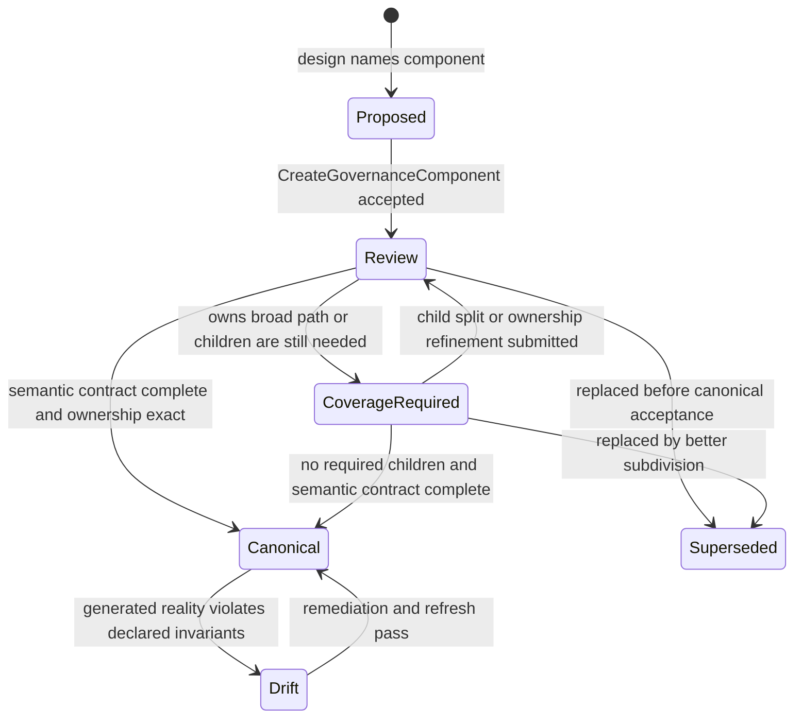
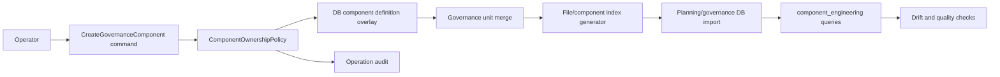
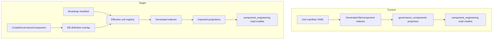

# Create Governance Component Command Rail Design

## Purpose

This proposal designs the command rail for creating governance components before
implementation. The rail exists because component creation is externally
observable architecture behavior: it changes ownership, drift detection, file
coverage, component quality, remediation queues, and planning work selection.

The current system already has mature read projections for component
engineering, but it does not have a command rail for authoring a component. That
gap encourages direct YAML or SQL edits and makes component creation hard to
validate as an architectural transition.

## Governing Sources

- `docs/planning/status/governance-document-rule-inventory.md`
- `docs/architecture/command-query-rail-governance.md`
- `docs/architecture/fowler-opportunity-planning-governance.md`
- `docs/planning/status/db-surface-inventory.md`
- `docs/planning/status/system-governance-unit-taxonomy-20260501.md`
- `docs/planning/status/system-governance-unit-index-20260501.md`
- `docs/adr/adr-0055-planning-db-canonical-operational-source.md`

## Current-State Analysis

Component engineering has strong query-side coverage:

- `docs/planning/status/system-governance-unit-index.units.yaml` is the human
  and bootstrap manifest for governance units.
- `scripts/check-governance-unit-coverage.cjs` validates unit shape, parent
  chains, semantic metadata, exact file ownership, and overlapping path claims.
- `scripts/generate-governance-file-component-index.cjs` derives file entries,
  component entries, component file shards, and generated component indexes.
- `scripts/planning-db-import.cjs` imports generated component snapshots into
  `planning_query_store.governance_components`,
  `planning_query_store.governance_component_files`, and related tables.
- `tools/planning-db/migrations/025_governance_unit_tree_query.sql` reconstructs
  a unit tree from component `unitReferences`.
- `component_engineering.*` views expose tree, metadata, drift, rules, quality,
  and file ownership read models.

The missing part is the write side. Creating a component today means editing the
manifest directly, refreshing generated indexes, and trusting that the later
checks catch issues. Mature systems do not treat a write to a governed registry
as an ad hoc file edit. They use a command with explicit admission policy,
idempotency, validation, and a receipt.

## Root Opportunity

The Fowler opportunity is to replace a "metadata edit" workflow with an
application command around a domain-owned registry. This moves component
creation from accidental structure to an explicit bounded-context behavior:

- The command owns invariants.
- The definition registry owns authoritative component declarations.
- Read models stay derived.
- Drift checks compare declared intent with generated reality.
- Operators stop confusing generated projections with writable state.

## Command Rail

### Catalog Entry

- Rail name: `CreateGovernanceComponent`
- Type: Command
- Owning bounded context: Governance local operations
- Governing story, task, ADR, contract, or proposal: this proposal and ADR-0055
- Product/system intent: create a new governed component or child component so
  repository files can be assigned to a semantically owned boundary
- DDD ownership: `GovernanceComponentDefinition` aggregate with
  `ComponentOwnershipPolicy` and `ComponentSemanticContract` value objects
- Input value objects:
  - `ComponentId`
  - `ParentComponentId`
  - `ComponentLevel`
  - `ComponentStatus`
  - `OwnedConcern`
  - `PathOwnershipPattern[]`
  - `ExcludedPathPattern[]`
  - `DddOwner`
  - `CommandQueryRailPosture`
  - `GovernanceReference[]`
  - `FowlerSignal[]`
  - `ComponentSemanticContract`
- Output receipt:
  - `componentId`
  - `definitionRevision`
  - `operationId`
  - `sourceContentSha256`
  - projected validation summary
  - affected owned-file sample
  - generated follow-up query
- Aggregate/projection touched:
  - authoritative DB overlay table for governance unit definitions
  - operation audit table
  - generated/imported component engineering read models after refresh
- Inbound port/use case: `pnpm planning:db:operate component create ...`
- Outbound adapters:
  - planning DB
  - governance unit manifest reader
  - file ownership validator
  - governance refresh/import pipeline
- Scope and authorization: repo-local maintainer command; no product tenant data
- Idempotency/concurrency: idempotency key includes component identity, parent,
  ownership patterns, semantic contract, actor, and expected registry revision
- Negative tests:
  - duplicate component ID
  - missing parent
  - invalid parent level
  - cyclic parent chain
  - invalid status or level
  - file ownership overlap
  - component without owned concern
  - canonical component without public API, invariants, transitions, or consumers
  - `cqRails: none` without rationale
  - stale expected revision
  - idempotency replay with different payload
- Implementation surfaces allowed:
  - `scripts/planning-db-operate.cjs`
  - planning DB migrations under `tools/planning-db/migrations/**`
  - governance generator/import scripts that merge DB definitions into generated
    read models
  - docs and tests for the rail
- Status: accepted

## Model

### Aggregate: `GovernanceComponentDefinition`

The aggregate represents the authored definition of a component. It is not the
same thing as `governance_components`, which is a derived projection imported
from generated governance indexes.

Fields:

- `componentId`: stable uppercase ID, immutable after creation.
- `name`: human-readable display name.
- `parentComponentId`: existing unit/component parent.
- `level`: `component` for this rail; `source` is a future rail because source
  units need file-level semantics.
- `status`: initially `review` or `coverage-required`; `canonical` is allowed
  only when all semantic metadata and validation evidence are present.
- `ownedConcern`: short statement of the concern the component owns.
- `responsibilities`: concrete responsibilities.
- `nonGoals`: responsibilities explicitly outside the component.
- `reasonsToChange`: change axes that justify component identity.
- `publicApi`: commands, queries, ports, package exports, or operator surfaces.
- `invariants`: facts the component must preserve.
- `transitions`: lifecycle or ownership transitions the component permits.
- `consumers`: runtime, docs, CI, or operator consumers.
- `owns`: glob patterns for owned files.
- `excludes`: glob patterns subtracted from `owns`.
- `dddOwner`: DDD owner classification or bounded-context owner.
- `cqRails`: accepted/proposed command/query rails or `none - <rationale>`.
- `governance`: docs, ADRs, risks, evidence, or proposals backing the component.
- `fowlerSignals`: opportunity signals that explain why the component exists.

### Value Objects

`PathOwnershipPattern`

- Must be a repository-relative glob.
- Must match at least one file unless the component is intentionally empty and
  `childrenRequired: true`.
- Must not claim files already claimed by another active component unless the
  losing component excludes those paths or is superseded.

`ComponentSemanticContract`

- Bundles `ownedConcern`, `publicApi`, `invariants`, `transitions`,
  `consumers`, `responsibilities`, `nonGoals`, and `reasonsToChange`.
- Prevents "component as label" without semantic closure.

`CommandQueryRailPosture`

- Is either a list of accepted/proposed rails or a `none - <rationale>` value.
- Empty `none` is invalid because it hides behavior boundaries.

## Invariants

Identity:

- A component ID is globally unique.
- A component ID is immutable.
- The ID uses the same uppercase `SYS-*` governance family style.

Hierarchy:

- The parent must already exist in the effective governance unit tree.
- Parent level must allow component children according to the taxonomy.
- Parent chains must remain acyclic.
- Root and domain are derived from the parent chain, not manually overridden.

Ownership:

- Only `component` and future `source` units can own files.
- A file can have exactly one active owning unit after applying the new
  component.
- `excludes` are valid only when there is an `owns` pattern.
- Broad parent components must exclude files delegated to child components.
- Empty ownership is allowed only for non-leaf planning components marked
  `childrenRequired: true`.

Semantics:

- Every component must declare an owned concern.
- `canonical` components must declare public API, invariants, transitions, and
  consumers.
- Components with `childrenRequired: true` cannot be treated as closure-ready.
- Components with direct files and `childrenRequired: true` are remediation
  candidates unless the direct file count is intentional and justified.

Rails and governance:

- `cqRails` must name rails or include a rationale for `none`.
- New executable behavior must not be introduced as a component side effect.
- Governance references must point to existing docs when the component is
  created as `canonical`.
- Proposed components may reference this proposal while awaiting acceptance.

Operational:

- The command writes an authoritative definition overlay and an audit row.
- Generated views are not writable command targets.
- Read projections must be rebuilt through the governance import/refresh path.
- Idempotent replay returns the original receipt when the payload is identical.
- Idempotent replay with a different payload is rejected.

## Transitions



## Data Flow



## Current vs Target Boundary



## API Shape

Initial operator command:

```bash
pnpm planning:db:operate component create \
  --component SYS-RUNTIME-ENGINE-NEW-CHILD \
  --name "Runtime engine new child" \
  --parent SYS-RUNTIME-ENGINE-CORE \
  --status review \
  --owned-concern "Owned concern sentence" \
  --owns "packages/@dvt/engine/src/new-child/**" \
  --ddd-owner AS \
  --cq-rails "RT-C01" \
  --public-api "RT-C01" \
  --invariant "Every accepted input is validated before persistence." \
  --transition "review -> canonical after exact file ownership check passes" \
  --consumer "component_engineering.component_tree_query" \
  --governance docs/planning/proposals/mandatory/governance-and-docs/create-governance-component-command-rail-design-20260514.md \
  --actor codex \
  --expected-revision 0
```

The first implementation should avoid a broad update command. Update,
supersede, and delete are separate rails because they have different
invariants.

## Read Consumers

The command must keep these consumers aligned:

- `pnpm planning:db:query units`
- `pnpm planning:db:query component-tree`
- `pnpm planning:db:query component-metadata`
- `pnpm planning:db:query component-drift`
- `pnpm planning:db:query component-quality`
- `pnpm planning:db:query cer`
- `pnpm docs:governance:unit-coverage`
- `pnpm docs:governance:file-component-index`
- `pnpm docs:governance:coverage-report`
- `pnpm docs:governance:remediation-queue`

## Implementation Plan

Implementation starts in this slice with the command parser/planner, DB local
definition and audit tables, and the effective unit-tree projection. Exporting
DB-authored definitions back to the bootstrap manifest remains outside this
first command rail because the authoritative operational write is the DB row.

1. Add red tests for the command catalog and DB surface inventory.
2. Add DB tables for component definition overlays and component operation
   audit rows.
3. Add `planning:db:operate component create` parsing and payload/idempotency
   tests.
4. Add a pure planner function that validates the aggregate and emits a
   definition row plus audit row.
5. Merge DB component definition overlays with the bootstrap manifest before
   file/component index generation.
6. Reuse `validateManifest` and exact file ownership checks against the merged
   effective registry.
7. Import the effective registry into existing component projections.
8. Add `component_engineering` drift/rule coverage for command-created
   components.
9. Update `db-surface-inventory.md` to mark component creation as DB-first.
10. Run targeted tests, governance refresh, docs sync, and pre-push validation.

## TDD Matrix

| Cycle | Red test                                                    | Expected failure                                   | Green surface                   |
| ----- | ----------------------------------------------------------- | -------------------------------------------------- | ------------------------------- |
| 1     | `scripts/planning-db-surface-inventory-check.test.cjs`      | missing `CreateGovernanceComponent` rail           | DB surface inventory docs/check |
| 2     | `scripts/planning-db-migrate.test.cjs`                      | missing overlay/audit tables                       | migration                       |
| 3     | `scripts/planning-db-operate.test.cjs`                      | `component create` unknown                         | parser and command payload      |
| 4     | `scripts/planning-db-operate.test.cjs`                      | duplicate/missing-parent not rejected              | planner validation              |
| 5     | `scripts/check-governance-unit-coverage.test.cjs`           | merged DB component not validated                  | effective registry merge        |
| 6     | `scripts/generate-governance-file-component-index.test.cjs` | DB-created component not reflected                 | generator input merge           |
| 7     | `scripts/planning-db-query.test.cjs`                        | component queries ignore command-created component | import/query alignment          |

## Open Decisions

- Whether the DB overlay should be exported back to
  `system-governance-unit-index.units.yaml` as a recovery snapshot.
- Whether `source` unit creation should share the rail or be a follow-up
  `CreateGovernanceSourceUnit` command.
- Whether `canonical` creation should require existing evidence references or
  only semantic metadata plus passing checks.

## Non-Goals

- Do not write directly to `planning_query_store.governance_components`.
- Do not create components as generated YAML-only edits.
- Do not make one generic `component update` command in the first slice.
- Do not bypass existing governance generators, importers, or drift checks.

## Feature Mechanization

```feature-mechanization
version: 1
featureId: CREATE-GOVERNANCE-COMPONENT-RAIL-20260514
mechanizationStatus: implemented
noHumanDecisionsRemaining: true
implementationPlan: docs/planning/proposals/mandatory/governance-and-docs/create-governance-component-command-rail-design-20260514.md
componentGuides:
  - docs/planning/status/system-governance-unit-taxonomy-20260501.md
  - docs/planning/status/system-governance-unit-index-20260501.md
  - docs/planning/status/db-surface-inventory.md
userStories:
  - docs/planning/proposals/mandatory/governance-and-docs/create-governance-component-command-rail-design-20260514.md
governingSources:
  - AGENTS.md
  - docs/planning/status/governance-document-rule-inventory.md
  - docs/guides/ai-work-protocol.md
  - docs/architecture/command-query-rail-governance.md
  - docs/architecture/fowler-opportunity-planning-governance.md
  - docs/adr/adr-0055-planning-db-canonical-operational-source.md
  - docs/planning/status/db-surface-inventory.md
allowedImplementationSurfaces:
  - docs/planning/proposals/mandatory/governance-and-docs/create-governance-component-command-rail-design-20260514.md
  - docs/planning/status/db-surface-inventory.md
  - scripts/planning-db-operate.cjs
  - scripts/planning-db-operate.test.cjs
  - scripts/planning-db-migrate.test.cjs
  - tools/planning-db/migrations/037_governance_component_definition_commands.sql
forbiddenImplementationSurfaces:
  - apps/**
  - packages/**
  - specs/**
  - .github/workflows/**
commandQueryRails:
  - name: CreateGovernanceComponent
    type: command
    dddOwner: GovernanceComponentDefinition
  - name: ReadGovernanceUnitTree
    type: query
    dddOwner: GovernanceUnitTreeReadModel
  - name: ReadComponentEngineeringMetadata
    type: query
    dddOwner: ComponentEngineeringMetadataReadModel
  - name: MigratePlanningQueryStoreSchema
    type: command
    dddOwner: PlanningQueryStoreSchema
  - name: InventoryDbGovernanceSurface
    type: query
    dddOwner: DbGovernanceSurfaceInventory
domainObjects:
  - name: GovernanceComponentDefinition
    type: aggregate
    owner: Product / Architecture / Delivery / Docs
  - name: GovernanceComponentLocalOperation
    type: command audit
    owner: Docs governance
  - name: ComponentOwnershipPolicy
    type: policy
    owner: Docs governance
  - name: ComponentSemanticContract
    type: value object
    owner: Docs governance
  - name: CreateGovernanceComponentCommandAdapter
    type: command adapter
    owner: Docs governance
  - name: GovernanceUnitTreeReadModel
    type: read model
    owner: Docs governance
  - name: ComponentEngineeringMetadataReadModel
    type: read model
    owner: Docs governance
  - name: PlanningQueryStoreSchema
    type: local schema
    owner: Product / Architecture / Delivery / Docs
  - name: DbGovernanceSurfaceInventory
    type: read model
    owner: Product / Architecture / Delivery / Docs
fowlerSignals:
  - Metadata edit workflow
  - Hidden authority
  - Primitive obsession
  - Manual component hierarchy reconstruction
  - Component as label without semantic closure
architectureGuards:
  - node --test scripts/planning-db-operate.test.cjs
  - node --test scripts/planning-db-migrate.test.cjs
  - pnpm test:planning:db
  - pnpm planning:db:migrate
  - pnpm governance:refresh
cypressFlows:
  - N/A - governance component command rail has no browser workflow.
completionGate:
  - node --test scripts/planning-db-operate.test.cjs
  - node --test scripts/planning-db-migrate.test.cjs
  - pnpm test:planning:db
  - pnpm planning:db:migrate
  - pnpm governance:refresh
  - pnpm docs:feature-mechanization:implementation
  - pnpm verify:prepush
redGreenCycles:
  - id: component-create-parser-and-planner
    redTest: node --test scripts/planning-db-operate.test.cjs
    expectedFailure: component create is rejected as an unknown planning DB operation before the command rail exists.
    patchSurfaces:
      - scripts/planning-db-operate.cjs
      - scripts/planning-db-operate.test.cjs
      - docs/planning/proposals/mandatory/governance-and-docs/create-governance-component-command-rail-design-20260514.md
    greenTest: node --test scripts/planning-db-operate.test.cjs
  - id: component-create-definition-schema
    redTest: node --test scripts/planning-db-migrate.test.cjs
    expectedFailure: governance component local definition and operation tables are absent before migration 037.
    patchSurfaces:
      - tools/planning-db/migrations/037_governance_component_definition_commands.sql
      - scripts/planning-db-migrate.test.cjs
      - docs/planning/proposals/mandatory/governance-and-docs/create-governance-component-command-rail-design-20260514.md
    greenTest: node --test scripts/planning-db-migrate.test.cjs
  - id: component-create-db-surface
    redTest: pnpm planning:db:inventory:check
    expectedFailure: CreateGovernanceComponent is not declared as a DB-owned command rail.
    patchSurfaces:
      - docs/planning/status/db-surface-inventory.md
      - docs/planning/proposals/mandatory/governance-and-docs/create-governance-component-command-rail-design-20260514.md
    greenTest: pnpm planning:db:inventory:check
symbols:
  - &createGovernanceComponentSymbol
    name: planComponentCreateOperation
    path: scripts/planning-db-operate.cjs
    dddOwner: GovernanceComponentDefinition
    cqRails:
      - CreateGovernanceComponent
      - ReadGovernanceUnitTree
      - ReadComponentEngineeringMetadata
      - MigratePlanningQueryStoreSchema
    fowlerSignals:
      - Metadata edit workflow
      - Hidden authority
      - Component as label without semantic closure
    architectureGuard: node --test scripts/planning-db-operate.test.cjs
    cypressCoverage: N/A - governance component command rail has no browser workflow.
    unitTests:
      - node --test scripts/planning-db-operate.test.cjs
      - pnpm test:planning:db
  - <<: *createGovernanceComponentSymbol
    name: allowedComponentParentLevels
    dddOwner: ComponentOwnershipPolicy
  - <<: *createGovernanceComponentSymbol
    name: allowedComponentStatuses
  - <<: *createGovernanceComponentSymbol
    name: componentListOptionKeys
    dddOwner: CreateGovernanceComponentCommandAdapter
  - <<: *createGovernanceComponentSymbol
    name: validateComponentStatus
    dddOwner: ComponentOwnershipPolicy
  - <<: *createGovernanceComponentSymbol
    name: validateComponentId
    dddOwner: ComponentOwnershipPolicy
  - <<: *createGovernanceComponentSymbol
    name: validateComponentCqRails
    dddOwner: ComponentSemanticContract
  - <<: *createGovernanceComponentSymbol
    name: parseBooleanOption
    dddOwner: CreateGovernanceComponentCommandAdapter
  - <<: *createGovernanceComponentSymbol
    name: assertComponentIdempotentReplayMatches
    dddOwner: GovernanceComponentLocalOperation
  - <<: *createGovernanceComponentSymbol
    name: normalizeListOption
    dddOwner: CreateGovernanceComponentCommandAdapter
  - <<: *createGovernanceComponentSymbol
    name: validateComponentCreateCommand
    dddOwner: ComponentSemanticContract
  - <<: *createGovernanceComponentSymbol
    name: parseComponentCommand
    dddOwner: CreateGovernanceComponentCommandAdapter
  - <<: *createGovernanceComponentSymbol
    name: normalizeGovernanceUnit
    dddOwner: GovernanceUnitTreeReadModel
  - <<: *createGovernanceComponentSymbol
    name: normalizeComponentDefinition
  - <<: *createGovernanceComponentSymbol
    name: semanticArrayField
    dddOwner: ComponentSemanticContract
  - <<: *createGovernanceComponentSymbol
    name: buildRawUnitFromComponentCreateCommand
  - <<: *createGovernanceComponentSymbol
    name: componentDefinitionSourceHash
    dddOwner: GovernanceComponentLocalOperation
  - <<: *createGovernanceComponentSymbol
    name: readExistingComponentOperation
    dddOwner: GovernanceComponentLocalOperation
  - <<: *createGovernanceComponentSymbol
    name: readGovernanceUnit
    dddOwner: GovernanceUnitTreeReadModel
  - <<: *createGovernanceComponentSymbol
    name: readEffectiveComponentDefinition
  - <<: *createGovernanceComponentSymbol
    name: writePlannedComponentCreateOperation
    dddOwner: GovernanceComponentLocalOperation
  - <<: *createGovernanceComponentSymbol
    name: applyComponentCreateOperation
    dddOwner: GovernanceComponentLocalOperation
  - <<: *createGovernanceComponentSymbol
    name: GovernanceComponentDefinitionCommandsMigration
    path: tools/planning-db/migrations/037_governance_component_definition_commands.sql
    dddOwner: PlanningQueryStoreSchema
    architectureGuard: node --test scripts/planning-db-migrate.test.cjs
    unitTests:
      - node --test scripts/planning-db-migrate.test.cjs
      - pnpm planning:db:migrate
```
