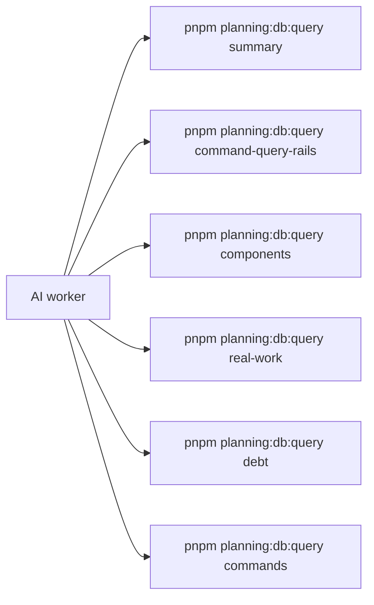
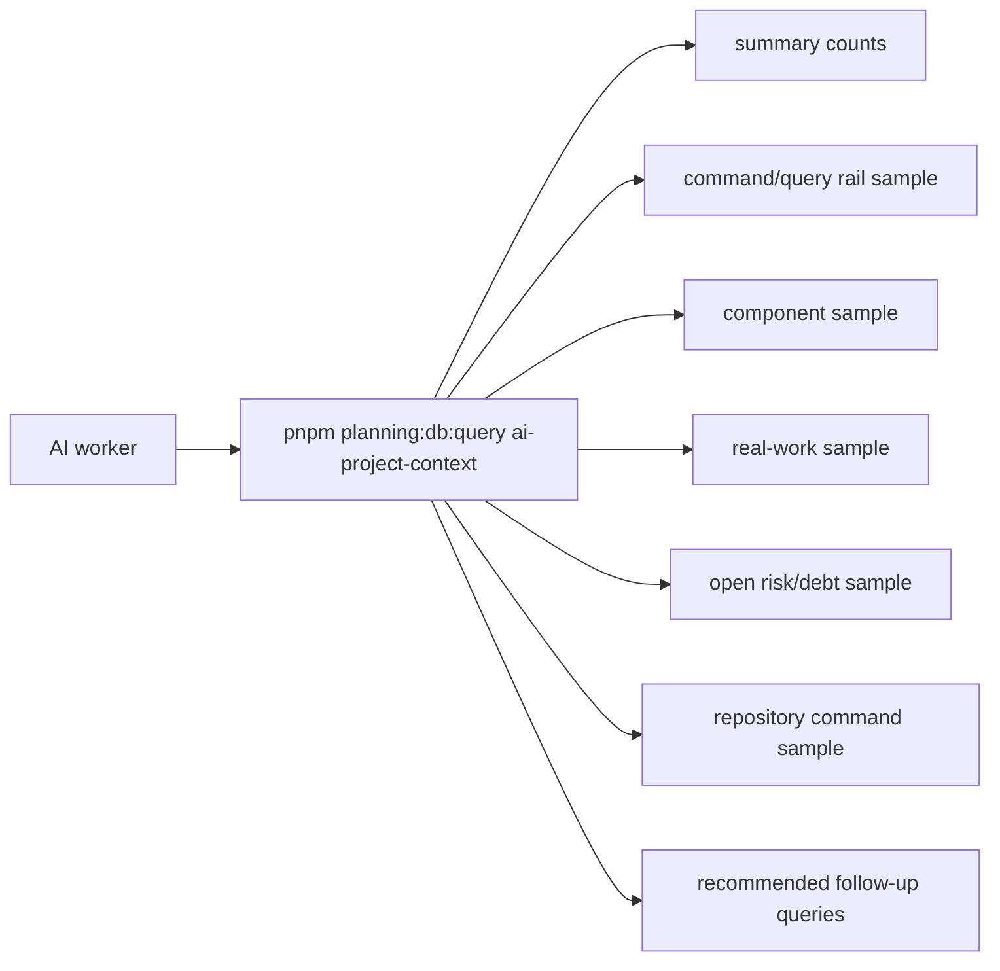

# DB-First AI Project Context Query Plan

## Goal

Expose one DB-first query rail that lets an AI worker inspect project state
before creating commands, queries, components, documents, or implementation
work. The query must reuse existing planning DB read models and render either
structured JSON or a Markdown brief shaped like a reusable template.

## Governing Sources

- `AGENTS.md`
- `docs/planning/status/governance-document-rule-inventory.md`
- `docs/guides/ai-work-protocol.md`
- `docs/planning/status/db-surface-inventory.md`
- `docs/architecture/command-query-rail-governance.md`
- `docs/architecture/fowler-opportunity-planning-governance.md`
- `docs/adr/adr-0055-planning-db-canonical-operational-source.md`

## Current State



The DB already owns the key read models, but an AI worker has to know every
query name and manually combine the result. This creates a discovery tax and
encourages duplicate rails or components when the existing state is not checked
first.

## Target State



The query is an aggregate read model over existing DB projections. It does not
write files. Markdown export is stdout-only, so operators can redirect it into a
review artifact without turning a query into a hidden command.

## Command And Query Rail

- Rail name: `QueryAiProjectContext`
- Type: Query
- Owning context: Planning and governance local operations
- DDD object/read model: `AiProjectContextReadModel`
- Application port:
  `pnpm planning:db:query ai-project-context --format json|markdown`
- Adapter surface: `scripts/planning-db-query.cjs`
- Scope and auth: repo-local, read-only maintainer and CI inspection query
- Projection freshness: `planning:db:query` runs governance import with
  `--if-stale` before reading governance-backed projections.
- Negative tests: unknown query rejection, format validation, DB-backed
  aggregate reads, Markdown rendering from aggregate rows, and no file write
  side effect.

## Fowler Analysis

- **Information Radiator:** the query makes project state visible through one
  deliberate read model instead of forcing agents to reconstruct state by
  searching documents.
- **Published Interface:** the command line becomes a stable API for agentic
  project-state discovery, while each underlying DB projection remains owned by
  its bounded context.
- **Single Source of Truth:** the query aggregates existing DB projections; it
  does not duplicate command, component, task, or debt semantics in Markdown.
- **Parallel Model Risk:** a separate generated status document could drift from
  DB rows. The fix is stdout rendering from the DB aggregate, not a second
  writable state surface.
- **Shotgun Surgery Risk:** future project-state additions should extend the
  aggregate builder and feature manifest symbols, not add another ad hoc query
  script.

## Reusable Markdown Template Shape

The stable documentation template is
`docs/planning/templates/ai-project-context-template.md`.

```text
# DB-first AI project context

## Project state
## Counts
## Open incidents and debt
## Existing command/query rails
## Existing components
## Current real work
## Repository commands
## Recommended follow-up queries
```

The concrete output is generated by
`pnpm planning:db:query ai-project-context --format markdown`, which fills this
shape from DB rows.

## Feature Mechanization

```feature-mechanization
version: 1
featureId: GD-AI-PROJECT-CONTEXT-DB-FIRST-20260602
mechanizationStatus: implemented
noHumanDecisionsRemaining: true
implementationPlan: docs/planning/proposals/mandatory/governance-and-docs/db-first-ai-project-context-query-plan-20260602.md
componentGuides:
  - docs/planning/proposals/mandatory/governance-and-docs/db-first-ai-project-context-query-plan-20260602.md
userStories:
  - As an AI worker, I can query one DB-first project context before creating new rails or components.
  - As an architect, I can see open incidents, rail gaps, duplicates, components, commands, and current real work in one reviewable output.
governingSources:
  - AGENTS.md
  - docs/planning/status/governance-document-rule-inventory.md
  - docs/guides/ai-work-protocol.md
  - docs/planning/status/db-surface-inventory.md
  - docs/architecture/command-query-rail-governance.md
  - docs/architecture/fowler-opportunity-planning-governance.md
  - docs/adr/adr-0055-planning-db-canonical-operational-source.md
allowedImplementationSurfaces:
  - docs/planning/proposals/mandatory/governance-and-docs/db-first-ai-project-context-query-plan-20260602.md
  - docs/planning/templates/ai-project-context-template.md
  - docs/planning/status/db-surface-inventory.md
  - docs/.manifest.json
  - docs/**/index.md
  - scripts/planning-db-query.cjs
  - scripts/planning-db-query.test.cjs
forbiddenImplementationSurfaces:
  - apps/**
  - packages/**
  - specs/contracts/**
commandQueryRails:
  - name: QueryAiProjectContext
    type: query
    dddOwner: AiProjectContextReadModel
domainObjects:
  - name: AiProjectContextReadModel
    type: aggregate read model
    owner: Architecture / Docs / Delivery
fowlerSignals:
  - Information Radiator for agentic project-state discovery.
  - Published Interface for DB-first project context.
  - Parallel Model risk avoided by stdout rendering from DB rows.
architectureGuards:
  - node --test scripts/planning-db-query.test.cjs
  - pnpm planning:db:inventory:check
  - pnpm docs:feature-mechanization:implementation
cypressFlows:
  - N/A - DB governance query rail only
completionGate:
  - pnpm governance:refresh
  - pnpm planning:db:inventory:check
  - node --test scripts/planning-db-query.test.cjs
  - pnpm verify:prepush
redGreenCycles:
  - id: ai-project-context-query
    redTest: node --test scripts/planning-db-query.test.cjs
    expectedFailure: ai-project-context is an unknown planning DB query and no renderer exists.
    patchSurfaces:
      - scripts/planning-db-query.cjs
      - scripts/planning-db-query.test.cjs
    greenTest: node --test scripts/planning-db-query.test.cjs
symbols:
  - name: parseOutputFormat
    path: scripts/planning-db-query.cjs
    dddOwner: AiProjectContextReadModel
    cqRails: [QueryAiProjectContext]
    fowlerSignals: [Published Interface]
    architectureGuard: node --test scripts/planning-db-query.test.cjs
    cypressCoverage: N/A - CLI parser helper
    unitTests:
      - scripts/planning-db-query.test.cjs
  - name: aiProjectContextRecommendedQueries
    path: scripts/planning-db-query.cjs
    dddOwner: AiProjectContextReadModel
    cqRails: [QueryAiProjectContext]
    fowlerSignals: [Information Radiator]
    architectureGuard: node --test scripts/planning-db-query.test.cjs
    cypressCoverage: N/A - query recommendation catalog
    unitTests:
      - scripts/planning-db-query.test.cjs
  - name: numericCount
    path: scripts/planning-db-query.cjs
    dddOwner: AiProjectContextReadModel
    cqRails: [QueryAiProjectContext]
    fowlerSignals: [Single Source of Truth]
    architectureGuard: node --test scripts/planning-db-query.test.cjs
    cypressCoverage: N/A - normalization helper
    unitTests:
      - scripts/planning-db-query.test.cjs
  - name: normalizeAiCommandQueryRail
    path: scripts/planning-db-query.cjs
    dddOwner: AiProjectContextReadModel
    cqRails: [QueryAiProjectContext]
    fowlerSignals: [Single Source of Truth]
    architectureGuard: node --test scripts/planning-db-query.test.cjs
    cypressCoverage: N/A - row normalization helper
    unitTests:
      - scripts/planning-db-query.test.cjs
  - name: normalizeAiComponent
    path: scripts/planning-db-query.cjs
    dddOwner: AiProjectContextReadModel
    cqRails: [QueryAiProjectContext]
    fowlerSignals: [Single Source of Truth]
    architectureGuard: node --test scripts/planning-db-query.test.cjs
    cypressCoverage: N/A - row normalization helper
    unitTests:
      - scripts/planning-db-query.test.cjs
  - name: normalizeAiRealWork
    path: scripts/planning-db-query.cjs
    dddOwner: AiProjectContextReadModel
    cqRails: [QueryAiProjectContext]
    fowlerSignals: [Single Source of Truth]
    architectureGuard: node --test scripts/planning-db-query.test.cjs
    cypressCoverage: N/A - row normalization helper
    unitTests:
      - scripts/planning-db-query.test.cjs
  - name: normalizeAiRiskDebt
    path: scripts/planning-db-query.cjs
    dddOwner: AiProjectContextReadModel
    cqRails: [QueryAiProjectContext]
    fowlerSignals: [Single Source of Truth]
    architectureGuard: node --test scripts/planning-db-query.test.cjs
    cypressCoverage: N/A - row normalization helper
    unitTests:
      - scripts/planning-db-query.test.cjs
  - name: normalizeAiRepositoryCommand
    path: scripts/planning-db-query.cjs
    dddOwner: AiProjectContextReadModel
    cqRails: [QueryAiProjectContext]
    fowlerSignals: [Single Source of Truth]
    architectureGuard: node --test scripts/planning-db-query.test.cjs
    cypressCoverage: N/A - row normalization helper
    unitTests:
      - scripts/planning-db-query.test.cjs
  - name: normalizeAiPrReadiness
    path: scripts/planning-db-query.cjs
    dddOwner: AiProjectContextReadModel
    cqRails: [QueryAiProjectContext]
    fowlerSignals: [Single Source of Truth]
    architectureGuard: node --test scripts/planning-db-query.test.cjs
    cypressCoverage: N/A - row normalization helper
    unitTests:
      - scripts/planning-db-query.test.cjs
  - name: buildAiProjectContext
    path: scripts/planning-db-query.cjs
    dddOwner: AiProjectContextReadModel
    cqRails: [QueryAiProjectContext]
    fowlerSignals: [Information Radiator]
    architectureGuard: node --test scripts/planning-db-query.test.cjs
    cypressCoverage: N/A - CLI formatter helper
    unitTests:
      - scripts/planning-db-query.test.cjs
  - name: renderAiProjectContextMarkdown
    path: scripts/planning-db-query.cjs
    dddOwner: AiProjectContextReadModel
    cqRails: [QueryAiProjectContext]
    fowlerSignals: [Parallel Model]
    architectureGuard: node --test scripts/planning-db-query.test.cjs
    cypressCoverage: N/A - Markdown renderer helper
    unitTests:
      - scripts/planning-db-query.test.cjs
  - name: markdownCell
    path: scripts/planning-db-query.cjs
    dddOwner: AiProjectContextReadModel
    cqRails: [QueryAiProjectContext]
    fowlerSignals: [Parallel Model]
    architectureGuard: node --test scripts/planning-db-query.test.cjs
    cypressCoverage: N/A - Markdown renderer helper
    unitTests:
      - scripts/planning-db-query.test.cjs
  - name: markdownTable
    path: scripts/planning-db-query.cjs
    dddOwner: AiProjectContextReadModel
    cqRails: [QueryAiProjectContext]
    fowlerSignals: [Parallel Model]
    architectureGuard: node --test scripts/planning-db-query.test.cjs
    cypressCoverage: N/A - Markdown renderer helper
    unitTests:
      - scripts/planning-db-query.test.cjs
  - name: markdownSection
    path: scripts/planning-db-query.cjs
    dddOwner: AiProjectContextReadModel
    cqRails: [QueryAiProjectContext]
    fowlerSignals: [Parallel Model]
    architectureGuard: node --test scripts/planning-db-query.test.cjs
    cypressCoverage: N/A - Markdown renderer helper
    unitTests:
      - scripts/planning-db-query.test.cjs
  - name: readAiProjectContext
    path: scripts/planning-db-query.cjs
    dddOwner: AiProjectContextReadModel
    cqRails: [QueryAiProjectContext]
    fowlerSignals: [Single Source of Truth]
    architectureGuard: node --test scripts/planning-db-query.test.cjs
    cypressCoverage: N/A - DB query helper
    unitTests:
      - scripts/planning-db-query.test.cjs
```

## Closeout Checks

- [ ] Add failing tests for query parsing, aggregate building, DB reads, and
      Markdown rendering.
- [ ] Expose `pnpm planning:db:query ai-project-context`.
- [ ] Update the DB surface inventory.
- [ ] Run governance refresh and pre-push validation before PR.
