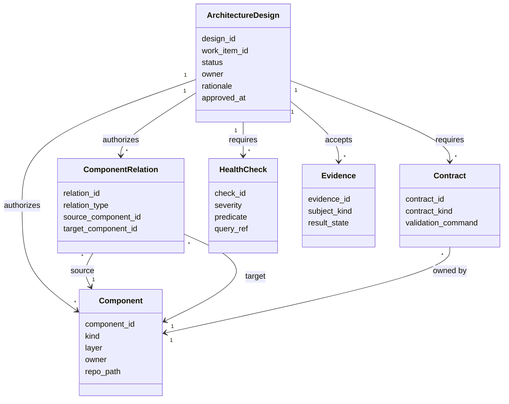
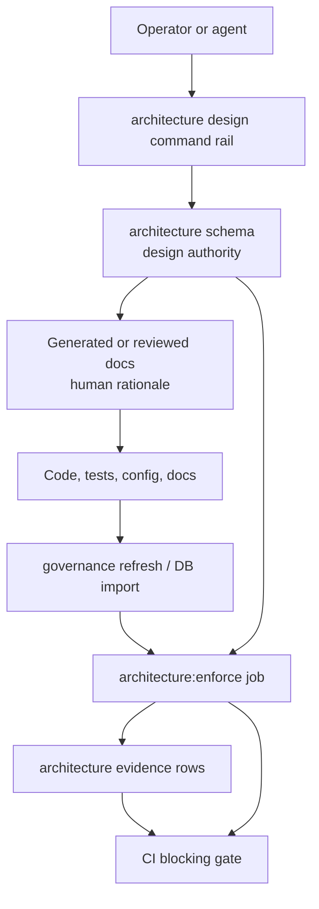
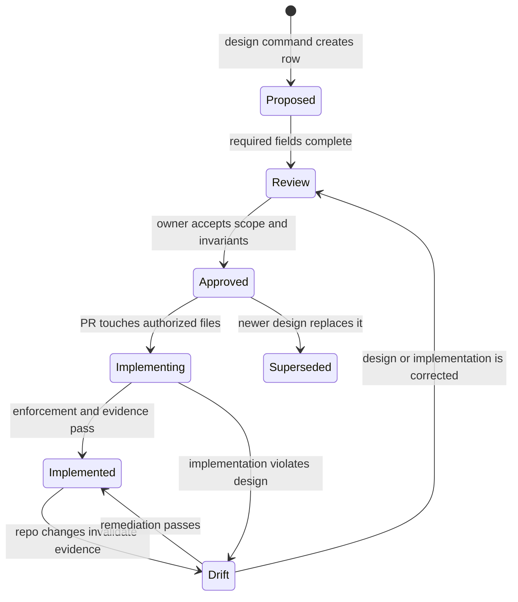

# DB-First Architecture Authority Plan

## Purpose

Owned concern: make architecture intent executable before implementation starts.

The repository already has DB-backed planning, governance, and component
engineering query surfaces. The remaining gap is authority. A component can be
described in files, inferred from generated indexes, and inspected through DB
views, but implementation is not yet forced to prove that it follows an approved
architecture design row.

This plan defines the target model where architecture design lives in the
database first, and code, docs, tests, evidence, and CI gates are checked against
that design. Markdown remains the human explanation and review artifact. It is
not the sole operational authority for implementation scope.

## Governing Sources

- `AGENTS.md`
- `docs/planning/status/governance-document-rule-inventory.md`
- `docs/architecture/command-query-rail-governance.md`
- `docs/architecture/fowler-opportunity-planning-governance.md`
- `docs/architecture/components/ci-governance/component-engineering-invariants.md`
- `docs/architecture/components/ci-governance/component-engineering-record-component.md`
- `docs/planning/proposals/mandatory/governance-and-docs/create-governance-component-command-rail-design-20260514.md`
- `docs/planning/proposals/mandatory/governance-and-docs/component-engineering-composite-hierarchy-plan-20260513.md`
- `docs/planning/proposals/mandatory/governance-and-docs/planning-state-query-store-plan-20260506.md`
- `docs/adr/adr-0055-planning-db-canonical-operational-source.md`

## Current-State Analysis

The current component model is useful but incomplete.

What exists:

- `component_engineering.component_tree_query` exposes component hierarchy.
- `component_engineering.file_ownership_query` maps files to components.
- `component_engineering.component_metadata_query` exposes semantic metadata.
- `component_engineering.rule_catalog_query` and
  `component_engineering.rule_evaluation_query` expose invariants and drift.
- `planning:db:query component-*` renders component read models for operators.
- `planning:db:operate component create` exists as a command rail for creating
  governed component definitions.

What is missing:

- There is no DB-owned architecture design object that says which components,
  relations, ports, flows, contracts, decisions, evidence, and checks are
  authorized for a slice before implementation.
- The model exposes hierarchy, but not enough operational collaboration:
  inputs, outputs, transformations, event IO, storage IO, dependency direction,
  runtime surface, observability, and risk.
- CI can validate many generated governance facts, but it does not yet block
  implementation that touches architecture outside an approved design intent.
- Existing mechanization can still start from a file artifact and only later be
  imported or checked by the DB.

## Fowler Opportunity Review

The prototype must not become a larger inventory with the same weak semantics.
The target model must use the DB to expose the same forces a Fowler review would
look for in a mature system: ownership, reasons to change, coupling pressure,
boundary crossings, and drift between design and implementation.

| Current signal                                      | Fowler opportunity                  | DB-first correction                                                             |
| --------------------------------------------------- | ----------------------------------- | ------------------------------------------------------------------------------- |
| Components are visible mostly as hierarchy          | Boundary drift                      | Model `contains` separately from runtime and dependency relations               |
| Metadata differs per record and can hide rules      | Primitive obsession / anemic domain | Move typed semantics into tables, enums, relations, and health checks           |
| Files can be indexed without design authorization   | Hidden authority                    | Require `architecture.design` scope before implementation is accepted           |
| Markdown can describe target state without DB proof | Documentation drift                 | Treat docs as generated/review rationale, with DB rows as operational authority |
| Tests are not tied to component invariants          | Test-only confidence                | Attach required tests to components, ports, contracts, flows, and checks        |
| Dependencies are inferred after the fact            | Feature envy / boundary drift       | Store intended relation edges and fail when imports/runtime calls drift         |
| A component can grow without pressure signals       | Responsibility overload             | Store responsibilities, size metrics, fan-in/fan-out, and maturity reasons      |

This turns the model from "where are the files?" into "what owned concern is
this component allowed to satisfy, through which boundaries, with which proof?".

## Patterns Applied

The architecture authority model applies these patterns deliberately:

| Pattern            | Use in this model                                                                                           | Anti-pattern prevented                     |
| ------------------ | ----------------------------------------------------------------------------------------------------------- | ------------------------------------------ |
| Aggregate Root     | `architecture.design` owns approval state for a slice                                                       | Free-floating component edits              |
| Repository         | Planning DB command/query rails persist and expose design state                                             | Scripts writing local truth                |
| Service Layer      | Command rails admit design creation, approval, evidence, and drift reconciliation                           | Route-shaped architecture changes          |
| Gateway            | Import/enforcement jobs translate Git, docs, and CI facts into DB evidence                                  | CI logs as the only source of proof        |
| Mapper / Assembler | Query views project normalized tables into operator shapes                                                  | Opaque JSON blobs as the model             |
| Policy Object      | Health checks encode fitness predicates                                                                     | Human-only review rules                    |
| Published Language | Contracts and ports name cross-component language                                                           | Repeated local names for the same boundary |
| Strangler Fig      | `architecture` becomes write authority while `component_engineering` remains read projection during cutover | Big-bang replacement                       |

## Target Principle

No implementation without design authority.

For architecture-impacting work, the first durable object must be a DB design
record. Implementation is allowed only when the changed files, exposed ports,
relations, contracts, tests, risks, and evidence are covered by that design
record.

```text
Design in DB -> generated human docs -> implementation -> enforcement job -> evidence
```

The DB does not replace Git. It becomes the operational command/query authority.
Git remains the reviewable history and transport. Exported docs, evidence, and
generated indexes prove what DB design state authorized a change.

## Domain Model

`architecture.design` is the aggregate root for architecture-impacting work.
Components, relations, contracts, flows, evidence, and health checks can exist
as long-lived catalog rows, but implementation authorization is granted only by
an approved design aggregate that names the intended scope.



Domain invariants:

- A design cannot be approved with no authorized components.
- A design cannot approve implementation paths outside its component scope.
- A design cannot approve a relation whose source or target component is
  unknown.
- A design cannot mark implementation complete while required health checks or
  evidence are missing.
- A superseded design cannot authorize new implementation.

## Target Architecture



## Schema Boundary Decision

The target design authority should use an `architecture` schema.

Reasoning:

- `component_engineering` is currently a component inspection and quality model.
- The new authority is broader than component engineering: it owns contracts,
  decisions, evidence requirements, flows, health checks, implementation
  authorization, and enforcement outcomes.
- Keeping a single writable authority avoids split-brain. The `architecture`
  schema owns design intent. `component_engineering` may project component
  quality and existing read compatibility during the cutover, but it must not be
  a second authoring surface.

Hard rule:

- New design writes go to `architecture.*`.
- `component_engineering.*` remains read/query projection until it is cut over
  or replaced.
- No feature may author equivalent architecture intent in Markdown, YAML, and DB
  at the same time. One command writes the authority; other surfaces are
  generated or explanatory.

## Core Tables

### `architecture.design`

The design table is the aggregate root for a governed architecture slice.

| Column          | Type        | Meaning                                                                  |
| --------------- | ----------- | ------------------------------------------------------------------------ |
| `design_id`     | text PK     | Stable design identity                                                   |
| `work_item_id`  | text        | Planning task, review, ADR, proposal, or PR work item                    |
| `title`         | text        | Short design title                                                       |
| `owner`         | text        | Accountable design owner                                                 |
| `status`        | enum        | `proposed`, `review`, `approved`, `implementing`, `implemented`, `drift` |
| `rationale`     | text        | Why this design exists                                                   |
| `fowler_signal` | enum        | Primary Fowler opportunity type                                          |
| `rail_ref`      | text        | Explicit command/query rail that governs the design                      |
| `approved_at`   | timestamptz | Approval timestamp, null until approved                                  |
| `supersedes_id` | text FK     | Previous design, when replacing a stale design                           |

`architecture.design` is not a document registry. It is the admission record
that says implementation is allowed to proceed for a named scope.

### `architecture.design_scope`

Design scope links an approved design to authorized subjects and file surfaces.

| Column         | Type    | Meaning                                                                 |
| -------------- | ------- | ----------------------------------------------------------------------- |
| `design_id`    | text FK | Owning design                                                           |
| `subject_kind` | enum    | `component`, `relation`, `contract`, `flow`, `check`, `path`, `query`   |
| `subject_id`   | text    | Subject identity, path prefix, or query ref                             |
| `scope_kind`   | enum    | `may_create`, `may_update`, `may_delete`, `may_reference`, `must_prove` |
| `required`     | boolean | Whether closeout is blocked if this subject lacks evidence              |

This table is what lets CI answer: "is this changed file or relation inside the
approved design?".

### `architecture.design_operations`

The design operation ledger records command execution. It is not the aggregate;
it is the audit and idempotency boundary for writes that change the aggregate.

| Column                  | Type    | Meaning                                                       |
| ----------------------- | ------- | ------------------------------------------------------------- |
| `operation_id`          | text PK | Durable command execution identity                            |
| `idempotency_key`       | text    | Unique replay key for one logical command                     |
| `operation_type`        | enum    | `architecture_design_create` in the first command slice       |
| `actor`                 | text    | Maintainer or automation identity that executed the command   |
| `design_id`             | text FK | Design aggregate affected by the command                      |
| `source_ref`            | text    | Governing doc, proposal, ADR, PR, or DB source behind command |
| `source_content_sha256` | text    | Source hash used to reject stale idempotent replays           |
| `payload`               | jsonb   | Canonical command payload for replay comparison               |

Operation rows make the Fowler correction explicit: design authority is a
behavioral lifecycle, not a raw table edit. A repeated idempotency key is valid
only when the actor, design id, source ref, source hash, and payload all match.

### `architecture.component`

The component table is the identity and metadata root. It must not hide
relations as opaque JSON.

| Column            | Type    | Meaning                                                                                      |
| ----------------- | ------- | -------------------------------------------------------------------------------------------- |
| `component_id`    | text PK | Stable architecture identity                                                                 |
| `name`            | text    | Human-readable component name                                                                |
| `kind`            | enum    | `package`, `module`, `port`, `adapter`, `service`, `ui-view`, `workflow`, `dbt-model`, `api` |
| `layer`           | enum    | `domain`, `application`, `adapter`, `ui`, `infra`, `contracts`                               |
| `owner`           | text    | DDD or team owner                                                                            |
| `repo_path`       | text    | Canonical path or path prefix                                                                |
| `public_contract` | text    | Main public API or contract summary                                                          |
| `runtime`         | text    | Runtime where the component executes, or `none`                                              |
| `criticality`     | enum    | `low`, `medium`, `high`, `critical`                                                          |
| `status`          | enum    | `proposed`, `review`, `approved`, `implemented`, `deprecated`                                |
| `maturity_score`  | numeric | Derived score from query, not manually trusted                                               |

Allowed `kind` values start narrow. New values require a decision row.

### `architecture.component_responsibility`

Responsibilities make SRP measurable instead of subjective.

| Column              | Type    | Meaning                                                     |
| ------------------- | ------- | ----------------------------------------------------------- |
| `component_id`      | text FK | Owning component                                            |
| `responsibility_id` | text    | Stable responsibility identity                              |
| `responsibility`    | text    | One reason this component exists                            |
| `reason_to_change`  | text    | Change force that legitimately belongs to the component     |
| `ddd_owner`         | text    | Aggregate, policy, service, projection, or read model owner |
| `status`            | enum    | `proposed`, `approved`, `implemented`, `drift`              |

A component with many unrelated reasons to change should fail a warning-level
health check and surface as Fowler `Responsibility overload`.

### `architecture.component_metric`

Metrics make size, coupling, and maturity visible without embedding them in the
component row.

| Column            | Type        | Meaning                                                                        |
| ----------------- | ----------- | ------------------------------------------------------------------------------ |
| `component_id`    | text FK     | Component identity                                                             |
| `metric_name`     | enum        | `file_count`, `loc`, `fan_in`, `fan_out`, `test_count`, `coverage`, `maturity` |
| `metric_value`    | numeric     | Metric value                                                                   |
| `threshold_value` | numeric     | Threshold used by a health check, when applicable                              |
| `measured_at`     | timestamptz | Measurement timestamp                                                          |
| `source_ref`      | text        | Generator, query, or coverage source                                           |

The mature-system posture is not "small components everywhere". It is visible
component size and coupling pressure, with explicit exceptions where the design
chooses a larger coordination boundary.

### `architecture.component_relation`

The relation table is the property graph edge. Parent/child hierarchy is only
one relation type.

| Column                | Type    | Meaning                                        |
| --------------------- | ------- | ---------------------------------------------- |
| `relation_id`         | text PK | Stable edge identity                           |
| `source_component_id` | text FK | Origin component                               |
| `target_component_id` | text FK | Target component                               |
| `relation_type`       | enum    | See relation taxonomy below                    |
| `direction`           | enum    | `outbound`, `inbound`, `bidirectional`         |
| `sync_async`          | enum    | `sync`, `async`, `batch`, `build_time`         |
| `contract_id`         | text FK | Contract governing this relation, if any       |
| `failure_mode`        | text    | Expected failure behavior                      |
| `authorization_scope` | text    | Scope needed to exercise the relation          |
| `source_refs`         | jsonb   | Source file/function refs used by evidence     |
| `status`              | enum    | `proposed`, `approved`, `implemented`, `drift` |

Relation taxonomy:

| Type              | Meaning                                           |
| ----------------- | ------------------------------------------------- |
| `contains`        | Structural composition                            |
| `depends_on`      | Static dependency                                 |
| `calls`           | Synchronous runtime invocation                    |
| `publishes`       | Emits an event                                    |
| `consumes`        | Consumes an event                                 |
| `reads`           | Reads storage or read model                       |
| `writes`          | Writes storage or state                           |
| `implements_port` | Adapter implements a port                         |
| `exposes_api`     | Component exposes an API surface                  |
| `transforms`      | Converts input contract to output contract        |
| `guards`          | Enforces invariant, policy, or authorization rule |

### `architecture.component_port`

Ports make inputs and outputs explicit.

| Column               | Type    | Meaning                                                    |
| -------------------- | ------- | ---------------------------------------------------------- |
| `port_id`            | text PK | Stable port identity                                       |
| `component_id`       | text FK | Owning component                                           |
| `port_name`          | text    | Port name                                                  |
| `port_kind`          | enum    | `command`, `query`, `event`, `storage`, `api`, `ui-action` |
| `direction`          | enum    | `inbound`, `outbound`                                      |
| `input_contract_id`  | text FK | Input contract                                             |
| `output_contract_id` | text FK | Output contract                                            |
| `negative_tests`     | text[]  | Required negative-path test descriptions                   |
| `status`             | enum    | `proposed`, `approved`, `implemented`                      |

### `architecture.contract`

Contracts are not only package contracts. They include event payloads, storage
objects, API routes, port types, and transformation contracts.

| Column               | Type    | Meaning                                                      |
| -------------------- | ------- | ------------------------------------------------------------ |
| `contract_id`        | text PK | Stable contract identity                                     |
| `contract_kind`      | enum    | `api`, `event`, `port`, `storage`, `type`, `workflow`, `dbt` |
| `owner_component_id` | text FK | Owning component                                             |
| `contract_ref`       | text    | File, route, table, type, or external ref                    |
| `compatibility`      | enum    | `breaking`, `additive`, `internal`, `none`                   |
| `status`             | enum    | `proposed`, `approved`, `implemented`, `deprecated`          |
| `validation_command` | text    | Command proving the contract                                 |

### `architecture.decision`

Decisions make architecture authority explicit and traceable.

| Column          | Type    | Meaning                                                       |
| --------------- | ------- | ------------------------------------------------------------- |
| `decision_id`   | text PK | Stable decision identity                                      |
| `decision_kind` | enum    | `adr`, `proposal`, `risk_acceptance`, `implementation_choice` |
| `title`         | text    | Short decision title                                          |
| `status`        | enum    | `proposed`, `accepted`, `superseded`, `rejected`              |
| `source_ref`    | text    | ADR, proposal, evidence, or task ref                          |
| `applies_to`    | jsonb   | Components, contracts, flows, relations                       |
| `rationale`     | text    | Reasoning summary                                             |

### `architecture.component_flow`

Flows make end-to-end behavior queryable.

| Column               | Type    | Meaning                                        |
| -------------------- | ------- | ---------------------------------------------- |
| `flow_id`            | text PK | Stable flow identity                           |
| `name`               | text    | Flow name                                      |
| `entry_component_id` | text FK | Entry component                                |
| `exit_component_id`  | text FK | Exit component                                 |
| `flow_kind`          | enum    | `command`, `query`, `event`, `batch`, `ui`     |
| `status`             | enum    | `proposed`, `approved`, `implemented`, `drift` |
| `criticality`        | enum    | `low`, `medium`, `high`, `critical`            |

### `architecture.component_flow_step`

Flow steps connect components through relation edges.

| Column               | Type    | Meaning                             |
| -------------------- | ------- | ----------------------------------- |
| `flow_id`            | text FK | Flow identity                       |
| `step_order`         | int     | Ordered position                    |
| `component_id`       | text FK | Component participating in the step |
| `relation_id`        | text FK | Relation used by the step           |
| `input_contract_id`  | text FK | Input at this step                  |
| `output_contract_id` | text FK | Output at this step                 |
| `transformation_id`  | text FK | Transformation, if any              |

### `architecture.component_transformation`

Transformations are first-class because many architectural bugs hide in mapping
code.

| Column                | Type    | Meaning                                                              |
| --------------------- | ------- | -------------------------------------------------------------------- |
| `transformation_id`   | text PK | Stable transformation identity                                       |
| `component_id`        | text FK | Owning component                                                     |
| `input_contract_id`   | text FK | Input contract                                                       |
| `output_contract_id`  | text FK | Output contract                                                      |
| `transformation_kind` | enum    | `mapping`, `projection`, `validation`, `normalization`, `enrichment` |
| `lossiness`           | enum    | `lossless`, `lossy`, `redacted`, `aggregated`                        |
| `test_requirement`    | text    | Required test or property proof                                      |

### `architecture.component_event_io`

Event IO should not be embedded in the component row.

| Column         | Type    | Meaning                    |
| -------------- | ------- | -------------------------- |
| `component_id` | text FK | Component identity         |
| `event_name`   | text    | Event name or contract ref |
| `direction`    | enum    | `consumes`, `emits`        |
| `contract_id`  | text FK | Event contract             |
| `runtime`      | text    | Runtime or transport       |

### `architecture.component_storage_io`

Storage IO covers tables, streams, read models, file artifacts, object storage,
and generated projections.

| Column           | Type    | Meaning                                                         |
| ---------------- | ------- | --------------------------------------------------------------- |
| `component_id`   | text FK | Component identity                                              |
| `storage_object` | text    | Table, view, collection, bucket, artifact                       |
| `direction`      | enum    | `reads`, `writes`                                               |
| `access_pattern` | enum    | `transactional`, `projection`, `bulk`, `migration`, `read_only` |
| `contract_id`    | text FK | Storage contract                                                |

### `architecture.component_test`

Tests become architecture evidence, not just files.

| Column           | Type    | Meaning                                                              |
| ---------------- | ------- | -------------------------------------------------------------------- |
| `component_id`   | text FK | Component identity                                                   |
| `test_path`      | text    | Repository test file or command                                      |
| `test_kind`      | enum    | `unit`, `contract`, `integration`, `architecture`, `e2e`, `property` |
| `coverage_level` | enum    | `smoke`, `behavior`, `negative`, `boundary`, `flow`                  |
| `required`       | boolean | Whether implementation is blocked without it                         |

### `architecture.component_observability`

Runtime components need signals.

| Column         | Type    | Meaning                                                |
| -------------- | ------- | ------------------------------------------------------ |
| `component_id` | text FK | Component identity                                     |
| `signal_name`  | text    | Metric, log, trace, or alert                           |
| `signal_kind`  | enum    | `metric`, `log`, `trace`, `alert`, `dashboard`         |
| `required`     | boolean | Required for critical runtime paths                    |
| `status`       | enum    | `proposed`, `implemented`, `missing`, `not_applicable` |

### `architecture.risk`

Risk links are DB-first and can project from the risk register.

| Column         | Type    | Meaning                                   |
| -------------- | ------- | ----------------------------------------- |
| `risk_id`      | text PK | Risk identity                             |
| `component_id` | text FK | Affected component                        |
| `severity`     | enum    | `low`, `medium`, `high`, `critical`       |
| `probability`  | enum    | `low`, `medium`, `high`                   |
| `status`       | enum    | `open`, `mitigated`, `accepted`, `closed` |
| `source_ref`   | text    | Risk register or evidence ref             |

### `architecture.evidence`

Evidence is the proof ledger for design and implementation.

| Column          | Type        | Meaning                                                          |
| --------------- | ----------- | ---------------------------------------------------------------- |
| `evidence_id`   | text PK     | Evidence identity                                                |
| `subject_kind`  | enum        | `component`, `relation`, `contract`, `flow`, `decision`, `check` |
| `subject_id`    | text        | Subject identity                                                 |
| `evidence_kind` | enum        | `test`, `query`, `doc`, `risk`, `screenshot`, `ci`               |
| `source_ref`    | text        | Command, doc, PR, file, or CI URL                                |
| `result_state`  | enum        | `pass`, `fail`, `missing`, `stale`                               |
| `recorded_at`   | timestamptz | Evidence timestamp                                               |

### `architecture.component_health_check`

Health checks are fitness functions tied to architecture subjects.

| Column         | Type    | Meaning                                                              |
| -------------- | ------- | -------------------------------------------------------------------- |
| `check_id`     | text PK | Check identity                                                       |
| `subject_kind` | enum    | `component`, `relation`, `contract`, `flow`                          |
| `subject_id`   | text    | Subject identity                                                     |
| `check_kind`   | enum    | `design`, `implementation`, `test`, `observability`, `risk`, `drift` |
| `severity`     | enum    | `info`, `warning`, `error`, `blocker`                                |
| `predicate`    | text    | Human-readable predicate                                             |
| `query_ref`    | text    | DB query/view evaluating the predicate                               |
| `status`       | enum    | `pass`, `fail`, `not_applicable`, `not_indexed`                      |

## Derived Query Surfaces

The tables above should not be queried ad hoc by CI jobs. They need stable query
surfaces.

| Query surface                                     | Purpose                                  |
| ------------------------------------------------- | ---------------------------------------- |
| `architecture.design_query`                       | Approved design slices and lifecycle     |
| `architecture.design_scope_query`                 | Authorized implementation scope          |
| `architecture.component_query`                    | Stable component identity and metadata   |
| `architecture.component_relation_query`           | Component graph edges                    |
| `architecture.component_responsibility_query`     | Reasons to change and DDD ownership      |
| `architecture.component_io_query`                 | Unified event, storage, API, and port IO |
| `architecture.component_flow_query`               | End-to-end flow summary                  |
| `architecture.component_flow_step_query`          | Ordered flow graph                       |
| `architecture.component_contract_query`           | Contract coverage                        |
| `architecture.component_maturity_query`           | Derived maturity score and reasons       |
| `architecture.component_drift_query`              | Design vs repository drift               |
| `architecture.implementation_authorization_query` | Files and refs authorized by design      |
| `architecture.implementation_violation_query`     | Blocking violations for CI               |
| `architecture.evidence_query`                     | Evidence coverage and freshness          |

## Maturity Score

`maturity_score` must be derived. Manual score is informational only.

Suggested scoring:

| Signal                                      | Weight |
| ------------------------------------------- | ------ |
| Has owner and layer                         | 10     |
| Has kind and repo path                      | 10     |
| Has public contract when externally visible | 15     |
| Has declared relations for dependencies     | 15     |
| Has tests required for criticality          | 15     |
| Has observability for runtime component     | 10     |
| Has decisions linked                        | 10     |
| Has risks linked or explicitly none         | 5      |
| Has no forbidden dependency drift           | 10     |

The query must also expose missing reasons. A score without reasons is not
actionable.

## Component Fitness Functions

The first health checks should be simple and explainable. Mature architecture
programs win by enforcing a small number of high-signal rules consistently.

| Check                                                              | Fowler/SOLID signal  | Blocking posture                      |
| ------------------------------------------------------------------ | -------------------- | ------------------------------------- |
| Component has exactly one owner and one primary layer              | DDD ownership        | Blocker                               |
| Component has at least one responsibility row                      | SRP                  | Warning at first, blocker after pilot |
| Component has no domain-to-adapter dependency                      | Dependency inversion | Blocker                               |
| Public component has a contract or explicit `none` decision        | Published language   | Blocker                               |
| Runtime critical component has observability or explicit exception | Operational proof    | Blocker                               |
| Relation has both endpoints and relation type                      | Boundary clarity     | Blocker                               |
| Flow step with changed data shape has transformation row           | Mapper clarity       | Blocker                               |
| Design scope covers every changed file                             | Hidden authority     | Blocker                               |
| Required evidence exists and is fresh                              | Test confidence      | Blocker                               |
| Component fan-out above threshold has accepted decision            | Coupling pressure    | Warning                               |

The initial engine pilot may run some checks in warning mode, but the target
state must record the desired blocking posture in the DB from day one.

## Enforcement Job

The target job is `architecture:enforce`.

Inputs:

- Git changed files for the PR or local branch.
- DB architecture design rows.
- Existing governance file/component indexes.
- Contract, risk, evidence, and test projections.
- Optional PR metadata when running in CI.

Output:

- `architecture.implementation_violation_query` rows.
- CI pass/fail.
- Evidence rows for passed checks.

Blocking violations:

| Code                                  | Meaning                                                           |
| ------------------------------------- | ----------------------------------------------------------------- |
| `UNDECLARED_COMPONENT_FILE`           | Changed file has no authorized component                          |
| `IMPLEMENTATION_OUTSIDE_DESIGN_SCOPE` | File belongs to component not named by design                     |
| `UNAPPROVED_COMPONENT_RELATION`       | Static/runtime dependency has no approved edge                    |
| `MISSING_CONTRACT_FOR_BOUNDARY`       | Boundary crossing lacks a contract row                            |
| `UNDECLARED_EVENT_IO`                 | Event publish/consume is not modeled                              |
| `UNDECLARED_STORAGE_IO`               | Table/read-model read or write is not modeled                     |
| `UNDECLARED_TRANSFORMATION`           | Mapping/projection changes without transformation                 |
| `MISSING_REQUIRED_TEST`               | Required test row or command is absent                            |
| `MISSING_OBSERVABILITY`               | Runtime critical component lacks required signal                  |
| `MISSING_DECISION`                    | Design-changing implementation lacks decision                     |
| `MISSING_EVIDENCE`                    | Required evidence row is absent or stale                          |
| `FORBIDDEN_LAYER_DEPENDENCY`          | Dependency violates layer rules                                   |
| `MISSING_DESIGN_SCOPE`                | Design exists but does not authorize this subject                 |
| `OVERLOADED_COMPONENT`                | Component exceeds responsibility/coupling policy without decision |

## Design Lifecycle



No code change may move from `Implementing` to `Implemented` without
enforcement evidence.

## Command And Query Rails

### Commands

| Command rail                      | Intent                                            |
| --------------------------------- | ------------------------------------------------- |
| `CreateArchitectureDesign`        | Create design scope, components, and checks       |
| `ApproveArchitectureDesign`       | Move design from review to approved               |
| `StartArchitectureImplementation` | Bind a PR/branch/change set to an approved design |
| `RecordArchitectureEvidence`      | Attach evidence to a subject                      |
| `SupersedeArchitectureDesign`     | Replace stale design authority                    |
| `ReconcileArchitectureDrift`      | Record drift correction outcome                   |

### Queries

| Query rail                 | Intent                               |
| -------------------------- | ------------------------------------ |
| `architecture component`   | Inspect components and metadata      |
| `architecture relation`    | Inspect graph edges                  |
| `architecture flow`        | Inspect end-to-end behavior          |
| `architecture drift`       | Inspect design/repo drift            |
| `architecture enforcement` | Inspect implementation authorization |
| `architecture evidence`    | Inspect proof coverage               |

The CLI names can be `pnpm architecture:query ...` or folded under
`pnpm planning:db:query architecture-*`. The rail must be cataloged before the
first implementation.

## Engine Pilot

The first pilot should be `SYS-RUNTIME-ENGINE-CORE`, because it already has a
component tree and cross-boundary behavior.

Minimum pilot design rows:

```text
design:
  ENGINE-ARCHITECTURE-AUTHORITY-PILOT
  scope:
    SYS-RUNTIME-ENGINE-APPLICATION
    SYS-RUNTIME-ENGINE-DOMAIN-PORTS
    SYS-RUNTIME-ENGINE-ADAPTERS
    SYS-RUNTIME-ENGINE-CONTRACTS
    packages/@dvt/engine/**

component:
  SYS-RUNTIME-ENGINE-APPLICATION
  SYS-RUNTIME-ENGINE-DOMAIN-PORTS
  SYS-RUNTIME-ENGINE-ADAPTERS
  SYS-RUNTIME-ENGINE-CONTRACTS
  SYS-RUNTIME-STATE-STORE
  SYS-PLANSTORE-ENGINE-FETCH

relations:
  APPLICATION calls DOMAIN-PORTS
  ADAPTERS implements_port DOMAIN-PORTS
  APPLICATION reads PLANSTORE-ENGINE-FETCH
  APPLICATION writes RUNTIME-STATE-STORE
  APPLICATION publishes RUN_EVENTS

contracts:
  StartRun command contract
  RunStateStore port contract
  PlanRef fetch contract
  Run event payload contract

flows:
  start-run
  snapshot-rebuild
  run-event-projection

responsibilities:
  application orchestration
  domain port definition
  adapter implementation
  state-store persistence boundary
```

The pilot must prove that the model can answer these questions from the DB:

- Which components are touched by start-run?
- Which adapter implements each domain port?
- Which components write runtime state?
- Which flows publish or consume run events?
- Which contracts guard each boundary crossing?
- Which tests prove the flow and negative paths?
- Which observability signals are required for critical runtime paths?
- Which risks and ADRs apply to the implementation?

## Example Queries

Components that write storage without observability:

```sql
select c.component_id, c.name
from architecture.component c
join architecture.component_storage_io s
  on s.component_id = c.component_id
left join architecture.component_observability o
  on o.component_id = c.component_id
where s.direction = 'writes'
  and c.criticality in ('high', 'critical')
  and o.component_id is null;
```

Layer dependency violations:

```sql
select
  source.component_id as source_component_id,
  source.layer as source_layer,
  target.component_id as target_component_id,
  target.layer as target_layer,
  relation.relation_type
from architecture.component_relation relation
join architecture.component source
  on source.component_id = relation.source_component_id
join architecture.component target
  on target.component_id = relation.target_component_id
where source.layer = 'domain'
  and target.layer in ('adapter', 'ui', 'infra');
```

Implementation outside approved design scope:

```sql
select changed.path, changed.component_id
from architecture.changed_file_component_query changed
left join architecture.implementation_authorization_query auth
  on auth.repo_path = changed.path
where auth.repo_path is null;
```

Flow graph for an operator action:

```sql
select
  step.step_order,
  component.component_id,
  component.name,
  relation.relation_type,
  step.input_contract_id,
  step.output_contract_id
from architecture.component_flow_step_query step
join architecture.component component
  on component.component_id = step.component_id
left join architecture.component_relation relation
  on relation.relation_id = step.relation_id
where step.flow_id = 'start-run'
order by step.step_order;
```

## Fowler And Mature-System Comparison

This model is intentionally closer to mature architecture platforms than to a
wiki inventory.

Fowler-style evolutionary architecture:

- Fitness functions become `component_health_check` rows.
- Drift becomes queryable and repeatable.
- Architecture can evolve, but every transition has decision and evidence.

C4:

- Components are not just boxes; they have ports, relations, contracts, and
  runtime flows.
- Multiple views are projections from the same DB model.

DDD:

- Components have owners and bounded-context posture.
- Commands and queries are rails, not incidental scripts.
- Cross-boundary relations require contracts.

SOLID:

- SRP is measured by responsibilities, reasons to change, and relation pressure.
- Dependency inversion is measured by `implements_port` and forbidden layer
  dependency checks.
- Interface segregation is measured through ports and consumers.

Modern platform governance:

- Design intent is versioned and auditable.
- Implementation scope is admitted before code is accepted.
- Evidence is attached to architecture subjects, not scattered in prose.

The main Fowler risk in this plan is an anemic architecture database: many rows,
few invariants, and no behavior. The countermeasure is to keep lifecycle,
admission, enforcement, evidence freshness, and drift reconciliation behind
command rails and fitness-function queries, not raw table edits.

## Invariants

Design authority:

- Every architecture-impacting implementation must be bound to one approved
  `architecture.design` row before code is accepted.
- A design row is the aggregate root for approval and implementation lifecycle.
- Design scope must explicitly authorize every component, relation, contract,
  flow, check, and changed path that belongs to the slice.
- Superseded or drifted designs cannot authorize new implementation.
- Raw table edits are not a valid design lifecycle transition.

Identity:

- Every component has one stable `component_id`.
- `component_id` is immutable after approval.
- Every component has `kind`, `layer`, `owner`, `status`, and `repo_path`.
- New `kind` or `layer` values require a decision row.

Composition:

- `contains` relations represent hierarchy.
- A component may contain child components.
- Parent closure must be acyclic.
- A component can participate in many non-hierarchical relations.

Responsibility:

- Every approved component must have at least one responsibility row.
- A responsibility must name the reason to change and the DDD owner.
- A component with unrelated reasons to change must either be split or have an
  accepted decision explaining why it remains one component.
- Coupling and size thresholds must produce visible health checks.

Relations:

- Every cross-component runtime call must have a relation row.
- Every adapter-to-port implementation must use `implements_port`.
- Every relation crossing an architectural layer must have a decision or
  contract row when the crossing is not mechanically allowed.
- Relation direction must be explicit.

Contracts:

- Every public API, port, event, storage object, workflow boundary, and dbt
  model boundary must have a contract row when it is used by more than one
  component.
- Breaking contract changes require a decision row and evidence.
- Contracts must name validation commands.

Flows:

- Critical user or runtime flows must have ordered flow steps.
- Flow steps must identify input and output contracts when data changes shape.
- Transformations must be explicit when input and output contracts differ.

Implementation:

- A changed file must map to one component.
- A changed file must be authorized by an approved design row for the active
  work item.
- A new dependency must be represented by a relation row.
- A new storage access must be represented by a storage IO row.
- A new event publish/consume must be represented by an event IO row.

Evidence:

- Required tests must be declared before implementation.
- Evidence must point to commands, docs, files, PRs, or CI runs.
- Stale evidence cannot satisfy an enforcement check.
- Critical runtime components require observability rows or explicit
  `not_applicable` decisions.

No hidden debt:

- A missing design row is a blocker, not a TODO.
- A missing relation is a blocker, not an inferred edge.
- A missing contract is a blocker, not an implementation detail.
- A Markdown-only rule is incomplete until DB-backed enforcement exists.

## Implementation Phases

### Phase 0: Design Freeze

This document is the current design baseline. No schema, command, query, or CI
change should implement DB-first architecture authority until this plan is
reviewed.

### Phase 1: DB Authority Schema

Create the `architecture` schema and tables:

- `architecture.design`
- `architecture.design_scope`
- `architecture.component`
- `architecture.component_responsibility`
- `architecture.component_metric`
- `architecture.component_relation`
- `architecture.component_port`
- `architecture.contract`
- `architecture.decision`
- `architecture.component_flow`
- `architecture.component_flow_step`
- `architecture.component_transformation`
- `architecture.component_event_io`
- `architecture.component_storage_io`
- `architecture.component_test`
- `architecture.component_observability`
- `architecture.risk`
- `architecture.evidence`
- `architecture.component_health_check`

Add migration tests proving the tables and base views exist.

### Phase 2: Query Rails

Add operator query surfaces:

- `architecture.design_query`
- `architecture.design_scope_query`
- `architecture.component_query`
- `architecture.component_relation_query`
- `architecture.component_responsibility_query`
- `architecture.component_io_query`
- `architecture.component_flow_query`
- `architecture.component_maturity_query`
- `architecture.component_drift_query`
- `architecture.implementation_authorization_query`
- `architecture.implementation_violation_query`
- `architecture.evidence_query`

Expose them through the planning DB query command or a dedicated architecture
query command, after the rail catalog is updated.

### Phase 3: Command Rails

Add command rails for creating and approving design authority:

- `CreateArchitectureDesign`
- `ApproveArchitectureDesign`
- `StartArchitectureImplementation`
- `RecordArchitectureEvidence`
- `SupersedeArchitectureDesign`
- `ReconcileArchitectureDrift`

Commands must be idempotent, audited, and source-hash guarded.

`CreateArchitectureDesign` lands first. It creates only a proposed or review
design with explicit scope rows. It does not approve implementation, because
approval is a separate lifecycle transition with its own command rail.

Public API:

```text
pnpm planning:db:operate architecture-design create \
  --design <DESIGN-ID> \
  --work-item <TASK-OR-PROPOSAL-ID> \
  --title <short title> \
  --owner <owner> \
  --rationale <why this design exists> \
  --rail-ref <governing command/query rail> \
  --scope <subject_kind:subject_id:scope_kind[:required|optional]> \
  --source-ref <governing source> \
  --source-content-sha256 <64 hex chars> \
  --actor <actor>
```

Command invariants:

- Status is limited to `proposed` or `review`; direct approval is rejected.
- At least one `--scope` is required.
- `--rail-ref` is required and cannot use `none`, `n/a`, or
  `not-applicable`; design authority must point at an explicit command or
  query rail.
- Scope values must use the existing `architecture.design_scope` subject and
  scope taxonomies.
- Replays with the same idempotency key must match the same source hash and
  payload.
- Existing `design_id` values are rejected unless the operation is an exact
  idempotent replay.

### Phase 4: Engine Pilot

Seed only the minimum `engine` design rows needed to prove the model:

- components
- relations
- contracts
- start-run flow
- state-store IO
- event IO
- required tests
- observability
- risks and decisions

Run enforcement in warning mode and compare output with current repo reality.

### Phase 5: Blocking Enforcement

Turn `architecture:enforce` into a CI gate for architecture-triggering paths
after the engine pilot has no false positives.

The gate blocks only declared violation rows. It must not hide failures behind
log-only warnings once blocking mode is enabled.

## Acceptance Criteria

- The architecture authority schema is documented before implementation.
- The model represents hierarchy, graph relations, ports, contracts, flows,
  transformations, event IO, storage IO, tests, observability, risks,
  decisions, evidence, responsibilities, and coupling/size metrics.
- The model distinguishes DB authority from generated docs and compatibility
  read projections.
- The design aggregate and design scope authorize implementation before code is
  accepted.
- The enforcement job has named violation codes and input/output contracts.
- The engine pilot has explicit minimum rows and questions it must answer.
- No implementation phase starts without a DB design row or this plan being
  accepted as the governing proposal for that phase.

## Open Decisions

| Decision                 | Options                                                 | Recommendation                                                                                                |
| ------------------------ | ------------------------------------------------------- | ------------------------------------------------------------------------------------------------------------- |
| Query command location   | Extend `planning:db:query` or add `architecture:query`  | Start under `planning:db:query` while DB lifecycle is shared, then extract if operator ergonomics demand it   |
| Schema name              | `architecture` or `component_engineering`               | Use `architecture` for authority; keep `component_engineering` as derived component read model during cutover |
| Initial enforcement mode | Warning or blocking                                     | Warning for engine pilot, blocking after false positives are removed                                          |
| Design export            | Generate docs from DB or store reviewed docs separately | Generate operator docs from DB, keep reviewed proposals/ADRs as rationale                                     |

## Non-Goals

- This plan does not create the schema.
- This plan does not migrate existing component rows.
- This plan does not make CI blocking.
- This plan does not replace ADRs, risk register entries, or evidence docs.
- This plan does not introduce a graph database.

## Closeout Rule

Future implementation work for this model must cite this plan as a governing
source and must add or update the command/query rail catalog before code changes.
The first implementation PR must include tests proving that design rows can
authorize or reject changed files.

## Feature Mechanization

```feature-mechanization
version: 1
featureId: DB-FIRST-ARCHITECTURE-CREATE-DESIGN-COMMAND-20260515
mechanizationStatus: implemented
noHumanDecisionsRemaining: true
implementationPlan: docs/planning/proposals/mandatory/governance-and-docs/db-first-architecture-authority-plan-20260515.md
componentGuides:
  - docs/planning/status/db-surface-inventory.md
userStories:
  - docs/planning/proposals/mandatory/governance-and-docs/db-first-architecture-authority-plan-20260515.md
governingSources:
  - AGENTS.md
  - docs/planning/status/governance-document-rule-inventory.md
  - docs/guides/ai-work-protocol.md
  - docs/architecture/command-query-rail-governance.md
  - docs/architecture/fowler-opportunity-planning-governance.md
  - docs/planning/status/db-surface-inventory.md
allowedImplementationSurfaces:
  - docs/planning/proposals/mandatory/governance-and-docs/db-first-architecture-authority-plan-20260515.md
  - docs/planning/status/db-surface-inventory.md
  - scripts/planning-db-operate.cjs
  - scripts/planning-db-operate.test.cjs
  - scripts/planning-db-migrate.test.cjs
  - scripts/planning-db-surface-inventory-check.cjs
  - tools/planning-db/migrations/044_architecture_design_command_rail.sql
  - tools/planning-db/migrations/045_architecture_design_explicit_rail_ref.sql
forbiddenImplementationSurfaces:
  - apps/**
  - packages/**
  - specs/**
  - .github/workflows/**
commandQueryRails:
  - name: CreateArchitectureDesign
    type: command
    dddOwner: ArchitectureDesign
  - name: MigratePlanningQueryStoreSchema
    type: command
    dddOwner: PlanningQueryStoreSchema
  - name: InventoryDbGovernanceSurface
    type: query
    dddOwner: DbGovernanceSurfaceInventory
domainObjects:
  - name: ArchitectureDesign
    type: aggregate
    owner: Architecture governance
  - name: ArchitectureDesignScope
    type: child entity
    owner: Architecture governance
  - name: ArchitectureDesignOperation
    type: command audit
    owner: Architecture governance
  - name: ArchitectureDesignCommandAdapter
    type: command adapter
    owner: Architecture governance
  - name: PlanningQueryStoreSchema
    type: local schema
    owner: Product / Architecture / Delivery / Docs
  - name: DbGovernanceSurfaceInventory
    type: read model
    owner: Product / Architecture / Delivery / Docs
fowlerSignals:
  - Hidden authority
  - Published language
  - Primitive obsession
  - Metadata edit workflow
architectureGuards:
  - node --test scripts/planning-db-operate.test.cjs
  - node --test scripts/planning-db-migrate.test.cjs
  - node --test scripts/planning-db-surface-inventory-check.test.cjs
  - pnpm planning:db:migrate
  - pnpm test:planning:db
  - pnpm governance:refresh
cypressFlows:
  - N/A - architecture design command rail has no browser workflow.
completionGate:
  - node --test scripts/planning-db-operate.test.cjs
  - node --test scripts/planning-db-migrate.test.cjs
  - pnpm planning:db:migrate
  - pnpm test:planning:db
  - pnpm governance:refresh
  - pnpm docs:feature-mechanization:implementation
  - pnpm verify:prepush
redGreenCycles:
  - id: architecture-design-command-parser-and-planner
    redTest: node --test scripts/planning-db-operate.test.cjs
    expectedFailure: architecture-design is rejected as an unknown planning DB operation before the command rail exists.
    patchSurfaces:
      - scripts/planning-db-operate.cjs
      - scripts/planning-db-operate.test.cjs
      - docs/planning/proposals/mandatory/governance-and-docs/db-first-architecture-authority-plan-20260515.md
    greenTest: node --test scripts/planning-db-operate.test.cjs
  - id: architecture-design-command-ledger
    redTest: node --test scripts/planning-db-migrate.test.cjs
    expectedFailure: architecture.design_operations is absent before migration 044.
    patchSurfaces:
      - tools/planning-db/migrations/044_architecture_design_command_rail.sql
      - scripts/planning-db-migrate.test.cjs
    greenTest: node --test scripts/planning-db-migrate.test.cjs
  - id: architecture-design-explicit-rail-ref
    redTest: node --test scripts/planning-db-migrate.test.cjs
    expectedFailure: architecture.design still permits implicit rail_ref defaults before migration 045.
    patchSurfaces:
      - tools/planning-db/migrations/045_architecture_design_explicit_rail_ref.sql
      - scripts/planning-db-migrate.test.cjs
    greenTest: node --test scripts/planning-db-migrate.test.cjs
symbols:
  - &architectureDesignCreateCommandSymbol
    name: planArchitectureDesignCreateOperation
    path: scripts/planning-db-operate.cjs
    dddOwner: ArchitectureDesign
    cqRails:
      - CreateArchitectureDesign
      - MigratePlanningQueryStoreSchema
      - InventoryDbGovernanceSurface
    fowlerSignals:
      - Hidden authority
      - Published language
      - Metadata edit workflow
    architectureGuard: node --test scripts/planning-db-operate.test.cjs
    cypressCoverage: N/A - architecture design command rail has no browser workflow.
    unitTests:
      - node --test scripts/planning-db-operate.test.cjs
      - pnpm test:planning:db
  - <<: *architectureDesignCreateCommandSymbol
    name: allowedArchitectureDesignCreateStatuses
    dddOwner: ArchitectureDesign
  - <<: *architectureDesignCreateCommandSymbol
    name: allowedArchitectureDesignStatuses
    dddOwner: ArchitectureDesign
  - <<: *architectureDesignCreateCommandSymbol
    name: allowedArchitectureFowlerSignals
    dddOwner: ArchitectureDesign
  - <<: *architectureDesignCreateCommandSymbol
    name: allowedArchitectureScopeKinds
    dddOwner: ArchitectureDesignScope
  - <<: *architectureDesignCreateCommandSymbol
    name: allowedArchitectureScopeSubjectKinds
    dddOwner: ArchitectureDesignScope
  - <<: *architectureDesignCreateCommandSymbol
    name: applyArchitectureDesignCreateOperation
    dddOwner: ArchitectureDesignOperation
  - <<: *architectureDesignCreateCommandSymbol
    name: assertArchitectureDesignIdempotentReplayMatches
    dddOwner: ArchitectureDesignOperation
  - <<: *architectureDesignCreateCommandSymbol
    name: normalizeArchitectureDesign
    dddOwner: ArchitectureDesign
  - <<: *architectureDesignCreateCommandSymbol
    name: parseArchitectureDesignCommand
    dddOwner: ArchitectureDesignCommandAdapter
  - <<: *architectureDesignCreateCommandSymbol
    name: parseArchitectureDesignScope
    dddOwner: ArchitectureDesignScope
  - <<: *architectureDesignCreateCommandSymbol
    name: parseArchitectureDesignScopes
    dddOwner: ArchitectureDesignScope
  - <<: *architectureDesignCreateCommandSymbol
    name: readArchitectureDesign
    dddOwner: ArchitectureDesign
  - <<: *architectureDesignCreateCommandSymbol
    name: readExistingArchitectureDesignOperation
    dddOwner: ArchitectureDesignOperation
  - <<: *architectureDesignCreateCommandSymbol
    name: validateArchitectureDesignCreateCommand
    dddOwner: ArchitectureDesign
  - <<: *architectureDesignCreateCommandSymbol
    name: validateArchitectureDesignCreateStatus
    dddOwner: ArchitectureDesign
  - <<: *architectureDesignCreateCommandSymbol
    name: validateArchitectureDesignId
    dddOwner: ArchitectureDesign
  - <<: *architectureDesignCreateCommandSymbol
    name: validateArchitectureDesignStatus
    dddOwner: ArchitectureDesign
  - <<: *architectureDesignCreateCommandSymbol
    name: validateArchitectureFowlerSignal
    dddOwner: ArchitectureDesign
  - <<: *architectureDesignCreateCommandSymbol
    name: validateArchitectureRailRef
    dddOwner: ArchitectureDesign
  - <<: *architectureDesignCreateCommandSymbol
    name: validateSha256
    dddOwner: ArchitectureDesignOperation
  - <<: *architectureDesignCreateCommandSymbol
    name: writePlannedArchitectureDesignCreateOperation
    dddOwner: ArchitectureDesignOperation
```
