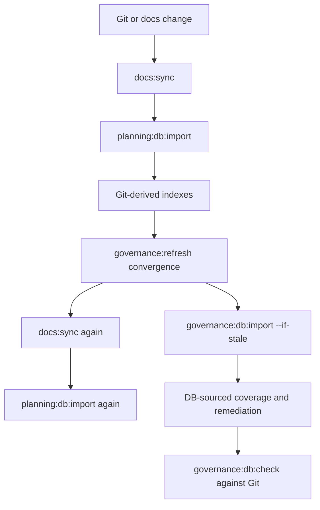
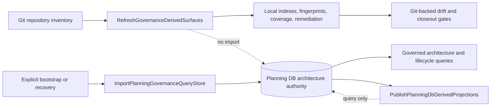

# DB-First Git Inventory Refresh Boundary Plan

Issue: [#2749](https://github.com/dunay2/dvt/issues/2749)

## Think-First Analysis

### Problem summary

Routine documentation and governance commands rebuild Planning DB before they
can validate Git-owned repository inventory. `docs:sync` embeds a full import;
`governance:refresh` repeats that command during convergence and then imports
again; publication, PR closeout, and local validation also schedule imports.

The result conflates two authorities:

- Git owns physical repository inventory, contents, hashes, symbols, and local
  generated indexes.
- Planning DB owns operated architecture, components, capabilities, relations,
  command/query rails, feature mechanization, overlays, and audit rows.

### Root cause

The implemented `GovernanceRefresh` pipeline absorbed
`ImportPlanningGovernanceQueryStore` as a hidden stage. DB-backed coverage and
remediation reports then made the import appear necessary for Git inventory
validation. Stale detection reduced some repeated work but did not correct the
ownership error: a closeout still treats a full projection rebuild as a normal
read prerequisite.

### Governing constraints and invariants

- ADR-0053: file identity and fingerprints derive from the real repository
  file state.
- ADR-0061: Planning DB remains authoritative for architecture and
  mechanization, while repository delivery state is not duplicated there.
- ADR-0063: import is a separate deterministic path for repository projections;
  it must not be an implicit destructive rebuild during query, refresh, or
  closeout.
- `GovernanceRefresh`, `RefreshGovernanceDerivedSurfaces`,
  `ImportPlanningGovernanceQueryStore`, and
  `PublishPlanningDbDerivedProjections` are existing rails and must not be
  replaced by synonyms.
- DB-owned documentation lifecycle may be queried during docs synchronization.
  A read does not authorize an import or a projection rebuild.
- Explicit empty-DB bootstrap and operator-requested recovery remain outside
  the routine refresh boundary.

### Current state



The import performs broad delete/reinsert and unconditional upsert work even
when the caller only needs a current Git index.

### Options considered

1. Keep the pipeline and optimize the importer with finer stale checks.
   Rejected because it preserves the wrong ownership and still makes a DB write
   a prerequisite of a Git inventory check.
2. Incrementally import only changed files during every closeout.
   Rejected because it remains hidden synchronization, introduces partial-state
   and deletion semantics, and duplicates Git inventory in the operational
   path.
3. Remove imported Git projections from Planning DB entirely in this slice.
   Rejected as unnecessary scope expansion: explicit bootstrap/recovery and
   existing architecture queries still depend on the current projection
   contract.
4. Separate routine Git refresh from explicit Planning DB import.
   Selected. Git-backed generators and gates consume the worktree directly;
   Planning DB queries consume existing DB authority; import remains an
   operator-visible bootstrap/recovery command only.

No external library is needed. This is a command-routing and ownership
correction using existing repository generators and rails.

### Target state and rationale



This keeps each authority honest: Git inventory is evaluated from Git, DB
architecture is read from DB, and an import is visible only when an operator
actually requests reconstruction.

### Fowler opportunity matrix

| Scenario                                        | Opportunity                              | Pattern                             | DDD owner                                 | Rail                                  | Allowed surfaces                  | Required proof                                                      | Out of scope                 |
| ----------------------------------------------- | ---------------------------------------- | ----------------------------------- | ----------------------------------------- | ------------------------------------- | --------------------------------- | ------------------------------------------------------------------- | ---------------------------- |
| Docs sync rebuilds DB before indexing Git       | Hidden authority / expensive no-op       | Separate query from materialization | Documentation lifecycle and Git inventory | `RefreshGovernanceDerivedSurfaces`    | package script, sync policy tests | sync command contains no import; lifecycle read remains fail-closed | changing lifecycle semantics |
| Governance convergence imports full projections | Temporal coupling / pipeline duplication | Pipeline stage separation           | Governance generated-surface pipeline     | `GovernanceRefresh`                   | refresh runner and tests          | all inventory reports use local source; no import stage             | removing explicit importer   |
| Closeout and pre-push schedule imports          | Shotgun surgery / hidden side effect     | Explicit command boundary           | Changed-slice validation                  | `GovernanceRefresh`                   | closeout and validation planners  | generated plans contain no import command                           | reducing checks              |
| Publication imports before reading DB           | Command-query mixing                     | Query without write side effect     | Planning DB derived publication           | `PublishPlanningDbDerivedProjections` | publication assembler and tests   | publication command never invokes import                            | changing publication output  |
| Startup imports before architecture query       | Command-query mixing                     | Fail-closed query                   | Architecture authority read model         | existing architecture queries         | `AGENTS.md` and workflow docs     | startup instruction contains query only                             | DB bootstrap policy          |

## Pre-Implementation Brief

- **Mode:** Full. This changes a repository operational boundary and its
  architecture contract.
- **Scope:** Remove implicit Planning DB imports from docs sync, governance
  refresh, publication, PR closeout, local validation, pre-push routing, and
  architecture consultation; generate Git-owned coverage/remediation from
  local Git-derived inputs.
- **Expected outcome:** routine Git/docs changes perform zero Planning DB
  imports while architecture and lifecycle reads remain DB-first.
- **Risks:** accidentally weakening drift checks, making publication use a Git
  fallback for DB authority, or leaving a transitive import in an orchestration
  path.
- **Mitigations:** retain all Git-backed generators/checks, keep DB reads
  fail-closed, add command-graph regression tests, and preserve explicit import
  and ephemeral bootstrap paths.
- **Out of scope:** removing `planning:db:import`, changing current schema,
  changing DB-authored architecture rows, product runtime databases, and
  application packages.
- **Libraries evaluated:** none; existing Node scripts and PostgreSQL command
  rails are sufficient.
- **Command/query rail impact:** reuse and narrow `GovernanceRefresh`; reuse
  `RefreshGovernanceDerivedSurfaces` for Git inventory; preserve
  `ImportPlanningGovernanceQueryStore` as explicit bootstrap/recovery; remove
  the write side effect from `PublishPlanningDbDerivedProjections`.
- **Test coverage:** positive stage order and convergence; negative assertions
  forbidding import stages in every routine command; docs add/remove/rename
  drift; publication query failure without fallback import.

## Feature Mechanization

```feature-mechanization
version: 1
featureId: GOV-DB-FIRST-GIT-INVENTORY-BOUNDARY-20260830
mechanizationStatus: implemented
noHumanDecisionsRemaining: true
implementationPlan: docs/planning/proposals/mandatory/governance-and-docs/db-first-git-inventory-refresh-boundary-plan-20260830.md
componentGuides:
  - docs/architecture/components/ci-governance/system-governance-generation-workflow-component.md
userStories:
  - As a contributor, I refresh Git-owned governance inventory without rebuilding Planning DB.
  - As an architecture reader, I query current Planning DB authority without an implicit import.
governingSources:
  - AGENTS.md
  - docs/adr/ADR-0053-file-state-fingerprint-governance.md
  - docs/adr/ADR-0061-github-mvp-task-authority-and-planning-db-architecture-boundary.md
  - docs/adr/ADR-0063-planning-db-current-schema-rebuild.md
  - docs/architecture/command-query-rail-governance.md
  - docs/architecture/components/ci-governance/system-governance-generation-workflow-component.md
allowedImplementationSurfaces:
  - AGENTS.md
  - package.json
  - scripts/governance-refresh.cjs
  - scripts/governance-refresh.test.cjs
  - scripts/sync-docs.cjs
  - scripts/pr-closeout.cjs
  - scripts/pr-closeout.test.cjs
  - scripts/local-validation-plan.cjs
  - scripts/verify-changed.test.cjs
  - scripts/verify-prepush.test.cjs
  - scripts/documentation-publication.cjs
  - scripts/documentation-publication.test.cjs
  - tools/ci/sync-docs-status-policy.test.mjs
  - tools/ci/workflow-pattern-parity.test.mjs
  - docs/architecture/components/ci-governance/system-governance-generation-workflow-component.md
  - docs/guides/ai-work-protocol.md
  - docs/guides/documentation-maintenance-guide-20260407.md
  - docs/guides/testing-and-ci-capabilities.md
  - docs/runbooks/governed-changed-slice-closeout-20260506.md
  - docs/planning/proposals/mandatory/governance-and-docs/db-first-git-inventory-refresh-boundary-plan-20260830.md
  - docs/planning/closeouts/20260830-db-first-git-inventory-refresh-boundary-closeout.md
  - docs/.manifest.json
  - docs/**/index.md
forbiddenImplementationSurfaces:
  - apps/**
  - packages/**
  - specs/contracts/**
  - tools/planning-db/schema.sql
commandQueryRails:
  - name: GovernanceRefresh
    type: command
    status: implemented
    dddOwner: Governance generated-surface pipeline
  - name: ImportPlanningGovernanceQueryStore
    type: command
    status: implemented
    dddOwner: Planning / Governance query-store import
  - name: PublishPlanningDbDerivedProjections
    type: command
    status: implemented
    dddOwner: PlanningDbDerivedProjectionPublication
domainObjects:
  - name: GovernanceRefreshWorkflow
    type: workflow
    owner: Governance / CI
  - name: GitRepositoryInventory
    type: read model
    owner: Repository governance
  - name: PlanningDbDerivedProjectionPublication
    type: application service
    owner: Planning DB
fowlerSignals:
  - hidden authority between Git inventory and imported DB projections
  - command-query mixing in routine read paths
  - pipeline duplication and expensive no-op imports
architectureGuards:
  - node --test scripts/governance-refresh.test.cjs
  - node --test scripts/pr-closeout.test.cjs scripts/verify-changed.test.cjs scripts/verify-prepush.test.cjs
  - node --test scripts/documentation-publication.test.cjs
  - node --test tools/ci/sync-docs-status-policy.test.mjs tools/ci/workflow-pattern-parity.test.mjs
cypressFlows:
  - N/A - repository governance workflow only
completionGate:
  - pnpm docs:sync:check
  - node --test scripts/governance-refresh.test.cjs scripts/pr-closeout.test.cjs scripts/verify-changed.test.cjs scripts/verify-prepush.test.cjs scripts/documentation-publication.test.cjs
  - node --test tools/ci/sync-docs-status-policy.test.mjs tools/ci/workflow-pattern-parity.test.mjs
  - pnpm docs:feature-mechanization:implementation
  - pnpm verify:prepush
redGreenCycles:
  - id: docs-sync-explicit-read-boundary
    redTest: node --test tools/ci/sync-docs-status-policy.test.mjs tools/ci/workflow-pattern-parity.test.mjs
    expectedFailure: docs:sync still starts and imports Planning DB before querying lifecycle authority.
    patchSurfaces:
      - package.json
      - tools/ci/sync-docs-status-policy.test.mjs
      - tools/ci/workflow-pattern-parity.test.mjs
    greenTest: node --test tools/ci/sync-docs-status-policy.test.mjs tools/ci/workflow-pattern-parity.test.mjs
  - id: governance-refresh-git-inventory-source
    redTest: node --test scripts/governance-refresh.test.cjs
    expectedFailure: Governance refresh still imports DB and renders Git inventory reports from DB projections.
    patchSurfaces:
      - scripts/governance-refresh.cjs
      - scripts/governance-refresh.test.cjs
    greenTest: node --test scripts/governance-refresh.test.cjs
  - id: routine-orchestrator-import-ban
    redTest: node --test scripts/pr-closeout.test.cjs scripts/verify-changed.test.cjs scripts/verify-prepush.test.cjs
    expectedFailure: Closeout or local validation still schedules governance/planning DB import.
    patchSurfaces:
      - scripts/pr-closeout.cjs
      - scripts/pr-closeout.test.cjs
      - scripts/local-validation-plan.cjs
      - scripts/verify-changed.test.cjs
      - scripts/verify-prepush.test.cjs
    greenTest: node --test scripts/pr-closeout.test.cjs scripts/verify-changed.test.cjs scripts/verify-prepush.test.cjs
  - id: publication-query-without-import
    redTest: node --test scripts/documentation-publication.test.cjs
    expectedFailure: Documentation publication still imports Planning DB before reading authoritative projections.
    patchSurfaces:
      - scripts/documentation-publication.cjs
      - scripts/documentation-publication.test.cjs
    greenTest: node --test scripts/documentation-publication.test.cjs
symbols:
  - name: buildRefreshStages
    path: scripts/governance-refresh.cjs
    dddOwner: Governance generated-surface pipeline
    cqRails:
      - GovernanceRefresh
    fowlerSignals:
      - separate Git inventory generation from Planning DB import
    architectureGuard: node --test scripts/governance-refresh.test.cjs
    cypressCoverage: N/A
    unitTests:
      - scripts/governance-refresh.test.cjs
  - name: buildPrCloseoutPlan
    path: scripts/pr-closeout.cjs
    dddOwner: ChangedSliceCloseoutGate
    cqRails:
      - GovernanceRefresh
    fowlerSignals:
      - remove hidden import from closeout planning
    architectureGuard: node --test scripts/pr-closeout.test.cjs
    cypressCoverage: N/A
    unitTests:
      - scripts/pr-closeout.test.cjs
  - name: buildPrepushPlan
    path: scripts/local-validation-plan.cjs
    dddOwner: ChangedSliceVerificationGate
    cqRails:
      - GovernanceRefresh
    fowlerSignals:
      - keep validation read-only with respect to Planning DB reconstruction
    architectureGuard: node --test scripts/verify-prepush.test.cjs
    cypressCoverage: N/A
    unitTests:
      - scripts/verify-prepush.test.cjs
  - name: DocumentationPublicationAssembler
    path: scripts/documentation-publication.cjs
    dddOwner: PlanningDbDerivedProjectionPublication
    cqRails:
      - PublishPlanningDbDerivedProjections
    fowlerSignals:
      - remove command side effect from publication query path
    architectureGuard: node --test scripts/documentation-publication.test.cjs
    cypressCoverage: N/A
    unitTests:
      - scripts/documentation-publication.test.cjs
```

## Delivery sequence

1. Record the architecture design and reused rails in Planning DB without an
   import.
2. Add red command-graph tests for every forbidden routine import path.
3. Make docs sync and governance inventory generation Git-backed.
4. Remove imports from publication, closeout, and local validation planners.
5. Align canonical architecture and workflow documentation.
6. Run the affected tests, DB-free governance refresh, commit hooks, and
   pre-push gate while monitoring that no import command executes.
