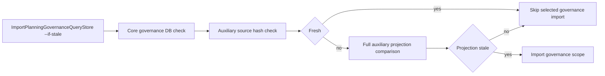
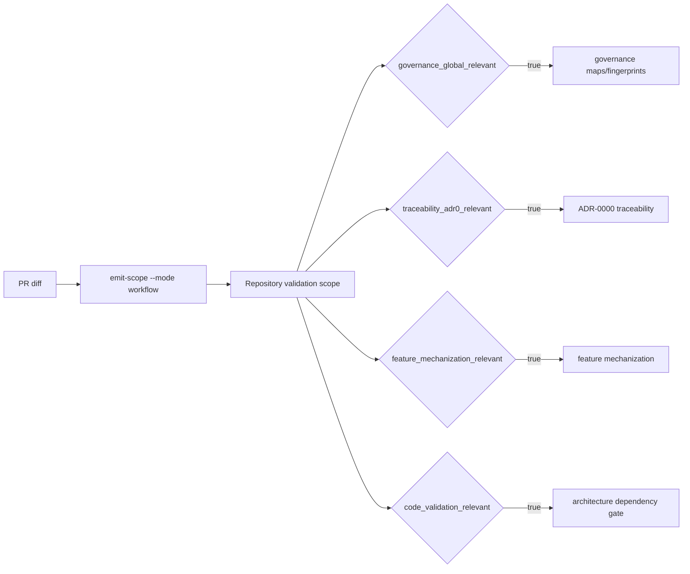

# Documentation Governance Latency Reduction Plan

> **For agentic workers:** REQUIRED SUB-SKILL: Use
> superpowers:test-driven-development for code steps. Steps use checkbox
> (`- [ ]`) syntax for tracking.

**Goal:** Reduce local and PR documentation governance latency without reducing
traceability, coverage, or product validation.

**Architecture:** Keep governance read models authoritative, but split
invalidation from materialization. `--if-stale` first proves freshness with
source hashes and cheap state checks; only stale scopes rebuild the expensive
auxiliary projections. Remote PR Quality consumes the same repository scope
semantics as `verify:prepush`, so expensive governance and traceability gates
run when their owning sources changed instead of on every PR.

## Governing Sources

- `AGENTS.md`
- `docs/planning/status/governance-document-rule-inventory.md`
- `docs/guides/ai-work-protocol.md`
- `docs/architecture/command-query-rail-governance.md`
- `docs/architecture/fowler-opportunity-planning-governance.md`
- `docs/runbooks/governed-changed-slice-closeout-20260506.md`
- `docs/guides/testing-and-ci-capabilities.md`
- `.github/workflows/pr-quality-gate.yml`
- `tools/ci/scope-config.mjs`
- `scripts/planning-db-import.cjs`
- `scripts/governance-refresh.cjs`

## Feature Mechanization

```feature-mechanization
version: 1
featureId: GOV-DOC-LATENCY-STALENESS-20260520
mechanizationStatus: implemented
noHumanDecisionsRemaining: true
implementationPlan: docs/planning/proposals/mandatory/governance-and-docs/doc-governance-latency-reduction-plan-20260520.md
componentGuides:
  - docs/planning/proposals/mandatory/governance-and-docs/doc-governance-latency-reduction-plan-20260520.md
userStories:
  - docs/planning/proposals/mandatory/governance-and-docs/doc-governance-latency-reduction-plan-20260520.md
governingSources:
  - AGENTS.md
  - docs/planning/status/governance-document-rule-inventory.md
  - docs/guides/ai-work-protocol.md
  - docs/architecture/command-query-rail-governance.md
  - docs/architecture/fowler-opportunity-planning-governance.md
allowedImplementationSurfaces:
  - buzon/20260520-codex-fowler-doc-governance-latency-analysis.md
  - docs/planning/proposals/mandatory/governance-and-docs/doc-governance-latency-reduction-plan-20260520.md
  - docs/runbooks/governed-changed-slice-closeout-20260506.md
  - docs/guides/testing-and-ci-capabilities.md
  - .github/workflows/pr-quality-gate.yml
  - tools/ci/scope-config.mjs
  - tools/ci/emit-scope.test.mjs
  - tools/ci/workflow-pattern-parity.test.mjs
  - scripts/planning-db-import.cjs
  - scripts/planning-db-import.test.cjs
  - scripts/governance-refresh.cjs
  - scripts/governance-refresh.test.cjs
  - docs/.manifest.json
  - docs/**/index.md
forbiddenImplementationSurfaces:
  - apps/**
  - packages/**
  - specs/contracts/**
commandQueryRails:
  - name: ImportPlanningGovernanceQueryStore
    type: command
    dddOwner: Planning / Governance query-store import
  - name: GovernanceRefresh
    type: command
    dddOwner: Governance generated-surface pipeline
  - name: PRQualityScopeRouting
    type: query
    dddOwner: CI scope read model
domainObjects:
  - name: Governance auxiliary source freshness
    type: read model invalidation policy
    owner: Planning / Governance
  - name: PR quality validation scope
    type: CI read model
    owner: CI scope routing
fowlerSignals:
  - Expensive no-op
  - Temporal coupling
  - Pipeline duplication
  - Separate invalidation from materialization
architectureGuards:
  - node --test scripts/planning-db-import.test.cjs
  - node --test scripts/governance-refresh.test.cjs
cypressFlows:
  - N/A - repository governance command rail only
completionGate:
  - node --test scripts/planning-db-import.test.cjs
  - node --test scripts/governance-refresh.test.cjs
  - pnpm governance:db:import -- --if-stale
  - pnpm governance:refresh
  - pnpm docs:feature-mechanization:implementation
  - pnpm verify:prepush
redGreenCycles:
  - id: auxiliary-source-freshness-before-rebuild
    redTest: node --test scripts/planning-db-import.test.cjs
    expectedFailure: governance import calls full auxiliary projection checks even when source freshness is already proven.
    patchSurfaces:
      - scripts/planning-db-import.test.cjs
      - scripts/planning-db-import.cjs
    greenTest: node --test scripts/planning-db-import.test.cjs
  - id: stale-aware-refresh-duplicate-imports
    redTest: node --test scripts/governance-refresh.test.cjs
    expectedFailure: repeated governance imports in refresh run without --if-stale.
    patchSurfaces:
      - scripts/governance-refresh.test.cjs
      - scripts/governance-refresh.cjs
    greenTest: node --test scripts/governance-refresh.test.cjs
  - id: pr-quality-scope-gated-expensive-commands
    redTest: node --test tools/ci/emit-scope.test.mjs tools/ci/workflow-pattern-parity.test.mjs
    expectedFailure: PR Quality computes scope but still runs governance maps, ADR-0000, feature mechanization, and architecture dependency checks for unrelated pull requests.
    patchSurfaces:
      - tools/ci/emit-scope.test.mjs
      - tools/ci/workflow-pattern-parity.test.mjs
      - tools/ci/scope-config.mjs
      - .github/workflows/pr-quality-gate.yml
      - docs/guides/testing-and-ci-capabilities.md
    greenTest: node --test tools/ci/emit-scope.test.mjs tools/ci/workflow-pattern-parity.test.mjs
symbols:
  - name: computeRepositoryValidationScope
    path: tools/ci/scope-config.mjs
    dddOwner: CI scope read model
    cqRails:
      - PRQualityScopeRouting
    fowlerSignals:
      - Reuse prepush repository scope semantics for PR Quality
      - Avoid expensive no-op remote governance work
    architectureGuard: node --test tools/ci/emit-scope.test.mjs
    cypressCoverage: N/A
    unitTests:
      - tools/ci/emit-scope.test.mjs
  - name: generatedReportSourceHashRows
    path: scripts/planning-db-import.cjs
    dddOwner: Planning / Governance query-store import
    cqRails:
      - ImportPlanningGovernanceQueryStore
    fowlerSignals:
      - Treat DB-backed reports as stale-aware sources
    architectureGuard: node --test scripts/planning-db-import.test.cjs
    cypressCoverage: N/A
    unitTests:
      - scripts/planning-db-import.test.cjs
  - name: buildGovernanceSourceExpectedState
    path: scripts/planning-db-import.cjs
    dddOwner: Planning / Governance query-store import
    cqRails:
      - ImportPlanningGovernanceQueryStore
    fowlerSignals:
      - Check core governance source state before full DB comparison
    architectureGuard: node --test scripts/planning-db-import.test.cjs
    cypressCoverage: N/A
    unitTests:
      - scripts/planning-db-import.test.cjs
  - name: compareGovernanceSourceState
    path: scripts/planning-db-import.cjs
    dddOwner: Planning / Governance query-store import
    cqRails:
      - ImportPlanningGovernanceQueryStore
    fowlerSignals:
      - Compare core governance fingerprints before full DB comparison
    architectureGuard: node --test scripts/planning-db-import.test.cjs
    cypressCoverage: N/A
    unitTests:
      - scripts/planning-db-import.test.cjs
  - name: readGovernanceSourceState
    path: scripts/planning-db-import.cjs
    dddOwner: Planning / Governance query-store import
    cqRails:
      - ImportPlanningGovernanceQueryStore
    fowlerSignals:
      - Read core governance DB fingerprints for stale-aware import routing
    architectureGuard: node --test scripts/planning-db-import.test.cjs
    cypressCoverage: N/A
    unitTests:
      - scripts/planning-db-import.test.cjs
  - name: checkGovernanceSourceFreshness
    path: scripts/planning-db-import.cjs
    dddOwner: Planning / Governance query-store import
    cqRails:
      - ImportPlanningGovernanceQueryStore
    fowlerSignals:
      - Skip full governance DB comparison when core sources are fresh
    architectureGuard: node --test scripts/planning-db-import.test.cjs
    cypressCoverage: N/A
    unitTests:
      - scripts/planning-db-import.test.cjs
  - name: uniqueSourceHashRows
    path: scripts/planning-db-import.cjs
    dddOwner: Planning / Governance query-store import
    cqRails:
      - ImportPlanningGovernanceQueryStore
    fowlerSignals:
      - Normalize source hash comparison before projection materialization
    architectureGuard: node --test scripts/planning-db-import.test.cjs
    cypressCoverage: N/A
    unitTests:
      - scripts/planning-db-import.test.cjs
  - name: documentSourceHashRows
    path: scripts/planning-db-import.cjs
    dddOwner: Planning / Governance query-store import
    cqRails:
      - ImportPlanningGovernanceQueryStore
    fowlerSignals:
      - Compare documentation source hashes without parsing full projections
    architectureGuard: node --test scripts/planning-db-import.test.cjs
    cypressCoverage: N/A
    unitTests:
      - scripts/planning-db-import.test.cjs
  - name: checkGovernanceAuxiliarySourceFreshness
    path: scripts/planning-db-import.cjs
    dddOwner: Planning / Governance query-store import
    cqRails:
      - ImportPlanningGovernanceQueryStore
    fowlerSignals:
      - Separate invalidation from materialization
    architectureGuard: node --test scripts/planning-db-import.test.cjs
    cypressCoverage: N/A
    unitTests:
      - scripts/planning-db-import.test.cjs
  - name: compareGovernanceAuxiliarySourceState
    path: scripts/planning-db-import.cjs
    dddOwner: Planning / Governance query-store import
    cqRails:
      - ImportPlanningGovernanceQueryStore
    fowlerSignals:
      - Source fingerprint invalidation
    architectureGuard: node --test scripts/planning-db-import.test.cjs
    cypressCoverage: N/A
    unitTests:
      - scripts/planning-db-import.test.cjs
  - name: buildGovernanceAuxiliarySourceExpectedState
    path: scripts/planning-db-import.cjs
    dddOwner: Planning / Governance query-store import
    cqRails:
      - ImportPlanningGovernanceQueryStore
    fowlerSignals:
      - Cheap expected state before expensive materialization
    architectureGuard: node --test scripts/planning-db-import.test.cjs
    cypressCoverage: N/A
    unitTests:
      - scripts/planning-db-import.test.cjs
  - name: readGovernanceAuxiliarySourceState
    path: scripts/planning-db-import.cjs
    dddOwner: Planning / Governance query-store import
    cqRails:
      - ImportPlanningGovernanceQueryStore
    fowlerSignals:
      - Compare DB read model source hashes before rebuilding projections
    architectureGuard: node --test scripts/planning-db-import.test.cjs
    cypressCoverage: N/A
    unitTests:
      - scripts/planning-db-import.test.cjs
  - name: isScopeFresh
    path: scripts/planning-db-import.cjs
    dddOwner: Planning / Governance query-store import
    cqRails:
      - ImportPlanningGovernanceQueryStore
    fowlerSignals:
      - Route fresh scopes away from full import work
    architectureGuard: node --test scripts/planning-db-import.test.cjs
    cypressCoverage: N/A
    unitTests:
      - scripts/planning-db-import.test.cjs
  - name: buildRefreshStages
    path: scripts/governance-refresh.cjs
    dddOwner: Governance generated-surface pipeline
    cqRails:
      - GovernanceRefresh
    fowlerSignals:
      - Preserve repeated safety checks with stale-aware import commands
    architectureGuard: node --test scripts/governance-refresh.test.cjs
    cypressCoverage: N/A
    unitTests:
      - scripts/governance-refresh.test.cjs
```

## User Stories

- As a contributor, I can rerun `pnpm governance:db:import -- --if-stale`
  against a fresh query store and get a cheap skip instead of a full auxiliary
  rebuild.
- As a governance maintainer, I keep full projection checks available when a
  source hash or PR readiness state proves staleness.
- As CI, repeated `governance:refresh` import stages remain present, but each
  duplicate stage is stale-aware.
- As a PR author, a web-only change does not pay for global governance maps or
  ADR-0000 traceability when those sources are unrelated, while still running
  feature mechanization and code validation.

## Implementation Steps

- [x] Measure the no-op stale-aware path and identify the expensive auxiliary
      rebuild.
- [x] Add tests proving source freshness skips the full auxiliary projection
      path.
- [x] Add tests proving stale source freshness falls back to the full projection
      check.
- [x] Make repeated `governance:refresh` governance imports stale-aware.
- [x] Route PR Quality expensive governance, traceability, mechanization, and
      architecture gates through prepush-equivalent scope outputs.
- [x] Update the changed-slice closeout runbook and Fowler analysis.

## Flow



## PR Quality Scope Flow


