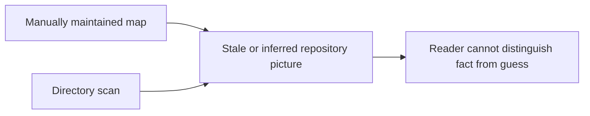
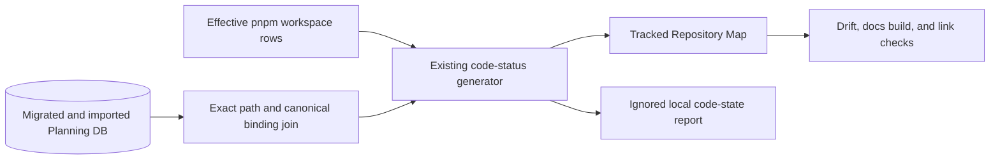

# DOC1.1 Repository Map Projection Plan

## Intent

[Task: DOC1.1] [GitHub Issue: #2144]

The repository needs one deterministic, reviewable Repository Map. The existing
code-status generator already owns repository status generation, so this slice
extends that owner instead of introducing a second scanner, registry, or
projection mechanism.

The map derives effective workspace membership only from
`pnpm list -r --depth -1 --json`. It enriches those exact paths with exact,
non-drift Planning DB component and canonical-document bindings. Missing or
ambiguous identity remains visible as an explicit gap; names, package scopes,
directory conventions, and prose are never used as inferred bindings.

## Current And Target State





## Vertical Slices

1. Membership truth: obtain effective workspaces from pnpm and prove add,
   remove, rename, excluded-directory, and non-standard-layout behavior.
2. Architecture truth: join exact Planning DB component paths and exact
   canonical document bindings; expose missing and ambiguous facts.
3. Publication truth: render deterministic grouped Markdown with governed
   coverage classifications, local README fallback, and stable bytes.
4. Operational truth: preserve DB-free `--code-state-only`, make
   `--repository-map-only` explicitly DB-backed, and validate the map in the PR
   gate against migrated and imported state.
5. Refresh truth: generate local sources first, prepare/import the current DB,
   render the final map, and reconverge if that tracked projection changes a
   governed fingerprint.

## Definition Of Ready

- Issue #2144 owns delivery state and acceptance.
- The existing generator and generated-doc policy are identified as the owning
  mechanism.
- `GeneratePlanningDerivedSurfaces`, `ReadArchitectureDesignAuthority`, and
  `ReadComponentEngineeringRecord` are the reused command/query rails; no new
  rail or parallel service is needed.
- Planning DB migration and import are available for real integration proof.
- The behavior can be driven by failing unit and live-DB tests before each
  implementation increment.
- CI, workflow-scope policy, tracked generated output, and refresh ordering are
  included in the same vertical.

## Fowler Opportunity Matrix

| Opportunity           | Signal                             | Selected response                                    | Rejected alternative                          | Evidence                                             |
| --------------------- | ---------------------------------- | ---------------------------------------------------- | --------------------------------------------- | ---------------------------------------------------- |
| Competing generators  | Divergent Change / Shotgun Surgery | Extend `generate-code-status.cjs`                    | Add a second map scanner                      | One generator and one generated-doc policy entry     |
| Workspace discovery   | Speculative Generality             | Use effective pnpm output only                       | Infer membership from `apps/` or `packages/`  | Add/remove/rename and non-standard-layout tests      |
| Architecture identity | Primitive Obsession / Feature Envy | Exact normalized path and canonical-binding joins    | Guess from names, scopes, or prose            | Missing and ambiguous identities stay explicit       |
| Mode coupling         | Inappropriate Intimacy             | Separate DB-free and DB-backed modes                 | Make every status generation require Postgres | Invalid-DB code-state test and mode-separation tests |
| Refresh ordering      | Temporal Coupling                  | Import current state before final map and reconverge | Render from stale imported state              | Refresh order and fingerprint-change tests           |
| CI confidence         | Test Double overreach              | Run a migrated/imported Planning DB integration      | Treat mocked rows as end-to-end proof         | Opt-in live integration plus docs/link gates         |

## Decision

- Reuse the current code-status generator as the single owner.
- Derive membership exclusively from the effective pnpm recursive list.
- Match Planning DB components only on exact normalized repository paths.
- Publish only exact, current canonical bindings; show gaps and ambiguities
  without inference.
- Preserve the local code-state projection as DB-free.
- Keep the Repository Map tracked, generator-owned, byte-stable, and checked in
  CI using a real migrated and imported Planning DB.
- Run the final map after the final import and reconverge all governed surfaces
  before validation if its content changes.

## Definition Of Done

- Effective workspace add, removal, rename, exclusion, and non-standard layout
  are covered by tests.
- Exact component and document identity, ambiguity, no-inference, coverage
  classes, and deterministic Markdown are covered by tests.
- `--code-state-only`, `--repository-map-only`, and `--check` remain visibly
  distinct and fail closed in their declared boundaries.
- A live migrated/imported Planning DB test proves production-shaped joins.
- The generated map builds and its links validate.
- Workspace-local README fallbacks remain clickable in the built site through
  the root package repository URL; they never render as unpublished relative
  site paths.
- Governance refresh converges after the final DB-backed map.
- Feature mechanization, docs governance, CI tools, ARC evaluation, and the full
  pre-push gate pass without disabled rules or bypassed hooks.
- Review threads are answered with commit/test evidence, the temporary
  validation PR is retired, PR #2150 is integrated, and issue #2144 is closed
  with administrative evidence.

## Demanding User Check

A reader unfamiliar with repository internals must be able to answer, from one
page, which workspaces are effectively active, which bounded context owns each
workspace, which canonical document is bound to it, and which gaps remain. The
reader must not need to know directory conventions or distinguish inferred data
from canonical data: every non-canonical relation is displayed as a gap.

## Feature Mechanization

### Historical ordering deviation and corrective evidence

The first implementation commits inherited by this branch preceded this
mandatory plan. That ordering did not comply with the repository's
documentation-before-implementation rule and cannot be made compliant
retroactively by marking the final manifest closed. The deviation is retained
here explicitly rather than hidden.

Corrective work began only after this plan recorded the DoR, DoD, diagrams,
Fowler matrix, rails, allowed surfaces, and red/green cycles. Subsequent review
increments were each driven by failing tests and include exact governed
document bindings, published README links, operational mode separation, strict
canonicality, real pnpm lifecycle fixtures, no-write generation proof, the
effective root workspace, and the prepared PR-closeout path. `closed` below
describes the final mechanized tree and remaining-decision state; it does not
claim that the original commit ordering was compliant.

```feature-mechanization
version: 1
featureId: DOC1-1-REPOSITORY-MAP-20260807
mechanizationStatus: closed
noHumanDecisionsRemaining: true
implementationPlan: docs/planning/proposals/mandatory/governance-and-docs/doc1-1-repository-map-projection-plan-20260807.md
componentGuides:
  - docs/concepts/repository-map.md
  - docs/architecture/command-query-rail-governance.md
userStories:
  - docs/planning/proposals/mandatory/governance-and-docs/doc1-1-repository-map-projection-plan-20260807.md
governingSources:
  - AGENTS.md
  - docs/planning/status/governance-document-rule-inventory.md
  - docs/guides/ai-work-protocol.md
  - docs/architecture/command-query-rail-governance.md
  - docs/architecture/fowler-opportunity-planning-governance.md
  - docs/planning/state/github-mvp-issue-workflow.md
  - docs/generated-docs-policy.json
allowedImplementationSurfaces:
  - .github/workflows/pr-quality-gate.yml
  - AGENTS.md
  - docs/.manifest.json
  - docs/**/index.md
  - docs/DOCS_README.md
  - docs/concepts/repository-map.md
  - docs/generated-docs-policy.json
  - docs/guides/documentation-maintenance-guide-20260407.md
  - docs/guides/pr-preflight-and-ci-triage.md
  - docs/planning/proposals/mandatory/governance-and-docs/doc1-1-repository-map-projection-plan-20260807.md
  - docs/planning/status/generated-code-state.md
  - docs/runbooks/planning-generated-artifacts-operations-20260403.md
  - package.json
  - scripts/pr-closeout.cjs
  - scripts/pr-closeout.test.cjs
  - scripts/generate-code-status.cjs
  - scripts/generate-code-status.test.cjs
  - scripts/governance-refresh.cjs
  - scripts/governance-refresh.test.cjs
  - tools/ci/policy/workflow-scope.json
forbiddenImplementationSurfaces:
  - packages/@dvt/contracts/**
  - packages/@dvt/engine/**
  - packages/@dvt/adapter-*/**
  - packages/@dvt/planner/**
  - specs/**
commandQueryRails:
  - name: GeneratePlanningDerivedSurfaces
    type: command
    dddOwner: PlanningGeneratedArtifact
  - name: ReadArchitectureDesignAuthority
    type: query
    dddOwner: ArchitectureDesignAuthority
  - name: ReadComponentEngineeringRecord
    type: query
    dddOwner: ComponentEngineeringRecordReadModel
domainObjects:
  - Effective pnpm workspace membership
  - Repository Map projection
  - Exact component and canonical-document binding
  - Generated governance refresh
fowlerSignals:
  - Divergent Change
  - Shotgun Surgery
  - Speculative Generality
  - Temporal Coupling
architectureGuards:
  - node --test scripts/generate-code-status.test.cjs scripts/governance-refresh.test.cjs
  - DVT_REPOSITORY_MAP_INTEGRATION=1 node --test scripts/generate-code-status.test.cjs
  - pnpm test:ci-tools
  - pnpm docs:build
  - pnpm docs:gov:links
cypressFlows:
  - N/A - repository documentation projection with no browser interaction
completionGate:
  - node --test scripts/generate-code-status.test.cjs scripts/governance-refresh.test.cjs
  - DVT_REPOSITORY_MAP_INTEGRATION=1 node --test scripts/generate-code-status.test.cjs
  - pnpm docs:status:check
  - pnpm test:ci-tools
  - pnpm docs:feature-mechanization:implementation
  - pnpm docs:build
  - pnpm docs:gov:links
  - pnpm governance:refresh
  - pnpm verify:prepush
redGreenCycles:
  - id: effective-workspace-membership
    redTest: node --test scripts/generate-code-status.test.cjs
    expectedFailure: Directory scanning cannot represent effective pnpm inclusion, exclusion, rename, and non-standard workspace layout.
    patchSurfaces:
      - scripts/generate-code-status.cjs
      - scripts/generate-code-status.test.cjs
    greenTest: node --test scripts/generate-code-status.test.cjs
  - id: exact-planning-db-identity
    redTest: node --test scripts/generate-code-status.test.cjs
    expectedFailure: The map lacks exact component and canonical-document identity with explicit missing and ambiguous states.
    patchSurfaces:
      - scripts/generate-code-status.cjs
      - scripts/generate-code-status.test.cjs
    greenTest: node --test scripts/generate-code-status.test.cjs
  - id: generation-mode-separation
    redTest: node --test scripts/generate-code-status.test.cjs
    expectedFailure: Local code-state generation and tracked DB-backed map validation share hidden database behavior.
    patchSurfaces:
      - package.json
      - scripts/generate-code-status.cjs
      - scripts/generate-code-status.test.cjs
    greenTest: node --test scripts/generate-code-status.test.cjs
  - id: operational-mode-guidance
    redTest: node --test scripts/generate-code-status.test.cjs
    expectedFailure: DB-free workflows, generated-doc ownership, CI scope, and contributor guidance do not explicitly select the correct generation mode.
    patchSurfaces:
      - AGENTS.md
      - docs/DOCS_README.md
      - docs/generated-docs-policy.json
      - docs/guides/documentation-maintenance-guide-20260407.md
      - docs/guides/pr-preflight-and-ci-triage.md
      - docs/planning/status/generated-code-state.md
      - docs/runbooks/planning-generated-artifacts-operations-20260403.md
      - package.json
      - scripts/generate-code-status.test.cjs
      - tools/ci/policy/workflow-scope.json
    greenTest: node --test scripts/generate-code-status.test.cjs
  - id: demanding-fowler-qa
    redTest: node --test scripts/generate-code-status.test.cjs
    expectedFailure: Undeclared document canonicality is accepted, workspace lifecycle fixtures bypass real pnpm rules, and a second generation is not proven to avoid a write.
    patchSurfaces:
      - scripts/generate-code-status.cjs
      - scripts/generate-code-status.test.cjs
    greenTest: node --test scripts/generate-code-status.test.cjs
  - id: review-root-and-closeout-rail
    redTest: node --test scripts/generate-code-status.test.cjs scripts/pr-closeout.test.cjs
    expectedFailure: The pnpm root row is dropped and the governed PR-closeout rail invokes an implicit DB-backed generator without preparing Planning DB.
    patchSurfaces:
      - scripts/generate-code-status.cjs
      - scripts/generate-code-status.test.cjs
      - scripts/pr-closeout.cjs
      - scripts/pr-closeout.test.cjs
    greenTest: node --test scripts/generate-code-status.test.cjs scripts/pr-closeout.test.cjs
  - id: refresh-reconvergence
    redTest: node --test scripts/governance-refresh.test.cjs
    expectedFailure: A final Repository Map write can leave governance fingerprints stale after the final Planning DB import.
    patchSurfaces:
      - scripts/governance-refresh.cjs
      - scripts/governance-refresh.test.cjs
    greenTest: node --test scripts/governance-refresh.test.cjs
symbols:
  - &repositoryMapSymbol
    name: GENERATION_MODES
    path: scripts/generate-code-status.cjs
    dddOwner: PlanningGeneratedArtifact
    cqRails:
      - GeneratePlanningDerivedSurfaces
      - ReadArchitectureDesignAuthority
      - ReadComponentEngineeringRecord
    fowlerSignals:
      - Single generator owner
      - Exact identity
    architectureGuard: node --test scripts/generate-code-status.test.cjs
    cypressCoverage: N/A - repository documentation projection with no browser interaction
    unitTests:
      - node --test scripts/generate-code-status.test.cjs
  - <<: *repositoryMapSymbol
    name: assertTrackedRepositoryMapClean
  - <<: *repositoryMapSymbol
    name: buildRepositoryMapRows
  - <<: *repositoryMapSymbol
    name: codeStateOutputPath
  - <<: *repositoryMapSymbol
    name: collectRepositoryWorkspaceStats
  - <<: *repositoryMapSymbol
    name: databaseUrl
  - <<: *repositoryMapSymbol
    name: generateCodeState
  - <<: *repositoryMapSymbol
    name: generateRepositoryMap
  - <<: *repositoryMapSymbol
    name: isCurrentCanonicalDocument
  - <<: *repositoryMapSymbol
    name: listPnpmWorkspaceDirs
  - <<: *repositoryMapSymbol
    name: localReadmeLink
  - <<: *repositoryMapSymbol
    name: main
  - <<: *repositoryMapSymbol
    name: markdownCell
  - <<: *repositoryMapSymbol
    name: markdownTable
  - <<: *repositoryMapSymbol
    name: normalizeRepoPath
  - <<: *repositoryMapSymbol
    name: parsePnpmWorkspaceRows
  - <<: *repositoryMapSymbol
    name: pnpmCommand
  - <<: *repositoryMapSymbol
    name: readRepositoryArchitectureFacts
  - <<: *repositoryMapSymbol
    name: relativeDocLink
  - <<: *repositoryMapSymbol
    name: renderCodeState
  - <<: *repositoryMapSymbol
    name: renderRepositoryMap
  - <<: *repositoryMapSymbol
    name: repositoryMapOutputPath
  - <<: *repositoryMapSymbol
    name: repositoryBrowserUrl
  - <<: *repositoryMapSymbol
    name: resolveCanonicalDocuments
  - <<: *repositoryMapSymbol
    name: resolveDocumentationProjection
  - <<: *repositoryMapSymbol
    name: resolveGenerationMode
  - <<: *repositoryMapSymbol
    name: resolveWorkspaceArchitecture
  - <<: *repositoryMapSymbol
    name: toPosix
```

## No-Debt Boundary

This plan adds no stub, placeholder, alternate registry, inferred binding, or
temporary success path. A missing canonical fact remains a visible map gap and
must be repaired at its owning Planning DB or documentation source.
