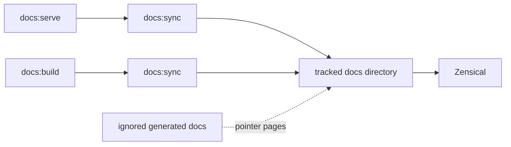
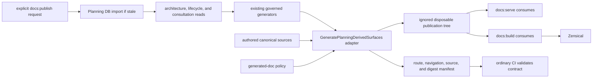

# DOC1.2 On-Demand DB-First Documentation Publication Plan

## Intent

[Task: DOC1.2] [GitHub Issue: #2145]

Create one disposable documentation publication tree from current authored
sources and Planning DB-backed projections. Generation is an explicit operator
action. Serving, building, and ordinary PR validation consume or validate that
contract without silently regenerating it.

This slice is the publication foundation for #2146, #2147, #2148, and #2149.
It does not create a second documentation database or store authored rationale
in Planning DB.

## Product Decision

The product owner selected the complete DOC1 sequence on 2026-08-10 and added
two binding requirements:

1. generated documentation is produced on demand, not on every serve, build,
   or ordinary CI run; and
2. architecture and design consultation begins with Planning DB authority
   queries rather than a filename-first search.

The Planning DB creation-intent preflight returned `reuse-existing-rail` for:

- `GeneratePlanningDerivedSurfaces` for on-demand generation;
- `ReadArchitectureDesignAuthority` for architecture/design authority;
- `QueryDocumentationConsultationPath` for reader routing; and
- `ListDocumentationLifecycleFacts` for lifecycle eligibility.

`AssembleDocumentationPublicationTree` is therefore rejected as a duplicate
command name. The assembler is an adapter inside
`GeneratePlanningDerivedSurfaces`, not a new product rail.

## Current State



Physical placement and tracked pointer pages still decide what Zensical sees.
The same generated intent is partially repeated in package scripts, CI, the
generated-doc policy, pointer pages, and raw directory layout.

## Target State



## Think-First Analysis

### Problem Summary

Raw `docs/` placement is a hidden publication authority. Useful DB-backed
outputs remain ignored while tracked pages compensate for them, and
`docs:serve`/`docs:build` perform implicit mutation through `docs:sync`.

### Root Cause

Generation, source eligibility, route ownership, navigation, rendering, and
validation were grown as adjacent scripts rather than one bounded publication
policy. That created duplicate semantics and made publication depend on the
current worktree contents instead of an explicit receipt.

### Constraints And Invariants

- ADR-0061: GitHub owns task lifecycle; Planning DB owns architecture,
  relations, rails, mechanization, and architecture evidence.
- ADR-0063: Planning DB has one current schema and rebuild/import path; no
  migration runner, ledger, checksum, ordinal, or compatibility state may be
  introduced.
- Existing authored ADR rationale, product meaning, guides, and runbooks remain
  authored sources; this slice does not store prose in Planning DB.
- Existing generation, lifecycle, entry-point, and consultation rails must be
  reused without synonyms.
- Publication output remains ignored and disposable.
- Missing generated inputs, ambiguous route ownership, path escape, lifecycle
  ambiguity, and nondeterministic output fail closed.
- `docs:serve` and `docs:build` never mutate authored or generated sources.

### Options Considered

1. Keep raw `docs/` as Zensical input and add more tracked pointers. Rejected:
   preserves hidden authority and duplicate source ownership.
2. Regenerate inside every serve/build/CI command. Rejected by the explicit
   product decision and because it hides DB/tooling cost and mutations.
3. Add another publication command and route registry. Rejected by the DB
   creation-intent result and the existing generated-doc policy.
4. Extend `GeneratePlanningDerivedSurfaces` with an explicit on-demand adapter,
   route derivation from the existing policy, and a disposable receipt.
   Selected because it preserves one rail and one ownership source.

### Selected Option And Rationale

Add one focused tooling adapter that:

- requires current Planning DB facts when publication is requested;
- runs only the existing generator commands declared by the generated-doc
  policy;
- copies authored sources into a clean ignored destination;
- overlays only explicitly publishable generated Markdown at its stable route;
- derives navigation from lifecycle and path facts;
- emits one deterministic manifest and generated Zensical configuration; and
- supports a read-only check mode for `docs:serve`, `docs:build`, and CI.

## Pre-Implementation Brief

- **Mode:** Full.
- **Scope:** #2145 only: publication boundary, first Repository Map generated
  route, Zensical consumption, local commands, manual deployment, focused
  tests, and consultation instructions.
- **Expected outcome:** an explicit `pnpm docs:publish` produces the complete
  ignored tree; `docs:serve` and `docs:build` fail clearly when it is absent or
  invalid and never regenerate it.
- **Risks:** path collisions, path escape, stale or missing generation,
  nondeterministic order, archive navigation leakage, raw-link checks that do
  not know generated routes, and CI accidentally reintroducing generation.
- **Mitigations:** fail-closed value objects/policy, deterministic sorting and
  hashing, explicit policy ownership, focused negative tests, workflow parity
  guards, and a clean second assembly comparison.
- **Out of scope:** component topology (#2146), traceability matrix (#2147),
  delivery status (#2148), final pointer wave/lifecycle gate (#2149), theme
  redesign, product runtime, and Planning DB schema changes.
- **Libraries evaluated:** existing `js-yaml`, `pg`, Node filesystem/crypto,
  current Planning DB readers, and Zensical are sufficient; no new dependency
  is introduced.
- **Command/query impact:** reuse only; no rail catalog addition.

## Fowler / DDD / Hexagonal Matrix

| Scenario                                | Opportunity             | Fowler pattern         | DDD owner                          | Command/query rail                   | Implementation surfaces                | Unit/package test                 | Architecture test                | User-flow test                | Out of scope                   |
| --------------------------------------- | ----------------------- | ---------------------- | ---------------------------------- | ------------------------------------ | -------------------------------------- | --------------------------------- | -------------------------------- | ----------------------------- | ------------------------------ |
| Explicit publication request            | Hidden authority        | Service Layer + Facade | `PlanningGeneratedArtifact`        | `GeneratePlanningDerivedSurfaces`    | publication script, package command    | request assembles from empty      | serve/build contain no generator | clean on-demand build         | scheduling                     |
| Select generated sources                | Duplicate semantics     | Specification          | `DocumentationPublicationPolicy`   | same command                         | generated-doc policy                   | missing/duplicate owner rejection | no second route registry         | Repository Map stable route   | semantic retirement            |
| Resolve architecture/design input       | Feature envy            | Gateway                | `ArchitectureDesignAuthority`      | `ReadArchitectureDesignAuthority`    | Planning DB query adapter and guidance | unavailable DB fails closed       | consultation rule names DB query | operator queries before build | authored rationale generation  |
| Build stable routes                     | Primitive obsession     | Value Object + Mapper  | `PublicationRoute`                 | same command                         | assembler and manifest                 | path escape/collision/order       | output derives from policy       | link/navigation smoke         | redirects outside named routes |
| Consume projection                      | Responsibility overload | Ports and Adapters     | `DocumentationPublicationManifest` | `QueryDocumentationConsultationPath` | Zensical/package/workflow              | absent/invalid receipt fails      | package/workflow parity          | serve/build same digest       | second config authority        |
| Exclude history from default navigation | Documentation drift     | Policy + Projection    | `DocumentationLifecycleReadModel`  | `ListDocumentationLifecycleFacts`    | assembler navigation                   | archive/superseded exclusion      | no path-only active authority    | default nav omits history     | deleting Git history           |

## TDD Order

1. Red: package/workflow commands still generate implicitly.
2. Green: explicit publish command plus consumption-only serve/build.
3. Red: route collisions, missing sources, and path escapes are accepted.
4. Green: publication policy rejects all three with exact paths.
5. Red: archive/superseded pages leak into default navigation.
6. Green: lifecycle-backed navigation projection excludes them.
7. Red: Repository Map remains tracked and raw link checks cannot resolve its
   generated route.
8. Green: generator output moves to the ignored policy-owned route and link
   validation recognizes that declared publication target.
9. Red: two clean assemblies can differ or retain stale destination files.
10. Green: clean rebuild and digest equality prove determinism.

## Demanding-User Acceptance

1. Remove `.generated-docs/publication`.
2. Confirm `pnpm docs:build` fails with the exact `pnpm docs:publish` remedy.
3. Run `pnpm docs:publish` once, then build and serve without another
   generation/import.
4. Reach Repository Map through its stable link and confirm the page is the
   DB-backed generated content, not a pointer.
5. Confirm archive/superseded content is absent from default navigation while
   remaining present in Git.
6. Repeat a clean publication and compare route/content digests.
7. Verify keyboard navigation, visible focus, contrast, 200% zoom, and
   desktop/tablet/mobile readability on the built site.

## Feature Mechanization

All implementation decisions for this bounded slice are resolved. `closed`
means the plan is mechanically complete before TDD; issue and PR lifecycle
remain governed by GitHub.

```feature-mechanization
version: 1
featureId: DOC1-2-ON-DEMAND-PUBLICATION-20260810
mechanizationStatus: closed
noHumanDecisionsRemaining: true
implementationPlan: docs/planning/proposals/mandatory/governance-and-docs/doc1-2-on-demand-publication-plan-20260810.md
componentGuides:
  - docs/architecture/components/ci-governance/documentation-usability-canon-component.md
  - docs/planning/domains/documentation-governance.md
userStories:
  - docs/planning/proposals/mandatory/governance-and-docs/doc1-2-on-demand-publication-plan-20260810.md
governingSources:
  - AGENTS.md
  - docs/planning/status/governance-document-rule-inventory.md
  - docs/guides/ai-work-protocol.md
  - docs/adr/ADR-0061-github-mvp-task-authority-and-planning-db-architecture-boundary.md
  - docs/adr/ADR-0063-planning-db-current-schema-rebuild.md
  - docs/architecture/command-query-rail-governance.md
  - docs/architecture/fowler-opportunity-planning-governance.md
  - docs/planning/state/planning-control-tower.md
  - docs/generated-docs-policy.json
allowedImplementationSurfaces:
  - .github/workflows/docs-deploy.yml
  - .github/workflows/pr-quality-gate.yml
  - .gitignore
  - AGENTS.md
  - docs/.manifest.json
  - docs/**/index.md
  - docs/DOCS_README.md
  - docs/concepts/repository-map.md
  - docs/generated-docs-policy.json
  - docs/guides/documentation-maintenance-guide-20260407.md
  - docs/guides/pr-preflight-and-ci-triage.md
  - docs/guides/testing-and-ci-capabilities.md
  - docs/planning/proposals/mandatory/governance-and-docs/doc1-2-on-demand-publication-plan-20260810.md
  - docs/planning/status/generated-code-state.md
  - docs/runbooks/planning-generated-artifacts-operations-20260403.md
  - package.json
  - scripts/docs-quality-check.cjs
  - scripts/documentation-publication.cjs
  - scripts/documentation-publication.test.cjs
  - scripts/generate-code-status.cjs
  - scripts/generate-code-status.test.cjs
  - scripts/governance-refresh.cjs
  - scripts/governance-refresh.test.cjs
  - scripts/pr-closeout.cjs
  - scripts/pr-closeout.test.cjs
  - tools/ci/repository-command-catalog.mjs
  - tools/ci/repository-command-catalog.test.mjs
  - tools/ci/policy/workflow-scope.json
  - tools/ci/workflow-pattern-parity.test.mjs
  - tools/docs/check-links.ts
  - zensical.yml
forbiddenImplementationSurfaces:
  - packages/@dvt/contracts/**
  - packages/@dvt/engine/**
  - packages/@dvt/adapter-*/**
  - packages/@dvt/planner/**
  - apps/**
  - specs/**
  - tools/planning-db/migrations/**
commandQueryRails:
  - name: GeneratePlanningDerivedSurfaces
    type: command
    dddOwner: PlanningGeneratedArtifact
  - name: ReadArchitectureDesignAuthority
    type: query
    dddOwner: ArchitectureDesignAuthority
  - name: QueryDocumentationConsultationPath
    type: query
    dddOwner: DocumentationConsultationReadModel
  - name: ListDocumentationLifecycleFacts
    type: query
    dddOwner: DocumentationLifecycleReadModel
domainObjects:
  - DocumentationPublicationPolicy
  - DocumentationPublicationManifest
  - PublicationRoute
  - PlanningGeneratedArtifact
fowlerSignals:
  - Hidden Authority
  - Duplicate Semantics
  - Responsibility Overload
  - Documentation Drift
  - Test-Only Confidence
architectureGuards:
  - node --test scripts/documentation-publication.test.cjs scripts/generate-code-status.test.cjs
  - pnpm test:ci-tools
  - pnpm docs:gov:links
cypressFlows:
  - N/A - documentation publication tooling; demanding-user proof uses the built Zensical site
completionGate:
  - node --test scripts/documentation-publication.test.cjs scripts/generate-code-status.test.cjs
  - pnpm test:ci-tools
  - pnpm docs:publish
  - pnpm docs:build
  - pnpm docs:gov:links
  - pnpm governance:refresh
  - pnpm verify:prepush
redGreenCycles:
  - id: explicit-on-demand-publication
    redTest: node --test scripts/documentation-publication.test.cjs
    expectedFailure: Serve, build, and CI still regenerate documentation implicitly instead of consuming an explicit publication receipt.
    patchSurfaces:
      - package.json
      - .github/workflows/docs-deploy.yml
      - scripts/documentation-publication.cjs
      - scripts/documentation-publication.test.cjs
    greenTest: node --test scripts/documentation-publication.test.cjs
  - id: fail-closed-route-policy
    redTest: node --test scripts/documentation-publication.test.cjs
    expectedFailure: Duplicate routes, path escape, missing generated sources, and historical navigation leakage are accepted.
    patchSurfaces:
      - scripts/documentation-publication.cjs
      - scripts/documentation-publication.test.cjs
      - docs/generated-docs-policy.json
    greenTest: node --test scripts/documentation-publication.test.cjs
  - id: repository-map-generated-route
    redTest: node --test scripts/documentation-publication.test.cjs scripts/generate-code-status.test.cjs
    expectedFailure: Repository Map remains a tracked generated authority and raw link checks cannot resolve its declared generated route.
    patchSurfaces:
      - docs/concepts/repository-map.md
      - docs/generated-docs-policy.json
      - scripts/generate-code-status.cjs
      - scripts/generate-code-status.test.cjs
      - tools/docs/check-links.ts
    greenTest: node --test scripts/documentation-publication.test.cjs scripts/generate-code-status.test.cjs
  - id: deterministic-consumption
    redTest: node --test scripts/documentation-publication.test.cjs tools/ci/workflow-pattern-parity.test.mjs
    expectedFailure: Repeated assemblies retain stale files or differ, and workflow/package consumers can bypass the same publication contract.
    patchSurfaces:
      - scripts/documentation-publication.cjs
      - scripts/documentation-publication.test.cjs
      - package.json
      - zensical.yml
      - .github/workflows/docs-deploy.yml
      - tools/ci/workflow-pattern-parity.test.mjs
    greenTest: node --test scripts/documentation-publication.test.cjs tools/ci/workflow-pattern-parity.test.mjs
  - id: DB-owned-input-receipt
    redTest: node --test scripts/documentation-publication.test.cjs scripts/pr-closeout.test.cjs
    expectedFailure: Filesystem-only pages, stale sources or lifecycle facts, and implicit closeout generation can bypass explicit DB-first publication.
    patchSurfaces:
      - scripts/documentation-publication.cjs
      - scripts/documentation-publication.test.cjs
      - scripts/pr-closeout.cjs
      - scripts/pr-closeout.test.cjs
      - .github/workflows/docs-deploy.yml
      - tools/ci/policy/workflow-scope.json
    greenTest: node --test scripts/documentation-publication.test.cjs scripts/pr-closeout.test.cjs tools/ci/workflow-pattern-parity.test.mjs
symbols:
  - &publicationPolicySymbol
    name: DocumentationPublicationPolicy
    path: scripts/documentation-publication.cjs
    dddOwner: DocumentationPublicationPolicy
    cqRails:
      - GeneratePlanningDerivedSurfaces
      - ListDocumentationLifecycleFacts
    fowlerSignals:
      - Hidden Authority
      - Duplicate Semantics
    architectureGuard: node --test scripts/documentation-publication.test.cjs
    cypressCoverage: N/A - repository publication policy
    unitTests:
      - node --test scripts/documentation-publication.test.cjs
  - <<: *publicationPolicySymbol
    name: DocumentationPublicationAssembler
    dddOwner: PlanningGeneratedArtifact
  - <<: *publicationPolicySymbol
    name: runDocumentationPublicationCli
    dddOwner: PlanningGeneratedArtifact
  - <<: *publicationPolicySymbol
    name: loadGeneratedPublicationRoutes
    path: tools/docs/check-links.ts
    dddOwner: DocumentationConsultationReadModel
  - <<: *publicationPolicySymbol
    name: generateRepositoryMap
    path: scripts/generate-code-status.cjs
    dddOwner: PlanningGeneratedArtifact
  - <<: *publicationPolicySymbol
    name: repositoryMapOutputPath
    path: scripts/generate-code-status.cjs
    dddOwner: PlanningGeneratedArtifact
  - <<: *publicationPolicySymbol
    name: buildPrCloseoutPlan
    path: scripts/pr-closeout.cjs
    dddOwner: PlanningGeneratedArtifact
```

## No-Debt Boundary

No migration state, compatibility facade, tracked publication output, pointer
replacement, warning-only fallback, stub, TODO/FIXME, or parallel registry is
allowed. If a required DB fact or generated source is unavailable, publication
fails and reports its exact owner/path.
