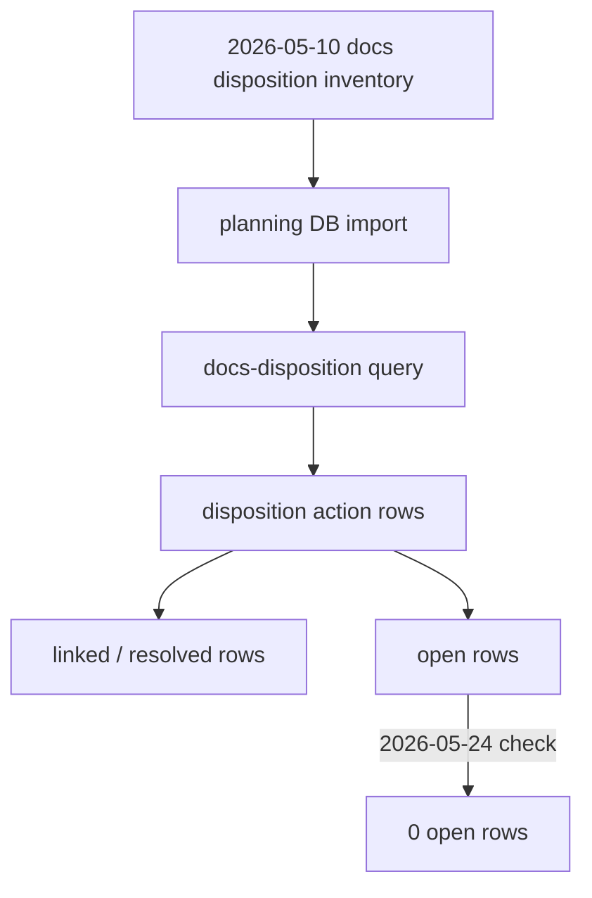
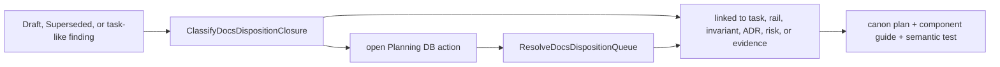

# Docs Disposition Canon Plan 2026-05-24

## Owned Concern

This plan canonizes `GD-DOC-DISPOSITION-CANON`. It closes the gap between the
2026-05-10 docs disposition inventory and the current Planning DB queue: Draft,
Superseded, and task-like identifier findings are not a parallel documentation
backlog. They are resolved through the `docs-disposition` command/query rail and
must remain linked, closed, or deliberately re-opened in Planning DB.

## Governing Sources

- `AGENTS.md`
- `docs/planning/status/governance-document-rule-inventory.md`
- `docs/guides/ai-work-protocol.md`
- `docs/architecture/command-query-rail-governance.md`
- `docs/architecture/fowler-opportunity-planning-governance.md`
- `docs/planning/state/planning-control-tower.md`
- `docs/planning/status/docs-task-disposition-inventory-20260510.md`
- `docs/planning/proposals/mandatory/governance-and-docs/architecture-doc-reconciliation-canon-plan-20260523.md`

## Fowler Analysis

### Improved Patterns

- The planning DB already exposes `docs-disposition` as the query rail for
  disposition actions.
- The action rows now support explicit `linked` resolutions instead of
  requiring risky document moves for ADRs, closeouts, or evidence-bearing
  surfaces.
- The parent architecture-documentation reconciliation canon already routes
  concrete remediation into child tasks instead of making a review document the
  backlog.

### Antipatterns

- Stale status snapshot: the 2026-05-10 inventory still reads like pending work
  after the queue has no open rows.
- Label-driven cleanup: Draft or Superseded frontmatter can tempt bulk moves
  without owner and evidence checks.
- Identifier overloading: task-like strings include rails, user stories,
  invariants, risk IDs, evidence IDs, and historical finding IDs.
- Hidden workboard: unresolved disposition prose can behave like a second queue
  beside Planning DB.

### Grouping Opportunities

- Group disposition closure under one component guide:
  `DocsDispositionCanon`.
- Keep the operational queue in Planning DB through `docs-disposition` query
  and `docs-disposition resolve` command behavior.
- Keep broader review canonization in sibling tasks:
  `GD-REV-ARCH-GOV-CANON` and `GD-REV-PLANNING-CANON`.

### Lessons For Future Work

- Mature documentation systems separate inventory snapshots from operational
  queues.
- Disposition of active docs needs a command/query rail because archive, link,
  supersede, and ignore decisions have different audit meanings.
- Tests should validate semantic closure and ownership, not only generated index
  freshness.

## Current-State Diagram



## Target-State Diagram



## Disposition Matrix

| Input class              | Canonical disposition                                 | Owner rail                         |
| ------------------------ | ----------------------------------------------------- | ---------------------------------- |
| Draft active closeout    | Linked unless owner/evidence check reopens the action | `ClassifyDocsDispositionClosure`   |
| Superseded active doc    | Linked or explicitly archived by a focused follow-up  | `ResolveDocsDispositionQueue`      |
| Unknown task-like ID     | Linked when classified as non-task governance ID      | `ClassifyDocsDispositionClosure`   |
| New unresolved finding   | Reopened in Planning DB, not tracked only in prose    | `ResolveDocsDispositionQueue`      |
| Inventory snapshot drift | Updated by canon note plus semantic guard             | `DocsDispositionClosure` read side |

No Draft, Superseded, or task-like identifier finding remains an open parallel
documentation backlog after this plan.

## Command And Query Rails

- `ResolveDocsDispositionQueue`: command owned by the docs disposition canon
  aggregate. It records the resolution of a disposition action with actor,
  reference, source hash, and status.
- `ClassifyDocsDispositionClosure`: query owned by the docs disposition closure
  read model. It returns whether a finding is open, linked, ignored, reopened,
  or requires a focused follow-up.

## TDD Plan

1. Red: add `docs-disposition-canon.test.mjs` before this plan and component
   docs exist; verify it fails on missing canonical surfaces.
2. Green: add this plan, component guide, user stories, documentation-governance
   domain note, inventory canon note, component index link, and buzon analysis.
3. Refactor: keep the slice docs/governance-only. Future document moves require
   focused tasks and their own backlink evidence.

## ADR Decision

No new ADR is required. ADR-0055 already establishes Planning DB as the
operational source, and the command/query rail governance already requires
observable process changes to be represented by rails.

## Feature Mechanization Manifest

```feature-mechanization
version: 1
featureId: GD-DOC-DISPOSITION-CANON
mechanizationStatus: implemented
noHumanDecisionsRemaining: true
implementationPlan: docs/planning/proposals/mandatory/governance-and-docs/docs-disposition-canon-plan-20260524.md
componentGuides:
  - docs/architecture/components/ci-governance/docs-disposition-canon-component.md
userStories:
  - docs/architecture/components/ci-governance/docs-disposition-canon-user-stories.md
governingSources:
  - AGENTS.md
  - docs/planning/status/governance-document-rule-inventory.md
  - docs/guides/ai-work-protocol.md
  - docs/architecture/command-query-rail-governance.md
  - docs/architecture/fowler-opportunity-planning-governance.md
  - docs/planning/status/docs-task-disposition-inventory-20260510.md
allowedImplementationSurfaces:
  - buzon/20260524-codex-fowler-docs-disposition-canon.md
  - docs/.manifest.json
  - docs/archive/**
  - docs/architecture/components/ci-governance/docs-disposition-canon-component.md
  - docs/architecture/components/ci-governance/docs-disposition-canon-user-stories.md
  - docs/architecture/components/ci-governance/index.md
  - docs/planning/archive/**
  - docs/planning/domains/documentation-governance.md
  - docs/planning/index.md
  - docs/planning/proposals/index.md
  - docs/planning/proposals/mandatory/governance-and-docs/docs-disposition-canon-plan-20260524.md
  - docs/planning/proposals/superseded/**
  - docs/planning/proposals/portfolio-map-20260403.md
  - docs/planning/reviews/architecture-and-governance/20260527-docs-engine-component-reconciliation-fowler-review.md
  - docs/planning/reviews/sprints/**
  - docs/planning/state/agent-lane-a.md
  - docs/planning/state/execution-workboard.md
  - docs/planning/state/open-task-route.md
  - docs/planning/status/**
  - tools/ci/docs-disposition-canon.test.mjs
forbiddenImplementationSurfaces:
  - apps/**
  - packages/**
  - specs/**
commandQueryRails:
  - name: ResolveDocsDispositionQueue
    type: command
    dddOwner: Docs disposition canon aggregate
  - name: ClassifyDocsDispositionClosure
    type: query
    dddOwner: Docs disposition closure read model
domainObjects:
  - name: DocsDispositionCanon
    type: planning aggregate
    owner: Architecture / Docs / Planning
  - name: DocsDispositionClosure
    type: read model
    owner: Architecture / Docs / Planning
fowlerSignals:
  - Stale status snapshot
  - Label-driven cleanup
  - Identifier overloading
  - Hidden workboard
architectureGuards:
  - node --test tools/ci/docs-disposition-canon.test.mjs
cypressFlows:
  - N/A - documentation governance semantic guard only
completionGate:
  - node --test tools/ci/docs-disposition-canon.test.mjs
  - pnpm test:ci-tools
  - pnpm docs:sync
  - pnpm docs:status:generate
  - node scripts/check-feature-mechanization.cjs --feature GD-DOC-DISPOSITION-CANON
  - node scripts/check-feature-mechanization.cjs --implementation --feature GD-DOC-DISPOSITION-CANON
  - pnpm lint:md:changed
  - pnpm verify:prepush
redGreenCycles:
  - id: docs-disposition-canon-closure
    redTest: node --test tools/ci/docs-disposition-canon.test.mjs
    expectedFailure: Docs disposition canon plan, guide, stories, and buzon analysis do not exist.
    patchSurfaces:
      - tools/ci/docs-disposition-canon.test.mjs
      - docs/planning/proposals/mandatory/governance-and-docs/docs-disposition-canon-plan-20260524.md
      - docs/architecture/components/ci-governance/docs-disposition-canon-component.md
      - docs/architecture/components/ci-governance/docs-disposition-canon-user-stories.md
      - docs/architecture/components/ci-governance/index.md
      - docs/planning/domains/documentation-governance.md
      - docs/planning/status/docs-task-disposition-inventory-20260510.md
      - buzon/20260524-codex-fowler-docs-disposition-canon.md
    greenTest: node --test tools/ci/docs-disposition-canon.test.mjs
symbols:
  - name: requiredFiles
    path: tools/ci/docs-disposition-canon.test.mjs
    dddOwner: Docs disposition canon semantic guard
    cqRails:
      - ClassifyDocsDispositionClosure
    fowlerSignals:
      - Required artifact set
    architectureGuard: node --test tools/ci/docs-disposition-canon.test.mjs
    unitTests:
      - pnpm test:ci-tools
    cypressCoverage: N/A - docs governance semantic guard only
  - name: readRepoFile
    path: tools/ci/docs-disposition-canon.test.mjs
    dddOwner: Docs disposition canon semantic guard
    cqRails:
      - ClassifyDocsDispositionClosure
    fowlerSignals:
      - Semantic drift guard
    architectureGuard: node --test tools/ci/docs-disposition-canon.test.mjs
    unitTests:
      - pnpm test:ci-tools
    cypressCoverage: N/A - docs governance semantic guard only
  - name: assertContains
    path: tools/ci/docs-disposition-canon.test.mjs
    dddOwner: Docs disposition canon semantic guard
    cqRails:
      - ClassifyDocsDispositionClosure
    fowlerSignals:
      - Documentation drift guard
    architectureGuard: node --test tools/ci/docs-disposition-canon.test.mjs
    unitTests:
      - pnpm test:ci-tools
    cypressCoverage: N/A - docs governance semantic guard only
  - name: escapeRegExp
    path: tools/ci/docs-disposition-canon.test.mjs
    dddOwner: Docs disposition canon semantic guard
    cqRails:
      - ClassifyDocsDispositionClosure
    fowlerSignals:
      - Test determinism
    architectureGuard: node --test tools/ci/docs-disposition-canon.test.mjs
    unitTests:
      - pnpm test:ci-tools
    cypressCoverage: N/A - docs governance semantic guard only
```
