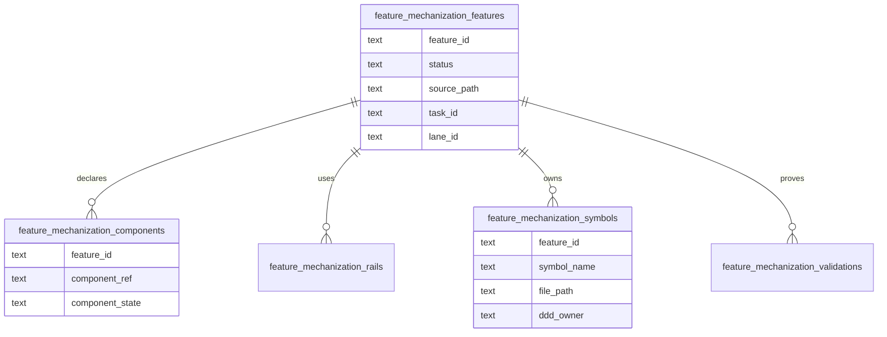

# Feature Mechanization DB-First Read Model Plan

## Purpose

Move feature-mechanization visibility toward DB-first planning without
breaking the existing PR guard that validates feature manifests from docs.

The first slice imports `feature-mechanization` fenced manifests from tracked
planning docs into normalized Planning DB tables and exposes operator queries
for feature, component, rail, symbol, and validation state. The docs remain the
compatibility writer until a later accepted migration promotes DB as the single
writer and renders docs from DB.

## Governing Sources

- [Governance document and rule inventory](../../../status/governance-document-rule-inventory.md)
- [Planning control tower](../../../state/planning-control-tower.md)
- [Command and query rail governance](../../../../architecture/command-query-rail-governance.md)
- [Fowler opportunity planning governance](../../../../architecture/fowler-opportunity-planning-governance.md)
- [Knowledge intake retirement component](../../../../architecture/components/ci-governance/knowledge-intake-retirement-component.md)
- `scripts/check-feature-mechanization.cjs`
- `scripts/lib/feature-mechanization-manifest.cjs`

## Problem

Feature mechanization currently carries high-value structured facts:

- feature state;
- component guides;
- command/query rails;
- domain objects;
- symbols and owning files;
- architecture guards, Cypress flows, completion gates, and red/green cycles.

Those facts live only inside Markdown fenced blocks. That makes component
implementation state hard to query, hard to prioritize, and easy to duplicate
when frontend proposal docs are classified or archived.

## Command And Query Rails

| Rail                                  | Type    | Owner                             | Read model or aggregate                        |
| ------------------------------------- | ------- | --------------------------------- | ---------------------------------------------- |
| `ImportFeatureMechanizationManifests` | command | Planning DB governance import     | `FeatureMechanizationSnapshot`                 |
| `ListFeatureMechanizationFeatures`    | query   | Planning DB governance read model | feature state summary                          |
| `ListFeatureMechanizationComponents`  | query   | Planning DB governance read model | component implementation state                 |
| `ListFeatureMechanizationSymbols`     | query   | Planning DB governance read model | symbol-to-feature ownership                    |
| `ListFeatureMechanizationRails`       | query   | Planning DB governance read model | feature command/query rails                    |
| `ListFeatureMechanizationValidations` | query   | Planning DB governance read model | guards, tests, red/green, and completion gates |

## Feature Mechanization

```feature-mechanization
version: 1
featureId: D-FEATURE-MECH-DB-FIRST
mechanizationStatus: closed
noHumanDecisionsRemaining: true
implementationPlan: docs/planning/proposals/mandatory/governance-and-docs/feature-mechanization-db-first-read-model-plan-20260605.md
componentGuides:
  - docs/architecture/components/ci-governance/knowledge-intake-retirement-component.md
userStories:
  - As a planning operator, I can see feature-mechanization component state as DB-backed work instead of reopening Markdown archaeology.
  - As an architecture steward, I can keep feature plans, component state, command/query rails, symbols, and validations queryable from Planning DB.
governingSources:
  - AGENTS.md
  - docs/planning/status/governance-document-rule-inventory.md
  - docs/guides/ai-work-protocol.md
  - docs/architecture/command-query-rail-governance.md
  - docs/architecture/fowler-opportunity-planning-governance.md
  - docs/planning/state/planning-control-tower.md
allowedImplementationSurfaces:
  - buzon/**
  - docs/planning/proposals/mandatory/frontend-and-ux/**
  - docs/planning/proposals/mandatory/governance-and-docs/feature-mechanization-db-first-read-model-plan-20260605.md
  - docs/planning/proposals/portfolio-map-20260403.md
  - docs/planning/reviews/architecture-and-governance/20260605-buzon-fowler-db-activation-review.md
  - docs/planning/reviews/review-status-board.md
forbiddenImplementationSurfaces:
  - apps/**
  - packages/**
  - specs/**
commandQueryRails:
  - name: ImportFeatureMechanizationManifests
    type: command
    dddOwner: Planning DB governance import
  - name: ListFeatureMechanizationFeatures
    type: query
    dddOwner: Planning DB governance read model
  - name: ListFeatureMechanizationComponents
    type: query
    dddOwner: Planning DB governance read model
  - name: ListFeatureMechanizationSymbols
    type: query
    dddOwner: Planning DB governance read model
  - name: ListFeatureMechanizationRails
    type: query
    dddOwner: Planning DB governance read model
  - name: ListFeatureMechanizationValidations
    type: query
    dddOwner: Planning DB governance read model
domainObjects:
  - name: FeatureMechanizationSnapshot
    type: imported read-model snapshot
    owner: Planning DB / CI governance
  - name: FeatureMechanizationComponentState
    type: component implementation state row
    owner: Planning DB / CI governance
  - name: FeatureMechanizationValidationState
    type: validation evidence row
    owner: Planning DB / CI governance
fowlerSignals:
  - Structured feature facts are trapped in Markdown fences.
  - Implemented component state is hard to prioritize from proposal files.
  - Feature rails, symbols, and validations need DB-first query ownership.
architectureGuards:
  - pnpm governance:refresh
  - pnpm planning:db:check
  - pnpm docs:knowledge-intake:check
cypressFlows:
  - N/A - Planning DB governance read model only
completionGate:
  - pnpm governance:refresh
  - pnpm planning:db:check
  - pnpm docs:knowledge-intake:check
  - pnpm verify:prepush
redGreenCycles:
  - id: feature-mechanization-db-first-route
    redTest: pnpm planning:db:operate task show --lane D --task D-FEATURE-MECH-DB-FIRST-1 --actor codex
    expectedFailure: DB-first feature mechanization work has no Planning DB owner and remains only a proposal discussion.
    patchSurfaces:
      - docs/planning/proposals/mandatory/governance-and-docs/feature-mechanization-db-first-read-model-plan-20260605.md
      - docs/planning/proposals/portfolio-map-20260403.md
    greenTest: pnpm planning:db:operate task show --lane D --task D-FEATURE-MECH-DB-FIRST-1 --actor codex
symbols:
  - name: FeatureMechanizationDbFirstReadModelPlan
    path: docs/planning/proposals/mandatory/governance-and-docs/feature-mechanization-db-first-read-model-plan-20260605.md
    dddOwner: Planning DB governance import
    cqRails:
      - ImportFeatureMechanizationManifests
      - ListFeatureMechanizationFeatures
    fowlerSignals:
      - Structured feature facts are trapped in Markdown fences.
    architectureGuard: pnpm governance:refresh
    cypressCoverage: N/A - Planning DB governance read model only
    unitTests:
      - pnpm planning:db:check
  - name: FrontendMandatoryProposalClassification
    path: docs/planning/proposals/mandatory/frontend-and-ux/index.md
    dddOwner: Frontend proposal disposition read model
    cqRails:
      - ListFeatureMechanizationComponents
    fowlerSignals:
      - Implemented component state is hard to prioritize from proposal files.
    architectureGuard: pnpm docs:knowledge-intake:check
    cypressCoverage: N/A - documentation classification only
    unitTests:
      - pnpm docs:knowledge-intake:check
```

## Data Model



## Implementation Scope

Included:

- Add Planning DB migration tables and summary/query views.
- Add a parser/import helper that reuses
  `extractFeatureMechanizationManifests`.
- Import snapshots from `docs/planning/proposals/mandatory/**/*.md`.
- Add `planning:db:query` surfaces for features, components, rails, symbols,
  and validations.
- Add focused Node tests for parser behavior, query formatting, and import
  table deletion ordering.
- Update docs indexes and governance projections.

Excluded:

- Changing `scripts/check-feature-mechanization.cjs` to read DB instead of
  Markdown.
- Replacing feature-mechanization fences with generated docs.
- Physically moving frontend proposal files.
- Writing implementation-result history; this slice imports declared state and
  validation commands, not CI run outcomes.

## Acceptance Criteria

- `pnpm planning:db:query feature-mechanization --limit 10` lists feature IDs,
  status, plan path, component count, rail count, symbol count, and validation
  count.
- `pnpm planning:db:query feature-mechanization-components --state implemented`
  lists component refs by feature and source path.
- `pnpm planning:db:query feature-mechanization-symbols --path apps/web/...`
  lists declared symbols for a file path.
- `pnpm planning:db:query feature-mechanization-rails --rail <name>` lists
  features that declare a command/query rail.
- `pnpm planning:db:query feature-mechanization-validations --kind completion`
  lists completion-gate commands.
- `pnpm governance:refresh` imports the new read model through the existing
  governance import path.

## Migration Phases

1. Read-model import from docs. This PR slice.
2. Component-state reconciliation: link imported component refs to
   `frontend_components`, `governance_components`, and architecture component
   records.
3. Single-writer migration: decide whether Planning DB becomes the writer and
   docs are rendered from DB.

## Validation

```bash
node --test scripts/feature-mechanization-manifest.test.cjs scripts/check-feature-mechanization.test.cjs scripts/planning-db-feature-mechanization.test.cjs
pnpm planning:db:migrate
pnpm governance:refresh
pnpm planning:db:query feature-mechanization --limit 10
pnpm planning:db:query feature-mechanization-components --state implemented --limit 10
pnpm verify:prepush
```
