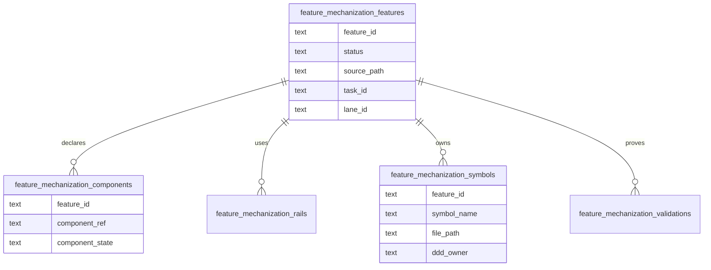

# Feature Mechanization DB-First Read Model Plan

## Purpose

Define the accepted route for moving feature-mechanization visibility toward
DB-first planning without breaking the existing PR guard that validates feature
manifests from docs.

The first implementation slice will import `feature-mechanization` fenced
manifests from tracked planning docs into normalized Planning DB tables and
expose operator queries for feature, component, rail, symbol, and validation
state. This plan is not itself the completion signal for that work. The docs
remain the compatibility writer until a later accepted migration promotes DB as
the single writer and renders docs from DB.

## Governing Sources

- [Governance document and rule inventory](../../../status/governance-document-rule-inventory.md)
- [Planning control tower](../../../state/planning-control-tower.md)
- [Command and query rail governance](../../../../architecture/command-query-rail-governance.md)
- [Fowler opportunity planning governance](../../../../architecture/fowler-opportunity-planning-governance.md)
- [Knowledge intake retirement component](../../../../architecture/components/ci-governance/knowledge-intake-retirement-component.md)
- `scripts/check-feature-mechanization.cjs`
- `scripts/lib/feature-mechanization-manifest.cjs`

## Problem

Feature mechanization currently carries high-value structured facts:

- feature state;
- component guides;
- command/query rails;
- domain objects;
- symbols and owning files;
- architecture guards, Cypress flows, completion gates, and red/green cycles.

Those facts live only inside Markdown fenced blocks. That makes component
implementation state hard to query, hard to prioritize, and easy to duplicate
when frontend proposal docs are classified or archived.

## Planned Command And Query Rails

| Rail                                  | Type    | Owner                             | Read model or aggregate                        |
| ------------------------------------- | ------- | --------------------------------- | ---------------------------------------------- |
| `ImportFeatureMechanizationManifests` | command | Planning DB governance import     | `FeatureMechanizationSnapshot`                 |
| `ListFeatureMechanizationFeatures`    | query   | Planning DB governance read model | feature state summary                          |
| `ListFeatureMechanizationComponents`  | query   | Planning DB governance read model | component implementation state                 |
| `ListFeatureMechanizationSymbols`     | query   | Planning DB governance read model | symbol-to-feature ownership                    |
| `ListFeatureMechanizationRails`       | query   | Planning DB governance read model | feature command/query rails                    |
| `ListFeatureMechanizationValidations` | query   | Planning DB governance read model | guards, tests, red/green, and completion gates |

## Mechanization Posture

This proposal does not declare a `feature-mechanization` manifest for
`D-FEATURE-MECH-DB-FIRST`.

The feature remains open because the accepted completion signals require
Planning DB query rails that are not currently available from
`scripts/planning-db-query.cjs`. A future implementation PR may add a closed
feature-mechanization manifest for `D-FEATURE-MECH-DB-FIRST` only in the same
slice that adds the read-model migration, import path, query rails, tests, and
validation evidence below.

## Data Model



## Planned Implementation Scope

Included:

- Add Planning DB migration tables and summary/query views.
- Add a parser/import helper that reuses
  `extractFeatureMechanizationManifests`.
- Import snapshots from `docs/planning/proposals/mandatory/**/*.md`.
- Add `planning:db:query` surfaces for features, components, rails, symbols,
  and validations.
- Add focused Node tests for parser behavior, query formatting, and import
  table deletion ordering.
- Update docs indexes and governance projections.

Excluded:

- Changing `scripts/check-feature-mechanization.cjs` to read DB instead of
  Markdown.
- Replacing feature-mechanization fences with generated docs.
- Physically moving frontend proposal files.
- Writing implementation-result history; this slice imports declared state and
  validation commands, not CI run outcomes.

## Implementation Acceptance Criteria

- `pnpm planning:db:query feature-mechanization --limit 10` lists feature IDs,
  status, plan path, component count, rail count, symbol count, and validation
  count.
- `pnpm planning:db:query feature-mechanization-components --state implemented`
  lists component refs by feature and source path.
- `pnpm planning:db:query feature-mechanization-symbols --path apps/web/...`
  lists declared symbols for a file path.
- `pnpm planning:db:query feature-mechanization-rails --rail <name>` lists
  features that declare a command/query rail.
- `pnpm planning:db:query feature-mechanization-validations --kind completion`
  lists completion-gate commands.
- `pnpm governance:refresh` imports the new read model through the existing
  governance import path.

## Migration Phases

1. Read-model import from docs. First implementation slice.
2. Component-state reconciliation: link imported component refs to
   `frontend_components`, `governance_components`, and architecture component
   records.
3. Single-writer migration: decide whether Planning DB becomes the writer and
   docs are rendered from DB.

## Validation

Current plan-posture validation:

```bash
pnpm docs:feature-mechanization
pnpm verify:prepush
```

Future implementation validation, once the read model and query rails exist:

```bash
node --test scripts/feature-mechanization-manifest.test.cjs scripts/check-feature-mechanization.test.cjs scripts/planning-db-feature-mechanization.test.cjs
pnpm planning:db:migrate
pnpm governance:refresh
pnpm planning:db:query feature-mechanization --limit 10
pnpm planning:db:query feature-mechanization-components --state implemented --limit 10
pnpm verify:prepush
```
