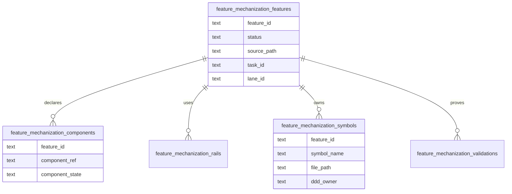

# Feature Mechanization DB-First Read Model Plan

## Purpose

Define the accepted route for moving feature-mechanization visibility toward
DB-first planning without breaking the existing PR guard that validates feature
manifests from docs.

The first implementation slice imports `feature-mechanization` fenced manifests
from tracked planning docs into Planning DB and makes the implementation gate
consume the DB projection. The docs remain the compatibility writer until a
later accepted migration promotes DB as the single writer and renders docs from
DB.

## Governing Sources

- [Governance document and rule inventory](../../../status/governance-document-rule-inventory.md)
- [Planning control tower](../../../state/planning-control-tower.md)
- [Command and query rail governance](../../../../architecture/command-query-rail-governance.md)
- [Fowler opportunity planning governance](../../../../architecture/fowler-opportunity-planning-governance.md)
- [Knowledge intake retirement component](../../../../architecture/components/ci-governance/knowledge-intake-retirement-component.md)
- `scripts/check-feature-mechanization.cjs`
- `scripts/lib/feature-mechanization-manifest.cjs`

## Problem

Feature mechanization currently carries high-value structured facts:

- feature state;
- component guides;
- command/query rails;
- domain objects;
- symbols and owning files;
- architecture guards, Cypress flows, completion gates, and red/green cycles.

Those facts live only inside Markdown fenced blocks. That makes component
implementation state hard to query, hard to prioritize, and easy to duplicate
when frontend proposal docs are classified or archived.

## Planned Command And Query Rails

| Rail                                         | Type    | Owner                             | Read model or aggregate                        |
| -------------------------------------------- | ------- | --------------------------------- | ---------------------------------------------- |
| `ImportFeatureMechanizationManifests`        | command | Planning DB governance import     | `FeatureMechanizationSnapshot`                 |
| `ListFeatureMechanizationManifests`          | query   | Planning DB governance read model | imported feature manifest rows                 |
| `ListFeatureMechanizationFeatures`           | query   | Planning DB governance read model | feature state summary                          |
| `ListFeatureMechanizationComponents`         | query   | Planning DB governance read model | component implementation state                 |
| `ListFeatureMechanizationSymbols`            | query   | Planning DB governance read model | symbol-to-feature ownership                    |
| `ListFeatureMechanizationRails`              | query   | Planning DB governance read model | feature command/query rails                    |
| `ListFeatureMechanizationValidations`        | query   | Planning DB governance read model | guards, tests, red/green, and completion gates |
| `ValidateFeatureMechanizationImplementation` | command | CI governance implementation gate | changed-file implementation diff               |

## Mechanization Posture

The current slice implements the DB-backed read path for
`ValidateFeatureMechanizationImplementation`. The broader operator query rails
for features, components, symbols, rails, and validations remain planned in the
next migration phase.

```feature-mechanization
version: 1
featureId: FEATURE-MECHANIZATION-DB-FIRST-READ-PATH-20260605
mechanizationStatus: implemented
noHumanDecisionsRemaining: true
implementationPlan: docs/planning/proposals/mandatory/governance-and-docs/feature-mechanization-db-first-read-model-plan-20260605.md
componentGuides:
  - docs/architecture/components/ci-governance/local-changed-files-gate-component.md
userStories:
  - docs/architecture/components/ci-governance/component-engineering-record-user-stories.md
governingSources:
  - AGENTS.md
  - docs/planning/status/governance-document-rule-inventory.md
  - docs/guides/ai-work-protocol.md
  - docs/architecture/command-query-rail-governance.md
  - docs/architecture/fowler-opportunity-planning-governance.md
allowedImplementationSurfaces:
  - docs/planning/proposals/mandatory/governance-and-docs/feature-mechanization-db-first-read-model-plan-20260605.md
  - scripts/check-feature-mechanization.cjs
  - scripts/check-feature-mechanization.test.cjs
forbiddenImplementationSurfaces:
  - apps/**
  - packages/**
  - specs/contracts/**
  - docs/archive/**
commandQueryRails:
  - name: ImportFeatureMechanizationManifests
    type: command
    dddOwner: Planning DB governance import
  - name: ListFeatureMechanizationManifests
    type: query
    dddOwner: Planning DB governance read model
  - name: ValidateFeatureMechanizationImplementation
    type: command
    dddOwner: CI governance implementation gate
domainObjects:
  - name: FeatureMechanizationSnapshot
    type: read model
    owner: Planning DB governance import
  - name: FeatureMechanizationImplementationDiff
    type: command input
    owner: CI governance implementation gate
fowlerSignals:
  - gate reads imported Planning DB projection instead of rescanning docs
  - runner subprocess duplicated the Planning DB import path
  - DB connection string drift between gate and planning query CLI
architectureGuards:
  - node --test scripts/check-feature-mechanization.test.cjs
cypressFlows:
  - N/A - repository governance CLI gate
completionGate:
  - node --test scripts/check-feature-mechanization.test.cjs
  - pnpm docs:feature-mechanization:implementation
  - pnpm verify:prepush
redGreenCycles:
  - id: implementation-gate-reads-db-manifests
    redTest: node --test scripts/check-feature-mechanization.test.cjs
    expectedFailure: implementation mode validates manifests read from scanned docs.
    patchSurfaces:
      - scripts/check-feature-mechanization.cjs
      - scripts/check-feature-mechanization.test.cjs
    greenTest: node --test scripts/check-feature-mechanization.test.cjs
symbols:
  - name: validateFeatureMechanizationManifestEntries
    path: scripts/check-feature-mechanization.cjs
    dddOwner: CI governance implementation gate
    cqRails:
      - ValidateFeatureMechanizationImplementation
      - ListFeatureMechanizationManifests
    fowlerSignals:
      - DB manifest rows keep the structural manifest validation
    architectureGuard: node --test scripts/check-feature-mechanization.test.cjs
    cypressCoverage: N/A
    unitTests:
      - scripts/check-feature-mechanization.test.cjs
  - name: normalizeDbFeatureMechanizationManifestRows
    path: scripts/check-feature-mechanization.cjs
    dddOwner: Planning DB governance read model
    cqRails:
      - ListFeatureMechanizationManifests
    fowlerSignals:
      - DB rows become the implementation gate read model
    architectureGuard: node --test scripts/check-feature-mechanization.test.cjs
    cypressCoverage: N/A
    unitTests:
      - scripts/check-feature-mechanization.test.cjs
  - name: readFeatureMechanizationManifestsFromDb
    path: scripts/check-feature-mechanization.cjs
    dddOwner: Planning DB governance read model
    cqRails:
      - ImportFeatureMechanizationManifests
      - ListFeatureMechanizationManifests
    fowlerSignals:
      - reuse Planning DB import instead of spawning a separate runner
      - share the Planning DB DSN with query/import commands
    architectureGuard: node --test scripts/check-feature-mechanization.test.cjs
    cypressCoverage: N/A
    unitTests:
      - scripts/check-feature-mechanization.test.cjs
  - name: sha256
    path: scripts/check-feature-mechanization.cjs
    dddOwner: Planning DB governance read model
    cqRails:
      - ValidateFeatureMechanizationImplementation
    fowlerSignals:
      - source hashes let the gate compare changed docs against imported DB rows
    architectureGuard: node --test scripts/check-feature-mechanization.test.cjs
    cypressCoverage: N/A
    unitTests:
      - scripts/check-feature-mechanization.test.cjs
  - name: isFeatureMechanizationSourcePath
    path: scripts/check-feature-mechanization.cjs
    dddOwner: CI governance implementation gate
    cqRails:
      - ValidateFeatureMechanizationImplementation
    fowlerSignals:
      - changed-file filtering keeps DB refresh scoped to feature manifest sources
    architectureGuard: node --test scripts/check-feature-mechanization.test.cjs
    cypressCoverage: N/A
    unitTests:
      - scripts/check-feature-mechanization.test.cjs
  - name: hasFeatureMechanizationManifestFence
    path: scripts/check-feature-mechanization.cjs
    dddOwner: CI governance implementation gate
    cqRails:
      - ValidateFeatureMechanizationImplementation
    fowlerSignals:
      - changed planning docs without a feature manifest do not force DB refresh
    architectureGuard: node --test scripts/check-feature-mechanization.test.cjs
    cypressCoverage: N/A
    unitTests:
      - scripts/check-feature-mechanization.test.cjs
  - name: readChangedFeatureMechanizationSourcePaths
    path: scripts/check-feature-mechanization.cjs
    dddOwner: CI governance implementation gate
    cqRails:
      - ValidateFeatureMechanizationImplementation
    fowlerSignals:
      - changed-file scope replaces unconditional governance import on every gate run
    architectureGuard: node --test scripts/check-feature-mechanization.test.cjs
    cypressCoverage: N/A
    unitTests:
      - scripts/check-feature-mechanization.test.cjs
  - name: readCurrentSourceHashes
    path: scripts/check-feature-mechanization.cjs
    dddOwner: Planning DB governance read model
    cqRails:
      - ValidateFeatureMechanizationImplementation
    fowlerSignals:
      - current source hashes identify stale DB projections before validation
    architectureGuard: node --test scripts/check-feature-mechanization.test.cjs
    cypressCoverage: N/A
    unitTests:
      - scripts/check-feature-mechanization.test.cjs
  - name: shouldRefreshFeatureMechanizationManifestDb
    path: scripts/check-feature-mechanization.cjs
    dddOwner: Planning DB governance read model
    cqRails:
      - ImportFeatureMechanizationManifests
      - ValidateFeatureMechanizationImplementation
    fowlerSignals:
      - targeted DB staleness checks avoid repeated full import work
    architectureGuard: node --test scripts/check-feature-mechanization.test.cjs
    cypressCoverage: N/A
    unitTests:
      - scripts/check-feature-mechanization.test.cjs
  - name: main
    path: scripts/check-feature-mechanization.cjs
    dddOwner: CI governance implementation gate CLI
    cqRails:
      - ValidateFeatureMechanizationImplementation
    fowlerSignals:
      - implementation mode branches to DB read path
    architectureGuard: node --test scripts/check-feature-mechanization.test.cjs
    cypressCoverage: N/A
    unitTests:
      - scripts/check-feature-mechanization.test.cjs
```

## Data Model



## Planned Implementation Scope

Included:

- Reuse the existing command/query rail DB import projection for implementation
  gate reads.
- Keep structural manifest validation by validating DB manifest rows.
- Share the Planning DB import path and DSN used by `planning:db:query`.
- Add focused Node tests for DB row normalization, DB read path, and
  DB-backed manifest validation.

Excluded:

- Replacing feature-mechanization fences with generated docs.
- Adding the broader operator query rails for feature, component, symbol, rail,
  and validation lists.
- Physically moving frontend proposal files.
- Writing implementation-result history; this slice imports declared state and
  validation commands, not CI run outcomes.

## Implementation Acceptance Criteria

- `pnpm planning:db:query feature-mechanization --limit 10` lists feature IDs,
  status, plan path, component count, rail count, symbol count, and validation
  count.
- `pnpm planning:db:query feature-mechanization-components --state implemented`
  lists component refs by feature and source path.
- `pnpm planning:db:query feature-mechanization-symbols --path apps/web/...`
  lists declared symbols for a file path.
- `pnpm planning:db:query feature-mechanization-rails --rail <name>` lists
  features that declare a command/query rail.
- `pnpm planning:db:query feature-mechanization-validations --kind completion`
  lists completion-gate commands.
- `pnpm governance:refresh` imports the new read model through the existing
  governance import path.

## Migration Phases

1. Read-model import from docs. First implementation slice.
2. Component-state reconciliation: link imported component refs to
   `frontend_components`, `governance_components`, and architecture component
   records.
3. Single-writer migration: decide whether Planning DB becomes the writer and
   docs are rendered from DB.

## Validation

Current plan-posture validation:

```bash
pnpm docs:feature-mechanization
pnpm verify:prepush
```

Future implementation validation, once the read model and query rails exist:

```bash
node --test scripts/feature-mechanization-manifest.test.cjs scripts/check-feature-mechanization.test.cjs scripts/planning-db-feature-mechanization.test.cjs
pnpm planning:db:migrate
pnpm governance:refresh
pnpm planning:db:query feature-mechanization --limit 10
pnpm planning:db:query feature-mechanization-components --state implemented --limit 10
pnpm verify:prepush
```
