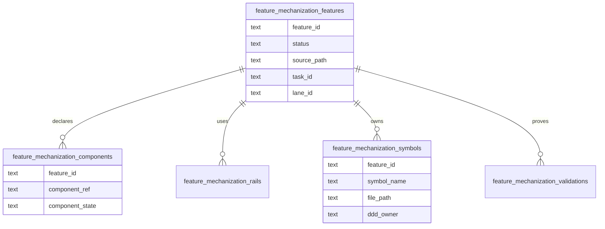

# Feature Mechanization DB-First Read Model Plan

## Purpose

Define the accepted route for moving feature-mechanization visibility toward
DB-first planning without breaking the existing PR guard that validates feature
manifests from docs.

The first implementation slice imports `feature-mechanization` fenced manifests
from tracked planning docs into Planning DB and makes the implementation gate
consume the DB projection. The docs remain the compatibility writer until a
later accepted migration promotes DB as the single writer and renders docs from
DB.

## Governing Sources

- [Governance document and rule inventory](../../../status/governance-document-rule-inventory.md)
- [Planning control tower](../../../state/planning-control-tower.md)
- [Command and query rail governance](../../../../architecture/command-query-rail-governance.md)
- [Fowler opportunity planning governance](../../../../architecture/fowler-opportunity-planning-governance.md)
- [Knowledge intake retirement component](../../../../architecture/components/ci-governance/knowledge-intake-retirement-component.md)
- `scripts/check-feature-mechanization.cjs`
- `scripts/lib/feature-mechanization-manifest.cjs`

## Problem

Feature mechanization currently carries high-value structured facts:

- feature state;
- component guides;
- command/query rails;
- domain objects;
- symbols and owning files;
- architecture guards, Cypress flows, completion gates, and red/green cycles.

Those facts live only inside Markdown fenced blocks. That makes component
implementation state hard to query, hard to prioritize, and easy to duplicate
when frontend proposal docs are classified or archived.

## Planned Command And Query Rails

| Rail                                         | Type    | Owner                             | Read model or aggregate                        |
| -------------------------------------------- | ------- | --------------------------------- | ---------------------------------------------- |
| `ImportFeatureMechanizationManifests`        | command | Planning DB governance import     | `FeatureMechanizationSnapshot`                 |
| `ListFeatureMechanizationManifests`          | query   | Planning DB governance read model | imported feature manifest rows                 |
| `ListFeatureMechanizationFeatures`           | query   | Planning DB governance read model | feature state summary                          |
| `ListFeatureMechanizationComponents`         | query   | Planning DB governance read model | component implementation state                 |
| `ListFeatureMechanizationSymbols`            | query   | Planning DB governance read model | symbol-to-feature ownership                    |
| `ListFeatureMechanizationRails`              | query   | Planning DB governance read model | feature command/query rails                    |
| `ListFeatureMechanizationValidations`        | query   | Planning DB governance read model | guards, tests, red/green, and completion gates |
| `ValidateFeatureMechanizationImplementation` | command | CI governance implementation gate | changed-file implementation diff               |

## Mechanization Posture

The first slice implemented the DB-backed read path for
`ValidateFeatureMechanizationImplementation`. The current writer slice adds
`RecordFeatureMechanizationRail` so new command/query rail declarations can be
written through `planning:db:operate` into local Planning DB rows, then read
through the effective `command_query_rail_query` projection. The implementation
gate reads `command_query_rail_manifest_query` so every DB-backed raw manifest
contributes implementation symbol declarations, while rail listing still uses
canonical rail precedence. Test shards are validated as allowed surfaces but do
not require symbol declarations for harness imports or local fixtures.
Compatibility Markdown manifests remain an import surface until generated
feature literature is fully DB-sourced.

```feature-mechanization
version: 1
featureId: FEATURE-MECHANIZATION-DB-FIRST-READ-PATH-20260605
mechanizationStatus: implemented
noHumanDecisionsRemaining: true
implementationPlan: docs/planning/proposals/mandatory/governance-and-docs/feature-mechanization-db-first-read-model-plan-20260605.md
componentGuides:
  - docs/architecture/components/ci-governance/local-changed-files-gate-component.md
userStories:
  - docs/architecture/components/ci-governance/component-engineering-record-user-stories.md
governingSources:
  - AGENTS.md
  - docs/planning/status/governance-document-rule-inventory.md
  - docs/guides/ai-work-protocol.md
  - docs/architecture/command-query-rail-governance.md
  - docs/architecture/fowler-opportunity-planning-governance.md
allowedImplementationSurfaces:
  - docs/planning/proposals/mandatory/governance-and-docs/feature-mechanization-db-first-read-model-plan-20260605.md
  - scripts/planning-db/queries/feature-mechanization-query.cjs
  - scripts/planning-db-query.cjs
  - scripts/planning-db-query.test.cjs
  - scripts/check-feature-mechanization.cjs
  - scripts/check-feature-mechanization.test.cjs
forbiddenImplementationSurfaces:
  - apps/**
  - packages/**
  - specs/contracts/**
  - docs/archive/**
commandQueryRails:
  - name: ImportFeatureMechanizationManifests
    type: command
    dddOwner: Planning DB governance import
  - name: ListFeatureMechanizationManifests
    type: query
    dddOwner: Planning DB governance read model
  - name: ListFeatureMechanizationFeatures
    type: query
    dddOwner: Planning DB governance read model
  - name: ListFeatureMechanizationComponents
    type: query
    dddOwner: Planning DB governance read model
  - name: ListFeatureMechanizationSymbols
    type: query
    dddOwner: Planning DB governance read model
  - name: ListFeatureMechanizationRails
    type: query
    dddOwner: Planning DB governance read model
  - name: ListFeatureMechanizationValidations
    type: query
    dddOwner: Planning DB governance read model
  - name: ValidateFeatureMechanizationImplementation
    type: command
    dddOwner: CI governance implementation gate
domainObjects:
  - name: FeatureMechanizationSnapshot
    type: read model
    owner: Planning DB governance import
  - name: FeatureMechanizationOperatorReadModel
    type: read model
    owner: Planning DB governance read model
  - name: FeatureMechanizationImplementationDiff
    type: command input
    owner: CI governance implementation gate
fowlerSignals:
  - gate reads imported Planning DB projection instead of rescanning docs
  - runner subprocess duplicated the Planning DB import path
  - DB connection string drift between gate and planning query CLI
architectureGuards:
  - node --test scripts/check-feature-mechanization.test.cjs
  - node --test scripts/planning-db-query.test.cjs
cypressFlows:
  - N/A - repository governance CLI gate
completionGate:
  - node --test scripts/planning-db-query.test.cjs
  - node --test scripts/check-feature-mechanization.test.cjs
  - pnpm docs:feature-mechanization:implementation
  - pnpm verify:prepush
redGreenCycles:
  - id: implementation-gate-reads-db-manifests
    redTest: node --test scripts/check-feature-mechanization.test.cjs
    expectedFailure: implementation mode validates manifests read from scanned docs.
    patchSurfaces:
      - scripts/check-feature-mechanization.cjs
      - scripts/check-feature-mechanization.test.cjs
    greenTest: node --test scripts/check-feature-mechanization.test.cjs
  - id: operator-query-rails-exercise-db-read-model
    redTest: node --test scripts/planning-db-query.test.cjs
    expectedFailure: planning DB query CLI rejects feature-mechanization query names.
    patchSurfaces:
      - scripts/planning-db/queries/feature-mechanization-query.cjs
      - scripts/planning-db-query.cjs
      - scripts/planning-db-query.test.cjs
    greenTest: node --test scripts/planning-db-query.test.cjs
symbols:
  - name: createFeatureMechanizationReadModelComponent
    path: scripts/planning-db/queries/feature-mechanization-query.cjs
    dddOwner: Planning DB governance read model
    cqRails:
      - ListFeatureMechanizationFeatures
      - ListFeatureMechanizationComponents
      - ListFeatureMechanizationSymbols
      - ListFeatureMechanizationRails
      - ListFeatureMechanizationValidations
    fowlerSignals:
      - feature-mechanization operator queries stay in a focused read-model component
    architectureGuard: node --test scripts/planning-db-query.test.cjs
    cypressCoverage: N/A
    unitTests:
      - scripts/planning-db-query.test.cjs
  - name: buildFeatureMechanizationFeatureRows
    path: scripts/planning-db/queries/feature-mechanization-query.cjs
    dddOwner: Planning DB governance read model
    cqRails:
      - ListFeatureMechanizationFeatures
    fowlerSignals:
      - feature summary rows expose imported DB state for operators
    architectureGuard: node --test scripts/planning-db-query.test.cjs
    cypressCoverage: N/A
    unitTests:
      - scripts/planning-db-query.test.cjs
  - name: buildFeatureMechanizationComponentRows
    path: scripts/planning-db/queries/feature-mechanization-query.cjs
    dddOwner: Planning DB governance read model
    cqRails:
      - ListFeatureMechanizationComponents
    fowlerSignals:
      - component refs become queryable DB rows
    architectureGuard: node --test scripts/planning-db-query.test.cjs
    cypressCoverage: N/A
    unitTests:
      - scripts/planning-db-query.test.cjs
  - name: buildFeatureMechanizationSymbolRows
    path: scripts/planning-db/queries/feature-mechanization-query.cjs
    dddOwner: Planning DB governance read model
    cqRails:
      - ListFeatureMechanizationSymbols
    fowlerSignals:
      - symbol ownership can be inspected by file path
    architectureGuard: node --test scripts/planning-db-query.test.cjs
    cypressCoverage: N/A
    unitTests:
      - scripts/planning-db-query.test.cjs
  - name: buildFeatureMechanizationRailRows
    path: scripts/planning-db/queries/feature-mechanization-query.cjs
    dddOwner: Planning DB governance read model
    cqRails:
      - ListFeatureMechanizationRails
    fowlerSignals:
      - declared rails can be inspected by rail name
    architectureGuard: node --test scripts/planning-db-query.test.cjs
    cypressCoverage: N/A
    unitTests:
      - scripts/planning-db-query.test.cjs
  - name: buildFeatureMechanizationValidationRows
    path: scripts/planning-db/queries/feature-mechanization-query.cjs
    dddOwner: Planning DB governance read model
    cqRails:
      - ListFeatureMechanizationValidations
    fowlerSignals:
      - completion and test gates become queryable DB rows
    architectureGuard: node --test scripts/planning-db-query.test.cjs
    cypressCoverage: N/A
    unitTests:
      - scripts/planning-db-query.test.cjs
  - name: readFeatureMechanizationFeatureRows
    path: scripts/planning-db/queries/feature-mechanization-query.cjs
    dddOwner: Planning DB governance read model
    cqRails:
      - ListFeatureMechanizationFeatures
    fowlerSignals:
      - feature summaries read command_query_rail_manifest_query
    architectureGuard: node --test scripts/planning-db-query.test.cjs
    cypressCoverage: N/A
    unitTests:
      - scripts/planning-db-query.test.cjs
  - name: readFeatureMechanizationComponentRows
    path: scripts/planning-db/queries/feature-mechanization-query.cjs
    dddOwner: Planning DB governance read model
    cqRails:
      - ListFeatureMechanizationComponents
    fowlerSignals:
      - component refs are derived from imported manifest JSON in DB
    architectureGuard: node --test scripts/planning-db-query.test.cjs
    cypressCoverage: N/A
    unitTests:
      - scripts/planning-db-query.test.cjs
  - name: readFeatureMechanizationSymbolRows
    path: scripts/planning-db/queries/feature-mechanization-query.cjs
    dddOwner: Planning DB governance read model
    cqRails:
      - ListFeatureMechanizationSymbols
    fowlerSignals:
      - symbol path filters execute against DB rows
    architectureGuard: node --test scripts/planning-db-query.test.cjs
    cypressCoverage: N/A
    unitTests:
      - scripts/planning-db-query.test.cjs
  - name: readFeatureMechanizationRailRows
    path: scripts/planning-db/queries/feature-mechanization-query.cjs
    dddOwner: Planning DB governance read model
    cqRails:
      - ListFeatureMechanizationRails
    fowlerSignals:
      - local and imported effective rails share the manifest projection
    architectureGuard: node --test scripts/planning-db-query.test.cjs
    cypressCoverage: N/A
    unitTests:
      - scripts/planning-db-query.test.cjs
  - name: readFeatureMechanizationValidationRows
    path: scripts/planning-db/queries/feature-mechanization-query.cjs
    dddOwner: Planning DB governance read model
    cqRails:
      - ListFeatureMechanizationValidations
    fowlerSignals:
      - validation gate commands are queryable without rescanning Markdown
    architectureGuard: node --test scripts/planning-db-query.test.cjs
    cypressCoverage: N/A
    unitTests:
      - scripts/planning-db-query.test.cjs
  - name: buildPlanningDbQueryHelpText
    path: scripts/planning-db-query.cjs
    dddOwner: Planning DB governance query CLI
    cqRails:
      - ListFeatureMechanizationFeatures
      - ListFeatureMechanizationComponents
      - ListFeatureMechanizationSymbols
      - ListFeatureMechanizationRails
      - ListFeatureMechanizationValidations
    fowlerSignals:
      - operator help exposes DB-first feature-mechanization query rails
    architectureGuard: node --test scripts/planning-db-query.test.cjs
    cypressCoverage: N/A
    unitTests:
      - scripts/planning-db-query.test.cjs
  - name: parseArgs
    path: scripts/planning-db-query.cjs
    dddOwner: Planning DB governance query CLI
    cqRails:
      - ListFeatureMechanizationFeatures
      - ListFeatureMechanizationComponents
      - ListFeatureMechanizationSymbols
      - ListFeatureMechanizationRails
      - ListFeatureMechanizationValidations
    fowlerSignals:
      - CLI accepts the feature-mechanization filters listed in the plan
    architectureGuard: node --test scripts/planning-db-query.test.cjs
    cypressCoverage: N/A
    unitTests:
      - scripts/planning-db-query.test.cjs
  - name: runQuery
    path: scripts/planning-db-query.cjs
    dddOwner: Planning DB governance query CLI
    cqRails:
      - ListFeatureMechanizationFeatures
      - ListFeatureMechanizationComponents
      - ListFeatureMechanizationSymbols
      - ListFeatureMechanizationRails
      - ListFeatureMechanizationValidations
    fowlerSignals:
      - CLI dispatch routes feature-mechanization queries to DB readers
    architectureGuard: node --test scripts/planning-db-query.test.cjs
    cypressCoverage: N/A
    unitTests:
      - scripts/planning-db-query.test.cjs
  - name: validateFeatureMechanizationManifestEntries
    path: scripts/check-feature-mechanization.cjs
    dddOwner: CI governance implementation gate
    cqRails:
      - ValidateFeatureMechanizationImplementation
      - ListFeatureMechanizationManifests
    fowlerSignals:
      - DB manifest rows keep the structural manifest validation
    architectureGuard: node --test scripts/check-feature-mechanization.test.cjs
    cypressCoverage: N/A
    unitTests:
      - scripts/check-feature-mechanization.test.cjs
  - name: normalizeDbFeatureMechanizationManifestRows
    path: scripts/check-feature-mechanization.cjs
    dddOwner: Planning DB governance read model
    cqRails:
      - ListFeatureMechanizationManifests
    fowlerSignals:
      - DB rows become the implementation gate read model
    architectureGuard: node --test scripts/check-feature-mechanization.test.cjs
    cypressCoverage: N/A
    unitTests:
      - scripts/check-feature-mechanization.test.cjs
  - name: readFeatureMechanizationManifestsFromDb
    path: scripts/check-feature-mechanization.cjs
    dddOwner: Planning DB governance read model
    cqRails:
      - ImportFeatureMechanizationManifests
      - ListFeatureMechanizationManifests
    fowlerSignals:
      - reuse Planning DB import instead of spawning a separate runner
      - share the Planning DB DSN with query/import commands
    architectureGuard: node --test scripts/check-feature-mechanization.test.cjs
    cypressCoverage: N/A
    unitTests:
      - scripts/check-feature-mechanization.test.cjs
  - name: sha256
    path: scripts/check-feature-mechanization.cjs
    dddOwner: Planning DB governance read model
    cqRails:
      - ValidateFeatureMechanizationImplementation
    fowlerSignals:
      - source hashes let the gate compare changed docs against imported DB rows
    architectureGuard: node --test scripts/check-feature-mechanization.test.cjs
    cypressCoverage: N/A
    unitTests:
      - scripts/check-feature-mechanization.test.cjs
  - name: isFeatureMechanizationSourcePath
    path: scripts/check-feature-mechanization.cjs
    dddOwner: CI governance implementation gate
    cqRails:
      - ValidateFeatureMechanizationImplementation
    fowlerSignals:
      - changed-file filtering keeps DB refresh scoped to feature manifest sources
    architectureGuard: node --test scripts/check-feature-mechanization.test.cjs
    cypressCoverage: N/A
    unitTests:
      - scripts/check-feature-mechanization.test.cjs
  - name: hasFeatureMechanizationManifestFence
    path: scripts/check-feature-mechanization.cjs
    dddOwner: CI governance implementation gate
    cqRails:
      - ValidateFeatureMechanizationImplementation
    fowlerSignals:
      - changed planning docs without a feature manifest do not force DB refresh
    architectureGuard: node --test scripts/check-feature-mechanization.test.cjs
    cypressCoverage: N/A
    unitTests:
      - scripts/check-feature-mechanization.test.cjs
  - name: readChangedFeatureMechanizationSourcePaths
    path: scripts/check-feature-mechanization.cjs
    dddOwner: CI governance implementation gate
    cqRails:
      - ValidateFeatureMechanizationImplementation
    fowlerSignals:
      - changed-file scope replaces unconditional governance import on every gate run
    architectureGuard: node --test scripts/check-feature-mechanization.test.cjs
    cypressCoverage: N/A
    unitTests:
      - scripts/check-feature-mechanization.test.cjs
  - name: readCurrentSourceHashes
    path: scripts/check-feature-mechanization.cjs
    dddOwner: Planning DB governance read model
    cqRails:
      - ValidateFeatureMechanizationImplementation
    fowlerSignals:
      - current source hashes identify stale DB projections before validation
    architectureGuard: node --test scripts/check-feature-mechanization.test.cjs
    cypressCoverage: N/A
    unitTests:
      - scripts/check-feature-mechanization.test.cjs
  - name: shouldRefreshFeatureMechanizationManifestDb
    path: scripts/check-feature-mechanization.cjs
    dddOwner: Planning DB governance read model
    cqRails:
      - ImportFeatureMechanizationManifests
      - ValidateFeatureMechanizationImplementation
    fowlerSignals:
      - targeted DB staleness checks avoid repeated full import work
    architectureGuard: node --test scripts/check-feature-mechanization.test.cjs
    cypressCoverage: N/A
    unitTests:
      - scripts/check-feature-mechanization.test.cjs
  - name: main
    path: scripts/check-feature-mechanization.cjs
    dddOwner: CI governance implementation gate CLI
    cqRails:
      - ValidateFeatureMechanizationImplementation
    fowlerSignals:
      - implementation mode branches to DB read path
    architectureGuard: node --test scripts/check-feature-mechanization.test.cjs
    cypressCoverage: N/A
    unitTests:
      - scripts/check-feature-mechanization.test.cjs
```

```feature-mechanization
version: 1
featureId: FEATURE-MECHANIZATION-DB-FIRST-WRITER-20260605
mechanizationStatus: implemented
noHumanDecisionsRemaining: true
implementationPlan: docs/planning/proposals/mandatory/governance-and-docs/feature-mechanization-db-first-read-model-plan-20260605.md
componentGuides:
  - docs/architecture/command-query-rail-governance.md
userStories:
  - docs/architecture/components/ci-governance/component-engineering-record-user-stories.md
governingSources:
  - AGENTS.md
  - docs/planning/status/governance-document-rule-inventory.md
  - docs/adr/adr-0055-planning-db-canonical-operational-source.md
  - docs/guides/ai-work-protocol.md
  - docs/architecture/command-query-rail-governance.md
  - docs/architecture/fowler-opportunity-planning-governance.md
allowedImplementationSurfaces:
  - docs/planning/proposals/mandatory/governance-and-docs/feature-mechanization-db-first-read-model-plan-20260605.md
  - docs/planning/status/db-surface-inventory.md
  - scripts/planning-db-operate.cjs
  - scripts/planning-db-operate.test.cjs
  - scripts/planning-db-operate-tests/feature-mechanization.test.cjs
  - scripts/check-feature-mechanization.cjs
  - scripts/check-feature-mechanization.test.cjs
  - scripts/planning-db-migrate.test.cjs
  - tools/planning-db/migrations/059_feature_mechanization_local_writer.sql
  - tools/planning-db/migrations/060_command_query_rail_effective_manifest_projection.sql
  - tools/planning-db/migrations/061_command_query_rail_local_precedence.sql
forbiddenImplementationSurfaces:
  - apps/**
  - packages/**
  - specs/contracts/**
  - docs/archive/**
commandQueryRails:
  - name: RecordFeatureMechanizationRail
    type: command
    dddOwner: Planning DB governance writer
  - name: ListFeatureMechanizationRails
    type: query
    dddOwner: Planning DB governance read model
  - name: ValidateFeatureMechanizationImplementation
    type: command
    dddOwner: CI governance implementation gate
domainObjects:
  - name: FeatureMechanizationLocalRail
    type: aggregate row
    owner: Planning DB governance writer
  - name: FeatureMechanizationLocalOperation
    type: audit row
    owner: Planning DB governance writer
  - name: FeatureMechanizationEffectiveRailProjection
    type: read model
    owner: Planning DB governance read model
fowlerSignals:
  - Markdown import was the only rail declaration writer even after DB-first posture.
  - Implementation validation read the imported table and ignored local DB-authored rails.
  - A local rail writer can produce invalid raw manifests unless the command owns the complete manifest projection contract.
architectureGuards:
  - node --test scripts/planning-db-operate.test.cjs scripts/check-feature-mechanization.test.cjs scripts/planning-db-migrate.test.cjs
cypressFlows:
  - N/A - repository governance CLI gate
completionGate:
  - node --test scripts/planning-db-operate.test.cjs scripts/check-feature-mechanization.test.cjs scripts/planning-db-migrate.test.cjs
  - pnpm planning:db:migrate
  - pnpm docs:feature-mechanization:implementation
  - pnpm verify:prepush
redGreenCycles:
  - id: feature-mechanization-writer-records-valid-local-rails
    redTest: node --test scripts/planning-db-operate.test.cjs
    expectedFailure: feature-mechanization record is an unknown operation or emits an invalid local manifest projection.
    patchSurfaces:
      - scripts/planning-db-operate.cjs
      - scripts/planning-db-operate.test.cjs
      - scripts/planning-db-operate-tests/feature-mechanization.test.cjs
      - tools/planning-db/migrations/059_feature_mechanization_local_writer.sql
    greenTest: node --test scripts/planning-db-operate.test.cjs
  - id: implementation-gate-reads-effective-rail-projection
    redTest: node --test scripts/check-feature-mechanization.test.cjs scripts/planning-db-migrate.test.cjs
    expectedFailure: implementation manifests are read from command_query_rails instead of the DB manifest projection.
    patchSurfaces:
      - scripts/check-feature-mechanization.cjs
      - scripts/check-feature-mechanization.test.cjs
      - scripts/planning-db-migrate.test.cjs
      - tools/planning-db/migrations/060_command_query_rail_effective_manifest_projection.sql
    greenTest: node --test scripts/check-feature-mechanization.test.cjs scripts/planning-db-migrate.test.cjs
symbols:
  - name: allowedFeatureMechanizationStatuses
    path: scripts/planning-db-operate.cjs
    dddOwner: Planning DB governance writer
    cqRails:
      - RecordFeatureMechanizationRail
    fowlerSignals:
      - Writer command validates lifecycle states before DB writes.
    architectureGuard: node --test scripts/planning-db-operate.test.cjs
    cypressCoverage: N/A
    unitTests:
      - scripts/planning-db-operate.test.cjs
  - name: allowedFeatureMechanizationRailTypes
    path: scripts/planning-db-operate.cjs
    dddOwner: Planning DB governance writer
    cqRails:
      - RecordFeatureMechanizationRail
    fowlerSignals:
      - Writer command rejects non-command/query rail types at the boundary.
    architectureGuard: node --test scripts/planning-db-operate.test.cjs
    cypressCoverage: N/A
    unitTests:
      - scripts/planning-db-operate.test.cjs
  - name: allowedFeatureMechanizationRailStatuses
    path: scripts/planning-db-operate.cjs
    dddOwner: Planning DB governance writer
    cqRails:
      - RecordFeatureMechanizationRail
    fowlerSignals:
      - Writer command preserves gap and implementation rail statuses.
    architectureGuard: node --test scripts/planning-db-operate.test.cjs
    cypressCoverage: N/A
    unitTests:
      - scripts/planning-db-operate.test.cjs
  - name: featureMechanizationListOptionKeys
    path: scripts/planning-db-operate.cjs
    dddOwner: Planning DB governance writer
    cqRails:
      - RecordFeatureMechanizationRail
    fowlerSignals:
      - Repeated manifest fields stay explicit at the command boundary.
    architectureGuard: node --test scripts/planning-db-operate.test.cjs
    cypressCoverage: N/A
    unitTests:
      - scripts/planning-db-operate.test.cjs
  - name: validateFeatureMechanizationStatus
    path: scripts/planning-db-operate.cjs
    dddOwner: Planning DB governance writer
    cqRails:
      - RecordFeatureMechanizationRail
    fowlerSignals:
      - Feature status validation happens before DB mutation.
    architectureGuard: node --test scripts/planning-db-operate.test.cjs
    cypressCoverage: N/A
    unitTests:
      - scripts/planning-db-operate.test.cjs
  - name: validateFeatureMechanizationRailType
    path: scripts/planning-db-operate.cjs
    dddOwner: Planning DB governance writer
    cqRails:
      - RecordFeatureMechanizationRail
    fowlerSignals:
      - Rail type validation keeps the command/query catalog normalized.
    architectureGuard: node --test scripts/planning-db-operate.test.cjs
    cypressCoverage: N/A
    unitTests:
      - scripts/planning-db-operate.test.cjs
  - name: validateFeatureMechanizationRailStatus
    path: scripts/planning-db-operate.cjs
    dddOwner: Planning DB governance writer
    cqRails:
      - RecordFeatureMechanizationRail
    fowlerSignals:
      - Rail status validation protects gap and duplicate queries.
    architectureGuard: node --test scripts/planning-db-operate.test.cjs
    cypressCoverage: N/A
    unitTests:
      - scripts/planning-db-operate.test.cjs
  - name: validateFeatureMechanizationFeatureId
    path: scripts/planning-db-operate.cjs
    dddOwner: Planning DB governance writer
    cqRails:
      - RecordFeatureMechanizationRail
    fowlerSignals:
      - Stable feature ids keep local records replayable.
    architectureGuard: node --test scripts/planning-db-operate.test.cjs
    cypressCoverage: N/A
    unitTests:
      - scripts/planning-db-operate.test.cjs
  - name: normalizeFeatureMechanizationRailName
    path: scripts/planning-db-operate.cjs
    dddOwner: Planning DB governance writer
    cqRails:
      - RecordFeatureMechanizationRail
    fowlerSignals:
      - Normalized names give duplicate detection a deterministic key.
    architectureGuard: node --test scripts/planning-db-operate.test.cjs
    cypressCoverage: N/A
    unitTests:
      - scripts/planning-db-operate.test.cjs
  - name: assertFeatureMechanizationRailIdempotentReplayMatches
    path: scripts/planning-db-operate.cjs
    dddOwner: Planning DB governance writer
    cqRails:
      - RecordFeatureMechanizationRail
    fowlerSignals:
      - Idempotency replays cannot silently rewrite rail payloads.
    architectureGuard: node --test scripts/planning-db-operate.test.cjs
    cypressCoverage: N/A
    unitTests:
      - scripts/planning-db-operate.test.cjs
  - name: featureMechanizationRailId
    path: scripts/planning-db-operate.cjs
    dddOwner: Planning DB governance writer
    cqRails:
      - RecordFeatureMechanizationRail
    fowlerSignals:
      - Rail identity is deterministic across command replays.
    architectureGuard: node --test scripts/planning-db-operate.test.cjs
    cypressCoverage: N/A
    unitTests:
      - scripts/planning-db-operate.test.cjs
  - name: validateFeatureMechanizationRecordCommand
    path: scripts/planning-db-operate.cjs
    dddOwner: Planning DB governance writer
    cqRails:
      - RecordFeatureMechanizationRail
    fowlerSignals:
      - The writer rejects incomplete manifests before persistence.
    architectureGuard: node --test scripts/planning-db-operate.test.cjs
    cypressCoverage: N/A
    unitTests:
      - scripts/planning-db-operate.test.cjs
  - name: parseFeatureMechanizationCommand
    path: scripts/planning-db-operate.cjs
    dddOwner: Planning DB governance writer
    cqRails:
      - RecordFeatureMechanizationRail
    fowlerSignals:
      - CLI input is normalized into a single command shape.
    architectureGuard: node --test scripts/planning-db-operate.test.cjs
    cypressCoverage: N/A
    unitTests:
      - scripts/planning-db-operate.test.cjs
  - name: normalizeFeatureMechanizationRail
    path: scripts/planning-db-operate.cjs
    dddOwner: Planning DB governance writer
    cqRails:
      - RecordFeatureMechanizationRail
    fowlerSignals:
      - Existing local rows are normalized before revision checks.
    architectureGuard: node --test scripts/planning-db-operate.test.cjs
    cypressCoverage: N/A
    unitTests:
      - scripts/planning-db-operate.test.cjs
  - name: buildFeatureMechanizationSymbols
    path: scripts/planning-db-operate.cjs
    dddOwner: Planning DB governance writer
    cqRails:
      - RecordFeatureMechanizationRail
    fowlerSignals:
      - The writer projects implementation refs into manifest symbols for existing gates.
    architectureGuard: node --test scripts/planning-db-operate.test.cjs
    cypressCoverage: N/A
    unitTests:
      - scripts/planning-db-operate.test.cjs
  - name: planFeatureMechanizationRailRecordOperation
    path: scripts/planning-db-operate.cjs
    dddOwner: Planning DB governance writer
    cqRails:
      - RecordFeatureMechanizationRail
    fowlerSignals:
      - Planning separates command validation from DB mutation.
    architectureGuard: node --test scripts/planning-db-operate.test.cjs
    cypressCoverage: N/A
    unitTests:
      - scripts/planning-db-operate.test.cjs
  - name: readExistingFeatureMechanizationOperation
    path: scripts/planning-db-operate.cjs
    dddOwner: Planning DB governance writer
    cqRails:
      - RecordFeatureMechanizationRail
    fowlerSignals:
      - Durable operation history owns idempotency replay checks.
    architectureGuard: node --test scripts/planning-db-operate.test.cjs
    cypressCoverage: N/A
    unitTests:
      - scripts/planning-db-operate.test.cjs
  - name: readLocalFeatureMechanizationRail
    path: scripts/planning-db-operate.cjs
    dddOwner: Planning DB governance writer
    cqRails:
      - RecordFeatureMechanizationRail
    fowlerSignals:
      - Local rail revision checks happen against the DB row, not Markdown.
    architectureGuard: node --test scripts/planning-db-operate.test.cjs
    cypressCoverage: N/A
    unitTests:
      - scripts/planning-db-operate.test.cjs
  - name: writePlannedFeatureMechanizationRailRecordOperation
    path: scripts/planning-db-operate.cjs
    dddOwner: Planning DB governance writer
    cqRails:
      - RecordFeatureMechanizationRail
    fowlerSignals:
      - Persistence writes local rails and local operations without mutating imported rails.
    architectureGuard: node --test scripts/planning-db-operate.test.cjs
    cypressCoverage: N/A
    unitTests:
      - scripts/planning-db-operate.test.cjs
  - name: applyFeatureMechanizationRailRecordOperation
    path: scripts/planning-db-operate.cjs
    dddOwner: Planning DB governance writer
    cqRails:
      - RecordFeatureMechanizationRail
    fowlerSignals:
      - Runtime command application wraps migration, transaction, idempotency, and write.
    architectureGuard: node --test scripts/planning-db-operate.test.cjs
    cypressCoverage: N/A
    unitTests:
      - scripts/planning-db-operate.test.cjs
  - name: featureMechanizationRecordArgs
    path: scripts/planning-db-operate.test.cjs
    dddOwner: Planning DB governance writer tests
    cqRails:
      - RecordFeatureMechanizationRail
    fowlerSignals:
      - Tests reuse a full command contract fixture instead of narrow ad-hoc argument lists.
    architectureGuard: node --test scripts/planning-db-operate.test.cjs
    cypressCoverage: N/A
    unitTests:
      - scripts/planning-db-operate.test.cjs
```

## Data Model



## Planned Implementation Scope

Included:

- Reuse the existing command/query rail DB import projection for implementation
  gate reads.
- Add operator query rails for feature, component, symbol, rail, and validation
  lists from the DB-first manifest projection.
- Add `RecordFeatureMechanizationRail` as the Planning DB command writer for
  DB-authored local command/query rails.
- Project local rails and imported compatibility rails through one effective
  `command_query_rail_query`, preferring local records for the same
  feature/type/name key.
- Keep structural manifest validation by validating DB manifest rows.
- Share the Planning DB import path and DSN used by `planning:db:query`.
- Add focused Node tests for DB row normalization, DB read path, and
  DB-backed manifest validation.

Excluded:

- Replacing feature-mechanization fences with generated docs.
- Physically moving frontend proposal files.
- Writing implementation-result history; this slice imports declared state and
  validation commands, not CI run outcomes.

## Implementation Acceptance Criteria

- `pnpm planning:db:query feature-mechanization --limit 10` lists feature IDs,
  status, plan path, component count, rail count, symbol count, and validation
  count.
- `pnpm planning:db:query feature-mechanization-components --state implemented`
  lists component refs by feature and source path.
- `pnpm planning:db:query feature-mechanization-symbols --path apps/web/...`
  lists declared symbols for a file path.
- `pnpm planning:db:query feature-mechanization-rails --rail <name>` lists
  features that declare a command/query rail.
- `pnpm planning:db:query feature-mechanization-validations --kind completion`
  lists completion-gate commands.
- `pnpm governance:refresh` imports the new read model through the existing
  governance import path.
- `pnpm planning:db:operate feature-mechanization record ...` records a local
  rail with a structurally valid raw manifest projection and durable operation
  audit row.
- `pnpm planning:db:query command-query-rails --rail <name>` filters by the
  requested rail name and reads the effective local/import projection.

## Migration Phases

1. Read-model import from docs. First implementation slice.
2. Local writer slice: record DB-authored rails through
   `planning:db:operate`, expose raw manifests from the effective rail
   projection, and prefer local rails over matching imported compatibility
   rows.
3. Component-state reconciliation: link imported component refs to
   `frontend_components`, `governance_components`, and architecture component
   records.
4. Single-writer migration: render feature literature from DB and retire
   compatibility Markdown fences.

## Validation

Implementation validation:

```bash
node --test scripts/feature-mechanization-manifest.test.cjs scripts/check-feature-mechanization.test.cjs scripts/planning-db-feature-mechanization.test.cjs
node --test scripts/planning-db-operate.test.cjs scripts/planning-db-query.test.cjs scripts/planning-db-migrate.test.cjs
pnpm planning:db:migrate
pnpm planning:db:operate feature-mechanization record ...
pnpm governance:refresh
pnpm planning:db:query feature-mechanization --limit 10
pnpm planning:db:query command-query-rails --rail RecordFeatureMechanizationRail --limit 10
pnpm planning:db:query feature-mechanization-components --state implemented --limit 10
pnpm verify:prepush
```
