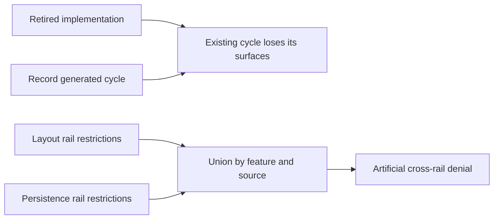
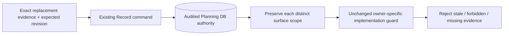

# Feature mechanization read model

Architecture Governance owns the verified `RecordFeatureMechanizationRail` and
`ValidateFeatureMechanizationImplementation` commands plus the existing
feature-mechanization list queries. Markdown manifests are imported evidence;
DB-authored current decisions remain authoritative.

DDL and read views live only in `tools/planning-db/schema.sql`. Current
DB-authored decisions live only in Planning DB and are read through governed
queries.

## Candidate evidence

Implementation validation requires an available Git comparison, not merely an
empty list of changed paths. A missing base, missing head, unavailable merge
base, or failed Git command rejects validation. A verified empty diff remains
valid. Pre-merge validation supplies explicit base and head commit identities;
local pre-push additionally includes staged, unstaged, and untracked files.
Neither mode may interpret a Git failure as successful empty evidence.

## Reconcile existing evidence without widening authority

The #3298 review found two independent integrity defects. Retiring an implementation
can leave an existing red/green cycle without patch surfaces, but the record command
can only append its generated cycle ID. Separately, the manifest reader unions the
allowed and forbidden surfaces of different local rails sharing a feature and source.
That transfers a layout-only restriction into a separately authorized persistence rail.

```mermaid
flowchart LR
  Retired[Retired implementation] --> Empty[Existing cycle loses its surfaces]
  Append[Record generated cycle] --> Empty
  Layout[Layout rail restrictions] --> Union[Union by feature and source]
  Persist[Persistence rail restrictions] --> Union
  Union --> Conflict[Artificial cross-rail denial]
```

Reuse `RecordFeatureMechanizationRail`, owned by `FeatureMechanizationLocalRail`,
through the existing `planning:db:operate feature-mechanization record` adapter.
An optional `--red-green-cycle <existing-id>` reconciles exactly one existing cycle.
It requires `--expected-revision`, explicit nonempty `--patch-surface` evidence,
the existing actor/source hash/idempotency contract, and a matching cycle in the
selected rail. Its replacement keeps the identity and all unrelated cycles. Unknown
IDs, missing/stale revisions, and patch surfaces outside the allowed scope or inside
the forbidden scope fail before any write. The operation remains audited; it is not
a bulk reset, cycle deletion, new command, import, or direct SQL repair.

`ValidateFeatureMechanizationImplementation` retains its existing most-specific
owner rule and all negative checks. Governing sources, tests and other feature
evidence still aggregate by source and feature. Surface ownership is projected
separately: allowed **and** forbidden sets must both match before scopes coalesce
(ignoring list order and duplicates). Each distinct scope receives the shared
feature evidence without inheriting another scope's permissions. Distinct scopes remain distinct entries;
equally specific conflicting owners still deny the write. No restriction is deleted
or promoted into a global allow list, and empty cycles remain invalid.

```mermaid
flowchart LR
  Evidence[Exact replacement evidence + expected revision] --> Record[Existing Record command]
  Record --> DB[(Audited Planning DB authority)]
  DB --> Scopes[Preserve each distinct surface scope]
  Scopes --> Guard[Unchanged owner-specific implementation guard]
  Guard --> Reject[Reject stale / forbidden / missing evidence]
```

| Scenario                                 | Opportunity / pattern                        | DDD owner / rail                                                                    | Implementation surfaces                                                                           | Unit / architecture / operator proof                                                                                                          | Out of scope                                              |
| ---------------------------------------- | -------------------------------------------- | ----------------------------------------------------------------------------------- | ------------------------------------------------------------------------------------------------- | --------------------------------------------------------------------------------------------------------------------------------------------- | --------------------------------------------------------- |
| Repair a retained cycle after retirement | Boundary drift / identity-preserving command | FeatureMechanizationLocalRail / RecordFeatureMechanizationRail                      | scripts/planning-db-operate.cjs; scripts/planning-db-operate-tests/feature-mechanization.test.cjs | Parser, planner, stale revision, unknown cycle, scope denial, unrelated-cycle preservation and audited payload tests; real CLI reconciliation | Bulk retirement, new rails, schema changes                |
| Preserve distinct rail restrictions      | Hidden authority / scoped read model         | Repository feature mechanization guard / ValidateFeatureMechanizationImplementation | scripts/check-feature-mechanization.cjs; scripts/check-feature-mechanization.test.cjs             | Cross-rail isolation, identical-scope aggregation, equal-specificity denial, malformed-manifest rejection; real exact-base/head gate          | Broader permissions, imports, changes to guard precedence |

The operator repairs the historical declarations with current source and test
references through the command, then runs the unchanged implementation gate. A green
governance gate does not establish Canvas product acceptance or live-provider proof.

## Single-team validation boundary

The approved single-team posture in
[#2957](https://github.com/dunay2/dvt/issues/2957#issuecomment-5777984750) keeps
Planning DB local and authoritative. Before merge, the operator runs
`pnpm docs:feature-mechanization:implementation` against that existing DB with
explicit `GIT_BASE` and `GIT_HEAD` commit SHAs and a clean worktree. The PR must
record those SHAs, command and result. A changed candidate or comparison base
requires revalidation. An unavailable DB or invalid Git evidence blocks local
acceptance; a cached pre-push stamp alone is not fresh DB evidence.

CI validates repository manifests, tests, lint, types and its other governed
checks. It does not invoke DB-authoritative implementation validation or claim
that imported repository evidence restores DB-authored decisions. Disposable
DB preparation remains only for other checks that require repository-derived
DB projections. No snapshot, tunnel, runner or authority transport is introduced.

GitHub does not independently enforce the local architecture check. This is an
explicitly accepted delivery limitation, not equivalent remote assurance. Review
this boundary before independent teams or unattended merging are introduced.

Validation is `pnpm docs:feature-mechanization:implementation`,
`node --test scripts/planning-db-import.test.cjs scripts/planning-db-query.test.cjs scripts/planning-db-operate.test.cjs`,
and `pnpm verify:prepush`.
