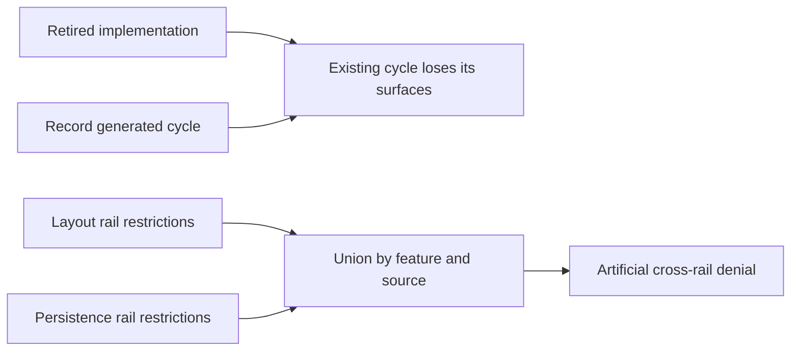
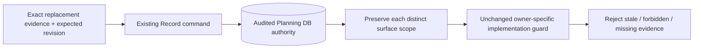
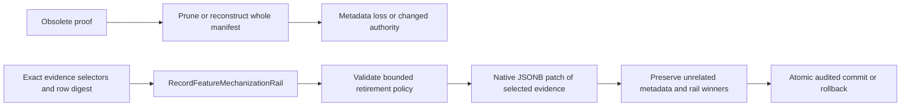
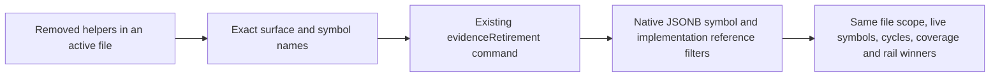
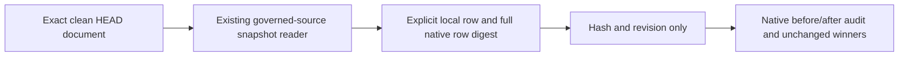

# Feature mechanization read model

Architecture Governance owns the verified `RecordFeatureMechanizationRail` and
`ValidateFeatureMechanizationImplementation` commands plus the existing
feature-mechanization list queries. Markdown manifests are imported evidence;
DB-authored current decisions remain authoritative.

DDL and read views live only in `tools/planning-db/schema.sql`. Current
DB-authored decisions live only in Planning DB and are read through governed
queries.

## Candidate evidence

Implementation validation requires an available Git comparison, not merely an
empty list of changed paths. A missing base, missing head, unavailable merge
base, or failed Git command rejects validation. A verified empty diff remains
valid. Pre-merge validation supplies explicit base and head commit identities;
local pre-push additionally includes staged, unstaged, and untracked files.
Neither mode may interpret a Git failure as successful empty evidence.

## Reconcile existing evidence without widening authority

The #3298 review found two independent integrity defects. Retiring an implementation
can leave an existing red/green cycle without patch surfaces, but the record command
can only append its generated cycle ID. Separately, the manifest reader unions the
allowed and forbidden surfaces of different local rails sharing a feature and source.
That transfers a layout-only restriction into a separately authorized persistence rail.

```mermaid
flowchart LR
  Retired[Retired implementation] --> Empty[Existing cycle loses its surfaces]
  Append[Record generated cycle] --> Empty
  Layout[Layout rail restrictions] --> Union[Union by feature and source]
  Persist[Persistence rail restrictions] --> Union
  Union --> Conflict[Artificial cross-rail denial]
```

Reuse `RecordFeatureMechanizationRail`, owned by `FeatureMechanizationLocalRail`,
through the existing `planning:db:operate feature-mechanization record` adapter.
An optional `--red-green-cycle <existing-id>` reconciles exactly one existing cycle.
It requires `--expected-revision`, explicit nonempty `--patch-surface` evidence,
the existing actor/source hash/idempotency contract, and a matching cycle in the
selected rail. Its replacement keeps the identity and all unrelated cycles. Unknown
IDs, missing/stale revisions, and patch surfaces outside the allowed scope or inside
the forbidden scope fail before any write. The operation remains audited; it is not
a bulk reset, cycle deletion, new command, import, or direct SQL repair.

`ValidateFeatureMechanizationImplementation` retains its existing most-specific
owner rule and all negative checks. Governing sources, tests and other feature
evidence still aggregate by source and feature. Surface ownership is projected
separately: allowed **and** forbidden sets must both match before scopes coalesce
(ignoring list order and duplicates). Each distinct scope receives the shared
feature evidence without inheriting another scope's permissions. Distinct scopes remain distinct entries;
equally specific conflicting owners still deny the write. No restriction is deleted
or promoted into a global allow list, and empty cycles remain invalid.

```mermaid
flowchart LR
  Evidence[Exact replacement evidence + expected revision] --> Record[Existing Record command]
  Record --> DB[(Audited Planning DB authority)]
  DB --> Scopes[Preserve each distinct surface scope]
  Scopes --> Guard[Unchanged owner-specific implementation guard]
  Guard --> Reject[Reject stale / forbidden / missing evidence]
```

| Scenario                                 | Opportunity / pattern                        | DDD owner / rail                                                                    | Implementation surfaces                                                                           | Unit / architecture / operator proof                                                                                                          | Out of scope                                              |
| ---------------------------------------- | -------------------------------------------- | ----------------------------------------------------------------------------------- | ------------------------------------------------------------------------------------------------- | --------------------------------------------------------------------------------------------------------------------------------------------- | --------------------------------------------------------- |
| Repair a retained cycle after retirement | Boundary drift / identity-preserving command | FeatureMechanizationLocalRail / RecordFeatureMechanizationRail                      | scripts/planning-db-operate.cjs; scripts/planning-db-operate-tests/feature-mechanization.test.cjs | Parser, planner, stale revision, unknown cycle, scope denial, unrelated-cycle preservation and audited payload tests; real CLI reconciliation | Bulk retirement, new rails, schema changes                |
| Preserve distinct rail restrictions      | Hidden authority / scoped read model         | Repository feature mechanization guard / ValidateFeatureMechanizationImplementation | scripts/check-feature-mechanization.cjs; scripts/check-feature-mechanization.test.cjs             | Cross-rail isolation, identical-scope aggregation, equal-specificity denial, malformed-manifest rejection; real exact-base/head gate          | Broader permissions, imports, changes to guard precedence |

The operator repairs the historical declarations with current source and test
references through the command, then runs the unchanged implementation gate. A green
governance gate does not establish Canvas product acceptance or live-provider proof.

## Retire exact evidence without replacing authority

Retiring an obsolete proof is not a replacement of the retained feature. Recursive
forbidden-surface pruning can erase retained symbols' coverage metadata; rebuilding
their manifests through one rail can overwrite heterogeneous ownership. Promoting
an imported record to a local record also changes its identity and precedence.

```mermaid
flowchart LR
  Old[Obsolete proof] --> Rebuild[Prune or reconstruct whole manifest]
  Rebuild --> Loss[Metadata loss or changed authority]
  Select[Exact evidence selectors and row digest] --> Record[RecordFeatureMechanizationRail]
  Record --> Policy[Validate bounded retirement policy]
  Policy --> Patch[Native JSONB patch of selected evidence]
  Patch --> Guard[Preserve unrelated metadata and rail winners]
  Guard --> Audit[Atomic audited commit or rollback]
```

The existing `record --catalog-reconciliation <json-file>` command admits an
`evidenceRetirement` change, owned by `FeatureMechanizationLocalRail`. It reuses
the operational-integrity contract's exact physical row identity, native SQL
snapshot digest, reviewed design scopes, locks, idempotency, winner checks and
before/after audit. It neither promotes imported rows nor introduces another
writer, import, generic JSON Patch API or application-data mutation.

The typed request names one exact repository-relative `surface`, its
`historicalRef` (the same file in this repository at a full ancestor commit),
explicit `cycles` and `gates` to retire, and `flows` and `completionGates` that
remain current obligations. Historical provenance must resolve to a regular Git
blob; it is not attributed to replacement smoke coverage. This change cannot be
combined with source/reference patches on the same row.

The policy removes only symbols owned by the retired file, its exact implementation
references and allowed surface, and the explicitly selected cycles and gates.
Retained symbols stay intact except that an exact `cypressCoverage` match becomes
`Historical coverage: <historicalRef>`. Exact live-flow references are removed;
declared replacement flows/gates are appended only if absent. Existing ordering,
duplicates outside selected identities, JSONB numeric precision, ownership,
restrictions and unrelated cycles remain unchanged. No existing metadata is
serialized through JavaScript for storage or audit.

Missing or ambiguous selectors, broad paths, unresolvable history, stale row
digests, unhandled remaining references or an empty required live obligation
reject before commit. Active symbols, cycles, allowed surfaces and live flows
must remain; `pnpm verify:prepush` stays required. An absent optional manifest
property remains absent unless its explicit replacement adds content.

All affected physical rows must be enumerated, including imported rows shadowed
by local authority. The command never discovers and mutates extra targets.
Retiring a test does not retire its historical acceptance evidence or prove its
replacement: the replacement browser vertical must pass on its own candidate.

The evidence policy and its tests route through the existing operate suite.
Validation includes exact removals and retained metadata, invalid selectors,
native JSONB precision, atomic failure/replay, and a real PostgreSQL transaction
whose rollback is checked before the authorized batch is applied. GitHub remains
the task journal; historical runs are not relabeled as current proof.

### Retire exact symbols while their file remains active

`evidenceRetirement` may include an optional `symbols` array of exact names in
its selected `surface`. Omitting it retains the whole-file retirement contract.
Providing it requires a nonempty unique list, with each selected symbol present
exactly once in the manifest, and empty `cycles`, `gates`, `flows` and
`completionGates` selectors. This narrows the existing command; it is not a new
operation or permission to replace an imported declaration.

```mermaid
flowchart LR
  Old[Removed helpers in an active file] --> Select[Exact surface and symbol names]
  Select --> Record[Existing evidenceRetirement command]
  Record --> Patch[Native JSONB symbol and implementation reference filters]
  Patch --> Keep[Same file scope, live symbols, cycles, coverage and rail winners]
```

Whole-file retirement was rejected for this case: it would remove unrelated
live bindings, and a declaration containing only that file would become empty.
Instead, remove only the selected `path` and `name` identities from
`raw_manifest.symbols`, `symbol_refs` and `implementation_refs`. Preserve all
other manifest keys, permitted surfaces, cycles, gates, coverage, ordering,
unselected duplicates and JSONB number precision. Unhandled selected references
outside those three slots reject; references to the still-active file or its
other symbols remain valid. Historical file proof, no-empty checks, native CAS,
audit, rollback, idempotency and both winner guards remain unchanged.

The bounded implementation uses the existing evidence retirement policy and its
existing test file. Tests cover retained same-file symbols, empty/duplicate/
missing/ambiguous selectors, mixed selectors, unhandled exact references and
no-empty rejection. PostgreSQL proof must verify exact native preservation,
rollback and replay before applying the three explicitly selected historical
rows for #3540. No whole rail is retired and no binding is transferred.

### Refresh the content identity of an existing local declaration

The same catalog command accepts an exclusive `sourceContent: { path, commit }`
change for a local row. This is not a declaration replay or an import. The
ordinary record operation merges symbols and cycles, so replaying it merely to
refresh a document hash can alter unrelated authority. The current-content
override updates the governed file read model, not local declaration rows.

```mermaid
flowchart LR
  Head[Exact clean HEAD document] --> Proof[Existing governed-source snapshot reader]
  Proof --> CAS[Explicit local row and full native row digest]
  CAS --> Update[Hash and revision only]
  Update --> Audit[Native before/after audit and unchanged winners]
```

`path` must equal the stored source path and `commit` must be the full current
HEAD commit. Reuse the existing governed-source snapshot reader to require a
clean, tracked regular file and derive its canonical content hash and blob.
Reject imported rows, other patch modes, stale revisions or row digests, dirty
files, different paths, symbolic links and a changed HEAD. The update must keep
the source path, timestamps, raw manifests, symbols, arrays, ownership and both
effective and canonical winner maps unchanged. Only `source_content_sha256`
and the local revision may change; the existing native SQL audit and idempotent
batch receipt remain mandatory. A caller selects every row explicitly.

Tests must reject each boundary violation and prove through PostgreSQL rollback
that the native metadata and winner maps are identical before applying a batch.
This preserves the distinction between current Git content and semantic
authority; it neither reconstructs authority from Git nor weakens freshness.

## Single-team validation boundary

The approved single-team posture in
[#2957](https://github.com/dunay2/dvt/issues/2957#issuecomment-5777984750) keeps
Planning DB local and authoritative. Before merge, the operator runs
`pnpm docs:feature-mechanization:implementation` against that existing DB with
explicit `GIT_BASE` and `GIT_HEAD` commit SHAs and a clean worktree. The PR must
record those SHAs, command and result. A changed candidate or comparison base
requires revalidation. An unavailable DB or invalid Git evidence blocks local
acceptance; a cached pre-push stamp alone is not fresh DB evidence.

CI validates repository manifests, tests, lint, types and its other governed
checks. It does not invoke DB-authoritative implementation validation or claim
that imported repository evidence restores DB-authored decisions. Disposable
DB preparation remains only for other checks that require repository-derived
DB projections. No snapshot, tunnel, runner or authority transport is introduced.

GitHub does not independently enforce the local architecture check. This is an
explicitly accepted delivery limitation, not equivalent remote assurance. Review
this boundary before independent teams or unattended merging are introduced.

Validation is `pnpm docs:feature-mechanization:implementation`,
`node --test scripts/planning-db-import.test.cjs scripts/planning-db-query.test.cjs scripts/planning-db-operate.test.cjs`,
and `pnpm verify:prepush`.
