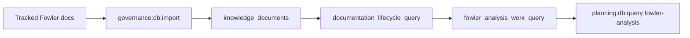

# Fowler Analysis DB-First Work Queue Plan

## Current State

Fowler analysis documents are already imported into the Planning DB as knowledge
documents, but operators still need file-system inspection to answer these
questions:

- which Fowler analyses still contain improvement work;
- which intake files are blocked by repository references;
- which intake files are canonized and can be retired from the repo;
- which active docs already carry the canonical Fowler governance rule.

## Target State

The Planning DB exposes a logical work queue over imported knowledge documents.
The queue is queryable without parsing Markdown at operation time and is the
source used before removing Fowler intake files.



## Fowler / DDD Classification

<!-- markdownlint-disable MD060 -->

| scenario                                    | opportunity              | Fowler pattern                  | DDD owner                        | command/query rail           | validation                                         |
| ------------------------------------------- | ------------------------ | ------------------------------- | -------------------------------- | ---------------------------- | -------------------------------------------------- |
| Fowler files duplicate repo planning truth. | Hidden authority         | Repository / Query Service      | FowlerAnalysisWorkQueueReadModel | QueryFowlerAnalysisWorkQueue | `node --test scripts/planning-db-query.test.cjs`   |
| Intake files are removed without backrefs.  | Incomplete encapsulation | Policy Object / Retire Obsolete | FowlerAnalysisRetirementPolicy   | QueryFowlerAnalysisWorkQueue | `node --test scripts/planning-db-migrate.test.cjs` |

<!-- markdownlint-enable MD060 -->

```feature-mechanization
version: 1
featureId: GD-FOWLER-ANALYSIS-DB-FIRST-WORK-QUEUE-20260610
mechanizationStatus: implemented
noHumanDecisionsRemaining: true
implementationPlan: docs/planning/proposals/mandatory/governance-and-docs/fowler-analysis-db-first-work-queue-plan-20260610.md
governingSources:
  - AGENTS.md
  - docs/planning/status/governance-document-rule-inventory.md
  - docs/architecture/command-query-rail-governance.md
  - docs/architecture/fowler-opportunity-planning-governance.md
  - docs/guides/ai-work-protocol.md
allowedImplementationSurfaces:
  - docs/planning/proposals/mandatory/governance-and-docs/fowler-analysis-db-first-work-queue-plan-20260610.md
  - scripts/planning-db-query.cjs
  - scripts/planning-db-query.test.cjs
  - scripts/planning-db-migrate.test.cjs
  - scripts/planning-db/queries/fowler-analysis-query.cjs
  - tools/planning-db/migrations/073_fowler_analysis_work_query.sql
forbiddenImplementationSurfaces:
  - apps/**
  - packages/**
  - specs/contracts/**
userStories:
  - docs/architecture/components/ci-governance/component-engineering-record-user-stories.md
componentGuides:
  - docs/architecture/command-query-rail-governance.md
commandQueryRails:
  - name: QueryFowlerAnalysisWorkQueue
    type: query
    dddOwner: FowlerAnalysisWorkQueueReadModel
domainObjects:
  - FowlerAnalysisWorkQueueReadModel
  - FowlerAnalysisRetirementPolicy
fowlerSignals:
  - Hidden authority
  - Incomplete encapsulation
redGreenCycles:
  - id: fowler-analysis-work-query
    redTest: node --test scripts/planning-db-query.test.cjs scripts/planning-db-migrate.test.cjs
    expectedFailure: fowler-analysis query and migration are not yet wired.
    patchSurfaces:
      - scripts/planning-db-query.cjs
      - scripts/planning-db/queries/fowler-analysis-query.cjs
      - tools/planning-db/migrations/073_fowler_analysis_work_query.sql
    greenTest: node --test scripts/planning-db-query.test.cjs scripts/planning-db-migrate.test.cjs
architectureGuards:
  - pnpm docs:feature-mechanization:implementation
cypressFlows:
  - N/A - planning DB operator query
completionGate:
  - node --test scripts/planning-db-query.test.cjs scripts/planning-db-migrate.test.cjs
  - pnpm governance:db:import
  - pnpm docs:feature-mechanization:implementation
  - pnpm verify:changed
  - pnpm verify:prepush
symbols:
  - name: createFowlerAnalysisReadModelComponent
    path: scripts/planning-db/queries/fowler-analysis-query.cjs
    dddOwner: FowlerAnalysisWorkQueueReadModel
    cqRails: [QueryFowlerAnalysisWorkQueue]
    fowlerSignals: [Hidden authority, Incomplete encapsulation]
    architectureGuard: pnpm docs:feature-mechanization:implementation
    cypressCoverage: N/A - planning DB operator query
    unitTests:
      - node --test scripts/planning-db-query.test.cjs
  - name: readFowlerAnalysisRows
    path: scripts/planning-db/queries/fowler-analysis-query.cjs
    dddOwner: FowlerAnalysisWorkQueueReadModel
    cqRails: [QueryFowlerAnalysisWorkQueue]
    fowlerSignals: [Hidden authority]
    architectureGuard: pnpm docs:feature-mechanization:implementation
    cypressCoverage: N/A - planning DB operator query
    unitTests:
      - node --test scripts/planning-db-query.test.cjs
```
