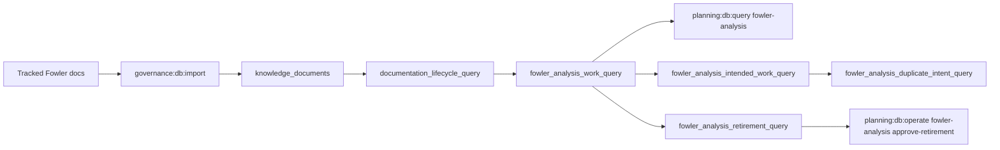

# Fowler Analysis DB-First Work Queue Plan

## Current State

Fowler analysis documents are already imported into the Planning DB as knowledge
documents, but operators still need file-system inspection to answer these
questions:

- which Fowler analyses still contain improvement work;
- which intake files are blocked by repository references;
- which intake files are canonized and can be retired from the repo;
- which active docs already carry the canonical Fowler governance rule.
- which intended work appears repeatedly across Fowler analyses.

## Target State

The Planning DB exposes a logical work queue over imported knowledge documents.
The queue is queryable without parsing Markdown at operation time and is the
source used before removing Fowler intake files.



## Fowler / DDD Classification

<!-- markdownlint-disable MD060 -->

| scenario                                       | opportunity              | Fowler pattern                     | DDD owner                         | command/query rail                      | validation                                         |
| ---------------------------------------------- | ------------------------ | ---------------------------------- | --------------------------------- | --------------------------------------- | -------------------------------------------------- |
| Fowler files duplicate repo planning truth.    | Hidden authority         | Repository / Query Service         | FowlerAnalysisWorkQueueReadModel  | QueryFowlerAnalysisWorkQueue            | `node --test scripts/planning-db-query.test.cjs`   |
| Intake files are removed without backrefs.     | Incomplete encapsulation | Policy Object / Retire Obsolete    | FowlerAnalysisRetirementPolicy    | QueryFowlerAnalysisRetirementCandidates | `node --test scripts/planning-db-migrate.test.cjs` |
| Reference decisions are made from grep output. | Hidden authority         | Repository / Query Service         | FowlerAnalysisReferenceReadModel  | QueryFowlerAnalysisReferences           | `node --test scripts/planning-db-query.test.cjs`   |
| Canonical targets are chosen outside the rail. | Divergent change         | Published Language                 | FowlerAnalysisCanonicalTargetLink | LinkFowlerAnalysisCanonicalTarget       | `node --test scripts/planning-db-operate.test.cjs` |
| Retirement approvals are not auditable.        | Shotgun surgery          | Retire Obsolete / Policy Object    | FowlerAnalysisRetirementDecision  | ApproveFowlerAnalysisRetirement         | `node --test scripts/planning-db-operate.test.cjs` |
| Coverage gaps are hidden in prose.             | Primitive obsession      | Query Service                      | FowlerAnalysisCoverageReadModel   | QueryFowlerAnalysisCanonicalCoverage    | `node --test scripts/planning-db-query.test.cjs`   |
| Intended work repeats across Fowler documents. | Duplicate semantics      | Query Service / Published Language | FowlerAnalysisWorkQueueReadModel  | QueryFowlerAnalysisWorkQueue            | `node --test scripts/planning-db-query.test.cjs`   |

<!-- markdownlint-enable MD060 -->

```feature-mechanization
version: 1
featureId: GD-FOWLER-ANALYSIS-DB-FIRST-WORK-QUEUE-20260610
mechanizationStatus: implemented
noHumanDecisionsRemaining: true
implementationPlan: docs/planning/proposals/mandatory/governance-and-docs/fowler-analysis-db-first-work-queue-plan-20260610.md
governingSources:
  - AGENTS.md
  - docs/planning/status/governance-document-rule-inventory.md
  - docs/architecture/command-query-rail-governance.md
  - docs/architecture/fowler-opportunity-planning-governance.md
  - docs/guides/ai-work-protocol.md
allowedImplementationSurfaces:
  - buzon/20260421-codex-fowler-branch-analysis-http-error-translation-stack.md
  - buzon/20260421-codex-fowler-http-runtime-error-translation-analysis.md
  - buzon/20260421-codex-fowler-http-entrypoint-component-analysis-and-remediation.md
  - buzon/20260422-codex-fowler-apps-api-runtime-composition-analysis-and-remediation.md
  - buzon/20260422-codex-fowler-start-run-boundary-and-admission-analysis.md
  - buzon/20260422-codex-fowler-start-run-application-component-analysis-and-remediation.md
  - buzon/20260513-codex-fowler-runtime-root-subdivision-analysis-and-remediation.md
  - buzon/20260514-codex-fowler-dhm-db-first-engine-component-analysis.md
  - buzon/20260514-codex-fowler-dhm-effective-component-ownership-analysis.md
  - buzon/20260518-dhm-ws2-fowler-runtime-composition-hardening-analysis.md
  - buzon/20260531-db-first-architecture-generated-docs-fowler-analysis.md
  - docs/evidence/ED-20260421-api-plan-route-response-and-adapter-build-baseline.md
  - docs/planning/proposals/mandatory/governance-and-docs/fowler-analysis-db-first-work-queue-plan-20260610.md
  - docs/planning/closeouts/20260421-api-http-error-translation-response-writer-unification-closeout.md
  - docs/planning/closeouts/20260421-api-http-entrypoint-response-componentization-closeout.md
  - docs/planning/reviews/architecture-and-governance/20260605-buzon-fowler-db-activation-review.md
  - docs/planning/reviews/architecture-and-governance/20260525-buzon-fowler-canonization-inventory.md
  - scripts/planning-db-query.cjs
  - scripts/planning-db-query.test.cjs
  - scripts/planning-db-operate.cjs
  - scripts/planning-db-operate.test.cjs
  - scripts/planning-db-operate-tests/fowler-analysis.test.cjs
  - scripts/planning-db-migrate.test.cjs
  - scripts/planning-db/queries/fowler-analysis-query.cjs
  - tools/planning-db/migrations/073_fowler_analysis_work_query.sql
  - tools/planning-db/migrations/074_fowler_analysis_retirement_rails.sql
  - tools/planning-db/migrations/075_fowler_analysis_intent_duplicates.sql
  - tools/planning-db/migrations/076_fowler_analysis_intent_duplicate_state_hardening.sql
forbiddenImplementationSurfaces:
  - apps/**
  - packages/**
  - specs/contracts/**
userStories:
  - docs/architecture/components/ci-governance/component-engineering-record-user-stories.md
componentGuides:
  - docs/architecture/command-query-rail-governance.md
commandQueryRails:
  - name: QueryFowlerAnalysisWorkQueue
    type: query
    dddOwner: FowlerAnalysisWorkQueueReadModel
  - name: QueryFowlerAnalysisReferences
    type: query
    dddOwner: FowlerAnalysisReferenceReadModel
  - name: QueryFowlerAnalysisRetirementCandidates
    type: query
    dddOwner: FowlerAnalysisRetirementPolicy
  - name: QueryFowlerAnalysisCanonicalCoverage
    type: query
    dddOwner: FowlerAnalysisCoverageReadModel
  - name: RecordFowlerAnalysisDisposition
    type: command
    dddOwner: FowlerAnalysisDisposition
  - name: LinkFowlerAnalysisCanonicalTarget
    type: command
    dddOwner: FowlerAnalysisCanonicalTargetLink
  - name: ResolveFowlerAnalysisReference
    type: command
    dddOwner: FowlerAnalysisReferenceResolution
  - name: ApproveFowlerAnalysisRetirement
    type: command
    dddOwner: FowlerAnalysisRetirementDecision
domainObjects:
  - FowlerAnalysisWorkQueueReadModel
  - FowlerAnalysisRetirementPolicy
  - FowlerAnalysisDocument
  - FowlerAnalysisReference
  - FowlerAnalysisCanonicalTarget
  - FowlerAnalysisDisposition
  - FowlerAnalysisImprovement
  - FowlerAnalysisRetirementDecision
  - FowlerAnalysisIntendedWork
  - FowlerAnalysisDuplicateIntent
fowlerSignals:
  - Hidden authority
  - Incomplete encapsulation
  - Duplicate semantics
redGreenCycles:
  - id: fowler-analysis-work-query
    redTest: node --test scripts/planning-db-query.test.cjs scripts/planning-db-migrate.test.cjs
    expectedFailure: fowler-analysis query and migration are not yet wired.
    patchSurfaces:
      - scripts/planning-db-query.cjs
      - scripts/planning-db/queries/fowler-analysis-query.cjs
      - tools/planning-db/migrations/073_fowler_analysis_work_query.sql
    greenTest: node --test scripts/planning-db-query.test.cjs scripts/planning-db-migrate.test.cjs
  - id: fowler-analysis-retirement-rails
    redTest: node --test scripts/planning-db-operate.test.cjs scripts/planning-db-query.test.cjs scripts/planning-db-migrate.test.cjs
    expectedFailure: fowler-analysis command/query rails are missing retirement decisions, references, coverage, and DB-operated disposition commands.
    patchSurfaces:
      - scripts/planning-db-operate.cjs
      - scripts/planning-db-operate-tests/fowler-analysis.test.cjs
      - scripts/planning-db-query.cjs
      - scripts/planning-db/queries/fowler-analysis-query.cjs
      - tools/planning-db/migrations/074_fowler_analysis_retirement_rails.sql
    greenTest: node --test scripts/planning-db-operate.test.cjs scripts/planning-db-query.test.cjs scripts/planning-db-migrate.test.cjs
  - id: fowler-analysis-intent-duplicates
    redTest: node --test scripts/planning-db-query.test.cjs scripts/planning-db-migrate.test.cjs
    expectedFailure: Fowler intended-work and duplicate-intent DB projections are missing from the work queue rail.
    patchSurfaces:
      - scripts/planning-db-query.cjs
      - scripts/planning-db/queries/fowler-analysis-query.cjs
      - tools/planning-db/migrations/075_fowler_analysis_intent_duplicates.sql
      - tools/planning-db/migrations/076_fowler_analysis_intent_duplicate_state_hardening.sql
    greenTest: node --test scripts/planning-db-query.test.cjs scripts/planning-db-migrate.test.cjs
architectureGuards:
  - pnpm docs:feature-mechanization:implementation
cypressFlows:
  - N/A - planning DB operator query
completionGate:
  - node --test scripts/planning-db-operate.test.cjs
  - node --test scripts/planning-db-query.test.cjs scripts/planning-db-migrate.test.cjs
  - pnpm governance:db:import
  - pnpm planning:db:query fowler-analysis-intent --limit 20
  - pnpm planning:db:query fowler-analysis-duplicates --limit 20
  - pnpm docs:feature-mechanization:implementation
  - pnpm verify:changed
  - pnpm verify:prepush
symbols:
  - name: createFowlerAnalysisReadModelComponent
    path: scripts/planning-db/queries/fowler-analysis-query.cjs
    dddOwner: FowlerAnalysisWorkQueueReadModel
    cqRails: [QueryFowlerAnalysisWorkQueue]
    fowlerSignals: [Hidden authority, Incomplete encapsulation]
    architectureGuard: pnpm docs:feature-mechanization:implementation
    cypressCoverage: N/A - planning DB operator query
    unitTests:
      - node --test scripts/planning-db-query.test.cjs
  - name: readFowlerAnalysisRows
    path: scripts/planning-db/queries/fowler-analysis-query.cjs
    dddOwner: FowlerAnalysisWorkQueueReadModel
    cqRails: [QueryFowlerAnalysisWorkQueue]
    fowlerSignals: [Hidden authority]
    architectureGuard: pnpm docs:feature-mechanization:implementation
    cypressCoverage: N/A - planning DB operator query
    unitTests:
      - node --test scripts/planning-db-query.test.cjs
  - name: readFowlerAnalysisReferenceRows
    path: scripts/planning-db/queries/fowler-analysis-query.cjs
    dddOwner: FowlerAnalysisReferenceReadModel
    cqRails: [QueryFowlerAnalysisReferences]
    fowlerSignals: [Hidden authority]
    architectureGuard: pnpm docs:feature-mechanization:implementation
    cypressCoverage: N/A - planning DB operator query
    unitTests:
      - node --test scripts/planning-db-query.test.cjs
  - name: readFowlerAnalysisRetirementRows
    path: scripts/planning-db/queries/fowler-analysis-query.cjs
    dddOwner: FowlerAnalysisRetirementPolicy
    cqRails: [QueryFowlerAnalysisRetirementCandidates]
    fowlerSignals: [Incomplete encapsulation]
    architectureGuard: pnpm docs:feature-mechanization:implementation
    cypressCoverage: N/A - planning DB operator query
    unitTests:
      - node --test scripts/planning-db-query.test.cjs
  - name: readFowlerAnalysisCanonicalCoverageRows
    path: scripts/planning-db/queries/fowler-analysis-query.cjs
    dddOwner: FowlerAnalysisCoverageReadModel
    cqRails: [QueryFowlerAnalysisCanonicalCoverage]
    fowlerSignals: [Hidden authority]
    architectureGuard: pnpm docs:feature-mechanization:implementation
    cypressCoverage: N/A - planning DB operator query
    unitTests:
      - node --test scripts/planning-db-query.test.cjs
  - name: readFowlerAnalysisIntentRows
    path: scripts/planning-db/queries/fowler-analysis-query.cjs
    dddOwner: FowlerAnalysisWorkQueueReadModel
    cqRails: [QueryFowlerAnalysisWorkQueue]
    fowlerSignals: [Duplicate semantics, Hidden authority]
    architectureGuard: pnpm docs:feature-mechanization:implementation
    cypressCoverage: N/A - planning DB operator query
    unitTests:
      - node --test scripts/planning-db-query.test.cjs
  - name: readFowlerAnalysisDuplicateRows
    path: scripts/planning-db/queries/fowler-analysis-query.cjs
    dddOwner: FowlerAnalysisWorkQueueReadModel
    cqRails: [QueryFowlerAnalysisWorkQueue]
    fowlerSignals: [Duplicate semantics, Hidden authority]
    architectureGuard: pnpm docs:feature-mechanization:implementation
    cypressCoverage: N/A - planning DB operator query
    unitTests:
      - node --test scripts/planning-db-query.test.cjs
  - name: parseFowlerAnalysisCommand
    path: scripts/planning-db-operate.cjs
    dddOwner: FowlerAnalysisDisposition
    cqRails:
      - RecordFowlerAnalysisDisposition
      - LinkFowlerAnalysisCanonicalTarget
      - ResolveFowlerAnalysisReference
      - ApproveFowlerAnalysisRetirement
    fowlerSignals: [Hidden authority, Shotgun surgery]
    architectureGuard: pnpm docs:feature-mechanization:implementation
    cypressCoverage: N/A - planning DB operator command
    unitTests:
      - node --test scripts/planning-db-operate.test.cjs
  - name: planFowlerAnalysisOperation
    path: scripts/planning-db-operate.cjs
    dddOwner: FowlerAnalysisRetirementDecision
    cqRails:
      - RecordFowlerAnalysisDisposition
      - LinkFowlerAnalysisCanonicalTarget
      - ResolveFowlerAnalysisReference
      - ApproveFowlerAnalysisRetirement
    fowlerSignals: [Hidden authority, Incomplete encapsulation]
    architectureGuard: pnpm docs:feature-mechanization:implementation
    cypressCoverage: N/A - planning DB operator command
    unitTests:
      - node --test scripts/planning-db-operate.test.cjs
  - name: writePlannedFowlerAnalysisOperation
    path: scripts/planning-db-operate.cjs
    dddOwner: FowlerAnalysisRetirementDecision
    cqRails:
      - RecordFowlerAnalysisDisposition
      - LinkFowlerAnalysisCanonicalTarget
      - ResolveFowlerAnalysisReference
      - ApproveFowlerAnalysisRetirement
    fowlerSignals: [Hidden authority]
    architectureGuard: pnpm docs:feature-mechanization:implementation
    cypressCoverage: N/A - planning DB operator command
    unitTests:
      - node --test scripts/planning-db-operate.test.cjs
  - name: applyFowlerAnalysisOperation
    path: scripts/planning-db-operate.cjs
    dddOwner: FowlerAnalysisRetirementDecision
    cqRails:
      - RecordFowlerAnalysisDisposition
      - LinkFowlerAnalysisCanonicalTarget
      - ResolveFowlerAnalysisReference
      - ApproveFowlerAnalysisRetirement
    fowlerSignals: [Hidden authority]
    architectureGuard: pnpm docs:feature-mechanization:implementation
    cypressCoverage: N/A - planning DB operator command
    unitTests:
      - node --test scripts/planning-db-operate.test.cjs
  - name: assertFowlerAnalysisIdempotentReplayMatches
    path: scripts/planning-db-operate.cjs
    dddOwner: FowlerAnalysisRetirementDecision
    cqRails:
      - RecordFowlerAnalysisDisposition
      - LinkFowlerAnalysisCanonicalTarget
      - ResolveFowlerAnalysisReference
      - ApproveFowlerAnalysisRetirement
    fowlerSignals: [Hidden authority]
    architectureGuard: pnpm docs:feature-mechanization:implementation
    cypressCoverage: N/A - planning DB operator command
    unitTests:
      - node --test scripts/planning-db-operate.test.cjs
  - name: readExistingFowlerAnalysisOperation
    path: scripts/planning-db-operate.cjs
    dddOwner: FowlerAnalysisRetirementDecision
    cqRails:
      - RecordFowlerAnalysisDisposition
      - LinkFowlerAnalysisCanonicalTarget
      - ResolveFowlerAnalysisReference
      - ApproveFowlerAnalysisRetirement
    fowlerSignals: [Hidden authority]
    architectureGuard: pnpm docs:feature-mechanization:implementation
    cypressCoverage: N/A - planning DB operator command
    unitTests:
      - node --test scripts/planning-db-operate.test.cjs
  - name: fowlerAnalysisAudit
    path: scripts/planning-db-operate.cjs
    dddOwner: FowlerAnalysisRetirementDecision
    cqRails:
      - RecordFowlerAnalysisDisposition
      - LinkFowlerAnalysisCanonicalTarget
      - ResolveFowlerAnalysisReference
      - ApproveFowlerAnalysisRetirement
    fowlerSignals: [Hidden authority]
    architectureGuard: pnpm docs:feature-mechanization:implementation
    cypressCoverage: N/A - planning DB operator command
    unitTests:
      - node --test scripts/planning-db-operate.test.cjs
  - name: allowedFowlerAnalysisDispositionStatuses
    path: scripts/planning-db-operate.cjs
    dddOwner: FowlerAnalysisDisposition
    cqRails: [RecordFowlerAnalysisDisposition]
    fowlerSignals: [Published Language]
    architectureGuard: pnpm docs:feature-mechanization:implementation
    cypressCoverage: N/A - planning DB operator command
    unitTests:
      - node --test scripts/planning-db-operate.test.cjs
  - name: allowedFowlerAnalysisCanonicalTargetStatuses
    path: scripts/planning-db-operate.cjs
    dddOwner: FowlerAnalysisCanonicalTargetLink
    cqRails: [LinkFowlerAnalysisCanonicalTarget]
    fowlerSignals: [Published Language]
    architectureGuard: pnpm docs:feature-mechanization:implementation
    cypressCoverage: N/A - planning DB operator command
    unitTests:
      - node --test scripts/planning-db-operate.test.cjs
  - name: allowedFowlerAnalysisReferenceResolutionStatuses
    path: scripts/planning-db-operate.cjs
    dddOwner: FowlerAnalysisReferenceResolution
    cqRails: [ResolveFowlerAnalysisReference]
    fowlerSignals: [Published Language]
    architectureGuard: pnpm docs:feature-mechanization:implementation
    cypressCoverage: N/A - planning DB operator command
    unitTests:
      - node --test scripts/planning-db-operate.test.cjs
  - name: allowedFowlerAnalysisRetirementDecisionStatuses
    path: scripts/planning-db-operate.cjs
    dddOwner: FowlerAnalysisRetirementDecision
    cqRails: [ApproveFowlerAnalysisRetirement]
    fowlerSignals: [Published Language]
    architectureGuard: pnpm docs:feature-mechanization:implementation
    cypressCoverage: N/A - planning DB operator command
    unitTests:
      - node --test scripts/planning-db-operate.test.cjs
  - name: validateFowlerAnalysisDispositionStatus
    path: scripts/planning-db-operate.cjs
    dddOwner: FowlerAnalysisDisposition
    cqRails: [RecordFowlerAnalysisDisposition]
    fowlerSignals: [Published Language]
    architectureGuard: pnpm docs:feature-mechanization:implementation
    cypressCoverage: N/A - planning DB operator command
    unitTests:
      - node --test scripts/planning-db-operate.test.cjs
  - name: validateFowlerAnalysisCanonicalTargetStatus
    path: scripts/planning-db-operate.cjs
    dddOwner: FowlerAnalysisCanonicalTargetLink
    cqRails: [LinkFowlerAnalysisCanonicalTarget]
    fowlerSignals: [Published Language]
    architectureGuard: pnpm docs:feature-mechanization:implementation
    cypressCoverage: N/A - planning DB operator command
    unitTests:
      - node --test scripts/planning-db-operate.test.cjs
  - name: validateFowlerAnalysisReferenceResolutionStatus
    path: scripts/planning-db-operate.cjs
    dddOwner: FowlerAnalysisReferenceResolution
    cqRails: [ResolveFowlerAnalysisReference]
    fowlerSignals: [Published Language]
    architectureGuard: pnpm docs:feature-mechanization:implementation
    cypressCoverage: N/A - planning DB operator command
    unitTests:
      - node --test scripts/planning-db-operate.test.cjs
  - name: validateFowlerAnalysisRetirementDecisionStatus
    path: scripts/planning-db-operate.cjs
    dddOwner: FowlerAnalysisRetirementDecision
    cqRails: [ApproveFowlerAnalysisRetirement]
    fowlerSignals: [Published Language]
    architectureGuard: pnpm docs:feature-mechanization:implementation
    cypressCoverage: N/A - planning DB operator command
    unitTests:
      - node --test scripts/planning-db-operate.test.cjs
```
