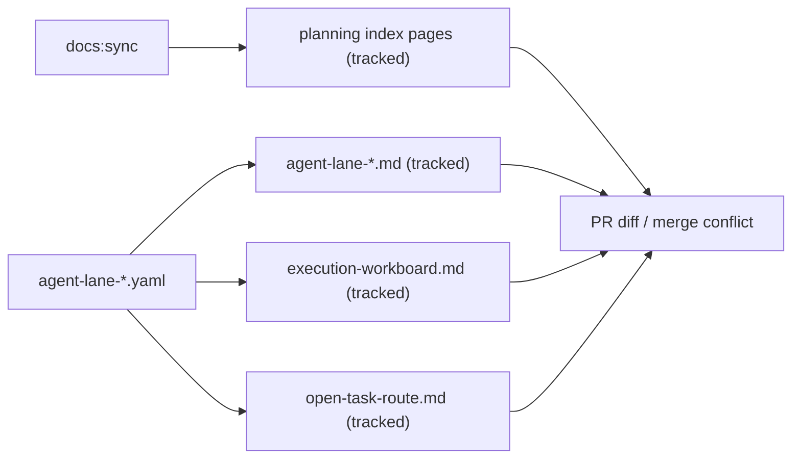
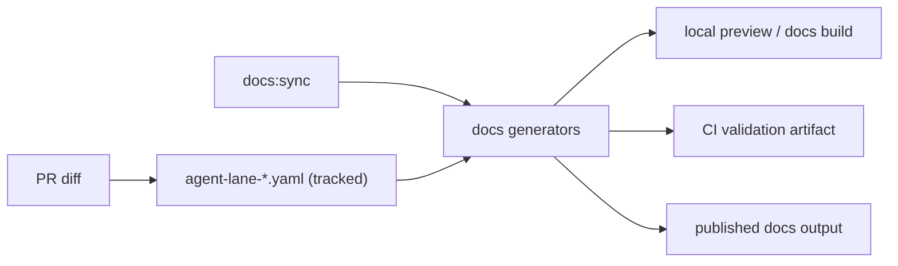

# Generated Planning Surfaces Extraction Plan

## Goal

Stop committing the highest-conflict generated planning views to git while
keeping planning governance, deterministic validation, and docs navigation
intact.

## Problem

The repository currently tracks several generated planning outputs in git:

- `docs/planning/index.md`
- `docs/planning/proposals/index.md`
- `docs/planning/reviews/index.md`
- `docs/planning/status/index.md`

- `docs/planning/state/agent-lane-*.md`
- `docs/planning/state/execution-workboard.md`
- `docs/planning/state/open-task-route.md`

Those files are derived from tracked sources such as `agent-lane-*.yaml`, but
multiple agents and branches still regenerate and push the same shared outputs.
That creates avoidable churn:

- unrelated PRs collide on generated Markdown
- rebases regenerate low-signal diffs
- agents on different machines overwrite each other's derived views
- reviews spend time on render noise instead of source-of-truth changes

## Current Baseline

Today the repo assumes these generated planning views are committed:

- `pnpm docs:sync:check` compares tracked generated planning indexes to `HEAD`
- `pnpm docs:workboard:check` regenerates workboard views and expects tracked
  outputs
- `pr-quality-gate.yml` runs those checks on docs-changing PRs
- multiple planning and architecture docs link directly to the generated view
  files

This means the repo is currently optimized for deterministic checked-in
snapshots, not for multi-agent branch isolation.

## Decision Principle

Track source-of-truth planning inputs in git. Do not track regenerated planning
views when they can be reproduced deterministically from tracked sources.

For the planning state family, the canonical editable surfaces should be:

- `docs/planning/state/agent-lane-*.yaml`
- canonical planning proposals, reviews, closeouts, and roadmap docs

The following should become derived outputs rather than committed artifacts:

- `docs/planning/index.md`
- `docs/planning/proposals/index.md`
- `docs/planning/reviews/index.md`
- `docs/planning/status/index.md`

- `docs/planning/state/agent-lane-*.md`
- `docs/planning/state/execution-workboard.md`
- `docs/planning/state/open-task-route.md`

## Why This Slice Matters

This is the highest-value extraction slice because it attacks the exact files
that collide when multiple agents are active in parallel. It also has a cleaner
source model than broader docs extraction work:

- lane Markdown already derives entirely from lane YAML
- workboard and route already derive entirely from lane YAML
- no human-authored semantic content lives only in those generated files

## Proposed End State

1. Lane YAML remains the only tracked planning registry for lane state.
2. Lane Markdown, workboard, and open-task-route are generated locally or in CI
   for preview and publication, but not committed to git.
3. CI validates generation correctness by reproducing the outputs in a temp
   location or ignored workspace and diffing against generated expectations,
   not against tracked Markdown files.
4. Canonical docs link to the YAML or to published/generated docs output rather
   than to checked-in derived Markdown where appropriate.

## Scope

In scope:

- planning-generated landing pages and planning-state rendered outputs
- generator and CI changes required to stop tracking them
- docs link and navigation adaptation for those planning views
- branch-safe contributor workflow for multi-agent work

Out of scope:

- extracting every generated `index.md` page in the repo
- removing generated status docs such as `generated-code-state.md`
- weakening docs governance or making generated planning state optional

## Before / After

### Before

### After

## Tradeoffs

| Aspect            | Keep generated planning views in git | Extract generated planning views from git       |
| ----------------- | ------------------------------------ | ----------------------------------------------- |
| Merge behavior    | frequent conflicts on shared outputs | conflicts move back to canonical YAML only      |
| Review signal     | low-signal Markdown churn            | higher signal on real planning changes          |
| Determinism       | simple because snapshot is committed | still possible, but requires generator-aware CI |
| Local readability | immediate Markdown available in repo | requires local generation or published docs     |
| Migration cost    | none                                 | moderate script + docs + workflow adaptation    |

## Opportunity Cost

If this is not done:

- multi-agent work continues paying merge and rebase tax on derived files
- docs-only PRs keep carrying incidental generated diffs
- planning state remains harder to trust because reviewed changes are mixed with
  render noise

If this is done too broadly in one shot:

- docs governance can break across unrelated generated surfaces
- navigation may regress
- CI may go red for reasons unrelated to the planning-state family

So the recommended move is not "extract all generated docs now." It is "extract
planning-state generated outputs first, then reassess."

## Execution Waves

### Wave 1 - Classify and protect sources

- declare `agent-lane-*.yaml` as the canonical source for lane state
- declare lane Markdown, workboard, and route as untracked derived outputs
- update docs governance docs so source vs derived status is explicit

### Wave 2 - Change generators and local workflow

- make `generate-planning-lanes.cjs` and `generate-workboard.cjs` support
  output to an ignored/generated directory or temp path
- make local docs commands render those views without requiring git-tracked
  files

Wave 2 status (2026-04-03): implemented.

- `generate-planning-lanes.cjs` and `generate-workboard.cjs` now support
  `--output-root` while keeping lane YAML as the canonical input source.
- local isolated generation command is available:
  `pnpm docs:planning:preview:isolated`
- isolated outputs are written under `.generated-docs/` (ignored by git).

### Wave 3 - Change CI gates

- replace `docs:sync:check` and `docs:workboard:check` assumptions that those
  Markdown files are committed
- validate the generated planning views in CI as reproduced artifacts
- keep the checks fail-closed if generation breaks

Wave 3 status (2026-04-03): implemented.

- `docs:sync:check` now validates only tracked generated index families and no
  longer includes planning-generated surfaces.
- `docs:workboard:check` delegates to
  `docs:planning:generated:check` for planning artifact generation integrity.
- CI runs these checks through `PR Quality Gate` for docs-changing pull
  requests.

### Wave 4 - Remove tracked generated planning views

- delete the tracked `agent-lane-*.md`, `execution-workboard.md`, and
  `open-task-route.md` from git
- move references to canonical YAML or published generated docs where needed
- add rollback instructions in case docs discoverability regresses

Wave 4 status (2026-04-03): implemented.

- planning landing pages and rendered planning state views were removed from
  git tracking.
- contributors now rely on local/CI generation for those extracted pages.
- governance and contributor docs were updated to point to canonical tracked
  planning sources.

### Wave 5 - Hardening and operational adoption

- add a post-migration runbook for docs contributors and release managers
- add a CI smoke assertion that docs build output contains extracted planning
  pages
- add a short rollback playbook for temporary re-tracking in incident mode
- monitor 2 sprint cycles for conflict-rate reduction and docs gate stability

Wave 5 status (2026-04-03): in progress.

Initial delivery completed:

- [Planning Generated Artifacts Operations Runbook](../../../../runbooks/planning-generated-artifacts-operations-20260403.md)

## Acceptance Criteria

1. A PR that changes only `agent-lane-*.yaml` no longer needs to commit
   regenerated lane Markdown or workboard views.
2. CI still fails closed when lane generation is broken or stale.
3. Multiple agents can change planning inputs on separate branches without
   colliding on shared derived Markdown.
4. Contributors still have a supported way to preview lane/workboard views
   locally.
5. Documentation clearly distinguishes tracked source from generated planning
   output.

## Recommended Sequencing Relative To Existing Plans

This proposal should be executed as the concrete first slice of:

- `CDG-W4-2` from the CI Delivery Governance Consolidated Action Plan
- the broader Autogenerated Pages Extraction Plan

It should land before any repo-wide extraction of generated docs families.

## References

- [CI Delivery Governance Consolidated Action Plan](ci-delivery-governance-consolidated-action-plan-20260331.md)
- [Autogenerated Pages Extraction Plan](autogenerated-pages-extraction-plan-20260403.md)
- [How to Add Tasks to an Agent Lane](../../../state/how-to-add-tasks.md)
- [Governance Document And Rule Inventory](../../../status/governance-document-rule-inventory.md)
- [`package.json`](../../../../../package.json)
- [PR Quality Gate](../../../../../.github/workflows/pr-quality-gate.yml)
