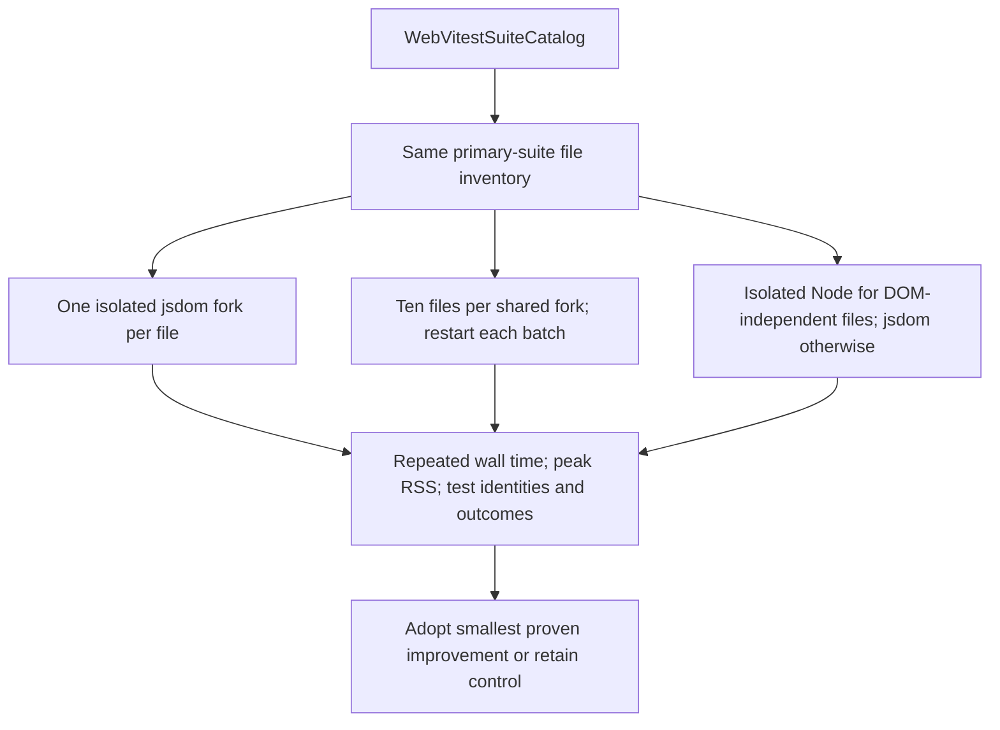

# GH-2900 Web Vitest Isolation Benchmark

## Think-first analysis

Issue #2900 owns this experiment. Baseline Git head is
`3695f07c9ba3c66ab51f88a2dabe18e18556a244`. The issue records 654–845 seconds
for the Web lane; environment creation and collection dominate assertions.
The catalog deliberately uses one isolated fork per file to prevent the
previous unbounded shared-fork memory failure.

ADRs: ADR-0000 governs traceable configuration; ADR-0061 keeps task lifecycle
in GitHub and architecture in Planning DB. The DB was queried before design
consultation and returned `SelectWebVitestChangedSuites` and
`WebVitestSuitePartition`. Existing `WebVitestSuiteCatalog` owns execution;
no new command, classifier, suite owner, or product behavior is introduced.

Options, in order of evidence collection:

1. Current isolated forks, jsdom, one worker: control and safe fallback.
2. Bounded batches of ten files sharing one fork; restart between batches.
   Measure state leakage and total launch overhead, not only assertion time.
3. Environment partition: run DOM-independent architecture/unit tests in Node,
   retaining jsdom for browser semantics and isolation for every file.

Use existing Vitest 3.2.4 features, not a new pool implementation. Reviewed
the official [performance guide](https://v3.vitest.dev/guide/improving-performance)
and [environment guide](https://v3.vitest.dev/guide/environment).
No new dependency is needed. An unbounded shared fork and increased concurrency
are rejected before benchmarking because they repeat the known memory risk.
No candidate is selected until measurements and test outcomes justify it.

## Current and candidate execution



## Pre-implementation brief

Mode: Full. This is a measured configuration experiment, with a durable evidence
report. Measurements use an ignored `tmp/gh-2900` workspace; experimental
overrides do not become package commands or CI routes.

Run each candidate at least twice on the same machine, with the same dependency
outputs and one worker. Capture actual file/test identities, failures, elapsed
time, per-process peak RSS, and sampled aggregate process-tree RSS. Record OS,
Node/Vitest versions, baseline SHA, and warm-cache limitations. The 4096 MiB
old-space setting is not an RSS limit; report both independently and require
worker RSS below 4096 MiB with at least 20% headroom. Never label local Windows
timings as Ubuntu hosted-runner measurements.

Coverage is the complete current primary-suite inventory, including additions
since the issue's 591-file sample. An environment-only candidate must preserve
file ownership and executed test identities. Any shared-state failure rejects
batch reuse unless cleanly resolved within this issue without test bypasses.

Allowed production scope: catalog configuration and environment annotations
in DOM-dependent tests if measurements justify changing the default; associated
catalog guards and canonical component/CI guide. Existing package/workflow
commands and changed-suite selection remain unchanged. If batching wins and
requires a runner implementation, update this plan and its symbols before coding.

| Scenario                               | Opportunity             | Fowler pattern                 | DDD owner             | Rail                                                           | Implementation surfaces                      | Package/negative tests                                                 | Architecture test                                                  | User flow              | Out of scope                                      |
| -------------------------------------- | ----------------------- | ------------------------------ | --------------------- | -------------------------------------------------------------- | -------------------------------------------- | ---------------------------------------------------------------------- | ------------------------------------------------------------------ | ---------------------- | ------------------------------------------------- |
| Avoid unnecessary browser environments | Responsibility overload | Separate policy from execution | WebVitestSuiteCatalog | WebVitestSuitePartition; preserve SelectWebVitestChangedSuites | vitest.suites.ts; web tests; component guide | All primary suites; DOM tests retain jsdom; failed candidates recorded | Existing suite ownership, worker bounds and changed-routing guards | N/A: test tooling only | Product behavior, new routing, global CI redesign |

Validation: red/green catalog guard, all primary suites with repeated measurements,
changed-suite architecture tests, package lint and typecheck, docs sync,
governance refresh, feature mechanization, hook-normalized commit, and
`pnpm verify:prepush`. No hidden skipped tests, lowered quality rules, or stubs.

## Feature mechanization

The manifest describes the existing implemented rail and the admitted patch
surfaces; it is not a claim that this experiment is complete.

```feature-mechanization
version: 1
featureId: GH-2900-WEB-VITEST
mechanizationStatus: implemented
noHumanDecisionsRemaining: true
implementationPlan: docs/planning/proposals/mandatory/governance-and-docs/gh-2900-web-vitest-isolation-benchmark.md
componentGuides:
  - docs/architecture/components/web/frontend-test-governance-component.md
userStories:
  - docs/guides/testing-and-ci-capabilities.md
governingSources:
  - AGENTS.md
  - docs/guides/ai-work-protocol.md
  - docs/architecture/command-query-rail-governance.md
  - docs/architecture/fowler-opportunity-planning-governance.md
  - docs/adr/ADR-0000-Code-generation-with-normative-traceability-required.en.md
  - docs/adr/ADR-0061-github-mvp-task-authority-and-planning-db-architecture-boundary.md
allowedImplementationSurfaces:
  - apps/web/vitest.suites.ts
  - apps/web/src/**/*.test.ts
  - apps/web/src/**/*.test.tsx
  - docs/architecture/components/web/frontend-test-governance-component.md
  - docs/guides/testing-and-ci-capabilities.md
  - docs/planning/proposals/mandatory/governance-and-docs/gh-2900-web-vitest-isolation-benchmark.md
  - docs/planning/closeouts/gh-2900-closeout.md
forbiddenImplementationSurfaces:
  - apps/api/**
  - packages/@dvt/**
  - .github/workflows/**
commandQueryRails:
  - name: WebVitestSuitePartition
    type: command
    dddOwner: Web test tooling
  - name: SelectWebVitestChangedSuites
    type: query
    dddOwner: WebVitestChangedSuitePlan
domainObjects:
  - name: WebVitestSuiteCatalog
    type: policy
    owner: Web CI governance
fowlerSignals:
  - Separate policy from execution
architectureGuards:
  - pnpm --filter @dvt/web exec vitest run --config vitest.architecture.config.ts src/testing
cypressFlows:
  - N/A - test tooling; no product browser behavior changes
completionGate:
  - pnpm test:web:ci
  - pnpm --filter @dvt/web lint
  - pnpm --filter @dvt/web typecheck
  - pnpm verify:prepush
redGreenCycles:
  - id: environment-policy
    redTest: pnpm --filter @dvt/web exec vitest run --config vitest.architecture.config.ts src/testing/vitestSuites.catalog.architecture.test.ts
    expectedFailure: Current catalog creates jsdom for DOM-independent tests.
    patchSurfaces:
      - apps/web/vitest.suites.ts
      - apps/web/src/testing/vitestSuites.catalog.architecture.test.ts
    greenTest: pnpm test:web:ci
symbols:
  - name: createWebVitestConfig
    path: apps/web/vitest.suites.ts
    dddOwner: WebVitestSuiteCatalog
    cqRails: [WebVitestSuitePartition, SelectWebVitestChangedSuites]
    fowlerSignals: [Separate policy from execution]
    architectureGuard: pnpm --filter @dvt/web exec vitest run --config vitest.architecture.config.ts src/testing
    cypressCoverage: N/A - test tooling
    unitTests: [pnpm test:web:ci]
```
