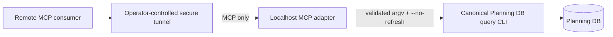

# GH-2970 Planning DB MCP Adapter

## Think-First Analysis

Issue #2970 requires remote agents to consult the canonical Planning DB without
exposing PostgreSQL or creating another query model. The Planning DB CLI already
owns validation, query names, projections, credentials, and database access.
The missing boundary is a small MCP transport adapter.

The root cause is transport reachability: an MCP consumer cannot invoke a
developer-machine CLI directly. It is not a missing database query or product
API. ADR-0000 requires source-first traceability; ADR-0061 keeps architecture
state in Planning DB and task lifecycle in GitHub.
The Fowler opportunity planning rule classifies the adapter as a Gateway and
the allowlist as a Command Gateway at the existing query boundary.

The selected design exposes one localhost Streamable HTTP endpoint and one
read-only tool. The tool accepts an allowlisted query name plus bounded
`component` and `limit` values, then invokes `scripts/planning-db-query.cjs` by
argv with `--no-refresh`. It inherits operator-owned environment variables and
returns bounded text. It never accepts a command string or SQL.

Rejected alternatives:

- A generic PostgreSQL MCP server would expose a broader authority and bypass
  the canonical query CLI.
- A product/API endpoint would turn repository governance tooling into runtime
  product behavior.
- Shell execution would make validation insufficient to prevent injection.
- Public binding or embedded authentication would expand this localhost slice
  into an undeclared deployment/security product.
- A second query catalog would drift from `scripts/planning-db-query.cjs`; the
  seven-entry allowlist is only an adapter admission policy for demonstrated
  consumers.

The implementation was authored and committed before this durable proposal.
Issue #2970 held the initial analysis and red/green journal. This document
records that sequencing deviation instead of claiming that documentation
preceded the existing commits.

## Current and target boundary



PostgreSQL remains private. The tunnel and remote client configuration are
operator concerns; the repository server remains bound to `127.0.0.1`.

## Pre-Implementation Brief

- Mode: Full, because a new local transport artifact is introduced.
- Scope: isolated Node.js ESM package under `tools/planning-db-mcp`, operator
  README, durable proposal and closeout evidence.
- Expected outcome: one `planning_db_query` tool delegates approved reads to the
  existing CLI.
- Risks: command injection, unintended writes, credential disclosure, public
  exposure, stale projection refresh and duplicate query semantics.
- Mitigation: `execFile` argv, closed allowlist, `--no-refresh`, localhost bind,
  bounded errors/output and no SQL/database library in the adapter.
- Out of scope: writes, raw SQL, DB administration, product API, public hosting,
  authentication framework, schema/import/recovery and generic filters.
- Libraries evaluated: official MCP SDK v2 packages; adopted rather than
  implementing the protocol.
- Command/query rail: reuses the existing `planning:db:query` repository query
  rail and its governed read models. MCP is only an inbound adapter.

## Fowler Opportunity Matrix

| Scenario                                   | Opportunity         | Pattern                | DDD owner                 | Rail                | Guard                        |
| ------------------------------------------ | ------------------- | ---------------------- | ------------------------- | ------------------- | ---------------------------- |
| Remote agent cannot invoke the local CLI   | Boundary drift      | Gateway                | Planning DB query adapter | `planning:db:query` | real MCP tool call           |
| User text could become process arguments   | Injection boundary  | Command Gateway        | MCP admission policy      | `planning:db:query` | closed schema and argv tests |
| MCP could become another query authority   | Duplicate semantics | Single Source of Truth | Planning DB read models   | `planning:db:query` | seven fixed queries, no SQL  |
| Public exposure could leak governance data | Hidden authority    | Local adapter          | Operator runtime          | `planning:db:query` | localhost/origin checks      |

```feature-mechanization
version: 1
featureId: GH-2970-PLANNING-DB-MCP
mechanizationStatus: implemented
noHumanDecisionsRemaining: true
implementationPlan: docs/planning/proposals/mandatory/governance-and-docs/gh-2970-planning-db-mcp-adapter.md
componentGuides:
  - tools/planning-db-mcp/README.md
userStories:
  - As a remote governance agent, I can call approved Planning DB reads without receiving SQL or database credentials.
  - As an operator, I can keep PostgreSQL private while tunneling one localhost MCP endpoint.
governingSources:
  - AGENTS.md
  - docs/planning/status/governance-document-rule-inventory.md
  - docs/guides/ai-work-protocol.md
  - docs/architecture/command-query-rail-governance.md
  - docs/architecture/fowler-opportunity-planning-governance.md
  - docs/adr/ADR-0000-Code-generation-with-normative-traceability-required.en.md
  - docs/adr/ADR-0061-github-mvp-task-authority-and-planning-db-architecture-boundary.md
  - tools/planning-db/state/db-governance-surfaces.json
allowedImplementationSurfaces:
  - tools/planning-db-mcp/package.json
  - tools/planning-db-mcp/pnpm-lock.yaml
  - tools/planning-db-mcp/README.md
  - tools/planning-db-mcp/*.mjs
  - docs/planning/proposals/mandatory/governance-and-docs/gh-2970-planning-db-mcp-adapter.md
  - docs/planning/closeouts/gh-2970-closeout.md
forbiddenImplementationSurfaces:
  - apps/**
  - packages/**
  - scripts/planning-db-query.cjs
  - tools/planning-db/schema.sql
  - .github/workflows/**
commandQueryRails:
  - name: planning:db:query
    type: query
    dddOwner: Planning DB governance read models
domainObjects:
  - name: PlanningDbQueryInvocation
    type: adapter admission policy
    owner: Architecture / CI Governance
fowlerSignals:
  - Gateway around an existing query rail
  - Command Gateway for bounded argv execution
  - Single Source of Truth for Planning DB query semantics
architectureGuards:
  - pnpm --dir tools/planning-db-mcp --ignore-workspace test
  - node --check tools/planning-db-mcp/server.mjs
cypressFlows:
  - N/A - local governance tooling only
completionGate:
  - pnpm --dir tools/planning-db-mcp --ignore-workspace test
  - pnpm planning:db:health
  - MCP Inspector tools/list and planning_db_query smoke
  - pnpm governance:refresh
  - pnpm verify:prepush
redGreenCycles:
  - id: planning-db-mcp-admission
    redTest: node --test tools/planning-db-mcp/planningDbQueryAdapter.test.mjs
    expectedFailure: no bounded MCP-to-CLI invocation policy existed before the issue implementation.
    patchSurfaces:
      - tools/planning-db-mcp/planningDbQueryAdapter.mjs
      - tools/planning-db-mcp/planningDbQueryAdapter.test.mjs
    greenTest: node --test tools/planning-db-mcp/planningDbQueryAdapter.test.mjs
symbols:
  - &queryAdapterSymbol
    name: ALLOWED_PLANNING_DB_QUERIES
    path: tools/planning-db-mcp/planningDbQueryAdapter.mjs
    dddOwner: PlanningDbQueryInvocation
    cqRails: [planning:db:query]
    fowlerSignals: [Command Gateway]
    architectureGuard: node --test tools/planning-db-mcp/planningDbQueryAdapter.test.mjs
    cypressCoverage: N/A
    unitTests: [node --test tools/planning-db-mcp/planningDbQueryAdapter.test.mjs]
  - { <<: *queryAdapterSymbol, name: DEFAULT_LIMIT }
  - { <<: *queryAdapterSymbol, name: MAX_LIMIT }
  - { <<: *queryAdapterSymbol, name: MAX_OUTPUT_BYTES }
  - { <<: *queryAdapterSymbol, name: QUERY_TIMEOUT_MS }
  - { <<: *queryAdapterSymbol, name: allowedQueries }
  - { <<: *queryAdapterSymbol, name: componentIdPattern }
  - { <<: *queryAdapterSymbol, name: execFileAsync }
  - { <<: *queryAdapterSymbol, name: planningDbQueryScript }
  - { <<: *queryAdapterSymbol, name: repoRoot }
  - { <<: *queryAdapterSymbol, name: requireQuery }
  - { <<: *queryAdapterSymbol, name: resolveComponent }
  - { <<: *queryAdapterSymbol, name: resolveLimit }
  - { <<: *queryAdapterSymbol, name: buildPlanningDbQueryInvocation }
  - { <<: *queryAdapterSymbol, name: runPlanningDbQuery }
  - { <<: *queryAdapterSymbol, name: sanitizeFailure }
  - { <<: *queryAdapterSymbol, name: toolDir }
  - &mcpServerSymbol
    name: DEFAULT_PORT
    path: tools/planning-db-mcp/server.mjs
    dddOwner: PlanningDbQueryInvocation
    cqRails: [planning:db:query]
    fowlerSignals: [Gateway]
    architectureGuard: MCP Inspector tools/list and planning_db_query smoke
    cypressCoverage: N/A
    unitTests: [node --test tools/planning-db-mcp/server.test.mjs]
  - { <<: *mcpServerSymbol, name: HOST }
  - { <<: *mcpServerSymbol, name: MCP_PATH }
  - { <<: *mcpServerSymbol, name: hasRejectedOrigin }
  - { <<: *mcpServerSymbol, name: inputSchema }
  - { <<: *mcpServerSymbol, name: isMain }
  - { <<: *mcpServerSymbol, name: localOrigins }
  - { <<: *mcpServerSymbol, name: resolvePort }
  - { <<: *mcpServerSymbol, name: createPlanningDbMcpServer }
  - { <<: *mcpServerSymbol, name: startPlanningDbMcpServer }
```
