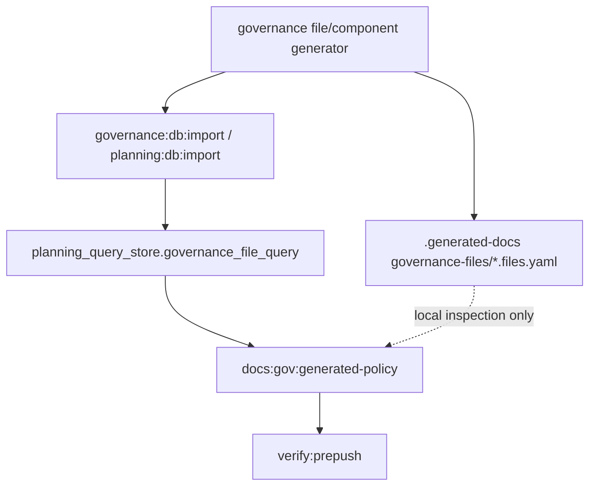

# Governance File Shards DB-backed Policy Task

## Trigger

`pnpm verify:prepush` is blocked by `pnpm docs:gov:generated-policy` because
the local generated shard
`.generated-docs/planning/status/governance-files/SYS-DOCS-GOVERNANCE.files.yaml`
is larger than the current `local-governance-file-indexes` `maxBytes` budget.

The observed failure is:

```text
local-governance-file-indexes:
.generated-docs/planning/status/governance-files/SYS-DOCS-GOVERNANCE.files.yaml
exceeds maxBytes (1905858 > 1900000)
```

Raising the byte budget would unblock this one run, but it would keep a large
inspection YAML shard acting like a gate authority. The intended direction is
DB-backed query authority for governance file rows, with local shards retained
only as optional inspection artifacts.

## Task Definition

- Task ID: `GOV-SHARD-DB-1`
- Lane: `D`
- Priority: `P0`
- Objective: replace the governance file shard size gate with DB-backed
  projection validation so generated local YAML growth no longer blocks
  unrelated PRs.
- Dependency: `none`
- Complexity: `M`
- Effort: `3`

## Governing Sources

- `AGENTS.md`
- `docs/planning/status/governance-document-rule-inventory.md`
- `docs/architecture/command-query-rail-governance.md`
- `docs/architecture/components/ci-governance/system-governance-generation-workflow-component.md`
- `docs/planning/status/db-surface-inventory.md`
- `docs/generated-docs-policy.json`
- `scripts/check-generated-docs-policy.cjs`
- `scripts/governance-db-import.cjs`
- `scripts/planning-db-import.cjs`

## Feature Mechanization

```feature-mechanization
version: 1
featureId: GOV-SHARD-DB-1
mechanizationStatus: implemented
noHumanDecisionsRemaining: true
implementationPlan: docs/planning/proposals/mandatory/governance-and-docs/governance-file-shards-db-backed-policy-task-20260513.md
componentGuides:
  - docs/architecture/components/ci-governance/system-governance-generation-workflow-component.md
userStories:
  - docs/planning/proposals/mandatory/governance-and-docs/governance-file-shards-db-backed-policy-task-20260513.md
governingSources:
  - AGENTS.md
  - docs/planning/status/governance-document-rule-inventory.md
  - docs/architecture/command-query-rail-governance.md
  - docs/architecture/fowler-opportunity-planning-governance.md
  - docs/architecture/components/ci-governance/system-governance-generation-workflow-component.md
  - docs/planning/status/db-surface-inventory.md
allowedImplementationSurfaces:
  - docs/generated-docs-policy.json
  - docs/architecture/components/ci-governance/system-governance-generation-workflow-component.md
  - docs/planning/status/db-surface-inventory.md
  - docs/planning/proposals/mandatory/governance-and-docs/governance-file-shards-db-backed-policy-task-20260513.md
  - docs/planning/closeouts/20260513-governance-file-shards-db-backed-policy-closeout.md
  - docs/.manifest.json
  - docs/**/index.md
  - package.json
  - scripts/check-generated-docs-policy.cjs
  - scripts/check-generated-docs-policy.test.cjs
  - scripts/verify-prepush.test.cjs
forbiddenImplementationSurfaces:
  - apps/**
  - packages/**
  - specs/**
commandQueryRails:
  - name: ValidateGovernanceGeneratedPolicy
    type: query
    dddOwner: Docs governance local operations
domainObjects:
  - name: GovernanceGeneratedArtifactPolicy
    type: policy
    owner: Docs governance local operations
  - name: GovernanceFileShardDbProjection
    type: DB-backed read model projection
    owner: Governance local operations
fowlerSignals:
  - Generated artifact byte budget drift
  - Local inspection artifact used as gate authority
architectureGuards:
  - node --test scripts/check-generated-docs-policy.test.cjs
  - pnpm docs:gov:generated-policy
cypressFlows:
  - N/A - repository governance policy gate only
completionGate:
  - node --test scripts/check-generated-docs-policy.test.cjs
  - pnpm docs:gov:generated-policy
  - pnpm governance:refresh
  - pnpm verify:prepush
redGreenCycles:
  - id: db-backed-shard-maxbytes-exemption
    redTest: node --test scripts/check-generated-docs-policy.test.cjs
    expectedFailure: generated docs policy checker has no importable helpers or DB-backed shard exemption.
    patchSurfaces:
      - scripts/check-generated-docs-policy.test.cjs
      - scripts/check-generated-docs-policy.cjs
      - docs/generated-docs-policy.json
    greenTest: node --test scripts/check-generated-docs-policy.test.cjs
symbols:
  - name: validDbBackedQueryViews
    path: scripts/check-generated-docs-policy.cjs
    dddOwner: Docs governance local operations
    cqRails:
      - ValidateGovernanceGeneratedPolicy
    fowlerSignals:
      - Local inspection artifact used as gate authority
    cypressCoverage: N/A - repository governance policy gate only
    architectureGuard: node --test scripts/check-generated-docs-policy.test.cjs
    unitTests:
      - scripts/check-generated-docs-policy.test.cjs
  - name: patternMatchesPath
    path: scripts/check-generated-docs-policy.cjs
    dddOwner: Docs governance local operations
    cqRails:
      - ValidateGovernanceGeneratedPolicy
    fowlerSignals:
      - Local inspection artifact used as gate authority
    cypressCoverage: N/A - repository governance policy gate only
    architectureGuard: node --test scripts/check-generated-docs-policy.test.cjs
    unitTests:
      - scripts/check-generated-docs-policy.test.cjs
  - name: dbBackedArtifactPatternMatches
    path: scripts/check-generated-docs-policy.cjs
    dddOwner: Docs governance local operations
    cqRails:
      - ValidateGovernanceGeneratedPolicy
    fowlerSignals:
      - Local inspection artifact used as gate authority
    cypressCoverage: N/A - repository governance policy gate only
    architectureGuard: node --test scripts/check-generated-docs-policy.test.cjs
    unitTests:
      - scripts/check-generated-docs-policy.test.cjs
  - name: validateArtifactSize
    path: scripts/check-generated-docs-policy.cjs
    dddOwner: Docs governance local operations
    cqRails:
      - ValidateGovernanceGeneratedPolicy
    fowlerSignals:
      - Local inspection artifact used as gate authority
    cypressCoverage: N/A - repository governance policy gate only
    architectureGuard: node --test scripts/check-generated-docs-policy.test.cjs
    unitTests:
      - scripts/check-generated-docs-policy.test.cjs
  - name: validateDbBackedArtifactGroups
    path: scripts/check-generated-docs-policy.cjs
    dddOwner: Docs governance local operations
    cqRails:
      - ValidateGovernanceGeneratedPolicy
    fowlerSignals:
      - Local inspection artifact used as gate authority
    cypressCoverage: N/A - repository governance policy gate only
    architectureGuard: node --test scripts/check-generated-docs-policy.test.cjs
    unitTests:
      - scripts/check-generated-docs-policy.test.cjs
  - name: assert
    path: scripts/check-generated-docs-policy.test.cjs
    dddOwner: Docs governance local operations
    cqRails:
      - ValidateGovernanceGeneratedPolicy
    fowlerSignals:
      - Local inspection artifact used as gate authority
    cypressCoverage: N/A - repository governance policy gate only
    architectureGuard: node --test scripts/check-generated-docs-policy.test.cjs
    unitTests:
      - scripts/check-generated-docs-policy.test.cjs
  - name: fs
    path: scripts/check-generated-docs-policy.test.cjs
    dddOwner: Docs governance local operations
    cqRails:
      - ValidateGovernanceGeneratedPolicy
    fowlerSignals:
      - Local inspection artifact used as gate authority
    cypressCoverage: N/A - repository governance policy gate only
    architectureGuard: node --test scripts/check-generated-docs-policy.test.cjs
    unitTests:
      - scripts/check-generated-docs-policy.test.cjs
  - name: os
    path: scripts/check-generated-docs-policy.test.cjs
    dddOwner: Docs governance local operations
    cqRails:
      - ValidateGovernanceGeneratedPolicy
    fowlerSignals:
      - Local inspection artifact used as gate authority
    cypressCoverage: N/A - repository governance policy gate only
    architectureGuard: node --test scripts/check-generated-docs-policy.test.cjs
    unitTests:
      - scripts/check-generated-docs-policy.test.cjs
  - name: path
    path: scripts/check-generated-docs-policy.test.cjs
    dddOwner: Docs governance local operations
    cqRails:
      - ValidateGovernanceGeneratedPolicy
    fowlerSignals:
      - Local inspection artifact used as gate authority
    cypressCoverage: N/A - repository governance policy gate only
    architectureGuard: node --test scripts/check-generated-docs-policy.test.cjs
    unitTests:
      - scripts/check-generated-docs-policy.test.cjs
  - name: test
    path: scripts/check-generated-docs-policy.test.cjs
    dddOwner: Docs governance local operations
    cqRails:
      - ValidateGovernanceGeneratedPolicy
    fowlerSignals:
      - Local inspection artifact used as gate authority
    cypressCoverage: N/A - repository governance policy gate only
    architectureGuard: node --test scripts/check-generated-docs-policy.test.cjs
    unitTests:
      - scripts/check-generated-docs-policy.test.cjs
  - name: repoRoot
    path: scripts/check-generated-docs-policy.test.cjs
    dddOwner: Docs governance local operations
    cqRails:
      - ValidateGovernanceGeneratedPolicy
    fowlerSignals:
      - Local inspection artifact used as gate authority
    cypressCoverage: N/A - repository governance policy gate only
    architectureGuard: node --test scripts/check-generated-docs-policy.test.cjs
    unitTests:
      - scripts/check-generated-docs-policy.test.cjs
  - name: checkerPath
    path: scripts/check-generated-docs-policy.test.cjs
    dddOwner: Docs governance local operations
    cqRails:
      - ValidateGovernanceGeneratedPolicy
    fowlerSignals:
      - Local inspection artifact used as gate authority
    cypressCoverage: N/A - repository governance policy gate only
    architectureGuard: node --test scripts/check-generated-docs-policy.test.cjs
    unitTests:
      - scripts/check-generated-docs-policy.test.cjs
  - name: toPosix
    path: scripts/check-generated-docs-policy.test.cjs
    dddOwner: Docs governance local operations
    cqRails:
      - ValidateGovernanceGeneratedPolicy
    fowlerSignals:
      - Local inspection artifact used as gate authority
    cypressCoverage: N/A - repository governance policy gate only
    architectureGuard: node --test scripts/check-generated-docs-policy.test.cjs
    unitTests:
      - scripts/check-generated-docs-policy.test.cjs
  - name: loadChecker
    path: scripts/check-generated-docs-policy.test.cjs
    dddOwner: Docs governance local operations
    cqRails:
      - ValidateGovernanceGeneratedPolicy
    fowlerSignals:
      - Local inspection artifact used as gate authority
    cypressCoverage: N/A - repository governance policy gate only
    architectureGuard: node --test scripts/check-generated-docs-policy.test.cjs
    unitTests:
      - scripts/check-generated-docs-policy.test.cjs
  - name: makeOversizedArtifact
    path: scripts/check-generated-docs-policy.test.cjs
    dddOwner: Docs governance local operations
    cqRails:
      - ValidateGovernanceGeneratedPolicy
    fowlerSignals:
      - Local inspection artifact used as gate authority
    cypressCoverage: N/A - repository governance policy gate only
    architectureGuard: node --test scripts/check-generated-docs-policy.test.cjs
    unitTests:
      - scripts/check-generated-docs-policy.test.cjs
  - name: basePolicyForArtifact
    path: scripts/check-generated-docs-policy.test.cjs
    dddOwner: Docs governance local operations
    cqRails:
      - ValidateGovernanceGeneratedPolicy
    fowlerSignals:
      - Local inspection artifact used as gate authority
    cypressCoverage: N/A - repository governance policy gate only
    architectureGuard: node --test scripts/check-generated-docs-policy.test.cjs
    unitTests:
      - scripts/check-generated-docs-policy.test.cjs
  - name: validate
    path: scripts/check-generated-docs-policy.test.cjs
    dddOwner: Docs governance local operations
    cqRails:
      - ValidateGovernanceGeneratedPolicy
    fowlerSignals:
      - Local inspection artifact used as gate authority
    cypressCoverage: N/A - repository governance policy gate only
    architectureGuard: node --test scripts/check-generated-docs-policy.test.cjs
    unitTests:
      - scripts/check-generated-docs-policy.test.cjs
```

## Command And Query Rail

- Rail name: `ValidateGovernanceGeneratedPolicy`
- Type: Query
- Owning context: Docs governance local operations
- DDD object/read model: generated artifact policy and governance file shard
  DB projection
- Application port: `pnpm docs:gov:generated-policy`
- Adapter surface: `scripts/check-generated-docs-policy.cjs`
- Scope and auth: repo-local maintainer and CI validation, no product tenant data
- Negative tests: missing DB projection metadata, missing DB-backed shard query,
  oversized non-DB artifact, oversized DB-backed artifact without explicit
  exemption, and stale generated policy ownership.

## Required Design Direction



The policy checker should validate that the shard family has an explicit
DB-backed projection contract. It should not require the YAML inspection shard
to stay below a brittle byte threshold when the equivalent rows are queryable in
`planning_query_store`.

## Acceptance Criteria

1. `pnpm docs:gov:generated-policy` passes with the current
   `SYS-DOCS-GOVERNANCE.files.yaml` size without raising the global
   `maxBytes` budget.
2. Oversized generated artifacts that are not DB-backed still fail
   `docs:gov:generated-policy`.
3. DB-backed shard exemptions require explicit policy metadata naming the DB
   projection and the query/check command that proves it.
4. The task updates the CI-governance component doc or DB surface inventory if
   the policy contract changes.
5. Tests prove the red/green cases before implementation.
6. No `.generated-docs` artifact is committed or treated as source of truth.

## User Stories

- `GOV-SHARD-US1`: as a runtime contributor, I need unrelated adapter PRs not
  to fail because a local governance YAML grew. Acceptance:
  `verify:prepush` no longer fails on DB-backed governance file shard byte
  size alone.
- `GOV-SHARD-US2`: as a governance maintainer, I need large shard data queryable
  from the DB. Acceptance: the checker names and validates the DB projection
  used for governance file rows.
- `GOV-SHARD-US3`: as a CI reviewer, I need non-DB generated artifacts to stay
  size-bounded. Acceptance: existing `maxBytes` behavior still catches
  oversized non-DB artifacts.
- `GOV-SHARD-US4`: as an agent/operator, I need the repair path to be visible.
  Acceptance: the docs name the command/query rail and the validation commands
  needed to close the shard task.

## Out Of Scope

- Changing product runtime behavior.
- Changing `run_events` partitioning implementation.
- Committing generated `.generated-docs` shards.
- Raising `maxBytes` without a DB-backed contract.

## Validation Plan

- `node --test scripts/check-generated-docs-policy.test.cjs`
- `pnpm docs:gov:generated-policy`
- `pnpm governance:refresh`
- `pnpm verify:prepush`
