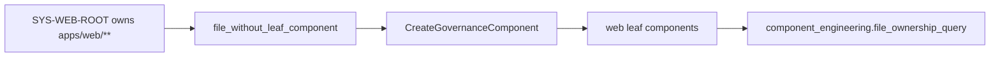

# Planning DB CLI Help Plan

## Think-First Analysis

Problem summary: planning DB `--help` requests were parsed as normal commands
or query flags, so operators received validation errors instead of help.

Root cause: help detection was not modeled at the planning DB CLI adapter
boundary. The parsers resolved operations and required flag values before
classifying help as a non-DB read.

Selected option: classify help at parser entry, return a non-DB help read
model, and let `main` print it without opening a database connection.

Rejected alternatives:

- Add ad hoc `--help` branches to each command parser. Rejected because it
  duplicates CLI policy across command-specific parsing.
- Change only the package script wrapper. Rejected because direct node
  execution is also a supported adapter path for tests and diagnostics.

## Fowler Matrix

<!-- markdownlint-disable MD060 -->

| Scenario                                | Opportunity          | Fowler pattern                   | DDD owner                 | Command/query rail           | Implementation surfaces                                   | Unit or package test                               | Architecture test | Out of scope                    |
| --------------------------------------- | -------------------- | -------------------------------- | ------------------------- | ---------------------------- | --------------------------------------------------------- | -------------------------------------------------- | ----------------- | ------------------------------- |
| Planning DB operation help parses work. | Boundary drift       | Command Gateway                  | Planning DB CLI adapter   | `RunPlanningDbOperationHelp` | `planning-db-operate.cjs`, `planning-db-operate.test.cjs` | `node --test scripts/planning-db-operate.test.cjs` | N/A               | Full manual-page generation     |
| Planning DB query help requires values. | Primitive obsession  | Replace Flag Parsing with Policy | Planning DB query adapter | `RunPlanningDbQueryHelp`     | `planning-db-query.cjs`, `planning-db-query.test.cjs`     | `node --test scripts/planning-db-query.test.cjs`   | N/A               | Changing query filter semantics |
| Help tests could freeze copy.           | Test-only confidence | Semantic Fitness Function        | Planning DB CLI tests     | both help rails              | parser tests                                              | semantic assertions                                | N/A               | Snapshot testing help output    |

<!-- markdownlint-enable MD060 -->

```feature-mechanization
version: 1
featureId: PLANNING-DB-CLI-HELP-20260604
mechanizationStatus: implemented
noHumanDecisionsRemaining: true
implementationPlan: docs/planning/proposals/mandatory/governance-and-docs/planning-db-cli-help-plan-20260604.md
componentGuides:
  - docs/planning/status/db-surface-inventory.md
userStories:
  - docs/planning/proposals/mandatory/governance-and-docs/planning-db-cli-help-plan-20260604.md
governingSources:
  - AGENTS.md
  - docs/planning/status/governance-document-rule-inventory.md
  - docs/guides/ai-work-protocol.md
  - docs/architecture/command-query-rail-governance.md
  - docs/architecture/fowler-opportunity-planning-governance.md
allowedImplementationSurfaces:
  - scripts/planning-db-operate.cjs
  - scripts/planning-db-operate.test.cjs
  - scripts/planning-db-query.cjs
  - scripts/planning-db-query.test.cjs
  - docs/planning/proposals/mandatory/governance-and-docs/planning-db-cli-help-plan-20260604.md
forbiddenImplementationSurfaces:
  - apps/**
  - packages/**
  - specs/**
commandQueryRails:
  - name: RunPlanningDbOperationHelp
    type: query
    dddOwner: PlanningDbOperationCliHelp
  - name: RunPlanningDbQueryHelp
    type: query
    dddOwner: PlanningDbQueryCliHelp
domainObjects:
  - name: PlanningDbOperationCliHelp
    type: CLI adapter read model
    owner: Planning DB command adapter
  - name: PlanningDbQueryCliHelp
    type: CLI adapter read model
    owner: Planning DB query adapter
fowlerSignals:
  - Boundary drift
  - Primitive obsession
  - Test-only confidence
architectureGuards:
  - node --test scripts/planning-db-operate.test.cjs
  - node --test scripts/planning-db-query.test.cjs
cypressFlows:
  - N/A - CLI-only behavior
completionGate:
  - node --test scripts/planning-db-operate.test.cjs
  - node --test scripts/planning-db-query.test.cjs
  - pnpm governance:refresh
  - pnpm verify:prepush
redGreenCycles:
  - id: planning-db-operate-help
    redTest: node --test scripts/planning-db-operate.test.cjs
    expectedFailure: operate --help is parsed as an unknown operation.
    patchSurfaces:
      - scripts/planning-db-operate.cjs
      - scripts/planning-db-operate.test.cjs
    greenTest: node --test scripts/planning-db-operate.test.cjs
  - id: planning-db-query-help
    redTest: node --test scripts/planning-db-query.test.cjs
    expectedFailure: query --help is parsed as a missing flag value.
    patchSurfaces:
      - scripts/planning-db-query.cjs
      - scripts/planning-db-query.test.cjs
    greenTest: node --test scripts/planning-db-query.test.cjs
symbols:
  - { name: operationHelp, path: scripts/planning-db-operate.cjs, dddOwner: PlanningDbOperationCliHelp, cqRails: [RunPlanningDbOperationHelp], fowlerSignals: [Primitive obsession], architectureGuard: node --test scripts/planning-db-operate.test.cjs, cypressCoverage: N/A, unitTests: [node --test scripts/planning-db-operate.test.cjs] }
  - { name: isHelpCommand, path: scripts/planning-db-operate.cjs, dddOwner: PlanningDbOperationCliHelp, cqRails: [RunPlanningDbOperationHelp], fowlerSignals: [Replace Flag Parsing with Policy], architectureGuard: node --test scripts/planning-db-operate.test.cjs, cypressCoverage: N/A, unitTests: [node --test scripts/planning-db-operate.test.cjs] }
  - { name: isHelpFlag, path: scripts/planning-db-operate.cjs, dddOwner: PlanningDbOperationCliHelp, cqRails: [RunPlanningDbOperationHelp], fowlerSignals: [Replace Flag Parsing with Policy], architectureGuard: node --test scripts/planning-db-operate.test.cjs, cypressCoverage: N/A, unitTests: [node --test scripts/planning-db-operate.test.cjs] }
  - { name: unknownOperationMessage, path: scripts/planning-db-operate.cjs, dddOwner: PlanningDbOperationCliHelp, cqRails: [RunPlanningDbOperationHelp], fowlerSignals: [Command Gateway], architectureGuard: node --test scripts/planning-db-operate.test.cjs, cypressCoverage: N/A, unitTests: [node --test scripts/planning-db-operate.test.cjs] }
  - { name: resolveOperateHelpRequest, path: scripts/planning-db-operate.cjs, dddOwner: PlanningDbOperationCliHelp, cqRails: [RunPlanningDbOperationHelp], fowlerSignals: [Replace Flag Parsing with Policy], architectureGuard: node --test scripts/planning-db-operate.test.cjs, cypressCoverage: N/A, unitTests: [node --test scripts/planning-db-operate.test.cjs] }
  - { name: buildPlanningDbOperateHelpText, path: scripts/planning-db-operate.cjs, dddOwner: PlanningDbOperationCliHelp, cqRails: [RunPlanningDbOperationHelp], fowlerSignals: [Command Gateway], architectureGuard: node --test scripts/planning-db-operate.test.cjs, cypressCoverage: N/A, unitTests: [node --test scripts/planning-db-operate.test.cjs] }
  - { name: path, path: scripts/planning-db-operate.test.cjs, dddOwner: PlanningDbOperationCliHelp, cqRails: [RunPlanningDbOperationHelp], fowlerSignals: [Semantic Fitness Function], architectureGuard: node --test scripts/planning-db-operate.test.cjs, cypressCoverage: N/A, unitTests: [node --test scripts/planning-db-operate.test.cjs] }
  - { name: runPlanningDbOperateCli, path: scripts/planning-db-operate.test.cjs, dddOwner: PlanningDbOperationCliHelp, cqRails: [RunPlanningDbOperationHelp], fowlerSignals: [Semantic Fitness Function], architectureGuard: node --test scripts/planning-db-operate.test.cjs, cypressCoverage: N/A, unitTests: [node --test scripts/planning-db-operate.test.cjs] }
  - { name: isHelpCommand, path: scripts/planning-db-query.cjs, dddOwner: PlanningDbQueryCliHelp, cqRails: [RunPlanningDbQueryHelp], fowlerSignals: [Replace Flag Parsing with Policy], architectureGuard: node --test scripts/planning-db-query.test.cjs, cypressCoverage: N/A, unitTests: [node --test scripts/planning-db-query.test.cjs] }
  - { name: isHelpFlag, path: scripts/planning-db-query.cjs, dddOwner: PlanningDbQueryCliHelp, cqRails: [RunPlanningDbQueryHelp], fowlerSignals: [Replace Flag Parsing with Policy], architectureGuard: node --test scripts/planning-db-query.test.cjs, cypressCoverage: N/A, unitTests: [node --test scripts/planning-db-query.test.cjs] }
  - { name: resolveQueryHelpRequest, path: scripts/planning-db-query.cjs, dddOwner: PlanningDbQueryCliHelp, cqRails: [RunPlanningDbQueryHelp], fowlerSignals: [Replace Flag Parsing with Policy], architectureGuard: node --test scripts/planning-db-query.test.cjs, cypressCoverage: N/A, unitTests: [node --test scripts/planning-db-query.test.cjs] }
  - { name: buildPlanningDbQueryHelpText, path: scripts/planning-db-query.cjs, dddOwner: PlanningDbQueryCliHelp, cqRails: [RunPlanningDbQueryHelp], fowlerSignals: [Command Gateway], architectureGuard: node --test scripts/planning-db-query.test.cjs, cypressCoverage: N/A, unitTests: [node --test scripts/planning-db-query.test.cjs] }
  - { name: taskIdCommonFilterQueryNames, path: scripts/planning-db-query.cjs, dddOwner: PlanningDbQueryCliHelp, cqRails: [RunPlanningDbQueryHelp], fowlerSignals: [Replace Flag Parsing with Policy], architectureGuard: node --test scripts/planning-db-query.test.cjs, cypressCoverage: N/A, unitTests: [node --test scripts/planning-db-query.test.cjs] }
  - { name: pathCommonFilterQueryNames, path: scripts/planning-db-query.cjs, dddOwner: PlanningDbQueryCliHelp, cqRails: [RunPlanningDbQueryHelp], fowlerSignals: [Replace Flag Parsing with Policy], architectureGuard: node --test scripts/planning-db-query.test.cjs, cypressCoverage: N/A, unitTests: [node --test scripts/planning-db-query.test.cjs] }
  - { name: componentCommonFilterQueryNames, path: scripts/planning-db-query.cjs, dddOwner: PlanningDbQueryCliHelp, cqRails: [RunPlanningDbQueryHelp], fowlerSignals: [Replace Flag Parsing with Policy], architectureGuard: node --test scripts/planning-db-query.test.cjs, cypressCoverage: N/A, unitTests: [node --test scripts/planning-db-query.test.cjs] }
  - { name: applyCommonFilter, path: scripts/planning-db-query.cjs, dddOwner: PlanningDbQueryCliHelp, cqRails: [RunPlanningDbQueryHelp], fowlerSignals: [Replace Flag Parsing with Policy], architectureGuard: node --test scripts/planning-db-query.test.cjs, cypressCoverage: N/A, unitTests: [node --test scripts/planning-db-query.test.cjs] }
  - { name: path, path: scripts/planning-db-query.test.cjs, dddOwner: PlanningDbQueryCliHelp, cqRails: [RunPlanningDbQueryHelp], fowlerSignals: [Semantic Fitness Function], architectureGuard: node --test scripts/planning-db-query.test.cjs, cypressCoverage: N/A, unitTests: [node --test scripts/planning-db-query.test.cjs] }
  - { name: runPlanningDbQueryCli, path: scripts/planning-db-query.test.cjs, dddOwner: PlanningDbQueryCliHelp, cqRails: [RunPlanningDbQueryHelp], fowlerSignals: [Semantic Fitness Function], architectureGuard: node --test scripts/planning-db-query.test.cjs, cypressCoverage: N/A, unitTests: [node --test scripts/planning-db-query.test.cjs] }
```

## Web Component DB Map Addendum

This addendum covers the unattended follow-up requested in the same prompt:
map real `apps/web` components into the Planning DB so `SYS-WEB-ROOT` stops
owning files directly.

### Current And Target Shape



Target rule: `SYS-WEB-ROOT` remains the umbrella. Existing directories and
top-level file groups own files only when they have a distinct reason to
change.

### Web Component Fowler Matrix

<!-- markdownlint-disable MD060 -->

| Scenario                                           | Opportunity             | Fowler pattern                        | DDD owner                 | Rail                        | Validation                                                           | Out of scope                 |
| -------------------------------------------------- | ----------------------- | ------------------------------------- | ------------------------- | --------------------------- | -------------------------------------------------------------------- | ---------------------------- |
| `SYS-WEB-ROOT` owns every web file.                | Responsibility overload | Extract component by reason-to-change | Web governance components | `CreateGovernanceComponent` | `component-drift --component SYS-WEB-ROOT` returns no rows           | Component update/delete rail |
| Top-level view files sit beside nested view dirs.  | Boundary drift          | Separate entrypoint from feature body | Web view entrypoints      | `CreateGovernanceComponent` | `files --component SYS-WEB-VIEW-ENTRYPOINTS` returns top-level views | Moving source files          |
| Shell test support sits beside product root files. | Test-only confidence    | Split test support ownership          | Web shell test support    | `CreateGovernanceComponent` | `files --component SYS-WEB-APP-SHELL-TEST-SUPPORT` returns support   | Changing tests               |

<!-- markdownlint-enable MD060 -->

Created or verified through `CreateGovernanceComponent`: `SYS-WEB-APP-SHELL`,
`SYS-WEB-APP-SHELL-TEST-SUPPORT`, `SYS-WEB-APP-BOOTSTRAP`,
`SYS-WEB-APP-COMPONENTS`, `SYS-WEB-APP-PLUGINS`, `SYS-WEB-APP-PORTS`,
`SYS-WEB-APP-QUERIES`, `SYS-WEB-APP-SERVICES`, `SYS-WEB-APP-STORES`,
`SYS-WEB-APP-TYPES`, `SYS-WEB-APP-TESTING`,
`SYS-WEB-SRC-CAPABILITIES`, `SYS-WEB-SRC-STYLES`,
`SYS-WEB-VIEW-ENTRYPOINTS`, `SYS-WEB-VIEW-ADMIN`,
`SYS-WEB-VIEW-ARTIFACTS`, `SYS-WEB-VIEW-CANVAS`, `SYS-WEB-VIEW-CODE`,
`SYS-WEB-VIEW-COST`, `SYS-WEB-VIEW-DIFF`, `SYS-WEB-VIEW-LINEAGE`,
`SYS-WEB-VIEW-PLUGINS`, `SYS-WEB-VIEW-RUNS`,
`SYS-WEB-VIEW-TEMPLATES`, `SYS-WEB-E2E-CYPRESS`, `SYS-WEB-TOOLING`,
`SYS-WEB-STATIC-ASSETS`, and `SYS-WEB-DOCS`.

Evidence commands:

- `pnpm planning:db:query component-drift --component SYS-WEB-ROOT --limit 100`
- `pnpm planning:db:query files --component SYS-WEB-ROOT --limit 100`
- `pnpm planning:db:query files --component SYS-WEB-VIEW-ENTRYPOINTS --limit 80`
- `pnpm planning:db:query files --component SYS-WEB-APP-SHELL-TEST-SUPPORT --limit 20`

```feature-mechanization
version: 1
featureId: WEB-COMPONENT-DB-MAP-20260604
mechanizationStatus: implemented
noHumanDecisionsRemaining: true
implementationPlan: docs/planning/proposals/mandatory/governance-and-docs/planning-db-cli-help-plan-20260604.md
componentGuides:
  - docs/architecture/components/ci-governance/component-engineering-record-component.md
  - docs/architecture/components/ci-governance/component-engineering-invariants.md
userStories:
  - docs/architecture/components/ci-governance/component-engineering-record-user-stories.md
governingSources:
  - AGENTS.md
  - docs/planning/status/governance-document-rule-inventory.md
  - docs/guides/ai-work-protocol.md
  - docs/planning/status/db-surface-inventory.md
  - docs/architecture/command-query-rail-governance.md
  - docs/architecture/fowler-opportunity-planning-governance.md
allowedImplementationSurfaces:
  - docs/planning/proposals/mandatory/governance-and-docs/planning-db-cli-help-plan-20260604.md
  - docs/.manifest.json
  - docs/**/index.md
  - docs/planning/status/**
  - scripts/generate-governance-file-component-index.cjs
  - scripts/generate-governance-file-component-index.test.cjs
forbiddenImplementationSurfaces:
  - apps/web/src/**
  - apps/api/**
  - packages/@dvt/contracts/**
  - packages/@dvt/engine/**
  - packages/@dvt/adapter-*/**
  - packages/@dvt/planner/**
  - specs/contracts/**
commandQueryRails:
  - name: CreateGovernanceComponent
    type: command
    dddOwner: GovernanceComponentDefinition
  - name: ReadComponentDrift
    type: query
    dddOwner: ComponentEngineeringReadModel
  - name: ReadComponentFiles
    type: query
    dddOwner: ComponentEngineeringReadModel
domainObjects:
  - name: WebGovernanceComponentBatch
    type: governance component definitions
    owner: Web application governance
fowlerSignals:
  - Responsibility overload
  - Boundary drift
  - Test-only confidence
architectureGuards:
  - pnpm planning:db:query component-drift --component SYS-WEB-ROOT --limit 100
  - pnpm planning:db:query files --component SYS-WEB-ROOT --limit 100
  - node --test scripts/generate-governance-file-component-index.test.cjs
cypressFlows:
  - N/A - governance DB component registry only
completionGate:
  - pnpm planning:db:query component-drift --component SYS-WEB-ROOT --limit 100
  - pnpm planning:db:query files --component SYS-WEB-ROOT --limit 100
  - node --test scripts/generate-governance-file-component-index.test.cjs
  - pnpm docs:sync
  - pnpm governance:refresh
  - pnpm docs:feature-mechanization:implementation
  - pnpm verify:prepush
redGreenCycles:
  - id: web-root-component-map
    redTest: pnpm planning:db:query component-metadata --component SYS-WEB-ROOT --limit 50
    expectedFailure: SYS-WEB-ROOT reports file_without_leaf_component because web files have no narrower component owner.
    patchSurfaces:
      - docs/planning/proposals/mandatory/governance-and-docs/planning-db-cli-help-plan-20260604.md
    greenTest: pnpm planning:db:query component-drift --component SYS-WEB-ROOT --limit 100
  - id: governance-component-metadata-db-import
    redTest: node --test scripts/generate-governance-file-component-index.test.cjs
    expectedFailure: generated component entries drop ownedConcern/publicApi metadata before Planning DB import.
    patchSurfaces:
      - scripts/generate-governance-file-component-index.cjs
      - scripts/generate-governance-file-component-index.test.cjs
    greenTest: node --test scripts/generate-governance-file-component-index.test.cjs
symbols:
  - name: WebGovernanceComponentBatch
    path: docs/planning/proposals/mandatory/governance-and-docs/planning-db-cli-help-plan-20260604.md
    dddOwner: GovernanceComponentDefinition
    cqRails:
      - CreateGovernanceComponent
      - ReadComponentDrift
      - ReadComponentFiles
    fowlerSignals:
      - Responsibility overload
      - Boundary drift
      - Test-only confidence
    architectureGuard: pnpm planning:db:query component-drift --component SYS-WEB-ROOT --limit 100
    cypressCoverage: N/A
    unitTests:
      - pnpm planning:db:query component-drift --component SYS-WEB-ROOT --limit 100
      - pnpm planning:db:query files --component SYS-WEB-ROOT --limit 100
  - name: semanticUnitFields
    path: scripts/generate-governance-file-component-index.cjs
    dddOwner: Governance component import semantic field policy
    cqRails:
      - CreateGovernanceComponent
      - ReadComponentDrift
    fowlerSignals:
      - Boundary drift
      - Semantic Fitness Function
    architectureGuard: node --test scripts/generate-governance-file-component-index.test.cjs
    cypressCoverage: N/A
    unitTests:
      - node --test scripts/generate-governance-file-component-index.test.cjs
  - name: addNonEmptyField
    path: scripts/generate-governance-file-component-index.cjs
    dddOwner: Governance component import semantic field policy
    cqRails:
      - CreateGovernanceComponent
      - ReadComponentDrift
    fowlerSignals:
      - Preserve Whole Object
      - Semantic Fitness Function
    architectureGuard: node --test scripts/generate-governance-file-component-index.test.cjs
    cypressCoverage: N/A
    unitTests:
      - node --test scripts/generate-governance-file-component-index.test.cjs
  - name: buildSemanticUnitFields
    path: scripts/generate-governance-file-component-index.cjs
    dddOwner: Governance component import semantic field policy
    cqRails:
      - CreateGovernanceComponent
      - ReadComponentDrift
    fowlerSignals:
      - Preserve Whole Object
      - Boundary drift
    architectureGuard: node --test scripts/generate-governance-file-component-index.test.cjs
    cypressCoverage: N/A
    unitTests:
      - node --test scripts/generate-governance-file-component-index.test.cjs
```
