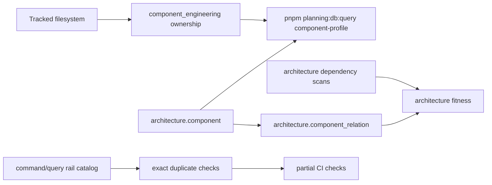
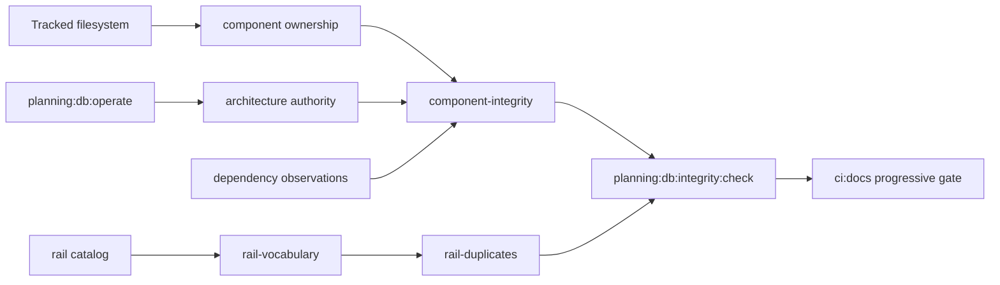

# Planning DB Component Integrity And Rail Vocabulary Plan

## Objective

Convert the Planning DB into the coherent, governed, and queryable source of
truth for the DVT system component map.

This slice must not create parallel systems, side inventories, alternate
formats, or shortcuts outside the database. Writes must pass through governed
`planning:db:operate` rails. Inspections must be exposed through
`planning:db:query`. Stable permanent invariants must be covered by CI.

## Saved Execution Prompt

Objective obligatorio: convertir la Planning DB en la fuente coherente,
gobernada y consultable del mapa de componentes del sistema DVT.

No crear sistemas paralelos, inventarios laterales, formatos alternativos ni
atajos fuera de la BBDD. Toda escritura debe pasar por rails gobernados de
`planning:db:operate`. Toda inspeccion debe exponerse por `planning:db:query`.
Toda regla permanente debe acabar cubierta por CI cuando sea estable.

Rol del agente: actuar como arquitecto, product owner tecnico y reviewer de
integridad. No limitarse a ejecutar literalmente ordenes: debe detectar
contradicciones, deuda oculta, duplicados, drift, falta de sentido de producto,
componentes falsos y relaciones incompletas, y proponer o aplicar la
correccion gobernada.

Reglas de arquitectura:

1. Un componente debe poder responder:
   - que responsabilidad tiene;
   - que ficheros lo forman;
   - que subcomponentes contiene;
   - que comandos implementa;
   - que queries implementa;
   - que puertos expone o consume;
   - que adaptadores usa;
   - que contratos toca;
   - que tests lo validan;
   - que docs/fuentes lo gobiernan;
   - que relaciones tiene con otros componentes;
   - que base Fowler/DDD justifica su existencia;
   - que nivel de madurez tiene.

2. No puede haber rails semanticamente duplicados. Si dos commands/queries
   expresan la misma intencion, debe existir un unico nombre canonico. Los
   nombres antiguos deben pasar por alias, deprecacion o retirada explicita.

3. El vocabulario canonico de commands/queries debe distinguir command vs
   query, bounded context, DDD owner o read model, puerto de aplicacion,
   superficie adaptadora, autorizacion/scope, politica de idempotencia,
   concurrencia o frescura, tests negativos, y estado: proposed, accepted,
   implemented, deprecated, retired.

4. API, UI, CLI, workflow, worker o adapter no son nombres canonicos de rail.
   Son superficies que implementan un rail de dominio o sistema.

Orden de ejecucion obligatorio:

1. Auditar el estado actual de la BBDD: componentes, paths, filesystem real,
   ownership, relaciones, commands, queries, puertos, adaptadores, contratos,
   tests, docs, Fowler/DDD y madurez.
2. Crear o extender el rail de vocabulario unico en BBDD.
3. Crear queries de validacion global y por componente: `component-profile`,
   `component-integrity`, `component-validation`, `rail-vocabulary`,
   `rail-duplicates`, `filesystem-coverage`, `architecture-drift`.
4. Implementar checks de CI progresivos: report/warning para deuda historica,
   hard fail para nuevos duplicados, componentes fantasma o ficheros nuevos sin
   ownership, y hard fail completo cuando el baseline quede saneado.
5. Corregir la BBDD: crear componentes que falten, remapear paths falsos,
   retirar componentes fantasma, dividir componentes demasiado gruesos,
   fusionar duplicados semanticos, aprobar/corregir/retirar relaciones
   propuestas, conectar tests, contratos, adaptadores y docs, y establecer
   alias/deprecaciones para rails antiguos.
6. Establecer criterios de salida medibles: cero ficheros tracked sin
   componente propietario, cero componentes con path inexistente sin
   justificacion explicita, cero commands/queries sin bounded context, cero
   commands/queries sin DDD owner o read model, cero duplicados semanticos
   activos, cero relaciones observadas sin declaracion, cero componentes
   implementados sin evidencia minima de tests/docs, cero rails obsoletos
   activos sin deprecacion o retirada, y cero checks nuevos fuera de CI si son
   invariantes permanentes.
7. Ejecutar ciclo desatendido:
   AUDITAR -> CORREGIR -> VALIDAR -> QA AGRESIVO -> FIX -> REVALIDAR.

QA agresivo: crear o simular un reviewer independiente que falle si encuentra
relaciones incompletas, componentes sin sentido, nombres duplicados, rails
paralelos, filesystem no mapeado, tests no conectados, contratos no trazados,
adaptadores no declarados, Fowler/DDD ausente, o CI sin cobertura del nuevo
invariante.

## Governing Sources

- `AGENTS.md`
- `docs/planning/status/governance-document-rule-inventory.md`
- `docs/guides/ai-work-protocol.md`
- `docs/architecture/command-query-rail-governance.md`
- `docs/architecture/fowler-opportunity-planning-governance.md`
- `docs/concepts/domain-language.md`
- `docs/planning/state/planning-control-tower.md`
- `docs/planning/status/db-surface-inventory.md`
- `docs/adr/adr-0055-planning-db-canonical-operational-source.md`

## Current State



Observed gaps:

- Component profiles exist, but the global integrity posture is not one query.
- Rail duplicate checks are exact-name only and do not classify surface-named or
  semantically duplicated rails.
- Surface-named command/query rails are exposed by `rail-vocabulary` instead of
  hiding inside generic `gap_rail` warnings. The 2026-06-16 API subdivision
  cleanup retired the active `Api*Command`/`Api*Query` aliases in favor of
  domain rails such as `StartRun`, `SignalRun`, `RecoverRun`, `GetRunEvents`,
  and `ListRuns`; the progressive baseline now allows zero active
  `surface_named_rail` findings.
- The 2026-06-16 implemented-reference precedence cleanup made
  `command_query_rail_query` prefer implemented non-gap rail evidence over
  imported documentary gap rows for the same normalized rail, while preserving
  DB-authored local rail precedence. This retired 58 false `gap_rail` findings
  and tightened the progressive baseline from 98 to 40 remaining historical
  gaps.
- Architecture dependency fitness only treats `approved` or `implemented`
  relations as declared, while the operation rail currently starts relations in
  `proposed`.
- Historical debt must be reported without blocking the first baseline, but new
  hard failures must be wired into CI as stable rails.

## Target State



The Planning DB exposes component integrity and rail vocabulary as query-store
read models. CI runs a progressive checker in report mode while historical debt
is still being retired; strict mode becomes the hard baseline once the database
is clean.

## Code Symbol Duplicate Detection Slice

### Objective

Expose repeated or equivalent code functions as Planning DB facts instead of
one-off filesystem scans. The database must be able to answer which code
symbols exist, which files and components own them, which symbols have exact
body duplicates, which symbols have repeated names across components, which
symbols are semantic duplicate candidates, and which governed source references
point to files that no longer exist.

### Execution Plan

1. Add a governed code-symbol snapshot table populated by
   `planning:db:import` during the governance import.
2. Derive symbol ownership from the existing governance file ownership snapshot
   so code symbols inherit component, root, domain, and owning-unit facts from
   the canonical component map.
3. Create DB views:
   - `planning_query_store.code_symbol_inventory_query`
   - `planning_query_store.code_symbol_exact_duplicate_query`
   - `planning_query_store.code_symbol_name_duplicate_query`
   - `planning_query_store.code_symbol_semantic_candidate_query`
   - `planning_query_store.code_symbol_problem_query`
   - `planning_query_store.governed_source_drift_query`
4. Expose the views through `planning:db:query` rails:
   - `code-symbols`
   - `code-symbol-duplicates`
   - `code-symbol-semantic-candidates`
   - `source-drift`
   - `governance-problem-dashboard`
5. Keep CI progressive: the first pass exposes historical code duplication as
   queryable findings, while hard-fail enforcement is reserved for new duplicate
   rail regressions and later baseline tightening.

### Fowler Matrix

| scenario                                                                          | opportunity         | Fowler pattern          | DDD owner                    | command/query rail           | implementation surfaces                                                                          | test                                                                                  | out of scope                                                 |
| --------------------------------------------------------------------------------- | ------------------- | ----------------------- | ---------------------------- | ---------------------------- | ------------------------------------------------------------------------------------------------ | ------------------------------------------------------------------------------------- | ------------------------------------------------------------ |
| Function-equivalent code exists only as ad hoc scanner output.                    | Duplicate semantics | Consolidate read model  | CodeSymbolInventoryReadModel | `InspectCodeSymbolInventory` | `planning_query_store.code_symbols`, `planning:db:query code-symbols`                            | `node --test scripts/planning-db-import.test.cjs scripts/planning-db-query.test.cjs`  | Automated refactoring of duplicate code                      |
| Exact body duplicates and repeated symbol names need component context.           | Duplicate semantics | Derived diagnostic view | CodeSymbolDuplicateReadModel | `DetectCodeSymbolDuplicates` | `planning_query_store.code_symbol_*_duplicate_query`, `planning:db:query code-symbol-duplicates` | `node --test scripts/planning-db-migrate.test.cjs scripts/planning-db-query.test.cjs` | Treating semantic candidates as hard failures before review  |
| DB references can point to removed source files such as historical prompt inputs. | Documentation drift | Drift query             | GovernedSourceDriftReadModel | `DetectGovernedSourceDrift`  | `planning_query_store.governed_source_drift_query`, `planning:db:query source-drift`             | `node --test scripts/planning-db-migrate.test.cjs scripts/planning-db-query.test.cjs` | Deleting historical source rows without retirement rationale |

## Fowler Analysis

| scenario                                                                                                     | opportunity         | Fowler pattern                                       | DDD owner                                | command/query rail                        | implementation surfaces                                                                                                       | test                                                                                    | out of scope                                      |
| ------------------------------------------------------------------------------------------------------------ | ------------------- | ---------------------------------------------------- | ---------------------------------------- | ----------------------------------------- | ----------------------------------------------------------------------------------------------------------------------------- | --------------------------------------------------------------------------------------- | ------------------------------------------------- |
| Component facts are scattered across profiles, architecture authority, file ownership, and dependency scans. | Hidden authority    | Consolidate read model                               | ComponentIntegrityReadModel              | `ValidateComponentIntegrity`              | `planning_query_store.component_integrity_query`, `planning:db:query component-integrity`                                     | `node --test scripts/planning-db-query.test.cjs`                                        | New non-DB inventory format                       |
| Rail catalog catches exact duplicates but misses semantic drift and surface names.                           | Duplicate semantics | Replace implicit convention with explicit vocabulary | RailVocabularyReadModel                  | `ValidateRailVocabulary`                  | `planning_query_store.command_query_rail_vocabulary_query`, `planning:db:query rail-vocabulary`                               | `node --test scripts/planning-db-query.test.cjs scripts/planning-db-migrate.test.cjs`   | Renaming all historical rails in one unsafe edit  |
| Rail projection reports documentary gap rows even when the same rail has implemented manifest refs.          | False gap signal    | Prefer materialized fact over weaker source          | RailVocabularyReadModel                  | `ValidateRailVocabulary`                  | `planning_query_store.command_query_rail_query`, `planning:db:integrity:check`                                                | `node --test scripts/planning-db-migrate.test.cjs`                                      | Direct SQL repair outside migrations              |
| CI has inventory checks but no single progressive component-integrity gate.                                  | Quality gate gap    | Guard clause                                         | PlanningDbIntegrityCheck                 | `CheckPlanningDbComponentIntegrity`       | `scripts/planning-db-integrity-check.cjs`, `package.json`, `scripts/local-validation-plan.cjs`                                | `node --test scripts/planning-db-integrity-check.test.cjs`                              | Blocking historical debt before baseline cleanup  |
| Relations can be recorded only as proposed through the command rail.                                         | Workflow mismatch   | Align command lifecycle with domain state            | ArchitectureRelationCommand              | `RecordArchitectureRelation`              | `scripts/planning-db-operate.cjs`                                                                                             | `node --test scripts/planning-db-operate.test.cjs`                                      | Direct SQL relation updates                       |
| New architecture components can receive authority without query-visible test evidence.                       | Evidence gap        | Complete read model                                  | ArchitectureTestEvidenceCommand          | `RecordArchitectureTestEvidence`          | `architecture.component_test`, `planning:db:query component-profile`, `scripts/planning-db-operate.cjs`                       | `node --test scripts/planning-db-query.test.cjs scripts/planning-db-operate.test.cjs`   | File-only test inference outside the BBDD         |
| Architecture components can have observability maturity gaps without a governed write rail.                  | Evidence gap        | Complete read model                                  | ArchitectureObservabilityEvidenceCommand | `RecordArchitectureObservabilityEvidence` | `architecture.component_observability`, `planning:db:operate architecture-evidence record-observability`                      | `node --test scripts/planning-db-operate.test.cjs scripts/planning-db-migrate.test.cjs` | Direct SQL observability evidence writes          |
| Component profiles can miss DB-owned observability evidence even after maturity consumes it.                 | Hidden authority    | Complete read model                                  | ComponentProfileReadModel                | `ReadComponentProfile`                    | `architecture.component_observability`, `planning:db:query component-profile`                                                 | `node --test scripts/planning-db-query.test.cjs`                                        | Inferring observability from source grep          |
| Existing governance components can have a wrong parent while architecture relations are correct.             | Boundary drift      | Explicit command method                              | GovernanceComponentTreeCommand           | `ReparentGovernanceComponent`             | `planning_query_store.governance_component_reparent_overrides`, `planning_query_store.governance_component_local_definitions` | `node --test scripts/planning-db-operate.test.cjs scripts/planning-db-migrate.test.cjs` | Direct SQL reparent outside `planning:db:operate` |

## Feature Mechanization

```feature-mechanization
version: 1
featureId: PLANNING-DB-COMPONENT-INTEGRITY-VOCABULARY-RAIL-20260612
mechanizationStatus: implemented
noHumanDecisionsRemaining: true
implementationPlan: docs/planning/proposals/mandatory/governance-and-docs/planning-db-component-integrity-vocabulary-rail-plan-20260612.md
componentGuides:
  - docs/architecture/command-query-rail-governance.md
  - docs/architecture/fowler-opportunity-planning-governance.md
userStories:
  - As an architect, I can ask the Planning DB for global component integrity findings.
  - As a product owner, I can see whether commands and queries use one canonical vocabulary.
  - As a reviewer, I can run a CI-backed aggressive QA check against component and rail invariants.
governingSources:
  - AGENTS.md
  - docs/planning/status/governance-document-rule-inventory.md
  - docs/guides/ai-work-protocol.md
  - docs/architecture/command-query-rail-governance.md
  - docs/architecture/fowler-opportunity-planning-governance.md
  - docs/concepts/domain-language.md
  - docs/planning/state/planning-control-tower.md
  - docs/planning/status/db-surface-inventory.md
  - docs/adr/adr-0055-planning-db-canonical-operational-source.md
allowedImplementationSurfaces:
  - docs/planning/proposals/mandatory/governance-and-docs/planning-db-component-integrity-vocabulary-rail-plan-20260612.md
  - docs/planning/proposals/mandatory/runtime-and-contracts/api-governance-subdivision-plan-20260502.md
  - docs/planning/status/db-surface-inventory.md
  - docs/.manifest.json
  - docs/**/index.md
  - .github/PR_INSTRUCTIONS.md
  - apps/web/src/app/components/figma/ImageWithFallback.test.tsx
  - apps/web/src/app/plugins/cost/costContributions.test.ts
  - apps/web/src/app/plugins/monitoring/monitoringContributions.test.ts
  - tools/planning-db/migrations/081_component_integrity_rail_vocabulary.sql
  - tools/planning-db/migrations/082_rail_vocabulary_deprecation_hardening.sql
  - tools/planning-db/migrations/083_architecture_test_evidence_operation_rail.sql
  - tools/planning-db/migrations/084_architecture_observability_evidence_operation_rail.sql
  - tools/planning-db/migrations/085_architecture_maturity_deprecated_components.sql
  - tools/planning-db/migrations/086_component_integrity_architecture_test_evidence.sql
  - tools/planning-db/migrations/087_component_integrity_architecture_metadata_authority.sql
  - tools/planning-db/migrations/099_surface_named_gap_rail_vocabulary.sql
  - tools/planning-db/migrations/100_exclude_surface_named_gap_rails.sql
  - tools/planning-db/migrations/101_prefer_implemented_rail_refs.sql
  - tools/planning-db/migrations/102_governance_component_reparent_operation.sql
  - tools/planning-db/migrations/103_governance_component_reparent_persistent_overlay.sql
  - tools/planning-db/migrations/105_code_symbol_duplicate_queries.sql
  - tools/planning-db/migrations/106_lightweight_governance_problem_dashboard.sql
  - tools/planning-db/migrations/107_retire_tarea_rail_duplicates_and_repoint_sources.sql
  - scripts/planning-db-import.cjs
  - scripts/planning-db/code-symbol-inventory.cjs
  - scripts/planning-db/queries/code-symbol-query.cjs
  - tools/ci/contracts-compat-schema-parity.test.mjs
  - tools/ci/contracts-package-governance.test.mjs
  - tools/ci/github-collaboration-governance.test.mjs
  - tools/ci/planner-package-governance.test.mjs
  - tools/ci/root-test-runner-config.test.mjs
  - scripts/planning-db-query.cjs
  - scripts/planning-db-query.test.cjs
  - scripts/planning-db/queries/component-integrity-query.cjs
  - scripts/planning-db/queries/rail-vocabulary-query.cjs
  - scripts/planning-db-integrity-check.cjs
  - scripts/planning-db-integrity-check.test.cjs
  - scripts/planning-db-migrate.test.cjs
  - scripts/planning-db-operate.cjs
  - scripts/planning-db-operate.test.cjs
  - scripts/planning-db-operate-tests/component-create.test.cjs
  - scripts/planning-db-operate-tests/architecture-parse.test.cjs
  - scripts/planning-db-operate-tests/architecture-plan.test.cjs
  - scripts/planning-db-import.test.cjs
  - scripts/planning-db/command-query-rail-shared.cjs
  - scripts/local-validation-plan.cjs
  - scripts/verify-changed.test.cjs
  - package.json
forbiddenImplementationSurfaces:
  - packages/**
  - specs/contracts/**
commandQueryRails:
  - name: ValidateComponentIntegrity
    type: query
    dddOwner: ComponentIntegrityReadModel
  - name: ValidateComponentFilesystemCoverage
    type: query
    dddOwner: ComponentIntegrityReadModel
  - name: ValidateComponentArchitectureDrift
    type: query
    dddOwner: ComponentIntegrityReadModel
  - name: ReadComponentProfile
    type: query
    dddOwner: ComponentProfileReadModel
  - name: ValidateRailVocabulary
    type: query
    dddOwner: RailVocabularyReadModel
  - name: DetectRailDuplicates
    type: query
    dddOwner: RailVocabularyReadModel
  - name: CheckPlanningDbComponentIntegrity
    type: query
    dddOwner: PlanningDbIntegrityCheck
  - name: RecordArchitectureRelation
    type: command
    dddOwner: ArchitectureRelationCommand
  - name: RecordArchitectureTestEvidence
    type: command
    dddOwner: ArchitectureTestEvidenceCommand
  - name: RecordArchitectureObservabilityEvidence
    type: command
    dddOwner: ArchitectureObservabilityEvidenceCommand
  - name: RecordArchitectureContract
    type: command
    dddOwner: ArchitectureContractCommand
  - name: RecordArchitecturePort
    type: command
    dddOwner: ArchitecturePortCommand
  - name: ReparentGovernanceComponent
    type: command
    dddOwner: GovernanceComponentTreeCommand
  - name: InspectCodeSymbolInventory
    type: query
    dddOwner: CodeSymbolInventoryReadModel
  - name: DetectCodeSymbolDuplicates
    type: query
    dddOwner: CodeSymbolDuplicateReadModel
  - name: DetectGovernedSourceDrift
    type: query
    dddOwner: GovernedSourceDriftReadModel
domainObjects:
  - name: ComponentIntegrityReadModel
    type: read model
    owner: Architecture / Planning DB / CI
  - name: ComponentProfileReadModel
    type: read model
    owner: Architecture / Planning DB / CI
  - name: RailVocabularyReadModel
    type: read model
    owner: Architecture / Planning DB / CI
  - name: PlanningDbIntegrityCheck
    type: CI guard
    owner: Architecture / Planning DB / CI
  - name: ArchitectureRelationCommand
    type: command rail
    owner: Architecture / Planning DB / CI
  - name: ArchitectureTestEvidenceCommand
    type: command rail
    owner: Architecture / Planning DB / CI
  - name: ArchitectureObservabilityEvidenceCommand
    type: command rail
    owner: Architecture / Planning DB / CI
  - name: ArchitectureContractCommand
    type: command rail
    owner: Architecture / Planning DB / CI
  - name: ArchitecturePortCommand
    type: command rail
    owner: Architecture / Planning DB / CI
  - name: GovernanceComponentTreeCommand
    type: command rail
    owner: Architecture / Planning DB / CI
  - name: CodeSymbolInventoryReadModel
    type: read model
    owner: Architecture / Planning DB / CI
  - name: CodeSymbolDuplicateReadModel
    type: read model
    owner: Architecture / Planning DB / CI
  - name: GovernedSourceDriftReadModel
    type: read model
    owner: Architecture / Planning DB / CI
fowlerSignals:
  - Hidden Authority from component health being visible only through several separate queries.
  - Duplicate Semantics from command/query rails sharing intent without one vocabulary check.
  - Parallel Model risk if filesystem coverage is checked outside the Planning DB.
  - Incomplete Evidence risk if tests are written to architecture.component_test but not visible in component-profile.
  - Incomplete Evidence risk if observability facts are written outside architecture.component_observability.
  - Hidden Authority risk if component-profile cannot display observability rows that maturity already consumes.
  - Hidden Authority risk if contracts and command/query ports exist in schema but cannot be written through planning:db:operate.
  - Boundary Drift risk if component parent changes require SQL instead of an audited planning:db:operate rail.
architectureGuards:
  - node --test scripts/planning-db-query.test.cjs scripts/planning-db-migrate.test.cjs scripts/planning-db-integrity-check.test.cjs scripts/planning-db-operate.test.cjs
  - pnpm planning:db:migrate
  - pnpm planning:db:integrity:check
  - pnpm planning:db:query component-integrity --limit 20
  - pnpm planning:db:query rail-vocabulary --limit 20
  - pnpm planning:db:query component-profile --component SYS-WEB-CANVAS-DRAFT-SAVE-STATUS --limit 80
  - pnpm planning:db:query architecture-contracts --limit 20
  - pnpm planning:db:query architecture-io --kind port --limit 20
  - pnpm docs:feature-mechanization:implementation
cypressFlows:
  - N/A - repository governance CLI surface
completionGate:
  - pnpm governance:refresh
  - node --test scripts/planning-db-query.test.cjs scripts/planning-db-migrate.test.cjs scripts/planning-db-integrity-check.test.cjs scripts/planning-db-operate.test.cjs
  - pnpm planning:db:migrate
  - pnpm planning:db:query component-integrity --limit 20
  - pnpm planning:db:query rail-vocabulary --limit 20
  - pnpm planning:db:query component-profile --component SYS-WEB-CANVAS-DRAFT-SAVE-STATUS --limit 80
  - pnpm planning:db:query architecture-contracts --limit 20
  - pnpm planning:db:query architecture-io --kind port --limit 20
  - pnpm planning:db:integrity:check
  - pnpm verify:prepush
redGreenCycles:
  - id: rail-vocabulary-query-store
    redTest: node --test scripts/planning-db-query.test.cjs scripts/planning-db-migrate.test.cjs
    expectedFailure: rail-vocabulary, rail-duplicates, component-integrity, component-validation, filesystem-coverage, and architecture-drift validation queries are missing.
    patchSurfaces:
      - tools/planning-db/migrations/081_component_integrity_rail_vocabulary.sql
      - scripts/planning-db-query.cjs
      - scripts/planning-db/queries/component-integrity-query.cjs
      - scripts/planning-db/queries/rail-vocabulary-query.cjs
      - scripts/planning-db-query.test.cjs
      - scripts/planning-db-migrate.test.cjs
    greenTest: node --test scripts/planning-db-query.test.cjs scripts/planning-db-migrate.test.cjs
  - id: rail-vocabulary-deprecation-hardening
    redTest: node --test scripts/planning-db-migrate.test.cjs scripts/planning-db-operate.test.cjs
    expectedFailure: Retired and deprecated rails still participate in active duplicate checks, and feature mechanization cannot record deprecated or retired rail status.
    patchSurfaces:
      - tools/planning-db/migrations/082_rail_vocabulary_deprecation_hardening.sql
      - scripts/planning-db-operate.cjs
      - scripts/planning-db-operate-tests/feature-mechanization.test.cjs
      - scripts/planning-db-migrate.test.cjs
    greenTest: node --test scripts/planning-db-migrate.test.cjs scripts/planning-db-operate.test.cjs
  - id: planning-db-integrity-ci-check
    redTest: node --test scripts/planning-db-integrity-check.test.cjs
    expectedFailure: Planning DB integrity checker does not exist.
    patchSurfaces:
      - scripts/planning-db-integrity-check.cjs
      - scripts/planning-db-integrity-check.test.cjs
      - package.json
      - scripts/local-validation-plan.cjs
    greenTest: node --test scripts/planning-db-integrity-check.test.cjs
  - id: relation-lifecycle-promotion
    redTest: node --test scripts/planning-db-operate.test.cjs
    expectedFailure: RecordArchitectureRelation rejects approved and implemented relation statuses.
    patchSurfaces:
      - scripts/planning-db-operate.cjs
      - scripts/planning-db-operate-tests/architecture-parse.test.cjs
      - scripts/planning-db-operate-tests/architecture-plan.test.cjs
    greenTest: node --test scripts/planning-db-operate.test.cjs
  - id: architecture-test-evidence-rail
    redTest: node --test scripts/planning-db-query.test.cjs scripts/planning-db-migrate.test.cjs scripts/planning-db-operate.test.cjs
    expectedFailure: Component profile cannot answer which DB-recorded tests validate a component, and planning:db:operate cannot record component test evidence.
    patchSurfaces:
      - tools/planning-db/migrations/083_architecture_test_evidence_operation_rail.sql
      - scripts/planning-db-query.cjs
      - scripts/planning-db-query.test.cjs
      - scripts/planning-db-operate.cjs
      - scripts/planning-db-operate-tests/architecture-parse.test.cjs
      - scripts/planning-db-operate-tests/architecture-plan.test.cjs
      - scripts/planning-db-migrate.test.cjs
    greenTest: node --test scripts/planning-db-query.test.cjs scripts/planning-db-migrate.test.cjs scripts/planning-db-operate.test.cjs
  - id: architecture-observability-evidence-rail
    redTest: node --test scripts/planning-db-operate.test.cjs scripts/planning-db-migrate.test.cjs
    expectedFailure: Planning DB has architecture.component_observability but no governed planning:db:operate rail to record observability evidence.
    patchSurfaces:
      - tools/planning-db/migrations/084_architecture_observability_evidence_operation_rail.sql
      - scripts/planning-db-operate.cjs
      - scripts/planning-db-operate-tests/architecture-parse.test.cjs
      - scripts/planning-db-operate-tests/architecture-plan.test.cjs
      - scripts/planning-db-migrate.test.cjs
    greenTest: node --test scripts/planning-db-operate.test.cjs scripts/planning-db-migrate.test.cjs
  - id: architecture-contract-port-rail
    redTest: node --test scripts/planning-db-query.test.cjs scripts/planning-db-migrate.test.cjs scripts/planning-db-operate.test.cjs
    expectedFailure: Planning DB has architecture.contract and architecture.component_port query surfaces, but no governed planning:db:operate rail can record component contracts or command/query ports.
    patchSurfaces:
      - tools/planning-db/migrations/088_architecture_contract_port_operation_rail.sql
      - scripts/planning-db-operate.cjs
      - scripts/planning-db-query.cjs
      - scripts/planning-db-operate-tests/architecture-parse.test.cjs
      - scripts/planning-db-operate-tests/architecture-plan.test.cjs
      - scripts/planning-db-query.test.cjs
      - scripts/planning-db-migrate.test.cjs
    greenTest: node --test scripts/planning-db-query.test.cjs scripts/planning-db-migrate.test.cjs scripts/planning-db-operate.test.cjs
  - id: component-profile-observability-evidence
    redTest: node --test scripts/planning-db-query.test.cjs
    expectedFailure: component-profile reads DB-owned tests but cannot answer which observability signals validate a component.
    patchSurfaces:
      - scripts/planning-db-query.cjs
      - scripts/planning-db-query.test.cjs
    greenTest: node --test scripts/planning-db-query.test.cjs
  - id: verify-changed-planning-db-integrity-routing
    redTest: node --test scripts/verify-changed.test.cjs
    expectedFailure: verify:changed routes Planning DB migrations through the wrong planningDb group index after adding the integrity gate.
    patchSurfaces:
      - scripts/local-validation-plan.cjs
      - scripts/verify-changed.test.cjs
    greenTest: node --test scripts/verify-changed.test.cjs
  - id: governance-component-reparent-rail
    redTest: node --test scripts/planning-db-operate.test.cjs scripts/planning-db-migrate.test.cjs
    expectedFailure: Existing governance components with corrected architecture relations cannot be reparented through planning:db:operate without SQL.
    patchSurfaces:
      - tools/planning-db/migrations/102_governance_component_reparent_operation.sql
      - tools/planning-db/migrations/103_governance_component_reparent_persistent_overlay.sql
      - scripts/planning-db-operate.cjs
      - scripts/planning-db-operate-tests/component-create.test.cjs
      - scripts/planning-db-migrate.test.cjs
    greenTest: node --test scripts/planning-db-operate.test.cjs scripts/planning-db-migrate.test.cjs
  - id: web-leaf-component-evidence-tests
    redTest: pnpm --filter @dvt/web test:changed
    expectedFailure: Cost, monitoring, and fallback plugin leaf components do not have focused evidence tests attached to the DB component profile.
    patchSurfaces:
      - apps/web/src/app/components/figma/ImageWithFallback.test.tsx
      - apps/web/src/app/plugins/cost/costContributions.test.ts
      - apps/web/src/app/plugins/monitoring/monitoringContributions.test.ts
    greenTest: pnpm --filter @dvt/web test:changed
symbols:
  - name: validateComponentReparentCommand
    path: scripts/planning-db-operate.cjs
    dddOwner: GovernanceComponentTreeCommand
    cqRails:
      - ReparentGovernanceComponent
    fowlerSignals:
      - component parent corrections must be rejected before self-parent drift can be written
    architectureGuard: node --test scripts/planning-db-operate.test.cjs
    cypressCoverage: N/A
    unitTests:
      - scripts/planning-db-operate.test.cjs
  - name: normalizeImportedGovernanceComponent
    path: scripts/planning-db-operate.cjs
    dddOwner: GovernanceComponentTreeCommand
    cqRails:
      - ReparentGovernanceComponent
    fowlerSignals:
      - imported and DB-local component rows share one reparent planning model
    architectureGuard: node --test scripts/planning-db-operate.test.cjs
    cypressCoverage: N/A
    unitTests:
      - scripts/planning-db-operate.test.cjs
  - name: normalizeOperationRevision
    path: scripts/planning-db-operate.cjs
    dddOwner: GovernanceComponentTreeCommand
    cqRails:
      - ReparentGovernanceComponent
    fowlerSignals:
      - audited component reparent operations use one optimistic revision vocabulary
    architectureGuard: node --test scripts/planning-db-operate.test.cjs
    cypressCoverage: N/A
    unitTests:
      - scripts/planning-db-operate.test.cjs
  - name: normalizeUnitPathRows
    path: scripts/planning-db-operate.cjs
    dddOwner: GovernanceComponentTreeCommand
    cqRails:
      - ReparentGovernanceComponent
    fowlerSignals:
      - governance unit paths are rebuilt from the DB read model instead of string shortcuts
    architectureGuard: node --test scripts/planning-db-operate.test.cjs
    cypressCoverage: N/A
    unitTests:
      - scripts/planning-db-operate.test.cjs
  - name: reparentRawComponent
    path: scripts/planning-db-operate.cjs
    dddOwner: GovernanceComponentTreeCommand
    cqRails:
      - ReparentGovernanceComponent
    fowlerSignals:
      - raw component metadata records the governed reparent source without becoming a parallel inventory
    architectureGuard: node --test scripts/planning-db-operate.test.cjs
    cypressCoverage: N/A
    unitTests:
      - scripts/planning-db-operate.test.cjs
  - name: planComponentReparentOperation
    path: scripts/planning-db-operate.cjs
    dddOwner: GovernanceComponentTreeCommand
    cqRails:
      - ReparentGovernanceComponent
    fowlerSignals:
      - component parent drift is planned with a validated parent path before writes
    architectureGuard: node --test scripts/planning-db-operate.test.cjs
    cypressCoverage: N/A
    unitTests:
      - scripts/planning-db-operate.test.cjs
  - name: readGovernanceUnitPath
    path: scripts/planning-db-operate.cjs
    dddOwner: GovernanceComponentTreeCommand
    cqRails:
      - ReparentGovernanceComponent
    fowlerSignals:
      - parent paths are read from governance_unit_query instead of rebuilt from filesystem assumptions
    architectureGuard: node --test scripts/planning-db-operate.test.cjs
    cypressCoverage: N/A
    unitTests:
      - scripts/planning-db-operate.test.cjs
  - name: readImportedGovernanceComponent
    path: scripts/planning-db-operate.cjs
    dddOwner: GovernanceComponentTreeCommand
    cqRails:
      - ReparentGovernanceComponent
    fowlerSignals:
      - imported component rows can be corrected through an audited DB command rail
    architectureGuard: node --test scripts/planning-db-operate.test.cjs
    cypressCoverage: N/A
    unitTests:
      - scripts/planning-db-operate.test.cjs
  - name: readLocalGovernanceComponent
    path: scripts/planning-db-operate.cjs
    dddOwner: GovernanceComponentTreeCommand
    cqRails:
      - ReparentGovernanceComponent
    fowlerSignals:
      - DB-authored component rows use the same reparent rail as imported rows
    architectureGuard: node --test scripts/planning-db-operate.test.cjs
    cypressCoverage: N/A
    unitTests:
      - scripts/planning-db-operate.test.cjs
  - name: readLatestComponentOperation
    path: scripts/planning-db-operate.cjs
    dddOwner: GovernanceComponentTreeCommand
    cqRails:
      - ReparentGovernanceComponent
    fowlerSignals:
      - reparent operations keep revision evidence in the component audit ledger
    architectureGuard: node --test scripts/planning-db-operate.test.cjs
    cypressCoverage: N/A
    unitTests:
      - scripts/planning-db-operate.test.cjs
  - name: writePlannedComponentReparentOperation
    path: scripts/planning-db-operate.cjs
    dddOwner: GovernanceComponentTreeCommand
    cqRails:
      - ReparentGovernanceComponent
    fowlerSignals:
      - component reparent writes and audit rows are persisted together
    architectureGuard: node --test scripts/planning-db-operate.test.cjs
    cypressCoverage: N/A
    unitTests:
      - scripts/planning-db-operate.test.cjs
  - name: applyComponentReparentOperation
    path: scripts/planning-db-operate.cjs
    dddOwner: GovernanceComponentTreeCommand
    cqRails:
      - ReparentGovernanceComponent
    fowlerSignals:
      - planning:db:operate exposes component tree corrections without SQL bypasses
    architectureGuard: node --test scripts/planning-db-operate.test.cjs
    cypressCoverage: N/A
    unitTests:
      - scripts/planning-db-operate.test.cjs
  - name: createComponentIntegrityReadModelComponent
    path: scripts/planning-db/queries/component-integrity-query.cjs
    dddOwner: ComponentIntegrityReadModel
    cqRails:
      - ValidateComponentIntegrity
      - ValidateComponentFilesystemCoverage
      - ValidateComponentArchitectureDrift
    fowlerSignals:
      - component integrity facts are one DB query rail
    architectureGuard: node --test scripts/planning-db-query.test.cjs
    cypressCoverage: N/A
    unitTests:
      - scripts/planning-db-query.test.cjs
  - name: createRailVocabularyReadModelComponent
    path: scripts/planning-db/queries/rail-vocabulary-query.cjs
    dddOwner: RailVocabularyReadModel
    cqRails:
      - ValidateRailVocabulary
      - DetectRailDuplicates
    fowlerSignals:
      - semantic rail vocabulary facts are one DB query rail
    architectureGuard: node --test scripts/planning-db-query.test.cjs
    cypressCoverage: N/A
    unitTests:
      - scripts/planning-db-query.test.cjs
  - name: evaluatePlanningDbIntegrity
    path: scripts/planning-db-integrity-check.cjs
    dddOwner: PlanningDbIntegrityCheck
    cqRails:
      - CheckPlanningDbComponentIntegrity
    fowlerSignals:
      - CI consumes the DB integrity read model
    architectureGuard: node --test scripts/planning-db-integrity-check.test.cjs
    cypressCoverage: N/A
    unitTests:
      - scripts/planning-db-integrity-check.test.cjs
  - name: validateArchitectureRelationRecordStatus
    path: scripts/planning-db-operate.cjs
    dddOwner: ArchitectureRelationCommand
    cqRails:
      - RecordArchitectureRelation
    fowlerSignals:
      - command rail lifecycle matches architecture relation lifecycle
    architectureGuard: node --test scripts/planning-db-operate.test.cjs
    cypressCoverage: N/A
    unitTests:
      - scripts/planning-db-operate.test.cjs
  - name: recordArchitectureTestEvidence
    path: scripts/planning-db-operate.cjs
    dddOwner: ArchitectureTestEvidenceCommand
    cqRails:
      - RecordArchitectureTestEvidence
    fowlerSignals:
      - component test evidence is written through a governed Planning DB command rail
    architectureGuard: node --test scripts/planning-db-operate.test.cjs
    cypressCoverage: N/A
    unitTests:
      - scripts/planning-db-operate.test.cjs
  - name: exposeArchitectureTestEvidenceInComponentProfile
    path: scripts/planning-db-query.cjs
    dddOwner: ComponentIntegrityReadModel
    cqRails:
      - ValidateComponentIntegrity
    fowlerSignals:
      - component-profile answers tests from architecture.component_test instead of filesystem inference
    architectureGuard: node --test scripts/planning-db-query.test.cjs
    cypressCoverage: N/A
    unitTests:
      - scripts/planning-db-query.test.cjs
  - name: allowedArchitectureContractCompatibilities
    path: scripts/planning-db-operate.cjs
    dddOwner: ArchitectureContractCommand
    cqRails:
      - RecordArchitectureContract
    fowlerSignals:
      - contract command vocabulary mirrors architecture.contract compatibility constraints
    architectureGuard: node --test scripts/planning-db-operate.test.cjs
    cypressCoverage: N/A
    unitTests:
      - scripts/planning-db-operate.test.cjs
  - name: allowedArchitectureContractKinds
    path: scripts/planning-db-operate.cjs
    dddOwner: ArchitectureContractCommand
    cqRails:
      - RecordArchitectureContract
    fowlerSignals:
      - contract kind vocabulary is explicit before command execution
    architectureGuard: node --test scripts/planning-db-operate.test.cjs
    cypressCoverage: N/A
    unitTests:
      - scripts/planning-db-operate.test.cjs
  - name: allowedArchitectureContractStatuses
    path: scripts/planning-db-operate.cjs
    dddOwner: ArchitectureContractCommand
    cqRails:
      - RecordArchitectureContract
    fowlerSignals:
      - contract lifecycle vocabulary matches architecture.contract
    architectureGuard: node --test scripts/planning-db-operate.test.cjs
    cypressCoverage: N/A
    unitTests:
      - scripts/planning-db-operate.test.cjs
  - name: allowedArchitecturePortDirections
    path: scripts/planning-db-operate.cjs
    dddOwner: ArchitecturePortCommand
    cqRails:
      - RecordArchitecturePort
    fowlerSignals:
      - port direction vocabulary is explicit before command execution
    architectureGuard: node --test scripts/planning-db-operate.test.cjs
    cypressCoverage: N/A
    unitTests:
      - scripts/planning-db-operate.test.cjs
  - name: allowedArchitecturePortKinds
    path: scripts/planning-db-operate.cjs
    dddOwner: ArchitecturePortCommand
    cqRails:
      - RecordArchitecturePort
    fowlerSignals:
      - command/query/API port vocabulary is canonical
    architectureGuard: node --test scripts/planning-db-operate.test.cjs
    cypressCoverage: N/A
    unitTests:
      - scripts/planning-db-operate.test.cjs
  - name: allowedArchitecturePortStatuses
    path: scripts/planning-db-operate.cjs
    dddOwner: ArchitecturePortCommand
    cqRails:
      - RecordArchitecturePort
    fowlerSignals:
      - port lifecycle vocabulary matches architecture.component_port
    architectureGuard: node --test scripts/planning-db-operate.test.cjs
    cypressCoverage: N/A
    unitTests:
      - scripts/planning-db-operate.test.cjs
  - name: applyArchitectureContractRecordOperation
    path: scripts/planning-db-operate.cjs
    dddOwner: ArchitectureContractCommand
    cqRails:
      - RecordArchitectureContract
    fowlerSignals:
      - contract writes go through the audited Planning DB operation rail
    architectureGuard: node --test scripts/planning-db-operate.test.cjs
    cypressCoverage: N/A
    unitTests:
      - scripts/planning-db-operate.test.cjs
  - name: applyArchitecturePortRecordOperation
    path: scripts/planning-db-operate.cjs
    dddOwner: ArchitecturePortCommand
    cqRails:
      - RecordArchitecturePort
    fowlerSignals:
      - port writes go through the audited Planning DB operation rail
    architectureGuard: node --test scripts/planning-db-operate.test.cjs
    cypressCoverage: N/A
    unitTests:
      - scripts/planning-db-operate.test.cjs
  - name: architectureListOptionKeys
    path: scripts/planning-db-operate.cjs
    dddOwner: ArchitecturePortCommand
    cqRails:
      - RecordArchitecturePort
    fowlerSignals:
      - repeated negative-test flags are parsed as command evidence
    architectureGuard: node --test scripts/planning-db-operate.test.cjs
    cypressCoverage: N/A
    unitTests:
      - scripts/planning-db-operate.test.cjs
  - name: normalizeArchitectureContract
    path: scripts/planning-db-operate.cjs
    dddOwner: ArchitectureContractCommand
    cqRails:
      - RecordArchitectureContract
    fowlerSignals:
      - contract existence checks are normalized before planning create/update scope
    architectureGuard: node --test scripts/planning-db-operate.test.cjs
    cypressCoverage: N/A
    unitTests:
      - scripts/planning-db-operate.test.cjs
  - name: normalizeArchitecturePort
    path: scripts/planning-db-operate.cjs
    dddOwner: ArchitecturePortCommand
    cqRails:
      - RecordArchitecturePort
    fowlerSignals:
      - port existence checks are normalized before planning create/update scope
    architectureGuard: node --test scripts/planning-db-operate.test.cjs
    cypressCoverage: N/A
    unitTests:
      - scripts/planning-db-operate.test.cjs
  - name: parseArchitectureContractCommand
    path: scripts/planning-db-operate.cjs
    dddOwner: ArchitectureContractCommand
    cqRails:
      - RecordArchitectureContract
    fowlerSignals:
      - contract command arguments are typed before DB writes
    architectureGuard: node --test scripts/planning-db-operate.test.cjs
    cypressCoverage: N/A
    unitTests:
      - scripts/planning-db-operate.test.cjs
  - name: parseArchitecturePortCommand
    path: scripts/planning-db-operate.cjs
    dddOwner: ArchitecturePortCommand
    cqRails:
      - RecordArchitecturePort
    fowlerSignals:
      - port command arguments are typed before DB writes
    architectureGuard: node --test scripts/planning-db-operate.test.cjs
    cypressCoverage: N/A
    unitTests:
      - scripts/planning-db-operate.test.cjs
  - name: planArchitectureContractRecordOperation
    path: scripts/planning-db-operate.cjs
    dddOwner: ArchitectureContractCommand
    cqRails:
      - RecordArchitectureContract
    fowlerSignals:
      - contract records require design scope and owner component authority
    architectureGuard: node --test scripts/planning-db-operate.test.cjs
    cypressCoverage: N/A
    unitTests:
      - scripts/planning-db-operate.test.cjs
  - name: planArchitecturePortRecordOperation
    path: scripts/planning-db-operate.cjs
    dddOwner: ArchitecturePortCommand
    cqRails:
      - RecordArchitecturePort
    fowlerSignals:
      - port records require design scope, component authority, contracts, and negative tests
    architectureGuard: node --test scripts/planning-db-operate.test.cjs
    cypressCoverage: N/A
    unitTests:
      - scripts/planning-db-operate.test.cjs
  - name: readArchitectureContract
    path: scripts/planning-db-operate.cjs
    dddOwner: ArchitectureContractCommand
    cqRails:
      - RecordArchitectureContract
    fowlerSignals:
      - command planning checks existing contract authority before writes
    architectureGuard: node --test scripts/planning-db-operate.test.cjs
    cypressCoverage: N/A
    unitTests:
      - scripts/planning-db-operate.test.cjs
  - name: readArchitecturePort
    path: scripts/planning-db-operate.cjs
    dddOwner: ArchitecturePortCommand
    cqRails:
      - RecordArchitecturePort
    fowlerSignals:
      - command planning checks existing port authority before writes
    architectureGuard: node --test scripts/planning-db-operate.test.cjs
    cypressCoverage: N/A
    unitTests:
      - scripts/planning-db-operate.test.cjs
  - name: validateArchitectureContractCompatibility
    path: scripts/planning-db-operate.cjs
    dddOwner: ArchitectureContractCommand
    cqRails:
      - RecordArchitectureContract
    fowlerSignals:
      - contract compatibility values are rejected before SQL constraints
    architectureGuard: node --test scripts/planning-db-operate.test.cjs
    cypressCoverage: N/A
    unitTests:
      - scripts/planning-db-operate.test.cjs
  - name: validateArchitectureContractId
    path: scripts/planning-db-operate.cjs
    dddOwner: ArchitectureContractCommand
    cqRails:
      - RecordArchitectureContract
    fowlerSignals:
      - contract IDs use canonical CONTRACT-* vocabulary
    architectureGuard: node --test scripts/planning-db-operate.test.cjs
    cypressCoverage: N/A
    unitTests:
      - scripts/planning-db-operate.test.cjs
  - name: validateArchitectureContractKind
    path: scripts/planning-db-operate.cjs
    dddOwner: ArchitectureContractCommand
    cqRails:
      - RecordArchitectureContract
    fowlerSignals:
      - contract kind values are rejected before SQL constraints
    architectureGuard: node --test scripts/planning-db-operate.test.cjs
    cypressCoverage: N/A
    unitTests:
      - scripts/planning-db-operate.test.cjs
  - name: validateArchitectureContractRecordCommand
    path: scripts/planning-db-operate.cjs
    dddOwner: ArchitectureContractCommand
    cqRails:
      - RecordArchitectureContract
    fowlerSignals:
      - contract records cannot omit owner, reference, source, or validation command
    architectureGuard: node --test scripts/planning-db-operate.test.cjs
    cypressCoverage: N/A
    unitTests:
      - scripts/planning-db-operate.test.cjs
  - name: validateArchitectureContractStatus
    path: scripts/planning-db-operate.cjs
    dddOwner: ArchitectureContractCommand
    cqRails:
      - RecordArchitectureContract
    fowlerSignals:
      - contract lifecycle values are rejected before SQL constraints
    architectureGuard: node --test scripts/planning-db-operate.test.cjs
    cypressCoverage: N/A
    unitTests:
      - scripts/planning-db-operate.test.cjs
  - name: validateArchitecturePortDirection
    path: scripts/planning-db-operate.cjs
    dddOwner: ArchitecturePortCommand
    cqRails:
      - RecordArchitecturePort
    fowlerSignals:
      - port direction values are rejected before SQL constraints
    architectureGuard: node --test scripts/planning-db-operate.test.cjs
    cypressCoverage: N/A
    unitTests:
      - scripts/planning-db-operate.test.cjs
  - name: validateArchitecturePortId
    path: scripts/planning-db-operate.cjs
    dddOwner: ArchitecturePortCommand
    cqRails:
      - RecordArchitecturePort
    fowlerSignals:
      - port IDs use canonical PORT-* vocabulary
    architectureGuard: node --test scripts/planning-db-operate.test.cjs
    cypressCoverage: N/A
    unitTests:
      - scripts/planning-db-operate.test.cjs
  - name: validateArchitecturePortKind
    path: scripts/planning-db-operate.cjs
    dddOwner: ArchitecturePortCommand
    cqRails:
      - RecordArchitecturePort
    fowlerSignals:
      - port kind values distinguish command, query, event, storage, API, and UI-action
    architectureGuard: node --test scripts/planning-db-operate.test.cjs
    cypressCoverage: N/A
    unitTests:
      - scripts/planning-db-operate.test.cjs
  - name: validateArchitecturePortRecordCommand
    path: scripts/planning-db-operate.cjs
    dddOwner: ArchitecturePortCommand
    cqRails:
      - RecordArchitecturePort
    fowlerSignals:
      - port records require contracts and negative tests before DB writes
    architectureGuard: node --test scripts/planning-db-operate.test.cjs
    cypressCoverage: N/A
    unitTests:
      - scripts/planning-db-operate.test.cjs
  - name: validateArchitecturePortStatus
    path: scripts/planning-db-operate.cjs
    dddOwner: ArchitecturePortCommand
    cqRails:
      - RecordArchitecturePort
    fowlerSignals:
      - port lifecycle values are rejected before SQL constraints
    architectureGuard: node --test scripts/planning-db-operate.test.cjs
    cypressCoverage: N/A
    unitTests:
      - scripts/planning-db-operate.test.cjs
  - name: writePlannedArchitectureContractRecordOperation
    path: scripts/planning-db-operate.cjs
    dddOwner: ArchitectureContractCommand
    cqRails:
      - RecordArchitectureContract
    fowlerSignals:
      - contract command plans persist through architecture.contract and architecture.design_operations
    architectureGuard: node --test scripts/planning-db-operate.test.cjs
    cypressCoverage: N/A
    unitTests:
      - scripts/planning-db-operate.test.cjs
  - name: writePlannedArchitecturePortRecordOperation
    path: scripts/planning-db-operate.cjs
    dddOwner: ArchitecturePortCommand
    cqRails:
      - RecordArchitecturePort
    fowlerSignals:
      - port command plans persist through architecture.component_port and architecture.design_operations
    architectureGuard: node --test scripts/planning-db-operate.test.cjs
    cypressCoverage: N/A
    unitTests:
      - scripts/planning-db-operate.test.cjs
  - name: baselineBudgetFor
    path: scripts/planning-db-integrity-check.cjs
    dddOwner: PlanningDbIntegrityCheck
    cqRails:
      - CheckPlanningDbComponentIntegrity
    fowlerSignals:
      - progressive baseline separates accepted historical debt from new regressions
    architectureGuard: node --test scripts/planning-db-integrity-check.test.cjs
    cypressCoverage: N/A
    unitTests:
      - scripts/planning-db-integrity-check.test.cjs
  - name: blankSeverityCounts
    path: scripts/planning-db-integrity-check.cjs
    dddOwner: PlanningDbIntegrityCheck
    cqRails:
      - CheckPlanningDbComponentIntegrity
    fowlerSignals:
      - integrity findings use one severity vocabulary
    architectureGuard: node --test scripts/planning-db-integrity-check.test.cjs
    cypressCoverage: N/A
    unitTests:
      - scripts/planning-db-integrity-check.test.cjs
  - name: buildIntegrityCheckResult
    path: scripts/planning-db-integrity-check.cjs
    dddOwner: PlanningDbIntegrityCheck
    cqRails:
      - CheckPlanningDbComponentIntegrity
    fowlerSignals:
      - CI consumes DB read models as one integrity result
    architectureGuard: node --test scripts/planning-db-integrity-check.test.cjs
    cypressCoverage: N/A
    unitTests:
      - scripts/planning-db-integrity-check.test.cjs
  - name: buildProgressiveBaselineViolations
    path: scripts/planning-db-integrity-check.cjs
    dddOwner: PlanningDbIntegrityCheck
    cqRails:
      - CheckPlanningDbComponentIntegrity
    fowlerSignals:
      - new violations fail while historical debt remains visible
    architectureGuard: node --test scripts/planning-db-integrity-check.test.cjs
    cypressCoverage: N/A
    unitTests:
      - scripts/planning-db-integrity-check.test.cjs
  - name: countRowsByKindAndSeverity
    path: scripts/planning-db-integrity-check.cjs
    dddOwner: PlanningDbIntegrityCheck
    cqRails:
      - CheckPlanningDbComponentIntegrity
    fowlerSignals:
      - grouped counts make QA findings measurable
    architectureGuard: node --test scripts/planning-db-integrity-check.test.cjs
    cypressCoverage: N/A
    unitTests:
      - scripts/planning-db-integrity-check.test.cjs
  - name: countRowsBySeverity
    path: scripts/planning-db-integrity-check.cjs
    dddOwner: PlanningDbIntegrityCheck
    cqRails:
      - CheckPlanningDbComponentIntegrity
    fowlerSignals:
      - severity counts provide stable CI summary output
    architectureGuard: node --test scripts/planning-db-integrity-check.test.cjs
    cypressCoverage: N/A
    unitTests:
      - scripts/planning-db-integrity-check.test.cjs
  - name: databaseUrl
    path: scripts/planning-db-integrity-check.cjs
    dddOwner: PlanningDbIntegrityCheck
    cqRails:
      - CheckPlanningDbComponentIntegrity
    fowlerSignals:
      - integrity check uses the canonical Planning DB connection source
    architectureGuard: node --test scripts/planning-db-integrity-check.test.cjs
    cypressCoverage: N/A
    unitTests:
      - scripts/planning-db-integrity-check.test.cjs
  - name: formatCountLine
    path: scripts/planning-db-integrity-check.cjs
    dddOwner: PlanningDbIntegrityCheck
    cqRails:
      - CheckPlanningDbComponentIntegrity
    fowlerSignals:
      - operator output exposes measurable integrity counts
    architectureGuard: node --test scripts/planning-db-integrity-check.test.cjs
    cypressCoverage: N/A
    unitTests:
      - scripts/planning-db-integrity-check.test.cjs
  - name: formatIntegrityCheckSummary
    path: scripts/planning-db-integrity-check.cjs
    dddOwner: PlanningDbIntegrityCheck
    cqRails:
      - CheckPlanningDbComponentIntegrity
    fowlerSignals:
      - QA output remains deterministic and reviewable
    architectureGuard: node --test scripts/planning-db-integrity-check.test.cjs
    cypressCoverage: N/A
    unitTests:
      - scripts/planning-db-integrity-check.test.cjs
  - name: hasBlockingFinding
    path: scripts/planning-db-integrity-check.cjs
    dddOwner: PlanningDbIntegrityCheck
    cqRails:
      - CheckPlanningDbComponentIntegrity
    fowlerSignals:
      - blocker and error findings map to hard CI failure
    architectureGuard: node --test scripts/planning-db-integrity-check.test.cjs
    cypressCoverage: N/A
    unitTests:
      - scripts/planning-db-integrity-check.test.cjs
  - name: helpText
    path: scripts/planning-db-integrity-check.cjs
    dddOwner: PlanningDbIntegrityCheck
    cqRails:
      - CheckPlanningDbComponentIntegrity
    fowlerSignals:
      - command rail exposes operator usage without alternate docs
    architectureGuard: node --test scripts/planning-db-integrity-check.test.cjs
    cypressCoverage: N/A
    unitTests:
      - scripts/planning-db-integrity-check.test.cjs
  - name: main
    path: scripts/planning-db-integrity-check.cjs
    dddOwner: PlanningDbIntegrityCheck
    cqRails:
      - CheckPlanningDbComponentIntegrity
    fowlerSignals:
      - CI adapter invokes the Planning DB integrity rail
    architectureGuard: node --test scripts/planning-db-integrity-check.test.cjs
    cypressCoverage: N/A
    unitTests:
      - scripts/planning-db-integrity-check.test.cjs
  - name: parseArgs
    path: scripts/planning-db-integrity-check.cjs
    dddOwner: PlanningDbIntegrityCheck
    cqRails:
      - CheckPlanningDbComponentIntegrity
    fowlerSignals:
      - strict and report modes are explicit rail options
    architectureGuard: node --test scripts/planning-db-integrity-check.test.cjs
    cypressCoverage: N/A
    unitTests:
      - scripts/planning-db-integrity-check.test.cjs
  - name: progressiveBaseline
    path: scripts/planning-db-integrity-check.cjs
    dddOwner: PlanningDbIntegrityCheck
    cqRails:
      - CheckPlanningDbComponentIntegrity
    fowlerSignals:
      - historical debt is visible without accepting new regressions
    architectureGuard: node --test scripts/planning-db-integrity-check.test.cjs
    cypressCoverage: N/A
    unitTests:
      - scripts/planning-db-integrity-check.test.cjs
  - name: runIntegrityCheck
    path: scripts/planning-db-integrity-check.cjs
    dddOwner: PlanningDbIntegrityCheck
    cqRails:
      - CheckPlanningDbComponentIntegrity
    fowlerSignals:
      - CI checks component integrity and rail vocabulary through DB reads
    architectureGuard: node --test scripts/planning-db-integrity-check.test.cjs
    cypressCoverage: N/A
    unitTests:
      - scripts/planning-db-integrity-check.test.cjs
  - name: severityOrder
    path: scripts/planning-db-integrity-check.cjs
    dddOwner: PlanningDbIntegrityCheck
    cqRails:
      - CheckPlanningDbComponentIntegrity
    fowlerSignals:
      - findings share one severity ordering
    architectureGuard: node --test scripts/planning-db-integrity-check.test.cjs
    cypressCoverage: N/A
    unitTests:
      - scripts/planning-db-integrity-check.test.cjs
  - name: shouldFailIntegrityCheck
    path: scripts/planning-db-integrity-check.cjs
    dddOwner: PlanningDbIntegrityCheck
    cqRails:
      - CheckPlanningDbComponentIntegrity
    fowlerSignals:
      - progressive and strict mode failures are centralized
    architectureGuard: node --test scripts/planning-db-integrity-check.test.cjs
    cypressCoverage: N/A
    unitTests:
      - scripts/planning-db-integrity-check.test.cjs
  - name: allowedArchitectureTestCoverageLevels
    path: scripts/planning-db-operate.cjs
    dddOwner: ArchitectureTestEvidenceCommand
    cqRails:
      - RecordArchitectureTestEvidence
    fowlerSignals:
      - test evidence uses canonical architecture coverage vocabulary
    architectureGuard: node --test scripts/planning-db-operate.test.cjs
    cypressCoverage: N/A
    unitTests:
      - scripts/planning-db-operate.test.cjs
  - name: allowedArchitectureTestKinds
    path: scripts/planning-db-operate.cjs
    dddOwner: ArchitectureTestEvidenceCommand
    cqRails:
      - RecordArchitectureTestEvidence
    fowlerSignals:
      - test evidence uses canonical architecture test kind vocabulary
    architectureGuard: node --test scripts/planning-db-operate.test.cjs
    cypressCoverage: N/A
    unitTests:
      - scripts/planning-db-operate.test.cjs
  - name: allowedArchitectureObservabilitySignalKinds
    path: scripts/planning-db-operate.cjs
    dddOwner: ArchitectureObservabilityEvidenceCommand
    cqRails:
      - RecordArchitectureObservabilityEvidence
    fowlerSignals:
      - observability evidence uses canonical architecture signal vocabulary
    architectureGuard: node --test scripts/planning-db-operate.test.cjs
    cypressCoverage: N/A
    unitTests:
      - scripts/planning-db-operate.test.cjs
  - name: allowedArchitectureObservabilityStatuses
    path: scripts/planning-db-operate.cjs
    dddOwner: ArchitectureObservabilityEvidenceCommand
    cqRails:
      - RecordArchitectureObservabilityEvidence
    fowlerSignals:
      - observability evidence uses canonical lifecycle vocabulary
    architectureGuard: node --test scripts/planning-db-operate.test.cjs
    cypressCoverage: N/A
    unitTests:
      - scripts/planning-db-operate.test.cjs
  - name: applyArchitectureTestRecordOperation
    path: scripts/planning-db-operate.cjs
    dddOwner: ArchitectureTestEvidenceCommand
    cqRails:
      - RecordArchitectureTestEvidence
    fowlerSignals:
      - component test evidence writes pass through planning:db:operate
    architectureGuard: node --test scripts/planning-db-operate.test.cjs
    cypressCoverage: N/A
    unitTests:
      - scripts/planning-db-operate.test.cjs
  - name: applyArchitectureObservabilityRecordOperation
    path: scripts/planning-db-operate.cjs
    dddOwner: ArchitectureObservabilityEvidenceCommand
    cqRails:
      - RecordArchitectureObservabilityEvidence
    fowlerSignals:
      - component observability evidence writes pass through planning:db:operate
    architectureGuard: node --test scripts/planning-db-operate.test.cjs
    cypressCoverage: N/A
    unitTests:
      - scripts/planning-db-operate.test.cjs
  - name: parseArchitectureEvidenceCommand
    path: scripts/planning-db-operate.cjs
    dddOwner: ArchitectureTestEvidenceCommand
    cqRails:
      - RecordArchitectureTestEvidence
    fowlerSignals:
      - architecture evidence command parsing stays on the existing operate rail
    architectureGuard: node --test scripts/planning-db-operate.test.cjs
    cypressCoverage: N/A
    unitTests:
      - scripts/planning-db-operate.test.cjs
  - name: planArchitectureTestRecordOperation
    path: scripts/planning-db-operate.cjs
    dddOwner: ArchitectureTestEvidenceCommand
    cqRails:
      - RecordArchitectureTestEvidence
    fowlerSignals:
      - test evidence has an auditable planned operation before write
    architectureGuard: node --test scripts/planning-db-operate.test.cjs
    cypressCoverage: N/A
    unitTests:
      - scripts/planning-db-operate.test.cjs
  - name: readArchitectureObservability
    path: scripts/planning-db-operate.cjs
    dddOwner: ArchitectureObservabilityEvidenceCommand
    cqRails:
      - RecordArchitectureObservabilityEvidence
    fowlerSignals:
      - idempotent observability evidence updates compare existing DB state
    architectureGuard: node --test scripts/planning-db-operate.test.cjs
    cypressCoverage: N/A
    unitTests:
      - scripts/planning-db-operate.test.cjs
  - name: readArchitectureTest
    path: scripts/planning-db-operate.cjs
    dddOwner: ArchitectureTestEvidenceCommand
    cqRails:
      - RecordArchitectureTestEvidence
    fowlerSignals:
      - idempotent evidence updates compare existing DB state
    architectureGuard: node --test scripts/planning-db-operate.test.cjs
    cypressCoverage: N/A
    unitTests:
      - scripts/planning-db-operate.test.cjs
  - name: validateArchitectureObservabilityId
    path: scripts/planning-db-operate.cjs
    dddOwner: ArchitectureObservabilityEvidenceCommand
    cqRails:
      - RecordArchitectureObservabilityEvidence
    fowlerSignals:
      - observability identity is validated before evidence writes
    architectureGuard: node --test scripts/planning-db-operate.test.cjs
    cypressCoverage: N/A
    unitTests:
      - scripts/planning-db-operate.test.cjs
  - name: validateArchitectureObservabilityRecordCommand
    path: scripts/planning-db-operate.cjs
    dddOwner: ArchitectureObservabilityEvidenceCommand
    cqRails:
      - RecordArchitectureObservabilityEvidence
    fowlerSignals:
      - required observability evidence command fields are validated before write
    architectureGuard: node --test scripts/planning-db-operate.test.cjs
    cypressCoverage: N/A
    unitTests:
      - scripts/planning-db-operate.test.cjs
  - name: validateArchitectureObservabilitySignalKind
    path: scripts/planning-db-operate.cjs
    dddOwner: ArchitectureObservabilityEvidenceCommand
    cqRails:
      - RecordArchitectureObservabilityEvidence
    fowlerSignals:
      - invalid observability signal vocabulary is rejected before write
    architectureGuard: node --test scripts/planning-db-operate.test.cjs
    cypressCoverage: N/A
    unitTests:
      - scripts/planning-db-operate.test.cjs
  - name: validateArchitectureObservabilityStatus
    path: scripts/planning-db-operate.cjs
    dddOwner: ArchitectureObservabilityEvidenceCommand
    cqRails:
      - RecordArchitectureObservabilityEvidence
    fowlerSignals:
      - invalid observability lifecycle vocabulary is rejected before write
    architectureGuard: node --test scripts/planning-db-operate.test.cjs
    cypressCoverage: N/A
    unitTests:
      - scripts/planning-db-operate.test.cjs
  - name: validateArchitectureTestCoverageLevel
    path: scripts/planning-db-operate.cjs
    dddOwner: ArchitectureTestEvidenceCommand
    cqRails:
      - RecordArchitectureTestEvidence
    fowlerSignals:
      - invalid coverage vocabulary is rejected before write
    architectureGuard: node --test scripts/planning-db-operate.test.cjs
    cypressCoverage: N/A
    unitTests:
      - scripts/planning-db-operate.test.cjs
  - name: validateArchitectureTestId
    path: scripts/planning-db-operate.cjs
    dddOwner: ArchitectureTestEvidenceCommand
    cqRails:
      - RecordArchitectureTestEvidence
    fowlerSignals:
      - test identity is validated before evidence writes
    architectureGuard: node --test scripts/planning-db-operate.test.cjs
    cypressCoverage: N/A
    unitTests:
      - scripts/planning-db-operate.test.cjs
  - name: validateArchitectureTestKind
    path: scripts/planning-db-operate.cjs
    dddOwner: ArchitectureTestEvidenceCommand
    cqRails:
      - RecordArchitectureTestEvidence
    fowlerSignals:
      - invalid test kind vocabulary is rejected before write
    architectureGuard: node --test scripts/planning-db-operate.test.cjs
    cypressCoverage: N/A
    unitTests:
      - scripts/planning-db-operate.test.cjs
  - name: validateArchitectureTestRecordCommand
    path: scripts/planning-db-operate.cjs
    dddOwner: ArchitectureTestEvidenceCommand
    cqRails:
      - RecordArchitectureTestEvidence
    fowlerSignals:
      - required test evidence command fields are validated before write
    architectureGuard: node --test scripts/planning-db-operate.test.cjs
    cypressCoverage: N/A
    unitTests:
      - scripts/planning-db-operate.test.cjs
  - name: writePlannedArchitectureTestRecordOperation
    path: scripts/planning-db-operate.cjs
    dddOwner: ArchitectureTestEvidenceCommand
    cqRails:
      - RecordArchitectureTestEvidence
    fowlerSignals:
      - evidence writes persist test rows and operation audit together
    architectureGuard: node --test scripts/planning-db-operate.test.cjs
    cypressCoverage: N/A
    unitTests:
      - scripts/planning-db-operate.test.cjs
  - name: insertCodeSymbolSnapshot
    path: scripts/planning-db-import.cjs
    dddOwner: CodeSymbolInventoryReadModel
    cqRails:
      - InspectCodeSymbolInventory
      - DetectCodeSymbolDuplicates
    fowlerSignals:
      - code symbol facts are persisted through the Planning DB import rail instead of an external scan
    architectureGuard: node --test scripts/planning-db-import.test.cjs scripts/planning-db-query.test.cjs
    cypressCoverage: N/A
    unitTests:
      - scripts/planning-db-import.test.cjs
      - scripts/planning-db-query.test.cjs
  - name: crypto
    path: scripts/planning-db/code-symbol-inventory.cjs
    dddOwner: CodeSymbolInventoryReadModel
    cqRails:
      - InspectCodeSymbolInventory
      - DetectCodeSymbolDuplicates
    fowlerSignals:
      - duplicate code detection uses deterministic hashes imported into the Planning DB
    architectureGuard: node --test scripts/planning-db-import.test.cjs scripts/planning-db-query.test.cjs
    cypressCoverage: N/A
    unitTests:
      - scripts/planning-db-import.test.cjs
      - scripts/planning-db-query.test.cjs
  - name: fs
    path: scripts/planning-db/code-symbol-inventory.cjs
    dddOwner: CodeSymbolInventoryReadModel
    cqRails:
      - InspectCodeSymbolInventory
    fowlerSignals:
      - symbol inventory reads repository files only to populate the governed DB projection
    architectureGuard: node --test scripts/planning-db-import.test.cjs scripts/planning-db-query.test.cjs
    cypressCoverage: N/A
    unitTests:
      - scripts/planning-db-import.test.cjs
      - scripts/planning-db-query.test.cjs
  - name: path
    path: scripts/planning-db/code-symbol-inventory.cjs
    dddOwner: CodeSymbolInventoryReadModel
    cqRails:
      - InspectCodeSymbolInventory
    fowlerSignals:
      - repository paths are normalized before joining symbols to component ownership
    architectureGuard: node --test scripts/planning-db-import.test.cjs scripts/planning-db-query.test.cjs
    cypressCoverage: N/A
    unitTests:
      - scripts/planning-db-import.test.cjs
      - scripts/planning-db-query.test.cjs
  - name: repoRoot
    path: scripts/planning-db/code-symbol-inventory.cjs
    dddOwner: CodeSymbolInventoryReadModel
    cqRails:
      - InspectCodeSymbolInventory
    fowlerSignals:
      - code symbol inventory is rooted at the repository authority boundary
    architectureGuard: node --test scripts/planning-db-import.test.cjs scripts/planning-db-query.test.cjs
    cypressCoverage: N/A
    unitTests:
      - scripts/planning-db-import.test.cjs
      - scripts/planning-db-query.test.cjs
  - name: codeFileExtensions
    path: scripts/planning-db/code-symbol-inventory.cjs
    dddOwner: CodeSymbolInventoryReadModel
    cqRails:
      - InspectCodeSymbolInventory
    fowlerSignals:
      - executable symbol inventory is scoped to source-code file types before DB import
    architectureGuard: node --test scripts/planning-db-import.test.cjs scripts/planning-db-query.test.cjs
    cypressCoverage: N/A
    unitTests:
      - scripts/planning-db-import.test.cjs
      - scripts/planning-db-query.test.cjs
  - name: excludedPathParts
    path: scripts/planning-db/code-symbol-inventory.cjs
    dddOwner: CodeSymbolInventoryReadModel
    cqRails:
      - InspectCodeSymbolInventory
    fowlerSignals:
      - generated and dependency paths are excluded from duplicate-source diagnostics
    architectureGuard: node --test scripts/planning-db-import.test.cjs scripts/planning-db-query.test.cjs
    cypressCoverage: N/A
    unitTests:
      - scripts/planning-db-import.test.cjs
      - scripts/planning-db-query.test.cjs
  - name: includedSourceRoots
    path: scripts/planning-db/code-symbol-inventory.cjs
    dddOwner: CodeSymbolInventoryReadModel
    cqRails:
      - InspectCodeSymbolInventory
    fowlerSignals:
      - source scanning remains bounded to governed repository source roots
    architectureGuard: node --test scripts/planning-db-import.test.cjs scripts/planning-db-query.test.cjs
    cypressCoverage: N/A
    unitTests:
      - scripts/planning-db-import.test.cjs
      - scripts/planning-db-query.test.cjs
  - name: sha256
    path: scripts/planning-db/code-symbol-inventory.cjs
    dddOwner: CodeSymbolInventoryReadModel
    cqRails:
      - InspectCodeSymbolInventory
      - DetectCodeSymbolDuplicates
    fowlerSignals:
      - exact duplicate symbol findings are based on stable content hashes
    architectureGuard: node --test scripts/planning-db-import.test.cjs scripts/planning-db-query.test.cjs
    cypressCoverage: N/A
    unitTests:
      - scripts/planning-db-import.test.cjs
      - scripts/planning-db-query.test.cjs
  - name: toPosix
    path: scripts/planning-db/code-symbol-inventory.cjs
    dddOwner: CodeSymbolInventoryReadModel
    cqRails:
      - InspectCodeSymbolInventory
    fowlerSignals:
      - file paths use one canonical DB representation across platforms
    architectureGuard: node --test scripts/planning-db-import.test.cjs scripts/planning-db-query.test.cjs
    cypressCoverage: N/A
    unitTests:
      - scripts/planning-db-import.test.cjs
      - scripts/planning-db-query.test.cjs
  - name: normalizeSourcePath
    path: scripts/planning-db/code-symbol-inventory.cjs
    dddOwner: CodeSymbolInventoryReadModel
    cqRails:
      - InspectCodeSymbolInventory
    fowlerSignals:
      - symbol ownership joins use normalized source paths
    architectureGuard: node --test scripts/planning-db-import.test.cjs scripts/planning-db-query.test.cjs
    cypressCoverage: N/A
    unitTests:
      - scripts/planning-db-import.test.cjs
      - scripts/planning-db-query.test.cjs
  - name: isCodeSourcePath
    path: scripts/planning-db/code-symbol-inventory.cjs
    dddOwner: CodeSymbolInventoryReadModel
    cqRails:
      - InspectCodeSymbolInventory
    fowlerSignals:
      - code symbol inventory admits only governed source paths
    architectureGuard: node --test scripts/planning-db-import.test.cjs scripts/planning-db-query.test.cjs
    cypressCoverage: N/A
    unitTests:
      - scripts/planning-db-import.test.cjs
      - scripts/planning-db-query.test.cjs
  - name: listTrackedCodeFiles
    path: scripts/planning-db/code-symbol-inventory.cjs
    dddOwner: CodeSymbolInventoryReadModel
    cqRails:
      - InspectCodeSymbolInventory
    fowlerSignals:
      - Planning DB symbol import scans tracked code files rather than transient workspace artifacts
    architectureGuard: node --test scripts/planning-db-import.test.cjs scripts/planning-db-query.test.cjs
    cypressCoverage: N/A
    unitTests:
      - scripts/planning-db-import.test.cjs
      - scripts/planning-db-query.test.cjs
  - name: buildOwnershipByPath
    path: scripts/planning-db/code-symbol-inventory.cjs
    dddOwner: CodeSymbolInventoryReadModel
    cqRails:
      - InspectCodeSymbolInventory
    fowlerSignals:
      - code symbols inherit component ownership from the existing governance snapshot
    architectureGuard: node --test scripts/planning-db-import.test.cjs scripts/planning-db-query.test.cjs
    cypressCoverage: N/A
    unitTests:
      - scripts/planning-db-import.test.cjs
      - scripts/planning-db-query.test.cjs
  - name: lineNumberAt
    path: scripts/planning-db/code-symbol-inventory.cjs
    dddOwner: CodeSymbolInventoryReadModel
    cqRails:
      - InspectCodeSymbolInventory
    fowlerSignals:
      - symbol findings carry line evidence for reviewable DB output
    architectureGuard: node --test scripts/planning-db-import.test.cjs scripts/planning-db-query.test.cjs
    cypressCoverage: N/A
    unitTests:
      - scripts/planning-db-import.test.cjs
      - scripts/planning-db-query.test.cjs
  - name: skipString
    path: scripts/planning-db/code-symbol-inventory.cjs
    dddOwner: CodeSymbolInventoryReadModel
    cqRails:
      - InspectCodeSymbolInventory
    fowlerSignals:
      - lightweight parsing avoids treating string contents as executable symbol structure
    architectureGuard: node --test scripts/planning-db-import.test.cjs scripts/planning-db-query.test.cjs
    cypressCoverage: N/A
    unitTests:
      - scripts/planning-db-import.test.cjs
      - scripts/planning-db-query.test.cjs
  - name: skipTemplate
    path: scripts/planning-db/code-symbol-inventory.cjs
    dddOwner: CodeSymbolInventoryReadModel
    cqRails:
      - InspectCodeSymbolInventory
    fowlerSignals:
      - template literal contents do not corrupt symbol boundary detection
    architectureGuard: node --test scripts/planning-db-import.test.cjs scripts/planning-db-query.test.cjs
    cypressCoverage: N/A
    unitTests:
      - scripts/planning-db-import.test.cjs
      - scripts/planning-db-query.test.cjs
  - name: skipComment
    path: scripts/planning-db/code-symbol-inventory.cjs
    dddOwner: CodeSymbolInventoryReadModel
    cqRails:
      - InspectCodeSymbolInventory
    fowlerSignals:
      - comment bodies are excluded from executable symbol boundary detection
    architectureGuard: node --test scripts/planning-db-import.test.cjs scripts/planning-db-query.test.cjs
    cypressCoverage: N/A
    unitTests:
      - scripts/planning-db-import.test.cjs
      - scripts/planning-db-query.test.cjs
  - name: findMatchingBrace
    path: scripts/planning-db/code-symbol-inventory.cjs
    dddOwner: CodeSymbolInventoryReadModel
    cqRails:
      - InspectCodeSymbolInventory
      - DetectCodeSymbolDuplicates
    fowlerSignals:
      - function bodies are bounded before duplicate hashes are generated
    architectureGuard: node --test scripts/planning-db-import.test.cjs scripts/planning-db-query.test.cjs
    cypressCoverage: N/A
    unitTests:
      - scripts/planning-db-import.test.cjs
      - scripts/planning-db-query.test.cjs
  - name: stripComments
    path: scripts/planning-db/code-symbol-inventory.cjs
    dddOwner: CodeSymbolInventoryReadModel
    cqRails:
      - DetectCodeSymbolDuplicates
    fowlerSignals:
      - duplicate body comparison ignores comments while preserving code structure
    architectureGuard: node --test scripts/planning-db-import.test.cjs scripts/planning-db-query.test.cjs
    cypressCoverage: N/A
    unitTests:
      - scripts/planning-db-import.test.cjs
      - scripts/planning-db-query.test.cjs
  - name: normalizeBody
    path: scripts/planning-db/code-symbol-inventory.cjs
    dddOwner: CodeSymbolInventoryReadModel
    cqRails:
      - DetectCodeSymbolDuplicates
    fowlerSignals:
      - exact duplicate detection normalizes function bodies before hashing
    architectureGuard: node --test scripts/planning-db-import.test.cjs scripts/planning-db-query.test.cjs
    cypressCoverage: N/A
    unitTests:
      - scripts/planning-db-import.test.cjs
      - scripts/planning-db-query.test.cjs
  - name: normalizeSignature
    path: scripts/planning-db/code-symbol-inventory.cjs
    dddOwner: CodeSymbolInventoryReadModel
    cqRails:
      - InspectCodeSymbolInventory
    fowlerSignals:
      - symbol signatures are stable DB fields independent of local whitespace
    architectureGuard: node --test scripts/planning-db-import.test.cjs scripts/planning-db-query.test.cjs
    cypressCoverage: N/A
    unitTests:
      - scripts/planning-db-import.test.cjs
      - scripts/planning-db-query.test.cjs
  - name: extractImports
    path: scripts/planning-db/code-symbol-inventory.cjs
    dddOwner: CodeSymbolInventoryReadModel
    cqRails:
      - InspectCodeSymbolInventory
      - DetectCodeSymbolDuplicates
    fowlerSignals:
      - semantic duplicate candidates include import context for reviewer triage
    architectureGuard: node --test scripts/planning-db-import.test.cjs scripts/planning-db-query.test.cjs
    cypressCoverage: N/A
    unitTests:
      - scripts/planning-db-import.test.cjs
      - scripts/planning-db-query.test.cjs
  - name: exportedPrefix
    path: scripts/planning-db/code-symbol-inventory.cjs
    dddOwner: CodeSymbolInventoryReadModel
    cqRails:
      - InspectCodeSymbolInventory
    fowlerSignals:
      - exported symbol signatures preserve adapter-facing visibility in the read model
    architectureGuard: node --test scripts/planning-db-import.test.cjs scripts/planning-db-query.test.cjs
    cypressCoverage: N/A
    unitTests:
      - scripts/planning-db-import.test.cjs
      - scripts/planning-db-query.test.cjs
  - name: symbolRecordsForRegex
    path: scripts/planning-db/code-symbol-inventory.cjs
    dddOwner: CodeSymbolInventoryReadModel
    cqRails:
      - InspectCodeSymbolInventory
      - DetectCodeSymbolDuplicates
    fowlerSignals:
      - repeated symbol extraction rules produce one DB record shape for duplicate analysis
    architectureGuard: node --test scripts/planning-db-import.test.cjs scripts/planning-db-query.test.cjs
    cypressCoverage: N/A
    unitTests:
      - scripts/planning-db-import.test.cjs
      - scripts/planning-db-query.test.cjs
  - name: extractCodeSymbolsFromFile
    path: scripts/planning-db/code-symbol-inventory.cjs
    dddOwner: CodeSymbolInventoryReadModel
    cqRails:
      - InspectCodeSymbolInventory
      - DetectCodeSymbolDuplicates
    fowlerSignals:
      - source files are transformed into governed symbol facts before query exposure
    architectureGuard: node --test scripts/planning-db-import.test.cjs scripts/planning-db-query.test.cjs
    cypressCoverage: N/A
    unitTests:
      - scripts/planning-db-import.test.cjs
      - scripts/planning-db-query.test.cjs
  - name: buildCodeSymbolSnapshot
    path: scripts/planning-db/code-symbol-inventory.cjs
    dddOwner: CodeSymbolInventoryReadModel
    cqRails:
      - InspectCodeSymbolInventory
      - DetectCodeSymbolDuplicates
    fowlerSignals:
      - function-equivalent code facts are imported into the Planning DB instead of living in ad hoc scans
    architectureGuard: node --test scripts/planning-db-import.test.cjs scripts/planning-db-query.test.cjs
    cypressCoverage: N/A
    unitTests:
      - scripts/planning-db-import.test.cjs
      - scripts/planning-db-query.test.cjs
  - name: createCodeSymbolReadModelComponent
    path: scripts/planning-db/queries/code-symbol-query.cjs
    dddOwner: CodeSymbolDuplicateReadModel
    cqRails:
      - InspectCodeSymbolInventory
      - DetectCodeSymbolDuplicates
      - DetectGovernedSourceDrift
    fowlerSignals:
      - code symbol duplicate, semantic candidate, and source drift findings are exposed through Planning DB query rails
    architectureGuard: node --test scripts/planning-db-query.test.cjs scripts/planning-db-migrate.test.cjs
    cypressCoverage: N/A
    unitTests:
      - scripts/planning-db-query.test.cjs
      - scripts/planning-db-migrate.test.cjs
  - name: architectureTestSelect
    path: scripts/planning-db-query.cjs
    dddOwner: ComponentIntegrityReadModel
    cqRails:
      - ValidateComponentIntegrity
    fowlerSignals:
      - component-profile reads test evidence from the DB authority table
    architectureGuard: node --test scripts/planning-db-query.test.cjs
    cypressCoverage: N/A
    unitTests:
      - scripts/planning-db-query.test.cjs
  - name: architectureObservabilitySelect
    path: scripts/planning-db-query.cjs
    dddOwner: ComponentProfileReadModel
    cqRails:
      - ReadComponentProfile
    fowlerSignals:
      - component-profile reads observability evidence from the DB authority table
    architectureGuard: node --test scripts/planning-db-query.test.cjs
    cypressCoverage: N/A
    unitTests:
      - scripts/planning-db-query.test.cjs
  - name: buildArchitectureTestRows
    path: scripts/planning-db-query.cjs
    dddOwner: ComponentIntegrityReadModel
    cqRails:
      - ValidateComponentIntegrity
    fowlerSignals:
      - operator output exposes component test evidence
    architectureGuard: node --test scripts/planning-db-query.test.cjs
    cypressCoverage: N/A
    unitTests:
      - scripts/planning-db-query.test.cjs
  - name: buildArchitectureObservabilityRows
    path: scripts/planning-db-query.cjs
    dddOwner: ComponentProfileReadModel
    cqRails:
      - ReadComponentProfile
    fowlerSignals:
      - operator output exposes component observability evidence
    architectureGuard: node --test scripts/planning-db-query.test.cjs
    cypressCoverage: N/A
    unitTests:
      - scripts/planning-db-query.test.cjs
  - name: readArchitectureTestRows
    path: scripts/planning-db-query.cjs
    dddOwner: ComponentIntegrityReadModel
    cqRails:
      - ValidateComponentIntegrity
    fowlerSignals:
      - component-profile can answer which tests validate a component
    architectureGuard: node --test scripts/planning-db-query.test.cjs
    cypressCoverage: N/A
    unitTests:
      - scripts/planning-db-query.test.cjs
  - name: readArchitectureObservabilityRows
    path: scripts/planning-db-query.cjs
    dddOwner: ComponentProfileReadModel
    cqRails:
      - ReadComponentProfile
    fowlerSignals:
      - component-profile can answer which observability signals validate a component
    architectureGuard: node --test scripts/planning-db-query.test.cjs
    cypressCoverage: N/A
    unitTests:
      - scripts/planning-db-query.test.cjs
  - name: createComponentIntegrityReadModelComponent
    path: scripts/planning-db/queries/component-integrity-query.cjs
    dddOwner: ComponentIntegrityReadModel
    cqRails:
      - ValidateComponentIntegrity
      - ValidateComponentFilesystemCoverage
      - ValidateComponentArchitectureDrift
    fowlerSignals:
      - component integrity facts are one DB query rail
    architectureGuard: node --test scripts/planning-db-query.test.cjs
    cypressCoverage: N/A
    unitTests:
      - scripts/planning-db-query.test.cjs
  - name: createRailVocabularyReadModelComponent
    path: scripts/planning-db/queries/rail-vocabulary-query.cjs
    dddOwner: RailVocabularyReadModel
    cqRails:
      - ValidateRailVocabulary
      - DetectRailDuplicates
    fowlerSignals:
      - rail vocabulary facts are one DB query rail
    architectureGuard: node --test scripts/planning-db-query.test.cjs
    cypressCoverage: N/A
    unitTests:
      - scripts/planning-db-query.test.cjs
```
