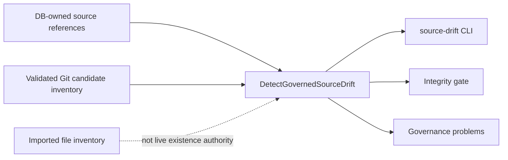

# Component integrity and rail vocabulary

Architecture Governance owns the component-integrity, filesystem-coverage,
architecture-drift, rail-vocabulary, duplicate-rail, component-profile,
code-symbol, governed-source-drift, and policy-validation read models. Existing
write rails record architecture relations, tests, observability, contracts,
ports, and component parentage through `scripts/planning-db-operate.cjs`.

Current query names include `ValidateComponentIntegrity`,
`ValidateComponentFilesystemCoverage`,
`ValidateRailVocabulary`, `DetectRailDuplicates`,
`CheckPlanningDbComponentIntegrity`, `InspectCodeSymbolInventory`,
`DetectCodeSymbolDuplicates`, `DetectGovernedSourceDrift`,
`ValidateContractReferences`, and `ValidateRfc2119Language`.

## Governed source existence and Git authority

`DetectGovernedSourceDrift` is the existing read-only query owned by
`GovernedSourceDriftReadModel` in Architecture Governance. Its application port
is `readSourceDriftRows`, exposed by `planning:db:query source-drift` and consumed
by the integrity gate. The governance-problems dashboard composes the same
query. Repository-local access uses the existing Planning DB credentials; this
query grants no additional write or product authorization.

Planning DB supplies source references and their counts from the existing rail
tables. Git supplies file existence. The imported `governance_files` inventory
must not decide whether a source exists in the candidate being validated.

```mermaid
flowchart LR
  References[DB-owned source references] --> Query[DetectGovernedSourceDrift]
  Candidate[Validated Git candidate inventory] --> Query
  Query --> CLI[source-drift CLI]
  Query --> Integrity[Integrity gate]
  Query --> Dashboard[Governance problems]
  Imported[Imported file inventory] -. not live existence authority .-> Query
```

The query reuses `FeatureMechanizationGitDiffReader`. With explicit `GIT_HEAD`,
it reads that exact commit, independently of the current checkout or local
files. Without explicit `GIT_HEAD`, it uses the existing local candidate
semantics: tracked, staged and non-ignored untracked files that still exist.
Unstaged deletions remain absent. Missing Git refs, Git failures and unavailable
DB authority reject the query; none may become an empty successful result.

Every governed reference is compared before result filtering and limiting.
The existing external HTTP(S) and `.generated-docs/` exclusions, severity,
reference counts and zero-tolerance integrity baseline remain unchanged.
The dashboard replaces only its imported source-drift branch with this same
query; other diagnostic branches remain DB-owned. No schema change or routine
import is needed. A genuinely missing source remains an error to reconcile
explicitly, not a reason to restore deleted documents or increase tolerances.

| Scenario                                         | Opportunity / pattern                | DDD owner / rail                                         | Surfaces                                                                                                                | Required proof                                                                                                                                                  | Out of scope                                                                       |
| ------------------------------------------------ | ------------------------------------ | -------------------------------------------------------- | ----------------------------------------------------------------------------------------------------------------------- | --------------------------------------------------------------------------------------------------------------------------------------------------------------- | ---------------------------------------------------------------------------------- |
| Validate source references against the candidate | Hidden authority / query composition | GovernedSourceDriftReadModel / DetectGovernedSourceDrift | Dedicated source-drift query; existing query CLI, integrity and dashboard consumers; query tests and local test routing | Added/deleted Git files, local versus exact HEAD, stale DB inventory in both directions, Git/DB failure, filters and post-comparison limit, dashboard agreement | Imports, schema rebuild, product data, relaxed baselines, silent source retirement |

The regression proof uses isolated real Git repositories and the actual query
against PostgreSQL with bound candidate paths. It does not create another file
inventory cache or a success fallback for missing authority.

All DDL, functions, and views are declared only in
`tools/planning-db/schema.sql`. Current components, relations, responsibilities,
and rail evidence live only in Planning DB and are read through governed
queries. Validation is
`node --test scripts/planning-db-integrity-check.test.cjs scripts/planning-db-query.test.cjs scripts/planning-db-operate.test.cjs scripts/planning-db-current-schema-policy.test.cjs`
and `pnpm verify:prepush`.
